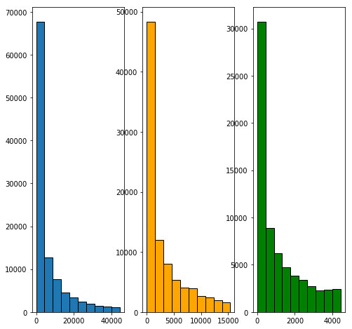
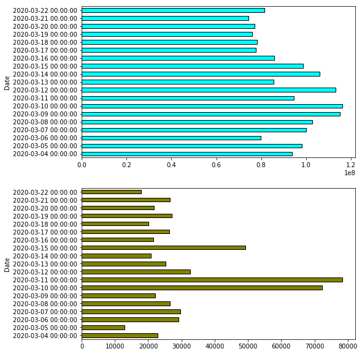
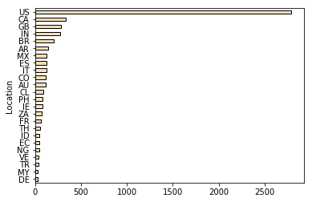
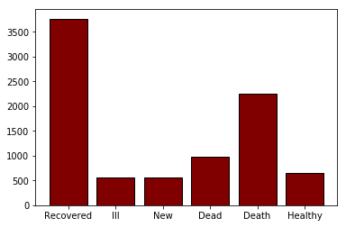

# COVID-19 and Social Media

Epidemija COVID-19 se v trenutnem ćasu razširja na pandemijo, ljudje so v samoizolaciji, nekateri trpijo kot direktna posledica, nekateri pa indirektno. Projekt smo pričeli z kreiranjem podatkovne mnozice, katero smo pretransformirali v uporabno obliko, poleg tega, pa smo tudi uporabili nekatere podatkovne mnozice na Kaggle za natanćne statistike širjenja števila okužb, ozdravelih in mrtvih posameznikov.

Zadnjih nekaj tednov smo se sestali preko raznih medijev in skongruirali 3 razlićne vire v 3 lastne podatkovne množice ter nato iz njih naredili še tri bolj uporabne, katere so posledica uporabe metod naravnega procesiranja jezika nad prvotnimi množicami.

Radi bi razdelili napredek na tri glavne faze, vsaka od njih je vzela doloćen ćas, već podrobnosti pa v nadaljnih sekcijah.

## 1. faza: Webscrape API za socialne medije
Po doloćenih ovirah smo se odloćili za Twitter, Reddit ter GTrends, saj so se nam zdeli najbolj zanimivi. Moramo izpostaviti, da taki API-ji, ki ponujajo moznost pridobivanja tekstovne vsebine objav so precej omejeni s klici, poleg tega, smo pa morali to prilagoditi ćasovnem intervalu za nekaj mesecov nazaj, zato je ta faza bila tudi najdaljša.

# Reddit - https://pushshift.io/
Gledali smo zgolj primerne subreddit-e, ker bi bilo drugaće zbiranje podatkov drastićno predolg proces za namene tega projekta.
## Analiza podatkov
Najprej smo pridobljene podatke poslali cez Text Analysis and Sentiment Recognition API-ja, katera bosta opisana nižje, namreć smo želeli malce već ne-tekstovnih podatkov. 
Pridobimo množico, ki vsebuje:
Datum, Ocena Komentarja, Ocena Submmissiona, Naslov Submissiona, Text Komentarja
Ter poleg vseh teh tudi atribute za prisotnost nekaj ćez 150 najpogosteje omenjenih kljućnih besed ter sentimentalno oceno.
Za kljućne besede smo izbrali:
```
'coronavirus', 'people',  'questions',  'comments',  'cases',  'one',  'reports',  'videos',  'suggestions',  'images',  'theories',  'daily discussion post',  'virus',  'china',  'italy',  'us',  'government',  'covid',  'country',  'covid-19',  'home',  'masks',  'accounts',  'coronavirus outbreak',  'deaths',  'trump',  'health',  'schools',  'testing',  'everyone',  'message',  'uk',  'action',  'u.s.',  'two',  'symptoms',  'moderators',  'hospital',  'usa',  'pandemic',  'subreddit',  'cdc',  'bot',  'thing',  'countries',  'way',  'sources',  'twitter',  'tests',  'policy',  'world',  'things',  'youtube',  'patients',  'numbers',  'president',  'all',  'number',  'politicians',  'chinese',  'info',  'flu',  'spread',  'case',  'ban',  'rules',  'everything',  'something',  'discussions',  'facebook',  'someone',  'lot',  'south korea',  'professionals',  'state',  'highlights',  'accusations',  'discretion',  'offences',  'attacks',  'repeat offenders',  'pages',  'support resources',  'daily discussion thread',  'advice.',  'giving',  'anyone',  'anything',  'work',  'americans',  'measures',  'hospitals',  'death',  'person',  'point',  'risk',  'nothing',  'europe',  'united states',  'wuhan',  'money',  'italian',  'doctors',  'quarantine',  'population',  'state of emergency',  'test',  'distancing',  'man',  'information',  'article',  'outbreak',  'situation',  'children',  'reason',  'school',  'lockdown',  'source',  'times',  'response',  'restaurants',  'thousands',  'supplies',  'others',  'bars',  'no one',  'kids',  'life',  'area',  'vaccine',  'shit',  'america',  '1 million',  'coronavirus test',  'infections',  'news',  'gatherings',  'herd immunity',  'total',  'france',  'job',  'officials',  'post',  'employees',  'four',  'emergency',  'states',  'coronavirus cases',  'corona',  'experts',  'scientists',  'hands',  'events',  'germany',  'some',  'travel ban',  'link',  'friends',  'british',  'ohio',  'australia',  'disease',  'idea',  'food',  'india',  'nyc',  'many',  'contact',  'wife',  'staff',  'family',  'part',  'more',  'lives',  'spain',  'who',  'crisis',  'place',  'posts',  'nba',  'test kits',  'thanks',  'american',  'flight',  'doctor',  'rome',  'community',  'house',  'economy',  'boomers',  'zero',  'fact',  'order',  'guy',  'icu',  'curve',  'problem',  'sense'
```
Po obdelavi dobimo naslednjo podatkovno množico:
<div>
<table border="1" class="dataframe">
  <thead>
    <tr style="text-align: right;">
      <th></th>
      <th>id</th>
      <th>date</th>
      <th>comment_score</th>
      <th>submission_score</th>
      <th>negative</th>
      <th>neutral</th>
      <th>positive</th>
      <th>people</th>
      <th>coronavirus</th>
      <th>questions</th>
      <th>...</th>
      <th>economy</th>
      <th>boomers</th>
      <th>zero</th>
      <th>fact</th>
      <th>order</th>
      <th>guy</th>
      <th>icu</th>
      <th>curve</th>
      <th>problem</th>
      <th>sense</th>
    </tr>
  </thead>
  <tbody>
    <tr>
      <th>0</th>
      <td>0</td>
      <td>2020-03-16</td>
      <td>1</td>
      <td>1</td>
      <td>0</td>
      <td>1</td>
      <td>0</td>
      <td>1</td>
      <td>0</td>
      <td>0</td>
      <td>...</td>
      <td>0</td>
      <td>0</td>
      <td>0</td>
      <td>0</td>
      <td>0</td>
      <td>0</td>
      <td>0</td>
      <td>0</td>
      <td>0</td>
      <td>0</td>
    </tr>
    <tr>
      <th>1</th>
      <td>1</td>
      <td>2020-03-16</td>
      <td>1</td>
      <td>1</td>
      <td>0</td>
      <td>0</td>
      <td>1</td>
      <td>0</td>
      <td>0</td>
      <td>0</td>
      <td>...</td>
      <td>0</td>
      <td>0</td>
      <td>0</td>
      <td>0</td>
      <td>0</td>
      <td>0</td>
      <td>0</td>
      <td>0</td>
      <td>0</td>
      <td>0</td>
    </tr>
    <tr>
      <th>2</th>
      <td>2</td>
      <td>2020-03-16</td>
      <td>1</td>
      <td>1</td>
      <td>0</td>
      <td>1</td>
      <td>0</td>
      <td>0</td>
      <td>0</td>
      <td>0</td>
      <td>...</td>
      <td>0</td>
      <td>0</td>
      <td>0</td>
      <td>0</td>
      <td>0</td>
      <td>0</td>
      <td>0</td>
      <td>0</td>
      <td>0</td>
      <td>0</td>
    </tr>
    <tr>
      <th>3</th>
      <td>3</td>
      <td>2020-03-16</td>
      <td>1</td>
      <td>1</td>
      <td>1</td>
      <td>0</td>
      <td>0</td>
      <td>0</td>
      <td>1</td>
      <td>0</td>
      <td>...</td>
      <td>0</td>
      <td>0</td>
      <td>0</td>
      <td>0</td>
      <td>1</td>
      <td>0</td>
      <td>0</td>
      <td>0</td>
      <td>0</td>
      <td>0</td>
    </tr>
    <tr>
      <th>4</th>
      <td>4</td>
      <td>2020-03-16</td>
      <td>1</td>
      <td>1</td>
      <td>1</td>
      <td>0</td>
      <td>0</td>
      <td>0</td>
      <td>0</td>
      <td>0</td>
      <td>...</td>
      <td>0</td>
      <td>0</td>
      <td>0</td>
      <td>0</td>
      <td>0</td>
      <td>0</td>
      <td>0</td>
      <td>0</td>
      <td>0</td>
      <td>0</td>
    </tr>
    <tr>
      <th>...</th>
      <td>...</td>
      <td>...</td>
      <td>...</td>
      <td>...</td>
      <td>...</td>
      <td>...</td>
      <td>...</td>
      <td>...</td>
      <td>...</td>
      <td>...</td>
      <td>...</td>
      <td>...</td>
      <td>...</td>
      <td>...</td>
      <td>...</td>
      <td>...</td>
      <td>...</td>
      <td>...</td>
      <td>...</td>
      <td>...</td>
      <td>...</td>
    </tr>
    <tr>
      <th>9995</th>
      <td>9995</td>
      <td>2020-03-12</td>
      <td>1</td>
      <td>1</td>
      <td>0</td>
      <td>1</td>
      <td>0</td>
      <td>0</td>
      <td>0</td>
      <td>1</td>
      <td>...</td>
      <td>0</td>
      <td>0</td>
      <td>0</td>
      <td>0</td>
      <td>0</td>
      <td>0</td>
      <td>0</td>
      <td>0</td>
      <td>0</td>
      <td>0</td>
    </tr>
    <tr>
      <th>9996</th>
      <td>9996</td>
      <td>2020-03-12</td>
      <td>1</td>
      <td>1</td>
      <td>0</td>
      <td>1</td>
      <td>0</td>
      <td>0</td>
      <td>1</td>
      <td>0</td>
      <td>...</td>
      <td>0</td>
      <td>0</td>
      <td>0</td>
      <td>0</td>
      <td>0</td>
      <td>0</td>
      <td>0</td>
      <td>0</td>
      <td>0</td>
      <td>0</td>
    </tr>
    <tr>
      <th>9997</th>
      <td>9997</td>
      <td>2020-03-12</td>
      <td>1</td>
      <td>1</td>
      <td>0</td>
      <td>1</td>
      <td>0</td>
      <td>0</td>
      <td>0</td>
      <td>1</td>
      <td>...</td>
      <td>0</td>
      <td>0</td>
      <td>0</td>
      <td>0</td>
      <td>0</td>
      <td>0</td>
      <td>0</td>
      <td>0</td>
      <td>0</td>
      <td>0</td>
    </tr>
    <tr>
      <th>9998</th>
      <td>9998</td>
      <td>2020-03-12</td>
      <td>1</td>
      <td>1</td>
      <td>0</td>
      <td>1</td>
      <td>0</td>
      <td>0</td>
      <td>0</td>
      <td>0</td>
      <td>...</td>
      <td>0</td>
      <td>0</td>
      <td>0</td>
      <td>0</td>
      <td>0</td>
      <td>0</td>
      <td>0</td>
      <td>0</td>
      <td>0</td>
      <td>0</td>
    </tr>
    <tr>
      <th>9999</th>
      <td>9999</td>
      <td>2020-03-12</td>
      <td>1</td>
      <td>1</td>
      <td>0</td>
      <td>1</td>
      <td>0</td>
      <td>0</td>
      <td>1</td>
      <td>0</td>
      <td>...</td>
      <td>0</td>
      <td>0</td>
      <td>0</td>
      <td>0</td>
      <td>0</td>
      <td>0</td>
      <td>0</td>
      <td>0</td>
      <td>0</td>
      <td>0</td>
    </tr>
  </tbody>
</table>
</div>

Še statistika podatkovne množice:
<div>
<table border="1" class="dataframe">
  <thead>
    <tr style="text-align: right;">
      <th></th>
      <th>id</th>
      <th>comment_score</th>
      <th>submission_score</th>
      <th>negative</th>
      <th>neutral</th>
      <th>positive</th>
      <th>people</th>
      <th>coronavirus</th>
      <th>questions</th>
      <th>comments</th>
      <th>...</th>
      <th>economy</th>
      <th>boomers</th>
      <th>zero</th>
      <th>fact</th>
      <th>order</th>
      <th>guy</th>
      <th>icu</th>
      <th>curve</th>
      <th>problem</th>
      <th>sense</th>
    </tr>
  </thead>
  <tbody>
    <tr>
      <th>count</th>
      <td>10000.00000</td>
      <td>10000.000000</td>
      <td>10000.000000</td>
      <td>10000.000000</td>
      <td>10000.000000</td>
      <td>10000.00000</td>
      <td>10000.000000</td>
      <td>10000.000000</td>
      <td>10000.000000</td>
      <td>10000.00000</td>
      <td>...</td>
      <td>10000.000000</td>
      <td>10000.000000</td>
      <td>10000.000000</td>
      <td>10000.000000</td>
      <td>10000.000000</td>
      <td>10000.000000</td>
      <td>10000.0000</td>
      <td>10000.000000</td>
      <td>10000.000000</td>
      <td>10000.000000</td>
    </tr>
    <tr>
      <th>mean</th>
      <td>4999.50000</td>
      <td>1.666200</td>
      <td>1.318000</td>
      <td>-4.623600</td>
      <td>-4.459800</td>
      <td>-4.91560</td>
      <td>0.198300</td>
      <td>0.126700</td>
      <td>0.037500</td>
      <td>0.11420</td>
      <td>...</td>
      <td>0.009800</td>
      <td>0.001400</td>
      <td>0.004500</td>
      <td>0.009600</td>
      <td>0.009700</td>
      <td>0.009400</td>
      <td>0.0001</td>
      <td>0.009500</td>
      <td>0.009400</td>
      <td>0.009800</td>
    </tr>
    <tr>
      <th>std</th>
      <td>2886.89568</td>
      <td>9.168979</td>
      <td>3.523821</td>
      <td>223.548644</td>
      <td>223.552338</td>
      <td>223.54176</td>
      <td>0.398739</td>
      <td>0.332653</td>
      <td>0.189993</td>
      <td>0.31807</td>
      <td>...</td>
      <td>0.098514</td>
      <td>0.037392</td>
      <td>0.066934</td>
      <td>0.097513</td>
      <td>0.098015</td>
      <td>0.096502</td>
      <td>0.0100</td>
      <td>0.097009</td>
      <td>0.096502</td>
      <td>0.098514</td>
    </tr>
    <tr>
      <th>min</th>
      <td>0.00000</td>
      <td>-39.000000</td>
      <td>0.000000</td>
      <td>-9999.000000</td>
      <td>-9999.000000</td>
      <td>-9999.00000</td>
      <td>0.000000</td>
      <td>0.000000</td>
      <td>0.000000</td>
      <td>0.00000</td>
      <td>...</td>
      <td>0.000000</td>
      <td>0.000000</td>
      <td>0.000000</td>
      <td>0.000000</td>
      <td>0.000000</td>
      <td>0.000000</td>
      <td>0.0000</td>
      <td>0.000000</td>
      <td>0.000000</td>
      <td>0.000000</td>
    </tr>
    <tr>
      <th>25%</th>
      <td>2499.75000</td>
      <td>1.000000</td>
      <td>1.000000</td>
      <td>0.000000</td>
      <td>0.000000</td>
      <td>0.00000</td>
      <td>0.000000</td>
      <td>0.000000</td>
      <td>0.000000</td>
      <td>0.00000</td>
      <td>...</td>
      <td>0.000000</td>
      <td>0.000000</td>
      <td>0.000000</td>
      <td>0.000000</td>
      <td>0.000000</td>
      <td>0.000000</td>
      <td>0.0000</td>
      <td>0.000000</td>
      <td>0.000000</td>
      <td>0.000000</td>
    </tr>
    <tr>
      <th>50%</th>
      <td>4999.50000</td>
      <td>1.000000</td>
      <td>1.000000</td>
      <td>0.000000</td>
      <td>1.000000</td>
      <td>0.00000</td>
      <td>0.000000</td>
      <td>0.000000</td>
      <td>0.000000</td>
      <td>0.00000</td>
      <td>...</td>
      <td>0.000000</td>
      <td>0.000000</td>
      <td>0.000000</td>
      <td>0.000000</td>
      <td>0.000000</td>
      <td>0.000000</td>
      <td>0.0000</td>
      <td>0.000000</td>
      <td>0.000000</td>
      <td>0.000000</td>
    </tr>
    <tr>
      <th>75%</th>
      <td>7499.25000</td>
      <td>1.000000</td>
      <td>1.000000</td>
      <td>1.000000</td>
      <td>1.000000</td>
      <td>0.00000</td>
      <td>0.000000</td>
      <td>0.000000</td>
      <td>0.000000</td>
      <td>0.00000</td>
      <td>...</td>
      <td>0.000000</td>
      <td>0.000000</td>
      <td>0.000000</td>
      <td>0.000000</td>
      <td>0.000000</td>
      <td>0.000000</td>
      <td>0.0000</td>
      <td>0.000000</td>
      <td>0.000000</td>
      <td>0.000000</td>
    </tr>
    <tr>
      <th>max</th>
      <td>9999.00000</td>
      <td>558.000000</td>
      <td>70.000000</td>
      <td>1.000000</td>
      <td>1.000000</td>
      <td>1.00000</td>
      <td>1.000000</td>
      <td>1.000000</td>
      <td>1.000000</td>
      <td>1.00000</td>
      <td>...</td>
      <td>1.000000</td>
      <td>1.000000</td>
      <td>1.000000</td>
      <td>1.000000</td>
      <td>1.000000</td>
      <td>1.000000</td>
      <td>1.0000</td>
      <td>1.000000</td>
      <td>1.000000</td>
      <td>1.000000</td>
    </tr>
  </tbody>
</table>
</div>


## Priprava podatkov
Redditov lastni API, ki ponuja poleg agregiranih statistik, tudi moznost pridobivanja vsebin tako-imenovanih 'submission'-ov ter komentarjev. Podatki so skonstruirani na naslednji naćin:

Datum, Ocena Komentarja, Ocena Submmissiona, Naslov Submissiona, Text Komentarja

Po zgornjem formatu imamo trenutno podatke od 16. marca do 27. januarja tega leta. 
Naslednji odsek kode je bil uporabljen za zgradbo te množice, veliko je olajšal delo modul psaw:
```Python
from psaw import PushshiftAPI
import datetime as dt
import csv
api = PushshiftAPI()
start_epoch=int(dt.datetime(2020, 1, 1, 0, 0, 0).timestamp())
before = int(dt.datetime(2020, 1, 21, 2, 0, 0).timestamp())

 
cache = 0
f =  open(r'reddit21.csv', 'w')
writer = csv.writer(f)
while( before>start_epoch ):
    gen = api.search_comments(after=start_epoch, before=before,  subreddit="Coronavirus")
    for c in gen:
        print(cache)
        print(dt.datetime.fromtimestamp( c.created_utc ))
        submission = list(api.search_submissions(ids = [c.link_id.split("_")[1]]))
        if(len(submission)>0):
            submission = submission[0]
        else:
            continue
        writer.writerow([ dt.datetime.fromtimestamp( c.created_utc ).date(), c.score, submission.score, (submission.title).replace("\n"," ") , (c.body).replace("\n"," ") ])
        #before = c.created_utc 
        cache += 1   
        if( cache%105==0 ):
            before -= 60 * 60
            gen = api.search_comments(after=start_epoch, before=before,  subreddit="Coronavirus")
```

# Twitter
## Analiza podatkov o Tweetih iz strani Kaggle

Medtem ko se pripravlja naša baza z Tweeti od 1.1.2020 do 16.3.2020, ki vsebuje vzorec šest tisočih Tweetov iz vsakega dneva, ki omenjajo Koronavirus. Za sprotno poročilo smo se odločili da naredimo hitro analizo na tovrstnih podatkih iz Kaggla, ki jih nato lahko uporabimo za primerjavo kasneje z našimi podatki. V ta namen smo Kagglovo bazo pretvorili v format, ki smo ga izbrali tudi mi za našo bazo: Datum - Lokacija - Tweet - Število všečkov - Število retweetov. Odločili smo se, da nad temi podatki naredimo hitro analizo, tako da imamo neko primerjavo z našimi podatki, kot da dobimo in se seznanimo z vrsto podatkov. Kaggle baza je sicer zgolj za marec, od prvega do dvaindvajsetega, vzeli smo pa prav tako vzorec prvih 6000 Tweetov iz vsake csv datoteke, kjer smo za prvo izbrali 6000 za vsak dan in dobili 114000 tweetov velik vzorec.

## Pregled osnovnih statističnih podatkov

Najbolj osnovna statistika, ki jo lahko pregledamo je povprečno število všečkov in retweetov na tweet, ter povprečni standardni odklon le teh.
Dobimo rezultate da je povprečje všečkov na tweet 15391.429 s standardnim odklonom 43243.936, za retweet-e pa dobimo rezultate da je povprečnje na tweet 5.115 s standardnim odklonom 138.549. Iz tega vidimo da je pri obeh velik standardni odklon. Seveda je to tudi nekako pričakovano saj imajo različni računi različno število sledilcev in posledično različno "prometa", ki gre čez njihov račun. Lahko razberemo, da je takih, ki imajo manj sledilcev veliko več kot pa teh z velikim številom le teh. Takih podatkov kot je število sledilcev, ali je račun potrjen itd. v naši bazi ne bomo imeli, je pa zanimivo razmisliti kako vplivajo na podatke.

Podatke lahko predstavimo kot da gre za normalno porazdelitev. Če to storimo lahko bodimo nasledne grafe.

Vidimo da število tweetov glede na število všečkov, praktično logaritmično pada z večjim število všečkov. To je uvidno tako v tweetih, ki imajo okoli 4000 všečkovi in manj (zeleni graf) kot na tistih, ki imajo okoli 40000 všečkov in manj (modri graf). Pri vseh treh percentilih za katere smo naredili graf po normalni porazdelitvi, torej 75-percentil, 50-percentil in 40-percentil, se opazi enak vzorec padanja števila tweetov z večjih številom všečkov. 

Zanima nas tudi število všečkov in retweetov glede na posamezni dan, tako lahko nekako vidimo kako je potek "promet".

Če "promet" po določenem dnevu opredelimo kot seštevek všečkov in retweetov, vidimo da je bilo največ prometa okoli desetega ali pa enajstega marca. Ker bodo te dnevi prisotni tudi v naši bazi, bomo lahko na podlagi tega naredili primerjave med načinon zajemanja podatkov, ki smo ga uporabili mi, in tem, ki so ga uporabili za Kaggle baze.

Ker bomo v naših podatkih pregledovali tudi tweete glede na lokacije, nas zanima, kako so loakcije razporejene v Kaggle bazah. Kar nam vrne spodnji graf.

Iz vseh 114000 tweetov, ki smo jih vzeli za vzorec, jih je le 5976 imelo navedeno lokacijo. Izmed teh 5976 tweetov dobimo 111 različnih držav. Te smo za potrebe grafa omejili na tiste, ki so imeli več kot 30 tweetov v obdobju od prvega do dvaindvajsetega marca. Izkaže se da je takih le 24. Izmed teh 24 se vidi da Amerika množično prevladuje, sledita ji še Kanda in Velika Britanija, torej še dve angleško govoreči državi, ampak Ameriki nista blizu. To je podatek, ki ga bomo tudi mi lahko spremljaji v naši bazi, in ga primerjali s podatki, ki smo jih dobili iz Kaggle-ove baze. 

Za zaključek, lahko te podatke še simplistično pregledamo na podlagi vsebine samega tweeta. Zanima nas naprimer koliko ljudje govorijo o obolelih, o novih primerih, o smrtih in ozdravelih. Iz teh podatkov dobimo nasledni graf. 

Iz njega lahko vidimo da jih največ (po našem zelo omejenem iskanju) govori o teh, ki so ozdraveli, temu pa sledijo tweeti, ki vsebujejo besedo death. Z hitrim pogledom v podatke vidimo, da gre pri teh tweetih dejansko za avtomatiziran profil, ki objavlja statusne spremembe.

## Priprava naše podatkovne baze
Našo podatkovno bazo bomo pripravili z pomočjo twitter scrapperja in ne direktno z uporabo Twitter API. Uporabili bomo twint, GitHub modul, ki je namenjen javni uporabi. Ima opcijo iskanja tako po besedah kot po uporabnikih. Koda za samo proces pridobivanja podatkov je bila sledeča:
```python
import twint

c = twint.Config()
c.Search = "\"COVID-19\" OR \"Coronavirus\" OR \"SARS-CoV-2\""
c.Output = "searches.csv"
c.Stats = True
c.Since = since.strftime("2020-01-01")
c.Until = (since + datetime.timedelta(1)).strftime("2020-01-02")
c.Limit = 6000
#c.Hide_output = True
c.Store_csv = True
twint.run.Search(c)
```
Kodo smo pognali za vsak dan posebaj do 15.3.2020, tako da smo dobili vzorec 6000 tweetov dnevno. To pa za potrebe naše analize ni zadostovalo saj ne vsebuje lokacije. Na srečo nam pa twint omogoča pogledati lokacijo uporabnika, ki je objavil tweet. 

Ko smo enkrat imeli vse tweete za našo bazo smo morali dati vse še čez program, ki je za vsak tweet pogledal njegovo lokacijo. To smo zapisali v txt datoteko, nato pa iz nje prebrali to vrednost in jo shraili v csv, katerega bomo kasneje uporabili za analizo vseh podatkov. Ker je nekaj uporabnikov, ki imajo za lokacijo podano nekaj kar ni realna geografska lokacija, bomo ob končanem preračunavanju lokacij, morali še pregledati katere lokacije so pravilne. To lahko storimo z python modulom GeoPy, ki nam ne bo vrnil vrednosti, če lokacija ne bo pravilna. S pomočjo tega bomo nato lahko izvedli analizo nad podatki glede na države.

# Gtrends

Google trends je spletna stran kjer Google objavlja podatke o najbolj iskanih izrazih in omogoča iskanje podatkov o iskanosti posameznih izrazov glede na čas, regije, province, mesta in države. Vrednost iskanosti je normalizirana na vrednost od 0 do 100 glede na delež vseh iskanj pri danih pogojih in predstavlja relativno popularnosti iskanosti izraza. Enaka vrednost pri isti pogojih za dve različni državi to ne pomeni enako število iskanj. Google trends malo iskane izraze označi z 0, tiste z posebnimi znaki (npr apostrofi= in tiste, ki jih uporabnik v kratkem času velikokrat ponovi pa ne upošteva. Za to spletno stran obstaja API Pytrends, ki z pythonom omogoči avtomatizacijo poizvedb. Ker ima tudi arhiv popularnosti poizvedb sem spisal program, ki za vsak dan od 1.1.2020 do izbranega datuma najde popularnost poizvedb za vse države in teritorije sveta in jih spravi v pandas dataframe, ter ga združi z tabelami prejšnjih dni.Zbrane podatke zapiše v CSV datoteko.

# Vizualization

```python
import numpy as np
import pandas as pd
import plotly as py
import plotly.express as px
import plotly.graph_objs as go
from plotly.subplots import make_subplots
from plotly.offline import download_plotlyjs, init_notebook_mode, plot, iplot
```

### Prikaz širjenja COVID-19
Uporabili smo dataset iz Kaggle, ki vsebuje podatke do 3.31.2020. Kasneje bomo seveda uporabili novejši dataset. Želimo primerjati dejansko širjenje COVID-19 ter kako se je širila panika po socialnih omrežjih.


```python

#load csv, sort by date, get rid of nan
#Province/State,Country/Region,Lat,Long,Date,Confirmed,Deaths,Recovered
data = pd.read_csv('data\covid_19_data.csv')
data = data.rename(columns={'ObservationDate':'Date'})
data= data.groupby(['Country/Region', 'Date']).max().reset_index().sort_values('Date', ascending=False)
#data['Date'] = pd.to_datetime(data['Date'])
#data = data.sort_values('Date', ascending=True)
# replace NaN Provinces with string
#data['Province/State'] = data['Province/State'].fillna('No_Province')

data2 = data[data['Confirmed']>0]
data2 = data2.groupby(['Date','Country/Region']).sum().reset_index()
#data2['Date'] = pd.to_string(data2['Date'])
data2

```


<div>
<table border="1" class="dataframe">
  <thead>
    <tr style="text-align: right;">
      <th></th>
      <th>Date</th>
      <th>Country/Region</th>
      <th>SNo</th>
      <th>Confirmed</th>
      <th>Deaths</th>
      <th>Recovered</th>
    </tr>
  </thead>
  <tbody>
    <tr>
      <th>0</th>
      <td>01/22/2020</td>
      <td>Japan</td>
      <td>36</td>
      <td>2.0</td>
      <td>0.0</td>
      <td>0.0</td>
    </tr>
    <tr>
      <th>1</th>
      <td>01/22/2020</td>
      <td>Macau</td>
      <td>21</td>
      <td>1.0</td>
      <td>0.0</td>
      <td>0.0</td>
    </tr>
    <tr>
      <th>2</th>
      <td>01/22/2020</td>
      <td>Mainland China</td>
      <td>35</td>
      <td>444.0</td>
      <td>17.0</td>
      <td>28.0</td>
    </tr>
    <tr>
      <th>3</th>
      <td>01/22/2020</td>
      <td>South Korea</td>
      <td>38</td>
      <td>1.0</td>
      <td>0.0</td>
      <td>0.0</td>
    </tr>
    <tr>
      <th>4</th>
      <td>01/22/2020</td>
      <td>Taiwan</td>
      <td>29</td>
      <td>1.0</td>
      <td>0.0</td>
      <td>0.0</td>
    </tr>
    <tr>
      <th>...</th>
      <td>...</td>
      <td>...</td>
      <td>...</td>
      <td>...</td>
      <td>...</td>
      <td>...</td>
    </tr>
    <tr>
      <th>5461</th>
      <td>03/31/2020</td>
      <td>Venezuela</td>
      <td>10530</td>
      <td>135.0</td>
      <td>3.0</td>
      <td>39.0</td>
    </tr>
    <tr>
      <th>5462</th>
      <td>03/31/2020</td>
      <td>Vietnam</td>
      <td>10531</td>
      <td>212.0</td>
      <td>0.0</td>
      <td>58.0</td>
    </tr>
    <tr>
      <th>5463</th>
      <td>03/31/2020</td>
      <td>West Bank and Gaza</td>
      <td>10532</td>
      <td>119.0</td>
      <td>1.0</td>
      <td>18.0</td>
    </tr>
    <tr>
      <th>5464</th>
      <td>03/31/2020</td>
      <td>Zambia</td>
      <td>10533</td>
      <td>35.0</td>
      <td>0.0</td>
      <td>0.0</td>
    </tr>
    <tr>
      <th>5465</th>
      <td>03/31/2020</td>
      <td>Zimbabwe</td>
      <td>10534</td>
      <td>8.0</td>
      <td>1.0</td>
      <td>0.0</td>
    </tr>
  </tbody>
</table>
<p>5466 rows × 6 columns</p>
</div>


```python
fig = px.choropleth(data2, 
                    locations="Country/Region", 
                    locationmode = "country names",
                    color="Confirmed",
                    color_continuous_scale="Viridis",
                    hover_name="Country/Region", 
                    animation_frame="Date"
                   )

fig.update_layout(
    title_text = 'Spread of Coronavirus',
    title_x = 0.5,
    geo=dict(
        showframe = False,
        showcoastlines = False,
    ))
    
fig.show()
```


<div>


            <div id="460428b6-c4b1-411d-9398-69ddaf43aad7" class="plotly-graph-div" style="height:525px; width:100%;"></div>
            <script type="text/javascript">
                require(["plotly"], function(Plotly) {
                    window.PLOTLYENV=window.PLOTLYENV || {};

                if (document.getElementById("460428b6-c4b1-411d-9398-69ddaf43aad7")) {
                    Plotly.newPlot(
                        '460428b6-c4b1-411d-9398-69ddaf43aad7',
                        [{"coloraxis": "coloraxis", "geo": "geo", "hoverlabel": {"namelength": 0}, "hovertemplate": "<b>%{hovertext}</b><br><br>Date=01/22/2020<br>Country/Region=%{location}<br>Confirmed=%{z}", "hovertext": ["Japan", "Macau", "Mainland China", "South Korea", "Taiwan", "Thailand", "US"], "locationmode": "country names", "locations": ["Japan", "Macau", "Mainland China", "South Korea", "Taiwan", "Thailand", "US"], "name": "", "type": "choropleth", "z": [2.0, 1.0, 444.0, 1.0, 1.0, 2.0, 1.0]}],
                        {"coloraxis": {"colorbar": {"title": {"text": "Confirmed"}}, "colorscale": [[0.0, "#440154"], [0.1111111111111111, "#482878"], [0.2222222222222222, "#3e4989"], [0.3333333333333333, "#31688e"], [0.4444444444444444, "#26828e"], [0.5555555555555556, "#1f9e89"], [0.6666666666666666, "#35b779"], [0.7777777777777778, "#6ece58"], [0.8888888888888888, "#b5de2b"], [1.0, "#fde725"]]}, "geo": {"center": {}, "domain": {"x": [0.0, 1.0], "y": [0.0, 1.0]}, "showcoastlines": false, "showframe": false}, "legend": {"tracegroupgap": 0}, "margin": {"t": 60}, "sliders": [{"active": 0, "currentvalue": {"prefix": "Date="}, "len": 0.9, "pad": {"b": 10, "t": 60}, "steps": [{"args": [["01/22/2020"], {"frame": {"duration": 0, "redraw": true}, "fromcurrent": true, "mode": "immediate", "transition": {"duration": 0, "easing": "linear"}}], "label": "01/22/2020", "method": "animate"}, {"args": [["01/23/2020"], {"frame": {"duration": 0, "redraw": true}, "fromcurrent": true, "mode": "immediate", "transition": {"duration": 0, "easing": "linear"}}], "label": "01/23/2020", "method": "animate"}, {"args": [["01/24/2020"], {"frame": {"duration": 0, "redraw": true}, "fromcurrent": true, "mode": "immediate", "transition": {"duration": 0, "easing": "linear"}}], "label": "01/24/2020", "method": "animate"}, {"args": [["01/25/2020"], {"frame": {"duration": 0, "redraw": true}, "fromcurrent": true, "mode": "immediate", "transition": {"duration": 0, "easing": "linear"}}], "label": "01/25/2020", "method": "animate"}, {"args": [["01/26/2020"], {"frame": {"duration": 0, "redraw": true}, "fromcurrent": true, "mode": "immediate", "transition": {"duration": 0, "easing": "linear"}}], "label": "01/26/2020", "method": "animate"}, {"args": [["01/27/2020"], {"frame": {"duration": 0, "redraw": true}, "fromcurrent": true, "mode": "immediate", "transition": {"duration": 0, "easing": "linear"}}], "label": "01/27/2020", "method": "animate"}, {"args": [["01/28/2020"], {"frame": {"duration": 0, "redraw": true}, "fromcurrent": true, "mode": "immediate", "transition": {"duration": 0, "easing": "linear"}}], "label": "01/28/2020", "method": "animate"}, {"args": [["01/29/2020"], {"frame": {"duration": 0, "redraw": true}, "fromcurrent": true, "mode": "immediate", "transition": {"duration": 0, "easing": "linear"}}], "label": "01/29/2020", "method": "animate"}, {"args": [["01/30/2020"], {"frame": {"duration": 0, "redraw": true}, "fromcurrent": true, "mode": "immediate", "transition": {"duration": 0, "easing": "linear"}}], "label": "01/30/2020", "method": "animate"}, {"args": [["01/31/2020"], {"frame": {"duration": 0, "redraw": true}, "fromcurrent": true, "mode": "immediate", "transition": {"duration": 0, "easing": "linear"}}], "label": "01/31/2020", "method": "animate"}, {"args": [["02/01/2020"], {"frame": {"duration": 0, "redraw": true}, "fromcurrent": true, "mode": "immediate", "transition": {"duration": 0, "easing": "linear"}}], "label": "02/01/2020", "method": "animate"}, {"args": [["02/02/2020"], {"frame": {"duration": 0, "redraw": true}, "fromcurrent": true, "mode": "immediate", "transition": {"duration": 0, "easing": "linear"}}], "label": "02/02/2020", "method": "animate"}, {"args": [["02/03/2020"], {"frame": {"duration": 0, "redraw": true}, "fromcurrent": true, "mode": "immediate", "transition": {"duration": 0, "easing": "linear"}}], "label": "02/03/2020", "method": "animate"}, {"args": [["02/04/2020"], {"frame": {"duration": 0, "redraw": true}, "fromcurrent": true, "mode": "immediate", "transition": {"duration": 0, "easing": "linear"}}], "label": "02/04/2020", "method": "animate"}, {"args": [["02/05/2020"], {"frame": {"duration": 0, "redraw": true}, "fromcurrent": true, "mode": "immediate", "transition": {"duration": 0, "easing": "linear"}}], "label": "02/05/2020", "method": "animate"}, {"args": [["02/06/2020"], {"frame": {"duration": 0, "redraw": true}, "fromcurrent": true, "mode": "immediate", "transition": {"duration": 0, "easing": "linear"}}], "label": "02/06/2020", "method": "animate"}, {"args": [["02/07/2020"], {"frame": {"duration": 0, "redraw": true}, "fromcurrent": true, "mode": "immediate", "transition": {"duration": 0, "easing": "linear"}}], "label": "02/07/2020", "method": "animate"}, {"args": [["02/08/2020"], {"frame": {"duration": 0, "redraw": true}, "fromcurrent": true, "mode": "immediate", "transition": {"duration": 0, "easing": "linear"}}], "label": "02/08/2020", "method": "animate"}, {"args": [["02/09/2020"], {"frame": {"duration": 0, "redraw": true}, "fromcurrent": true, "mode": "immediate", "transition": {"duration": 0, "easing": "linear"}}], "label": "02/09/2020", "method": "animate"}, {"args": [["02/10/2020"], {"frame": {"duration": 0, "redraw": true}, "fromcurrent": true, "mode": "immediate", "transition": {"duration": 0, "easing": "linear"}}], "label": "02/10/2020", "method": "animate"}, {"args": [["02/11/2020"], {"frame": {"duration": 0, "redraw": true}, "fromcurrent": true, "mode": "immediate", "transition": {"duration": 0, "easing": "linear"}}], "label": "02/11/2020", "method": "animate"}, {"args": [["02/12/2020"], {"frame": {"duration": 0, "redraw": true}, "fromcurrent": true, "mode": "immediate", "transition": {"duration": 0, "easing": "linear"}}], "label": "02/12/2020", "method": "animate"}, {"args": [["02/13/2020"], {"frame": {"duration": 0, "redraw": true}, "fromcurrent": true, "mode": "immediate", "transition": {"duration": 0, "easing": "linear"}}], "label": "02/13/2020", "method": "animate"}, {"args": [["02/14/2020"], {"frame": {"duration": 0, "redraw": true}, "fromcurrent": true, "mode": "immediate", "transition": {"duration": 0, "easing": "linear"}}], "label": "02/14/2020", "method": "animate"}, {"args": [["02/15/2020"], {"frame": {"duration": 0, "redraw": true}, "fromcurrent": true, "mode": "immediate", "transition": {"duration": 0, "easing": "linear"}}], "label": "02/15/2020", "method": "animate"}, {"args": [["02/16/2020"], {"frame": {"duration": 0, "redraw": true}, "fromcurrent": true, "mode": "immediate", "transition": {"duration": 0, "easing": "linear"}}], "label": "02/16/2020", "method": "animate"}, {"args": [["02/17/2020"], {"frame": {"duration": 0, "redraw": true}, "fromcurrent": true, "mode": "immediate", "transition": {"duration": 0, "easing": "linear"}}], "label": "02/17/2020", "method": "animate"}, {"args": [["02/18/2020"], {"frame": {"duration": 0, "redraw": true}, "fromcurrent": true, "mode": "immediate", "transition": {"duration": 0, "easing": "linear"}}], "label": "02/18/2020", "method": "animate"}, {"args": [["02/19/2020"], {"frame": {"duration": 0, "redraw": true}, "fromcurrent": true, "mode": "immediate", "transition": {"duration": 0, "easing": "linear"}}], "label": "02/19/2020", "method": "animate"}, {"args": [["02/20/2020"], {"frame": {"duration": 0, "redraw": true}, "fromcurrent": true, "mode": "immediate", "transition": {"duration": 0, "easing": "linear"}}], "label": "02/20/2020", "method": "animate"}, {"args": [["02/21/2020"], {"frame": {"duration": 0, "redraw": true}, "fromcurrent": true, "mode": "immediate", "transition": {"duration": 0, "easing": "linear"}}], "label": "02/21/2020", "method": "animate"}, {"args": [["02/22/2020"], {"frame": {"duration": 0, "redraw": true}, "fromcurrent": true, "mode": "immediate", "transition": {"duration": 0, "easing": "linear"}}], "label": "02/22/2020", "method": "animate"}, {"args": [["02/23/2020"], {"frame": {"duration": 0, "redraw": true}, "fromcurrent": true, "mode": "immediate", "transition": {"duration": 0, "easing": "linear"}}], "label": "02/23/2020", "method": "animate"}, {"args": [["02/24/2020"], {"frame": {"duration": 0, "redraw": true}, "fromcurrent": true, "mode": "immediate", "transition": {"duration": 0, "easing": "linear"}}], "label": "02/24/2020", "method": "animate"}, {"args": [["02/25/2020"], {"frame": {"duration": 0, "redraw": true}, "fromcurrent": true, "mode": "immediate", "transition": {"duration": 0, "easing": "linear"}}], "label": "02/25/2020", "method": "animate"}, {"args": [["02/26/2020"], {"frame": {"duration": 0, "redraw": true}, "fromcurrent": true, "mode": "immediate", "transition": {"duration": 0, "easing": "linear"}}], "label": "02/26/2020", "method": "animate"}, {"args": [["02/27/2020"], {"frame": {"duration": 0, "redraw": true}, "fromcurrent": true, "mode": "immediate", "transition": {"duration": 0, "easing": "linear"}}], "label": "02/27/2020", "method": "animate"}, {"args": [["02/28/2020"], {"frame": {"duration": 0, "redraw": true}, "fromcurrent": true, "mode": "immediate", "transition": {"duration": 0, "easing": "linear"}}], "label": "02/28/2020", "method": "animate"}, {"args": [["02/29/2020"], {"frame": {"duration": 0, "redraw": true}, "fromcurrent": true, "mode": "immediate", "transition": {"duration": 0, "easing": "linear"}}], "label": "02/29/2020", "method": "animate"}, {"args": [["03/01/2020"], {"frame": {"duration": 0, "redraw": true}, "fromcurrent": true, "mode": "immediate", "transition": {"duration": 0, "easing": "linear"}}], "label": "03/01/2020", "method": "animate"}, {"args": [["03/02/2020"], {"frame": {"duration": 0, "redraw": true}, "fromcurrent": true, "mode": "immediate", "transition": {"duration": 0, "easing": "linear"}}], "label": "03/02/2020", "method": "animate"}, {"args": [["03/03/2020"], {"frame": {"duration": 0, "redraw": true}, "fromcurrent": true, "mode": "immediate", "transition": {"duration": 0, "easing": "linear"}}], "label": "03/03/2020", "method": "animate"}, {"args": [["03/04/2020"], {"frame": {"duration": 0, "redraw": true}, "fromcurrent": true, "mode": "immediate", "transition": {"duration": 0, "easing": "linear"}}], "label": "03/04/2020", "method": "animate"}, {"args": [["03/05/2020"], {"frame": {"duration": 0, "redraw": true}, "fromcurrent": true, "mode": "immediate", "transition": {"duration": 0, "easing": "linear"}}], "label": "03/05/2020", "method": "animate"}, {"args": [["03/06/2020"], {"frame": {"duration": 0, "redraw": true}, "fromcurrent": true, "mode": "immediate", "transition": {"duration": 0, "easing": "linear"}}], "label": "03/06/2020", "method": "animate"}, {"args": [["03/07/2020"], {"frame": {"duration": 0, "redraw": true}, "fromcurrent": true, "mode": "immediate", "transition": {"duration": 0, "easing": "linear"}}], "label": "03/07/2020", "method": "animate"}, {"args": [["03/08/2020"], {"frame": {"duration": 0, "redraw": true}, "fromcurrent": true, "mode": "immediate", "transition": {"duration": 0, "easing": "linear"}}], "label": "03/08/2020", "method": "animate"}, {"args": [["03/09/2020"], {"frame": {"duration": 0, "redraw": true}, "fromcurrent": true, "mode": "immediate", "transition": {"duration": 0, "easing": "linear"}}], "label": "03/09/2020", "method": "animate"}, {"args": [["03/10/2020"], {"frame": {"duration": 0, "redraw": true}, "fromcurrent": true, "mode": "immediate", "transition": {"duration": 0, "easing": "linear"}}], "label": "03/10/2020", "method": "animate"}, {"args": [["03/11/2020"], {"frame": {"duration": 0, "redraw": true}, "fromcurrent": true, "mode": "immediate", "transition": {"duration": 0, "easing": "linear"}}], "label": "03/11/2020", "method": "animate"}, {"args": [["03/12/2020"], {"frame": {"duration": 0, "redraw": true}, "fromcurrent": true, "mode": "immediate", "transition": {"duration": 0, "easing": "linear"}}], "label": "03/12/2020", "method": "animate"}, {"args": [["03/13/2020"], {"frame": {"duration": 0, "redraw": true}, "fromcurrent": true, "mode": "immediate", "transition": {"duration": 0, "easing": "linear"}}], "label": "03/13/2020", "method": "animate"}, {"args": [["03/14/2020"], {"frame": {"duration": 0, "redraw": true}, "fromcurrent": true, "mode": "immediate", "transition": {"duration": 0, "easing": "linear"}}], "label": "03/14/2020", "method": "animate"}, {"args": [["03/15/2020"], {"frame": {"duration": 0, "redraw": true}, "fromcurrent": true, "mode": "immediate", "transition": {"duration": 0, "easing": "linear"}}], "label": "03/15/2020", "method": "animate"}, {"args": [["03/16/2020"], {"frame": {"duration": 0, "redraw": true}, "fromcurrent": true, "mode": "immediate", "transition": {"duration": 0, "easing": "linear"}}], "label": "03/16/2020", "method": "animate"}, {"args": [["03/17/2020"], {"frame": {"duration": 0, "redraw": true}, "fromcurrent": true, "mode": "immediate", "transition": {"duration": 0, "easing": "linear"}}], "label": "03/17/2020", "method": "animate"}, {"args": [["03/18/2020"], {"frame": {"duration": 0, "redraw": true}, "fromcurrent": true, "mode": "immediate", "transition": {"duration": 0, "easing": "linear"}}], "label": "03/18/2020", "method": "animate"}, {"args": [["03/19/2020"], {"frame": {"duration": 0, "redraw": true}, "fromcurrent": true, "mode": "immediate", "transition": {"duration": 0, "easing": "linear"}}], "label": "03/19/2020", "method": "animate"}, {"args": [["03/20/2020"], {"frame": {"duration": 0, "redraw": true}, "fromcurrent": true, "mode": "immediate", "transition": {"duration": 0, "easing": "linear"}}], "label": "03/20/2020", "method": "animate"}, {"args": [["03/21/2020"], {"frame": {"duration": 0, "redraw": true}, "fromcurrent": true, "mode": "immediate", "transition": {"duration": 0, "easing": "linear"}}], "label": "03/21/2020", "method": "animate"}, {"args": [["03/22/2020"], {"frame": {"duration": 0, "redraw": true}, "fromcurrent": true, "mode": "immediate", "transition": {"duration": 0, "easing": "linear"}}], "label": "03/22/2020", "method": "animate"}, {"args": [["03/23/2020"], {"frame": {"duration": 0, "redraw": true}, "fromcurrent": true, "mode": "immediate", "transition": {"duration": 0, "easing": "linear"}}], "label": "03/23/2020", "method": "animate"}, {"args": [["03/24/2020"], {"frame": {"duration": 0, "redraw": true}, "fromcurrent": true, "mode": "immediate", "transition": {"duration": 0, "easing": "linear"}}], "label": "03/24/2020", "method": "animate"}, {"args": [["03/25/2020"], {"frame": {"duration": 0, "redraw": true}, "fromcurrent": true, "mode": "immediate", "transition": {"duration": 0, "easing": "linear"}}], "label": "03/25/2020", "method": "animate"}, {"args": [["03/26/2020"], {"frame": {"duration": 0, "redraw": true}, "fromcurrent": true, "mode": "immediate", "transition": {"duration": 0, "easing": "linear"}}], "label": "03/26/2020", "method": "animate"}, {"args": [["03/27/2020"], {"frame": {"duration": 0, "redraw": true}, "fromcurrent": true, "mode": "immediate", "transition": {"duration": 0, "easing": "linear"}}], "label": "03/27/2020", "method": "animate"}, {"args": [["03/28/2020"], {"frame": {"duration": 0, "redraw": true}, "fromcurrent": true, "mode": "immediate", "transition": {"duration": 0, "easing": "linear"}}], "label": "03/28/2020", "method": "animate"}, {"args": [["03/29/2020"], {"frame": {"duration": 0, "redraw": true}, "fromcurrent": true, "mode": "immediate", "transition": {"duration": 0, "easing": "linear"}}], "label": "03/29/2020", "method": "animate"}, {"args": [["03/30/2020"], {"frame": {"duration": 0, "redraw": true}, "fromcurrent": true, "mode": "immediate", "transition": {"duration": 0, "easing": "linear"}}], "label": "03/30/2020", "method": "animate"}, {"args": [["03/31/2020"], {"frame": {"duration": 0, "redraw": true}, "fromcurrent": true, "mode": "immediate", "transition": {"duration": 0, "easing": "linear"}}], "label": "03/31/2020", "method": "animate"}], "x": 0.1, "xanchor": "left", "y": 0, "yanchor": "top"}], "template": {"data": {"bar": [{"error_x": {"color": "#2a3f5f"}, "error_y": {"color": "#2a3f5f"}, "marker": {"line": {"color": "#E5ECF6", "width": 0.5}}, "type": "bar"}], "barpolar": [{"marker": {"line": {"color": "#E5ECF6", "width": 0.5}}, "type": "barpolar"}], "carpet": [{"aaxis": {"endlinecolor": "#2a3f5f", "gridcolor": "white", "linecolor": "white", "minorgridcolor": "white", "startlinecolor": "#2a3f5f"}, "baxis": {"endlinecolor": "#2a3f5f", "gridcolor": "white", "linecolor": "white", "minorgridcolor": "white", "startlinecolor": "#2a3f5f"}, "type": "carpet"}], "choropleth": [{"colorbar": {"outlinewidth": 0, "ticks": ""}, "type": "choropleth"}], "contour": [{"colorbar": {"outlinewidth": 0, "ticks": ""}, "colorscale": [[0.0, "#0d0887"], [0.1111111111111111, "#46039f"], [0.2222222222222222, "#7201a8"], [0.3333333333333333, "#9c179e"], [0.4444444444444444, "#bd3786"], [0.5555555555555556, "#d8576b"], [0.6666666666666666, "#ed7953"], [0.7777777777777778, "#fb9f3a"], [0.8888888888888888, "#fdca26"], [1.0, "#f0f921"]], "type": "contour"}], "contourcarpet": [{"colorbar": {"outlinewidth": 0, "ticks": ""}, "type": "contourcarpet"}], "heatmap": [{"colorbar": {"outlinewidth": 0, "ticks": ""}, "colorscale": [[0.0, "#0d0887"], [0.1111111111111111, "#46039f"], [0.2222222222222222, "#7201a8"], [0.3333333333333333, "#9c179e"], [0.4444444444444444, "#bd3786"], [0.5555555555555556, "#d8576b"], [0.6666666666666666, "#ed7953"], [0.7777777777777778, "#fb9f3a"], [0.8888888888888888, "#fdca26"], [1.0, "#f0f921"]], "type": "heatmap"}], "heatmapgl": [{"colorbar": {"outlinewidth": 0, "ticks": ""}, "colorscale": [[0.0, "#0d0887"], [0.1111111111111111, "#46039f"], [0.2222222222222222, "#7201a8"], [0.3333333333333333, "#9c179e"], [0.4444444444444444, "#bd3786"], [0.5555555555555556, "#d8576b"], [0.6666666666666666, "#ed7953"], [0.7777777777777778, "#fb9f3a"], [0.8888888888888888, "#fdca26"], [1.0, "#f0f921"]], "type": "heatmapgl"}], "histogram": [{"marker": {"colorbar": {"outlinewidth": 0, "ticks": ""}}, "type": "histogram"}], "histogram2d": [{"colorbar": {"outlinewidth": 0, "ticks": ""}, "colorscale": [[0.0, "#0d0887"], [0.1111111111111111, "#46039f"], [0.2222222222222222, "#7201a8"], [0.3333333333333333, "#9c179e"], [0.4444444444444444, "#bd3786"], [0.5555555555555556, "#d8576b"], [0.6666666666666666, "#ed7953"], [0.7777777777777778, "#fb9f3a"], [0.8888888888888888, "#fdca26"], [1.0, "#f0f921"]], "type": "histogram2d"}], "histogram2dcontour": [{"colorbar": {"outlinewidth": 0, "ticks": ""}, "colorscale": [[0.0, "#0d0887"], [0.1111111111111111, "#46039f"], [0.2222222222222222, "#7201a8"], [0.3333333333333333, "#9c179e"], [0.4444444444444444, "#bd3786"], [0.5555555555555556, "#d8576b"], [0.6666666666666666, "#ed7953"], [0.7777777777777778, "#fb9f3a"], [0.8888888888888888, "#fdca26"], [1.0, "#f0f921"]], "type": "histogram2dcontour"}], "mesh3d": [{"colorbar": {"outlinewidth": 0, "ticks": ""}, "type": "mesh3d"}], "parcoords": [{"line": {"colorbar": {"outlinewidth": 0, "ticks": ""}}, "type": "parcoords"}], "pie": [{"automargin": true, "type": "pie"}], "scatter": [{"marker": {"colorbar": {"outlinewidth": 0, "ticks": ""}}, "type": "scatter"}], "scatter3d": [{"line": {"colorbar": {"outlinewidth": 0, "ticks": ""}}, "marker": {"colorbar": {"outlinewidth": 0, "ticks": ""}}, "type": "scatter3d"}], "scattercarpet": [{"marker": {"colorbar": {"outlinewidth": 0, "ticks": ""}}, "type": "scattercarpet"}], "scattergeo": [{"marker": {"colorbar": {"outlinewidth": 0, "ticks": ""}}, "type": "scattergeo"}], "scattergl": [{"marker": {"colorbar": {"outlinewidth": 0, "ticks": ""}}, "type": "scattergl"}], "scattermapbox": [{"marker": {"colorbar": {"outlinewidth": 0, "ticks": ""}}, "type": "scattermapbox"}], "scatterpolar": [{"marker": {"colorbar": {"outlinewidth": 0, "ticks": ""}}, "type": "scatterpolar"}], "scatterpolargl": [{"marker": {"colorbar": {"outlinewidth": 0, "ticks": ""}}, "type": "scatterpolargl"}], "scatterternary": [{"marker": {"colorbar": {"outlinewidth": 0, "ticks": ""}}, "type": "scatterternary"}], "surface": [{"colorbar": {"outlinewidth": 0, "ticks": ""}, "colorscale": [[0.0, "#0d0887"], [0.1111111111111111, "#46039f"], [0.2222222222222222, "#7201a8"], [0.3333333333333333, "#9c179e"], [0.4444444444444444, "#bd3786"], [0.5555555555555556, "#d8576b"], [0.6666666666666666, "#ed7953"], [0.7777777777777778, "#fb9f3a"], [0.8888888888888888, "#fdca26"], [1.0, "#f0f921"]], "type": "surface"}], "table": [{"cells": {"fill": {"color": "#EBF0F8"}, "line": {"color": "white"}}, "header": {"fill": {"color": "#C8D4E3"}, "line": {"color": "white"}}, "type": "table"}]}, "layout": {"annotationdefaults": {"arrowcolor": "#2a3f5f", "arrowhead": 0, "arrowwidth": 1}, "coloraxis": {"colorbar": {"outlinewidth": 0, "ticks": ""}}, "colorscale": {"diverging": [[0, "#8e0152"], [0.1, "#c51b7d"], [0.2, "#de77ae"], [0.3, "#f1b6da"], [0.4, "#fde0ef"], [0.5, "#f7f7f7"], [0.6, "#e6f5d0"], [0.7, "#b8e186"], [0.8, "#7fbc41"], [0.9, "#4d9221"], [1, "#276419"]], "sequential": [[0.0, "#0d0887"], [0.1111111111111111, "#46039f"], [0.2222222222222222, "#7201a8"], [0.3333333333333333, "#9c179e"], [0.4444444444444444, "#bd3786"], [0.5555555555555556, "#d8576b"], [0.6666666666666666, "#ed7953"], [0.7777777777777778, "#fb9f3a"], [0.8888888888888888, "#fdca26"], [1.0, "#f0f921"]], "sequentialminus": [[0.0, "#0d0887"], [0.1111111111111111, "#46039f"], [0.2222222222222222, "#7201a8"], [0.3333333333333333, "#9c179e"], [0.4444444444444444, "#bd3786"], [0.5555555555555556, "#d8576b"], [0.6666666666666666, "#ed7953"], [0.7777777777777778, "#fb9f3a"], [0.8888888888888888, "#fdca26"], [1.0, "#f0f921"]]}, "colorway": ["#636efa", "#EF553B", "#00cc96", "#ab63fa", "#FFA15A", "#19d3f3", "#FF6692", "#B6E880", "#FF97FF", "#FECB52"], "font": {"color": "#2a3f5f"}, "geo": {"bgcolor": "white", "lakecolor": "white", "landcolor": "#E5ECF6", "showlakes": true, "showland": true, "subunitcolor": "white"}, "hoverlabel": {"align": "left"}, "hovermode": "closest", "mapbox": {"style": "light"}, "paper_bgcolor": "white", "plot_bgcolor": "#E5ECF6", "polar": {"angularaxis": {"gridcolor": "white", "linecolor": "white", "ticks": ""}, "bgcolor": "#E5ECF6", "radialaxis": {"gridcolor": "white", "linecolor": "white", "ticks": ""}}, "scene": {"xaxis": {"backgroundcolor": "#E5ECF6", "gridcolor": "white", "gridwidth": 2, "linecolor": "white", "showbackground": true, "ticks": "", "zerolinecolor": "white"}, "yaxis": {"backgroundcolor": "#E5ECF6", "gridcolor": "white", "gridwidth": 2, "linecolor": "white", "showbackground": true, "ticks": "", "zerolinecolor": "white"}, "zaxis": {"backgroundcolor": "#E5ECF6", "gridcolor": "white", "gridwidth": 2, "linecolor": "white", "showbackground": true, "ticks": "", "zerolinecolor": "white"}}, "shapedefaults": {"line": {"color": "#2a3f5f"}}, "ternary": {"aaxis": {"gridcolor": "white", "linecolor": "white", "ticks": ""}, "baxis": {"gridcolor": "white", "linecolor": "white", "ticks": ""}, "bgcolor": "#E5ECF6", "caxis": {"gridcolor": "white", "linecolor": "white", "ticks": ""}}, "title": {"x": 0.05}, "xaxis": {"automargin": true, "gridcolor": "white", "linecolor": "white", "ticks": "", "title": {"standoff": 15}, "zerolinecolor": "white", "zerolinewidth": 2}, "yaxis": {"automargin": true, "gridcolor": "white", "linecolor": "white", "ticks": "", "title": {"standoff": 15}, "zerolinecolor": "white", "zerolinewidth": 2}}}, "title": {"text": "Spread of Coronavirus", "x": 0.5}, "updatemenus": [{"buttons": [{"args": [null, {"frame": {"duration": 500, "redraw": true}, "fromcurrent": true, "mode": "immediate", "transition": {"duration": 500, "easing": "linear"}}], "label": "&#9654;", "method": "animate"}, {"args": [[null], {"frame": {"duration": 0, "redraw": true}, "fromcurrent": true, "mode": "immediate", "transition": {"duration": 0, "easing": "linear"}}], "label": "&#9724;", "method": "animate"}], "direction": "left", "pad": {"r": 10, "t": 70}, "showactive": false, "type": "buttons", "x": 0.1, "xanchor": "right", "y": 0, "yanchor": "top"}]},
                        {"responsive": true}
                    ).then(function(){
                            Plotly.addFrames('460428b6-c4b1-411d-9398-69ddaf43aad7', [{"data": [{"coloraxis": "coloraxis", "geo": "geo", "hoverlabel": {"namelength": 0}, "hovertemplate": "<b>%{hovertext}</b><br><br>Date=01/22/2020<br>Country/Region=%{location}<br>Confirmed=%{z}", "hovertext": ["Japan", "Macau", "Mainland China", "South Korea", "Taiwan", "Thailand", "US"], "locationmode": "country names", "locations": ["Japan", "Macau", "Mainland China", "South Korea", "Taiwan", "Thailand", "US"], "name": "", "z": [2.0, 1.0, 444.0, 1.0, 1.0, 2.0, 1.0], "type": "choropleth"}], "name": "01/22/2020"}, {"data": [{"coloraxis": "coloraxis", "geo": "geo", "hoverlabel": {"namelength": 0}, "hovertemplate": "<b>%{hovertext}</b><br><br>Date=01/23/2020<br>Country/Region=%{location}<br>Confirmed=%{z}", "hovertext": ["Hong Kong", "Japan", "Macau", "Mainland China", "Singapore", "South Korea", "Taiwan", "Thailand", "US", "Vietnam"], "locationmode": "country names", "locations": ["Hong Kong", "Japan", "Macau", "Mainland China", "Singapore", "South Korea", "Taiwan", "Thailand", "US", "Vietnam"], "name": "", "z": [2.0, 1.0, 2.0, 444.0, 1.0, 1.0, 1.0, 3.0, 1.0, 2.0], "type": "choropleth"}], "name": "01/23/2020"}, {"data": [{"coloraxis": "coloraxis", "geo": "geo", "hoverlabel": {"namelength": 0}, "hovertemplate": "<b>%{hovertext}</b><br><br>Date=01/24/2020<br>Country/Region=%{location}<br>Confirmed=%{z}", "hovertext": ["France", "Hong Kong", "Japan", "Macau", "Mainland China", "Singapore", "South Korea", "Taiwan", "Thailand", "US", "Vietnam"], "locationmode": "country names", "locations": ["France", "Hong Kong", "Japan", "Macau", "Mainland China", "Singapore", "South Korea", "Taiwan", "Thailand", "US", "Vietnam"], "name": "", "z": [2.0, 2.0, 2.0, 2.0, 549.0, 3.0, 2.0, 3.0, 5.0, 1.0, 2.0], "type": "choropleth"}], "name": "01/24/2020"}, {"data": [{"coloraxis": "coloraxis", "geo": "geo", "hoverlabel": {"namelength": 0}, "hovertemplate": "<b>%{hovertext}</b><br><br>Date=01/25/2020<br>Country/Region=%{location}<br>Confirmed=%{z}", "hovertext": ["Australia", "France", "Hong Kong", "Japan", "Macau", "Mainland China", "Malaysia", "Nepal", "Singapore", "South Korea", "Taiwan", "Thailand", "US", "Vietnam"], "locationmode": "country names", "locations": ["Australia", "France", "Hong Kong", "Japan", "Macau", "Mainland China", "Malaysia", "Nepal", "Singapore", "South Korea", "Taiwan", "Thailand", "US", "Vietnam"], "name": "", "z": [4.0, 3.0, 5.0, 2.0, 2.0, 761.0, 3.0, 1.0, 3.0, 2.0, 3.0, 7.0, 1.0, 2.0], "type": "choropleth"}], "name": "01/25/2020"}, {"data": [{"coloraxis": "coloraxis", "geo": "geo", "hoverlabel": {"namelength": 0}, "hovertemplate": "<b>%{hovertext}</b><br><br>Date=01/26/2020<br>Country/Region=%{location}<br>Confirmed=%{z}", "hovertext": ["Australia", "Canada", "France", "Hong Kong", "Japan", "Macau", "Mainland China", "Malaysia", "Nepal", "Singapore", "South Korea", "Taiwan", "Thailand", "US", "Vietnam"], "locationmode": "country names", "locations": ["Australia", "Canada", "France", "Hong Kong", "Japan", "Macau", "Mainland China", "Malaysia", "Nepal", "Singapore", "South Korea", "Taiwan", "Thailand", "US", "Vietnam"], "name": "", "z": [4.0, 1.0, 3.0, 8.0, 4.0, 5.0, 1058.0, 4.0, 1.0, 4.0, 3.0, 4.0, 8.0, 2.0, 2.0], "type": "choropleth"}], "name": "01/26/2020"}, {"data": [{"coloraxis": "coloraxis", "geo": "geo", "hoverlabel": {"namelength": 0}, "hovertemplate": "<b>%{hovertext}</b><br><br>Date=01/27/2020<br>Country/Region=%{location}<br>Confirmed=%{z}", "hovertext": ["Australia", "Cambodia", "Canada", "France", "Hong Kong", "Ivory Coast", "Japan", "Macau", "Mainland China", "Malaysia", "Nepal", "Singapore", "South Korea", "Sri Lanka", "Taiwan", "Thailand", "US", "Vietnam"], "locationmode": "country names", "locations": ["Australia", "Cambodia", "Canada", "France", "Hong Kong", "Ivory Coast", "Japan", "Macau", "Mainland China", "Malaysia", "Nepal", "Singapore", "South Korea", "Sri Lanka", "Taiwan", "Thailand", "US", "Vietnam"], "name": "", "z": [4.0, 1.0, 1.0, 3.0, 8.0, 1.0, 4.0, 6.0, 1423.0, 4.0, 1.0, 5.0, 4.0, 1.0, 5.0, 8.0, 2.0, 2.0], "type": "choropleth"}], "name": "01/27/2020"}, {"data": [{"coloraxis": "coloraxis", "geo": "geo", "hoverlabel": {"namelength": 0}, "hovertemplate": "<b>%{hovertext}</b><br><br>Date=01/28/2020<br>Country/Region=%{location}<br>Confirmed=%{z}", "hovertext": ["Australia", "Cambodia", "Canada", "France", "Germany", "Hong Kong", "Japan", "Macau", "Mainland China", "Malaysia", "Nepal", "Singapore", "South Korea", "Sri Lanka", "Taiwan", "Thailand", "US", "Vietnam"], "locationmode": "country names", "locations": ["Australia", "Cambodia", "Canada", "France", "Germany", "Hong Kong", "Japan", "Macau", "Mainland China", "Malaysia", "Nepal", "Singapore", "South Korea", "Sri Lanka", "Taiwan", "Thailand", "US", "Vietnam"], "name": "", "z": [4.0, 1.0, 1.0, 4.0, 4.0, 8.0, 7.0, 7.0, 3554.0, 4.0, 1.0, 7.0, 4.0, 1.0, 8.0, 14.0, 2.0, 2.0], "type": "choropleth"}], "name": "01/28/2020"}, {"data": [{"coloraxis": "coloraxis", "geo": "geo", "hoverlabel": {"namelength": 0}, "hovertemplate": "<b>%{hovertext}</b><br><br>Date=01/29/2020<br>Country/Region=%{location}<br>Confirmed=%{z}", "hovertext": ["Australia", "Cambodia", "Canada", "Finland", "France", "Germany", "Hong Kong", "Japan", "Macau", "Mainland China", "Malaysia", "Nepal", "Singapore", "South Korea", "Sri Lanka", "Taiwan", "Thailand", "US", "United Arab Emirates", "Vietnam"], "locationmode": "country names", "locations": ["Australia", "Cambodia", "Canada", "Finland", "France", "Germany", "Hong Kong", "Japan", "Macau", "Mainland China", "Malaysia", "Nepal", "Singapore", "South Korea", "Sri Lanka", "Taiwan", "Thailand", "US", "United Arab Emirates", "Vietnam"], "name": "", "z": [4.0, 1.0, 1.0, 1.0, 5.0, 4.0, 10.0, 7.0, 7.0, 3554.0, 7.0, 1.0, 7.0, 4.0, 1.0, 8.0, 14.0, 2.0, 4.0, 2.0], "type": "choropleth"}], "name": "01/29/2020"}, {"data": [{"coloraxis": "coloraxis", "geo": "geo", "hoverlabel": {"namelength": 0}, "hovertemplate": "<b>%{hovertext}</b><br><br>Date=01/30/2020<br>Country/Region=%{location}<br>Confirmed=%{z}", "hovertext": ["Australia", "Cambodia", "Canada", "Finland", "France", "Germany", "Hong Kong", "India", "Japan", "Macau", "Mainland China", "Malaysia", "Nepal", "Philippines", "Singapore", "South Korea", "Sri Lanka", "Taiwan", "Thailand", "US", "United Arab Emirates", "Vietnam"], "locationmode": "country names", "locations": ["Australia", "Cambodia", "Canada", "Finland", "France", "Germany", "Hong Kong", "India", "Japan", "Macau", "Mainland China", "Malaysia", "Nepal", "Philippines", "Singapore", "South Korea", "Sri Lanka", "Taiwan", "Thailand", "US", "United Arab Emirates", "Vietnam"], "name": "", "z": [4.0, 1.0, 2.0, 1.0, 5.0, 4.0, 10.0, 1.0, 11.0, 7.0, 4903.0, 8.0, 1.0, 1.0, 10.0, 4.0, 1.0, 9.0, 14.0, 2.0, 4.0, 2.0], "type": "choropleth"}], "name": "01/30/2020"}, {"data": [{"coloraxis": "coloraxis", "geo": "geo", "hoverlabel": {"namelength": 0}, "hovertemplate": "<b>%{hovertext}</b><br><br>Date=01/31/2020<br>Country/Region=%{location}<br>Confirmed=%{z}", "hovertext": ["Australia", "Cambodia", "Canada", "Finland", "France", "Germany", "Hong Kong", "India", "Italy", "Japan", "Macau", "Mainland China", "Malaysia", "Nepal", "Philippines", "Russia", "Singapore", "South Korea", "Sri Lanka", "Sweden", "Taiwan", "Thailand", "UK", "US", "United Arab Emirates", "Vietnam"], "locationmode": "country names", "locations": ["Australia", "Cambodia", "Canada", "Finland", "France", "Germany", "Hong Kong", "India", "Italy", "Japan", "Macau", "Mainland China", "Malaysia", "Nepal", "Philippines", "Russia", "Singapore", "South Korea", "Sri Lanka", "Sweden", "Taiwan", "Thailand", "UK", "US", "United Arab Emirates", "Vietnam"], "name": "", "z": [4.0, 1.0, 2.0, 1.0, 5.0, 5.0, 12.0, 1.0, 2.0, 15.0, 7.0, 5806.0, 8.0, 1.0, 1.0, 2.0, 13.0, 11.0, 1.0, 1.0, 10.0, 19.0, 2.0, 2.0, 4.0, 2.0], "type": "choropleth"}], "name": "01/31/2020"}, {"data": [{"coloraxis": "coloraxis", "geo": "geo", "hoverlabel": {"namelength": 0}, "hovertemplate": "<b>%{hovertext}</b><br><br>Date=02/01/2020<br>Country/Region=%{location}<br>Confirmed=%{z}", "hovertext": ["Australia", "Cambodia", "Canada", "Finland", "France", "Germany", "Hong Kong", "India", "Italy", "Japan", "Macau", "Mainland China", "Malaysia", "Nepal", "Philippines", "Russia", "Singapore", "South Korea", "Spain", "Sri Lanka", "Sweden", "Taiwan", "Thailand", "UK", "US", "United Arab Emirates", "Vietnam"], "locationmode": "country names", "locations": ["Australia", "Cambodia", "Canada", "Finland", "France", "Germany", "Hong Kong", "India", "Italy", "Japan", "Macau", "Mainland China", "Malaysia", "Nepal", "Philippines", "Russia", "Singapore", "South Korea", "Spain", "Sri Lanka", "Sweden", "Taiwan", "Thailand", "UK", "US", "United Arab Emirates", "Vietnam"], "name": "", "z": [4.0, 1.0, 3.0, 1.0, 6.0, 8.0, 13.0, 1.0, 2.0, 20.0, 7.0, 7153.0, 8.0, 1.0, 1.0, 2.0, 16.0, 12.0, 1.0, 1.0, 1.0, 10.0, 19.0, 2.0, 2.0, 4.0, 6.0], "type": "choropleth"}], "name": "02/01/2020"}, {"data": [{"coloraxis": "coloraxis", "geo": "geo", "hoverlabel": {"namelength": 0}, "hovertemplate": "<b>%{hovertext}</b><br><br>Date=02/02/2020<br>Country/Region=%{location}<br>Confirmed=%{z}", "hovertext": ["Australia", "Cambodia", "Canada", "Finland", "France", "Germany", "Hong Kong", "India", "Italy", "Japan", "Macau", "Mainland China", "Malaysia", "Nepal", "Philippines", "Russia", "Singapore", "South Korea", "Spain", "Sri Lanka", "Sweden", "Taiwan", "Thailand", "UK", "US", "United Arab Emirates", "Vietnam"], "locationmode": "country names", "locations": ["Australia", "Cambodia", "Canada", "Finland", "France", "Germany", "Hong Kong", "India", "Italy", "Japan", "Macau", "Mainland China", "Malaysia", "Nepal", "Philippines", "Russia", "Singapore", "South Korea", "Spain", "Sri Lanka", "Sweden", "Taiwan", "Thailand", "UK", "US", "United Arab Emirates", "Vietnam"], "name": "", "z": [4.0, 1.0, 3.0, 1.0, 6.0, 10.0, 15.0, 2.0, 2.0, 20.0, 8.0, 11177.0, 8.0, 1.0, 2.0, 2.0, 18.0, 15.0, 1.0, 1.0, 1.0, 10.0, 19.0, 2.0, 2.0, 5.0, 6.0], "type": "choropleth"}], "name": "02/02/2020"}, {"data": [{"coloraxis": "coloraxis", "geo": "geo", "hoverlabel": {"namelength": 0}, "hovertemplate": "<b>%{hovertext}</b><br><br>Date=02/03/2020<br>Country/Region=%{location}<br>Confirmed=%{z}", "hovertext": ["Australia", "Cambodia", "Canada", "Finland", "France", "Germany", "Hong Kong", "India", "Italy", "Japan", "Macau", "Mainland China", "Malaysia", "Nepal", "Philippines", "Russia", "Singapore", "South Korea", "Spain", "Sri Lanka", "Sweden", "Taiwan", "Thailand", "UK", "US", "United Arab Emirates", "Vietnam"], "locationmode": "country names", "locations": ["Australia", "Cambodia", "Canada", "Finland", "France", "Germany", "Hong Kong", "India", "Italy", "Japan", "Macau", "Mainland China", "Malaysia", "Nepal", "Philippines", "Russia", "Singapore", "South Korea", "Spain", "Sri Lanka", "Sweden", "Taiwan", "Thailand", "UK", "US", "United Arab Emirates", "Vietnam"], "name": "", "z": [4.0, 1.0, 3.0, 1.0, 6.0, 12.0, 15.0, 3.0, 2.0, 20.0, 8.0, 13522.0, 8.0, 1.0, 2.0, 2.0, 18.0, 15.0, 1.0, 1.0, 1.0, 10.0, 19.0, 2.0, 2.0, 5.0, 8.0], "type": "choropleth"}], "name": "02/03/2020"}, {"data": [{"coloraxis": "coloraxis", "geo": "geo", "hoverlabel": {"namelength": 0}, "hovertemplate": "<b>%{hovertext}</b><br><br>Date=02/04/2020<br>Country/Region=%{location}<br>Confirmed=%{z}", "hovertext": ["Australia", "Belgium", "Cambodia", "Canada", "Finland", "France", "Germany", "Hong Kong", "India", "Italy", "Japan", "Macau", "Mainland China", "Malaysia", "Nepal", "Philippines", "Russia", "Singapore", "South Korea", "Spain", "Sri Lanka", "Sweden", "Taiwan", "Thailand", "UK", "US", "United Arab Emirates", "Vietnam"], "locationmode": "country names", "locations": ["Australia", "Belgium", "Cambodia", "Canada", "Finland", "France", "Germany", "Hong Kong", "India", "Italy", "Japan", "Macau", "Mainland China", "Malaysia", "Nepal", "Philippines", "Russia", "Singapore", "South Korea", "Spain", "Sri Lanka", "Sweden", "Taiwan", "Thailand", "UK", "US", "United Arab Emirates", "Vietnam"], "name": "", "z": [4.0, 1.0, 1.0, 2.0, 1.0, 6.0, 12.0, 17.0, 3.0, 2.0, 22.0, 10.0, 16678.0, 10.0, 1.0, 2.0, 2.0, 24.0, 16.0, 1.0, 1.0, 1.0, 11.0, 25.0, 2.0, 2.0, 5.0, 8.0], "type": "choropleth"}], "name": "02/04/2020"}, {"data": [{"coloraxis": "coloraxis", "geo": "geo", "hoverlabel": {"namelength": 0}, "hovertemplate": "<b>%{hovertext}</b><br><br>Date=02/05/2020<br>Country/Region=%{location}<br>Confirmed=%{z}", "hovertext": ["Australia", "Belgium", "Cambodia", "Canada", "Finland", "France", "Germany", "Hong Kong", "India", "Italy", "Japan", "Macau", "Mainland China", "Malaysia", "Nepal", "Philippines", "Russia", "Singapore", "South Korea", "Spain", "Sri Lanka", "Sweden", "Taiwan", "Thailand", "UK", "US", "United Arab Emirates", "Vietnam"], "locationmode": "country names", "locations": ["Australia", "Belgium", "Cambodia", "Canada", "Finland", "France", "Germany", "Hong Kong", "India", "Italy", "Japan", "Macau", "Mainland China", "Malaysia", "Nepal", "Philippines", "Russia", "Singapore", "South Korea", "Spain", "Sri Lanka", "Sweden", "Taiwan", "Thailand", "UK", "US", "United Arab Emirates", "Vietnam"], "name": "", "z": [4.0, 1.0, 1.0, 2.0, 1.0, 6.0, 12.0, 21.0, 3.0, 2.0, 22.0, 10.0, 19665.0, 12.0, 1.0, 2.0, 2.0, 28.0, 19.0, 1.0, 1.0, 1.0, 11.0, 25.0, 2.0, 2.0, 5.0, 8.0], "type": "choropleth"}], "name": "02/05/2020"}, {"data": [{"coloraxis": "coloraxis", "geo": "geo", "hoverlabel": {"namelength": 0}, "hovertemplate": "<b>%{hovertext}</b><br><br>Date=02/06/2020<br>Country/Region=%{location}<br>Confirmed=%{z}", "hovertext": ["Australia", "Belgium", "Cambodia", "Canada", "Finland", "France", "Germany", "Hong Kong", "India", "Italy", "Japan", "Macau", "Mainland China", "Malaysia", "Nepal", "Philippines", "Russia", "Singapore", "South Korea", "Spain", "Sri Lanka", "Sweden", "Taiwan", "Thailand", "UK", "US", "United Arab Emirates", "Vietnam"], "locationmode": "country names", "locations": ["Australia", "Belgium", "Cambodia", "Canada", "Finland", "France", "Germany", "Hong Kong", "India", "Italy", "Japan", "Macau", "Mainland China", "Malaysia", "Nepal", "Philippines", "Russia", "Singapore", "South Korea", "Spain", "Sri Lanka", "Sweden", "Taiwan", "Thailand", "UK", "US", "United Arab Emirates", "Vietnam"], "name": "", "z": [4.0, 1.0, 1.0, 2.0, 1.0, 6.0, 12.0, 24.0, 3.0, 2.0, 45.0, 10.0, 22112.0, 12.0, 1.0, 2.0, 2.0, 28.0, 23.0, 1.0, 1.0, 1.0, 16.0, 25.0, 2.0, 2.0, 5.0, 10.0], "type": "choropleth"}], "name": "02/06/2020"}, {"data": [{"coloraxis": "coloraxis", "geo": "geo", "hoverlabel": {"namelength": 0}, "hovertemplate": "<b>%{hovertext}</b><br><br>Date=02/07/2020<br>Country/Region=%{location}<br>Confirmed=%{z}", "hovertext": ["Australia", "Belgium", "Cambodia", "Canada", "Finland", "France", "Germany", "Hong Kong", "India", "Italy", "Japan", "Macau", "Mainland China", "Malaysia", "Nepal", "Others", "Philippines", "Russia", "Singapore", "South Korea", "Spain", "Sri Lanka", "Sweden", "Taiwan", "Thailand", "UK", "US", "United Arab Emirates", "Vietnam"], "locationmode": "country names", "locations": ["Australia", "Belgium", "Cambodia", "Canada", "Finland", "France", "Germany", "Hong Kong", "India", "Italy", "Japan", "Macau", "Mainland China", "Malaysia", "Nepal", "Others", "Philippines", "Russia", "Singapore", "South Korea", "Spain", "Sri Lanka", "Sweden", "Taiwan", "Thailand", "UK", "US", "United Arab Emirates", "Vietnam"], "name": "", "z": [5.0, 1.0, 1.0, 4.0, 1.0, 6.0, 13.0, 25.0, 3.0, 3.0, 25.0, 10.0, 24953.0, 12.0, 1.0, 61.0, 3.0, 2.0, 30.0, 24.0, 1.0, 1.0, 1.0, 16.0, 25.0, 3.0, 2.0, 5.0, 10.0], "type": "choropleth"}], "name": "02/07/2020"}, {"data": [{"coloraxis": "coloraxis", "geo": "geo", "hoverlabel": {"namelength": 0}, "hovertemplate": "<b>%{hovertext}</b><br><br>Date=02/08/2020<br>Country/Region=%{location}<br>Confirmed=%{z}", "hovertext": ["Australia", "Belgium", "Cambodia", "Canada", "Finland", "France", "Germany", "Hong Kong", "India", "Italy", "Japan", "Macau", "Mainland China", "Malaysia", "Nepal", "Others", "Philippines", "Russia", "Singapore", "South Korea", "Spain", "Sri Lanka", "Sweden", "Taiwan", "Thailand", "UK", "US", "United Arab Emirates", "Vietnam"], "locationmode": "country names", "locations": ["Australia", "Belgium", "Cambodia", "Canada", "Finland", "France", "Germany", "Hong Kong", "India", "Italy", "Japan", "Macau", "Mainland China", "Malaysia", "Nepal", "Others", "Philippines", "Russia", "Singapore", "South Korea", "Spain", "Sri Lanka", "Sweden", "Taiwan", "Thailand", "UK", "US", "United Arab Emirates", "Vietnam"], "name": "", "z": [5.0, 1.0, 1.0, 4.0, 1.0, 11.0, 13.0, 26.0, 3.0, 3.0, 25.0, 10.0, 27100.0, 16.0, 1.0, 61.0, 3.0, 2.0, 33.0, 24.0, 1.0, 1.0, 1.0, 17.0, 32.0, 3.0, 2.0, 7.0, 13.0], "type": "choropleth"}], "name": "02/08/2020"}, {"data": [{"coloraxis": "coloraxis", "geo": "geo", "hoverlabel": {"namelength": 0}, "hovertemplate": "<b>%{hovertext}</b><br><br>Date=02/09/2020<br>Country/Region=%{location}<br>Confirmed=%{z}", "hovertext": ["Australia", "Belgium", "Cambodia", "Canada", "Finland", "France", "Germany", "Hong Kong", "India", "Italy", "Japan", "Macau", "Mainland China", "Malaysia", "Nepal", "Others", "Philippines", "Russia", "Singapore", "South Korea", "Spain", "Sri Lanka", "Sweden", "Taiwan", "Thailand", "UK", "US", "United Arab Emirates", "Vietnam"], "locationmode": "country names", "locations": ["Australia", "Belgium", "Cambodia", "Canada", "Finland", "France", "Germany", "Hong Kong", "India", "Italy", "Japan", "Macau", "Mainland China", "Malaysia", "Nepal", "Others", "Philippines", "Russia", "Singapore", "South Korea", "Spain", "Sri Lanka", "Sweden", "Taiwan", "Thailand", "UK", "US", "United Arab Emirates", "Vietnam"], "name": "", "z": [5.0, 1.0, 1.0, 4.0, 1.0, 11.0, 14.0, 29.0, 3.0, 3.0, 26.0, 10.0, 29631.0, 16.0, 1.0, 64.0, 3.0, 2.0, 40.0, 25.0, 2.0, 1.0, 1.0, 18.0, 32.0, 3.0, 2.0, 7.0, 13.0], "type": "choropleth"}], "name": "02/09/2020"}, {"data": [{"coloraxis": "coloraxis", "geo": "geo", "hoverlabel": {"namelength": 0}, "hovertemplate": "<b>%{hovertext}</b><br><br>Date=02/10/2020<br>Country/Region=%{location}<br>Confirmed=%{z}", "hovertext": ["Australia", "Belgium", "Cambodia", "Canada", "Finland", "France", "Germany", "Hong Kong", "India", "Italy", "Japan", "Macau", "Mainland China", "Malaysia", "Nepal", "Others", "Philippines", "Russia", "Singapore", "South Korea", "Spain", "Sri Lanka", "Sweden", "Taiwan", "Thailand", "UK", "US", "United Arab Emirates", "Vietnam"], "locationmode": "country names", "locations": ["Australia", "Belgium", "Cambodia", "Canada", "Finland", "France", "Germany", "Hong Kong", "India", "Italy", "Japan", "Macau", "Mainland China", "Malaysia", "Nepal", "Others", "Philippines", "Russia", "Singapore", "South Korea", "Spain", "Sri Lanka", "Sweden", "Taiwan", "Thailand", "UK", "US", "United Arab Emirates", "Vietnam"], "name": "", "z": [5.0, 1.0, 1.0, 4.0, 1.0, 11.0, 14.0, 38.0, 3.0, 3.0, 26.0, 10.0, 31728.0, 18.0, 1.0, 135.0, 3.0, 2.0, 45.0, 27.0, 2.0, 1.0, 1.0, 18.0, 32.0, 8.0, 2.0, 8.0, 14.0], "type": "choropleth"}], "name": "02/10/2020"}, {"data": [{"coloraxis": "coloraxis", "geo": "geo", "hoverlabel": {"namelength": 0}, "hovertemplate": "<b>%{hovertext}</b><br><br>Date=02/11/2020<br>Country/Region=%{location}<br>Confirmed=%{z}", "hovertext": ["Australia", "Belgium", "Cambodia", "Canada", "Finland", "France", "Germany", "Hong Kong", "India", "Italy", "Japan", "Macau", "Mainland China", "Malaysia", "Nepal", "Others", "Philippines", "Russia", "Singapore", "South Korea", "Spain", "Sri Lanka", "Sweden", "Taiwan", "Thailand", "UK", "US", "United Arab Emirates", "Vietnam"], "locationmode": "country names", "locations": ["Australia", "Belgium", "Cambodia", "Canada", "Finland", "France", "Germany", "Hong Kong", "India", "Italy", "Japan", "Macau", "Mainland China", "Malaysia", "Nepal", "Others", "Philippines", "Russia", "Singapore", "South Korea", "Spain", "Sri Lanka", "Sweden", "Taiwan", "Thailand", "UK", "US", "United Arab Emirates", "Vietnam"], "name": "", "z": [5.0, 1.0, 1.0, 4.0, 1.0, 11.0, 16.0, 49.0, 3.0, 3.0, 26.0, 10.0, 33366.0, 18.0, 1.0, 135.0, 3.0, 2.0, 47.0, 28.0, 2.0, 1.0, 1.0, 18.0, 33.0, 8.0, 2.0, 8.0, 15.0], "type": "choropleth"}], "name": "02/11/2020"}, {"data": [{"coloraxis": "coloraxis", "geo": "geo", "hoverlabel": {"namelength": 0}, "hovertemplate": "<b>%{hovertext}</b><br><br>Date=02/12/2020<br>Country/Region=%{location}<br>Confirmed=%{z}", "hovertext": ["Australia", "Belgium", "Cambodia", "Canada", "Finland", "France", "Germany", "Hong Kong", "India", "Italy", "Japan", "Macau", "Mainland China", "Malaysia", "Nepal", "Others", "Philippines", "Russia", "Singapore", "South Korea", "Spain", "Sri Lanka", "Sweden", "Taiwan", "Thailand", "UK", "US", "United Arab Emirates", "Vietnam"], "locationmode": "country names", "locations": ["Australia", "Belgium", "Cambodia", "Canada", "Finland", "France", "Germany", "Hong Kong", "India", "Italy", "Japan", "Macau", "Mainland China", "Malaysia", "Nepal", "Others", "Philippines", "Russia", "Singapore", "South Korea", "Spain", "Sri Lanka", "Sweden", "Taiwan", "Thailand", "UK", "US", "United Arab Emirates", "Vietnam"], "name": "", "z": [5.0, 1.0, 1.0, 4.0, 1.0, 11.0, 16.0, 50.0, 3.0, 3.0, 28.0, 10.0, 33366.0, 18.0, 1.0, 175.0, 3.0, 2.0, 50.0, 28.0, 2.0, 1.0, 1.0, 18.0, 33.0, 9.0, 2.0, 8.0, 15.0], "type": "choropleth"}], "name": "02/12/2020"}, {"data": [{"coloraxis": "coloraxis", "geo": "geo", "hoverlabel": {"namelength": 0}, "hovertemplate": "<b>%{hovertext}</b><br><br>Date=02/13/2020<br>Country/Region=%{location}<br>Confirmed=%{z}", "hovertext": ["Australia", "Belgium", "Cambodia", "Canada", "Finland", "France", "Germany", "Hong Kong", "India", "Italy", "Japan", "Macau", "Mainland China", "Malaysia", "Nepal", "Others", "Philippines", "Russia", "Singapore", "South Korea", "Spain", "Sri Lanka", "Sweden", "Taiwan", "Thailand", "UK", "US", "United Arab Emirates", "Vietnam"], "locationmode": "country names", "locations": ["Australia", "Belgium", "Cambodia", "Canada", "Finland", "France", "Germany", "Hong Kong", "India", "Italy", "Japan", "Macau", "Mainland China", "Malaysia", "Nepal", "Others", "Philippines", "Russia", "Singapore", "South Korea", "Spain", "Sri Lanka", "Sweden", "Taiwan", "Thailand", "UK", "US", "United Arab Emirates", "Vietnam"], "name": "", "z": [5.0, 1.0, 1.0, 4.0, 1.0, 11.0, 16.0, 53.0, 3.0, 3.0, 28.0, 10.0, 48206.0, 19.0, 1.0, 175.0, 3.0, 2.0, 58.0, 28.0, 2.0, 1.0, 1.0, 18.0, 33.0, 9.0, 2.0, 8.0, 16.0], "type": "choropleth"}], "name": "02/13/2020"}, {"data": [{"coloraxis": "coloraxis", "geo": "geo", "hoverlabel": {"namelength": 0}, "hovertemplate": "<b>%{hovertext}</b><br><br>Date=02/14/2020<br>Country/Region=%{location}<br>Confirmed=%{z}", "hovertext": ["Australia", "Belgium", "Cambodia", "Canada", "Egypt", "Finland", "France", "Germany", "Hong Kong", "India", "Italy", "Japan", "Macau", "Mainland China", "Malaysia", "Nepal", "Others", "Philippines", "Russia", "Singapore", "South Korea", "Spain", "Sri Lanka", "Sweden", "Taiwan", "Thailand", "UK", "US", "United Arab Emirates", "Vietnam"], "locationmode": "country names", "locations": ["Australia", "Belgium", "Cambodia", "Canada", "Egypt", "Finland", "France", "Germany", "Hong Kong", "India", "Italy", "Japan", "Macau", "Mainland China", "Malaysia", "Nepal", "Others", "Philippines", "Russia", "Singapore", "South Korea", "Spain", "Sri Lanka", "Sweden", "Taiwan", "Thailand", "UK", "US", "United Arab Emirates", "Vietnam"], "name": "", "z": [5.0, 1.0, 1.0, 4.0, 1.0, 1.0, 11.0, 16.0, 56.0, 3.0, 3.0, 29.0, 10.0, 54406.0, 19.0, 1.0, 218.0, 3.0, 2.0, 67.0, 28.0, 2.0, 1.0, 1.0, 18.0, 33.0, 9.0, 2.0, 8.0, 16.0], "type": "choropleth"}], "name": "02/14/2020"}, {"data": [{"coloraxis": "coloraxis", "geo": "geo", "hoverlabel": {"namelength": 0}, "hovertemplate": "<b>%{hovertext}</b><br><br>Date=02/15/2020<br>Country/Region=%{location}<br>Confirmed=%{z}", "hovertext": ["Australia", "Belgium", "Cambodia", "Canada", "Egypt", "Finland", "France", "Germany", "Hong Kong", "India", "Italy", "Japan", "Macau", "Mainland China", "Malaysia", "Nepal", "Others", "Philippines", "Russia", "Singapore", "South Korea", "Spain", "Sri Lanka", "Sweden", "Taiwan", "Thailand", "UK", "US", "United Arab Emirates", "Vietnam"], "locationmode": "country names", "locations": ["Australia", "Belgium", "Cambodia", "Canada", "Egypt", "Finland", "France", "Germany", "Hong Kong", "India", "Italy", "Japan", "Macau", "Mainland China", "Malaysia", "Nepal", "Others", "Philippines", "Russia", "Singapore", "South Korea", "Spain", "Sri Lanka", "Sweden", "Taiwan", "Thailand", "UK", "US", "United Arab Emirates", "Vietnam"], "name": "", "z": [5.0, 1.0, 1.0, 4.0, 1.0, 1.0, 12.0, 16.0, 56.0, 3.0, 3.0, 43.0, 10.0, 56249.0, 22.0, 1.0, 285.0, 3.0, 2.0, 72.0, 28.0, 2.0, 1.0, 1.0, 18.0, 33.0, 9.0, 2.0, 8.0, 16.0], "type": "choropleth"}], "name": "02/15/2020"}, {"data": [{"coloraxis": "coloraxis", "geo": "geo", "hoverlabel": {"namelength": 0}, "hovertemplate": "<b>%{hovertext}</b><br><br>Date=02/16/2020<br>Country/Region=%{location}<br>Confirmed=%{z}", "hovertext": ["Australia", "Belgium", "Cambodia", "Canada", "Egypt", "Finland", "France", "Germany", "Hong Kong", "India", "Italy", "Japan", "Macau", "Mainland China", "Malaysia", "Nepal", "Others", "Philippines", "Russia", "Singapore", "South Korea", "Spain", "Sri Lanka", "Sweden", "Taiwan", "Thailand", "UK", "US", "United Arab Emirates", "Vietnam"], "locationmode": "country names", "locations": ["Australia", "Belgium", "Cambodia", "Canada", "Egypt", "Finland", "France", "Germany", "Hong Kong", "India", "Italy", "Japan", "Macau", "Mainland China", "Malaysia", "Nepal", "Others", "Philippines", "Russia", "Singapore", "South Korea", "Spain", "Sri Lanka", "Sweden", "Taiwan", "Thailand", "UK", "US", "United Arab Emirates", "Vietnam"], "name": "", "z": [5.0, 1.0, 1.0, 4.0, 1.0, 1.0, 12.0, 16.0, 57.0, 3.0, 3.0, 59.0, 10.0, 58182.0, 22.0, 1.0, 355.0, 3.0, 2.0, 75.0, 29.0, 2.0, 1.0, 1.0, 20.0, 34.0, 9.0, 2.0, 9.0, 16.0], "type": "choropleth"}], "name": "02/16/2020"}, {"data": [{"coloraxis": "coloraxis", "geo": "geo", "hoverlabel": {"namelength": 0}, "hovertemplate": "<b>%{hovertext}</b><br><br>Date=02/17/2020<br>Country/Region=%{location}<br>Confirmed=%{z}", "hovertext": ["Australia", "Belgium", "Cambodia", "Canada", "Egypt", "Finland", "France", "Germany", "Hong Kong", "India", "Italy", "Japan", "Macau", "Mainland China", "Malaysia", "Nepal", "Others", "Philippines", "Russia", "Singapore", "South Korea", "Spain", "Sri Lanka", "Sweden", "Taiwan", "Thailand", "UK", "US", "United Arab Emirates", "Vietnam"], "locationmode": "country names", "locations": ["Australia", "Belgium", "Cambodia", "Canada", "Egypt", "Finland", "France", "Germany", "Hong Kong", "India", "Italy", "Japan", "Macau", "Mainland China", "Malaysia", "Nepal", "Others", "Philippines", "Russia", "Singapore", "South Korea", "Spain", "Sri Lanka", "Sweden", "Taiwan", "Thailand", "UK", "US", "United Arab Emirates", "Vietnam"], "name": "", "z": [5.0, 1.0, 1.0, 5.0, 1.0, 1.0, 12.0, 16.0, 60.0, 3.0, 3.0, 66.0, 10.0, 59989.0, 22.0, 1.0, 454.0, 3.0, 2.0, 77.0, 30.0, 2.0, 1.0, 1.0, 22.0, 35.0, 9.0, 2.0, 9.0, 16.0], "type": "choropleth"}], "name": "02/17/2020"}, {"data": [{"coloraxis": "coloraxis", "geo": "geo", "hoverlabel": {"namelength": 0}, "hovertemplate": "<b>%{hovertext}</b><br><br>Date=02/18/2020<br>Country/Region=%{location}<br>Confirmed=%{z}", "hovertext": ["Australia", "Belgium", "Cambodia", "Canada", "Egypt", "Finland", "France", "Germany", "Hong Kong", "India", "Italy", "Japan", "Macau", "Mainland China", "Malaysia", "Nepal", "Others", "Philippines", "Russia", "Singapore", "South Korea", "Spain", "Sri Lanka", "Sweden", "Taiwan", "Thailand", "UK", "US", "United Arab Emirates", "Vietnam"], "locationmode": "country names", "locations": ["Australia", "Belgium", "Cambodia", "Canada", "Egypt", "Finland", "France", "Germany", "Hong Kong", "India", "Italy", "Japan", "Macau", "Mainland China", "Malaysia", "Nepal", "Others", "Philippines", "Russia", "Singapore", "South Korea", "Spain", "Sri Lanka", "Sweden", "Taiwan", "Thailand", "UK", "US", "United Arab Emirates", "Vietnam"], "name": "", "z": [5.0, 1.0, 1.0, 5.0, 1.0, 1.0, 12.0, 16.0, 62.0, 3.0, 3.0, 74.0, 10.0, 61682.0, 22.0, 1.0, 542.0, 3.0, 2.0, 81.0, 31.0, 2.0, 1.0, 1.0, 22.0, 35.0, 9.0, 2.0, 9.0, 16.0], "type": "choropleth"}], "name": "02/18/2020"}, {"data": [{"coloraxis": "coloraxis", "geo": "geo", "hoverlabel": {"namelength": 0}, "hovertemplate": "<b>%{hovertext}</b><br><br>Date=02/19/2020<br>Country/Region=%{location}<br>Confirmed=%{z}", "hovertext": ["Australia", "Belgium", "Cambodia", "Canada", "Egypt", "Finland", "France", "Germany", "Hong Kong", "India", "Iran", "Italy", "Japan", "Macau", "Mainland China", "Malaysia", "Nepal", "Others", "Philippines", "Russia", "Singapore", "South Korea", "Spain", "Sri Lanka", "Sweden", "Taiwan", "Thailand", "UK", "US", "United Arab Emirates", "Vietnam"], "locationmode": "country names", "locations": ["Australia", "Belgium", "Cambodia", "Canada", "Egypt", "Finland", "France", "Germany", "Hong Kong", "India", "Iran", "Italy", "Japan", "Macau", "Mainland China", "Malaysia", "Nepal", "Others", "Philippines", "Russia", "Singapore", "South Korea", "Spain", "Sri Lanka", "Sweden", "Taiwan", "Thailand", "UK", "US", "United Arab Emirates", "Vietnam"], "name": "", "z": [5.0, 1.0, 1.0, 5.0, 1.0, 1.0, 12.0, 16.0, 63.0, 3.0, 2.0, 3.0, 84.0, 10.0, 62031.0, 22.0, 1.0, 621.0, 3.0, 2.0, 84.0, 31.0, 2.0, 1.0, 1.0, 23.0, 35.0, 9.0, 2.0, 9.0, 16.0], "type": "choropleth"}], "name": "02/19/2020"}, {"data": [{"coloraxis": "coloraxis", "geo": "geo", "hoverlabel": {"namelength": 0}, "hovertemplate": "<b>%{hovertext}</b><br><br>Date=02/20/2020<br>Country/Region=%{location}<br>Confirmed=%{z}", "hovertext": ["Australia", "Belgium", "Cambodia", "Canada", "Egypt", "Finland", "France", "Germany", "Hong Kong", "India", "Iran", "Italy", "Japan", "Macau", "Mainland China", "Malaysia", "Nepal", "Others", "Philippines", "Russia", "Singapore", "South Korea", "Spain", "Sri Lanka", "Sweden", "Taiwan", "Thailand", "UK", "US", "United Arab Emirates", "Vietnam"], "locationmode": "country names", "locations": ["Australia", "Belgium", "Cambodia", "Canada", "Egypt", "Finland", "France", "Germany", "Hong Kong", "India", "Iran", "Italy", "Japan", "Macau", "Mainland China", "Malaysia", "Nepal", "Others", "Philippines", "Russia", "Singapore", "South Korea", "Spain", "Sri Lanka", "Sweden", "Taiwan", "Thailand", "UK", "US", "United Arab Emirates", "Vietnam"], "name": "", "z": [5.0, 1.0, 1.0, 5.0, 1.0, 1.0, 12.0, 16.0, 68.0, 3.0, 5.0, 3.0, 94.0, 10.0, 62442.0, 22.0, 1.0, 634.0, 3.0, 2.0, 84.0, 104.0, 2.0, 1.0, 1.0, 24.0, 35.0, 9.0, 2.0, 9.0, 16.0], "type": "choropleth"}], "name": "02/20/2020"}, {"data": [{"coloraxis": "coloraxis", "geo": "geo", "hoverlabel": {"namelength": 0}, "hovertemplate": "<b>%{hovertext}</b><br><br>Date=02/21/2020<br>Country/Region=%{location}<br>Confirmed=%{z}", "hovertext": ["Australia", "Belgium", "Cambodia", "Canada", "Egypt", "Finland", "France", "Germany", "Hong Kong", "India", "Iran", "Israel", "Italy", "Japan", "Lebanon", "Macau", "Mainland China", "Malaysia", "Nepal", "Others", "Philippines", "Russia", "Singapore", "South Korea", "Spain", "Sri Lanka", "Sweden", "Taiwan", "Thailand", "UK", "US", "United Arab Emirates", "Vietnam"], "locationmode": "country names", "locations": ["Australia", "Belgium", "Cambodia", "Canada", "Egypt", "Finland", "France", "Germany", "Hong Kong", "India", "Iran", "Israel", "Italy", "Japan", "Lebanon", "Macau", "Mainland China", "Malaysia", "Nepal", "Others", "Philippines", "Russia", "Singapore", "South Korea", "Spain", "Sri Lanka", "Sweden", "Taiwan", "Thailand", "UK", "US", "United Arab Emirates", "Vietnam"], "name": "", "z": [5.0, 1.0, 1.0, 6.0, 1.0, 1.0, 12.0, 16.0, 68.0, 3.0, 18.0, 1.0, 20.0, 105.0, 1.0, 10.0, 62662.0, 22.0, 1.0, 634.0, 3.0, 2.0, 85.0, 204.0, 2.0, 1.0, 1.0, 26.0, 35.0, 9.0, 11.0, 9.0, 16.0], "type": "choropleth"}], "name": "02/21/2020"}, {"data": [{"coloraxis": "coloraxis", "geo": "geo", "hoverlabel": {"namelength": 0}, "hovertemplate": "<b>%{hovertext}</b><br><br>Date=02/22/2020<br>Country/Region=%{location}<br>Confirmed=%{z}", "hovertext": ["Australia", "Belgium", "Cambodia", "Canada", "Egypt", "Finland", "France", "Germany", "Hong Kong", "India", "Iran", "Israel", "Italy", "Japan", "Lebanon", "Macau", "Mainland China", "Malaysia", "Nepal", "Others", "Philippines", "Russia", "Singapore", "South Korea", "Spain", "Sri Lanka", "Sweden", "Taiwan", "Thailand", "UK", "US", "United Arab Emirates", "Vietnam"], "locationmode": "country names", "locations": ["Australia", "Belgium", "Cambodia", "Canada", "Egypt", "Finland", "France", "Germany", "Hong Kong", "India", "Iran", "Israel", "Italy", "Japan", "Lebanon", "Macau", "Mainland China", "Malaysia", "Nepal", "Others", "Philippines", "Russia", "Singapore", "South Korea", "Spain", "Sri Lanka", "Sweden", "Taiwan", "Thailand", "UK", "US", "United Arab Emirates", "Vietnam"], "name": "", "z": [7.0, 1.0, 1.0, 6.0, 1.0, 1.0, 12.0, 16.0, 69.0, 3.0, 28.0, 1.0, 62.0, 122.0, 1.0, 10.0, 64084.0, 22.0, 1.0, 634.0, 3.0, 2.0, 85.0, 433.0, 2.0, 1.0, 1.0, 26.0, 35.0, 9.0, 11.0, 13.0, 16.0], "type": "choropleth"}], "name": "02/22/2020"}, {"data": [{"coloraxis": "coloraxis", "geo": "geo", "hoverlabel": {"namelength": 0}, "hovertemplate": "<b>%{hovertext}</b><br><br>Date=02/23/2020<br>Country/Region=%{location}<br>Confirmed=%{z}", "hovertext": ["Australia", "Belgium", "Cambodia", "Canada", "Egypt", "Finland", "France", "Germany", "Hong Kong", "India", "Iran", "Israel", "Italy", "Japan", "Lebanon", "Macau", "Mainland China", "Malaysia", "Nepal", "Others", "Philippines", "Russia", "Singapore", "South Korea", "Spain", "Sri Lanka", "Sweden", "Taiwan", "Thailand", "UK", "US", "United Arab Emirates", "Vietnam"], "locationmode": "country names", "locations": ["Australia", "Belgium", "Cambodia", "Canada", "Egypt", "Finland", "France", "Germany", "Hong Kong", "India", "Iran", "Israel", "Italy", "Japan", "Lebanon", "Macau", "Mainland China", "Malaysia", "Nepal", "Others", "Philippines", "Russia", "Singapore", "South Korea", "Spain", "Sri Lanka", "Sweden", "Taiwan", "Thailand", "UK", "US", "United Arab Emirates", "Vietnam"], "name": "", "z": [7.0, 1.0, 1.0, 6.0, 1.0, 1.0, 12.0, 16.0, 74.0, 3.0, 43.0, 1.0, 155.0, 147.0, 1.0, 10.0, 64084.0, 22.0, 1.0, 691.0, 3.0, 2.0, 89.0, 602.0, 2.0, 1.0, 1.0, 28.0, 35.0, 9.0, 11.0, 13.0, 16.0], "type": "choropleth"}], "name": "02/23/2020"}, {"data": [{"coloraxis": "coloraxis", "geo": "geo", "hoverlabel": {"namelength": 0}, "hovertemplate": "<b>%{hovertext}</b><br><br>Date=02/24/2020<br>Country/Region=%{location}<br>Confirmed=%{z}", "hovertext": ["Afghanistan", "Australia", "Bahrain", "Belgium", "Cambodia", "Canada", "Egypt", "Finland", "France", "Germany", "Hong Kong", "India", "Iran", "Iraq", "Israel", "Italy", "Japan", "Kuwait", "Lebanon", "Macau", "Mainland China", "Malaysia", "Nepal", "Oman", "Others", "Philippines", "Russia", "Singapore", "South Korea", "Spain", "Sri Lanka", "Sweden", "Taiwan", "Thailand", "UK", "US", "United Arab Emirates", "Vietnam"], "locationmode": "country names", "locations": ["Afghanistan", "Australia", "Bahrain", "Belgium", "Cambodia", "Canada", "Egypt", "Finland", "France", "Germany", "Hong Kong", "India", "Iran", "Iraq", "Israel", "Italy", "Japan", "Kuwait", "Lebanon", "Macau", "Mainland China", "Malaysia", "Nepal", "Oman", "Others", "Philippines", "Russia", "Singapore", "South Korea", "Spain", "Sri Lanka", "Sweden", "Taiwan", "Thailand", "UK", "US", "United Arab Emirates", "Vietnam"], "name": "", "z": [1.0, 7.0, 1.0, 1.0, 1.0, 6.0, 1.0, 1.0, 12.0, 16.0, 79.0, 3.0, 61.0, 1.0, 1.0, 229.0, 159.0, 1.0, 1.0, 10.0, 64287.0, 22.0, 1.0, 2.0, 691.0, 3.0, 2.0, 89.0, 833.0, 2.0, 1.0, 1.0, 30.0, 35.0, 13.0, 36.0, 13.0, 16.0], "type": "choropleth"}], "name": "02/24/2020"}, {"data": [{"coloraxis": "coloraxis", "geo": "geo", "hoverlabel": {"namelength": 0}, "hovertemplate": "<b>%{hovertext}</b><br><br>Date=02/25/2020<br>Country/Region=%{location}<br>Confirmed=%{z}", "hovertext": ["Afghanistan", "Algeria", "Australia", "Austria", "Bahrain", "Belgium", "Cambodia", "Canada", "Croatia", "Egypt", "Finland", "France", "Germany", "Hong Kong", "India", "Iran", "Iraq", "Israel", "Italy", "Japan", "Kuwait", "Lebanon", "Macau", "Mainland China", "Malaysia", "Nepal", "Oman", "Others", "Philippines", "Russia", "Singapore", "South Korea", "Spain", "Sri Lanka", "Sweden", "Switzerland", "Taiwan", "Thailand", "UK", "US", "United Arab Emirates", "Vietnam"], "locationmode": "country names", "locations": ["Afghanistan", "Algeria", "Australia", "Austria", "Bahrain", "Belgium", "Cambodia", "Canada", "Croatia", "Egypt", "Finland", "France", "Germany", "Hong Kong", "India", "Iran", "Iraq", "Israel", "Italy", "Japan", "Kuwait", "Lebanon", "Macau", "Mainland China", "Malaysia", "Nepal", "Oman", "Others", "Philippines", "Russia", "Singapore", "South Korea", "Spain", "Sri Lanka", "Sweden", "Switzerland", "Taiwan", "Thailand", "UK", "US", "United Arab Emirates", "Vietnam"], "name": "", "z": [1.0, 1.0, 7.0, 2.0, 23.0, 1.0, 1.0, 7.0, 1.0, 1.0, 1.0, 14.0, 17.0, 84.0, 3.0, 95.0, 1.0, 1.0, 322.0, 170.0, 11.0, 1.0, 10.0, 64786.0, 22.0, 1.0, 2.0, 691.0, 3.0, 2.0, 91.0, 977.0, 6.0, 1.0, 1.0, 1.0, 31.0, 37.0, 13.0, 36.0, 13.0, 16.0], "type": "choropleth"}], "name": "02/25/2020"}, {"data": [{"coloraxis": "coloraxis", "geo": "geo", "hoverlabel": {"namelength": 0}, "hovertemplate": "<b>%{hovertext}</b><br><br>Date=02/26/2020<br>Country/Region=%{location}<br>Confirmed=%{z}", "hovertext": ["Afghanistan", "Algeria", "Australia", "Austria", "Bahrain", "Belgium", "Brazil", "Cambodia", "Canada", "Croatia", "Egypt", "Finland", "France", "Georgia", "Germany", "Greece", "Hong Kong", "India", "Iran", "Iraq", "Israel", "Italy", "Japan", "Kuwait", "Lebanon", "Macau", "Mainland China", "Malaysia", "Nepal", "North Macedonia", "Norway", "Oman", "Others", "Pakistan", "Philippines", "Romania", "Russia", "Singapore", "South Korea", "Spain", "Sri Lanka", "Sweden", "Switzerland", "Taiwan", "Thailand", "UK", "US", "United Arab Emirates", "Vietnam"], "locationmode": "country names", "locations": ["Afghanistan", "Algeria", "Australia", "Austria", "Bahrain", "Belgium", "Brazil", "Cambodia", "Canada", "Croatia", "Egypt", "Finland", "France", "Georgia", "Germany", "Greece", "Hong Kong", "India", "Iran", "Iraq", "Israel", "Italy", "Japan", "Kuwait", "Lebanon", "Macau", "Mainland China", "Malaysia", "Nepal", "North Macedonia", "Norway", "Oman", "Others", "Pakistan", "Philippines", "Romania", "Russia", "Singapore", "South Korea", "Spain", "Sri Lanka", "Sweden", "Switzerland", "Taiwan", "Thailand", "UK", "US", "United Arab Emirates", "Vietnam"], "name": "", "z": [1.0, 1.0, 7.0, 2.0, 33.0, 1.0, 1.0, 1.0, 7.0, 3.0, 1.0, 2.0, 18.0, 1.0, 27.0, 1.0, 91.0, 3.0, 139.0, 5.0, 2.0, 453.0, 189.0, 26.0, 2.0, 10.0, 65187.0, 22.0, 1.0, 1.0, 1.0, 4.0, 705.0, 2.0, 3.0, 1.0, 2.0, 93.0, 1261.0, 13.0, 1.0, 2.0, 1.0, 32.0, 40.0, 13.0, 42.0, 13.0, 16.0], "type": "choropleth"}], "name": "02/26/2020"}, {"data": [{"coloraxis": "coloraxis", "geo": "geo", "hoverlabel": {"namelength": 0}, "hovertemplate": "<b>%{hovertext}</b><br><br>Date=02/27/2020<br>Country/Region=%{location}<br>Confirmed=%{z}", "hovertext": ["Afghanistan", "Algeria", "Australia", "Austria", "Bahrain", "Belgium", "Brazil", "Cambodia", "Canada", "Croatia", "Denmark", "Egypt", "Estonia", "Finland", "France", "Georgia", "Germany", "Greece", "Hong Kong", "India", "Iran", "Iraq", "Israel", "Italy", "Japan", "Kuwait", "Lebanon", "Macau", "Mainland China", "Malaysia", "Nepal", "Netherlands", "North Macedonia", "Norway", "Oman", "Others", "Pakistan", "Philippines", "Romania", "Russia", "San Marino", "Singapore", "South Korea", "Spain", "Sri Lanka", "Sweden", "Switzerland", "Taiwan", "Thailand", "UK", "US", "United Arab Emirates", "Vietnam"], "locationmode": "country names", "locations": ["Afghanistan", "Algeria", "Australia", "Austria", "Bahrain", "Belgium", "Brazil", "Cambodia", "Canada", "Croatia", "Denmark", "Egypt", "Estonia", "Finland", "France", "Georgia", "Germany", "Greece", "Hong Kong", "India", "Iran", "Iraq", "Israel", "Italy", "Japan", "Kuwait", "Lebanon", "Macau", "Mainland China", "Malaysia", "Nepal", "Netherlands", "North Macedonia", "Norway", "Oman", "Others", "Pakistan", "Philippines", "Romania", "Russia", "San Marino", "Singapore", "South Korea", "Spain", "Sri Lanka", "Sweden", "Switzerland", "Taiwan", "Thailand", "UK", "US", "United Arab Emirates", "Vietnam"], "name": "", "z": [1.0, 1.0, 8.0, 3.0, 33.0, 1.0, 1.0, 1.0, 7.0, 3.0, 1.0, 1.0, 1.0, 2.0, 38.0, 1.0, 46.0, 3.0, 92.0, 3.0, 245.0, 7.0, 3.0, 655.0, 214.0, 43.0, 2.0, 10.0, 65596.0, 23.0, 1.0, 1.0, 1.0, 1.0, 4.0, 705.0, 2.0, 3.0, 1.0, 2.0, 1.0, 93.0, 1766.0, 15.0, 1.0, 7.0, 8.0, 32.0, 40.0, 15.0, 42.0, 13.0, 16.0], "type": "choropleth"}], "name": "02/27/2020"}, {"data": [{"coloraxis": "coloraxis", "geo": "geo", "hoverlabel": {"namelength": 0}, "hovertemplate": "<b>%{hovertext}</b><br><br>Date=02/28/2020<br>Country/Region=%{location}<br>Confirmed=%{z}", "hovertext": [" Azerbaijan", "Afghanistan", "Algeria", "Australia", "Austria", "Bahrain", "Belarus", "Belgium", "Brazil", "Cambodia", "Canada", "Croatia", "Denmark", "Egypt", "Estonia", "Finland", "France", "Georgia", "Germany", "Greece", "Hong Kong", "Iceland", "India", "Iran", "Iraq", "Israel", "Italy", "Japan", "Kuwait", "Lebanon", "Lithuania", "Macau", "Mainland China", "Malaysia", "Mexico", "Nepal", "Netherlands", "New Zealand", "Nigeria", "North Ireland", "North Macedonia", "Norway", "Oman", "Others", "Pakistan", "Philippines", "Romania", "Russia", "San Marino", "Singapore", "South Korea", "Spain", "Sri Lanka", "Sweden", "Switzerland", "Taiwan", "Thailand", "UK", "US", "United Arab Emirates", "Vietnam"], "locationmode": "country names", "locations": [" Azerbaijan", "Afghanistan", "Algeria", "Australia", "Austria", "Bahrain", "Belarus", "Belgium", "Brazil", "Cambodia", "Canada", "Croatia", "Denmark", "Egypt", "Estonia", "Finland", "France", "Georgia", "Germany", "Greece", "Hong Kong", "Iceland", "India", "Iran", "Iraq", "Israel", "Italy", "Japan", "Kuwait", "Lebanon", "Lithuania", "Macau", "Mainland China", "Malaysia", "Mexico", "Nepal", "Netherlands", "New Zealand", "Nigeria", "North Ireland", "North Macedonia", "Norway", "Oman", "Others", "Pakistan", "Philippines", "Romania", "Russia", "San Marino", "Singapore", "South Korea", "Spain", "Sri Lanka", "Sweden", "Switzerland", "Taiwan", "Thailand", "UK", "US", "United Arab Emirates", "Vietnam"], "name": "", "z": [1.0, 1.0, 1.0, 8.0, 3.0, 36.0, 1.0, 1.0, 1.0, 1.0, 7.0, 5.0, 1.0, 1.0, 1.0, 2.0, 57.0, 1.0, 48.0, 4.0, 94.0, 1.0, 3.0, 388.0, 7.0, 4.0, 888.0, 228.0, 45.0, 2.0, 1.0, 10.0, 65914.0, 23.0, 1.0, 1.0, 1.0, 1.0, 1.0, 1.0, 1.0, 6.0, 4.0, 705.0, 2.0, 3.0, 3.0, 2.0, 1.0, 93.0, 2337.0, 32.0, 1.0, 7.0, 8.0, 34.0, 41.0, 20.0, 44.0, 19.0, 16.0], "type": "choropleth"}], "name": "02/28/2020"}, {"data": [{"coloraxis": "coloraxis", "geo": "geo", "hoverlabel": {"namelength": 0}, "hovertemplate": "<b>%{hovertext}</b><br><br>Date=02/29/2020<br>Country/Region=%{location}<br>Confirmed=%{z}", "hovertext": ["Afghanistan", "Algeria", "Australia", "Austria", "Bahrain", "Belarus", "Belgium", "Brazil", "Cambodia", "Canada", "Croatia", "Denmark", "Egypt", "Estonia", "Finland", "France", "Georgia", "Germany", "Greece", "Hong Kong", "Iceland", "India", "Iran", "Iraq", "Ireland", "Israel", "Italy", "Japan", "Kuwait", "Lebanon", "Lithuania", "Luxembourg", "Macau", "Mainland China", "Malaysia", "Mexico", "Monaco", "Nepal", "Netherlands", "New Zealand", "Nigeria", "North Macedonia", "Norway", "Oman", "Others", "Pakistan", "Philippines", "Qatar", "Romania", "Russia", "San Marino", "Singapore", "South Korea", "Spain", "Sri Lanka", "Sweden", "Switzerland", "Taiwan", "Thailand", "UK", "US", "United Arab Emirates", "Vietnam"], "locationmode": "country names", "locations": ["Afghanistan", "Algeria", "Australia", "Austria", "Bahrain", "Belarus", "Belgium", "Brazil", "Cambodia", "Canada", "Croatia", "Denmark", "Egypt", "Estonia", "Finland", "France", "Georgia", "Germany", "Greece", "Hong Kong", "Iceland", "India", "Iran", "Iraq", "Ireland", "Israel", "Italy", "Japan", "Kuwait", "Lebanon", "Lithuania", "Luxembourg", "Macau", "Mainland China", "Malaysia", "Mexico", "Monaco", "Nepal", "Netherlands", "New Zealand", "Nigeria", "North Macedonia", "Norway", "Oman", "Others", "Pakistan", "Philippines", "Qatar", "Romania", "Russia", "San Marino", "Singapore", "South Korea", "Spain", "Sri Lanka", "Sweden", "Switzerland", "Taiwan", "Thailand", "UK", "US", "United Arab Emirates", "Vietnam"], "name": "", "z": [1.0, 1.0, 9.0, 9.0, 41.0, 1.0, 1.0, 2.0, 1.0, 10.0, 6.0, 3.0, 1.0, 1.0, 3.0, 100.0, 1.0, 79.0, 4.0, 95.0, 1.0, 3.0, 593.0, 13.0, 1.0, 7.0, 1128.0, 241.0, 45.0, 4.0, 1.0, 1.0, 10.0, 66337.0, 25.0, 4.0, 1.0, 1.0, 6.0, 1.0, 1.0, 1.0, 15.0, 6.0, 705.0, 4.0, 3.0, 1.0, 3.0, 2.0, 1.0, 102.0, 3150.0, 45.0, 1.0, 12.0, 18.0, 39.0, 42.0, 23.0, 44.0, 21.0, 16.0], "type": "choropleth"}], "name": "02/29/2020"}, {"data": [{"coloraxis": "coloraxis", "geo": "geo", "hoverlabel": {"namelength": 0}, "hovertemplate": "<b>%{hovertext}</b><br><br>Date=03/01/2020<br>Country/Region=%{location}<br>Confirmed=%{z}", "hovertext": ["Afghanistan", "Algeria", "Armenia", "Australia", "Austria", "Azerbaijan", "Bahrain", "Belarus", "Belgium", "Brazil", "Cambodia", "Canada", "Croatia", "Czech Republic", "Denmark", "Dominican Republic", "Ecuador", "Egypt", "Estonia", "Finland", "France", "Georgia", "Germany", "Greece", "Hong Kong", "Iceland", "India", "Iran", "Iraq", "Ireland", "Israel", "Italy", "Japan", "Kuwait", "Lebanon", "Lithuania", "Luxembourg", "Macau", "Mainland China", "Malaysia", "Mexico", "Monaco", "Nepal", "Netherlands", "New Zealand", "Nigeria", "North Macedonia", "Norway", "Oman", "Others", "Pakistan", "Philippines", "Qatar", "Romania", "Russia", "San Marino", "Singapore", "South Korea", "Spain", "Sri Lanka", "Sweden", "Switzerland", "Taiwan", "Thailand", "UK", "US", "United Arab Emirates", "Vietnam"], "locationmode": "country names", "locations": ["Afghanistan", "Algeria", "Armenia", "Australia", "Austria", "Azerbaijan", "Bahrain", "Belarus", "Belgium", "Brazil", "Cambodia", "Canada", "Croatia", "Czech Republic", "Denmark", "Dominican Republic", "Ecuador", "Egypt", "Estonia", "Finland", "France", "Georgia", "Germany", "Greece", "Hong Kong", "Iceland", "India", "Iran", "Iraq", "Ireland", "Israel", "Italy", "Japan", "Kuwait", "Lebanon", "Lithuania", "Luxembourg", "Macau", "Mainland China", "Malaysia", "Mexico", "Monaco", "Nepal", "Netherlands", "New Zealand", "Nigeria", "North Macedonia", "Norway", "Oman", "Others", "Pakistan", "Philippines", "Qatar", "Romania", "Russia", "San Marino", "Singapore", "South Korea", "Spain", "Sri Lanka", "Sweden", "Switzerland", "Taiwan", "Thailand", "UK", "US", "United Arab Emirates", "Vietnam"], "name": "", "z": [1.0, 1.0, 1.0, 9.0, 14.0, 3.0, 47.0, 1.0, 2.0, 2.0, 1.0, 14.0, 7.0, 3.0, 4.0, 1.0, 6.0, 2.0, 1.0, 6.0, 130.0, 3.0, 130.0, 7.0, 96.0, 3.0, 3.0, 978.0, 19.0, 1.0, 10.0, 1694.0, 256.0, 45.0, 10.0, 1.0, 1.0, 10.0, 66907.0, 29.0, 5.0, 1.0, 1.0, 10.0, 1.0, 1.0, 1.0, 19.0, 6.0, 705.0, 4.0, 3.0, 3.0, 3.0, 2.0, 1.0, 106.0, 3736.0, 84.0, 1.0, 14.0, 27.0, 40.0, 42.0, 36.0, 44.0, 21.0, 16.0], "type": "choropleth"}], "name": "03/01/2020"}, {"data": [{"coloraxis": "coloraxis", "geo": "geo", "hoverlabel": {"namelength": 0}, "hovertemplate": "<b>%{hovertext}</b><br><br>Date=03/02/2020<br>Country/Region=%{location}<br>Confirmed=%{z}", "hovertext": ["Afghanistan", "Algeria", "Andorra", "Armenia", "Australia", "Austria", "Azerbaijan", "Bahrain", "Belarus", "Belgium", "Brazil", "Cambodia", "Canada", "Croatia", "Czech Republic", "Denmark", "Dominican Republic", "Ecuador", "Egypt", "Estonia", "Finland", "France", "Georgia", "Germany", "Greece", "Hong Kong", "Iceland", "India", "Indonesia", "Iran", "Iraq", "Ireland", "Israel", "Italy", "Japan", "Kuwait", "Latvia", "Lebanon", "Lithuania", "Luxembourg", "Macau", "Mainland China", "Malaysia", "Mexico", "Monaco", "Morocco", "Nepal", "Netherlands", "New Zealand", "Nigeria", "North Macedonia", "Norway", "Oman", "Others", "Pakistan", "Philippines", "Portugal", "Qatar", "Romania", "Russia", "San Marino", "Saudi Arabia", "Senegal", "Singapore", "South Korea", "Spain", "Sri Lanka", "Sweden", "Switzerland", "Taiwan", "Thailand", "UK", "US", "United Arab Emirates", "Vietnam"], "locationmode": "country names", "locations": ["Afghanistan", "Algeria", "Andorra", "Armenia", "Australia", "Austria", "Azerbaijan", "Bahrain", "Belarus", "Belgium", "Brazil", "Cambodia", "Canada", "Croatia", "Czech Republic", "Denmark", "Dominican Republic", "Ecuador", "Egypt", "Estonia", "Finland", "France", "Georgia", "Germany", "Greece", "Hong Kong", "Iceland", "India", "Indonesia", "Iran", "Iraq", "Ireland", "Israel", "Italy", "Japan", "Kuwait", "Latvia", "Lebanon", "Lithuania", "Luxembourg", "Macau", "Mainland China", "Malaysia", "Mexico", "Monaco", "Morocco", "Nepal", "Netherlands", "New Zealand", "Nigeria", "North Macedonia", "Norway", "Oman", "Others", "Pakistan", "Philippines", "Portugal", "Qatar", "Romania", "Russia", "San Marino", "Saudi Arabia", "Senegal", "Singapore", "South Korea", "Spain", "Sri Lanka", "Sweden", "Switzerland", "Taiwan", "Thailand", "UK", "US", "United Arab Emirates", "Vietnam"], "name": "", "z": [1.0, 3.0, 1.0, 1.0, 9.0, 18.0, 3.0, 49.0, 1.0, 8.0, 2.0, 1.0, 17.0, 7.0, 3.0, 4.0, 1.0, 6.0, 2.0, 1.0, 6.0, 191.0, 3.0, 159.0, 7.0, 100.0, 6.0, 5.0, 2.0, 1501.0, 26.0, 1.0, 10.0, 2036.0, 274.0, 56.0, 1.0, 13.0, 1.0, 1.0, 10.0, 67103.0, 29.0, 5.0, 1.0, 1.0, 1.0, 18.0, 1.0, 1.0, 1.0, 25.0, 6.0, 705.0, 4.0, 3.0, 2.0, 3.0, 3.0, 3.0, 8.0, 1.0, 1.0, 108.0, 4335.0, 120.0, 1.0, 15.0, 42.0, 41.0, 43.0, 40.0, 45.0, 21.0, 16.0], "type": "choropleth"}], "name": "03/02/2020"}, {"data": [{"coloraxis": "coloraxis", "geo": "geo", "hoverlabel": {"namelength": 0}, "hovertemplate": "<b>%{hovertext}</b><br><br>Date=03/03/2020<br>Country/Region=%{location}<br>Confirmed=%{z}", "hovertext": ["Afghanistan", "Algeria", "Andorra", "Argentina", "Armenia", "Australia", "Austria", "Azerbaijan", "Bahrain", "Belarus", "Belgium", "Brazil", "Cambodia", "Canada", "Chile", "Croatia", "Czech Republic", "Denmark", "Dominican Republic", "Ecuador", "Egypt", "Estonia", "Finland", "France", "Georgia", "Germany", "Greece", "Hong Kong", "Iceland", "India", "Indonesia", "Iran", "Iraq", "Ireland", "Israel", "Italy", "Japan", "Jordan", "Kuwait", "Latvia", "Lebanon", "Lithuania", "Luxembourg", "Macau", "Mainland China", "Malaysia", "Mexico", "Monaco", "Morocco", "Nepal", "Netherlands", "New Zealand", "Nigeria", "North Macedonia", "Norway", "Oman", "Others", "Pakistan", "Philippines", "Portugal", "Qatar", "Romania", "Russia", "San Marino", "Saudi Arabia", "Senegal", "Singapore", "South Korea", "Spain", "Sri Lanka", "Sweden", "Switzerland", "Taiwan", "Thailand", "UK", "US", "Ukraine", "United Arab Emirates", "Vietnam"], "locationmode": "country names", "locations": ["Afghanistan", "Algeria", "Andorra", "Argentina", "Armenia", "Australia", "Austria", "Azerbaijan", "Bahrain", "Belarus", "Belgium", "Brazil", "Cambodia", "Canada", "Chile", "Croatia", "Czech Republic", "Denmark", "Dominican Republic", "Ecuador", "Egypt", "Estonia", "Finland", "France", "Georgia", "Germany", "Greece", "Hong Kong", "Iceland", "India", "Indonesia", "Iran", "Iraq", "Ireland", "Israel", "Italy", "Japan", "Jordan", "Kuwait", "Latvia", "Lebanon", "Lithuania", "Luxembourg", "Macau", "Mainland China", "Malaysia", "Mexico", "Monaco", "Morocco", "Nepal", "Netherlands", "New Zealand", "Nigeria", "North Macedonia", "Norway", "Oman", "Others", "Pakistan", "Philippines", "Portugal", "Qatar", "Romania", "Russia", "San Marino", "Saudi Arabia", "Senegal", "Singapore", "South Korea", "Spain", "Sri Lanka", "Sweden", "Switzerland", "Taiwan", "Thailand", "UK", "US", "Ukraine", "United Arab Emirates", "Vietnam"], "name": "", "z": [1.0, 5.0, 1.0, 1.0, 1.0, 13.0, 21.0, 3.0, 49.0, 1.0, 13.0, 2.0, 1.0, 19.0, 1.0, 9.0, 5.0, 6.0, 1.0, 7.0, 2.0, 2.0, 6.0, 204.0, 3.0, 196.0, 7.0, 100.0, 11.0, 5.0, 2.0, 2336.0, 32.0, 2.0, 12.0, 2502.0, 293.0, 1.0, 56.0, 1.0, 13.0, 1.0, 1.0, 10.0, 67217.0, 36.0, 5.0, 1.0, 1.0, 1.0, 24.0, 1.0, 1.0, 1.0, 32.0, 12.0, 706.0, 5.0, 3.0, 2.0, 7.0, 3.0, 3.0, 10.0, 1.0, 2.0, 110.0, 5186.0, 165.0, 1.0, 21.0, 56.0, 42.0, 43.0, 51.0, 45.0, 1.0, 27.0, 16.0], "type": "choropleth"}], "name": "03/03/2020"}, {"data": [{"coloraxis": "coloraxis", "geo": "geo", "hoverlabel": {"namelength": 0}, "hovertemplate": "<b>%{hovertext}</b><br><br>Date=03/04/2020<br>Country/Region=%{location}<br>Confirmed=%{z}", "hovertext": ["Afghanistan", "Algeria", "Andorra", "Argentina", "Armenia", "Australia", "Austria", "Azerbaijan", "Bahrain", "Belarus", "Belgium", "Brazil", "Cambodia", "Canada", "Chile", "Croatia", "Czech Republic", "Denmark", "Dominican Republic", "Ecuador", "Egypt", "Estonia", "Faroe Islands", "Finland", "France", "Georgia", "Germany", "Gibraltar", "Greece", "Hong Kong", "Hungary", "Iceland", "India", "Indonesia", "Iran", "Iraq", "Ireland", "Israel", "Italy", "Japan", "Jordan", "Kuwait", "Latvia", "Lebanon", "Liechtenstein", "Lithuania", "Luxembourg", "Macau", "Mainland China", "Malaysia", "Mexico", "Monaco", "Morocco", "Nepal", "Netherlands", "New Zealand", "Nigeria", "North Macedonia", "Norway", "Oman", "Others", "Pakistan", "Philippines", "Poland", "Portugal", "Qatar", "Romania", "Russia", "Saint Barthelemy", "San Marino", "Saudi Arabia", "Senegal", "Singapore", "South Korea", "Spain", "Sri Lanka", "Sweden", "Switzerland", "Taiwan", "Thailand", "Tunisia", "UK", "US", "Ukraine", "United Arab Emirates", "Vietnam"], "locationmode": "country names", "locations": ["Afghanistan", "Algeria", "Andorra", "Argentina", "Armenia", "Australia", "Austria", "Azerbaijan", "Bahrain", "Belarus", "Belgium", "Brazil", "Cambodia", "Canada", "Chile", "Croatia", "Czech Republic", "Denmark", "Dominican Republic", "Ecuador", "Egypt", "Estonia", "Faroe Islands", "Finland", "France", "Georgia", "Germany", "Gibraltar", "Greece", "Hong Kong", "Hungary", "Iceland", "India", "Indonesia", "Iran", "Iraq", "Ireland", "Israel", "Italy", "Japan", "Jordan", "Kuwait", "Latvia", "Lebanon", "Liechtenstein", "Lithuania", "Luxembourg", "Macau", "Mainland China", "Malaysia", "Mexico", "Monaco", "Morocco", "Nepal", "Netherlands", "New Zealand", "Nigeria", "North Macedonia", "Norway", "Oman", "Others", "Pakistan", "Philippines", "Poland", "Portugal", "Qatar", "Romania", "Russia", "Saint Barthelemy", "San Marino", "Saudi Arabia", "Senegal", "Singapore", "South Korea", "Spain", "Sri Lanka", "Sweden", "Switzerland", "Taiwan", "Thailand", "Tunisia", "UK", "US", "Ukraine", "United Arab Emirates", "Vietnam"], "name": "", "z": [1.0, 12.0, 1.0, 1.0, 1.0, 22.0, 29.0, 3.0, 52.0, 6.0, 23.0, 4.0, 1.0, 19.0, 1.0, 10.0, 8.0, 10.0, 1.0, 10.0, 2.0, 2.0, 1.0, 6.0, 285.0, 3.0, 262.0, 1.0, 9.0, 105.0, 2.0, 26.0, 28.0, 2.0, 2922.0, 35.0, 6.0, 15.0, 3089.0, 331.0, 1.0, 56.0, 1.0, 13.0, 1.0, 1.0, 1.0, 10.0, 67332.0, 50.0, 5.0, 1.0, 1.0, 1.0, 38.0, 3.0, 1.0, 1.0, 56.0, 15.0, 706.0, 5.0, 3.0, 1.0, 5.0, 8.0, 4.0, 3.0, 3.0, 16.0, 1.0, 4.0, 110.0, 5621.0, 222.0, 1.0, 35.0, 90.0, 42.0, 43.0, 1.0, 85.0, 45.0, 1.0, 27.0, 16.0], "type": "choropleth"}], "name": "03/04/2020"}, {"data": [{"coloraxis": "coloraxis", "geo": "geo", "hoverlabel": {"namelength": 0}, "hovertemplate": "<b>%{hovertext}</b><br><br>Date=03/05/2020<br>Country/Region=%{location}<br>Confirmed=%{z}", "hovertext": ["Afghanistan", "Algeria", "Andorra", "Argentina", "Armenia", "Australia", "Austria", "Azerbaijan", "Bahrain", "Belarus", "Belgium", "Bosnia and Herzegovina", "Brazil", "Cambodia", "Canada", "Chile", "Croatia", "Czech Republic", "Denmark", "Dominican Republic", "Ecuador", "Egypt", "Estonia", "Faroe Islands", "Finland", "France", "Georgia", "Germany", "Gibraltar", "Greece", "Hong Kong", "Hungary", "Iceland", "India", "Indonesia", "Iran", "Iraq", "Ireland", "Israel", "Italy", "Japan", "Jordan", "Kuwait", "Latvia", "Lebanon", "Liechtenstein", "Lithuania", "Luxembourg", "Macau", "Mainland China", "Malaysia", "Mexico", "Monaco", "Morocco", "Nepal", "Netherlands", "New Zealand", "Nigeria", "North Macedonia", "Norway", "Oman", "Others", "Pakistan", "Palestine", "Philippines", "Poland", "Portugal", "Qatar", "Romania", "Russia", "Saint Barthelemy", "San Marino", "Saudi Arabia", "Senegal", "Singapore", "Slovenia", "South Africa", "South Korea", "Spain", "Sri Lanka", "Sweden", "Switzerland", "Taiwan", "Thailand", "Tunisia", "UK", "US", "Ukraine", "United Arab Emirates", "Vietnam"], "locationmode": "country names", "locations": ["Afghanistan", "Algeria", "Andorra", "Argentina", "Armenia", "Australia", "Austria", "Azerbaijan", "Bahrain", "Belarus", "Belgium", "Bosnia and Herzegovina", "Brazil", "Cambodia", "Canada", "Chile", "Croatia", "Czech Republic", "Denmark", "Dominican Republic", "Ecuador", "Egypt", "Estonia", "Faroe Islands", "Finland", "France", "Georgia", "Germany", "Gibraltar", "Greece", "Hong Kong", "Hungary", "Iceland", "India", "Indonesia", "Iran", "Iraq", "Ireland", "Israel", "Italy", "Japan", "Jordan", "Kuwait", "Latvia", "Lebanon", "Liechtenstein", "Lithuania", "Luxembourg", "Macau", "Mainland China", "Malaysia", "Mexico", "Monaco", "Morocco", "Nepal", "Netherlands", "New Zealand", "Nigeria", "North Macedonia", "Norway", "Oman", "Others", "Pakistan", "Palestine", "Philippines", "Poland", "Portugal", "Qatar", "Romania", "Russia", "Saint Barthelemy", "San Marino", "Saudi Arabia", "Senegal", "Singapore", "Slovenia", "South Africa", "South Korea", "Spain", "Sri Lanka", "Sweden", "Switzerland", "Taiwan", "Thailand", "Tunisia", "UK", "US", "Ukraine", "United Arab Emirates", "Vietnam"], "name": "", "z": [1.0, 12.0, 1.0, 1.0, 1.0, 22.0, 41.0, 6.0, 55.0, 6.0, 50.0, 2.0, 4.0, 1.0, 21.0, 4.0, 10.0, 12.0, 10.0, 1.0, 13.0, 3.0, 3.0, 1.0, 12.0, 377.0, 4.0, 482.0, 1.0, 31.0, 105.0, 2.0, 34.0, 30.0, 2.0, 3513.0, 35.0, 6.0, 16.0, 3858.0, 360.0, 1.0, 58.0, 1.0, 16.0, 1.0, 1.0, 1.0, 10.0, 67466.0, 50.0, 5.0, 1.0, 2.0, 1.0, 82.0, 3.0, 1.0, 1.0, 87.0, 16.0, 706.0, 5.0, 4.0, 3.0, 1.0, 8.0, 8.0, 6.0, 4.0, 3.0, 21.0, 5.0, 4.0, 117.0, 2.0, 1.0, 6088.0, 259.0, 1.0, 94.0, 114.0, 44.0, 47.0, 1.0, 115.0, 51.0, 1.0, 29.0, 16.0], "type": "choropleth"}], "name": "03/05/2020"}, {"data": [{"coloraxis": "coloraxis", "geo": "geo", "hoverlabel": {"namelength": 0}, "hovertemplate": "<b>%{hovertext}</b><br><br>Date=03/06/2020<br>Country/Region=%{location}<br>Confirmed=%{z}", "hovertext": ["Afghanistan", "Algeria", "Andorra", "Argentina", "Armenia", "Australia", "Austria", "Azerbaijan", "Bahrain", "Belarus", "Belgium", "Bhutan", "Bosnia and Herzegovina", "Brazil", "Cambodia", "Cameroon", "Canada", "Chile", "Colombia", "Costa Rica", "Croatia", "Czech Republic", "Denmark", "Dominican Republic", "Ecuador", "Egypt", "Estonia", "Faroe Islands", "Finland", "France", "Georgia", "Germany", "Gibraltar", "Greece", "Hong Kong", "Hungary", "Iceland", "India", "Indonesia", "Iran", "Iraq", "Ireland", "Israel", "Italy", "Japan", "Jordan", "Kuwait", "Latvia", "Lebanon", "Liechtenstein", "Lithuania", "Luxembourg", "Macau", "Mainland China", "Malaysia", "Mexico", "Monaco", "Morocco", "Nepal", "Netherlands", "New Zealand", "Nigeria", "North Macedonia", "Norway", "Oman", "Others", "Pakistan", "Palestine", "Peru", "Philippines", "Poland", "Portugal", "Qatar", "Romania", "Russia", "Saint Barthelemy", "San Marino", "Saudi Arabia", "Senegal", "Serbia", "Singapore", "Slovakia", "Slovenia", "South Africa", "South Korea", "Spain", "Sri Lanka", "Sweden", "Switzerland", "Taiwan", "Thailand", "Togo", "Tunisia", "UK", "US", "Ukraine", "United Arab Emirates", "Vatican City", "Vietnam"], "locationmode": "country names", "locations": ["Afghanistan", "Algeria", "Andorra", "Argentina", "Armenia", "Australia", "Austria", "Azerbaijan", "Bahrain", "Belarus", "Belgium", "Bhutan", "Bosnia and Herzegovina", "Brazil", "Cambodia", "Cameroon", "Canada", "Chile", "Colombia", "Costa Rica", "Croatia", "Czech Republic", "Denmark", "Dominican Republic", "Ecuador", "Egypt", "Estonia", "Faroe Islands", "Finland", "France", "Georgia", "Germany", "Gibraltar", "Greece", "Hong Kong", "Hungary", "Iceland", "India", "Indonesia", "Iran", "Iraq", "Ireland", "Israel", "Italy", "Japan", "Jordan", "Kuwait", "Latvia", "Lebanon", "Liechtenstein", "Lithuania", "Luxembourg", "Macau", "Mainland China", "Malaysia", "Mexico", "Monaco", "Morocco", "Nepal", "Netherlands", "New Zealand", "Nigeria", "North Macedonia", "Norway", "Oman", "Others", "Pakistan", "Palestine", "Peru", "Philippines", "Poland", "Portugal", "Qatar", "Romania", "Russia", "Saint Barthelemy", "San Marino", "Saudi Arabia", "Senegal", "Serbia", "Singapore", "Slovakia", "Slovenia", "South Africa", "South Korea", "Spain", "Sri Lanka", "Sweden", "Switzerland", "Taiwan", "Thailand", "Togo", "Tunisia", "UK", "US", "Ukraine", "United Arab Emirates", "Vatican City", "Vietnam"], "name": "", "z": [1.0, 17.0, 1.0, 2.0, 1.0, 26.0, 55.0, 6.0, 60.0, 6.0, 109.0, 1.0, 2.0, 13.0, 1.0, 1.0, 24.0, 4.0, 1.0, 1.0, 11.0, 18.0, 23.0, 2.0, 13.0, 15.0, 10.0, 1.0, 15.0, 653.0, 4.0, 670.0, 1.0, 45.0, 107.0, 2.0, 43.0, 31.0, 4.0, 4747.0, 40.0, 18.0, 21.0, 4636.0, 420.0, 1.0, 58.0, 1.0, 22.0, 1.0, 1.0, 2.0, 10.0, 67592.0, 83.0, 6.0, 1.0, 2.0, 1.0, 128.0, 4.0, 1.0, 3.0, 108.0, 16.0, 696.0, 6.0, 16.0, 1.0, 5.0, 5.0, 13.0, 8.0, 9.0, 13.0, 3.0, 21.0, 5.0, 4.0, 1.0, 130.0, 1.0, 7.0, 1.0, 6593.0, 400.0, 1.0, 101.0, 214.0, 45.0, 48.0, 1.0, 1.0, 163.0, 58.0, 1.0, 29.0, 1.0, 16.0], "type": "choropleth"}], "name": "03/06/2020"}, {"data": [{"coloraxis": "coloraxis", "geo": "geo", "hoverlabel": {"namelength": 0}, "hovertemplate": "<b>%{hovertext}</b><br><br>Date=03/07/2020<br>Country/Region=%{location}<br>Confirmed=%{z}", "hovertext": ["Afghanistan", "Algeria", "Andorra", "Argentina", "Armenia", "Australia", "Austria", "Azerbaijan", "Bahrain", "Belarus", "Belgium", "Bhutan", "Bosnia and Herzegovina", "Brazil", "Cambodia", "Cameroon", "Canada", "Chile", "Colombia", "Costa Rica", "Croatia", "Czech Republic", "Denmark", "Dominican Republic", "Ecuador", "Egypt", "Estonia", "Faroe Islands", "Finland", "France", "French Guiana", "Georgia", "Germany", "Gibraltar", "Greece", "Hong Kong", "Hungary", "Iceland", "India", "Indonesia", "Iran", "Iraq", "Ireland", "Israel", "Italy", "Japan", "Jordan", "Kuwait", "Latvia", "Lebanon", "Liechtenstein", "Lithuania", "Luxembourg", "Macau", "Mainland China", "Malaysia", "Malta", "Martinique", "Mexico", "Monaco", "Morocco", "Nepal", "Netherlands", "New Zealand", "Nigeria", "North Macedonia", "Norway", "Oman", "Others", "Pakistan", "Palestine", "Peru", "Philippines", "Poland", "Portugal", "Qatar", "Romania", "Russia", "Saint Barthelemy", "San Marino", "Saudi Arabia", "Senegal", "Serbia", "Singapore", "Slovakia", "Slovenia", "South Africa", "South Korea", "Spain", "Sri Lanka", "Sweden", "Switzerland", "Taiwan", "Thailand", "Togo", "Tunisia", "UK", "US", "Ukraine", "United Arab Emirates", "Vatican City", "Vietnam"], "locationmode": "country names", "locations": ["Afghanistan", "Algeria", "Andorra", "Argentina", "Armenia", "Australia", "Austria", "Azerbaijan", "Bahrain", "Belarus", "Belgium", "Bhutan", "Bosnia and Herzegovina", "Brazil", "Cambodia", "Cameroon", "Canada", "Chile", "Colombia", "Costa Rica", "Croatia", "Czech Republic", "Denmark", "Dominican Republic", "Ecuador", "Egypt", "Estonia", "Faroe Islands", "Finland", "France", "French Guiana", "Georgia", "Germany", "Gibraltar", "Greece", "Hong Kong", "Hungary", "Iceland", "India", "Indonesia", "Iran", "Iraq", "Ireland", "Israel", "Italy", "Japan", "Jordan", "Kuwait", "Latvia", "Lebanon", "Liechtenstein", "Lithuania", "Luxembourg", "Macau", "Mainland China", "Malaysia", "Malta", "Martinique", "Mexico", "Monaco", "Morocco", "Nepal", "Netherlands", "New Zealand", "Nigeria", "North Macedonia", "Norway", "Oman", "Others", "Pakistan", "Palestine", "Peru", "Philippines", "Poland", "Portugal", "Qatar", "Romania", "Russia", "Saint Barthelemy", "San Marino", "Saudi Arabia", "Senegal", "Serbia", "Singapore", "Slovakia", "Slovenia", "South Africa", "South Korea", "Spain", "Sri Lanka", "Sweden", "Switzerland", "Taiwan", "Thailand", "Togo", "Tunisia", "UK", "US", "Ukraine", "United Arab Emirates", "Vatican City", "Vietnam"], "name": "", "z": [1.0, 17.0, 1.0, 8.0, 1.0, 28.0, 79.0, 9.0, 85.0, 6.0, 169.0, 1.0, 3.0, 13.0, 1.0, 1.0, 27.0, 4.0, 1.0, 1.0, 12.0, 19.0, 23.0, 2.0, 13.0, 15.0, 10.0, 1.0, 15.0, 949.0, 5.0, 4.0, 799.0, 1.0, 46.0, 108.0, 4.0, 50.0, 34.0, 4.0, 5823.0, 54.0, 18.0, 21.0, 5883.0, 461.0, 1.0, 61.0, 1.0, 22.0, 1.0, 1.0, 2.0, 10.0, 67666.0, 93.0, 3.0, 2.0, 6.0, 1.0, 2.0, 1.0, 188.0, 5.0, 1.0, 3.0, 147.0, 16.0, 696.0, 6.0, 22.0, 1.0, 6.0, 5.0, 20.0, 8.0, 9.0, 13.0, 3.0, 23.0, 5.0, 4.0, 1.0, 138.0, 1.0, 7.0, 1.0, 7041.0, 500.0, 1.0, 161.0, 268.0, 45.0, 50.0, 1.0, 1.0, 206.0, 71.0, 1.0, 45.0, 1.0, 18.0], "type": "choropleth"}], "name": "03/07/2020"}, {"data": [{"coloraxis": "coloraxis", "geo": "geo", "hoverlabel": {"namelength": 0}, "hovertemplate": "<b>%{hovertext}</b><br><br>Date=03/08/2020<br>Country/Region=%{location}<br>Confirmed=%{z}", "hovertext": ["Afghanistan", "Algeria", "Andorra", "Argentina", "Armenia", "Australia", "Austria", "Azerbaijan", "Bahrain", "Bangladesh", "Belarus", "Belgium", "Bhutan", "Bosnia and Herzegovina", "Brazil", "Bulgaria", "Cambodia", "Cameroon", "Canada", "Chile", "Colombia", "Costa Rica", "Croatia", "Czech Republic", "Denmark", "Dominican Republic", "Ecuador", "Egypt", "Estonia", "Faroe Islands", "Finland", "France", "French Guiana", "Georgia", "Germany", "Gibraltar", "Greece", "Hong Kong", "Hungary", "Iceland", "India", "Indonesia", "Iran", "Iraq", "Ireland", "Israel", "Italy", "Japan", "Jordan", "Kuwait", "Latvia", "Lebanon", "Liechtenstein", "Lithuania", "Luxembourg", "Macau", "Mainland China", "Malaysia", "Maldives", "Malta", "Martinique", "Mexico", "Moldova", "Monaco", "Morocco", "Nepal", "Netherlands", "New Zealand", "Nigeria", "North Macedonia", "Norway", "Oman", "Others", "Pakistan", "Palestine", "Paraguay", "Peru", "Philippines", "Poland", "Portugal", "Qatar", "Republic of Ireland", "Romania", "Russia", "Saint Barthelemy", "San Marino", "Saudi Arabia", "Senegal", "Serbia", "Singapore", "Slovakia", "Slovenia", "South Africa", "South Korea", "Spain", "Sri Lanka", "Sweden", "Switzerland", "Taiwan", "Thailand", "Togo", "Tunisia", "UK", "US", "Ukraine", "United Arab Emirates", "Vatican City", "Vietnam"], "locationmode": "country names", "locations": ["Afghanistan", "Algeria", "Andorra", "Argentina", "Armenia", "Australia", "Austria", "Azerbaijan", "Bahrain", "Bangladesh", "Belarus", "Belgium", "Bhutan", "Bosnia and Herzegovina", "Brazil", "Bulgaria", "Cambodia", "Cameroon", "Canada", "Chile", "Colombia", "Costa Rica", "Croatia", "Czech Republic", "Denmark", "Dominican Republic", "Ecuador", "Egypt", "Estonia", "Faroe Islands", "Finland", "France", "French Guiana", "Georgia", "Germany", "Gibraltar", "Greece", "Hong Kong", "Hungary", "Iceland", "India", "Indonesia", "Iran", "Iraq", "Ireland", "Israel", "Italy", "Japan", "Jordan", "Kuwait", "Latvia", "Lebanon", "Liechtenstein", "Lithuania", "Luxembourg", "Macau", "Mainland China", "Malaysia", "Maldives", "Malta", "Martinique", "Mexico", "Moldova", "Monaco", "Morocco", "Nepal", "Netherlands", "New Zealand", "Nigeria", "North Macedonia", "Norway", "Oman", "Others", "Pakistan", "Palestine", "Paraguay", "Peru", "Philippines", "Poland", "Portugal", "Qatar", "Republic of Ireland", "Romania", "Russia", "Saint Barthelemy", "San Marino", "Saudi Arabia", "Senegal", "Serbia", "Singapore", "Slovakia", "Slovenia", "South Africa", "South Korea", "Spain", "Sri Lanka", "Sweden", "Switzerland", "Taiwan", "Thailand", "Togo", "Tunisia", "UK", "US", "Ukraine", "United Arab Emirates", "Vatican City", "Vietnam"], "name": "", "z": [4.0, 19.0, 1.0, 12.0, 1.0, 38.0, 104.0, 9.0, 85.0, 3.0, 6.0, 200.0, 1.0, 3.0, 20.0, 4.0, 2.0, 2.0, 28.0, 8.0, 1.0, 5.0, 12.0, 31.0, 35.0, 5.0, 14.0, 49.0, 10.0, 2.0, 23.0, 1126.0, 5.0, 13.0, 1040.0, 1.0, 73.0, 114.0, 7.0, 50.0, 39.0, 6.0, 6566.0, 60.0, 19.0, 39.0, 7375.0, 502.0, 1.0, 64.0, 2.0, 32.0, 1.0, 1.0, 3.0, 10.0, 67707.0, 99.0, 4.0, 3.0, 2.0, 7.0, 1.0, 1.0, 2.0, 1.0, 265.0, 5.0, 1.0, 3.0, 176.0, 16.0, 696.0, 6.0, 22.0, 1.0, 6.0, 10.0, 11.0, 30.0, 15.0, 21.0, 15.0, 17.0, 3.0, 36.0, 11.0, 4.0, 1.0, 150.0, 3.0, 16.0, 3.0, 7314.0, 673.0, 1.0, 203.0, 337.0, 45.0, 50.0, 1.0, 2.0, 273.0, 83.0, 1.0, 45.0, 1.0, 30.0], "type": "choropleth"}], "name": "03/08/2020"}, {"data": [{"coloraxis": "coloraxis", "geo": "geo", "hoverlabel": {"namelength": 0}, "hovertemplate": "<b>%{hovertext}</b><br><br>Date=03/09/2020<br>Country/Region=%{location}<br>Confirmed=%{z}", "hovertext": ["Afghanistan", "Albania", "Algeria", "Andorra", "Argentina", "Armenia", "Australia", "Austria", "Azerbaijan", "Bahrain", "Bangladesh", "Belarus", "Belgium", "Bhutan", "Bosnia and Herzegovina", "Brazil", "Brunei", "Bulgaria", "Cambodia", "Cameroon", "Canada", "Chile", "Colombia", "Costa Rica", "Croatia", "Cyprus", "Czech Republic", "Denmark", "Dominican Republic", "Ecuador", "Egypt", "Estonia", "Faroe Islands", "Finland", "France", "French Guiana", "Georgia", "Germany", "Gibraltar", "Greece", "Hong Kong", "Hungary", "Iceland", "India", "Indonesia", "Iran", "Iraq", "Ireland", "Israel", "Italy", "Japan", "Jordan", "Kuwait", "Latvia", "Lebanon", "Liechtenstein", "Lithuania", "Luxembourg", "Macau", "Mainland China", "Malaysia", "Maldives", "Malta", "Martinique", "Mexico", "Moldova", "Monaco", "Morocco", "Nepal", "Netherlands", "New Zealand", "Nigeria", "North Macedonia", "Norway", "Oman", "Others", "Pakistan", "Palestine", "Paraguay", "Peru", "Philippines", "Poland", "Portugal", "Qatar", "Romania", "Russia", "Saint Barthelemy", "San Marino", "Saudi Arabia", "Senegal", "Serbia", "Singapore", "Slovakia", "Slovenia", "South Africa", "South Korea", "Spain", "Sri Lanka", "St. Martin", "Sweden", "Switzerland", "Taiwan", "Thailand", "Togo", "Tunisia", "UK", "US", "Ukraine", "United Arab Emirates", "Vatican City", "Vietnam"], "locationmode": "country names", "locations": ["Afghanistan", "Albania", "Algeria", "Andorra", "Argentina", "Armenia", "Australia", "Austria", "Azerbaijan", "Bahrain", "Bangladesh", "Belarus", "Belgium", "Bhutan", "Bosnia and Herzegovina", "Brazil", "Brunei", "Bulgaria", "Cambodia", "Cameroon", "Canada", "Chile", "Colombia", "Costa Rica", "Croatia", "Cyprus", "Czech Republic", "Denmark", "Dominican Republic", "Ecuador", "Egypt", "Estonia", "Faroe Islands", "Finland", "France", "French Guiana", "Georgia", "Germany", "Gibraltar", "Greece", "Hong Kong", "Hungary", "Iceland", "India", "Indonesia", "Iran", "Iraq", "Ireland", "Israel", "Italy", "Japan", "Jordan", "Kuwait", "Latvia", "Lebanon", "Liechtenstein", "Lithuania", "Luxembourg", "Macau", "Mainland China", "Malaysia", "Maldives", "Malta", "Martinique", "Mexico", "Moldova", "Monaco", "Morocco", "Nepal", "Netherlands", "New Zealand", "Nigeria", "North Macedonia", "Norway", "Oman", "Others", "Pakistan", "Palestine", "Paraguay", "Peru", "Philippines", "Poland", "Portugal", "Qatar", "Romania", "Russia", "Saint Barthelemy", "San Marino", "Saudi Arabia", "Senegal", "Serbia", "Singapore", "Slovakia", "Slovenia", "South Africa", "South Korea", "Spain", "Sri Lanka", "St. Martin", "Sweden", "Switzerland", "Taiwan", "Thailand", "Togo", "Tunisia", "UK", "US", "Ukraine", "United Arab Emirates", "Vatican City", "Vietnam"], "name": "", "z": [4.0, 2.0, 20.0, 1.0, 12.0, 1.0, 48.0, 131.0, 9.0, 95.0, 3.0, 6.0, 239.0, 1.0, 3.0, 25.0, 1.0, 4.0, 2.0, 2.0, 34.0, 8.0, 1.0, 9.0, 12.0, 2.0, 31.0, 90.0, 5.0, 15.0, 55.0, 10.0, 2.0, 30.0, 1209.0, 5.0, 15.0, 1176.0, 1.0, 73.0, 115.0, 9.0, 58.0, 43.0, 19.0, 7161.0, 60.0, 21.0, 39.0, 9172.0, 511.0, 1.0, 64.0, 6.0, 32.0, 1.0, 1.0, 3.0, 10.0, 67743.0, 117.0, 4.0, 3.0, 2.0, 7.0, 1.0, 1.0, 2.0, 1.0, 321.0, 5.0, 2.0, 3.0, 205.0, 16.0, 696.0, 6.0, 22.0, 1.0, 7.0, 20.0, 16.0, 30.0, 18.0, 15.0, 17.0, 1.0, 36.0, 15.0, 4.0, 1.0, 150.0, 3.0, 16.0, 3.0, 7478.0, 1073.0, 1.0, 2.0, 248.0, 374.0, 45.0, 50.0, 1.0, 2.0, 321.0, 98.0, 1.0, 45.0, 1.0, 30.0], "type": "choropleth"}], "name": "03/09/2020"}, {"data": [{"coloraxis": "coloraxis", "geo": "geo", "hoverlabel": {"namelength": 0}, "hovertemplate": "<b>%{hovertext}</b><br><br>Date=03/10/2020<br>Country/Region=%{location}<br>Confirmed=%{z}", "hovertext": ["('St. Martin',)", "Afghanistan", "Albania", "Algeria", "Andorra", "Argentina", "Armenia", "Australia", "Austria", "Azerbaijan", "Bahrain", "Bangladesh", "Belarus", "Belgium", "Bhutan", "Bosnia and Herzegovina", "Brazil", "Brunei", "Bulgaria", "Burkina Faso", "Cambodia", "Cameroon", "Canada", "Channel Islands", "Chile", "Colombia", "Costa Rica", "Croatia", "Cyprus", "Czech Republic", "Denmark", "Dominican Republic", "Ecuador", "Egypt", "Estonia", "Faroe Islands", "Finland", "France", "French Guiana", "Georgia", "Germany", "Gibraltar", "Greece", "Holy See", "Hong Kong", "Hungary", "Iceland", "India", "Indonesia", "Iran", "Iraq", "Ireland", "Israel", "Italy", "Japan", "Jordan", "Kuwait", "Latvia", "Lebanon", "Liechtenstein", "Lithuania", "Luxembourg", "Macau", "Mainland China", "Malaysia", "Maldives", "Malta", "Martinique", "Mexico", "Moldova", "Monaco", "Mongolia", "Morocco", "Nepal", "Netherlands", "New Zealand", "Nigeria", "North Macedonia", "Norway", "Oman", "Others", "Pakistan", "Panama", "Paraguay", "Peru", "Philippines", "Poland", "Portugal", "Qatar", "Romania", "Russia", "Saint Barthelemy", "San Marino", "Saudi Arabia", "Senegal", "Serbia", "Singapore", "Slovakia", "Slovenia", "South Africa", "South Korea", "Spain", "Sri Lanka", "Sweden", "Switzerland", "Taiwan", "Thailand", "Togo", "Tunisia", "UK", "US", "Ukraine", "United Arab Emirates", "Vietnam", "occupied Palestinian territory"], "locationmode": "country names", "locations": ["('St. Martin',)", "Afghanistan", "Albania", "Algeria", "Andorra", "Argentina", "Armenia", "Australia", "Austria", "Azerbaijan", "Bahrain", "Bangladesh", "Belarus", "Belgium", "Bhutan", "Bosnia and Herzegovina", "Brazil", "Brunei", "Bulgaria", "Burkina Faso", "Cambodia", "Cameroon", "Canada", "Channel Islands", "Chile", "Colombia", "Costa Rica", "Croatia", "Cyprus", "Czech Republic", "Denmark", "Dominican Republic", "Ecuador", "Egypt", "Estonia", "Faroe Islands", "Finland", "France", "French Guiana", "Georgia", "Germany", "Gibraltar", "Greece", "Holy See", "Hong Kong", "Hungary", "Iceland", "India", "Indonesia", "Iran", "Iraq", "Ireland", "Israel", "Italy", "Japan", "Jordan", "Kuwait", "Latvia", "Lebanon", "Liechtenstein", "Lithuania", "Luxembourg", "Macau", "Mainland China", "Malaysia", "Maldives", "Malta", "Martinique", "Mexico", "Moldova", "Monaco", "Mongolia", "Morocco", "Nepal", "Netherlands", "New Zealand", "Nigeria", "North Macedonia", "Norway", "Oman", "Others", "Pakistan", "Panama", "Paraguay", "Peru", "Philippines", "Poland", "Portugal", "Qatar", "Romania", "Russia", "Saint Barthelemy", "San Marino", "Saudi Arabia", "Senegal", "Serbia", "Singapore", "Slovakia", "Slovenia", "South Africa", "South Korea", "Spain", "Sri Lanka", "Sweden", "Switzerland", "Taiwan", "Thailand", "Togo", "Tunisia", "UK", "US", "Ukraine", "United Arab Emirates", "Vietnam", "occupied Palestinian territory"], "name": "", "z": [2.0, 5.0, 10.0, 20.0, 1.0, 17.0, 1.0, 55.0, 182.0, 11.0, 110.0, 3.0, 9.0, 267.0, 1.0, 5.0, 31.0, 1.0, 4.0, 1.0, 2.0, 2.0, 36.0, 1.0, 13.0, 3.0, 9.0, 14.0, 3.0, 41.0, 262.0, 5.0, 15.0, 59.0, 12.0, 2.0, 40.0, 1784.0, 5.0, 15.0, 1457.0, 1.0, 89.0, 1.0, 120.0, 9.0, 69.0, 56.0, 27.0, 8042.0, 71.0, 34.0, 58.0, 10149.0, 581.0, 1.0, 69.0, 8.0, 41.0, 1.0, 1.0, 5.0, 10.0, 67760.0, 129.0, 6.0, 5.0, 2.0, 7.0, 3.0, 1.0, 1.0, 3.0, 1.0, 382.0, 5.0, 2.0, 7.0, 400.0, 18.0, 696.0, 16.0, 1.0, 1.0, 11.0, 33.0, 22.0, 41.0, 24.0, 25.0, 10.0, 1.0, 51.0, 20.0, 4.0, 5.0, 160.0, 7.0, 31.0, 7.0, 7513.0, 1695.0, 1.0, 355.0, 491.0, 47.0, 53.0, 1.0, 5.0, 382.0, 267.0, 1.0, 74.0, 31.0, 25.0], "type": "choropleth"}], "name": "03/10/2020"}, {"data": [{"coloraxis": "coloraxis", "geo": "geo", "hoverlabel": {"namelength": 0}, "hovertemplate": "<b>%{hovertext}</b><br><br>Date=03/11/2020<br>Country/Region=%{location}<br>Confirmed=%{z}", "hovertext": ["Afghanistan", "Albania", "Algeria", "Andorra", "Argentina", "Armenia", "Australia", "Austria", "Azerbaijan", "Bahrain", "Bangladesh", "Belarus", "Belgium", "Bhutan", "Bolivia", "Bosnia and Herzegovina", "Brazil", "Brunei", "Bulgaria", "Burkina Faso", "Cambodia", "Cameroon", "Canada", "Chile", "Colombia", "Congo (Kinshasa)", "Costa Rica", "Croatia", "Cyprus", "Czech Republic", "Denmark", "Dominican Republic", "Ecuador", "Egypt", "Estonia", "Finland", "France", "French Guiana", "Georgia", "Germany", "Greece", "Holy See", "Honduras", "Hong Kong", "Hungary", "Iceland", "India", "Indonesia", "Iran", "Iraq", "Ireland", "Israel", "Italy", "Ivory Coast", "Jamaica", "Japan", "Jordan", "Kuwait", "Latvia", "Lebanon", "Liechtenstein", "Lithuania", "Luxembourg", "Macau", "Mainland China", "Malaysia", "Maldives", "Malta", "Martinique", "Mexico", "Moldova", "Monaco", "Mongolia", "Morocco", "Nepal", "Netherlands", "New Zealand", "Nigeria", "North Macedonia", "Norway", "Oman", "Others", "Pakistan", "Panama", "Paraguay", "Peru", "Philippines", "Poland", "Portugal", "Qatar", "Reunion", "Romania", "Russia", "San Marino", "Saudi Arabia", "Senegal", "Serbia", "Singapore", "Slovakia", "Slovenia", "South Africa", "South Korea", "Spain", "Sri Lanka", "Sweden", "Switzerland", "Taiwan", "Thailand", "Togo", "Tunisia", "Turkey", "UK", "US", "Ukraine", "United Arab Emirates", "Vietnam"], "locationmode": "country names", "locations": ["Afghanistan", "Albania", "Algeria", "Andorra", "Argentina", "Armenia", "Australia", "Austria", "Azerbaijan", "Bahrain", "Bangladesh", "Belarus", "Belgium", "Bhutan", "Bolivia", "Bosnia and Herzegovina", "Brazil", "Brunei", "Bulgaria", "Burkina Faso", "Cambodia", "Cameroon", "Canada", "Chile", "Colombia", "Congo (Kinshasa)", "Costa Rica", "Croatia", "Cyprus", "Czech Republic", "Denmark", "Dominican Republic", "Ecuador", "Egypt", "Estonia", "Finland", "France", "French Guiana", "Georgia", "Germany", "Greece", "Holy See", "Honduras", "Hong Kong", "Hungary", "Iceland", "India", "Indonesia", "Iran", "Iraq", "Ireland", "Israel", "Italy", "Ivory Coast", "Jamaica", "Japan", "Jordan", "Kuwait", "Latvia", "Lebanon", "Liechtenstein", "Lithuania", "Luxembourg", "Macau", "Mainland China", "Malaysia", "Maldives", "Malta", "Martinique", "Mexico", "Moldova", "Monaco", "Mongolia", "Morocco", "Nepal", "Netherlands", "New Zealand", "Nigeria", "North Macedonia", "Norway", "Oman", "Others", "Pakistan", "Panama", "Paraguay", "Peru", "Philippines", "Poland", "Portugal", "Qatar", "Reunion", "Romania", "Russia", "San Marino", "Saudi Arabia", "Senegal", "Serbia", "Singapore", "Slovakia", "Slovenia", "South Africa", "South Korea", "Spain", "Sri Lanka", "Sweden", "Switzerland", "Taiwan", "Thailand", "Togo", "Tunisia", "Turkey", "UK", "US", "Ukraine", "United Arab Emirates", "Vietnam"], "name": "", "z": [7.0, 12.0, 20.0, 1.0, 19.0, 1.0, 65.0, 246.0, 11.0, 195.0, 3.0, 9.0, 314.0, 1.0, 2.0, 7.0, 38.0, 11.0, 7.0, 2.0, 3.0, 2.0, 41.0, 23.0, 9.0, 1.0, 13.0, 19.0, 6.0, 91.0, 442.0, 5.0, 17.0, 60.0, 16.0, 59.0, 2281.0, 5.0, 24.0, 1908.0, 99.0, 1.0, 2.0, 126.0, 13.0, 85.0, 62.0, 34.0, 9000.0, 71.0, 43.0, 109.0, 12462.0, 1.0, 1.0, 639.0, 1.0, 72.0, 10.0, 61.0, 1.0, 3.0, 7.0, 10.0, 67773.0, 149.0, 8.0, 6.0, 3.0, 8.0, 3.0, 1.0, 1.0, 5.0, 1.0, 503.0, 5.0, 2.0, 7.0, 598.0, 18.0, 696.0, 19.0, 8.0, 5.0, 11.0, 49.0, 31.0, 59.0, 262.0, 1.0, 45.0, 20.0, 62.0, 21.0, 4.0, 12.0, 178.0, 10.0, 57.0, 13.0, 7755.0, 2277.0, 2.0, 500.0, 652.0, 48.0, 59.0, 1.0, 7.0, 1.0, 456.0, 366.0, 1.0, 74.0, 38.0], "type": "choropleth"}], "name": "03/11/2020"}, {"data": [{"coloraxis": "coloraxis", "geo": "geo", "hoverlabel": {"namelength": 0}, "hovertemplate": "<b>%{hovertext}</b><br><br>Date=03/12/2020<br>Country/Region=%{location}<br>Confirmed=%{z}", "hovertext": ["Afghanistan", "Albania", "Algeria", "Andorra", "Argentina", "Armenia", "Australia", "Austria", "Azerbaijan", "Bahrain", "Bangladesh", "Belarus", "Belgium", "Bhutan", "Bolivia", "Bosnia and Herzegovina", "Brazil", "Brunei", "Bulgaria", "Burkina Faso", "Cambodia", "Cameroon", "Canada", "Chile", "Colombia", "Congo (Kinshasa)", "Costa Rica", "Croatia", "Cuba", "Cyprus", "Czech Republic", "Denmark", "Dominican Republic", "Ecuador", "Egypt", "Estonia", "Finland", "France", "French Guiana", "Georgia", "Germany", "Greece", "Guyana", "Holy See", "Honduras", "Hong Kong", "Hungary", "Iceland", "India", "Indonesia", "Iran", "Iraq", "Ireland", "Israel", "Italy", "Ivory Coast", "Jamaica", "Japan", "Jordan", "Kuwait", "Latvia", "Lebanon", "Liechtenstein", "Lithuania", "Luxembourg", "Macau", "Mainland China", "Malaysia", "Maldives", "Malta", "Martinique", "Mexico", "Moldova", "Monaco", "Mongolia", "Morocco", "Nepal", "Netherlands", "New Zealand", "Nigeria", "North Macedonia", "Norway", "Oman", "Others", "Pakistan", "Panama", "Paraguay", "Peru", "Philippines", "Poland", "Portugal", "Qatar", "Reunion", "Romania", "Russia", "San Marino", "Saudi Arabia", "Senegal", "Serbia", "Singapore", "Slovakia", "Slovenia", "South Africa", "South Korea", "Spain", "Sri Lanka", "Sweden", "Switzerland", "Taiwan", "Thailand", "Togo", "Tunisia", "Turkey", "UK", "US", "Ukraine", "United Arab Emirates", "Vietnam"], "locationmode": "country names", "locations": ["Afghanistan", "Albania", "Algeria", "Andorra", "Argentina", "Armenia", "Australia", "Austria", "Azerbaijan", "Bahrain", "Bangladesh", "Belarus", "Belgium", "Bhutan", "Bolivia", "Bosnia and Herzegovina", "Brazil", "Brunei", "Bulgaria", "Burkina Faso", "Cambodia", "Cameroon", "Canada", "Chile", "Colombia", "Congo (Kinshasa)", "Costa Rica", "Croatia", "Cuba", "Cyprus", "Czech Republic", "Denmark", "Dominican Republic", "Ecuador", "Egypt", "Estonia", "Finland", "France", "French Guiana", "Georgia", "Germany", "Greece", "Guyana", "Holy See", "Honduras", "Hong Kong", "Hungary", "Iceland", "India", "Indonesia", "Iran", "Iraq", "Ireland", "Israel", "Italy", "Ivory Coast", "Jamaica", "Japan", "Jordan", "Kuwait", "Latvia", "Lebanon", "Liechtenstein", "Lithuania", "Luxembourg", "Macau", "Mainland China", "Malaysia", "Maldives", "Malta", "Martinique", "Mexico", "Moldova", "Monaco", "Mongolia", "Morocco", "Nepal", "Netherlands", "New Zealand", "Nigeria", "North Macedonia", "Norway", "Oman", "Others", "Pakistan", "Panama", "Paraguay", "Peru", "Philippines", "Poland", "Portugal", "Qatar", "Reunion", "Romania", "Russia", "San Marino", "Saudi Arabia", "Senegal", "Serbia", "Singapore", "Slovakia", "Slovenia", "South Africa", "South Korea", "Spain", "Sri Lanka", "Sweden", "Switzerland", "Taiwan", "Thailand", "Togo", "Tunisia", "Turkey", "UK", "US", "Ukraine", "United Arab Emirates", "Vietnam"], "name": "", "z": [7.0, 23.0, 24.0, 1.0, 19.0, 4.0, 65.0, 302.0, 11.0, 195.0, 3.0, 12.0, 314.0, 1.0, 2.0, 11.0, 52.0, 11.0, 7.0, 2.0, 3.0, 2.0, 46.0, 23.0, 9.0, 1.0, 22.0, 19.0, 3.0, 6.0, 94.0, 615.0, 5.0, 17.0, 67.0, 16.0, 59.0, 2281.0, 5.0, 24.0, 2078.0, 99.0, 1.0, 1.0, 2.0, 129.0, 13.0, 103.0, 73.0, 34.0, 10075.0, 71.0, 43.0, 131.0, 12462.0, 1.0, 2.0, 639.0, 1.0, 80.0, 10.0, 61.0, 1.0, 3.0, 19.0, 10.0, 67781.0, 149.0, 8.0, 6.0, 3.0, 12.0, 3.0, 2.0, 1.0, 6.0, 1.0, 503.0, 5.0, 2.0, 7.0, 702.0, 18.0, 696.0, 20.0, 11.0, 5.0, 15.0, 52.0, 49.0, 59.0, 262.0, 1.0, 49.0, 28.0, 69.0, 45.0, 4.0, 19.0, 178.0, 16.0, 89.0, 17.0, 7869.0, 2277.0, 2.0, 599.0, 652.0, 49.0, 70.0, 1.0, 7.0, 1.0, 456.0, 442.0, 1.0, 85.0, 39.0], "type": "choropleth"}], "name": "03/12/2020"}, {"data": [{"coloraxis": "coloraxis", "geo": "geo", "hoverlabel": {"namelength": 0}, "hovertemplate": "<b>%{hovertext}</b><br><br>Date=03/13/2020<br>Country/Region=%{location}<br>Confirmed=%{z}", "hovertext": ["Afghanistan", "Albania", "Algeria", "Andorra", "Antigua and Barbuda", "Argentina", "Armenia", "Aruba", "Australia", "Austria", "Azerbaijan", "Bahrain", "Bangladesh", "Belarus", "Belgium", "Bhutan", "Bolivia", "Bosnia and Herzegovina", "Brazil", "Brunei", "Bulgaria", "Burkina Faso", "Cambodia", "Cameroon", "Canada", "Cayman Islands", "Chile", "Colombia", "Congo (Kinshasa)", "Costa Rica", "Croatia", "Cuba", "Cyprus", "Czech Republic", "Denmark", "Dominican Republic", "Ecuador", "Egypt", "Estonia", "Ethiopia", "Finland", "France", "French Guiana", "Georgia", "Germany", "Greece", "Guadeloupe", "Guinea", "Guyana", "Holy See", "Honduras", "Hong Kong", "Hungary", "Iceland", "India", "Indonesia", "Iran", "Iraq", "Ireland", "Israel", "Italy", "Ivory Coast", "Jamaica", "Japan", "Jordan", "Kazakhstan", "Kenya", "Kuwait", "Latvia", "Lebanon", "Liechtenstein", "Lithuania", "Luxembourg", "Macau", "Mainland China", "Malaysia", "Maldives", "Malta", "Martinique", "Mexico", "Moldova", "Monaco", "Mongolia", "Morocco", "Nepal", "Netherlands", "New Zealand", "Nigeria", "North Macedonia", "Norway", "Oman", "Others", "Pakistan", "Panama", "Paraguay", "Peru", "Philippines", "Poland", "Portugal", "Qatar", "Reunion", "Romania", "Russia", "San Marino", "Saudi Arabia", "Senegal", "Serbia", "Singapore", "Slovakia", "Slovenia", "South Africa", "South Korea", "Spain", "Sri Lanka", "Sudan", "Sweden", "Switzerland", "Taiwan", "Thailand", "Togo", "Tunisia", "Turkey", "UK", "US", "Ukraine", "United Arab Emirates", "Vietnam"], "locationmode": "country names", "locations": ["Afghanistan", "Albania", "Algeria", "Andorra", "Antigua and Barbuda", "Argentina", "Armenia", "Aruba", "Australia", "Austria", "Azerbaijan", "Bahrain", "Bangladesh", "Belarus", "Belgium", "Bhutan", "Bolivia", "Bosnia and Herzegovina", "Brazil", "Brunei", "Bulgaria", "Burkina Faso", "Cambodia", "Cameroon", "Canada", "Cayman Islands", "Chile", "Colombia", "Congo (Kinshasa)", "Costa Rica", "Croatia", "Cuba", "Cyprus", "Czech Republic", "Denmark", "Dominican Republic", "Ecuador", "Egypt", "Estonia", "Ethiopia", "Finland", "France", "French Guiana", "Georgia", "Germany", "Greece", "Guadeloupe", "Guinea", "Guyana", "Holy See", "Honduras", "Hong Kong", "Hungary", "Iceland", "India", "Indonesia", "Iran", "Iraq", "Ireland", "Israel", "Italy", "Ivory Coast", "Jamaica", "Japan", "Jordan", "Kazakhstan", "Kenya", "Kuwait", "Latvia", "Lebanon", "Liechtenstein", "Lithuania", "Luxembourg", "Macau", "Mainland China", "Malaysia", "Maldives", "Malta", "Martinique", "Mexico", "Moldova", "Monaco", "Mongolia", "Morocco", "Nepal", "Netherlands", "New Zealand", "Nigeria", "North Macedonia", "Norway", "Oman", "Others", "Pakistan", "Panama", "Paraguay", "Peru", "Philippines", "Poland", "Portugal", "Qatar", "Reunion", "Romania", "Russia", "San Marino", "Saudi Arabia", "Senegal", "Serbia", "Singapore", "Slovakia", "Slovenia", "South Africa", "South Korea", "Spain", "Sri Lanka", "Sudan", "Sweden", "Switzerland", "Taiwan", "Thailand", "Togo", "Tunisia", "Turkey", "UK", "US", "Ukraine", "United Arab Emirates", "Vietnam"], "name": "", "z": [7.0, 33.0, 26.0, 1.0, 1.0, 31.0, 8.0, 2.0, 92.0, 504.0, 15.0, 189.0, 3.0, 27.0, 559.0, 1.0, 3.0, 13.0, 151.0, 37.0, 23.0, 2.0, 5.0, 2.0, 74.0, 1.0, 43.0, 13.0, 2.0, 23.0, 32.0, 4.0, 14.0, 141.0, 801.0, 5.0, 17.0, 80.0, 79.0, 1.0, 155.0, 3661.0, 5.0, 25.0, 3675.0, 190.0, 1.0, 1.0, 1.0, 1.0, 2.0, 134.0, 19.0, 134.0, 82.0, 69.0, 11364.0, 101.0, 90.0, 161.0, 17660.0, 1.0, 8.0, 701.0, 1.0, 4.0, 1.0, 80.0, 17.0, 77.0, 1.0, 6.0, 34.0, 10.0, 67786.0, 197.0, 9.0, 12.0, 3.0, 12.0, 6.0, 2.0, 1.0, 7.0, 1.0, 804.0, 5.0, 2.0, 14.0, 996.0, 19.0, 696.0, 28.0, 27.0, 6.0, 28.0, 64.0, 68.0, 112.0, 320.0, 5.0, 89.0, 45.0, 80.0, 86.0, 10.0, 35.0, 200.0, 32.0, 141.0, 24.0, 7979.0, 5232.0, 6.0, 1.0, 814.0, 1139.0, 50.0, 75.0, 1.0, 16.0, 5.0, 798.0, 568.0, 3.0, 85.0, 47.0], "type": "choropleth"}], "name": "03/13/2020"}, {"data": [{"coloraxis": "coloraxis", "geo": "geo", "hoverlabel": {"namelength": 0}, "hovertemplate": "<b>%{hovertext}</b><br><br>Date=03/14/2020<br>Country/Region=%{location}<br>Confirmed=%{z}", "hovertext": ["Afghanistan", "Albania", "Algeria", "Andorra", "Antigua and Barbuda", "Argentina", "Armenia", "Aruba", "Australia", "Austria", "Azerbaijan", "Bahrain", "Bangladesh", "Belarus", "Belgium", "Bhutan", "Bolivia", "Bosnia and Herzegovina", "Brazil", "Brunei", "Bulgaria", "Burkina Faso", "Cambodia", "Cameroon", "Canada", "Cayman Islands", "Chile", "Colombia", "Congo (Kinshasa)", "Costa Rica", "Croatia", "Cuba", "Curacao", "Cyprus", "Czech Republic", "Denmark", "Dominican Republic", "Ecuador", "Egypt", "Estonia", "Eswatini", "Ethiopia", "Finland", "France", "French Guiana", "Gabon", "Georgia", "Germany", "Ghana", "Greece", "Guadeloupe", "Guatemala", "Guernsey", "Guinea", "Guyana", "Holy See", "Honduras", "Hong Kong", "Hungary", "Iceland", "India", "Indonesia", "Iran", "Iraq", "Ireland", "Israel", "Italy", "Ivory Coast", "Jamaica", "Japan", "Jersey", "Jordan", "Kazakhstan", "Kenya", "Kuwait", "Latvia", "Lebanon", "Liechtenstein", "Lithuania", "Luxembourg", "Macau", "Mainland China", "Malaysia", "Maldives", "Malta", "Martinique", "Mauritania", "Mexico", "Moldova", "Monaco", "Mongolia", "Morocco", "Namibia", "Nepal", "Netherlands", "New Zealand", "Nigeria", "North Macedonia", "Norway", "Oman", "Others", "Pakistan", "Panama", "Paraguay", "Peru", "Philippines", "Poland", "Portugal", "Qatar", "Reunion", "Romania", "Russia", "Rwanda", "Saint Lucia", "Saint Vincent and the Grenadines", "San Marino", "Saudi Arabia", "Senegal", "Serbia", "Seychelles", "Singapore", "Slovakia", "Slovenia", "South Africa", "South Korea", "Spain", "Sri Lanka", "Sudan", "Suriname", "Sweden", "Switzerland", "Taiwan", "Thailand", "Togo", "Trinidad and Tobago", "Tunisia", "Turkey", "UK", "US", "Ukraine", "United Arab Emirates", "Uruguay", "Venezuela", "Vietnam"], "locationmode": "country names", "locations": ["Afghanistan", "Albania", "Algeria", "Andorra", "Antigua and Barbuda", "Argentina", "Armenia", "Aruba", "Australia", "Austria", "Azerbaijan", "Bahrain", "Bangladesh", "Belarus", "Belgium", "Bhutan", "Bolivia", "Bosnia and Herzegovina", "Brazil", "Brunei", "Bulgaria", "Burkina Faso", "Cambodia", "Cameroon", "Canada", "Cayman Islands", "Chile", "Colombia", "Congo (Kinshasa)", "Costa Rica", "Croatia", "Cuba", "Curacao", "Cyprus", "Czech Republic", "Denmark", "Dominican Republic", "Ecuador", "Egypt", "Estonia", "Eswatini", "Ethiopia", "Finland", "France", "French Guiana", "Gabon", "Georgia", "Germany", "Ghana", "Greece", "Guadeloupe", "Guatemala", "Guernsey", "Guinea", "Guyana", "Holy See", "Honduras", "Hong Kong", "Hungary", "Iceland", "India", "Indonesia", "Iran", "Iraq", "Ireland", "Israel", "Italy", "Ivory Coast", "Jamaica", "Japan", "Jersey", "Jordan", "Kazakhstan", "Kenya", "Kuwait", "Latvia", "Lebanon", "Liechtenstein", "Lithuania", "Luxembourg", "Macau", "Mainland China", "Malaysia", "Maldives", "Malta", "Martinique", "Mauritania", "Mexico", "Moldova", "Monaco", "Mongolia", "Morocco", "Namibia", "Nepal", "Netherlands", "New Zealand", "Nigeria", "North Macedonia", "Norway", "Oman", "Others", "Pakistan", "Panama", "Paraguay", "Peru", "Philippines", "Poland", "Portugal", "Qatar", "Reunion", "Romania", "Russia", "Rwanda", "Saint Lucia", "Saint Vincent and the Grenadines", "San Marino", "Saudi Arabia", "Senegal", "Serbia", "Seychelles", "Singapore", "Slovakia", "Slovenia", "South Africa", "South Korea", "Spain", "Sri Lanka", "Sudan", "Suriname", "Sweden", "Switzerland", "Taiwan", "Thailand", "Togo", "Trinidad and Tobago", "Tunisia", "Turkey", "UK", "US", "Ukraine", "United Arab Emirates", "Uruguay", "Venezuela", "Vietnam"], "name": "", "z": [11.0, 38.0, 37.0, 1.0, 1.0, 34.0, 18.0, 2.0, 112.0, 655.0, 15.0, 210.0, 3.0, 27.0, 689.0, 1.0, 10.0, 18.0, 151.0, 40.0, 41.0, 2.0, 7.0, 2.0, 79.0, 1.0, 61.0, 22.0, 2.0, 26.0, 38.0, 4.0, 1.0, 26.0, 189.0, 827.0, 11.0, 28.0, 109.0, 115.0, 1.0, 1.0, 225.0, 4469.0, 5.0, 1.0, 30.0, 4585.0, 3.0, 228.0, 1.0, 1.0, 1.0, 1.0, 1.0, 1.0, 2.0, 140.0, 30.0, 156.0, 102.0, 96.0, 12729.0, 110.0, 129.0, 193.0, 21157.0, 1.0, 8.0, 773.0, 2.0, 1.0, 6.0, 1.0, 104.0, 26.0, 93.0, 4.0, 8.0, 51.0, 10.0, 67790.0, 238.0, 10.0, 18.0, 9.0, 1.0, 26.0, 12.0, 2.0, 1.0, 17.0, 2.0, 1.0, 959.0, 6.0, 2.0, 14.0, 1090.0, 19.0, 696.0, 31.0, 36.0, 6.0, 38.0, 111.0, 103.0, 169.0, 337.0, 6.0, 123.0, 59.0, 1.0, 1.0, 1.0, 80.0, 103.0, 10.0, 46.0, 2.0, 212.0, 44.0, 181.0, 38.0, 8086.0, 6391.0, 10.0, 1.0, 1.0, 961.0, 1359.0, 53.0, 82.0, 1.0, 2.0, 18.0, 5.0, 1140.0, 572.0, 3.0, 85.0, 4.0, 2.0, 53.0], "type": "choropleth"}], "name": "03/14/2020"}, {"data": [{"coloraxis": "coloraxis", "geo": "geo", "hoverlabel": {"namelength": 0}, "hovertemplate": "<b>%{hovertext}</b><br><br>Date=03/15/2020<br>Country/Region=%{location}<br>Confirmed=%{z}", "hovertext": ["Afghanistan", "Albania", "Algeria", "Andorra", "Antigua and Barbuda", "Argentina", "Armenia", "Aruba", "Australia", "Austria", "Azerbaijan", "Bahrain", "Bangladesh", "Belarus", "Belgium", "Bhutan", "Bolivia", "Bosnia and Herzegovina", "Brazil", "Brunei", "Bulgaria", "Burkina Faso", "Cambodia", "Cameroon", "Canada", "Cayman Islands", "Central African Republic", "Chile", "Colombia", "Congo (Brazzaville)", "Congo (Kinshasa)", "Costa Rica", "Croatia", "Cuba", "Curacao", "Cyprus", "Czech Republic", "Denmark", "Dominican Republic", "Ecuador", "Egypt", "Equatorial Guinea", "Estonia", "Eswatini", "Ethiopia", "Finland", "France", "Gabon", "Georgia", "Germany", "Ghana", "Greece", "Guadeloupe", "Guatemala", "Guernsey", "Guinea", "Guyana", "Holy See", "Honduras", "Hong Kong", "Hungary", "Iceland", "India", "Indonesia", "Iran", "Iraq", "Ireland", "Israel", "Italy", "Ivory Coast", "Jamaica", "Japan", "Jersey", "Jordan", "Kazakhstan", "Kenya", "Kosovo", "Kuwait", "Latvia", "Lebanon", "Liechtenstein", "Lithuania", "Luxembourg", "Macau", "Mainland China", "Malaysia", "Maldives", "Malta", "Martinique", "Mauritania", "Mexico", "Moldova", "Monaco", "Mongolia", "Morocco", "Namibia", "Nepal", "Netherlands", "New Zealand", "Nigeria", "North Macedonia", "Norway", "Oman", "Others", "Pakistan", "Panama", "Paraguay", "Peru", "Philippines", "Poland", "Portugal", "Qatar", "Reunion", "Romania", "Russia", "Rwanda", "Saint Lucia", "Saint Vincent and the Grenadines", "San Marino", "Saudi Arabia", "Senegal", "Serbia", "Seychelles", "Singapore", "Slovakia", "Slovenia", "South Africa", "South Korea", "Spain", "Sri Lanka", "Sudan", "Suriname", "Sweden", "Switzerland", "Taiwan", "Thailand", "Togo", "Trinidad and Tobago", "Tunisia", "Turkey", "UK", "US", "Ukraine", "United Arab Emirates", "Uruguay", "Uzbekistan", "Venezuela", "Vietnam"], "locationmode": "country names", "locations": ["Afghanistan", "Albania", "Algeria", "Andorra", "Antigua and Barbuda", "Argentina", "Armenia", "Aruba", "Australia", "Austria", "Azerbaijan", "Bahrain", "Bangladesh", "Belarus", "Belgium", "Bhutan", "Bolivia", "Bosnia and Herzegovina", "Brazil", "Brunei", "Bulgaria", "Burkina Faso", "Cambodia", "Cameroon", "Canada", "Cayman Islands", "Central African Republic", "Chile", "Colombia", "Congo (Brazzaville)", "Congo (Kinshasa)", "Costa Rica", "Croatia", "Cuba", "Curacao", "Cyprus", "Czech Republic", "Denmark", "Dominican Republic", "Ecuador", "Egypt", "Equatorial Guinea", "Estonia", "Eswatini", "Ethiopia", "Finland", "France", "Gabon", "Georgia", "Germany", "Ghana", "Greece", "Guadeloupe", "Guatemala", "Guernsey", "Guinea", "Guyana", "Holy See", "Honduras", "Hong Kong", "Hungary", "Iceland", "India", "Indonesia", "Iran", "Iraq", "Ireland", "Israel", "Italy", "Ivory Coast", "Jamaica", "Japan", "Jersey", "Jordan", "Kazakhstan", "Kenya", "Kosovo", "Kuwait", "Latvia", "Lebanon", "Liechtenstein", "Lithuania", "Luxembourg", "Macau", "Mainland China", "Malaysia", "Maldives", "Malta", "Martinique", "Mauritania", "Mexico", "Moldova", "Monaco", "Mongolia", "Morocco", "Namibia", "Nepal", "Netherlands", "New Zealand", "Nigeria", "North Macedonia", "Norway", "Oman", "Others", "Pakistan", "Panama", "Paraguay", "Peru", "Philippines", "Poland", "Portugal", "Qatar", "Reunion", "Romania", "Russia", "Rwanda", "Saint Lucia", "Saint Vincent and the Grenadines", "San Marino", "Saudi Arabia", "Senegal", "Serbia", "Seychelles", "Singapore", "Slovakia", "Slovenia", "South Africa", "South Korea", "Spain", "Sri Lanka", "Sudan", "Suriname", "Sweden", "Switzerland", "Taiwan", "Thailand", "Togo", "Trinidad and Tobago", "Tunisia", "Turkey", "UK", "US", "Ukraine", "United Arab Emirates", "Uruguay", "Uzbekistan", "Venezuela", "Vietnam"], "name": "", "z": [16.0, 42.0, 48.0, 1.0, 1.0, 45.0, 26.0, 2.0, 134.0, 860.0, 23.0, 214.0, 5.0, 27.0, 886.0, 1.0, 10.0, 24.0, 162.0, 50.0, 51.0, 3.0, 7.0, 2.0, 104.0, 1.0, 1.0, 74.0, 34.0, 1.0, 2.0, 27.0, 49.0, 4.0, 1.0, 26.0, 253.0, 864.0, 11.0, 28.0, 110.0, 1.0, 171.0, 1.0, 1.0, 244.0, 4499.0, 1.0, 33.0, 5795.0, 6.0, 331.0, 3.0, 1.0, 1.0, 1.0, 4.0, 1.0, 3.0, 145.0, 32.0, 171.0, 113.0, 117.0, 13938.0, 116.0, 129.0, 251.0, 24747.0, 1.0, 10.0, 839.0, 2.0, 8.0, 9.0, 3.0, 2.0, 112.0, 30.0, 110.0, 4.0, 12.0, 59.0, 10.0, 67794.0, 428.0, 13.0, 21.0, 9.0, 1.0, 41.0, 23.0, 2.0, 1.0, 28.0, 2.0, 1.0, 1135.0, 8.0, 2.0, 14.0, 1221.0, 22.0, 696.0, 53.0, 43.0, 6.0, 43.0, 140.0, 119.0, 245.0, 401.0, 7.0, 131.0, 63.0, 1.0, 2.0, 1.0, 101.0, 103.0, 24.0, 48.0, 2.0, 226.0, 54.0, 219.0, 51.0, 8162.0, 7798.0, 18.0, 1.0, 1.0, 1022.0, 2200.0, 59.0, 114.0, 1.0, 2.0, 18.0, 6.0, 1140.0, 732.0, 3.0, 98.0, 4.0, 1.0, 10.0, 56.0], "type": "choropleth"}], "name": "03/15/2020"}, {"data": [{"coloraxis": "coloraxis", "geo": "geo", "hoverlabel": {"namelength": 0}, "hovertemplate": "<b>%{hovertext}</b><br><br>Date=03/16/2020<br>Country/Region=%{location}<br>Confirmed=%{z}", "hovertext": ["Afghanistan", "Albania", "Algeria", "Andorra", "Antigua and Barbuda", "Argentina", "Armenia", "Aruba", "Australia", "Austria", "Azerbaijan", "Bahrain", "Bangladesh", "Belarus", "Belgium", "Benin", "Bhutan", "Bolivia", "Bosnia and Herzegovina", "Brazil", "Brunei", "Bulgaria", "Burkina Faso", "Cambodia", "Cameroon", "Canada", "Central African Republic", "Chile", "Colombia", "Congo (Brazzaville)", "Congo (Kinshasa)", "Costa Rica", "Croatia", "Cuba", "Cyprus", "Czech Republic", "Denmark", "Dominican Republic", "Ecuador", "Egypt", "Equatorial Guinea", "Estonia", "Eswatini", "Ethiopia", "Finland", "France", "French Guiana", "Gabon", "Georgia", "Germany", "Ghana", "Greece", "Greenland", "Guadeloupe", "Guam", "Guatemala", "Guernsey", "Guinea", "Guyana", "Holy See", "Honduras", "Hong Kong", "Hungary", "Iceland", "India", "Indonesia", "Iran", "Iraq", "Ireland", "Israel", "Italy", "Ivory Coast", "Jamaica", "Japan", "Jersey", "Jordan", "Kazakhstan", "Kenya", "Kosovo", "Kuwait", "Latvia", "Lebanon", "Liberia", "Liechtenstein", "Lithuania", "Luxembourg", "Macau", "Mainland China", "Malaysia", "Maldives", "Malta", "Martinique", "Mauritania", "Mayotte", "Mexico", "Moldova", "Monaco", "Mongolia", "Morocco", "Namibia", "Nepal", "Netherlands", "New Zealand", "Nigeria", "North Macedonia", "Norway", "Oman", "Others", "Pakistan", "Panama", "Paraguay", "Peru", "Philippines", "Poland", "Portugal", "Puerto Rico", "Qatar", "Republic of the Congo", "Reunion", "Romania", "Russia", "Rwanda", "Saint Lucia", "Saint Vincent and the Grenadines", "San Marino", "Saudi Arabia", "Senegal", "Serbia", "Seychelles", "Singapore", "Slovakia", "Slovenia", "Somalia", "South Africa", "South Korea", "Spain", "Sri Lanka", "Sudan", "Suriname", "Sweden", "Switzerland", "Taiwan", "Tanzania", "Thailand", "The Bahamas", "Togo", "Trinidad and Tobago", "Tunisia", "Turkey", "UK", "US", "Ukraine", "United Arab Emirates", "Uruguay", "Uzbekistan", "Venezuela", "Vietnam"], "locationmode": "country names", "locations": ["Afghanistan", "Albania", "Algeria", "Andorra", "Antigua and Barbuda", "Argentina", "Armenia", "Aruba", "Australia", "Austria", "Azerbaijan", "Bahrain", "Bangladesh", "Belarus", "Belgium", "Benin", "Bhutan", "Bolivia", "Bosnia and Herzegovina", "Brazil", "Brunei", "Bulgaria", "Burkina Faso", "Cambodia", "Cameroon", "Canada", "Central African Republic", "Chile", "Colombia", "Congo (Brazzaville)", "Congo (Kinshasa)", "Costa Rica", "Croatia", "Cuba", "Cyprus", "Czech Republic", "Denmark", "Dominican Republic", "Ecuador", "Egypt", "Equatorial Guinea", "Estonia", "Eswatini", "Ethiopia", "Finland", "France", "French Guiana", "Gabon", "Georgia", "Germany", "Ghana", "Greece", "Greenland", "Guadeloupe", "Guam", "Guatemala", "Guernsey", "Guinea", "Guyana", "Holy See", "Honduras", "Hong Kong", "Hungary", "Iceland", "India", "Indonesia", "Iran", "Iraq", "Ireland", "Israel", "Italy", "Ivory Coast", "Jamaica", "Japan", "Jersey", "Jordan", "Kazakhstan", "Kenya", "Kosovo", "Kuwait", "Latvia", "Lebanon", "Liberia", "Liechtenstein", "Lithuania", "Luxembourg", "Macau", "Mainland China", "Malaysia", "Maldives", "Malta", "Martinique", "Mauritania", "Mayotte", "Mexico", "Moldova", "Monaco", "Mongolia", "Morocco", "Namibia", "Nepal", "Netherlands", "New Zealand", "Nigeria", "North Macedonia", "Norway", "Oman", "Others", "Pakistan", "Panama", "Paraguay", "Peru", "Philippines", "Poland", "Portugal", "Puerto Rico", "Qatar", "Republic of the Congo", "Reunion", "Romania", "Russia", "Rwanda", "Saint Lucia", "Saint Vincent and the Grenadines", "San Marino", "Saudi Arabia", "Senegal", "Serbia", "Seychelles", "Singapore", "Slovakia", "Slovenia", "Somalia", "South Africa", "South Korea", "Spain", "Sri Lanka", "Sudan", "Suriname", "Sweden", "Switzerland", "Taiwan", "Tanzania", "Thailand", "The Bahamas", "Togo", "Trinidad and Tobago", "Tunisia", "Turkey", "UK", "US", "Ukraine", "United Arab Emirates", "Uruguay", "Uzbekistan", "Venezuela", "Vietnam"], "name": "", "z": [21.0, 51.0, 54.0, 2.0, 1.0, 56.0, 52.0, 2.0, 171.0, 1018.0, 15.0, 214.0, 8.0, 36.0, 1058.0, 1.0, 1.0, 11.0, 25.0, 200.0, 54.0, 52.0, 15.0, 7.0, 4.0, 177.0, 1.0, 155.0, 54.0, 1.0, 2.0, 35.0, 57.0, 4.0, 33.0, 298.0, 914.0, 11.0, 37.0, 150.0, 1.0, 205.0, 1.0, 5.0, 277.0, 6633.0, 11.0, 1.0, 33.0, 7272.0, 6.0, 331.0, 1.0, 6.0, 3.0, 2.0, 1.0, 1.0, 4.0, 1.0, 6.0, 155.0, 39.0, 180.0, 119.0, 134.0, 14991.0, 124.0, 169.0, 255.0, 27980.0, 1.0, 10.0, 825.0, 2.0, 17.0, 10.0, 3.0, 2.0, 123.0, 34.0, 99.0, 1.0, 4.0, 17.0, 77.0, 11.0, 67798.0, 566.0, 13.0, 30.0, 15.0, 1.0, 1.0, 53.0, 23.0, 7.0, 1.0, 29.0, 2.0, 1.0, 1413.0, 8.0, 2.0, 18.0, 1333.0, 22.0, 696.0, 136.0, 55.0, 8.0, 86.0, 142.0, 177.0, 331.0, 3.0, 439.0, 1.0, 9.0, 158.0, 90.0, 5.0, 2.0, 1.0, 109.0, 118.0, 24.0, 55.0, 3.0, 243.0, 63.0, 253.0, 1.0, 62.0, 8236.0, 9942.0, 28.0, 1.0, 1.0, 1103.0, 2200.0, 67.0, 1.0, 147.0, 1.0, 1.0, 4.0, 20.0, 18.0, 1543.0, 967.0, 7.0, 98.0, 8.0, 6.0, 17.0, 61.0], "type": "choropleth"}], "name": "03/16/2020"}, {"data": [{"coloraxis": "coloraxis", "geo": "geo", "hoverlabel": {"namelength": 0}, "hovertemplate": "<b>%{hovertext}</b><br><br>Date=03/17/2020<br>Country/Region=%{location}<br>Confirmed=%{z}", "hovertext": ["Afghanistan", "Albania", "Algeria", "Andorra", "Antigua and Barbuda", "Argentina", "Armenia", "Aruba", "Australia", "Austria", "Azerbaijan", "Bahrain", "Bangladesh", "Barbados", "Belarus", "Belgium", "Benin", "Bhutan", "Bolivia", "Bosnia and Herzegovina", "Brazil", "Brunei", "Bulgaria", "Burkina Faso", "Cambodia", "Cameroon", "Canada", "Central African Republic", "Chile", "Colombia", "Congo (Brazzaville)", "Congo (Kinshasa)", "Costa Rica", "Croatia", "Cuba", "Cyprus", "Czech Republic", "Denmark", "Dominican Republic", "Ecuador", "Egypt", "Equatorial Guinea", "Estonia", "Eswatini", "Ethiopia", "Finland", "France", "French Guiana", "Gabon", "Georgia", "Germany", "Ghana", "Greece", "Greenland", "Guadeloupe", "Guam", "Guatemala", "Guinea", "Guyana", "Holy See", "Honduras", "Hong Kong", "Hungary", "Iceland", "India", "Indonesia", "Iran", "Iraq", "Ireland", "Israel", "Italy", "Ivory Coast", "Jamaica", "Japan", "Jordan", "Kazakhstan", "Kenya", "Kosovo", "Kuwait", "Latvia", "Lebanon", "Liberia", "Liechtenstein", "Lithuania", "Luxembourg", "Macau", "Mainland China", "Malaysia", "Maldives", "Malta", "Martinique", "Mauritania", "Mayotte", "Mexico", "Moldova", "Monaco", "Mongolia", "Montenegro", "Morocco", "Namibia", "Nepal", "Netherlands", "New Zealand", "Nigeria", "North Macedonia", "Norway", "Oman", "Others", "Pakistan", "Panama", "Paraguay", "Peru", "Philippines", "Poland", "Portugal", "Qatar", "Reunion", "Romania", "Russia", "Rwanda", "Saint Lucia", "Saint Vincent and the Grenadines", "San Marino", "Saudi Arabia", "Senegal", "Serbia", "Seychelles", "Singapore", "Slovakia", "Slovenia", "Somalia", "South Africa", "South Korea", "Spain", "Sri Lanka", "Sudan", "Suriname", "Sweden", "Switzerland", "Taiwan", "Tanzania", "Thailand", "The Bahamas", "The Gambia", "Togo", "Trinidad and Tobago", "Tunisia", "Turkey", "UK", "US", "Ukraine", "United Arab Emirates", "Uruguay", "Uzbekistan", "Venezuela", "Vietnam"], "locationmode": "country names", "locations": ["Afghanistan", "Albania", "Algeria", "Andorra", "Antigua and Barbuda", "Argentina", "Armenia", "Aruba", "Australia", "Austria", "Azerbaijan", "Bahrain", "Bangladesh", "Barbados", "Belarus", "Belgium", "Benin", "Bhutan", "Bolivia", "Bosnia and Herzegovina", "Brazil", "Brunei", "Bulgaria", "Burkina Faso", "Cambodia", "Cameroon", "Canada", "Central African Republic", "Chile", "Colombia", "Congo (Brazzaville)", "Congo (Kinshasa)", "Costa Rica", "Croatia", "Cuba", "Cyprus", "Czech Republic", "Denmark", "Dominican Republic", "Ecuador", "Egypt", "Equatorial Guinea", "Estonia", "Eswatini", "Ethiopia", "Finland", "France", "French Guiana", "Gabon", "Georgia", "Germany", "Ghana", "Greece", "Greenland", "Guadeloupe", "Guam", "Guatemala", "Guinea", "Guyana", "Holy See", "Honduras", "Hong Kong", "Hungary", "Iceland", "India", "Indonesia", "Iran", "Iraq", "Ireland", "Israel", "Italy", "Ivory Coast", "Jamaica", "Japan", "Jordan", "Kazakhstan", "Kenya", "Kosovo", "Kuwait", "Latvia", "Lebanon", "Liberia", "Liechtenstein", "Lithuania", "Luxembourg", "Macau", "Mainland China", "Malaysia", "Maldives", "Malta", "Martinique", "Mauritania", "Mayotte", "Mexico", "Moldova", "Monaco", "Mongolia", "Montenegro", "Morocco", "Namibia", "Nepal", "Netherlands", "New Zealand", "Nigeria", "North Macedonia", "Norway", "Oman", "Others", "Pakistan", "Panama", "Paraguay", "Peru", "Philippines", "Poland", "Portugal", "Qatar", "Reunion", "Romania", "Russia", "Rwanda", "Saint Lucia", "Saint Vincent and the Grenadines", "San Marino", "Saudi Arabia", "Senegal", "Serbia", "Seychelles", "Singapore", "Slovakia", "Slovenia", "Somalia", "South Africa", "South Korea", "Spain", "Sri Lanka", "Sudan", "Suriname", "Sweden", "Switzerland", "Taiwan", "Tanzania", "Thailand", "The Bahamas", "The Gambia", "Togo", "Trinidad and Tobago", "Tunisia", "Turkey", "UK", "US", "Ukraine", "United Arab Emirates", "Uruguay", "Uzbekistan", "Venezuela", "Vietnam"], "name": "", "z": [22.0, 55.0, 60.0, 39.0, 1.0, 68.0, 78.0, 3.0, 210.0, 1332.0, 28.0, 228.0, 10.0, 2.0, 36.0, 1243.0, 1.0, 1.0, 11.0, 26.0, 321.0, 56.0, 67.0, 15.0, 33.0, 10.0, 185.0, 1.0, 201.0, 65.0, 1.0, 3.0, 41.0, 65.0, 5.0, 46.0, 396.0, 977.0, 21.0, 58.0, 196.0, 1.0, 225.0, 1.0, 5.0, 321.0, 7652.0, 11.0, 1.0, 34.0, 9257.0, 7.0, 387.0, 1.0, 18.0, 3.0, 6.0, 1.0, 7.0, 1.0, 8.0, 162.0, 50.0, 220.0, 142.0, 172.0, 16169.0, 154.0, 223.0, 337.0, 31506.0, 5.0, 12.0, 878.0, 34.0, 33.0, 3.0, 2.0, 130.0, 49.0, 120.0, 1.0, 7.0, 25.0, 140.0, 12.0, 67799.0, 673.0, 13.0, 38.0, 16.0, 1.0, 1.0, 82.0, 30.0, 7.0, 5.0, 2.0, 38.0, 2.0, 1.0, 1705.0, 12.0, 3.0, 26.0, 1463.0, 24.0, 696.0, 236.0, 69.0, 9.0, 117.0, 187.0, 238.0, 448.0, 439.0, 9.0, 184.0, 114.0, 7.0, 2.0, 1.0, 109.0, 171.0, 26.0, 65.0, 4.0, 266.0, 72.0, 275.0, 1.0, 62.0, 8320.0, 11748.0, 44.0, 1.0, 1.0, 1190.0, 2700.0, 77.0, 1.0, 177.0, 1.0, 1.0, 1.0, 5.0, 24.0, 47.0, 1950.0, 1706.0, 14.0, 98.0, 29.0, 10.0, 33.0, 66.0], "type": "choropleth"}], "name": "03/17/2020"}, {"data": [{"coloraxis": "coloraxis", "geo": "geo", "hoverlabel": {"namelength": 0}, "hovertemplate": "<b>%{hovertext}</b><br><br>Date=03/18/2020<br>Country/Region=%{location}<br>Confirmed=%{z}", "hovertext": ["Afghanistan", "Albania", "Algeria", "Andorra", "Antigua and Barbuda", "Argentina", "Armenia", "Aruba", "Australia", "Austria", "Azerbaijan", "Bahrain", "Bangladesh", "Barbados", "Belarus", "Belgium", "Benin", "Bhutan", "Bolivia", "Bosnia and Herzegovina", "Brazil", "Brunei", "Bulgaria", "Burkina Faso", "Cambodia", "Cameroon", "Canada", "Central African Republic", "Chile", "Colombia", "Congo (Brazzaville)", "Congo (Kinshasa)", "Costa Rica", "Croatia", "Cuba", "Cyprus", "Czech Republic", "Denmark", "Djibouti", "Dominican Republic", "Ecuador", "Egypt", "Equatorial Guinea", "Estonia", "Eswatini", "Ethiopia", "Finland", "France", "French Guiana", "Gabon", "Gambia, The", "Georgia", "Germany", "Ghana", "Greece", "Greenland", "Guadeloupe", "Guatemala", "Guinea", "Guyana", "Holy See", "Honduras", "Hong Kong", "Hungary", "Iceland", "India", "Indonesia", "Iran", "Iraq", "Ireland", "Israel", "Italy", "Ivory Coast", "Jamaica", "Japan", "Jordan", "Kazakhstan", "Kenya", "Kosovo", "Kuwait", "Kyrgyzstan", "Latvia", "Lebanon", "Liberia", "Liechtenstein", "Lithuania", "Luxembourg", "Macau", "Mainland China", "Malaysia", "Maldives", "Malta", "Martinique", "Mauritania", "Mauritius", "Mayotte", "Mexico", "Moldova", "Monaco", "Mongolia", "Montenegro", "Morocco", "Namibia", "Nepal", "Netherlands", "New Zealand", "Nigeria", "North Macedonia", "Norway", "Oman", "Others", "Pakistan", "Panama", "Paraguay", "Peru", "Philippines", "Poland", "Portugal", "Qatar", "Reunion", "Romania", "Russia", "Rwanda", "Saint Lucia", "Saint Vincent and the Grenadines", "San Marino", "Saudi Arabia", "Senegal", "Serbia", "Seychelles", "Singapore", "Slovakia", "Slovenia", "Somalia", "South Africa", "South Korea", "Spain", "Sri Lanka", "Sudan", "Suriname", "Sweden", "Switzerland", "Taiwan", "Tanzania", "Thailand", "The Bahamas", "Togo", "Trinidad and Tobago", "Tunisia", "Turkey", "UK", "US", "Ukraine", "United Arab Emirates", "Uruguay", "Uzbekistan", "Venezuela", "Vietnam", "Zambia"], "locationmode": "country names", "locations": ["Afghanistan", "Albania", "Algeria", "Andorra", "Antigua and Barbuda", "Argentina", "Armenia", "Aruba", "Australia", "Austria", "Azerbaijan", "Bahrain", "Bangladesh", "Barbados", "Belarus", "Belgium", "Benin", "Bhutan", "Bolivia", "Bosnia and Herzegovina", "Brazil", "Brunei", "Bulgaria", "Burkina Faso", "Cambodia", "Cameroon", "Canada", "Central African Republic", "Chile", "Colombia", "Congo (Brazzaville)", "Congo (Kinshasa)", "Costa Rica", "Croatia", "Cuba", "Cyprus", "Czech Republic", "Denmark", "Djibouti", "Dominican Republic", "Ecuador", "Egypt", "Equatorial Guinea", "Estonia", "Eswatini", "Ethiopia", "Finland", "France", "French Guiana", "Gabon", "Gambia, The", "Georgia", "Germany", "Ghana", "Greece", "Greenland", "Guadeloupe", "Guatemala", "Guinea", "Guyana", "Holy See", "Honduras", "Hong Kong", "Hungary", "Iceland", "India", "Indonesia", "Iran", "Iraq", "Ireland", "Israel", "Italy", "Ivory Coast", "Jamaica", "Japan", "Jordan", "Kazakhstan", "Kenya", "Kosovo", "Kuwait", "Kyrgyzstan", "Latvia", "Lebanon", "Liberia", "Liechtenstein", "Lithuania", "Luxembourg", "Macau", "Mainland China", "Malaysia", "Maldives", "Malta", "Martinique", "Mauritania", "Mauritius", "Mayotte", "Mexico", "Moldova", "Monaco", "Mongolia", "Montenegro", "Morocco", "Namibia", "Nepal", "Netherlands", "New Zealand", "Nigeria", "North Macedonia", "Norway", "Oman", "Others", "Pakistan", "Panama", "Paraguay", "Peru", "Philippines", "Poland", "Portugal", "Qatar", "Reunion", "Romania", "Russia", "Rwanda", "Saint Lucia", "Saint Vincent and the Grenadines", "San Marino", "Saudi Arabia", "Senegal", "Serbia", "Seychelles", "Singapore", "Slovakia", "Slovenia", "Somalia", "South Africa", "South Korea", "Spain", "Sri Lanka", "Sudan", "Suriname", "Sweden", "Switzerland", "Taiwan", "Tanzania", "Thailand", "The Bahamas", "Togo", "Trinidad and Tobago", "Tunisia", "Turkey", "UK", "US", "Ukraine", "United Arab Emirates", "Uruguay", "Uzbekistan", "Venezuela", "Vietnam", "Zambia"], "name": "", "z": [22.0, 59.0, 74.0, 39.0, 1.0, 79.0, 84.0, 4.0, 267.0, 1646.0, 28.0, 256.0, 14.0, 2.0, 51.0, 1486.0, 2.0, 1.0, 12.0, 38.0, 372.0, 68.0, 92.0, 20.0, 35.0, 10.0, 221.0, 1.0, 238.0, 93.0, 1.0, 4.0, 50.0, 81.0, 7.0, 49.0, 464.0, 1057.0, 1.0, 21.0, 111.0, 196.0, 4.0, 258.0, 1.0, 6.0, 336.0, 9043.0, 11.0, 1.0, 1.0, 38.0, 12327.0, 7.0, 418.0, 1.0, 27.0, 6.0, 1.0, 7.0, 1.0, 9.0, 181.0, 58.0, 250.0, 156.0, 227.0, 17361.0, 164.0, 292.0, 433.0, 35713.0, 6.0, 13.0, 889.0, 52.0, 35.0, 3.0, 2.0, 142.0, 3.0, 71.0, 133.0, 2.0, 28.0, 27.0, 203.0, 15.0, 67800.0, 790.0, 13.0, 38.0, 19.0, 1.0, 3.0, 3.0, 93.0, 30.0, 7.0, 6.0, 1.0, 49.0, 2.0, 1.0, 2051.0, 20.0, 8.0, 35.0, 1550.0, 39.0, 712.0, 299.0, 86.0, 11.0, 145.0, 202.0, 251.0, 448.0, 452.0, 12.0, 260.0, 147.0, 8.0, 2.0, 1.0, 119.0, 171.0, 31.0, 83.0, 4.0, 313.0, 105.0, 275.0, 1.0, 116.0, 8413.0, 13910.0, 51.0, 2.0, 1.0, 1279.0, 3028.0, 100.0, 3.0, 212.0, 1.0, 1.0, 7.0, 29.0, 98.0, 2626.0, 2495.0, 14.0, 113.0, 50.0, 15.0, 36.0, 75.0, 2.0], "type": "choropleth"}], "name": "03/18/2020"}, {"data": [{"coloraxis": "coloraxis", "geo": "geo", "hoverlabel": {"namelength": 0}, "hovertemplate": "<b>%{hovertext}</b><br><br>Date=03/19/2020<br>Country/Region=%{location}<br>Confirmed=%{z}", "hovertext": ["Afghanistan", "Albania", "Algeria", "Andorra", "Antigua and Barbuda", "Argentina", "Armenia", "Aruba", "Australia", "Austria", "Azerbaijan", "Bahamas, The", "Bahrain", "Bangladesh", "Barbados", "Belarus", "Belgium", "Benin", "Bhutan", "Bolivia", "Bosnia and Herzegovina", "Brazil", "Brunei", "Bulgaria", "Burkina Faso", "Cambodia", "Cameroon", "Canada", "Central African Republic", "Chad", "Chile", "Colombia", "Congo (Brazzaville)", "Congo (Kinshasa)", "Costa Rica", "Croatia", "Cuba", "Cyprus", "Czech Republic", "Denmark", "Djibouti", "Dominican Republic", "Ecuador", "Egypt", "El Salvador", "Equatorial Guinea", "Estonia", "Eswatini", "Ethiopia", "Fiji", "Finland", "France", "French Guiana", "Gabon", "Gambia, The", "Georgia", "Germany", "Ghana", "Greece", "Guadeloupe", "Guatemala", "Guinea", "Guyana", "Holy See", "Honduras", "Hong Kong", "Hungary", "Iceland", "India", "Indonesia", "Iran", "Iraq", "Ireland", "Israel", "Italy", "Ivory Coast", "Jamaica", "Japan", "Jordan", "Kazakhstan", "Kenya", "Kosovo", "Kuwait", "Kyrgyzstan", "Latvia", "Lebanon", "Liberia", "Liechtenstein", "Lithuania", "Luxembourg", "Macau", "Mainland China", "Malaysia", "Maldives", "Malta", "Martinique", "Mauritania", "Mauritius", "Mayotte", "Mexico", "Moldova", "Monaco", "Mongolia", "Montenegro", "Morocco", "Namibia", "Nepal", "Netherlands", "New Zealand", "Nicaragua", "Nigeria", "North Macedonia", "Norway", "Oman", "Others", "Pakistan", "Panama", "Paraguay", "Peru", "Philippines", "Poland", "Portugal", "Qatar", "Reunion", "Romania", "Russia", "Rwanda", "Saint Lucia", "Saint Vincent and the Grenadines", "San Marino", "Saudi Arabia", "Senegal", "Serbia", "Seychelles", "Singapore", "Slovakia", "Slovenia", "Somalia", "South Africa", "South Korea", "Spain", "Sri Lanka", "Sudan", "Suriname", "Sweden", "Switzerland", "Taiwan", "Tanzania", "Thailand", "Togo", "Trinidad and Tobago", "Tunisia", "Turkey", "UK", "US", "Ukraine", "United Arab Emirates", "Uruguay", "Uzbekistan", "Venezuela", "Vietnam", "Zambia"], "locationmode": "country names", "locations": ["Afghanistan", "Albania", "Algeria", "Andorra", "Antigua and Barbuda", "Argentina", "Armenia", "Aruba", "Australia", "Austria", "Azerbaijan", "Bahamas, The", "Bahrain", "Bangladesh", "Barbados", "Belarus", "Belgium", "Benin", "Bhutan", "Bolivia", "Bosnia and Herzegovina", "Brazil", "Brunei", "Bulgaria", "Burkina Faso", "Cambodia", "Cameroon", "Canada", "Central African Republic", "Chad", "Chile", "Colombia", "Congo (Brazzaville)", "Congo (Kinshasa)", "Costa Rica", "Croatia", "Cuba", "Cyprus", "Czech Republic", "Denmark", "Djibouti", "Dominican Republic", "Ecuador", "Egypt", "El Salvador", "Equatorial Guinea", "Estonia", "Eswatini", "Ethiopia", "Fiji", "Finland", "France", "French Guiana", "Gabon", "Gambia, The", "Georgia", "Germany", "Ghana", "Greece", "Guadeloupe", "Guatemala", "Guinea", "Guyana", "Holy See", "Honduras", "Hong Kong", "Hungary", "Iceland", "India", "Indonesia", "Iran", "Iraq", "Ireland", "Israel", "Italy", "Ivory Coast", "Jamaica", "Japan", "Jordan", "Kazakhstan", "Kenya", "Kosovo", "Kuwait", "Kyrgyzstan", "Latvia", "Lebanon", "Liberia", "Liechtenstein", "Lithuania", "Luxembourg", "Macau", "Mainland China", "Malaysia", "Maldives", "Malta", "Martinique", "Mauritania", "Mauritius", "Mayotte", "Mexico", "Moldova", "Monaco", "Mongolia", "Montenegro", "Morocco", "Namibia", "Nepal", "Netherlands", "New Zealand", "Nicaragua", "Nigeria", "North Macedonia", "Norway", "Oman", "Others", "Pakistan", "Panama", "Paraguay", "Peru", "Philippines", "Poland", "Portugal", "Qatar", "Reunion", "Romania", "Russia", "Rwanda", "Saint Lucia", "Saint Vincent and the Grenadines", "San Marino", "Saudi Arabia", "Senegal", "Serbia", "Seychelles", "Singapore", "Slovakia", "Slovenia", "Somalia", "South Africa", "South Korea", "Spain", "Sri Lanka", "Sudan", "Suriname", "Sweden", "Switzerland", "Taiwan", "Tanzania", "Thailand", "Togo", "Trinidad and Tobago", "Tunisia", "Turkey", "UK", "US", "Ukraine", "United Arab Emirates", "Uruguay", "Uzbekistan", "Venezuela", "Vietnam", "Zambia"], "name": "", "z": [22.0, 64.0, 87.0, 53.0, 1.0, 97.0, 115.0, 4.0, 307.0, 2013.0, 44.0, 3.0, 278.0, 17.0, 5.0, 51.0, 1795.0, 2.0, 1.0, 12.0, 63.0, 621.0, 75.0, 94.0, 33.0, 37.0, 13.0, 257.0, 1.0, 1.0, 238.0, 102.0, 3.0, 14.0, 69.0, 105.0, 11.0, 67.0, 694.0, 1151.0, 1.0, 34.0, 199.0, 256.0, 1.0, 6.0, 267.0, 1.0, 6.0, 1.0, 400.0, 10871.0, 11.0, 1.0, 1.0, 40.0, 15320.0, 11.0, 418.0, 33.0, 9.0, 1.0, 7.0, 1.0, 12.0, 208.0, 73.0, 330.0, 194.0, 311.0, 18407.0, 192.0, 557.0, 677.0, 41035.0, 9.0, 15.0, 924.0, 69.0, 44.0, 7.0, 2.0, 148.0, 3.0, 86.0, 157.0, 2.0, 28.0, 36.0, 335.0, 17.0, 67800.0, 900.0, 13.0, 53.0, 23.0, 2.0, 3.0, 3.0, 118.0, 49.0, 7.0, 6.0, 3.0, 63.0, 3.0, 1.0, 2460.0, 28.0, 1.0, 8.0, 48.0, 1746.0, 48.0, 712.0, 454.0, 109.0, 11.0, 234.0, 217.0, 355.0, 785.0, 460.0, 14.0, 277.0, 199.0, 8.0, 2.0, 1.0, 119.0, 274.0, 31.0, 103.0, 6.0, 345.0, 123.0, 286.0, 1.0, 150.0, 8565.0, 17963.0, 60.0, 2.0, 1.0, 1439.0, 4075.0, 108.0, 6.0, 272.0, 1.0, 9.0, 39.0, 192.0, 2689.0, 5365.0, 16.0, 140.0, 79.0, 23.0, 42.0, 85.0, 2.0], "type": "choropleth"}], "name": "03/19/2020"}, {"data": [{"coloraxis": "coloraxis", "geo": "geo", "hoverlabel": {"namelength": 0}, "hovertemplate": "<b>%{hovertext}</b><br><br>Date=03/20/2020<br>Country/Region=%{location}<br>Confirmed=%{z}", "hovertext": ["Afghanistan", "Albania", "Algeria", "Andorra", "Angola", "Antigua and Barbuda", "Argentina", "Armenia", "Australia", "Austria", "Azerbaijan", "Bahamas, The", "Bahrain", "Bangladesh", "Barbados", "Belarus", "Belgium", "Benin", "Bhutan", "Bolivia", "Bosnia and Herzegovina", "Brazil", "Brunei", "Bulgaria", "Burkina Faso", "Cabo Verde", "Cambodia", "Cameroon", "Canada", "Central African Republic", "Chad", "Chile", "Colombia", "Congo (Brazzaville)", "Congo (Kinshasa)", "Costa Rica", "Croatia", "Cuba", "Cyprus", "Czech Republic", "Denmark", "Djibouti", "Dominican Republic", "Ecuador", "Egypt", "El Salvador", "Equatorial Guinea", "Estonia", "Eswatini", "Ethiopia", "Fiji", "Finland", "France", "French Guiana", "Gabon", "Gambia, The", "Georgia", "Germany", "Ghana", "Greece", "Guadeloupe", "Guatemala", "Guinea", "Guyana", "Haiti", "Holy See", "Honduras", "Hong Kong", "Hungary", "Iceland", "India", "Indonesia", "Iran", "Iraq", "Ireland", "Israel", "Italy", "Ivory Coast", "Jamaica", "Japan", "Jordan", "Kazakhstan", "Kenya", "Kosovo", "Kuwait", "Kyrgyzstan", "Latvia", "Lebanon", "Liberia", "Liechtenstein", "Lithuania", "Luxembourg", "Macau", "Madagascar", "Mainland China", "Malaysia", "Maldives", "Malta", "Martinique", "Mauritania", "Mauritius", "Mayotte", "Mexico", "Moldova", "Monaco", "Mongolia", "Montenegro", "Morocco", "Namibia", "Nepal", "Netherlands", "New Zealand", "Nicaragua", "Niger", "Nigeria", "North Macedonia", "Norway", "Oman", "Others", "Pakistan", "Panama", "Papua New Guinea", "Paraguay", "Peru", "Philippines", "Poland", "Portugal", "Qatar", "Reunion", "Romania", "Russia", "Rwanda", "Saint Lucia", "Saint Vincent and the Grenadines", "San Marino", "Saudi Arabia", "Senegal", "Serbia", "Seychelles", "Singapore", "Slovakia", "Slovenia", "Somalia", "South Africa", "South Korea", "Spain", "Sri Lanka", "Sudan", "Suriname", "Sweden", "Switzerland", "Taiwan", "Tanzania", "Thailand", "Togo", "Trinidad and Tobago", "Tunisia", "Turkey", "UK", "US", "Ukraine", "United Arab Emirates", "Uruguay", "Uzbekistan", "Venezuela", "Vietnam", "Zambia", "Zimbabwe"], "locationmode": "country names", "locations": ["Afghanistan", "Albania", "Algeria", "Andorra", "Angola", "Antigua and Barbuda", "Argentina", "Armenia", "Australia", "Austria", "Azerbaijan", "Bahamas, The", "Bahrain", "Bangladesh", "Barbados", "Belarus", "Belgium", "Benin", "Bhutan", "Bolivia", "Bosnia and Herzegovina", "Brazil", "Brunei", "Bulgaria", "Burkina Faso", "Cabo Verde", "Cambodia", "Cameroon", "Canada", "Central African Republic", "Chad", "Chile", "Colombia", "Congo (Brazzaville)", "Congo (Kinshasa)", "Costa Rica", "Croatia", "Cuba", "Cyprus", "Czech Republic", "Denmark", "Djibouti", "Dominican Republic", "Ecuador", "Egypt", "El Salvador", "Equatorial Guinea", "Estonia", "Eswatini", "Ethiopia", "Fiji", "Finland", "France", "French Guiana", "Gabon", "Gambia, The", "Georgia", "Germany", "Ghana", "Greece", "Guadeloupe", "Guatemala", "Guinea", "Guyana", "Haiti", "Holy See", "Honduras", "Hong Kong", "Hungary", "Iceland", "India", "Indonesia", "Iran", "Iraq", "Ireland", "Israel", "Italy", "Ivory Coast", "Jamaica", "Japan", "Jordan", "Kazakhstan", "Kenya", "Kosovo", "Kuwait", "Kyrgyzstan", "Latvia", "Lebanon", "Liberia", "Liechtenstein", "Lithuania", "Luxembourg", "Macau", "Madagascar", "Mainland China", "Malaysia", "Maldives", "Malta", "Martinique", "Mauritania", "Mauritius", "Mayotte", "Mexico", "Moldova", "Monaco", "Mongolia", "Montenegro", "Morocco", "Namibia", "Nepal", "Netherlands", "New Zealand", "Nicaragua", "Niger", "Nigeria", "North Macedonia", "Norway", "Oman", "Others", "Pakistan", "Panama", "Papua New Guinea", "Paraguay", "Peru", "Philippines", "Poland", "Portugal", "Qatar", "Reunion", "Romania", "Russia", "Rwanda", "Saint Lucia", "Saint Vincent and the Grenadines", "San Marino", "Saudi Arabia", "Senegal", "Serbia", "Seychelles", "Singapore", "Slovakia", "Slovenia", "Somalia", "South Africa", "South Korea", "Spain", "Sri Lanka", "Sudan", "Suriname", "Sweden", "Switzerland", "Taiwan", "Tanzania", "Thailand", "Togo", "Trinidad and Tobago", "Tunisia", "Turkey", "UK", "US", "Ukraine", "United Arab Emirates", "Uruguay", "Uzbekistan", "Venezuela", "Vietnam", "Zambia", "Zimbabwe"], "name": "", "z": [24.0, 70.0, 90.0, 75.0, 1.0, 1.0, 128.0, 136.0, 353.0, 2388.0, 44.0, 3.0, 285.0, 20.0, 5.0, 69.0, 2257.0, 2.0, 2.0, 15.0, 89.0, 793.0, 78.0, 127.0, 40.0, 1.0, 51.0, 20.0, 308.0, 3.0, 1.0, 434.0, 128.0, 3.0, 18.0, 89.0, 128.0, 16.0, 67.0, 833.0, 1255.0, 1.0, 72.0, 367.0, 285.0, 1.0, 6.0, 283.0, 1.0, 9.0, 1.0, 450.0, 12612.0, 15.0, 3.0, 1.0, 43.0, 19848.0, 16.0, 495.0, 45.0, 12.0, 1.0, 7.0, 2.0, 1.0, 24.0, 256.0, 85.0, 409.0, 244.0, 369.0, 19644.0, 208.0, 683.0, 705.0, 47021.0, 9.0, 16.0, 963.0, 85.0, 49.0, 7.0, 2.0, 159.0, 6.0, 111.0, 163.0, 2.0, 28.0, 49.0, 484.0, 17.0, 3.0, 67800.0, 1030.0, 13.0, 64.0, 32.0, 2.0, 12.0, 6.0, 164.0, 66.0, 11.0, 6.0, 14.0, 77.0, 3.0, 1.0, 2994.0, 39.0, 1.0, 1.0, 12.0, 67.0, 1914.0, 48.0, 712.0, 501.0, 137.0, 1.0, 13.0, 234.0, 230.0, 425.0, 1020.0, 470.0, 28.0, 308.0, 253.0, 17.0, 2.0, 1.0, 144.0, 344.0, 38.0, 135.0, 7.0, 385.0, 137.0, 341.0, 1.0, 202.0, 8652.0, 20410.0, 73.0, 2.0, 4.0, 1639.0, 5294.0, 135.0, 6.0, 322.0, 9.0, 9.0, 54.0, 359.0, 3983.0, 8310.0, 29.0, 140.0, 94.0, 33.0, 42.0, 91.0, 2.0, 1.0], "type": "choropleth"}], "name": "03/20/2020"}, {"data": [{"coloraxis": "coloraxis", "geo": "geo", "hoverlabel": {"namelength": 0}, "hovertemplate": "<b>%{hovertext}</b><br><br>Date=03/21/2020<br>Country/Region=%{location}<br>Confirmed=%{z}", "hovertext": ["Afghanistan", "Albania", "Algeria", "Andorra", "Angola", "Antigua and Barbuda", "Argentina", "Armenia", "Australia", "Austria", "Azerbaijan", "Bahamas, The", "Bahrain", "Bangladesh", "Barbados", "Belarus", "Belgium", "Benin", "Bhutan", "Bolivia", "Bosnia and Herzegovina", "Brazil", "Brunei", "Bulgaria", "Burkina Faso", "Cabo Verde", "Cambodia", "Cameroon", "Canada", "Cape Verde", "Central African Republic", "Chad", "Chile", "Colombia", "Congo (Brazzaville)", "Congo (Kinshasa)", "Costa Rica", "Croatia", "Cuba", "Cyprus", "Czech Republic", "Denmark", "Djibouti", "Dominican Republic", "East Timor", "Ecuador", "Egypt", "El Salvador", "Equatorial Guinea", "Eritrea", "Estonia", "Eswatini", "Ethiopia", "Fiji", "Finland", "France", "French Guiana", "Gabon", "Gambia, The", "Georgia", "Germany", "Ghana", "Greece", "Guadeloupe", "Guatemala", "Guinea", "Guyana", "Haiti", "Holy See", "Honduras", "Hong Kong", "Hungary", "Iceland", "India", "Indonesia", "Iran", "Iraq", "Ireland", "Israel", "Italy", "Ivory Coast", "Jamaica", "Japan", "Jordan", "Kazakhstan", "Kenya", "Kosovo", "Kuwait", "Kyrgyzstan", "Latvia", "Lebanon", "Liberia", "Liechtenstein", "Lithuania", "Luxembourg", "Macau", "Madagascar", "Mainland China", "Malaysia", "Maldives", "Malta", "Martinique", "Mauritania", "Mauritius", "Mayotte", "Mexico", "Moldova", "Monaco", "Mongolia", "Montenegro", "Morocco", "Namibia", "Nepal", "Netherlands", "New Zealand", "Nicaragua", "Niger", "Nigeria", "North Macedonia", "Norway", "Oman", "Others", "Pakistan", "Panama", "Papua New Guinea", "Paraguay", "Peru", "Philippines", "Poland", "Portugal", "Qatar", "Reunion", "Romania", "Russia", "Rwanda", "Saint Lucia", "Saint Vincent and the Grenadines", "San Marino", "Saudi Arabia", "Senegal", "Serbia", "Seychelles", "Singapore", "Slovakia", "Slovenia", "Somalia", "South Africa", "South Korea", "Spain", "Sri Lanka", "Sudan", "Suriname", "Sweden", "Switzerland", "Taiwan", "Tanzania", "Thailand", "Togo", "Trinidad and Tobago", "Tunisia", "Turkey", "UK", "US", "Uganda", "Ukraine", "United Arab Emirates", "Uruguay", "Uzbekistan", "Venezuela", "Vietnam", "Zambia", "Zimbabwe"], "locationmode": "country names", "locations": ["Afghanistan", "Albania", "Algeria", "Andorra", "Angola", "Antigua and Barbuda", "Argentina", "Armenia", "Australia", "Austria", "Azerbaijan", "Bahamas, The", "Bahrain", "Bangladesh", "Barbados", "Belarus", "Belgium", "Benin", "Bhutan", "Bolivia", "Bosnia and Herzegovina", "Brazil", "Brunei", "Bulgaria", "Burkina Faso", "Cabo Verde", "Cambodia", "Cameroon", "Canada", "Cape Verde", "Central African Republic", "Chad", "Chile", "Colombia", "Congo (Brazzaville)", "Congo (Kinshasa)", "Costa Rica", "Croatia", "Cuba", "Cyprus", "Czech Republic", "Denmark", "Djibouti", "Dominican Republic", "East Timor", "Ecuador", "Egypt", "El Salvador", "Equatorial Guinea", "Eritrea", "Estonia", "Eswatini", "Ethiopia", "Fiji", "Finland", "France", "French Guiana", "Gabon", "Gambia, The", "Georgia", "Germany", "Ghana", "Greece", "Guadeloupe", "Guatemala", "Guinea", "Guyana", "Haiti", "Holy See", "Honduras", "Hong Kong", "Hungary", "Iceland", "India", "Indonesia", "Iran", "Iraq", "Ireland", "Israel", "Italy", "Ivory Coast", "Jamaica", "Japan", "Jordan", "Kazakhstan", "Kenya", "Kosovo", "Kuwait", "Kyrgyzstan", "Latvia", "Lebanon", "Liberia", "Liechtenstein", "Lithuania", "Luxembourg", "Macau", "Madagascar", "Mainland China", "Malaysia", "Maldives", "Malta", "Martinique", "Mauritania", "Mauritius", "Mayotte", "Mexico", "Moldova", "Monaco", "Mongolia", "Montenegro", "Morocco", "Namibia", "Nepal", "Netherlands", "New Zealand", "Nicaragua", "Niger", "Nigeria", "North Macedonia", "Norway", "Oman", "Others", "Pakistan", "Panama", "Papua New Guinea", "Paraguay", "Peru", "Philippines", "Poland", "Portugal", "Qatar", "Reunion", "Romania", "Russia", "Rwanda", "Saint Lucia", "Saint Vincent and the Grenadines", "San Marino", "Saudi Arabia", "Senegal", "Serbia", "Seychelles", "Singapore", "Slovakia", "Slovenia", "Somalia", "South Africa", "South Korea", "Spain", "Sri Lanka", "Sudan", "Suriname", "Sweden", "Switzerland", "Taiwan", "Tanzania", "Thailand", "Togo", "Trinidad and Tobago", "Tunisia", "Turkey", "UK", "US", "Uganda", "Ukraine", "United Arab Emirates", "Uruguay", "Uzbekistan", "Venezuela", "Vietnam", "Zambia", "Zimbabwe"], "name": "", "z": [24.0, 76.0, 139.0, 88.0, 2.0, 1.0, 158.0, 160.0, 436.0, 2814.0, 53.0, 4.0, 305.0, 25.0, 6.0, 76.0, 2815.0, 2.0, 2.0, 19.0, 93.0, 1021.0, 83.0, 163.0, 64.0, 3.0, 53.0, 27.0, 424.0, 1.0, 3.0, 1.0, 537.0, 196.0, 3.0, 23.0, 117.0, 206.0, 21.0, 84.0, 995.0, 1326.0, 1.0, 112.0, 1.0, 506.0, 294.0, 3.0, 6.0, 1.0, 306.0, 1.0, 9.0, 1.0, 523.0, 14282.0, 18.0, 4.0, 1.0, 49.0, 22213.0, 19.0, 530.0, 53.0, 17.0, 2.0, 7.0, 2.0, 1.0, 24.0, 273.0, 103.0, 473.0, 330.0, 450.0, 20610.0, 214.0, 785.0, 883.0, 53578.0, 14.0, 16.0, 1007.0, 85.0, 53.0, 7.0, 2.0, 176.0, 14.0, 124.0, 187.0, 3.0, 37.0, 83.0, 670.0, 18.0, 3.0, 67800.0, 1183.0, 13.0, 73.0, 32.0, 2.0, 14.0, 7.0, 203.0, 80.0, 11.0, 10.0, 14.0, 96.0, 3.0, 1.0, 3631.0, 52.0, 2.0, 1.0, 22.0, 85.0, 2118.0, 52.0, 712.0, 730.0, 200.0, 1.0, 18.0, 318.0, 307.0, 536.0, 1280.0, 481.0, 45.0, 367.0, 306.0, 17.0, 2.0, 1.0, 144.0, 392.0, 47.0, 171.0, 7.0, 432.0, 178.0, 383.0, 1.0, 240.0, 8799.0, 25374.0, 77.0, 2.0, 4.0, 1763.0, 6575.0, 153.0, 6.0, 411.0, 16.0, 49.0, 60.0, 670.0, 5018.0, 11710.0, 1.0, 47.0, 153.0, 110.0, 43.0, 70.0, 94.0, 2.0, 3.0], "type": "choropleth"}], "name": "03/21/2020"}, {"data": [{"coloraxis": "coloraxis", "geo": "geo", "hoverlabel": {"namelength": 0}, "hovertemplate": "<b>%{hovertext}</b><br><br>Date=03/22/2020<br>Country/Region=%{location}<br>Confirmed=%{z}", "hovertext": ["Afghanistan", "Albania", "Algeria", "Andorra", "Angola", "Antigua and Barbuda", "Argentina", "Armenia", "Australia", "Austria", "Azerbaijan", "Bahamas", "Bahrain", "Bangladesh", "Barbados", "Belarus", "Belgium", "Benin", "Bhutan", "Bolivia", "Bosnia and Herzegovina", "Brazil", "Brunei", "Bulgaria", "Burkina Faso", "Cabo Verde", "Cambodia", "Cameroon", "Canada", "Central African Republic", "Chad", "Chile", "Colombia", "Congo (Brazzaville)", "Congo (Kinshasa)", "Costa Rica", "Croatia", "Cuba", "Cyprus", "Czech Republic", "Denmark", "Djibouti", "Dominica", "Dominican Republic", "Ecuador", "Egypt", "El Salvador", "Equatorial Guinea", "Eritrea", "Estonia", "Eswatini", "Ethiopia", "Fiji", "Finland", "France", "Gabon", "Gambia", "Georgia", "Germany", "Ghana", "Greece", "Grenada", "Guatemala", "Guinea", "Guyana", "Haiti", "Holy See", "Honduras", "Hong Kong", "Hungary", "Iceland", "India", "Indonesia", "Iran", "Iraq", "Ireland", "Israel", "Italy", "Ivory Coast", "Jamaica", "Japan", "Jordan", "Kazakhstan", "Kenya", "Kuwait", "Kyrgyzstan", "Latvia", "Lebanon", "Liberia", "Liechtenstein", "Lithuania", "Luxembourg", "Macau", "Madagascar", "Mainland China", "Malaysia", "Maldives", "Malta", "Mauritania", "Mauritius", "Mexico", "Moldova", "Monaco", "Mongolia", "Montenegro", "Morocco", "Mozambique", "Namibia", "Nepal", "Netherlands", "New Zealand", "Nicaragua", "Niger", "Nigeria", "North Macedonia", "Norway", "Oman", "Others", "Pakistan", "Panama", "Papua New Guinea", "Paraguay", "Peru", "Philippines", "Poland", "Portugal", "Qatar", "Romania", "Russia", "Rwanda", "Saint Lucia", "Saint Vincent and the Grenadines", "San Marino", "Saudi Arabia", "Senegal", "Serbia", "Seychelles", "Singapore", "Slovakia", "Slovenia", "Somalia", "South Africa", "South Korea", "Spain", "Sri Lanka", "Sudan", "Suriname", "Sweden", "Switzerland", "Syria", "Taiwan", "Tanzania", "Thailand", "Timor-Leste", "Togo", "Trinidad and Tobago", "Tunisia", "Turkey", "UK", "US", "Uganda", "Ukraine", "United Arab Emirates", "Uruguay", "Uzbekistan", "Venezuela", "Vietnam", "Zambia", "Zimbabwe"], "locationmode": "country names", "locations": ["Afghanistan", "Albania", "Algeria", "Andorra", "Angola", "Antigua and Barbuda", "Argentina", "Armenia", "Australia", "Austria", "Azerbaijan", "Bahamas", "Bahrain", "Bangladesh", "Barbados", "Belarus", "Belgium", "Benin", "Bhutan", "Bolivia", "Bosnia and Herzegovina", "Brazil", "Brunei", "Bulgaria", "Burkina Faso", "Cabo Verde", "Cambodia", "Cameroon", "Canada", "Central African Republic", "Chad", "Chile", "Colombia", "Congo (Brazzaville)", "Congo (Kinshasa)", "Costa Rica", "Croatia", "Cuba", "Cyprus", "Czech Republic", "Denmark", "Djibouti", "Dominica", "Dominican Republic", "Ecuador", "Egypt", "El Salvador", "Equatorial Guinea", "Eritrea", "Estonia", "Eswatini", "Ethiopia", "Fiji", "Finland", "France", "Gabon", "Gambia", "Georgia", "Germany", "Ghana", "Greece", "Grenada", "Guatemala", "Guinea", "Guyana", "Haiti", "Holy See", "Honduras", "Hong Kong", "Hungary", "Iceland", "India", "Indonesia", "Iran", "Iraq", "Ireland", "Israel", "Italy", "Ivory Coast", "Jamaica", "Japan", "Jordan", "Kazakhstan", "Kenya", "Kuwait", "Kyrgyzstan", "Latvia", "Lebanon", "Liberia", "Liechtenstein", "Lithuania", "Luxembourg", "Macau", "Madagascar", "Mainland China", "Malaysia", "Maldives", "Malta", "Mauritania", "Mauritius", "Mexico", "Moldova", "Monaco", "Mongolia", "Montenegro", "Morocco", "Mozambique", "Namibia", "Nepal", "Netherlands", "New Zealand", "Nicaragua", "Niger", "Nigeria", "North Macedonia", "Norway", "Oman", "Others", "Pakistan", "Panama", "Papua New Guinea", "Paraguay", "Peru", "Philippines", "Poland", "Portugal", "Qatar", "Romania", "Russia", "Rwanda", "Saint Lucia", "Saint Vincent and the Grenadines", "San Marino", "Saudi Arabia", "Senegal", "Serbia", "Seychelles", "Singapore", "Slovakia", "Slovenia", "Somalia", "South Africa", "South Korea", "Spain", "Sri Lanka", "Sudan", "Suriname", "Sweden", "Switzerland", "Syria", "Taiwan", "Tanzania", "Thailand", "Timor-Leste", "Togo", "Trinidad and Tobago", "Tunisia", "Turkey", "UK", "US", "Uganda", "Ukraine", "United Arab Emirates", "Uruguay", "Uzbekistan", "Venezuela", "Vietnam", "Zambia", "Zimbabwe"], "name": "", "z": [40.0, 89.0, 201.0, 113.0, 2.0, 1.0, 266.0, 194.0, 669.0, 3580.0, 65.0, 4.0, 334.0, 27.0, 14.0, 76.0, 3401.0, 2.0, 2.0, 24.0, 126.0, 1546.0, 88.0, 187.0, 75.0, 3.0, 84.0, 40.0, 425.0, 3.0, 1.0, 632.0, 231.0, 3.0, 30.0, 134.0, 254.0, 35.0, 95.0, 1120.0, 1395.0, 1.0, 1.0, 202.0, 789.0, 327.0, 3.0, 6.0, 1.0, 326.0, 4.0, 11.0, 2.0, 626.0, 16018.0, 5.0, 1.0, 54.0, 24873.0, 23.0, 624.0, 1.0, 19.0, 2.0, 18.0, 2.0, 1.0, 26.0, 317.0, 131.0, 568.0, 396.0, 514.0, 21638.0, 233.0, 906.0, 1071.0, 59138.0, 14.0, 19.0, 1086.0, 112.0, 59.0, 15.0, 188.0, 14.0, 139.0, 248.0, 3.0, 37.0, 129.0, 798.0, 20.0, 3.0, 67800.0, 1306.0, 13.0, 90.0, 2.0, 28.0, 251.0, 94.0, 23.0, 10.0, 21.0, 115.0, 1.0, 3.0, 1.0, 4204.0, 102.0, 2.0, 2.0, 30.0, 115.0, 2263.0, 55.0, 712.0, 776.0, 313.0, 1.0, 22.0, 363.0, 380.0, 634.0, 1600.0, 494.0, 433.0, 367.0, 19.0, 2.0, 1.0, 175.0, 511.0, 67.0, 222.0, 7.0, 455.0, 185.0, 414.0, 1.0, 274.0, 8897.0, 28603.0, 82.0, 2.0, 5.0, 1931.0, 7474.0, 1.0, 169.0, 12.0, 599.0, 1.0, 16.0, 50.0, 75.0, 1236.0, 5683.0, 15800.0, 1.0, 73.0, 153.0, 135.0, 43.0, 70.0, 113.0, 3.0, 3.0], "type": "choropleth"}], "name": "03/22/2020"}, {"data": [{"coloraxis": "coloraxis", "geo": "geo", "hoverlabel": {"namelength": 0}, "hovertemplate": "<b>%{hovertext}</b><br><br>Date=03/23/2020<br>Country/Region=%{location}<br>Confirmed=%{z}", "hovertext": ["Afghanistan", "Albania", "Algeria", "Andorra", "Angola", "Antigua and Barbuda", "Argentina", "Armenia", "Australia", "Austria", "Azerbaijan", "Bahamas", "Bahrain", "Bangladesh", "Barbados", "Belarus", "Belgium", "Belize", "Benin", "Bhutan", "Bolivia", "Bosnia and Herzegovina", "Brazil", "Brunei", "Bulgaria", "Burkina Faso", "Cabo Verde", "Cambodia", "Cameroon", "Canada", "Central African Republic", "Chad", "Chile", "Colombia", "Congo (Brazzaville)", "Congo (Kinshasa)", "Costa Rica", "Croatia", "Cuba", "Cyprus", "Czech Republic", "Denmark", "Djibouti", "Dominica", "Dominican Republic", "Ecuador", "Egypt", "El Salvador", "Equatorial Guinea", "Eritrea", "Estonia", "Eswatini", "Ethiopia", "Fiji", "Finland", "France", "Gabon", "Gambia", "Georgia", "Germany", "Ghana", "Greece", "Grenada", "Guatemala", "Guinea", "Guyana", "Haiti", "Holy See", "Honduras", "Hong Kong", "Hungary", "Iceland", "India", "Indonesia", "Iran", "Iraq", "Ireland", "Israel", "Italy", "Ivory Coast", "Jamaica", "Japan", "Jordan", "Kazakhstan", "Kenya", "Kuwait", "Kyrgyzstan", "Latvia", "Lebanon", "Liberia", "Liechtenstein", "Lithuania", "Luxembourg", "Macau", "Madagascar", "Mainland China", "Malaysia", "Maldives", "Malta", "Mauritania", "Mauritius", "Mexico", "Moldova", "Monaco", "Mongolia", "Montenegro", "Morocco", "Mozambique", "Namibia", "Nepal", "Netherlands", "New Zealand", "Nicaragua", "Niger", "Nigeria", "North Macedonia", "Norway", "Oman", "Others", "Pakistan", "Panama", "Papua New Guinea", "Paraguay", "Peru", "Philippines", "Poland", "Portugal", "Qatar", "Romania", "Russia", "Rwanda", "Saint Lucia", "Saint Vincent and the Grenadines", "San Marino", "Saudi Arabia", "Senegal", "Serbia", "Seychelles", "Singapore", "Slovakia", "Slovenia", "Somalia", "South Africa", "South Korea", "Spain", "Sri Lanka", "Sudan", "Suriname", "Sweden", "Switzerland", "Syria", "Taiwan", "Tanzania", "Thailand", "Timor-Leste", "Togo", "Trinidad and Tobago", "Tunisia", "Turkey", "UK", "US", "Uganda", "Ukraine", "United Arab Emirates", "Uruguay", "Uzbekistan", "Venezuela", "Vietnam", "Zambia", "Zimbabwe"], "locationmode": "country names", "locations": ["Afghanistan", "Albania", "Algeria", "Andorra", "Angola", "Antigua and Barbuda", "Argentina", "Armenia", "Australia", "Austria", "Azerbaijan", "Bahamas", "Bahrain", "Bangladesh", "Barbados", "Belarus", "Belgium", "Belize", "Benin", "Bhutan", "Bolivia", "Bosnia and Herzegovina", "Brazil", "Brunei", "Bulgaria", "Burkina Faso", "Cabo Verde", "Cambodia", "Cameroon", "Canada", "Central African Republic", "Chad", "Chile", "Colombia", "Congo (Brazzaville)", "Congo (Kinshasa)", "Costa Rica", "Croatia", "Cuba", "Cyprus", "Czech Republic", "Denmark", "Djibouti", "Dominica", "Dominican Republic", "Ecuador", "Egypt", "El Salvador", "Equatorial Guinea", "Eritrea", "Estonia", "Eswatini", "Ethiopia", "Fiji", "Finland", "France", "Gabon", "Gambia", "Georgia", "Germany", "Ghana", "Greece", "Grenada", "Guatemala", "Guinea", "Guyana", "Haiti", "Holy See", "Honduras", "Hong Kong", "Hungary", "Iceland", "India", "Indonesia", "Iran", "Iraq", "Ireland", "Israel", "Italy", "Ivory Coast", "Jamaica", "Japan", "Jordan", "Kazakhstan", "Kenya", "Kuwait", "Kyrgyzstan", "Latvia", "Lebanon", "Liberia", "Liechtenstein", "Lithuania", "Luxembourg", "Macau", "Madagascar", "Mainland China", "Malaysia", "Maldives", "Malta", "Mauritania", "Mauritius", "Mexico", "Moldova", "Monaco", "Mongolia", "Montenegro", "Morocco", "Mozambique", "Namibia", "Nepal", "Netherlands", "New Zealand", "Nicaragua", "Niger", "Nigeria", "North Macedonia", "Norway", "Oman", "Others", "Pakistan", "Panama", "Papua New Guinea", "Paraguay", "Peru", "Philippines", "Poland", "Portugal", "Qatar", "Romania", "Russia", "Rwanda", "Saint Lucia", "Saint Vincent and the Grenadines", "San Marino", "Saudi Arabia", "Senegal", "Serbia", "Seychelles", "Singapore", "Slovakia", "Slovenia", "Somalia", "South Africa", "South Korea", "Spain", "Sri Lanka", "Sudan", "Suriname", "Sweden", "Switzerland", "Syria", "Taiwan", "Tanzania", "Thailand", "Timor-Leste", "Togo", "Trinidad and Tobago", "Tunisia", "Turkey", "UK", "US", "Uganda", "Ukraine", "United Arab Emirates", "Uruguay", "Uzbekistan", "Venezuela", "Vietnam", "Zambia", "Zimbabwe"], "name": "", "z": [40.0, 104.0, 230.0, 133.0, 3.0, 3.0, 266.0, 235.0, 669.0, 4474.0, 72.0, 4.0, 377.0, 33.0, 17.0, 81.0, 3743.0, 1.0, 5.0, 2.0, 27.0, 132.0, 1924.0, 91.0, 201.0, 99.0, 3.0, 87.0, 56.0, 628.0, 3.0, 1.0, 746.0, 277.0, 4.0, 36.0, 158.0, 315.0, 40.0, 116.0, 1236.0, 1450.0, 3.0, 2.0, 245.0, 981.0, 366.0, 3.0, 9.0, 1.0, 352.0, 4.0, 11.0, 3.0, 700.0, 19874.0, 5.0, 2.0, 61.0, 29056.0, 27.0, 695.0, 1.0, 20.0, 4.0, 20.0, 6.0, 1.0, 27.0, 356.0, 167.0, 588.0, 499.0, 579.0, 23049.0, 266.0, 1125.0, 1442.0, 63927.0, 25.0, 19.0, 1128.0, 127.0, 62.0, 16.0, 189.0, 16.0, 180.0, 267.0, 3.0, 51.0, 179.0, 875.0, 24.0, 12.0, 67800.0, 1518.0, 13.0, 107.0, 2.0, 36.0, 316.0, 109.0, 23.0, 10.0, 27.0, 143.0, 1.0, 4.0, 2.0, 4749.0, 102.0, 2.0, 3.0, 40.0, 136.0, 2621.0, 66.0, 712.0, 875.0, 313.0, 1.0, 22.0, 395.0, 462.0, 749.0, 2060.0, 501.0, 576.0, 438.0, 36.0, 3.0, 1.0, 187.0, 562.0, 79.0, 249.0, 7.0, 509.0, 186.0, 442.0, 1.0, 402.0, 8961.0, 35136.0, 97.0, 2.0, 5.0, 2046.0, 8795.0, 1.0, 195.0, 12.0, 721.0, 1.0, 18.0, 51.0, 89.0, 1529.0, 6650.0, 20884.0, 9.0, 73.0, 198.0, 158.0, 46.0, 77.0, 123.0, 3.0, 3.0], "type": "choropleth"}], "name": "03/23/2020"}, {"data": [{"coloraxis": "coloraxis", "geo": "geo", "hoverlabel": {"namelength": 0}, "hovertemplate": "<b>%{hovertext}</b><br><br>Date=03/24/2020<br>Country/Region=%{location}<br>Confirmed=%{z}", "hovertext": ["Afghanistan", "Albania", "Algeria", "Andorra", "Angola", "Antigua and Barbuda", "Argentina", "Armenia", "Australia", "Austria", "Azerbaijan", "Bahamas", "Bahrain", "Bangladesh", "Barbados", "Belarus", "Belgium", "Belize", "Benin", "Bhutan", "Bolivia", "Bosnia and Herzegovina", "Brazil", "Brunei", "Bulgaria", "Burkina Faso", "Cabo Verde", "Cambodia", "Cameroon", "Canada", "Central African Republic", "Chad", "Chile", "Colombia", "Congo (Brazzaville)", "Congo (Kinshasa)", "Costa Rica", "Croatia", "Cuba", "Cyprus", "Czech Republic", "Denmark", "Djibouti", "Dominica", "Dominican Republic", "Ecuador", "Egypt", "El Salvador", "Equatorial Guinea", "Eritrea", "Estonia", "Eswatini", "Ethiopia", "Fiji", "Finland", "France", "Gabon", "Gambia", "Georgia", "Germany", "Ghana", "Greece", "Grenada", "Guatemala", "Guinea", "Guyana", "Haiti", "Holy See", "Honduras", "Hong Kong", "Hungary", "Iceland", "India", "Indonesia", "Iran", "Iraq", "Ireland", "Israel", "Italy", "Ivory Coast", "Jamaica", "Japan", "Jordan", "Kazakhstan", "Kenya", "Kuwait", "Kyrgyzstan", "Laos", "Latvia", "Lebanon", "Liberia", "Libya", "Liechtenstein", "Lithuania", "Luxembourg", "Macau", "Madagascar", "Mainland China", "Malaysia", "Maldives", "Malta", "Mauritania", "Mauritius", "Mexico", "Moldova", "Monaco", "Mongolia", "Montenegro", "Morocco", "Mozambique", "Namibia", "Nepal", "Netherlands", "New Zealand", "Nicaragua", "Niger", "Nigeria", "North Macedonia", "Norway", "Oman", "Pakistan", "Panama", "Papua New Guinea", "Paraguay", "Peru", "Philippines", "Poland", "Portugal", "Qatar", "Romania", "Russia", "Rwanda", "Saint Lucia", "Saint Vincent and the Grenadines", "San Marino", "Saudi Arabia", "Senegal", "Serbia", "Seychelles", "Singapore", "Slovakia", "Slovenia", "Somalia", "South Africa", "South Korea", "Spain", "Sri Lanka", "Sudan", "Suriname", "Sweden", "Switzerland", "Syria", "Taiwan", "Tanzania", "Thailand", "Timor-Leste", "Togo", "Trinidad and Tobago", "Tunisia", "Turkey", "UK", "US", "Uganda", "Ukraine", "United Arab Emirates", "Uruguay", "Uzbekistan", "Venezuela", "Vietnam", "Zambia", "Zimbabwe"], "locationmode": "country names", "locations": ["Afghanistan", "Albania", "Algeria", "Andorra", "Angola", "Antigua and Barbuda", "Argentina", "Armenia", "Australia", "Austria", "Azerbaijan", "Bahamas", "Bahrain", "Bangladesh", "Barbados", "Belarus", "Belgium", "Belize", "Benin", "Bhutan", "Bolivia", "Bosnia and Herzegovina", "Brazil", "Brunei", "Bulgaria", "Burkina Faso", "Cabo Verde", "Cambodia", "Cameroon", "Canada", "Central African Republic", "Chad", "Chile", "Colombia", "Congo (Brazzaville)", "Congo (Kinshasa)", "Costa Rica", "Croatia", "Cuba", "Cyprus", "Czech Republic", "Denmark", "Djibouti", "Dominica", "Dominican Republic", "Ecuador", "Egypt", "El Salvador", "Equatorial Guinea", "Eritrea", "Estonia", "Eswatini", "Ethiopia", "Fiji", "Finland", "France", "Gabon", "Gambia", "Georgia", "Germany", "Ghana", "Greece", "Grenada", "Guatemala", "Guinea", "Guyana", "Haiti", "Holy See", "Honduras", "Hong Kong", "Hungary", "Iceland", "India", "Indonesia", "Iran", "Iraq", "Ireland", "Israel", "Italy", "Ivory Coast", "Jamaica", "Japan", "Jordan", "Kazakhstan", "Kenya", "Kuwait", "Kyrgyzstan", "Laos", "Latvia", "Lebanon", "Liberia", "Libya", "Liechtenstein", "Lithuania", "Luxembourg", "Macau", "Madagascar", "Mainland China", "Malaysia", "Maldives", "Malta", "Mauritania", "Mauritius", "Mexico", "Moldova", "Monaco", "Mongolia", "Montenegro", "Morocco", "Mozambique", "Namibia", "Nepal", "Netherlands", "New Zealand", "Nicaragua", "Niger", "Nigeria", "North Macedonia", "Norway", "Oman", "Pakistan", "Panama", "Papua New Guinea", "Paraguay", "Peru", "Philippines", "Poland", "Portugal", "Qatar", "Romania", "Russia", "Rwanda", "Saint Lucia", "Saint Vincent and the Grenadines", "San Marino", "Saudi Arabia", "Senegal", "Serbia", "Seychelles", "Singapore", "Slovakia", "Slovenia", "Somalia", "South Africa", "South Korea", "Spain", "Sri Lanka", "Sudan", "Suriname", "Sweden", "Switzerland", "Syria", "Taiwan", "Tanzania", "Thailand", "Timor-Leste", "Togo", "Trinidad and Tobago", "Tunisia", "Turkey", "UK", "US", "Uganda", "Ukraine", "United Arab Emirates", "Uruguay", "Uzbekistan", "Venezuela", "Vietnam", "Zambia", "Zimbabwe"], "name": "", "z": [74.0, 123.0, 264.0, 164.0, 3.0, 3.0, 387.0, 249.0, 818.0, 5283.0, 87.0, 5.0, 392.0, 39.0, 18.0, 81.0, 4269.0, 1.0, 6.0, 2.0, 29.0, 166.0, 2247.0, 104.0, 218.0, 114.0, 3.0, 91.0, 66.0, 1013.0, 3.0, 3.0, 922.0, 378.0, 4.0, 45.0, 177.0, 382.0, 48.0, 124.0, 1394.0, 1591.0, 3.0, 2.0, 312.0, 1082.0, 402.0, 5.0, 9.0, 1.0, 369.0, 4.0, 12.0, 4.0, 792.0, 22304.0, 6.0, 3.0, 70.0, 32986.0, 53.0, 743.0, 1.0, 21.0, 4.0, 5.0, 7.0, 4.0, 30.0, 386.0, 187.0, 648.0, 536.0, 686.0, 24811.0, 316.0, 1329.0, 1930.0, 69176.0, 73.0, 21.0, 1193.0, 154.0, 72.0, 25.0, 191.0, 42.0, 2.0, 197.0, 318.0, 3.0, 1.0, 51.0, 209.0, 1099.0, 25.0, 17.0, 67801.0, 1624.0, 13.0, 110.0, 2.0, 42.0, 367.0, 125.0, 23.0, 10.0, 47.0, 170.0, 3.0, 7.0, 2.0, 5560.0, 155.0, 2.0, 3.0, 44.0, 148.0, 2863.0, 84.0, 972.0, 345.0, 1.0, 27.0, 416.0, 552.0, 901.0, 2362.0, 526.0, 794.0, 495.0, 40.0, 3.0, 1.0, 187.0, 767.0, 86.0, 303.0, 7.0, 558.0, 204.0, 480.0, 1.0, 554.0, 9037.0, 39885.0, 102.0, 3.0, 7.0, 2286.0, 9877.0, 1.0, 215.0, 12.0, 827.0, 1.0, 20.0, 57.0, 114.0, 1872.0, 8077.0, 25681.0, 9.0, 97.0, 248.0, 162.0, 50.0, 84.0, 134.0, 3.0, 3.0], "type": "choropleth"}], "name": "03/24/2020"}, {"data": [{"coloraxis": "coloraxis", "geo": "geo", "hoverlabel": {"namelength": 0}, "hovertemplate": "<b>%{hovertext}</b><br><br>Date=03/25/2020<br>Country/Region=%{location}<br>Confirmed=%{z}", "hovertext": ["Afghanistan", "Albania", "Algeria", "Andorra", "Angola", "Antigua and Barbuda", "Argentina", "Armenia", "Australia", "Austria", "Azerbaijan", "Bahamas", "Bahrain", "Bangladesh", "Barbados", "Belarus", "Belgium", "Belize", "Benin", "Bhutan", "Bolivia", "Bosnia and Herzegovina", "Brazil", "Brunei", "Bulgaria", "Burkina Faso", "Cabo Verde", "Cambodia", "Cameroon", "Canada", "Central African Republic", "Chad", "Chile", "Colombia", "Congo (Brazzaville)", "Congo (Kinshasa)", "Costa Rica", "Croatia", "Cuba", "Cyprus", "Czech Republic", "Denmark", "Diamond Princess", "Djibouti", "Dominica", "Dominican Republic", "Ecuador", "Egypt", "El Salvador", "Equatorial Guinea", "Eritrea", "Estonia", "Eswatini", "Ethiopia", "Fiji", "Finland", "France", "Gabon", "Gambia", "Georgia", "Germany", "Ghana", "Greece", "Grenada", "Guatemala", "Guinea", "Guinea-Bissau", "Guyana", "Haiti", "Holy See", "Honduras", "Hong Kong", "Hungary", "Iceland", "India", "Indonesia", "Iran", "Iraq", "Ireland", "Israel", "Italy", "Ivory Coast", "Jamaica", "Japan", "Jordan", "Kazakhstan", "Kenya", "Kuwait", "Kyrgyzstan", "Laos", "Latvia", "Lebanon", "Liberia", "Libya", "Liechtenstein", "Lithuania", "Luxembourg", "Macau", "Madagascar", "Mainland China", "Malaysia", "Maldives", "Mali", "Malta", "Mauritania", "Mauritius", "Mexico", "Moldova", "Monaco", "Mongolia", "Montenegro", "Morocco", "Mozambique", "Namibia", "Nepal", "Netherlands", "New Zealand", "Nicaragua", "Niger", "Nigeria", "North Macedonia", "Norway", "Oman", "Pakistan", "Panama", "Papua New Guinea", "Paraguay", "Peru", "Philippines", "Poland", "Portugal", "Qatar", "Romania", "Russia", "Rwanda", "Saint Kitts and Nevis", "Saint Lucia", "Saint Vincent and the Grenadines", "San Marino", "Saudi Arabia", "Senegal", "Serbia", "Seychelles", "Singapore", "Slovakia", "Slovenia", "Somalia", "South Africa", "South Korea", "Spain", "Sri Lanka", "Sudan", "Suriname", "Sweden", "Switzerland", "Syria", "Taiwan", "Tanzania", "Thailand", "Timor-Leste", "Togo", "Trinidad and Tobago", "Tunisia", "Turkey", "UK", "US", "Uganda", "Ukraine", "United Arab Emirates", "Uruguay", "Uzbekistan", "Venezuela", "Vietnam", "Zambia", "Zimbabwe"], "locationmode": "country names", "locations": ["Afghanistan", "Albania", "Algeria", "Andorra", "Angola", "Antigua and Barbuda", "Argentina", "Armenia", "Australia", "Austria", "Azerbaijan", "Bahamas", "Bahrain", "Bangladesh", "Barbados", "Belarus", "Belgium", "Belize", "Benin", "Bhutan", "Bolivia", "Bosnia and Herzegovina", "Brazil", "Brunei", "Bulgaria", "Burkina Faso", "Cabo Verde", "Cambodia", "Cameroon", "Canada", "Central African Republic", "Chad", "Chile", "Colombia", "Congo (Brazzaville)", "Congo (Kinshasa)", "Costa Rica", "Croatia", "Cuba", "Cyprus", "Czech Republic", "Denmark", "Diamond Princess", "Djibouti", "Dominica", "Dominican Republic", "Ecuador", "Egypt", "El Salvador", "Equatorial Guinea", "Eritrea", "Estonia", "Eswatini", "Ethiopia", "Fiji", "Finland", "France", "Gabon", "Gambia", "Georgia", "Germany", "Ghana", "Greece", "Grenada", "Guatemala", "Guinea", "Guinea-Bissau", "Guyana", "Haiti", "Holy See", "Honduras", "Hong Kong", "Hungary", "Iceland", "India", "Indonesia", "Iran", "Iraq", "Ireland", "Israel", "Italy", "Ivory Coast", "Jamaica", "Japan", "Jordan", "Kazakhstan", "Kenya", "Kuwait", "Kyrgyzstan", "Laos", "Latvia", "Lebanon", "Liberia", "Libya", "Liechtenstein", "Lithuania", "Luxembourg", "Macau", "Madagascar", "Mainland China", "Malaysia", "Maldives", "Mali", "Malta", "Mauritania", "Mauritius", "Mexico", "Moldova", "Monaco", "Mongolia", "Montenegro", "Morocco", "Mozambique", "Namibia", "Nepal", "Netherlands", "New Zealand", "Nicaragua", "Niger", "Nigeria", "North Macedonia", "Norway", "Oman", "Pakistan", "Panama", "Papua New Guinea", "Paraguay", "Peru", "Philippines", "Poland", "Portugal", "Qatar", "Romania", "Russia", "Rwanda", "Saint Kitts and Nevis", "Saint Lucia", "Saint Vincent and the Grenadines", "San Marino", "Saudi Arabia", "Senegal", "Serbia", "Seychelles", "Singapore", "Slovakia", "Slovenia", "Somalia", "South Africa", "South Korea", "Spain", "Sri Lanka", "Sudan", "Suriname", "Sweden", "Switzerland", "Syria", "Taiwan", "Tanzania", "Thailand", "Timor-Leste", "Togo", "Trinidad and Tobago", "Tunisia", "Turkey", "UK", "US", "Uganda", "Ukraine", "United Arab Emirates", "Uruguay", "Uzbekistan", "Venezuela", "Vietnam", "Zambia", "Zimbabwe"], "name": "", "z": [84.0, 146.0, 302.0, 188.0, 3.0, 3.0, 387.0, 265.0, 1029.0, 5588.0, 93.0, 5.0, 419.0, 39.0, 18.0, 86.0, 4937.0, 2.0, 6.0, 2.0, 32.0, 176.0, 2554.0, 109.0, 242.0, 146.0, 4.0, 96.0, 75.0, 1342.0, 3.0, 3.0, 1142.0, 470.0, 4.0, 48.0, 201.0, 442.0, 57.0, 132.0, 1654.0, 1724.0, 712.0, 11.0, 7.0, 392.0, 1173.0, 456.0, 9.0, 9.0, 4.0, 404.0, 4.0, 12.0, 5.0, 880.0, 25233.0, 6.0, 3.0, 75.0, 37323.0, 93.0, 821.0, 1.0, 24.0, 4.0, 2.0, 5.0, 8.0, 4.0, 36.0, 410.0, 226.0, 737.0, 657.0, 790.0, 27017.0, 346.0, 1564.0, 2369.0, 74386.0, 80.0, 26.0, 1307.0, 172.0, 81.0, 28.0, 195.0, 44.0, 3.0, 221.0, 333.0, 3.0, 1.0, 51.0, 274.0, 1333.0, 30.0, 19.0, 67801.0, 1796.0, 13.0, 2.0, 129.0, 2.0, 48.0, 405.0, 149.0, 31.0, 10.0, 52.0, 225.0, 5.0, 7.0, 3.0, 6412.0, 205.0, 2.0, 7.0, 51.0, 177.0, 3084.0, 99.0, 1063.0, 443.0, 1.0, 37.0, 480.0, 636.0, 1051.0, 2995.0, 537.0, 906.0, 658.0, 41.0, 2.0, 3.0, 1.0, 208.0, 900.0, 99.0, 384.0, 7.0, 631.0, 216.0, 528.0, 1.0, 709.0, 9137.0, 49515.0, 102.0, 3.0, 8.0, 2526.0, 10897.0, 5.0, 235.0, 12.0, 934.0, 1.0, 23.0, 60.0, 173.0, 2433.0, 9529.0, 30841.0, 14.0, 145.0, 333.0, 189.0, 60.0, 91.0, 141.0, 12.0, 3.0], "type": "choropleth"}], "name": "03/25/2020"}, {"data": [{"coloraxis": "coloraxis", "geo": "geo", "hoverlabel": {"namelength": 0}, "hovertemplate": "<b>%{hovertext}</b><br><br>Date=03/26/2020<br>Country/Region=%{location}<br>Confirmed=%{z}", "hovertext": ["Afghanistan", "Albania", "Algeria", "Andorra", "Angola", "Antigua and Barbuda", "Argentina", "Armenia", "Australia", "Austria", "Azerbaijan", "Bahamas", "Bahrain", "Bangladesh", "Barbados", "Belarus", "Belgium", "Belize", "Benin", "Bhutan", "Bolivia", "Bosnia and Herzegovina", "Brazil", "Brunei", "Bulgaria", "Burkina Faso", "Cabo Verde", "Cambodia", "Cameroon", "Canada", "Central African Republic", "Chad", "Chile", "Colombia", "Congo (Brazzaville)", "Congo (Kinshasa)", "Costa Rica", "Croatia", "Cuba", "Cyprus", "Czech Republic", "Denmark", "Diamond Princess", "Djibouti", "Dominica", "Dominican Republic", "Ecuador", "Egypt", "El Salvador", "Equatorial Guinea", "Eritrea", "Estonia", "Eswatini", "Ethiopia", "Fiji", "Finland", "France", "Gabon", "Gambia", "Georgia", "Germany", "Ghana", "Greece", "Grenada", "Guatemala", "Guinea", "Guinea-Bissau", "Guyana", "Haiti", "Holy See", "Honduras", "Hong Kong", "Hungary", "Iceland", "India", "Indonesia", "Iran", "Iraq", "Ireland", "Israel", "Italy", "Ivory Coast", "Jamaica", "Japan", "Jordan", "Kazakhstan", "Kenya", "Kosovo", "Kuwait", "Kyrgyzstan", "Laos", "Latvia", "Lebanon", "Liberia", "Libya", "Liechtenstein", "Lithuania", "Luxembourg", "Macau", "Madagascar", "Mainland China", "Malaysia", "Maldives", "Mali", "Malta", "Mauritania", "Mauritius", "Mexico", "Moldova", "Monaco", "Mongolia", "Montenegro", "Morocco", "Mozambique", "Namibia", "Nepal", "Netherlands", "New Zealand", "Nicaragua", "Niger", "Nigeria", "North Macedonia", "Norway", "Oman", "Pakistan", "Panama", "Papua New Guinea", "Paraguay", "Peru", "Philippines", "Poland", "Portugal", "Qatar", "Romania", "Russia", "Rwanda", "Saint Kitts and Nevis", "Saint Lucia", "Saint Vincent and the Grenadines", "San Marino", "Saudi Arabia", "Senegal", "Serbia", "Seychelles", "Singapore", "Slovakia", "Slovenia", "Somalia", "South Africa", "South Korea", "Spain", "Sri Lanka", "Sudan", "Suriname", "Sweden", "Switzerland", "Syria", "Taiwan", "Tanzania", "Thailand", "Timor-Leste", "Togo", "Trinidad and Tobago", "Tunisia", "Turkey", "UK", "US", "Uganda", "Ukraine", "United Arab Emirates", "Uruguay", "Uzbekistan", "Venezuela", "Vietnam", "West Bank and Gaza", "Zambia", "Zimbabwe"], "locationmode": "country names", "locations": ["Afghanistan", "Albania", "Algeria", "Andorra", "Angola", "Antigua and Barbuda", "Argentina", "Armenia", "Australia", "Austria", "Azerbaijan", "Bahamas", "Bahrain", "Bangladesh", "Barbados", "Belarus", "Belgium", "Belize", "Benin", "Bhutan", "Bolivia", "Bosnia and Herzegovina", "Brazil", "Brunei", "Bulgaria", "Burkina Faso", "Cabo Verde", "Cambodia", "Cameroon", "Canada", "Central African Republic", "Chad", "Chile", "Colombia", "Congo (Brazzaville)", "Congo (Kinshasa)", "Costa Rica", "Croatia", "Cuba", "Cyprus", "Czech Republic", "Denmark", "Diamond Princess", "Djibouti", "Dominica", "Dominican Republic", "Ecuador", "Egypt", "El Salvador", "Equatorial Guinea", "Eritrea", "Estonia", "Eswatini", "Ethiopia", "Fiji", "Finland", "France", "Gabon", "Gambia", "Georgia", "Germany", "Ghana", "Greece", "Grenada", "Guatemala", "Guinea", "Guinea-Bissau", "Guyana", "Haiti", "Holy See", "Honduras", "Hong Kong", "Hungary", "Iceland", "India", "Indonesia", "Iran", "Iraq", "Ireland", "Israel", "Italy", "Ivory Coast", "Jamaica", "Japan", "Jordan", "Kazakhstan", "Kenya", "Kosovo", "Kuwait", "Kyrgyzstan", "Laos", "Latvia", "Lebanon", "Liberia", "Libya", "Liechtenstein", "Lithuania", "Luxembourg", "Macau", "Madagascar", "Mainland China", "Malaysia", "Maldives", "Mali", "Malta", "Mauritania", "Mauritius", "Mexico", "Moldova", "Monaco", "Mongolia", "Montenegro", "Morocco", "Mozambique", "Namibia", "Nepal", "Netherlands", "New Zealand", "Nicaragua", "Niger", "Nigeria", "North Macedonia", "Norway", "Oman", "Pakistan", "Panama", "Papua New Guinea", "Paraguay", "Peru", "Philippines", "Poland", "Portugal", "Qatar", "Romania", "Russia", "Rwanda", "Saint Kitts and Nevis", "Saint Lucia", "Saint Vincent and the Grenadines", "San Marino", "Saudi Arabia", "Senegal", "Serbia", "Seychelles", "Singapore", "Slovakia", "Slovenia", "Somalia", "South Africa", "South Korea", "Spain", "Sri Lanka", "Sudan", "Suriname", "Sweden", "Switzerland", "Syria", "Taiwan", "Tanzania", "Thailand", "Timor-Leste", "Togo", "Trinidad and Tobago", "Tunisia", "Turkey", "UK", "US", "Uganda", "Ukraine", "United Arab Emirates", "Uruguay", "Uzbekistan", "Venezuela", "Vietnam", "West Bank and Gaza", "Zambia", "Zimbabwe"], "name": "", "z": [94.0, 174.0, 367.0, 224.0, 4.0, 7.0, 502.0, 290.0, 1219.0, 6909.0, 122.0, 9.0, 458.0, 44.0, 18.0, 86.0, 6235.0, 2.0, 6.0, 2.0, 43.0, 191.0, 2985.0, 114.0, 264.0, 152.0, 4.0, 96.0, 75.0, 1632.0, 3.0, 3.0, 1306.0, 491.0, 4.0, 51.0, 231.0, 495.0, 67.0, 146.0, 1925.0, 1877.0, 712.0, 11.0, 11.0, 488.0, 1403.0, 495.0, 13.0, 12.0, 6.0, 538.0, 6.0, 12.0, 5.0, 958.0, 29155.0, 7.0, 3.0, 79.0, 43938.0, 132.0, 892.0, 7.0, 25.0, 4.0, 2.0, 5.0, 8.0, 4.0, 52.0, 453.0, 261.0, 802.0, 727.0, 893.0, 29406.0, 382.0, 1819.0, 2693.0, 80589.0, 96.0, 26.0, 1387.0, 212.0, 111.0, 31.0, 71.0, 208.0, 44.0, 6.0, 244.0, 368.0, 3.0, 1.0, 56.0, 299.0, 1453.0, 31.0, 23.0, 67801.0, 2031.0, 13.0, 4.0, 134.0, 3.0, 81.0, 475.0, 177.0, 33.0, 11.0, 69.0, 275.0, 7.0, 8.0, 3.0, 7431.0, 283.0, 2.0, 10.0, 65.0, 201.0, 3369.0, 109.0, 1201.0, 558.0, 1.0, 41.0, 580.0, 707.0, 1221.0, 3544.0, 549.0, 1029.0, 840.0, 50.0, 2.0, 3.0, 1.0, 208.0, 1012.0, 105.0, 384.0, 7.0, 683.0, 226.0, 562.0, 2.0, 927.0, 9241.0, 57786.0, 106.0, 3.0, 8.0, 2840.0, 11811.0, 5.0, 252.0, 13.0, 1045.0, 1.0, 23.0, 65.0, 197.0, 3629.0, 11658.0, 37877.0, 14.0, 196.0, 333.0, 217.0, 75.0, 107.0, 153.0, 84.0, 16.0, 3.0], "type": "choropleth"}], "name": "03/26/2020"}, {"data": [{"coloraxis": "coloraxis", "geo": "geo", "hoverlabel": {"namelength": 0}, "hovertemplate": "<b>%{hovertext}</b><br><br>Date=03/27/2020<br>Country/Region=%{location}<br>Confirmed=%{z}", "hovertext": ["Afghanistan", "Albania", "Algeria", "Andorra", "Angola", "Antigua and Barbuda", "Argentina", "Armenia", "Australia", "Austria", "Azerbaijan", "Bahamas", "Bahrain", "Bangladesh", "Barbados", "Belarus", "Belgium", "Belize", "Benin", "Bhutan", "Bolivia", "Bosnia and Herzegovina", "Brazil", "Brunei", "Bulgaria", "Burkina Faso", "Burma", "Cabo Verde", "Cambodia", "Cameroon", "Canada", "Central African Republic", "Chad", "Chile", "Colombia", "Congo (Brazzaville)", "Congo (Kinshasa)", "Costa Rica", "Croatia", "Cuba", "Cyprus", "Czech Republic", "Denmark", "Diamond Princess", "Djibouti", "Dominica", "Dominican Republic", "Ecuador", "Egypt", "El Salvador", "Equatorial Guinea", "Eritrea", "Estonia", "Eswatini", "Ethiopia", "Fiji", "Finland", "France", "Gabon", "Gambia", "Georgia", "Germany", "Ghana", "Greece", "Grenada", "Guatemala", "Guinea", "Guinea-Bissau", "Guyana", "Haiti", "Holy See", "Honduras", "Hong Kong", "Hungary", "Iceland", "India", "Indonesia", "Iran", "Iraq", "Ireland", "Israel", "Italy", "Ivory Coast", "Jamaica", "Japan", "Jordan", "Kazakhstan", "Kenya", "Kosovo", "Kuwait", "Kyrgyzstan", "Laos", "Latvia", "Lebanon", "Liberia", "Libya", "Liechtenstein", "Lithuania", "Luxembourg", "Macau", "Madagascar", "Mainland China", "Malaysia", "Maldives", "Mali", "Malta", "Mauritania", "Mauritius", "Mexico", "Moldova", "Monaco", "Mongolia", "Montenegro", "Morocco", "Mozambique", "Namibia", "Nepal", "Netherlands", "New Zealand", "Nicaragua", "Niger", "Nigeria", "North Macedonia", "Norway", "Oman", "Pakistan", "Panama", "Papua New Guinea", "Paraguay", "Peru", "Philippines", "Poland", "Portugal", "Qatar", "Romania", "Russia", "Rwanda", "Saint Kitts and Nevis", "Saint Lucia", "Saint Vincent and the Grenadines", "San Marino", "Saudi Arabia", "Senegal", "Serbia", "Seychelles", "Singapore", "Slovakia", "Slovenia", "Somalia", "South Africa", "South Korea", "Spain", "Sri Lanka", "Sudan", "Suriname", "Sweden", "Switzerland", "Syria", "Taiwan", "Tanzania", "Thailand", "Timor-Leste", "Togo", "Trinidad and Tobago", "Tunisia", "Turkey", "UK", "US", "Uganda", "Ukraine", "United Arab Emirates", "Uruguay", "Uzbekistan", "Venezuela", "Vietnam", "West Bank and Gaza", "Zambia", "Zimbabwe"], "locationmode": "country names", "locations": ["Afghanistan", "Albania", "Algeria", "Andorra", "Angola", "Antigua and Barbuda", "Argentina", "Armenia", "Australia", "Austria", "Azerbaijan", "Bahamas", "Bahrain", "Bangladesh", "Barbados", "Belarus", "Belgium", "Belize", "Benin", "Bhutan", "Bolivia", "Bosnia and Herzegovina", "Brazil", "Brunei", "Bulgaria", "Burkina Faso", "Burma", "Cabo Verde", "Cambodia", "Cameroon", "Canada", "Central African Republic", "Chad", "Chile", "Colombia", "Congo (Brazzaville)", "Congo (Kinshasa)", "Costa Rica", "Croatia", "Cuba", "Cyprus", "Czech Republic", "Denmark", "Diamond Princess", "Djibouti", "Dominica", "Dominican Republic", "Ecuador", "Egypt", "El Salvador", "Equatorial Guinea", "Eritrea", "Estonia", "Eswatini", "Ethiopia", "Fiji", "Finland", "France", "Gabon", "Gambia", "Georgia", "Germany", "Ghana", "Greece", "Grenada", "Guatemala", "Guinea", "Guinea-Bissau", "Guyana", "Haiti", "Holy See", "Honduras", "Hong Kong", "Hungary", "Iceland", "India", "Indonesia", "Iran", "Iraq", "Ireland", "Israel", "Italy", "Ivory Coast", "Jamaica", "Japan", "Jordan", "Kazakhstan", "Kenya", "Kosovo", "Kuwait", "Kyrgyzstan", "Laos", "Latvia", "Lebanon", "Liberia", "Libya", "Liechtenstein", "Lithuania", "Luxembourg", "Macau", "Madagascar", "Mainland China", "Malaysia", "Maldives", "Mali", "Malta", "Mauritania", "Mauritius", "Mexico", "Moldova", "Monaco", "Mongolia", "Montenegro", "Morocco", "Mozambique", "Namibia", "Nepal", "Netherlands", "New Zealand", "Nicaragua", "Niger", "Nigeria", "North Macedonia", "Norway", "Oman", "Pakistan", "Panama", "Papua New Guinea", "Paraguay", "Peru", "Philippines", "Poland", "Portugal", "Qatar", "Romania", "Russia", "Rwanda", "Saint Kitts and Nevis", "Saint Lucia", "Saint Vincent and the Grenadines", "San Marino", "Saudi Arabia", "Senegal", "Serbia", "Seychelles", "Singapore", "Slovakia", "Slovenia", "Somalia", "South Africa", "South Korea", "Spain", "Sri Lanka", "Sudan", "Suriname", "Sweden", "Switzerland", "Syria", "Taiwan", "Tanzania", "Thailand", "Timor-Leste", "Togo", "Trinidad and Tobago", "Tunisia", "Turkey", "UK", "US", "Uganda", "Ukraine", "United Arab Emirates", "Uruguay", "Uzbekistan", "Venezuela", "Vietnam", "West Bank and Gaza", "Zambia", "Zimbabwe"], "name": "", "z": [110.0, 186.0, 409.0, 267.0, 4.0, 7.0, 589.0, 329.0, 1405.0, 7657.0, 165.0, 10.0, 466.0, 48.0, 24.0, 94.0, 7284.0, 2.0, 6.0, 3.0, 61.0, 237.0, 3417.0, 115.0, 293.0, 180.0, 8.0, 5.0, 99.0, 91.0, 2024.0, 3.0, 3.0, 1610.0, 539.0, 4.0, 51.0, 263.0, 586.0, 80.0, 162.0, 2279.0, 2046.0, 712.0, 12.0, 11.0, 581.0, 1595.0, 536.0, 13.0, 12.0, 6.0, 575.0, 9.0, 16.0, 5.0, 1041.0, 32964.0, 7.0, 3.0, 83.0, 50871.0, 137.0, 966.0, 7.0, 28.0, 8.0, 2.0, 5.0, 8.0, 4.0, 68.0, 519.0, 300.0, 890.0, 887.0, 1046.0, 32332.0, 458.0, 2121.0, 3035.0, 86498.0, 101.0, 26.0, 1468.0, 235.0, 150.0, 31.0, 86.0, 225.0, 58.0, 6.0, 280.0, 391.0, 3.0, 1.0, 56.0, 358.0, 1605.0, 33.0, 26.0, 67801.0, 2161.0, 16.0, 11.0, 139.0, 3.0, 94.0, 585.0, 199.0, 42.0, 11.0, 82.0, 345.0, 7.0, 8.0, 4.0, 8603.0, 368.0, 2.0, 10.0, 70.0, 219.0, 3755.0, 131.0, 1373.0, 674.0, 1.0, 52.0, 635.0, 803.0, 1389.0, 4268.0, 562.0, 1292.0, 1036.0, 54.0, 2.0, 3.0, 1.0, 223.0, 1104.0, 119.0, 457.0, 7.0, 732.0, 269.0, 632.0, 3.0, 1170.0, 9332.0, 65719.0, 106.0, 3.0, 8.0, 3069.0, 12928.0, 5.0, 267.0, 13.0, 1136.0, 1.0, 25.0, 66.0, 227.0, 5698.0, 14543.0, 44876.0, 23.0, 310.0, 405.0, 238.0, 88.0, 107.0, 163.0, 91.0, 22.0, 5.0], "type": "choropleth"}], "name": "03/27/2020"}, {"data": [{"coloraxis": "coloraxis", "geo": "geo", "hoverlabel": {"namelength": 0}, "hovertemplate": "<b>%{hovertext}</b><br><br>Date=03/28/2020<br>Country/Region=%{location}<br>Confirmed=%{z}", "hovertext": ["Afghanistan", "Albania", "Algeria", "Andorra", "Angola", "Antigua and Barbuda", "Argentina", "Armenia", "Australia", "Austria", "Azerbaijan", "Bahamas", "Bahrain", "Bangladesh", "Barbados", "Belarus", "Belgium", "Belize", "Benin", "Bhutan", "Bolivia", "Bosnia and Herzegovina", "Brazil", "Brunei", "Bulgaria", "Burkina Faso", "Burma", "Cabo Verde", "Cambodia", "Cameroon", "Canada", "Central African Republic", "Chad", "Chile", "Colombia", "Congo (Brazzaville)", "Congo (Kinshasa)", "Costa Rica", "Croatia", "Cuba", "Cyprus", "Czech Republic", "Denmark", "Diamond Princess", "Djibouti", "Dominica", "Dominican Republic", "Ecuador", "Egypt", "El Salvador", "Equatorial Guinea", "Eritrea", "Estonia", "Eswatini", "Ethiopia", "Fiji", "Finland", "France", "Gabon", "Gambia", "Georgia", "Germany", "Ghana", "Greece", "Grenada", "Guatemala", "Guinea", "Guinea-Bissau", "Guyana", "Haiti", "Holy See", "Honduras", "Hong Kong", "Hungary", "Iceland", "India", "Indonesia", "Iran", "Iraq", "Ireland", "Israel", "Italy", "Ivory Coast", "Jamaica", "Japan", "Jordan", "Kazakhstan", "Kenya", "Kosovo", "Kuwait", "Kyrgyzstan", "Laos", "Latvia", "Lebanon", "Liberia", "Libya", "Liechtenstein", "Lithuania", "Luxembourg", "MS Zaandam", "Macau", "Madagascar", "Mainland China", "Malaysia", "Maldives", "Mali", "Malta", "Mauritania", "Mauritius", "Mexico", "Moldova", "Monaco", "Mongolia", "Montenegro", "Morocco", "Mozambique", "Namibia", "Nepal", "Netherlands", "New Zealand", "Nicaragua", "Niger", "Nigeria", "North Macedonia", "Norway", "Oman", "Pakistan", "Panama", "Papua New Guinea", "Paraguay", "Peru", "Philippines", "Poland", "Portugal", "Qatar", "Romania", "Russia", "Rwanda", "Saint Kitts and Nevis", "Saint Lucia", "Saint Vincent and the Grenadines", "San Marino", "Saudi Arabia", "Senegal", "Serbia", "Seychelles", "Singapore", "Slovakia", "Slovenia", "Somalia", "South Africa", "South Korea", "Spain", "Sri Lanka", "Sudan", "Suriname", "Sweden", "Switzerland", "Syria", "Taiwan", "Tanzania", "Thailand", "Timor-Leste", "Togo", "Trinidad and Tobago", "Tunisia", "Turkey", "UK", "US", "Uganda", "Ukraine", "United Arab Emirates", "Uruguay", "Uzbekistan", "Venezuela", "Vietnam", "West Bank and Gaza", "Zambia", "Zimbabwe"], "locationmode": "country names", "locations": ["Afghanistan", "Albania", "Algeria", "Andorra", "Angola", "Antigua and Barbuda", "Argentina", "Armenia", "Australia", "Austria", "Azerbaijan", "Bahamas", "Bahrain", "Bangladesh", "Barbados", "Belarus", "Belgium", "Belize", "Benin", "Bhutan", "Bolivia", "Bosnia and Herzegovina", "Brazil", "Brunei", "Bulgaria", "Burkina Faso", "Burma", "Cabo Verde", "Cambodia", "Cameroon", "Canada", "Central African Republic", "Chad", "Chile", "Colombia", "Congo (Brazzaville)", "Congo (Kinshasa)", "Costa Rica", "Croatia", "Cuba", "Cyprus", "Czech Republic", "Denmark", "Diamond Princess", "Djibouti", "Dominica", "Dominican Republic", "Ecuador", "Egypt", "El Salvador", "Equatorial Guinea", "Eritrea", "Estonia", "Eswatini", "Ethiopia", "Fiji", "Finland", "France", "Gabon", "Gambia", "Georgia", "Germany", "Ghana", "Greece", "Grenada", "Guatemala", "Guinea", "Guinea-Bissau", "Guyana", "Haiti", "Holy See", "Honduras", "Hong Kong", "Hungary", "Iceland", "India", "Indonesia", "Iran", "Iraq", "Ireland", "Israel", "Italy", "Ivory Coast", "Jamaica", "Japan", "Jordan", "Kazakhstan", "Kenya", "Kosovo", "Kuwait", "Kyrgyzstan", "Laos", "Latvia", "Lebanon", "Liberia", "Libya", "Liechtenstein", "Lithuania", "Luxembourg", "MS Zaandam", "Macau", "Madagascar", "Mainland China", "Malaysia", "Maldives", "Mali", "Malta", "Mauritania", "Mauritius", "Mexico", "Moldova", "Monaco", "Mongolia", "Montenegro", "Morocco", "Mozambique", "Namibia", "Nepal", "Netherlands", "New Zealand", "Nicaragua", "Niger", "Nigeria", "North Macedonia", "Norway", "Oman", "Pakistan", "Panama", "Papua New Guinea", "Paraguay", "Peru", "Philippines", "Poland", "Portugal", "Qatar", "Romania", "Russia", "Rwanda", "Saint Kitts and Nevis", "Saint Lucia", "Saint Vincent and the Grenadines", "San Marino", "Saudi Arabia", "Senegal", "Serbia", "Seychelles", "Singapore", "Slovakia", "Slovenia", "Somalia", "South Africa", "South Korea", "Spain", "Sri Lanka", "Sudan", "Suriname", "Sweden", "Switzerland", "Syria", "Taiwan", "Tanzania", "Thailand", "Timor-Leste", "Togo", "Trinidad and Tobago", "Tunisia", "Turkey", "UK", "US", "Uganda", "Ukraine", "United Arab Emirates", "Uruguay", "Uzbekistan", "Venezuela", "Vietnam", "West Bank and Gaza", "Zambia", "Zimbabwe"], "name": "", "z": [110.0, 197.0, 454.0, 308.0, 5.0, 7.0, 690.0, 407.0, 1617.0, 8271.0, 182.0, 10.0, 476.0, 48.0, 26.0, 94.0, 9134.0, 2.0, 6.0, 3.0, 74.0, 258.0, 3904.0, 120.0, 331.0, 207.0, 8.0, 5.0, 99.0, 91.0, 2498.0, 3.0, 3.0, 1909.0, 608.0, 4.0, 65.0, 295.0, 657.0, 119.0, 179.0, 2631.0, 2201.0, 712.0, 14.0, 11.0, 719.0, 1823.0, 576.0, 19.0, 12.0, 6.0, 645.0, 9.0, 16.0, 5.0, 1167.0, 37575.0, 7.0, 3.0, 90.0, 57695.0, 141.0, 1061.0, 7.0, 34.0, 8.0, 2.0, 8.0, 8.0, 6.0, 95.0, 561.0, 343.0, 963.0, 987.0, 1155.0, 35408.0, 506.0, 2415.0, 3619.0, 92472.0, 101.0, 30.0, 1693.0, 246.0, 228.0, 38.0, 91.0, 235.0, 58.0, 8.0, 305.0, 412.0, 3.0, 3.0, 56.0, 394.0, 1831.0, 2.0, 37.0, 26.0, 67801.0, 2320.0, 16.0, 18.0, 149.0, 5.0, 102.0, 717.0, 231.0, 42.0, 12.0, 84.0, 402.0, 8.0, 8.0, 5.0, 9762.0, 451.0, 4.0, 10.0, 89.0, 241.0, 4015.0, 152.0, 1495.0, 786.0, 1.0, 56.0, 671.0, 1075.0, 1638.0, 5170.0, 590.0, 1452.0, 1264.0, 60.0, 2.0, 3.0, 1.0, 224.0, 1203.0, 130.0, 659.0, 8.0, 802.0, 292.0, 684.0, 3.0, 1187.0, 9478.0, 73235.0, 113.0, 5.0, 8.0, 3447.0, 14076.0, 5.0, 283.0, 14.0, 1245.0, 1.0, 25.0, 74.0, 278.0, 7402.0, 17089.0, 52410.0, 30.0, 356.0, 468.0, 274.0, 104.0, 119.0, 174.0, 98.0, 28.0, 7.0], "type": "choropleth"}], "name": "03/28/2020"}, {"data": [{"coloraxis": "coloraxis", "geo": "geo", "hoverlabel": {"namelength": 0}, "hovertemplate": "<b>%{hovertext}</b><br><br>Date=03/29/2020<br>Country/Region=%{location}<br>Confirmed=%{z}", "hovertext": ["Afghanistan", "Albania", "Algeria", "Andorra", "Angola", "Antigua and Barbuda", "Argentina", "Armenia", "Australia", "Austria", "Azerbaijan", "Bahamas", "Bahrain", "Bangladesh", "Barbados", "Belarus", "Belgium", "Belize", "Benin", "Bhutan", "Bolivia", "Bosnia and Herzegovina", "Brazil", "Brunei", "Bulgaria", "Burkina Faso", "Burma", "Cabo Verde", "Cambodia", "Cameroon", "Canada", "Central African Republic", "Chad", "Chile", "Colombia", "Congo (Brazzaville)", "Congo (Kinshasa)", "Costa Rica", "Croatia", "Cuba", "Cyprus", "Czech Republic", "Denmark", "Diamond Princess", "Djibouti", "Dominica", "Dominican Republic", "Ecuador", "Egypt", "El Salvador", "Equatorial Guinea", "Eritrea", "Estonia", "Eswatini", "Ethiopia", "Fiji", "Finland", "France", "Gabon", "Gambia", "Georgia", "Germany", "Ghana", "Greece", "Grenada", "Guatemala", "Guinea", "Guinea-Bissau", "Guyana", "Haiti", "Holy See", "Honduras", "Hong Kong", "Hungary", "Iceland", "India", "Indonesia", "Iran", "Iraq", "Ireland", "Israel", "Italy", "Ivory Coast", "Jamaica", "Japan", "Jordan", "Kazakhstan", "Kenya", "Kosovo", "Kuwait", "Kyrgyzstan", "Laos", "Latvia", "Lebanon", "Liberia", "Libya", "Liechtenstein", "Lithuania", "Luxembourg", "MS Zaandam", "Macau", "Madagascar", "Mainland China", "Malaysia", "Maldives", "Mali", "Malta", "Mauritania", "Mauritius", "Mexico", "Moldova", "Monaco", "Mongolia", "Montenegro", "Morocco", "Mozambique", "Namibia", "Nepal", "Netherlands", "New Zealand", "Nicaragua", "Niger", "Nigeria", "North Macedonia", "Norway", "Oman", "Pakistan", "Panama", "Papua New Guinea", "Paraguay", "Peru", "Philippines", "Poland", "Portugal", "Qatar", "Romania", "Russia", "Rwanda", "Saint Kitts and Nevis", "Saint Lucia", "Saint Vincent and the Grenadines", "San Marino", "Saudi Arabia", "Senegal", "Serbia", "Seychelles", "Singapore", "Slovakia", "Slovenia", "Somalia", "South Africa", "South Korea", "Spain", "Sri Lanka", "Sudan", "Suriname", "Sweden", "Switzerland", "Syria", "Taiwan", "Tanzania", "Thailand", "Timor-Leste", "Togo", "Trinidad and Tobago", "Tunisia", "Turkey", "UK", "US", "Uganda", "Ukraine", "United Arab Emirates", "Uruguay", "Uzbekistan", "Venezuela", "Vietnam", "West Bank and Gaza", "Zambia", "Zimbabwe"], "locationmode": "country names", "locations": ["Afghanistan", "Albania", "Algeria", "Andorra", "Angola", "Antigua and Barbuda", "Argentina", "Armenia", "Australia", "Austria", "Azerbaijan", "Bahamas", "Bahrain", "Bangladesh", "Barbados", "Belarus", "Belgium", "Belize", "Benin", "Bhutan", "Bolivia", "Bosnia and Herzegovina", "Brazil", "Brunei", "Bulgaria", "Burkina Faso", "Burma", "Cabo Verde", "Cambodia", "Cameroon", "Canada", "Central African Republic", "Chad", "Chile", "Colombia", "Congo (Brazzaville)", "Congo (Kinshasa)", "Costa Rica", "Croatia", "Cuba", "Cyprus", "Czech Republic", "Denmark", "Diamond Princess", "Djibouti", "Dominica", "Dominican Republic", "Ecuador", "Egypt", "El Salvador", "Equatorial Guinea", "Eritrea", "Estonia", "Eswatini", "Ethiopia", "Fiji", "Finland", "France", "Gabon", "Gambia", "Georgia", "Germany", "Ghana", "Greece", "Grenada", "Guatemala", "Guinea", "Guinea-Bissau", "Guyana", "Haiti", "Holy See", "Honduras", "Hong Kong", "Hungary", "Iceland", "India", "Indonesia", "Iran", "Iraq", "Ireland", "Israel", "Italy", "Ivory Coast", "Jamaica", "Japan", "Jordan", "Kazakhstan", "Kenya", "Kosovo", "Kuwait", "Kyrgyzstan", "Laos", "Latvia", "Lebanon", "Liberia", "Libya", "Liechtenstein", "Lithuania", "Luxembourg", "MS Zaandam", "Macau", "Madagascar", "Mainland China", "Malaysia", "Maldives", "Mali", "Malta", "Mauritania", "Mauritius", "Mexico", "Moldova", "Monaco", "Mongolia", "Montenegro", "Morocco", "Mozambique", "Namibia", "Nepal", "Netherlands", "New Zealand", "Nicaragua", "Niger", "Nigeria", "North Macedonia", "Norway", "Oman", "Pakistan", "Panama", "Papua New Guinea", "Paraguay", "Peru", "Philippines", "Poland", "Portugal", "Qatar", "Romania", "Russia", "Rwanda", "Saint Kitts and Nevis", "Saint Lucia", "Saint Vincent and the Grenadines", "San Marino", "Saudi Arabia", "Senegal", "Serbia", "Seychelles", "Singapore", "Slovakia", "Slovenia", "Somalia", "South Africa", "South Korea", "Spain", "Sri Lanka", "Sudan", "Suriname", "Sweden", "Switzerland", "Syria", "Taiwan", "Tanzania", "Thailand", "Timor-Leste", "Togo", "Trinidad and Tobago", "Tunisia", "Turkey", "UK", "US", "Uganda", "Ukraine", "United Arab Emirates", "Uruguay", "Uzbekistan", "Venezuela", "Vietnam", "West Bank and Gaza", "Zambia", "Zimbabwe"], "name": "", "z": [120.0, 212.0, 511.0, 334.0, 7.0, 7.0, 745.0, 424.0, 1791.0, 8788.0, 209.0, 11.0, 499.0, 48.0, 33.0, 94.0, 10836.0, 2.0, 6.0, 4.0, 81.0, 323.0, 4256.0, 126.0, 346.0, 222.0, 10.0, 6.0, 103.0, 139.0, 2840.0, 3.0, 3.0, 2139.0, 702.0, 19.0, 65.0, 314.0, 713.0, 139.0, 214.0, 2817.0, 2395.0, 712.0, 18.0, 11.0, 859.0, 1924.0, 609.0, 24.0, 12.0, 12.0, 679.0, 9.0, 21.0, 5.0, 1240.0, 40174.0, 7.0, 4.0, 91.0, 62095.0, 152.0, 1156.0, 9.0, 34.0, 16.0, 2.0, 8.0, 15.0, 6.0, 110.0, 641.0, 408.0, 1020.0, 1024.0, 1285.0, 38309.0, 547.0, 2615.0, 4247.0, 97689.0, 165.0, 32.0, 1866.0, 259.0, 284.0, 42.0, 94.0, 255.0, 84.0, 8.0, 347.0, 438.0, 3.0, 8.0, 56.0, 460.0, 1950.0, 2.0, 37.0, 39.0, 67801.0, 2470.0, 17.0, 18.0, 151.0, 5.0, 107.0, 848.0, 263.0, 46.0, 12.0, 85.0, 479.0, 8.0, 11.0, 5.0, 10866.0, 514.0, 4.0, 18.0, 111.0, 259.0, 4284.0, 167.0, 1597.0, 901.0, 1.0, 59.0, 852.0, 1418.0, 1862.0, 5962.0, 634.0, 1815.0, 1534.0, 70.0, 2.0, 9.0, 1.0, 224.0, 1299.0, 142.0, 741.0, 8.0, 844.0, 314.0, 730.0, 3.0, 1280.0, 9583.0, 80110.0, 117.0, 6.0, 8.0, 3700.0, 14829.0, 9.0, 298.0, 14.0, 1388.0, 1.0, 25.0, 78.0, 312.0, 9217.0, 19522.0, 59648.0, 33.0, 475.0, 570.0, 304.0, 144.0, 119.0, 188.0, 109.0, 29.0, 7.0], "type": "choropleth"}], "name": "03/29/2020"}, {"data": [{"coloraxis": "coloraxis", "geo": "geo", "hoverlabel": {"namelength": 0}, "hovertemplate": "<b>%{hovertext}</b><br><br>Date=03/30/2020<br>Country/Region=%{location}<br>Confirmed=%{z}", "hovertext": ["Afghanistan", "Albania", "Algeria", "Andorra", "Angola", "Antigua and Barbuda", "Argentina", "Armenia", "Australia", "Austria", "Azerbaijan", "Bahamas", "Bahrain", "Bangladesh", "Barbados", "Belarus", "Belgium", "Belize", "Benin", "Bhutan", "Bolivia", "Bosnia and Herzegovina", "Botswana", "Brazil", "Brunei", "Bulgaria", "Burkina Faso", "Burma", "Cabo Verde", "Cambodia", "Cameroon", "Canada", "Central African Republic", "Chad", "Chile", "Colombia", "Congo (Brazzaville)", "Congo (Kinshasa)", "Costa Rica", "Croatia", "Cuba", "Cyprus", "Czech Republic", "Denmark", "Diamond Princess", "Djibouti", "Dominica", "Dominican Republic", "Ecuador", "Egypt", "El Salvador", "Equatorial Guinea", "Eritrea", "Estonia", "Eswatini", "Ethiopia", "Fiji", "Finland", "France", "Gabon", "Gambia", "Georgia", "Germany", "Ghana", "Greece", "Grenada", "Guatemala", "Guinea", "Guinea-Bissau", "Guyana", "Haiti", "Holy See", "Honduras", "Hong Kong", "Hungary", "Iceland", "India", "Indonesia", "Iran", "Iraq", "Ireland", "Israel", "Italy", "Ivory Coast", "Jamaica", "Japan", "Jordan", "Kazakhstan", "Kenya", "Kosovo", "Kuwait", "Kyrgyzstan", "Laos", "Latvia", "Lebanon", "Liberia", "Libya", "Liechtenstein", "Lithuania", "Luxembourg", "MS Zaandam", "Macau", "Madagascar", "Mainland China", "Malaysia", "Maldives", "Mali", "Malta", "Mauritania", "Mauritius", "Mexico", "Moldova", "Monaco", "Mongolia", "Montenegro", "Morocco", "Mozambique", "Namibia", "Nepal", "Netherlands", "New Zealand", "Nicaragua", "Niger", "Nigeria", "North Macedonia", "Norway", "Oman", "Pakistan", "Panama", "Papua New Guinea", "Paraguay", "Peru", "Philippines", "Poland", "Portugal", "Qatar", "Romania", "Russia", "Rwanda", "Saint Kitts and Nevis", "Saint Lucia", "Saint Vincent and the Grenadines", "San Marino", "Saudi Arabia", "Senegal", "Serbia", "Seychelles", "Singapore", "Slovakia", "Slovenia", "Somalia", "South Africa", "South Korea", "Spain", "Sri Lanka", "Sudan", "Suriname", "Sweden", "Switzerland", "Syria", "Taiwan", "Tanzania", "Thailand", "Timor-Leste", "Togo", "Trinidad and Tobago", "Tunisia", "Turkey", "UK", "US", "Uganda", "Ukraine", "United Arab Emirates", "Uruguay", "Uzbekistan", "Venezuela", "Vietnam", "West Bank and Gaza", "Zambia", "Zimbabwe"], "locationmode": "country names", "locations": ["Afghanistan", "Albania", "Algeria", "Andorra", "Angola", "Antigua and Barbuda", "Argentina", "Armenia", "Australia", "Austria", "Azerbaijan", "Bahamas", "Bahrain", "Bangladesh", "Barbados", "Belarus", "Belgium", "Belize", "Benin", "Bhutan", "Bolivia", "Bosnia and Herzegovina", "Botswana", "Brazil", "Brunei", "Bulgaria", "Burkina Faso", "Burma", "Cabo Verde", "Cambodia", "Cameroon", "Canada", "Central African Republic", "Chad", "Chile", "Colombia", "Congo (Brazzaville)", "Congo (Kinshasa)", "Costa Rica", "Croatia", "Cuba", "Cyprus", "Czech Republic", "Denmark", "Diamond Princess", "Djibouti", "Dominica", "Dominican Republic", "Ecuador", "Egypt", "El Salvador", "Equatorial Guinea", "Eritrea", "Estonia", "Eswatini", "Ethiopia", "Fiji", "Finland", "France", "Gabon", "Gambia", "Georgia", "Germany", "Ghana", "Greece", "Grenada", "Guatemala", "Guinea", "Guinea-Bissau", "Guyana", "Haiti", "Holy See", "Honduras", "Hong Kong", "Hungary", "Iceland", "India", "Indonesia", "Iran", "Iraq", "Ireland", "Israel", "Italy", "Ivory Coast", "Jamaica", "Japan", "Jordan", "Kazakhstan", "Kenya", "Kosovo", "Kuwait", "Kyrgyzstan", "Laos", "Latvia", "Lebanon", "Liberia", "Libya", "Liechtenstein", "Lithuania", "Luxembourg", "MS Zaandam", "Macau", "Madagascar", "Mainland China", "Malaysia", "Maldives", "Mali", "Malta", "Mauritania", "Mauritius", "Mexico", "Moldova", "Monaco", "Mongolia", "Montenegro", "Morocco", "Mozambique", "Namibia", "Nepal", "Netherlands", "New Zealand", "Nicaragua", "Niger", "Nigeria", "North Macedonia", "Norway", "Oman", "Pakistan", "Panama", "Papua New Guinea", "Paraguay", "Peru", "Philippines", "Poland", "Portugal", "Qatar", "Romania", "Russia", "Rwanda", "Saint Kitts and Nevis", "Saint Lucia", "Saint Vincent and the Grenadines", "San Marino", "Saudi Arabia", "Senegal", "Serbia", "Seychelles", "Singapore", "Slovakia", "Slovenia", "Somalia", "South Africa", "South Korea", "Spain", "Sri Lanka", "Sudan", "Suriname", "Sweden", "Switzerland", "Syria", "Taiwan", "Tanzania", "Thailand", "Timor-Leste", "Togo", "Trinidad and Tobago", "Tunisia", "Turkey", "UK", "US", "Uganda", "Ukraine", "United Arab Emirates", "Uruguay", "Uzbekistan", "Venezuela", "Vietnam", "West Bank and Gaza", "Zambia", "Zimbabwe"], "name": "", "z": [170.0, 223.0, 584.0, 370.0, 7.0, 7.0, 820.0, 482.0, 2032.0, 9618.0, 273.0, 14.0, 515.0, 49.0, 33.0, 152.0, 11899.0, 3.0, 6.0, 4.0, 97.0, 368.0, 3.0, 4579.0, 127.0, 359.0, 246.0, 14.0, 6.0, 107.0, 139.0, 3430.0, 3.0, 5.0, 2449.0, 798.0, 19.0, 81.0, 330.0, 790.0, 170.0, 230.0, 3001.0, 2577.0, 712.0, 18.0, 11.0, 901.0, 1962.0, 656.0, 30.0, 12.0, 12.0, 715.0, 9.0, 23.0, 5.0, 1352.0, 44550.0, 7.0, 4.0, 103.0, 66885.0, 152.0, 1212.0, 9.0, 36.0, 22.0, 8.0, 8.0, 15.0, 6.0, 139.0, 682.0, 447.0, 1086.0, 1251.0, 1414.0, 41495.0, 630.0, 2910.0, 4695.0, 101739.0, 168.0, 36.0, 1866.0, 268.0, 302.0, 50.0, 94.0, 266.0, 94.0, 8.0, 376.0, 446.0, 3.0, 8.0, 62.0, 491.0, 1988.0, 2.0, 38.0, 43.0, 67801.0, 2626.0, 17.0, 25.0, 156.0, 5.0, 128.0, 993.0, 298.0, 49.0, 12.0, 91.0, 556.0, 8.0, 11.0, 5.0, 11750.0, 589.0, 4.0, 27.0, 131.0, 285.0, 4445.0, 179.0, 1717.0, 989.0, 1.0, 64.0, 950.0, 1546.0, 2055.0, 6408.0, 693.0, 2109.0, 1836.0, 70.0, 7.0, 9.0, 1.0, 230.0, 1453.0, 162.0, 785.0, 8.0, 879.0, 336.0, 756.0, 3.0, 1326.0, 9661.0, 87956.0, 122.0, 6.0, 8.0, 4028.0, 15922.0, 10.0, 306.0, 19.0, 1524.0, 1.0, 30.0, 82.0, 312.0, 10827.0, 22141.0, 66663.0, 33.0, 548.0, 611.0, 310.0, 149.0, 135.0, 203.0, 116.0, 35.0, 7.0], "type": "choropleth"}], "name": "03/30/2020"}, {"data": [{"coloraxis": "coloraxis", "geo": "geo", "hoverlabel": {"namelength": 0}, "hovertemplate": "<b>%{hovertext}</b><br><br>Date=03/31/2020<br>Country/Region=%{location}<br>Confirmed=%{z}", "hovertext": ["Afghanistan", "Albania", "Algeria", "Andorra", "Angola", "Antigua and Barbuda", "Argentina", "Armenia", "Australia", "Austria", "Azerbaijan", "Bahamas", "Bahrain", "Bangladesh", "Barbados", "Belarus", "Belgium", "Belize", "Benin", "Bhutan", "Bolivia", "Bosnia and Herzegovina", "Botswana", "Brazil", "Brunei", "Bulgaria", "Burkina Faso", "Burma", "Burundi", "Cabo Verde", "Cambodia", "Cameroon", "Canada", "Central African Republic", "Chad", "Chile", "Colombia", "Congo (Brazzaville)", "Congo (Kinshasa)", "Costa Rica", "Croatia", "Cuba", "Cyprus", "Czech Republic", "Denmark", "Diamond Princess", "Djibouti", "Dominica", "Dominican Republic", "Ecuador", "Egypt", "El Salvador", "Equatorial Guinea", "Eritrea", "Estonia", "Eswatini", "Ethiopia", "Fiji", "Finland", "France", "Gabon", "Gambia", "Georgia", "Germany", "Ghana", "Greece", "Grenada", "Guatemala", "Guinea", "Guinea-Bissau", "Guyana", "Haiti", "Holy See", "Honduras", "Hong Kong", "Hungary", "Iceland", "India", "Indonesia", "Iran", "Iraq", "Ireland", "Israel", "Italy", "Ivory Coast", "Jamaica", "Japan", "Jordan", "Kazakhstan", "Kenya", "Kosovo", "Kuwait", "Kyrgyzstan", "Laos", "Latvia", "Lebanon", "Liberia", "Libya", "Liechtenstein", "Lithuania", "Luxembourg", "MS Zaandam", "Macau", "Madagascar", "Mainland China", "Malaysia", "Maldives", "Mali", "Malta", "Mauritania", "Mauritius", "Mexico", "Moldova", "Monaco", "Mongolia", "Montenegro", "Morocco", "Mozambique", "Namibia", "Nepal", "Netherlands", "New Zealand", "Nicaragua", "Niger", "Nigeria", "North Macedonia", "Norway", "Oman", "Pakistan", "Panama", "Papua New Guinea", "Paraguay", "Peru", "Philippines", "Poland", "Portugal", "Qatar", "Romania", "Russia", "Rwanda", "Saint Kitts and Nevis", "Saint Lucia", "Saint Vincent and the Grenadines", "San Marino", "Saudi Arabia", "Senegal", "Serbia", "Seychelles", "Sierra Leone", "Singapore", "Slovakia", "Slovenia", "Somalia", "South Africa", "South Korea", "Spain", "Sri Lanka", "Sudan", "Suriname", "Sweden", "Switzerland", "Syria", "Taiwan", "Tanzania", "Thailand", "Timor-Leste", "Togo", "Trinidad and Tobago", "Tunisia", "Turkey", "UK", "US", "Uganda", "Ukraine", "United Arab Emirates", "Uruguay", "Uzbekistan", "Venezuela", "Vietnam", "West Bank and Gaza", "Zambia", "Zimbabwe"], "locationmode": "country names", "locations": ["Afghanistan", "Albania", "Algeria", "Andorra", "Angola", "Antigua and Barbuda", "Argentina", "Armenia", "Australia", "Austria", "Azerbaijan", "Bahamas", "Bahrain", "Bangladesh", "Barbados", "Belarus", "Belgium", "Belize", "Benin", "Bhutan", "Bolivia", "Bosnia and Herzegovina", "Botswana", "Brazil", "Brunei", "Bulgaria", "Burkina Faso", "Burma", "Burundi", "Cabo Verde", "Cambodia", "Cameroon", "Canada", "Central African Republic", "Chad", "Chile", "Colombia", "Congo (Brazzaville)", "Congo (Kinshasa)", "Costa Rica", "Croatia", "Cuba", "Cyprus", "Czech Republic", "Denmark", "Diamond Princess", "Djibouti", "Dominica", "Dominican Republic", "Ecuador", "Egypt", "El Salvador", "Equatorial Guinea", "Eritrea", "Estonia", "Eswatini", "Ethiopia", "Fiji", "Finland", "France", "Gabon", "Gambia", "Georgia", "Germany", "Ghana", "Greece", "Grenada", "Guatemala", "Guinea", "Guinea-Bissau", "Guyana", "Haiti", "Holy See", "Honduras", "Hong Kong", "Hungary", "Iceland", "India", "Indonesia", "Iran", "Iraq", "Ireland", "Israel", "Italy", "Ivory Coast", "Jamaica", "Japan", "Jordan", "Kazakhstan", "Kenya", "Kosovo", "Kuwait", "Kyrgyzstan", "Laos", "Latvia", "Lebanon", "Liberia", "Libya", "Liechtenstein", "Lithuania", "Luxembourg", "MS Zaandam", "Macau", "Madagascar", "Mainland China", "Malaysia", "Maldives", "Mali", "Malta", "Mauritania", "Mauritius", "Mexico", "Moldova", "Monaco", "Mongolia", "Montenegro", "Morocco", "Mozambique", "Namibia", "Nepal", "Netherlands", "New Zealand", "Nicaragua", "Niger", "Nigeria", "North Macedonia", "Norway", "Oman", "Pakistan", "Panama", "Papua New Guinea", "Paraguay", "Peru", "Philippines", "Poland", "Portugal", "Qatar", "Romania", "Russia", "Rwanda", "Saint Kitts and Nevis", "Saint Lucia", "Saint Vincent and the Grenadines", "San Marino", "Saudi Arabia", "Senegal", "Serbia", "Seychelles", "Sierra Leone", "Singapore", "Slovakia", "Slovenia", "Somalia", "South Africa", "South Korea", "Spain", "Sri Lanka", "Sudan", "Suriname", "Sweden", "Switzerland", "Syria", "Taiwan", "Tanzania", "Thailand", "Timor-Leste", "Togo", "Trinidad and Tobago", "Tunisia", "Turkey", "UK", "US", "Uganda", "Ukraine", "United Arab Emirates", "Uruguay", "Uzbekistan", "Venezuela", "Vietnam", "West Bank and Gaza", "Zambia", "Zimbabwe"], "name": "", "z": [174.0, 243.0, 716.0, 376.0, 7.0, 7.0, 1054.0, 532.0, 2032.0, 10180.0, 298.0, 14.0, 567.0, 51.0, 34.0, 152.0, 12775.0, 3.0, 9.0, 4.0, 107.0, 420.0, 4.0, 5717.0, 129.0, 399.0, 261.0, 15.0, 2.0, 6.0, 109.0, 193.0, 4162.0, 3.0, 7.0, 2738.0, 906.0, 19.0, 98.0, 347.0, 867.0, 186.0, 262.0, 3308.0, 2860.0, 712.0, 30.0, 12.0, 1109.0, 2240.0, 710.0, 32.0, 12.0, 15.0, 745.0, 9.0, 26.0, 5.0, 1418.0, 52128.0, 16.0, 4.0, 110.0, 71808.0, 161.0, 1314.0, 9.0, 38.0, 22.0, 8.0, 12.0, 15.0, 6.0, 141.0, 714.0, 492.0, 1135.0, 1397.0, 1528.0, 44605.0, 694.0, 3235.0, 5358.0, 105792.0, 179.0, 36.0, 1953.0, 274.0, 343.0, 59.0, 112.0, 289.0, 107.0, 9.0, 398.0, 470.0, 3.0, 10.0, 68.0, 537.0, 2178.0, 2.0, 41.0, 57.0, 67801.0, 2766.0, 18.0, 28.0, 169.0, 6.0, 143.0, 1094.0, 353.0, 52.0, 12.0, 109.0, 617.0, 8.0, 11.0, 5.0, 12595.0, 647.0, 5.0, 27.0, 135.0, 329.0, 4641.0, 192.0, 1938.0, 1181.0, 1.0, 65.0, 1065.0, 2084.0, 2311.0, 7443.0, 781.0, 2245.0, 2337.0, 75.0, 8.0, 13.0, 1.0, 236.0, 1563.0, 175.0, 900.0, 10.0, 1.0, 926.0, 363.0, 802.0, 5.0, 1353.0, 9786.0, 95923.0, 143.0, 7.0, 9.0, 4435.0, 16605.0, 10.0, 322.0, 19.0, 1651.0, 1.0, 34.0, 87.0, 394.0, 13531.0, 25150.0, 75833.0, 44.0, 645.0, 664.0, 338.0, 172.0, 135.0, 212.0, 119.0, 35.0, 8.0], "type": "choropleth"}], "name": "03/31/2020"}]);
                        }).then(function(){

var gd = document.getElementById('460428b6-c4b1-411d-9398-69ddaf43aad7');
var x = new MutationObserver(function (mutations, observer) {{
        var display = window.getComputedStyle(gd).display;
        if (!display || display === 'none') {{
            console.log([gd, 'removed!']);
            Plotly.purge(gd);
            observer.disconnect();
        }}
}});

// Listen for the removal of the full notebook cells
var notebookContainer = gd.closest('#notebook-container');
if (notebookContainer) {{
    x.observe(notebookContainer, {childList: true});
}}

// Listen for the clearing of the current output cell
var outputEl = gd.closest('.output');
if (outputEl) {{
    x.observe(outputEl, {childList: true});
}}

                        })
                };
                });
            </script>
        </div>


```python
fig = px.choropleth(data2, 
              
                    locations="Country/Region", 
                    locationmode = "country names",
                    color="Deaths",
                    
                    
                    hover_name="Country/Region", 
                    animation_frame="Date"
                   )

fig.update_layout(
    title_text = 'Covid-19 death count',
    title_x = 0.5,
    geo=dict(
        showframe = False,
        showcoastlines = False,
    ))
    
fig.show()
```


<div>


            <div id="3869ec22-7b51-4b79-9210-7919af8b42dd" class="plotly-graph-div" style="height:525px; width:100%;"></div>
            <script type="text/javascript">
                require(["plotly"], function(Plotly) {
                    window.PLOTLYENV=window.PLOTLYENV || {};

                if (document.getElementById("3869ec22-7b51-4b79-9210-7919af8b42dd")) {
                    Plotly.newPlot(
                        '3869ec22-7b51-4b79-9210-7919af8b42dd',
                        [{"coloraxis": "coloraxis", "geo": "geo", "hoverlabel": {"namelength": 0}, "hovertemplate": "<b>%{hovertext}</b><br><br>Date=1/22/20<br>Country/Region=%{location}<br>Deaths=%{z}", "hovertext": ["China", "Japan", "Korea, South", "Taiwan*", "Thailand"], "locationmode": "country names", "locations": ["China", "Japan", "Korea, South", "Taiwan*", "Thailand"], "name": "", "type": "choropleth", "z": [17, 0, 0, 0, 0]}],
                        {"coloraxis": {"colorbar": {"title": {"text": "Deaths"}}, "colorscale": [[0.0, "#0d0887"], [0.1111111111111111, "#46039f"], [0.2222222222222222, "#7201a8"], [0.3333333333333333, "#9c179e"], [0.4444444444444444, "#bd3786"], [0.5555555555555556, "#d8576b"], [0.6666666666666666, "#ed7953"], [0.7777777777777778, "#fb9f3a"], [0.8888888888888888, "#fdca26"], [1.0, "#f0f921"]]}, "geo": {"center": {}, "domain": {"x": [0.0, 1.0], "y": [0.0, 1.0]}, "showcoastlines": false, "showframe": false}, "legend": {"tracegroupgap": 0}, "margin": {"t": 60}, "sliders": [{"active": 0, "currentvalue": {"prefix": "Date="}, "len": 0.9, "pad": {"b": 10, "t": 60}, "steps": [{"args": [["1/22/20"], {"frame": {"duration": 0, "redraw": true}, "fromcurrent": true, "mode": "immediate", "transition": {"duration": 0, "easing": "linear"}}], "label": "1/22/20", "method": "animate"}, {"args": [["1/23/20"], {"frame": {"duration": 0, "redraw": true}, "fromcurrent": true, "mode": "immediate", "transition": {"duration": 0, "easing": "linear"}}], "label": "1/23/20", "method": "animate"}, {"args": [["1/24/20"], {"frame": {"duration": 0, "redraw": true}, "fromcurrent": true, "mode": "immediate", "transition": {"duration": 0, "easing": "linear"}}], "label": "1/24/20", "method": "animate"}, {"args": [["1/25/20"], {"frame": {"duration": 0, "redraw": true}, "fromcurrent": true, "mode": "immediate", "transition": {"duration": 0, "easing": "linear"}}], "label": "1/25/20", "method": "animate"}, {"args": [["1/26/20"], {"frame": {"duration": 0, "redraw": true}, "fromcurrent": true, "mode": "immediate", "transition": {"duration": 0, "easing": "linear"}}], "label": "1/26/20", "method": "animate"}, {"args": [["1/27/20"], {"frame": {"duration": 0, "redraw": true}, "fromcurrent": true, "mode": "immediate", "transition": {"duration": 0, "easing": "linear"}}], "label": "1/27/20", "method": "animate"}, {"args": [["1/28/20"], {"frame": {"duration": 0, "redraw": true}, "fromcurrent": true, "mode": "immediate", "transition": {"duration": 0, "easing": "linear"}}], "label": "1/28/20", "method": "animate"}, {"args": [["1/29/20"], {"frame": {"duration": 0, "redraw": true}, "fromcurrent": true, "mode": "immediate", "transition": {"duration": 0, "easing": "linear"}}], "label": "1/29/20", "method": "animate"}, {"args": [["1/30/20"], {"frame": {"duration": 0, "redraw": true}, "fromcurrent": true, "mode": "immediate", "transition": {"duration": 0, "easing": "linear"}}], "label": "1/30/20", "method": "animate"}, {"args": [["1/31/20"], {"frame": {"duration": 0, "redraw": true}, "fromcurrent": true, "mode": "immediate", "transition": {"duration": 0, "easing": "linear"}}], "label": "1/31/20", "method": "animate"}, {"args": [["2/1/20"], {"frame": {"duration": 0, "redraw": true}, "fromcurrent": true, "mode": "immediate", "transition": {"duration": 0, "easing": "linear"}}], "label": "2/1/20", "method": "animate"}, {"args": [["2/10/20"], {"frame": {"duration": 0, "redraw": true}, "fromcurrent": true, "mode": "immediate", "transition": {"duration": 0, "easing": "linear"}}], "label": "2/10/20", "method": "animate"}, {"args": [["2/11/20"], {"frame": {"duration": 0, "redraw": true}, "fromcurrent": true, "mode": "immediate", "transition": {"duration": 0, "easing": "linear"}}], "label": "2/11/20", "method": "animate"}, {"args": [["2/12/20"], {"frame": {"duration": 0, "redraw": true}, "fromcurrent": true, "mode": "immediate", "transition": {"duration": 0, "easing": "linear"}}], "label": "2/12/20", "method": "animate"}, {"args": [["2/13/20"], {"frame": {"duration": 0, "redraw": true}, "fromcurrent": true, "mode": "immediate", "transition": {"duration": 0, "easing": "linear"}}], "label": "2/13/20", "method": "animate"}, {"args": [["2/14/20"], {"frame": {"duration": 0, "redraw": true}, "fromcurrent": true, "mode": "immediate", "transition": {"duration": 0, "easing": "linear"}}], "label": "2/14/20", "method": "animate"}, {"args": [["2/15/20"], {"frame": {"duration": 0, "redraw": true}, "fromcurrent": true, "mode": "immediate", "transition": {"duration": 0, "easing": "linear"}}], "label": "2/15/20", "method": "animate"}, {"args": [["2/16/20"], {"frame": {"duration": 0, "redraw": true}, "fromcurrent": true, "mode": "immediate", "transition": {"duration": 0, "easing": "linear"}}], "label": "2/16/20", "method": "animate"}, {"args": [["2/17/20"], {"frame": {"duration": 0, "redraw": true}, "fromcurrent": true, "mode": "immediate", "transition": {"duration": 0, "easing": "linear"}}], "label": "2/17/20", "method": "animate"}, {"args": [["2/18/20"], {"frame": {"duration": 0, "redraw": true}, "fromcurrent": true, "mode": "immediate", "transition": {"duration": 0, "easing": "linear"}}], "label": "2/18/20", "method": "animate"}, {"args": [["2/19/20"], {"frame": {"duration": 0, "redraw": true}, "fromcurrent": true, "mode": "immediate", "transition": {"duration": 0, "easing": "linear"}}], "label": "2/19/20", "method": "animate"}, {"args": [["2/2/20"], {"frame": {"duration": 0, "redraw": true}, "fromcurrent": true, "mode": "immediate", "transition": {"duration": 0, "easing": "linear"}}], "label": "2/2/20", "method": "animate"}, {"args": [["2/20/20"], {"frame": {"duration": 0, "redraw": true}, "fromcurrent": true, "mode": "immediate", "transition": {"duration": 0, "easing": "linear"}}], "label": "2/20/20", "method": "animate"}, {"args": [["2/21/20"], {"frame": {"duration": 0, "redraw": true}, "fromcurrent": true, "mode": "immediate", "transition": {"duration": 0, "easing": "linear"}}], "label": "2/21/20", "method": "animate"}, {"args": [["2/22/20"], {"frame": {"duration": 0, "redraw": true}, "fromcurrent": true, "mode": "immediate", "transition": {"duration": 0, "easing": "linear"}}], "label": "2/22/20", "method": "animate"}, {"args": [["2/23/20"], {"frame": {"duration": 0, "redraw": true}, "fromcurrent": true, "mode": "immediate", "transition": {"duration": 0, "easing": "linear"}}], "label": "2/23/20", "method": "animate"}, {"args": [["2/24/20"], {"frame": {"duration": 0, "redraw": true}, "fromcurrent": true, "mode": "immediate", "transition": {"duration": 0, "easing": "linear"}}], "label": "2/24/20", "method": "animate"}, {"args": [["2/25/20"], {"frame": {"duration": 0, "redraw": true}, "fromcurrent": true, "mode": "immediate", "transition": {"duration": 0, "easing": "linear"}}], "label": "2/25/20", "method": "animate"}, {"args": [["2/26/20"], {"frame": {"duration": 0, "redraw": true}, "fromcurrent": true, "mode": "immediate", "transition": {"duration": 0, "easing": "linear"}}], "label": "2/26/20", "method": "animate"}, {"args": [["2/27/20"], {"frame": {"duration": 0, "redraw": true}, "fromcurrent": true, "mode": "immediate", "transition": {"duration": 0, "easing": "linear"}}], "label": "2/27/20", "method": "animate"}, {"args": [["2/28/20"], {"frame": {"duration": 0, "redraw": true}, "fromcurrent": true, "mode": "immediate", "transition": {"duration": 0, "easing": "linear"}}], "label": "2/28/20", "method": "animate"}, {"args": [["2/29/20"], {"frame": {"duration": 0, "redraw": true}, "fromcurrent": true, "mode": "immediate", "transition": {"duration": 0, "easing": "linear"}}], "label": "2/29/20", "method": "animate"}, {"args": [["2/3/20"], {"frame": {"duration": 0, "redraw": true}, "fromcurrent": true, "mode": "immediate", "transition": {"duration": 0, "easing": "linear"}}], "label": "2/3/20", "method": "animate"}, {"args": [["2/4/20"], {"frame": {"duration": 0, "redraw": true}, "fromcurrent": true, "mode": "immediate", "transition": {"duration": 0, "easing": "linear"}}], "label": "2/4/20", "method": "animate"}, {"args": [["2/5/20"], {"frame": {"duration": 0, "redraw": true}, "fromcurrent": true, "mode": "immediate", "transition": {"duration": 0, "easing": "linear"}}], "label": "2/5/20", "method": "animate"}, {"args": [["2/6/20"], {"frame": {"duration": 0, "redraw": true}, "fromcurrent": true, "mode": "immediate", "transition": {"duration": 0, "easing": "linear"}}], "label": "2/6/20", "method": "animate"}, {"args": [["2/7/20"], {"frame": {"duration": 0, "redraw": true}, "fromcurrent": true, "mode": "immediate", "transition": {"duration": 0, "easing": "linear"}}], "label": "2/7/20", "method": "animate"}, {"args": [["2/8/20"], {"frame": {"duration": 0, "redraw": true}, "fromcurrent": true, "mode": "immediate", "transition": {"duration": 0, "easing": "linear"}}], "label": "2/8/20", "method": "animate"}, {"args": [["2/9/20"], {"frame": {"duration": 0, "redraw": true}, "fromcurrent": true, "mode": "immediate", "transition": {"duration": 0, "easing": "linear"}}], "label": "2/9/20", "method": "animate"}, {"args": [["3/1/20"], {"frame": {"duration": 0, "redraw": true}, "fromcurrent": true, "mode": "immediate", "transition": {"duration": 0, "easing": "linear"}}], "label": "3/1/20", "method": "animate"}, {"args": [["3/10/20"], {"frame": {"duration": 0, "redraw": true}, "fromcurrent": true, "mode": "immediate", "transition": {"duration": 0, "easing": "linear"}}], "label": "3/10/20", "method": "animate"}, {"args": [["3/11/20"], {"frame": {"duration": 0, "redraw": true}, "fromcurrent": true, "mode": "immediate", "transition": {"duration": 0, "easing": "linear"}}], "label": "3/11/20", "method": "animate"}, {"args": [["3/12/20"], {"frame": {"duration": 0, "redraw": true}, "fromcurrent": true, "mode": "immediate", "transition": {"duration": 0, "easing": "linear"}}], "label": "3/12/20", "method": "animate"}, {"args": [["3/13/20"], {"frame": {"duration": 0, "redraw": true}, "fromcurrent": true, "mode": "immediate", "transition": {"duration": 0, "easing": "linear"}}], "label": "3/13/20", "method": "animate"}, {"args": [["3/2/20"], {"frame": {"duration": 0, "redraw": true}, "fromcurrent": true, "mode": "immediate", "transition": {"duration": 0, "easing": "linear"}}], "label": "3/2/20", "method": "animate"}, {"args": [["3/3/20"], {"frame": {"duration": 0, "redraw": true}, "fromcurrent": true, "mode": "immediate", "transition": {"duration": 0, "easing": "linear"}}], "label": "3/3/20", "method": "animate"}, {"args": [["3/4/20"], {"frame": {"duration": 0, "redraw": true}, "fromcurrent": true, "mode": "immediate", "transition": {"duration": 0, "easing": "linear"}}], "label": "3/4/20", "method": "animate"}, {"args": [["3/5/20"], {"frame": {"duration": 0, "redraw": true}, "fromcurrent": true, "mode": "immediate", "transition": {"duration": 0, "easing": "linear"}}], "label": "3/5/20", "method": "animate"}, {"args": [["3/6/20"], {"frame": {"duration": 0, "redraw": true}, "fromcurrent": true, "mode": "immediate", "transition": {"duration": 0, "easing": "linear"}}], "label": "3/6/20", "method": "animate"}, {"args": [["3/7/20"], {"frame": {"duration": 0, "redraw": true}, "fromcurrent": true, "mode": "immediate", "transition": {"duration": 0, "easing": "linear"}}], "label": "3/7/20", "method": "animate"}, {"args": [["3/8/20"], {"frame": {"duration": 0, "redraw": true}, "fromcurrent": true, "mode": "immediate", "transition": {"duration": 0, "easing": "linear"}}], "label": "3/8/20", "method": "animate"}, {"args": [["3/9/20"], {"frame": {"duration": 0, "redraw": true}, "fromcurrent": true, "mode": "immediate", "transition": {"duration": 0, "easing": "linear"}}], "label": "3/9/20", "method": "animate"}], "x": 0.1, "xanchor": "left", "y": 0, "yanchor": "top"}], "template": {"data": {"bar": [{"error_x": {"color": "#2a3f5f"}, "error_y": {"color": "#2a3f5f"}, "marker": {"line": {"color": "#E5ECF6", "width": 0.5}}, "type": "bar"}], "barpolar": [{"marker": {"line": {"color": "#E5ECF6", "width": 0.5}}, "type": "barpolar"}], "carpet": [{"aaxis": {"endlinecolor": "#2a3f5f", "gridcolor": "white", "linecolor": "white", "minorgridcolor": "white", "startlinecolor": "#2a3f5f"}, "baxis": {"endlinecolor": "#2a3f5f", "gridcolor": "white", "linecolor": "white", "minorgridcolor": "white", "startlinecolor": "#2a3f5f"}, "type": "carpet"}], "choropleth": [{"colorbar": {"outlinewidth": 0, "ticks": ""}, "type": "choropleth"}], "contour": [{"colorbar": {"outlinewidth": 0, "ticks": ""}, "colorscale": [[0.0, "#0d0887"], [0.1111111111111111, "#46039f"], [0.2222222222222222, "#7201a8"], [0.3333333333333333, "#9c179e"], [0.4444444444444444, "#bd3786"], [0.5555555555555556, "#d8576b"], [0.6666666666666666, "#ed7953"], [0.7777777777777778, "#fb9f3a"], [0.8888888888888888, "#fdca26"], [1.0, "#f0f921"]], "type": "contour"}], "contourcarpet": [{"colorbar": {"outlinewidth": 0, "ticks": ""}, "type": "contourcarpet"}], "heatmap": [{"colorbar": {"outlinewidth": 0, "ticks": ""}, "colorscale": [[0.0, "#0d0887"], [0.1111111111111111, "#46039f"], [0.2222222222222222, "#7201a8"], [0.3333333333333333, "#9c179e"], [0.4444444444444444, "#bd3786"], [0.5555555555555556, "#d8576b"], [0.6666666666666666, "#ed7953"], [0.7777777777777778, "#fb9f3a"], [0.8888888888888888, "#fdca26"], [1.0, "#f0f921"]], "type": "heatmap"}], "heatmapgl": [{"colorbar": {"outlinewidth": 0, "ticks": ""}, "colorscale": [[0.0, "#0d0887"], [0.1111111111111111, "#46039f"], [0.2222222222222222, "#7201a8"], [0.3333333333333333, "#9c179e"], [0.4444444444444444, "#bd3786"], [0.5555555555555556, "#d8576b"], [0.6666666666666666, "#ed7953"], [0.7777777777777778, "#fb9f3a"], [0.8888888888888888, "#fdca26"], [1.0, "#f0f921"]], "type": "heatmapgl"}], "histogram": [{"marker": {"colorbar": {"outlinewidth": 0, "ticks": ""}}, "type": "histogram"}], "histogram2d": [{"colorbar": {"outlinewidth": 0, "ticks": ""}, "colorscale": [[0.0, "#0d0887"], [0.1111111111111111, "#46039f"], [0.2222222222222222, "#7201a8"], [0.3333333333333333, "#9c179e"], [0.4444444444444444, "#bd3786"], [0.5555555555555556, "#d8576b"], [0.6666666666666666, "#ed7953"], [0.7777777777777778, "#fb9f3a"], [0.8888888888888888, "#fdca26"], [1.0, "#f0f921"]], "type": "histogram2d"}], "histogram2dcontour": [{"colorbar": {"outlinewidth": 0, "ticks": ""}, "colorscale": [[0.0, "#0d0887"], [0.1111111111111111, "#46039f"], [0.2222222222222222, "#7201a8"], [0.3333333333333333, "#9c179e"], [0.4444444444444444, "#bd3786"], [0.5555555555555556, "#d8576b"], [0.6666666666666666, "#ed7953"], [0.7777777777777778, "#fb9f3a"], [0.8888888888888888, "#fdca26"], [1.0, "#f0f921"]], "type": "histogram2dcontour"}], "mesh3d": [{"colorbar": {"outlinewidth": 0, "ticks": ""}, "type": "mesh3d"}], "parcoords": [{"line": {"colorbar": {"outlinewidth": 0, "ticks": ""}}, "type": "parcoords"}], "pie": [{"automargin": true, "type": "pie"}], "scatter": [{"marker": {"colorbar": {"outlinewidth": 0, "ticks": ""}}, "type": "scatter"}], "scatter3d": [{"line": {"colorbar": {"outlinewidth": 0, "ticks": ""}}, "marker": {"colorbar": {"outlinewidth": 0, "ticks": ""}}, "type": "scatter3d"}], "scattercarpet": [{"marker": {"colorbar": {"outlinewidth": 0, "ticks": ""}}, "type": "scattercarpet"}], "scattergeo": [{"marker": {"colorbar": {"outlinewidth": 0, "ticks": ""}}, "type": "scattergeo"}], "scattergl": [{"marker": {"colorbar": {"outlinewidth": 0, "ticks": ""}}, "type": "scattergl"}], "scattermapbox": [{"marker": {"colorbar": {"outlinewidth": 0, "ticks": ""}}, "type": "scattermapbox"}], "scatterpolar": [{"marker": {"colorbar": {"outlinewidth": 0, "ticks": ""}}, "type": "scatterpolar"}], "scatterpolargl": [{"marker": {"colorbar": {"outlinewidth": 0, "ticks": ""}}, "type": "scatterpolargl"}], "scatterternary": [{"marker": {"colorbar": {"outlinewidth": 0, "ticks": ""}}, "type": "scatterternary"}], "surface": [{"colorbar": {"outlinewidth": 0, "ticks": ""}, "colorscale": [[0.0, "#0d0887"], [0.1111111111111111, "#46039f"], [0.2222222222222222, "#7201a8"], [0.3333333333333333, "#9c179e"], [0.4444444444444444, "#bd3786"], [0.5555555555555556, "#d8576b"], [0.6666666666666666, "#ed7953"], [0.7777777777777778, "#fb9f3a"], [0.8888888888888888, "#fdca26"], [1.0, "#f0f921"]], "type": "surface"}], "table": [{"cells": {"fill": {"color": "#EBF0F8"}, "line": {"color": "white"}}, "header": {"fill": {"color": "#C8D4E3"}, "line": {"color": "white"}}, "type": "table"}]}, "layout": {"annotationdefaults": {"arrowcolor": "#2a3f5f", "arrowhead": 0, "arrowwidth": 1}, "coloraxis": {"colorbar": {"outlinewidth": 0, "ticks": ""}}, "colorscale": {"diverging": [[0, "#8e0152"], [0.1, "#c51b7d"], [0.2, "#de77ae"], [0.3, "#f1b6da"], [0.4, "#fde0ef"], [0.5, "#f7f7f7"], [0.6, "#e6f5d0"], [0.7, "#b8e186"], [0.8, "#7fbc41"], [0.9, "#4d9221"], [1, "#276419"]], "sequential": [[0.0, "#0d0887"], [0.1111111111111111, "#46039f"], [0.2222222222222222, "#7201a8"], [0.3333333333333333, "#9c179e"], [0.4444444444444444, "#bd3786"], [0.5555555555555556, "#d8576b"], [0.6666666666666666, "#ed7953"], [0.7777777777777778, "#fb9f3a"], [0.8888888888888888, "#fdca26"], [1.0, "#f0f921"]], "sequentialminus": [[0.0, "#0d0887"], [0.1111111111111111, "#46039f"], [0.2222222222222222, "#7201a8"], [0.3333333333333333, "#9c179e"], [0.4444444444444444, "#bd3786"], [0.5555555555555556, "#d8576b"], [0.6666666666666666, "#ed7953"], [0.7777777777777778, "#fb9f3a"], [0.8888888888888888, "#fdca26"], [1.0, "#f0f921"]]}, "colorway": ["#636efa", "#EF553B", "#00cc96", "#ab63fa", "#FFA15A", "#19d3f3", "#FF6692", "#B6E880", "#FF97FF", "#FECB52"], "font": {"color": "#2a3f5f"}, "geo": {"bgcolor": "white", "lakecolor": "white", "landcolor": "#E5ECF6", "showlakes": true, "showland": true, "subunitcolor": "white"}, "hoverlabel": {"align": "left"}, "hovermode": "closest", "mapbox": {"style": "light"}, "paper_bgcolor": "white", "plot_bgcolor": "#E5ECF6", "polar": {"angularaxis": {"gridcolor": "white", "linecolor": "white", "ticks": ""}, "bgcolor": "#E5ECF6", "radialaxis": {"gridcolor": "white", "linecolor": "white", "ticks": ""}}, "scene": {"xaxis": {"backgroundcolor": "#E5ECF6", "gridcolor": "white", "gridwidth": 2, "linecolor": "white", "showbackground": true, "ticks": "", "zerolinecolor": "white"}, "yaxis": {"backgroundcolor": "#E5ECF6", "gridcolor": "white", "gridwidth": 2, "linecolor": "white", "showbackground": true, "ticks": "", "zerolinecolor": "white"}, "zaxis": {"backgroundcolor": "#E5ECF6", "gridcolor": "white", "gridwidth": 2, "linecolor": "white", "showbackground": true, "ticks": "", "zerolinecolor": "white"}}, "shapedefaults": {"line": {"color": "#2a3f5f"}}, "ternary": {"aaxis": {"gridcolor": "white", "linecolor": "white", "ticks": ""}, "baxis": {"gridcolor": "white", "linecolor": "white", "ticks": ""}, "bgcolor": "#E5ECF6", "caxis": {"gridcolor": "white", "linecolor": "white", "ticks": ""}}, "title": {"x": 0.05}, "xaxis": {"automargin": true, "gridcolor": "white", "linecolor": "white", "ticks": "", "title": {"standoff": 15}, "zerolinecolor": "white", "zerolinewidth": 2}, "yaxis": {"automargin": true, "gridcolor": "white", "linecolor": "white", "ticks": "", "title": {"standoff": 15}, "zerolinecolor": "white", "zerolinewidth": 2}}}, "title": {"text": "Covid-19 death count", "x": 0.5}, "updatemenus": [{"buttons": [{"args": [null, {"frame": {"duration": 500, "redraw": true}, "fromcurrent": true, "mode": "immediate", "transition": {"duration": 500, "easing": "linear"}}], "label": "&#9654;", "method": "animate"}, {"args": [[null], {"frame": {"duration": 0, "redraw": true}, "fromcurrent": true, "mode": "immediate", "transition": {"duration": 0, "easing": "linear"}}], "label": "&#9724;", "method": "animate"}], "direction": "left", "pad": {"r": 10, "t": 70}, "showactive": false, "type": "buttons", "x": 0.1, "xanchor": "right", "y": 0, "yanchor": "top"}]},
                        {"responsive": true}
                    ).then(function(){
                            Plotly.addFrames('3869ec22-7b51-4b79-9210-7919af8b42dd', [{"data": [{"coloraxis": "coloraxis", "geo": "geo", "hoverlabel": {"namelength": 0}, "hovertemplate": "<b>%{hovertext}</b><br><br>Date=1/22/20<br>Country/Region=%{location}<br>Deaths=%{z}", "hovertext": ["China", "Japan", "Korea, South", "Taiwan*", "Thailand"], "locationmode": "country names", "locations": ["China", "Japan", "Korea, South", "Taiwan*", "Thailand"], "name": "", "z": [17, 0, 0, 0, 0], "type": "choropleth"}], "name": "1/22/20"}, {"data": [{"coloraxis": "coloraxis", "geo": "geo", "hoverlabel": {"namelength": 0}, "hovertemplate": "<b>%{hovertext}</b><br><br>Date=1/23/20<br>Country/Region=%{location}<br>Deaths=%{z}", "hovertext": ["China", "Japan", "Korea, South", "Singapore", "Taiwan*", "Thailand", "Vietnam"], "locationmode": "country names", "locations": ["China", "Japan", "Korea, South", "Singapore", "Taiwan*", "Thailand", "Vietnam"], "name": "", "z": [17, 0, 0, 0, 0, 0, 0], "type": "choropleth"}], "name": "1/23/20"}, {"data": [{"coloraxis": "coloraxis", "geo": "geo", "hoverlabel": {"namelength": 0}, "hovertemplate": "<b>%{hovertext}</b><br><br>Date=1/24/20<br>Country/Region=%{location}<br>Deaths=%{z}", "hovertext": ["China", "France", "Japan", "Korea, South", "Singapore", "Taiwan*", "Thailand", "Vietnam"], "locationmode": "country names", "locations": ["China", "France", "Japan", "Korea, South", "Singapore", "Taiwan*", "Thailand", "Vietnam"], "name": "", "z": [24, 0, 0, 0, 0, 0, 0, 0], "type": "choropleth"}], "name": "1/24/20"}, {"data": [{"coloraxis": "coloraxis", "geo": "geo", "hoverlabel": {"namelength": 0}, "hovertemplate": "<b>%{hovertext}</b><br><br>Date=1/25/20<br>Country/Region=%{location}<br>Deaths=%{z}", "hovertext": ["China", "France", "Japan", "Korea, South", "Malaysia", "Nepal", "Singapore", "Taiwan*", "Thailand", "Vietnam"], "locationmode": "country names", "locations": ["China", "France", "Japan", "Korea, South", "Malaysia", "Nepal", "Singapore", "Taiwan*", "Thailand", "Vietnam"], "name": "", "z": [40, 0, 0, 0, 0, 0, 0, 0, 0, 0], "type": "choropleth"}], "name": "1/25/20"}, {"data": [{"coloraxis": "coloraxis", "geo": "geo", "hoverlabel": {"namelength": 0}, "hovertemplate": "<b>%{hovertext}</b><br><br>Date=1/26/20<br>Country/Region=%{location}<br>Deaths=%{z}", "hovertext": ["Australia", "Canada", "China", "France", "Japan", "Korea, South", "Malaysia", "Nepal", "Singapore", "Taiwan*", "Thailand", "Vietnam"], "locationmode": "country names", "locations": ["Australia", "Canada", "China", "France", "Japan", "Korea, South", "Malaysia", "Nepal", "Singapore", "Taiwan*", "Thailand", "Vietnam"], "name": "", "z": [0, 0, 52, 0, 0, 0, 0, 0, 0, 0, 0, 0], "type": "choropleth"}], "name": "1/26/20"}, {"data": [{"coloraxis": "coloraxis", "geo": "geo", "hoverlabel": {"namelength": 0}, "hovertemplate": "<b>%{hovertext}</b><br><br>Date=1/27/20<br>Country/Region=%{location}<br>Deaths=%{z}", "hovertext": ["Australia", "Cambodia", "Canada", "China", "France", "Germany", "Japan", "Korea, South", "Malaysia", "Nepal", "Singapore", "Sri Lanka", "Taiwan*", "Thailand", "Vietnam"], "locationmode": "country names", "locations": ["Australia", "Cambodia", "Canada", "China", "France", "Germany", "Japan", "Korea, South", "Malaysia", "Nepal", "Singapore", "Sri Lanka", "Taiwan*", "Thailand", "Vietnam"], "name": "", "z": [0, 0, 0, 76, 0, 0, 0, 0, 0, 0, 0, 0, 0, 0, 0], "type": "choropleth"}], "name": "1/27/20"}, {"data": [{"coloraxis": "coloraxis", "geo": "geo", "hoverlabel": {"namelength": 0}, "hovertemplate": "<b>%{hovertext}</b><br><br>Date=1/28/20<br>Country/Region=%{location}<br>Deaths=%{z}", "hovertext": ["Australia", "Cambodia", "Canada", "China", "France", "Germany", "Japan", "Korea, South", "Malaysia", "Nepal", "Singapore", "Sri Lanka", "Taiwan*", "Thailand", "Vietnam"], "locationmode": "country names", "locations": ["Australia", "Cambodia", "Canada", "China", "France", "Germany", "Japan", "Korea, South", "Malaysia", "Nepal", "Singapore", "Sri Lanka", "Taiwan*", "Thailand", "Vietnam"], "name": "", "z": [0, 0, 0, 125, 0, 0, 0, 0, 0, 0, 0, 0, 0, 0, 0], "type": "choropleth"}], "name": "1/28/20"}, {"data": [{"coloraxis": "coloraxis", "geo": "geo", "hoverlabel": {"namelength": 0}, "hovertemplate": "<b>%{hovertext}</b><br><br>Date=1/29/20<br>Country/Region=%{location}<br>Deaths=%{z}", "hovertext": ["Australia", "Cambodia", "Canada", "China", "Finland", "France", "Germany", "Japan", "Korea, South", "Malaysia", "Nepal", "Singapore", "Sri Lanka", "Taiwan*", "Thailand", "United Arab Emirates", "Vietnam"], "locationmode": "country names", "locations": ["Australia", "Cambodia", "Canada", "China", "Finland", "France", "Germany", "Japan", "Korea, South", "Malaysia", "Nepal", "Singapore", "Sri Lanka", "Taiwan*", "Thailand", "United Arab Emirates", "Vietnam"], "name": "", "z": [0, 0, 0, 125, 0, 0, 0, 0, 0, 0, 0, 0, 0, 0, 0, 0, 0], "type": "choropleth"}], "name": "1/29/20"}, {"data": [{"coloraxis": "coloraxis", "geo": "geo", "hoverlabel": {"namelength": 0}, "hovertemplate": "<b>%{hovertext}</b><br><br>Date=1/30/20<br>Country/Region=%{location}<br>Deaths=%{z}", "hovertext": ["Australia", "Cambodia", "Canada", "China", "Finland", "France", "Germany", "India", "Japan", "Korea, South", "Malaysia", "Nepal", "Philippines", "Singapore", "Sri Lanka", "Taiwan*", "Thailand", "United Arab Emirates", "Vietnam"], "locationmode": "country names", "locations": ["Australia", "Cambodia", "Canada", "China", "Finland", "France", "Germany", "India", "Japan", "Korea, South", "Malaysia", "Nepal", "Philippines", "Singapore", "Sri Lanka", "Taiwan*", "Thailand", "United Arab Emirates", "Vietnam"], "name": "", "z": [0, 0, 0, 162, 0, 0, 0, 0, 0, 0, 0, 0, 0, 0, 0, 0, 0, 0, 0], "type": "choropleth"}], "name": "1/30/20"}, {"data": [{"coloraxis": "coloraxis", "geo": "geo", "hoverlabel": {"namelength": 0}, "hovertemplate": "<b>%{hovertext}</b><br><br>Date=1/31/20<br>Country/Region=%{location}<br>Deaths=%{z}", "hovertext": ["Australia", "Cambodia", "Canada", "China", "Finland", "France", "Germany", "India", "Italy", "Japan", "Korea, South", "Malaysia", "Nepal", "Philippines", "Russia", "Singapore", "Sri Lanka", "Sweden", "Taiwan*", "Thailand", "United Arab Emirates", "United Kingdom", "Vietnam"], "locationmode": "country names", "locations": ["Australia", "Cambodia", "Canada", "China", "Finland", "France", "Germany", "India", "Italy", "Japan", "Korea, South", "Malaysia", "Nepal", "Philippines", "Russia", "Singapore", "Sri Lanka", "Sweden", "Taiwan*", "Thailand", "United Arab Emirates", "United Kingdom", "Vietnam"], "name": "", "z": [0, 0, 0, 204, 0, 0, 0, 0, 0, 0, 0, 0, 0, 0, 0, 0, 0, 0, 0, 0, 0, 0, 0], "type": "choropleth"}], "name": "1/31/20"}, {"data": [{"coloraxis": "coloraxis", "geo": "geo", "hoverlabel": {"namelength": 0}, "hovertemplate": "<b>%{hovertext}</b><br><br>Date=2/1/20<br>Country/Region=%{location}<br>Deaths=%{z}", "hovertext": ["Australia", "Cambodia", "Canada", "China", "Finland", "France", "Germany", "India", "Italy", "Japan", "Korea, South", "Malaysia", "Nepal", "Philippines", "Russia", "Singapore", "Spain", "Sri Lanka", "Sweden", "Taiwan*", "Thailand", "United Arab Emirates", "United Kingdom", "Vietnam"], "locationmode": "country names", "locations": ["Australia", "Cambodia", "Canada", "China", "Finland", "France", "Germany", "India", "Italy", "Japan", "Korea, South", "Malaysia", "Nepal", "Philippines", "Russia", "Singapore", "Spain", "Sri Lanka", "Sweden", "Taiwan*", "Thailand", "United Arab Emirates", "United Kingdom", "Vietnam"], "name": "", "z": [0, 0, 0, 249, 0, 0, 0, 0, 0, 0, 0, 0, 0, 0, 0, 0, 0, 0, 0, 0, 0, 0, 0, 0], "type": "choropleth"}], "name": "2/1/20"}, {"data": [{"coloraxis": "coloraxis", "geo": "geo", "hoverlabel": {"namelength": 0}, "hovertemplate": "<b>%{hovertext}</b><br><br>Date=2/10/20<br>Country/Region=%{location}<br>Deaths=%{z}", "hovertext": ["Australia", "Belgium", "Cambodia", "Canada", "China", "Cruise Ship", "Finland", "France", "Germany", "India", "Italy", "Japan", "Korea, South", "Malaysia", "Nepal", "Philippines", "Russia", "Singapore", "Spain", "Sri Lanka", "Sweden", "Taiwan*", "Thailand", "United Arab Emirates", "United Kingdom", "Vietnam"], "locationmode": "country names", "locations": ["Australia", "Belgium", "Cambodia", "Canada", "China", "Cruise Ship", "Finland", "France", "Germany", "India", "Italy", "Japan", "Korea, South", "Malaysia", "Nepal", "Philippines", "Russia", "Singapore", "Spain", "Sri Lanka", "Sweden", "Taiwan*", "Thailand", "United Arab Emirates", "United Kingdom", "Vietnam"], "name": "", "z": [0, 0, 0, 0, 974, 0, 0, 0, 0, 0, 0, 0, 0, 0, 0, 1, 0, 0, 0, 0, 0, 0, 0, 0, 0, 0], "type": "choropleth"}], "name": "2/10/20"}, {"data": [{"coloraxis": "coloraxis", "geo": "geo", "hoverlabel": {"namelength": 0}, "hovertemplate": "<b>%{hovertext}</b><br><br>Date=2/11/20<br>Country/Region=%{location}<br>Deaths=%{z}", "hovertext": ["Australia", "Belgium", "Cambodia", "Canada", "China", "Cruise Ship", "Finland", "France", "Germany", "India", "Italy", "Japan", "Korea, South", "Malaysia", "Nepal", "Philippines", "Russia", "Singapore", "Spain", "Sri Lanka", "Sweden", "Taiwan*", "Thailand", "United Arab Emirates", "United Kingdom", "Vietnam"], "locationmode": "country names", "locations": ["Australia", "Belgium", "Cambodia", "Canada", "China", "Cruise Ship", "Finland", "France", "Germany", "India", "Italy", "Japan", "Korea, South", "Malaysia", "Nepal", "Philippines", "Russia", "Singapore", "Spain", "Sri Lanka", "Sweden", "Taiwan*", "Thailand", "United Arab Emirates", "United Kingdom", "Vietnam"], "name": "", "z": [0, 0, 0, 0, 1068, 0, 0, 0, 0, 0, 0, 0, 0, 0, 0, 1, 0, 0, 0, 0, 0, 0, 0, 0, 0, 0], "type": "choropleth"}], "name": "2/11/20"}, {"data": [{"coloraxis": "coloraxis", "geo": "geo", "hoverlabel": {"namelength": 0}, "hovertemplate": "<b>%{hovertext}</b><br><br>Date=2/12/20<br>Country/Region=%{location}<br>Deaths=%{z}", "hovertext": ["Australia", "Belgium", "Cambodia", "Canada", "China", "Cruise Ship", "Finland", "France", "Germany", "India", "Italy", "Japan", "Korea, South", "Malaysia", "Nepal", "Philippines", "Russia", "Singapore", "Spain", "Sri Lanka", "Sweden", "Taiwan*", "Thailand", "United Arab Emirates", "United Kingdom", "Vietnam"], "locationmode": "country names", "locations": ["Australia", "Belgium", "Cambodia", "Canada", "China", "Cruise Ship", "Finland", "France", "Germany", "India", "Italy", "Japan", "Korea, South", "Malaysia", "Nepal", "Philippines", "Russia", "Singapore", "Spain", "Sri Lanka", "Sweden", "Taiwan*", "Thailand", "United Arab Emirates", "United Kingdom", "Vietnam"], "name": "", "z": [0, 0, 0, 0, 1068, 0, 0, 0, 0, 0, 0, 0, 0, 0, 0, 1, 0, 0, 0, 0, 0, 0, 0, 0, 0, 0], "type": "choropleth"}], "name": "2/12/20"}, {"data": [{"coloraxis": "coloraxis", "geo": "geo", "hoverlabel": {"namelength": 0}, "hovertemplate": "<b>%{hovertext}</b><br><br>Date=2/13/20<br>Country/Region=%{location}<br>Deaths=%{z}", "hovertext": ["Australia", "Belgium", "Cambodia", "Canada", "China", "Cruise Ship", "Finland", "France", "Germany", "India", "Italy", "Japan", "Korea, South", "Malaysia", "Nepal", "Philippines", "Russia", "Singapore", "Spain", "Sri Lanka", "Sweden", "Taiwan*", "Thailand", "United Arab Emirates", "United Kingdom", "Vietnam"], "locationmode": "country names", "locations": ["Australia", "Belgium", "Cambodia", "Canada", "China", "Cruise Ship", "Finland", "France", "Germany", "India", "Italy", "Japan", "Korea, South", "Malaysia", "Nepal", "Philippines", "Russia", "Singapore", "Spain", "Sri Lanka", "Sweden", "Taiwan*", "Thailand", "United Arab Emirates", "United Kingdom", "Vietnam"], "name": "", "z": [0, 0, 0, 0, 1310, 0, 0, 0, 0, 0, 0, 1, 0, 0, 0, 1, 0, 0, 0, 0, 0, 0, 0, 0, 0, 0], "type": "choropleth"}], "name": "2/13/20"}, {"data": [{"coloraxis": "coloraxis", "geo": "geo", "hoverlabel": {"namelength": 0}, "hovertemplate": "<b>%{hovertext}</b><br><br>Date=2/14/20<br>Country/Region=%{location}<br>Deaths=%{z}", "hovertext": ["Australia", "Belgium", "Cambodia", "Canada", "China", "Cruise Ship", "Egypt", "Finland", "France", "Germany", "India", "Italy", "Japan", "Korea, South", "Malaysia", "Nepal", "Philippines", "Russia", "Singapore", "Spain", "Sri Lanka", "Sweden", "Taiwan*", "Thailand", "United Arab Emirates", "United Kingdom", "Vietnam"], "locationmode": "country names", "locations": ["Australia", "Belgium", "Cambodia", "Canada", "China", "Cruise Ship", "Egypt", "Finland", "France", "Germany", "India", "Italy", "Japan", "Korea, South", "Malaysia", "Nepal", "Philippines", "Russia", "Singapore", "Spain", "Sri Lanka", "Sweden", "Taiwan*", "Thailand", "United Arab Emirates", "United Kingdom", "Vietnam"], "name": "", "z": [0, 0, 0, 0, 1457, 0, 0, 0, 0, 0, 0, 0, 1, 0, 0, 0, 1, 0, 0, 0, 0, 0, 0, 0, 0, 0, 0], "type": "choropleth"}], "name": "2/14/20"}, {"data": [{"coloraxis": "coloraxis", "geo": "geo", "hoverlabel": {"namelength": 0}, "hovertemplate": "<b>%{hovertext}</b><br><br>Date=2/15/20<br>Country/Region=%{location}<br>Deaths=%{z}", "hovertext": ["Australia", "Belgium", "Cambodia", "Canada", "China", "Cruise Ship", "Egypt", "Finland", "France", "Germany", "India", "Italy", "Japan", "Korea, South", "Malaysia", "Nepal", "Philippines", "Russia", "Singapore", "Spain", "Sri Lanka", "Sweden", "Taiwan*", "Thailand", "United Arab Emirates", "United Kingdom", "Vietnam"], "locationmode": "country names", "locations": ["Australia", "Belgium", "Cambodia", "Canada", "China", "Cruise Ship", "Egypt", "Finland", "France", "Germany", "India", "Italy", "Japan", "Korea, South", "Malaysia", "Nepal", "Philippines", "Russia", "Singapore", "Spain", "Sri Lanka", "Sweden", "Taiwan*", "Thailand", "United Arab Emirates", "United Kingdom", "Vietnam"], "name": "", "z": [0, 0, 0, 0, 1596, 0, 0, 0, 1, 0, 0, 0, 1, 0, 0, 0, 1, 0, 0, 0, 0, 0, 0, 0, 0, 0, 0], "type": "choropleth"}], "name": "2/15/20"}, {"data": [{"coloraxis": "coloraxis", "geo": "geo", "hoverlabel": {"namelength": 0}, "hovertemplate": "<b>%{hovertext}</b><br><br>Date=2/16/20<br>Country/Region=%{location}<br>Deaths=%{z}", "hovertext": ["Australia", "Belgium", "Cambodia", "Canada", "China", "Cruise Ship", "Egypt", "Finland", "France", "Germany", "India", "Italy", "Japan", "Korea, South", "Malaysia", "Nepal", "Philippines", "Russia", "Singapore", "Spain", "Sri Lanka", "Sweden", "Taiwan*", "Thailand", "United Arab Emirates", "United Kingdom", "Vietnam"], "locationmode": "country names", "locations": ["Australia", "Belgium", "Cambodia", "Canada", "China", "Cruise Ship", "Egypt", "Finland", "France", "Germany", "India", "Italy", "Japan", "Korea, South", "Malaysia", "Nepal", "Philippines", "Russia", "Singapore", "Spain", "Sri Lanka", "Sweden", "Taiwan*", "Thailand", "United Arab Emirates", "United Kingdom", "Vietnam"], "name": "", "z": [0, 0, 0, 0, 1696, 0, 0, 0, 1, 0, 0, 0, 1, 0, 0, 0, 1, 0, 0, 0, 0, 0, 1, 0, 0, 0, 0], "type": "choropleth"}], "name": "2/16/20"}, {"data": [{"coloraxis": "coloraxis", "geo": "geo", "hoverlabel": {"namelength": 0}, "hovertemplate": "<b>%{hovertext}</b><br><br>Date=2/17/20<br>Country/Region=%{location}<br>Deaths=%{z}", "hovertext": ["Australia", "Belgium", "Cambodia", "Canada", "China", "Cruise Ship", "Egypt", "Finland", "France", "Germany", "India", "Italy", "Japan", "Korea, South", "Malaysia", "Nepal", "Philippines", "Russia", "Singapore", "Spain", "Sri Lanka", "Sweden", "Taiwan*", "Thailand", "United Arab Emirates", "United Kingdom", "Vietnam"], "locationmode": "country names", "locations": ["Australia", "Belgium", "Cambodia", "Canada", "China", "Cruise Ship", "Egypt", "Finland", "France", "Germany", "India", "Italy", "Japan", "Korea, South", "Malaysia", "Nepal", "Philippines", "Russia", "Singapore", "Spain", "Sri Lanka", "Sweden", "Taiwan*", "Thailand", "United Arab Emirates", "United Kingdom", "Vietnam"], "name": "", "z": [0, 0, 0, 0, 1789, 0, 0, 0, 1, 0, 0, 0, 1, 0, 0, 0, 1, 0, 0, 0, 0, 0, 1, 0, 0, 0, 0], "type": "choropleth"}], "name": "2/17/20"}, {"data": [{"coloraxis": "coloraxis", "geo": "geo", "hoverlabel": {"namelength": 0}, "hovertemplate": "<b>%{hovertext}</b><br><br>Date=2/18/20<br>Country/Region=%{location}<br>Deaths=%{z}", "hovertext": ["Australia", "Belgium", "Cambodia", "Canada", "China", "Cruise Ship", "Egypt", "Finland", "France", "Germany", "India", "Italy", "Japan", "Korea, South", "Malaysia", "Nepal", "Philippines", "Russia", "Singapore", "Spain", "Sri Lanka", "Sweden", "Taiwan*", "Thailand", "United Arab Emirates", "United Kingdom", "Vietnam"], "locationmode": "country names", "locations": ["Australia", "Belgium", "Cambodia", "Canada", "China", "Cruise Ship", "Egypt", "Finland", "France", "Germany", "India", "Italy", "Japan", "Korea, South", "Malaysia", "Nepal", "Philippines", "Russia", "Singapore", "Spain", "Sri Lanka", "Sweden", "Taiwan*", "Thailand", "United Arab Emirates", "United Kingdom", "Vietnam"], "name": "", "z": [0, 0, 0, 0, 1921, 0, 0, 0, 1, 0, 0, 0, 1, 0, 0, 0, 1, 0, 0, 0, 0, 0, 1, 0, 0, 0, 0], "type": "choropleth"}], "name": "2/18/20"}, {"data": [{"coloraxis": "coloraxis", "geo": "geo", "hoverlabel": {"namelength": 0}, "hovertemplate": "<b>%{hovertext}</b><br><br>Date=2/19/20<br>Country/Region=%{location}<br>Deaths=%{z}", "hovertext": ["Australia", "Belgium", "Cambodia", "Canada", "China", "Cruise Ship", "Egypt", "Finland", "France", "Germany", "India", "Iran", "Italy", "Japan", "Korea, South", "Malaysia", "Nepal", "Philippines", "Russia", "Singapore", "Spain", "Sri Lanka", "Sweden", "Taiwan*", "Thailand", "United Arab Emirates", "United Kingdom", "Vietnam"], "locationmode": "country names", "locations": ["Australia", "Belgium", "Cambodia", "Canada", "China", "Cruise Ship", "Egypt", "Finland", "France", "Germany", "India", "Iran", "Italy", "Japan", "Korea, South", "Malaysia", "Nepal", "Philippines", "Russia", "Singapore", "Spain", "Sri Lanka", "Sweden", "Taiwan*", "Thailand", "United Arab Emirates", "United Kingdom", "Vietnam"], "name": "", "z": [0, 0, 0, 0, 2029, 0, 0, 0, 1, 0, 0, 2, 0, 1, 0, 0, 0, 1, 0, 0, 0, 0, 0, 1, 0, 0, 0, 0], "type": "choropleth"}], "name": "2/19/20"}, {"data": [{"coloraxis": "coloraxis", "geo": "geo", "hoverlabel": {"namelength": 0}, "hovertemplate": "<b>%{hovertext}</b><br><br>Date=2/2/20<br>Country/Region=%{location}<br>Deaths=%{z}", "hovertext": ["Australia", "Cambodia", "Canada", "China", "Finland", "France", "Germany", "India", "Italy", "Japan", "Korea, South", "Malaysia", "Nepal", "Philippines", "Russia", "Singapore", "Spain", "Sri Lanka", "Sweden", "Taiwan*", "Thailand", "United Arab Emirates", "United Kingdom", "Vietnam"], "locationmode": "country names", "locations": ["Australia", "Cambodia", "Canada", "China", "Finland", "France", "Germany", "India", "Italy", "Japan", "Korea, South", "Malaysia", "Nepal", "Philippines", "Russia", "Singapore", "Spain", "Sri Lanka", "Sweden", "Taiwan*", "Thailand", "United Arab Emirates", "United Kingdom", "Vietnam"], "name": "", "z": [0, 0, 0, 350, 0, 0, 0, 0, 0, 0, 0, 0, 0, 1, 0, 0, 0, 0, 0, 0, 0, 0, 0, 0], "type": "choropleth"}], "name": "2/2/20"}, {"data": [{"coloraxis": "coloraxis", "geo": "geo", "hoverlabel": {"namelength": 0}, "hovertemplate": "<b>%{hovertext}</b><br><br>Date=2/20/20<br>Country/Region=%{location}<br>Deaths=%{z}", "hovertext": ["Australia", "Belgium", "Cambodia", "Canada", "China", "Cruise Ship", "Egypt", "Finland", "France", "Germany", "India", "Iran", "Italy", "Japan", "Korea, South", "Malaysia", "Nepal", "Philippines", "Russia", "Singapore", "Spain", "Sri Lanka", "Sweden", "Taiwan*", "Thailand", "United Arab Emirates", "United Kingdom", "Vietnam"], "locationmode": "country names", "locations": ["Australia", "Belgium", "Cambodia", "Canada", "China", "Cruise Ship", "Egypt", "Finland", "France", "Germany", "India", "Iran", "Italy", "Japan", "Korea, South", "Malaysia", "Nepal", "Philippines", "Russia", "Singapore", "Spain", "Sri Lanka", "Sweden", "Taiwan*", "Thailand", "United Arab Emirates", "United Kingdom", "Vietnam"], "name": "", "z": [0, 0, 0, 0, 2144, 2, 0, 0, 1, 0, 0, 2, 0, 1, 1, 0, 0, 1, 0, 0, 0, 0, 0, 1, 0, 0, 0, 0], "type": "choropleth"}], "name": "2/20/20"}, {"data": [{"coloraxis": "coloraxis", "geo": "geo", "hoverlabel": {"namelength": 0}, "hovertemplate": "<b>%{hovertext}</b><br><br>Date=2/21/20<br>Country/Region=%{location}<br>Deaths=%{z}", "hovertext": ["Australia", "Belgium", "Cambodia", "Canada", "China", "Cruise Ship", "Egypt", "Finland", "France", "Germany", "India", "Iran", "Israel", "Italy", "Japan", "Korea, South", "Lebanon", "Malaysia", "Nepal", "Philippines", "Russia", "Singapore", "Spain", "Sri Lanka", "Sweden", "Taiwan*", "Thailand", "United Arab Emirates", "United Kingdom", "Vietnam"], "locationmode": "country names", "locations": ["Australia", "Belgium", "Cambodia", "Canada", "China", "Cruise Ship", "Egypt", "Finland", "France", "Germany", "India", "Iran", "Israel", "Italy", "Japan", "Korea, South", "Lebanon", "Malaysia", "Nepal", "Philippines", "Russia", "Singapore", "Spain", "Sri Lanka", "Sweden", "Taiwan*", "Thailand", "United Arab Emirates", "United Kingdom", "Vietnam"], "name": "", "z": [0, 0, 0, 0, 2144, 2, 0, 0, 1, 0, 0, 4, 0, 1, 1, 2, 0, 0, 0, 1, 0, 0, 0, 0, 0, 1, 0, 0, 0, 0], "type": "choropleth"}], "name": "2/21/20"}, {"data": [{"coloraxis": "coloraxis", "geo": "geo", "hoverlabel": {"namelength": 0}, "hovertemplate": "<b>%{hovertext}</b><br><br>Date=2/22/20<br>Country/Region=%{location}<br>Deaths=%{z}", "hovertext": ["Australia", "Belgium", "Cambodia", "Canada", "China", "Cruise Ship", "Egypt", "Finland", "France", "Germany", "India", "Iran", "Israel", "Italy", "Japan", "Korea, South", "Lebanon", "Malaysia", "Nepal", "Philippines", "Russia", "Singapore", "Spain", "Sri Lanka", "Sweden", "Taiwan*", "Thailand", "United Arab Emirates", "United Kingdom", "Vietnam"], "locationmode": "country names", "locations": ["Australia", "Belgium", "Cambodia", "Canada", "China", "Cruise Ship", "Egypt", "Finland", "France", "Germany", "India", "Iran", "Israel", "Italy", "Japan", "Korea, South", "Lebanon", "Malaysia", "Nepal", "Philippines", "Russia", "Singapore", "Spain", "Sri Lanka", "Sweden", "Taiwan*", "Thailand", "United Arab Emirates", "United Kingdom", "Vietnam"], "name": "", "z": [0, 0, 0, 0, 2346, 2, 0, 0, 1, 0, 0, 5, 0, 2, 1, 2, 0, 0, 0, 1, 0, 0, 0, 0, 0, 1, 0, 0, 0, 0], "type": "choropleth"}], "name": "2/22/20"}, {"data": [{"coloraxis": "coloraxis", "geo": "geo", "hoverlabel": {"namelength": 0}, "hovertemplate": "<b>%{hovertext}</b><br><br>Date=2/23/20<br>Country/Region=%{location}<br>Deaths=%{z}", "hovertext": ["Australia", "Belgium", "Cambodia", "Canada", "China", "Cruise Ship", "Egypt", "Finland", "France", "Germany", "India", "Iran", "Israel", "Italy", "Japan", "Korea, South", "Lebanon", "Malaysia", "Nepal", "Philippines", "Russia", "Singapore", "Spain", "Sri Lanka", "Sweden", "Taiwan*", "Thailand", "United Arab Emirates", "United Kingdom", "Vietnam"], "locationmode": "country names", "locations": ["Australia", "Belgium", "Cambodia", "Canada", "China", "Cruise Ship", "Egypt", "Finland", "France", "Germany", "India", "Iran", "Israel", "Italy", "Japan", "Korea, South", "Lebanon", "Malaysia", "Nepal", "Philippines", "Russia", "Singapore", "Spain", "Sri Lanka", "Sweden", "Taiwan*", "Thailand", "United Arab Emirates", "United Kingdom", "Vietnam"], "name": "", "z": [0, 0, 0, 0, 2346, 3, 0, 0, 1, 0, 0, 8, 0, 3, 1, 6, 0, 0, 0, 1, 0, 0, 0, 0, 0, 1, 0, 0, 0, 0], "type": "choropleth"}], "name": "2/23/20"}, {"data": [{"coloraxis": "coloraxis", "geo": "geo", "hoverlabel": {"namelength": 0}, "hovertemplate": "<b>%{hovertext}</b><br><br>Date=2/24/20<br>Country/Region=%{location}<br>Deaths=%{z}", "hovertext": ["Afghanistan", "Australia", "Bahrain", "Belgium", "Cambodia", "Canada", "China", "Cruise Ship", "Egypt", "Finland", "France", "Germany", "India", "Iran", "Iraq", "Israel", "Italy", "Japan", "Korea, South", "Kuwait", "Lebanon", "Malaysia", "Nepal", "Oman", "Philippines", "Russia", "Singapore", "Spain", "Sri Lanka", "Sweden", "Taiwan*", "Thailand", "US", "United Arab Emirates", "United Kingdom", "Vietnam"], "locationmode": "country names", "locations": ["Afghanistan", "Australia", "Bahrain", "Belgium", "Cambodia", "Canada", "China", "Cruise Ship", "Egypt", "Finland", "France", "Germany", "India", "Iran", "Iraq", "Israel", "Italy", "Japan", "Korea, South", "Kuwait", "Lebanon", "Malaysia", "Nepal", "Oman", "Philippines", "Russia", "Singapore", "Spain", "Sri Lanka", "Sweden", "Taiwan*", "Thailand", "US", "United Arab Emirates", "United Kingdom", "Vietnam"], "name": "", "z": [0, 0, 0, 0, 0, 0, 2495, 3, 0, 0, 1, 0, 0, 12, 0, 0, 7, 1, 8, 0, 0, 0, 0, 0, 1, 0, 0, 0, 0, 0, 1, 0, 0, 0, 0, 0], "type": "choropleth"}], "name": "2/24/20"}, {"data": [{"coloraxis": "coloraxis", "geo": "geo", "hoverlabel": {"namelength": 0}, "hovertemplate": "<b>%{hovertext}</b><br><br>Date=2/25/20<br>Country/Region=%{location}<br>Deaths=%{z}", "hovertext": ["Afghanistan", "Algeria", "Australia", "Austria", "Bahrain", "Belgium", "Cambodia", "Canada", "China", "Croatia", "Cruise Ship", "Egypt", "Finland", "France", "Germany", "India", "Iran", "Iraq", "Israel", "Italy", "Japan", "Korea, South", "Kuwait", "Lebanon", "Malaysia", "Nepal", "Oman", "Philippines", "Russia", "Singapore", "Spain", "Sri Lanka", "Sweden", "Switzerland", "Taiwan*", "Thailand", "US", "United Arab Emirates", "United Kingdom", "Vietnam"], "locationmode": "country names", "locations": ["Afghanistan", "Algeria", "Australia", "Austria", "Bahrain", "Belgium", "Cambodia", "Canada", "China", "Croatia", "Cruise Ship", "Egypt", "Finland", "France", "Germany", "India", "Iran", "Iraq", "Israel", "Italy", "Japan", "Korea, South", "Kuwait", "Lebanon", "Malaysia", "Nepal", "Oman", "Philippines", "Russia", "Singapore", "Spain", "Sri Lanka", "Sweden", "Switzerland", "Taiwan*", "Thailand", "US", "United Arab Emirates", "United Kingdom", "Vietnam"], "name": "", "z": [0, 0, 0, 0, 0, 0, 0, 0, 2563, 0, 3, 0, 0, 1, 0, 0, 16, 0, 0, 10, 1, 10, 0, 0, 0, 0, 0, 1, 0, 0, 0, 0, 0, 0, 1, 0, 0, 0, 0, 0], "type": "choropleth"}], "name": "2/25/20"}, {"data": [{"coloraxis": "coloraxis", "geo": "geo", "hoverlabel": {"namelength": 0}, "hovertemplate": "<b>%{hovertext}</b><br><br>Date=2/26/20<br>Country/Region=%{location}<br>Deaths=%{z}", "hovertext": ["Afghanistan", "Algeria", "Australia", "Austria", "Bahrain", "Belgium", "Brazil", "Cambodia", "Canada", "China", "Croatia", "Cruise Ship", "Egypt", "Finland", "France", "Georgia", "Germany", "Greece", "India", "Iran", "Iraq", "Israel", "Italy", "Japan", "Korea, South", "Kuwait", "Lebanon", "Malaysia", "Nepal", "North Macedonia", "Norway", "Oman", "Pakistan", "Philippines", "Romania", "Russia", "Singapore", "Spain", "Sri Lanka", "Sweden", "Switzerland", "Taiwan*", "Thailand", "US", "United Arab Emirates", "United Kingdom", "Vietnam"], "locationmode": "country names", "locations": ["Afghanistan", "Algeria", "Australia", "Austria", "Bahrain", "Belgium", "Brazil", "Cambodia", "Canada", "China", "Croatia", "Cruise Ship", "Egypt", "Finland", "France", "Georgia", "Germany", "Greece", "India", "Iran", "Iraq", "Israel", "Italy", "Japan", "Korea, South", "Kuwait", "Lebanon", "Malaysia", "Nepal", "North Macedonia", "Norway", "Oman", "Pakistan", "Philippines", "Romania", "Russia", "Singapore", "Spain", "Sri Lanka", "Sweden", "Switzerland", "Taiwan*", "Thailand", "US", "United Arab Emirates", "United Kingdom", "Vietnam"], "name": "", "z": [0, 0, 0, 0, 0, 0, 0, 0, 0, 2615, 0, 4, 0, 0, 2, 0, 0, 0, 0, 19, 0, 0, 12, 2, 12, 0, 0, 0, 0, 0, 0, 0, 0, 1, 0, 0, 0, 0, 0, 0, 0, 1, 0, 0, 0, 0, 0], "type": "choropleth"}], "name": "2/26/20"}, {"data": [{"coloraxis": "coloraxis", "geo": "geo", "hoverlabel": {"namelength": 0}, "hovertemplate": "<b>%{hovertext}</b><br><br>Date=2/27/20<br>Country/Region=%{location}<br>Deaths=%{z}", "hovertext": ["Afghanistan", "Algeria", "Australia", "Austria", "Bahrain", "Belgium", "Brazil", "Cambodia", "Canada", "China", "Croatia", "Cruise Ship", "Denmark", "Egypt", "Estonia", "Finland", "France", "Georgia", "Germany", "Greece", "India", "Iran", "Iraq", "Israel", "Italy", "Japan", "Korea, South", "Kuwait", "Lebanon", "Malaysia", "Nepal", "Netherlands", "North Macedonia", "Norway", "Oman", "Pakistan", "Philippines", "Romania", "Russia", "San Marino", "Singapore", "Spain", "Sri Lanka", "Sweden", "Switzerland", "Taiwan*", "Thailand", "US", "United Arab Emirates", "United Kingdom", "Vietnam"], "locationmode": "country names", "locations": ["Afghanistan", "Algeria", "Australia", "Austria", "Bahrain", "Belgium", "Brazil", "Cambodia", "Canada", "China", "Croatia", "Cruise Ship", "Denmark", "Egypt", "Estonia", "Finland", "France", "Georgia", "Germany", "Greece", "India", "Iran", "Iraq", "Israel", "Italy", "Japan", "Korea, South", "Kuwait", "Lebanon", "Malaysia", "Nepal", "Netherlands", "North Macedonia", "Norway", "Oman", "Pakistan", "Philippines", "Romania", "Russia", "San Marino", "Singapore", "Spain", "Sri Lanka", "Sweden", "Switzerland", "Taiwan*", "Thailand", "US", "United Arab Emirates", "United Kingdom", "Vietnam"], "name": "", "z": [0, 0, 0, 0, 0, 0, 0, 0, 0, 2641, 0, 4, 0, 0, 0, 0, 2, 0, 0, 0, 0, 26, 0, 0, 17, 4, 13, 0, 0, 0, 0, 0, 0, 0, 0, 0, 1, 0, 0, 0, 0, 0, 0, 0, 0, 1, 0, 0, 0, 0, 0], "type": "choropleth"}], "name": "2/27/20"}, {"data": [{"coloraxis": "coloraxis", "geo": "geo", "hoverlabel": {"namelength": 0}, "hovertemplate": "<b>%{hovertext}</b><br><br>Date=2/28/20<br>Country/Region=%{location}<br>Deaths=%{z}", "hovertext": ["Afghanistan", "Algeria", "Australia", "Austria", "Bahrain", "Belarus", "Belgium", "Brazil", "Cambodia", "Canada", "China", "Croatia", "Cruise Ship", "Denmark", "Egypt", "Estonia", "Finland", "France", "Georgia", "Germany", "Greece", "Iceland", "India", "Iran", "Iraq", "Israel", "Italy", "Japan", "Korea, South", "Kuwait", "Lebanon", "Lithuania", "Malaysia", "Mexico", "Nepal", "Netherlands", "New Zealand", "Nigeria", "North Macedonia", "Norway", "Oman", "Pakistan", "Philippines", "Romania", "Russia", "San Marino", "Singapore", "Spain", "Sri Lanka", "Sweden", "Switzerland", "Taiwan*", "Thailand", "US", "United Arab Emirates", "United Kingdom", "Vietnam"], "locationmode": "country names", "locations": ["Afghanistan", "Algeria", "Australia", "Austria", "Bahrain", "Belarus", "Belgium", "Brazil", "Cambodia", "Canada", "China", "Croatia", "Cruise Ship", "Denmark", "Egypt", "Estonia", "Finland", "France", "Georgia", "Germany", "Greece", "Iceland", "India", "Iran", "Iraq", "Israel", "Italy", "Japan", "Korea, South", "Kuwait", "Lebanon", "Lithuania", "Malaysia", "Mexico", "Nepal", "Netherlands", "New Zealand", "Nigeria", "North Macedonia", "Norway", "Oman", "Pakistan", "Philippines", "Romania", "Russia", "San Marino", "Singapore", "Spain", "Sri Lanka", "Sweden", "Switzerland", "Taiwan*", "Thailand", "US", "United Arab Emirates", "United Kingdom", "Vietnam"], "name": "", "z": [0, 0, 0, 0, 0, 0, 0, 0, 0, 0, 2682, 0, 6, 0, 0, 0, 0, 2, 0, 0, 0, 0, 0, 34, 0, 0, 21, 4, 13, 0, 0, 0, 0, 0, 0, 0, 0, 0, 0, 0, 0, 0, 1, 0, 0, 0, 0, 0, 0, 0, 0, 1, 0, 0, 0, 0, 0], "type": "choropleth"}], "name": "2/28/20"}, {"data": [{"coloraxis": "coloraxis", "geo": "geo", "hoverlabel": {"namelength": 0}, "hovertemplate": "<b>%{hovertext}</b><br><br>Date=2/29/20<br>Country/Region=%{location}<br>Deaths=%{z}", "hovertext": ["Afghanistan", "Algeria", "Australia", "Austria", "Bahrain", "Belarus", "Belgium", "Brazil", "Cambodia", "Canada", "China", "Croatia", "Cruise Ship", "Denmark", "Egypt", "Estonia", "Finland", "France", "Georgia", "Germany", "Greece", "Iceland", "India", "Iran", "Iraq", "Ireland", "Israel", "Italy", "Japan", "Korea, South", "Kuwait", "Lebanon", "Lithuania", "Luxembourg", "Malaysia", "Mexico", "Monaco", "Nepal", "Netherlands", "New Zealand", "Nigeria", "North Macedonia", "Norway", "Oman", "Pakistan", "Philippines", "Qatar", "Romania", "Russia", "San Marino", "Singapore", "Spain", "Sri Lanka", "Sweden", "Switzerland", "Taiwan*", "Thailand", "US", "United Arab Emirates", "United Kingdom", "Vietnam"], "locationmode": "country names", "locations": ["Afghanistan", "Algeria", "Australia", "Austria", "Bahrain", "Belarus", "Belgium", "Brazil", "Cambodia", "Canada", "China", "Croatia", "Cruise Ship", "Denmark", "Egypt", "Estonia", "Finland", "France", "Georgia", "Germany", "Greece", "Iceland", "India", "Iran", "Iraq", "Ireland", "Israel", "Italy", "Japan", "Korea, South", "Kuwait", "Lebanon", "Lithuania", "Luxembourg", "Malaysia", "Mexico", "Monaco", "Nepal", "Netherlands", "New Zealand", "Nigeria", "North Macedonia", "Norway", "Oman", "Pakistan", "Philippines", "Qatar", "Romania", "Russia", "San Marino", "Singapore", "Spain", "Sri Lanka", "Sweden", "Switzerland", "Taiwan*", "Thailand", "US", "United Arab Emirates", "United Kingdom", "Vietnam"], "name": "", "z": [0, 0, 0, 0, 0, 0, 0, 0, 0, 0, 2727, 0, 6, 0, 0, 0, 0, 2, 0, 0, 0, 0, 0, 43, 0, 0, 0, 29, 5, 16, 0, 0, 0, 0, 0, 0, 0, 0, 0, 0, 0, 0, 0, 0, 0, 1, 0, 0, 0, 0, 0, 0, 0, 0, 0, 1, 0, 0, 0, 0, 0], "type": "choropleth"}], "name": "2/29/20"}, {"data": [{"coloraxis": "coloraxis", "geo": "geo", "hoverlabel": {"namelength": 0}, "hovertemplate": "<b>%{hovertext}</b><br><br>Date=2/3/20<br>Country/Region=%{location}<br>Deaths=%{z}", "hovertext": ["Australia", "Cambodia", "Canada", "China", "Finland", "France", "Germany", "India", "Italy", "Japan", "Korea, South", "Malaysia", "Nepal", "Philippines", "Russia", "Singapore", "Spain", "Sri Lanka", "Sweden", "Taiwan*", "Thailand", "United Arab Emirates", "United Kingdom", "Vietnam"], "locationmode": "country names", "locations": ["Australia", "Cambodia", "Canada", "China", "Finland", "France", "Germany", "India", "Italy", "Japan", "Korea, South", "Malaysia", "Nepal", "Philippines", "Russia", "Singapore", "Spain", "Sri Lanka", "Sweden", "Taiwan*", "Thailand", "United Arab Emirates", "United Kingdom", "Vietnam"], "name": "", "z": [0, 0, 0, 414, 0, 0, 0, 0, 0, 0, 0, 0, 0, 1, 0, 0, 0, 0, 0, 0, 0, 0, 0, 0], "type": "choropleth"}], "name": "2/3/20"}, {"data": [{"coloraxis": "coloraxis", "geo": "geo", "hoverlabel": {"namelength": 0}, "hovertemplate": "<b>%{hovertext}</b><br><br>Date=2/4/20<br>Country/Region=%{location}<br>Deaths=%{z}", "hovertext": ["Australia", "Belgium", "Cambodia", "Canada", "China", "Finland", "France", "Germany", "India", "Italy", "Japan", "Korea, South", "Malaysia", "Nepal", "Philippines", "Russia", "Singapore", "Spain", "Sri Lanka", "Sweden", "Taiwan*", "Thailand", "United Arab Emirates", "United Kingdom", "Vietnam"], "locationmode": "country names", "locations": ["Australia", "Belgium", "Cambodia", "Canada", "China", "Finland", "France", "Germany", "India", "Italy", "Japan", "Korea, South", "Malaysia", "Nepal", "Philippines", "Russia", "Singapore", "Spain", "Sri Lanka", "Sweden", "Taiwan*", "Thailand", "United Arab Emirates", "United Kingdom", "Vietnam"], "name": "", "z": [0, 0, 0, 0, 479, 0, 0, 0, 0, 0, 0, 0, 0, 0, 1, 0, 0, 0, 0, 0, 0, 0, 0, 0, 0], "type": "choropleth"}], "name": "2/4/20"}, {"data": [{"coloraxis": "coloraxis", "geo": "geo", "hoverlabel": {"namelength": 0}, "hovertemplate": "<b>%{hovertext}</b><br><br>Date=2/5/20<br>Country/Region=%{location}<br>Deaths=%{z}", "hovertext": ["Australia", "Belgium", "Cambodia", "Canada", "China", "Finland", "France", "Germany", "India", "Italy", "Japan", "Korea, South", "Malaysia", "Nepal", "Philippines", "Russia", "Singapore", "Spain", "Sri Lanka", "Sweden", "Taiwan*", "Thailand", "United Arab Emirates", "United Kingdom", "Vietnam"], "locationmode": "country names", "locations": ["Australia", "Belgium", "Cambodia", "Canada", "China", "Finland", "France", "Germany", "India", "Italy", "Japan", "Korea, South", "Malaysia", "Nepal", "Philippines", "Russia", "Singapore", "Spain", "Sri Lanka", "Sweden", "Taiwan*", "Thailand", "United Arab Emirates", "United Kingdom", "Vietnam"], "name": "", "z": [0, 0, 0, 0, 549, 0, 0, 0, 0, 0, 0, 0, 0, 0, 1, 0, 0, 0, 0, 0, 0, 0, 0, 0, 0], "type": "choropleth"}], "name": "2/5/20"}, {"data": [{"coloraxis": "coloraxis", "geo": "geo", "hoverlabel": {"namelength": 0}, "hovertemplate": "<b>%{hovertext}</b><br><br>Date=2/6/20<br>Country/Region=%{location}<br>Deaths=%{z}", "hovertext": ["Australia", "Belgium", "Cambodia", "Canada", "China", "Finland", "France", "Germany", "India", "Italy", "Japan", "Korea, South", "Malaysia", "Nepal", "Philippines", "Russia", "Singapore", "Spain", "Sri Lanka", "Sweden", "Taiwan*", "Thailand", "United Arab Emirates", "United Kingdom", "Vietnam"], "locationmode": "country names", "locations": ["Australia", "Belgium", "Cambodia", "Canada", "China", "Finland", "France", "Germany", "India", "Italy", "Japan", "Korea, South", "Malaysia", "Nepal", "Philippines", "Russia", "Singapore", "Spain", "Sri Lanka", "Sweden", "Taiwan*", "Thailand", "United Arab Emirates", "United Kingdom", "Vietnam"], "name": "", "z": [0, 0, 0, 0, 618, 0, 0, 0, 0, 0, 0, 0, 0, 0, 1, 0, 0, 0, 0, 0, 0, 0, 0, 0, 0], "type": "choropleth"}], "name": "2/6/20"}, {"data": [{"coloraxis": "coloraxis", "geo": "geo", "hoverlabel": {"namelength": 0}, "hovertemplate": "<b>%{hovertext}</b><br><br>Date=2/7/20<br>Country/Region=%{location}<br>Deaths=%{z}", "hovertext": ["Australia", "Belgium", "Cambodia", "Canada", "China", "Cruise Ship", "Finland", "France", "Germany", "India", "Italy", "Japan", "Korea, South", "Malaysia", "Nepal", "Philippines", "Russia", "Singapore", "Spain", "Sri Lanka", "Sweden", "Taiwan*", "Thailand", "United Arab Emirates", "United Kingdom", "Vietnam"], "locationmode": "country names", "locations": ["Australia", "Belgium", "Cambodia", "Canada", "China", "Cruise Ship", "Finland", "France", "Germany", "India", "Italy", "Japan", "Korea, South", "Malaysia", "Nepal", "Philippines", "Russia", "Singapore", "Spain", "Sri Lanka", "Sweden", "Taiwan*", "Thailand", "United Arab Emirates", "United Kingdom", "Vietnam"], "name": "", "z": [0, 0, 0, 0, 699, 0, 0, 0, 0, 0, 0, 0, 0, 0, 0, 1, 0, 0, 0, 0, 0, 0, 0, 0, 0, 0], "type": "choropleth"}], "name": "2/7/20"}, {"data": [{"coloraxis": "coloraxis", "geo": "geo", "hoverlabel": {"namelength": 0}, "hovertemplate": "<b>%{hovertext}</b><br><br>Date=2/8/20<br>Country/Region=%{location}<br>Deaths=%{z}", "hovertext": ["Australia", "Belgium", "Cambodia", "Canada", "China", "Cruise Ship", "Finland", "France", "Germany", "India", "Italy", "Japan", "Korea, South", "Malaysia", "Nepal", "Philippines", "Russia", "Singapore", "Spain", "Sri Lanka", "Sweden", "Taiwan*", "Thailand", "United Arab Emirates", "United Kingdom", "Vietnam"], "locationmode": "country names", "locations": ["Australia", "Belgium", "Cambodia", "Canada", "China", "Cruise Ship", "Finland", "France", "Germany", "India", "Italy", "Japan", "Korea, South", "Malaysia", "Nepal", "Philippines", "Russia", "Singapore", "Spain", "Sri Lanka", "Sweden", "Taiwan*", "Thailand", "United Arab Emirates", "United Kingdom", "Vietnam"], "name": "", "z": [0, 0, 0, 0, 780, 0, 0, 0, 0, 0, 0, 0, 0, 0, 0, 1, 0, 0, 0, 0, 0, 0, 0, 0, 0, 0], "type": "choropleth"}], "name": "2/8/20"}, {"data": [{"coloraxis": "coloraxis", "geo": "geo", "hoverlabel": {"namelength": 0}, "hovertemplate": "<b>%{hovertext}</b><br><br>Date=2/9/20<br>Country/Region=%{location}<br>Deaths=%{z}", "hovertext": ["Australia", "Belgium", "Cambodia", "Canada", "China", "Cruise Ship", "Finland", "France", "Germany", "India", "Italy", "Japan", "Korea, South", "Malaysia", "Nepal", "Philippines", "Russia", "Singapore", "Spain", "Sri Lanka", "Sweden", "Taiwan*", "Thailand", "United Arab Emirates", "United Kingdom", "Vietnam"], "locationmode": "country names", "locations": ["Australia", "Belgium", "Cambodia", "Canada", "China", "Cruise Ship", "Finland", "France", "Germany", "India", "Italy", "Japan", "Korea, South", "Malaysia", "Nepal", "Philippines", "Russia", "Singapore", "Spain", "Sri Lanka", "Sweden", "Taiwan*", "Thailand", "United Arab Emirates", "United Kingdom", "Vietnam"], "name": "", "z": [0, 0, 0, 0, 871, 0, 0, 0, 0, 0, 0, 0, 0, 0, 0, 1, 0, 0, 0, 0, 0, 0, 0, 0, 0, 0], "type": "choropleth"}], "name": "2/9/20"}, {"data": [{"coloraxis": "coloraxis", "geo": "geo", "hoverlabel": {"namelength": 0}, "hovertemplate": "<b>%{hovertext}</b><br><br>Date=3/1/20<br>Country/Region=%{location}<br>Deaths=%{z}", "hovertext": ["Afghanistan", "Algeria", "Armenia", "Australia", "Austria", "Azerbaijan", "Bahrain", "Belarus", "Belgium", "Brazil", "Cambodia", "Canada", "China", "Croatia", "Cruise Ship", "Czechia", "Denmark", "Dominican Republic", "Ecuador", "Egypt", "Estonia", "Finland", "France", "Georgia", "Germany", "Greece", "Iceland", "India", "Iran", "Iraq", "Ireland", "Israel", "Italy", "Japan", "Korea, South", "Kuwait", "Lebanon", "Lithuania", "Luxembourg", "Malaysia", "Mexico", "Monaco", "Nepal", "Netherlands", "New Zealand", "Nigeria", "North Macedonia", "Norway", "Oman", "Pakistan", "Philippines", "Qatar", "Romania", "Russia", "San Marino", "Singapore", "Spain", "Sri Lanka", "Sweden", "Switzerland", "Taiwan*", "Thailand", "US", "United Arab Emirates", "United Kingdom", "Vietnam"], "locationmode": "country names", "locations": ["Afghanistan", "Algeria", "Armenia", "Australia", "Austria", "Azerbaijan", "Bahrain", "Belarus", "Belgium", "Brazil", "Cambodia", "Canada", "China", "Croatia", "Cruise Ship", "Czechia", "Denmark", "Dominican Republic", "Ecuador", "Egypt", "Estonia", "Finland", "France", "Georgia", "Germany", "Greece", "Iceland", "India", "Iran", "Iraq", "Ireland", "Israel", "Italy", "Japan", "Korea, South", "Kuwait", "Lebanon", "Lithuania", "Luxembourg", "Malaysia", "Mexico", "Monaco", "Nepal", "Netherlands", "New Zealand", "Nigeria", "North Macedonia", "Norway", "Oman", "Pakistan", "Philippines", "Qatar", "Romania", "Russia", "San Marino", "Singapore", "Spain", "Sri Lanka", "Sweden", "Switzerland", "Taiwan*", "Thailand", "US", "United Arab Emirates", "United Kingdom", "Vietnam"], "name": "", "z": [0, 0, 0, 1, 0, 0, 0, 0, 0, 0, 0, 0, 2761, 0, 6, 0, 0, 0, 0, 0, 0, 0, 2, 0, 0, 0, 0, 0, 54, 0, 0, 0, 34, 6, 17, 0, 0, 0, 0, 0, 0, 0, 0, 0, 0, 0, 0, 0, 0, 0, 1, 0, 0, 0, 0, 0, 0, 0, 0, 0, 1, 1, 0, 0, 0, 0], "type": "choropleth"}], "name": "3/1/20"}, {"data": [{"coloraxis": "coloraxis", "geo": "geo", "hoverlabel": {"namelength": 0}, "hovertemplate": "<b>%{hovertext}</b><br><br>Date=3/10/20<br>Country/Region=%{location}<br>Deaths=%{z}", "hovertext": ["Afghanistan", "Albania", "Algeria", "Andorra", "Argentina", "Armenia", "Australia", "Austria", "Azerbaijan", "Bahrain", "Bangladesh", "Belarus", "Belgium", "Bhutan", "Bosnia and Herzegovina", "Brazil", "Brunei", "Bulgaria", "Burkina Faso", "Cambodia", "Cameroon", "Canada", "Chile", "China", "Colombia", "Costa Rica", "Croatia", "Cruise Ship", "Cyprus", "Czechia", "Denmark", "Dominican Republic", "Ecuador", "Egypt", "Estonia", "Finland", "France", "French Guiana", "Georgia", "Germany", "Greece", "Holy See", "Hungary", "Iceland", "India", "Indonesia", "Iran", "Iraq", "Ireland", "Israel", "Italy", "Japan", "Jordan", "Korea, South", "Kuwait", "Latvia", "Lebanon", "Liechtenstein", "Lithuania", "Luxembourg", "Malaysia", "Maldives", "Malta", "Martinique", "Mexico", "Moldova", "Monaco", "Mongolia", "Morocco", "Nepal", "Netherlands", "New Zealand", "Nigeria", "North Macedonia", "Norway", "Oman", "Pakistan", "Panama", "Paraguay", "Peru", "Philippines", "Poland", "Portugal", "Qatar", "Romania", "Russia", "San Marino", "Saudi Arabia", "Senegal", "Serbia", "Singapore", "Slovakia", "Slovenia", "South Africa", "Spain", "Sri Lanka", "Sweden", "Switzerland", "Taiwan*", "Thailand", "Togo", "Tunisia", "US", "Ukraine", "United Arab Emirates", "United Kingdom", "Vietnam"], "locationmode": "country names", "locations": ["Afghanistan", "Albania", "Algeria", "Andorra", "Argentina", "Armenia", "Australia", "Austria", "Azerbaijan", "Bahrain", "Bangladesh", "Belarus", "Belgium", "Bhutan", "Bosnia and Herzegovina", "Brazil", "Brunei", "Bulgaria", "Burkina Faso", "Cambodia", "Cameroon", "Canada", "Chile", "China", "Colombia", "Costa Rica", "Croatia", "Cruise Ship", "Cyprus", "Czechia", "Denmark", "Dominican Republic", "Ecuador", "Egypt", "Estonia", "Finland", "France", "French Guiana", "Georgia", "Germany", "Greece", "Holy See", "Hungary", "Iceland", "India", "Indonesia", "Iran", "Iraq", "Ireland", "Israel", "Italy", "Japan", "Jordan", "Korea, South", "Kuwait", "Latvia", "Lebanon", "Liechtenstein", "Lithuania", "Luxembourg", "Malaysia", "Maldives", "Malta", "Martinique", "Mexico", "Moldova", "Monaco", "Mongolia", "Morocco", "Nepal", "Netherlands", "New Zealand", "Nigeria", "North Macedonia", "Norway", "Oman", "Pakistan", "Panama", "Paraguay", "Peru", "Philippines", "Poland", "Portugal", "Qatar", "Romania", "Russia", "San Marino", "Saudi Arabia", "Senegal", "Serbia", "Singapore", "Slovakia", "Slovenia", "South Africa", "Spain", "Sri Lanka", "Sweden", "Switzerland", "Taiwan*", "Thailand", "Togo", "Tunisia", "US", "Ukraine", "United Arab Emirates", "United Kingdom", "Vietnam"], "name": "", "z": [0, 0, 0, 0, 1, 0, 2, 0, 0, 0, 0, 0, 0, 0, 0, 0, 0, 0, 0, 0, 0, 1, 0, 3024, 0, 0, 0, 6, 0, 0, 0, 0, 0, 1, 0, 0, 33, 0, 0, 2, 0, 0, 0, 0, 0, 0, 291, 7, 0, 0, 631, 10, 0, 54, 0, 0, 1, 0, 0, 0, 0, 0, 0, 0, 0, 0, 0, 0, 1, 0, 4, 0, 0, 0, 0, 0, 0, 0, 0, 0, 1, 0, 0, 0, 0, 0, 2, 0, 0, 0, 0, 0, 0, 0, 35, 0, 0, 3, 1, 1, 0, 0, 23, 0, 0, 6, 0], "type": "choropleth"}], "name": "3/10/20"}, {"data": [{"coloraxis": "coloraxis", "geo": "geo", "hoverlabel": {"namelength": 0}, "hovertemplate": "<b>%{hovertext}</b><br><br>Date=3/11/20<br>Country/Region=%{location}<br>Deaths=%{z}", "hovertext": ["Afghanistan", "Albania", "Algeria", "Andorra", "Argentina", "Armenia", "Australia", "Austria", "Azerbaijan", "Bahrain", "Bangladesh", "Belarus", "Belgium", "Bhutan", "Bolivia", "Bosnia and Herzegovina", "Brazil", "Brunei", "Bulgaria", "Burkina Faso", "Cambodia", "Cameroon", "Canada", "Chile", "China", "Colombia", "Congo (Kinshasa)", "Costa Rica", "Cote d'Ivoire", "Croatia", "Cruise Ship", "Cyprus", "Czechia", "Denmark", "Dominican Republic", "Ecuador", "Egypt", "Estonia", "Finland", "France", "French Guiana", "Georgia", "Germany", "Greece", "Holy See", "Honduras", "Hungary", "Iceland", "India", "Indonesia", "Iran", "Iraq", "Ireland", "Israel", "Italy", "Jamaica", "Japan", "Jordan", "Korea, South", "Kuwait", "Latvia", "Lebanon", "Liechtenstein", "Lithuania", "Luxembourg", "Malaysia", "Maldives", "Malta", "Martinique", "Mexico", "Moldova", "Monaco", "Mongolia", "Morocco", "Nepal", "Netherlands", "New Zealand", "Nigeria", "North Macedonia", "Norway", "Oman", "Pakistan", "Panama", "Paraguay", "Peru", "Philippines", "Poland", "Portugal", "Qatar", "Reunion", "Romania", "Russia", "San Marino", "Saudi Arabia", "Senegal", "Serbia", "Singapore", "Slovakia", "Slovenia", "South Africa", "Spain", "Sri Lanka", "Sweden", "Switzerland", "Taiwan*", "Thailand", "Togo", "Tunisia", "Turkey", "US", "Ukraine", "United Arab Emirates", "United Kingdom", "Vietnam"], "locationmode": "country names", "locations": ["Afghanistan", "Albania", "Algeria", "Andorra", "Argentina", "Armenia", "Australia", "Austria", "Azerbaijan", "Bahrain", "Bangladesh", "Belarus", "Belgium", "Bhutan", "Bolivia", "Bosnia and Herzegovina", "Brazil", "Brunei", "Bulgaria", "Burkina Faso", "Cambodia", "Cameroon", "Canada", "Chile", "China", "Colombia", "Congo (Kinshasa)", "Costa Rica", "Cote d'Ivoire", "Croatia", "Cruise Ship", "Cyprus", "Czechia", "Denmark", "Dominican Republic", "Ecuador", "Egypt", "Estonia", "Finland", "France", "French Guiana", "Georgia", "Germany", "Greece", "Holy See", "Honduras", "Hungary", "Iceland", "India", "Indonesia", "Iran", "Iraq", "Ireland", "Israel", "Italy", "Jamaica", "Japan", "Jordan", "Korea, South", "Kuwait", "Latvia", "Lebanon", "Liechtenstein", "Lithuania", "Luxembourg", "Malaysia", "Maldives", "Malta", "Martinique", "Mexico", "Moldova", "Monaco", "Mongolia", "Morocco", "Nepal", "Netherlands", "New Zealand", "Nigeria", "North Macedonia", "Norway", "Oman", "Pakistan", "Panama", "Paraguay", "Peru", "Philippines", "Poland", "Portugal", "Qatar", "Reunion", "Romania", "Russia", "San Marino", "Saudi Arabia", "Senegal", "Serbia", "Singapore", "Slovakia", "Slovenia", "South Africa", "Spain", "Sri Lanka", "Sweden", "Switzerland", "Taiwan*", "Thailand", "Togo", "Tunisia", "Turkey", "US", "Ukraine", "United Arab Emirates", "United Kingdom", "Vietnam"], "name": "", "z": [0, 1, 0, 0, 1, 0, 2, 0, 0, 0, 0, 0, 3, 0, 0, 0, 0, 0, 1, 0, 0, 0, 1, 0, 3046, 0, 0, 0, 0, 0, 7, 0, 0, 0, 0, 0, 1, 0, 0, 48, 0, 0, 3, 1, 0, 0, 0, 0, 1, 1, 354, 7, 1, 0, 827, 0, 15, 0, 60, 0, 0, 3, 0, 0, 0, 0, 0, 0, 0, 0, 0, 0, 0, 1, 0, 5, 0, 0, 0, 0, 0, 0, 1, 0, 0, 1, 0, 0, 0, 0, 0, 0, 2, 0, 0, 0, 0, 0, 0, 0, 54, 0, 1, 4, 1, 1, 0, 0, 0, 29, 0, 0, 8, 0], "type": "choropleth"}], "name": "3/11/20"}, {"data": [{"coloraxis": "coloraxis", "geo": "geo", "hoverlabel": {"namelength": 0}, "hovertemplate": "<b>%{hovertext}</b><br><br>Date=3/12/20<br>Country/Region=%{location}<br>Deaths=%{z}", "hovertext": ["Afghanistan", "Albania", "Algeria", "Andorra", "Argentina", "Armenia", "Australia", "Austria", "Azerbaijan", "Bahrain", "Bangladesh", "Belarus", "Belgium", "Bhutan", "Bolivia", "Bosnia and Herzegovina", "Brazil", "Brunei", "Bulgaria", "Burkina Faso", "Cambodia", "Cameroon", "Canada", "Chile", "China", "Colombia", "Congo (Kinshasa)", "Costa Rica", "Cote d'Ivoire", "Croatia", "Cruise Ship", "Cuba", "Cyprus", "Czechia", "Denmark", "Dominican Republic", "Ecuador", "Egypt", "Estonia", "Finland", "France", "French Guiana", "Georgia", "Germany", "Greece", "Guyana", "Holy See", "Honduras", "Hungary", "Iceland", "India", "Indonesia", "Iran", "Iraq", "Ireland", "Israel", "Italy", "Jamaica", "Japan", "Jordan", "Korea, South", "Kuwait", "Latvia", "Lebanon", "Liechtenstein", "Lithuania", "Luxembourg", "Malaysia", "Maldives", "Malta", "Martinique", "Mexico", "Moldova", "Monaco", "Mongolia", "Morocco", "Nepal", "Netherlands", "New Zealand", "Nigeria", "North Macedonia", "Norway", "Oman", "Pakistan", "Panama", "Paraguay", "Peru", "Philippines", "Poland", "Portugal", "Qatar", "Reunion", "Romania", "Russia", "San Marino", "Saudi Arabia", "Senegal", "Serbia", "Singapore", "Slovakia", "Slovenia", "South Africa", "Spain", "Sri Lanka", "Sweden", "Switzerland", "Taiwan*", "Thailand", "Togo", "Tunisia", "Turkey", "US", "Ukraine", "United Arab Emirates", "United Kingdom", "Vietnam"], "locationmode": "country names", "locations": ["Afghanistan", "Albania", "Algeria", "Andorra", "Argentina", "Armenia", "Australia", "Austria", "Azerbaijan", "Bahrain", "Bangladesh", "Belarus", "Belgium", "Bhutan", "Bolivia", "Bosnia and Herzegovina", "Brazil", "Brunei", "Bulgaria", "Burkina Faso", "Cambodia", "Cameroon", "Canada", "Chile", "China", "Colombia", "Congo (Kinshasa)", "Costa Rica", "Cote d'Ivoire", "Croatia", "Cruise Ship", "Cuba", "Cyprus", "Czechia", "Denmark", "Dominican Republic", "Ecuador", "Egypt", "Estonia", "Finland", "France", "French Guiana", "Georgia", "Germany", "Greece", "Guyana", "Holy See", "Honduras", "Hungary", "Iceland", "India", "Indonesia", "Iran", "Iraq", "Ireland", "Israel", "Italy", "Jamaica", "Japan", "Jordan", "Korea, South", "Kuwait", "Latvia", "Lebanon", "Liechtenstein", "Lithuania", "Luxembourg", "Malaysia", "Maldives", "Malta", "Martinique", "Mexico", "Moldova", "Monaco", "Mongolia", "Morocco", "Nepal", "Netherlands", "New Zealand", "Nigeria", "North Macedonia", "Norway", "Oman", "Pakistan", "Panama", "Paraguay", "Peru", "Philippines", "Poland", "Portugal", "Qatar", "Reunion", "Romania", "Russia", "San Marino", "Saudi Arabia", "Senegal", "Serbia", "Singapore", "Slovakia", "Slovenia", "South Africa", "Spain", "Sri Lanka", "Sweden", "Switzerland", "Taiwan*", "Thailand", "Togo", "Tunisia", "Turkey", "US", "Ukraine", "United Arab Emirates", "United Kingdom", "Vietnam"], "name": "", "z": [0, 1, 1, 0, 1, 0, 2, 1, 0, 0, 0, 0, 3, 0, 0, 0, 0, 0, 1, 0, 0, 0, 1, 0, 3056, 0, 0, 0, 0, 0, 7, 0, 0, 0, 0, 0, 0, 1, 0, 0, 48, 0, 0, 3, 1, 1, 0, 0, 0, 0, 1, 1, 429, 8, 1, 0, 827, 0, 16, 0, 66, 0, 0, 3, 0, 0, 0, 0, 0, 0, 0, 0, 0, 0, 0, 1, 0, 5, 0, 0, 0, 0, 0, 0, 1, 0, 0, 2, 1, 0, 0, 0, 0, 0, 3, 0, 0, 0, 0, 0, 0, 0, 55, 0, 1, 4, 1, 1, 0, 0, 0, 31, 0, 0, 8, 0], "type": "choropleth"}], "name": "3/12/20"}, {"data": [{"coloraxis": "coloraxis", "geo": "geo", "hoverlabel": {"namelength": 0}, "hovertemplate": "<b>%{hovertext}</b><br><br>Date=3/13/20<br>Country/Region=%{location}<br>Deaths=%{z}", "hovertext": ["Afghanistan", "Albania", "Algeria", "Andorra", "Antigua and Barbuda", "Argentina", "Armenia", "Aruba", "Australia", "Austria", "Azerbaijan", "Bahrain", "Bangladesh", "Belarus", "Belgium", "Bhutan", "Bolivia", "Bosnia and Herzegovina", "Brazil", "Brunei", "Bulgaria", "Burkina Faso", "Cambodia", "Cameroon", "Canada", "Cayman Islands", "Chile", "China", "Colombia", "Congo (Kinshasa)", "Costa Rica", "Cote d'Ivoire", "Croatia", "Cruise Ship", "Cuba", "Cyprus", "Czechia", "Denmark", "Dominican Republic", "Ecuador", "Egypt", "Estonia", "Ethiopia", "Finland", "France", "French Guiana", "Georgia", "Germany", "Greece", "Guadeloupe", "Guinea", "Guyana", "Holy See", "Honduras", "Hungary", "Iceland", "India", "Indonesia", "Iran", "Iraq", "Ireland", "Israel", "Italy", "Jamaica", "Japan", "Jordan", "Kazakhstan", "Kenya", "Korea, South", "Kuwait", "Latvia", "Lebanon", "Liechtenstein", "Lithuania", "Luxembourg", "Malaysia", "Maldives", "Malta", "Martinique", "Mexico", "Moldova", "Monaco", "Mongolia", "Morocco", "Nepal", "Netherlands", "New Zealand", "Nigeria", "North Macedonia", "Norway", "Oman", "Pakistan", "Panama", "Paraguay", "Peru", "Philippines", "Poland", "Portugal", "Qatar", "Reunion", "Romania", "Russia", "San Marino", "Saudi Arabia", "Senegal", "Serbia", "Singapore", "Slovakia", "Slovenia", "South Africa", "Spain", "Sri Lanka", "Sudan", "Sweden", "Switzerland", "Taiwan*", "Thailand", "Togo", "Tunisia", "Turkey", "US", "Ukraine", "United Arab Emirates", "United Kingdom", "Vietnam"], "locationmode": "country names", "locations": ["Afghanistan", "Albania", "Algeria", "Andorra", "Antigua and Barbuda", "Argentina", "Armenia", "Aruba", "Australia", "Austria", "Azerbaijan", "Bahrain", "Bangladesh", "Belarus", "Belgium", "Bhutan", "Bolivia", "Bosnia and Herzegovina", "Brazil", "Brunei", "Bulgaria", "Burkina Faso", "Cambodia", "Cameroon", "Canada", "Cayman Islands", "Chile", "China", "Colombia", "Congo (Kinshasa)", "Costa Rica", "Cote d'Ivoire", "Croatia", "Cruise Ship", "Cuba", "Cyprus", "Czechia", "Denmark", "Dominican Republic", "Ecuador", "Egypt", "Estonia", "Ethiopia", "Finland", "France", "French Guiana", "Georgia", "Germany", "Greece", "Guadeloupe", "Guinea", "Guyana", "Holy See", "Honduras", "Hungary", "Iceland", "India", "Indonesia", "Iran", "Iraq", "Ireland", "Israel", "Italy", "Jamaica", "Japan", "Jordan", "Kazakhstan", "Kenya", "Korea, South", "Kuwait", "Latvia", "Lebanon", "Liechtenstein", "Lithuania", "Luxembourg", "Malaysia", "Maldives", "Malta", "Martinique", "Mexico", "Moldova", "Monaco", "Mongolia", "Morocco", "Nepal", "Netherlands", "New Zealand", "Nigeria", "North Macedonia", "Norway", "Oman", "Pakistan", "Panama", "Paraguay", "Peru", "Philippines", "Poland", "Portugal", "Qatar", "Reunion", "Romania", "Russia", "San Marino", "Saudi Arabia", "Senegal", "Serbia", "Singapore", "Slovakia", "Slovenia", "South Africa", "Spain", "Sri Lanka", "Sudan", "Sweden", "Switzerland", "Taiwan*", "Thailand", "Togo", "Tunisia", "Turkey", "US", "Ukraine", "United Arab Emirates", "United Kingdom", "Vietnam"], "name": "", "z": [0, 1, 2, 0, 0, 2, 0, 0, 2, 1, 1, 0, 0, 0, 3, 0, 0, 0, 0, 0, 1, 0, 0, 0, 1, 0, 0, 3062, 0, 0, 0, 0, 0, 7, 0, 0, 0, 0, 0, 0, 2, 0, 0, 0, 79, 0, 0, 7, 1, 0, 0, 1, 0, 0, 0, 0, 2, 4, 514, 9, 1, 0, 1266, 0, 19, 0, 0, 0, 66, 0, 0, 3, 0, 0, 0, 0, 0, 0, 0, 0, 0, 0, 0, 1, 0, 10, 0, 0, 0, 0, 0, 0, 1, 0, 0, 5, 2, 0, 0, 0, 0, 0, 5, 0, 0, 0, 0, 0, 0, 0, 133, 0, 1, 1, 11, 1, 1, 0, 0, 0, 37, 1, 0, 8, 0], "type": "choropleth"}], "name": "3/13/20"}, {"data": [{"coloraxis": "coloraxis", "geo": "geo", "hoverlabel": {"namelength": 0}, "hovertemplate": "<b>%{hovertext}</b><br><br>Date=3/2/20<br>Country/Region=%{location}<br>Deaths=%{z}", "hovertext": ["Afghanistan", "Algeria", "Andorra", "Armenia", "Australia", "Austria", "Azerbaijan", "Bahrain", "Belarus", "Belgium", "Brazil", "Cambodia", "Canada", "China", "Croatia", "Cruise Ship", "Czechia", "Denmark", "Dominican Republic", "Ecuador", "Egypt", "Estonia", "Finland", "France", "Georgia", "Germany", "Greece", "Iceland", "India", "Indonesia", "Iran", "Iraq", "Ireland", "Israel", "Italy", "Japan", "Korea, South", "Kuwait", "Latvia", "Lebanon", "Lithuania", "Luxembourg", "Malaysia", "Mexico", "Monaco", "Morocco", "Nepal", "Netherlands", "New Zealand", "Nigeria", "North Macedonia", "Norway", "Oman", "Pakistan", "Philippines", "Portugal", "Qatar", "Romania", "Russia", "San Marino", "Saudi Arabia", "Senegal", "Singapore", "Spain", "Sri Lanka", "Sweden", "Switzerland", "Taiwan*", "Thailand", "US", "United Arab Emirates", "United Kingdom", "Vietnam"], "locationmode": "country names", "locations": ["Afghanistan", "Algeria", "Andorra", "Armenia", "Australia", "Austria", "Azerbaijan", "Bahrain", "Belarus", "Belgium", "Brazil", "Cambodia", "Canada", "China", "Croatia", "Cruise Ship", "Czechia", "Denmark", "Dominican Republic", "Ecuador", "Egypt", "Estonia", "Finland", "France", "Georgia", "Germany", "Greece", "Iceland", "India", "Indonesia", "Iran", "Iraq", "Ireland", "Israel", "Italy", "Japan", "Korea, South", "Kuwait", "Latvia", "Lebanon", "Lithuania", "Luxembourg", "Malaysia", "Mexico", "Monaco", "Morocco", "Nepal", "Netherlands", "New Zealand", "Nigeria", "North Macedonia", "Norway", "Oman", "Pakistan", "Philippines", "Portugal", "Qatar", "Romania", "Russia", "San Marino", "Saudi Arabia", "Senegal", "Singapore", "Spain", "Sri Lanka", "Sweden", "Switzerland", "Taiwan*", "Thailand", "US", "United Arab Emirates", "United Kingdom", "Vietnam"], "name": "", "z": [0, 0, 0, 0, 1, 0, 0, 0, 0, 0, 0, 0, 0, 2803, 0, 6, 0, 0, 0, 0, 0, 0, 0, 3, 0, 0, 0, 0, 0, 0, 66, 0, 0, 0, 52, 6, 28, 0, 0, 0, 0, 0, 0, 0, 0, 0, 0, 0, 0, 0, 0, 0, 0, 0, 1, 0, 0, 0, 0, 0, 0, 0, 0, 0, 0, 0, 0, 1, 1, 0, 0, 0, 0], "type": "choropleth"}], "name": "3/2/20"}, {"data": [{"coloraxis": "coloraxis", "geo": "geo", "hoverlabel": {"namelength": 0}, "hovertemplate": "<b>%{hovertext}</b><br><br>Date=3/3/20<br>Country/Region=%{location}<br>Deaths=%{z}", "hovertext": ["Afghanistan", "Algeria", "Andorra", "Argentina", "Armenia", "Australia", "Austria", "Azerbaijan", "Bahrain", "Belarus", "Belgium", "Brazil", "Cambodia", "Canada", "Chile", "China", "Croatia", "Cruise Ship", "Czechia", "Denmark", "Dominican Republic", "Ecuador", "Egypt", "Estonia", "Finland", "France", "Georgia", "Germany", "Greece", "Iceland", "India", "Indonesia", "Iran", "Iraq", "Ireland", "Israel", "Italy", "Japan", "Jordan", "Korea, South", "Kuwait", "Latvia", "Lebanon", "Lithuania", "Luxembourg", "Malaysia", "Mexico", "Monaco", "Morocco", "Nepal", "Netherlands", "New Zealand", "Nigeria", "North Macedonia", "Norway", "Oman", "Pakistan", "Philippines", "Portugal", "Qatar", "Romania", "Russia", "San Marino", "Saudi Arabia", "Senegal", "Singapore", "Spain", "Sri Lanka", "Sweden", "Switzerland", "Taiwan*", "Thailand", "US", "Ukraine", "United Arab Emirates", "United Kingdom", "Vietnam"], "locationmode": "country names", "locations": ["Afghanistan", "Algeria", "Andorra", "Argentina", "Armenia", "Australia", "Austria", "Azerbaijan", "Bahrain", "Belarus", "Belgium", "Brazil", "Cambodia", "Canada", "Chile", "China", "Croatia", "Cruise Ship", "Czechia", "Denmark", "Dominican Republic", "Ecuador", "Egypt", "Estonia", "Finland", "France", "Georgia", "Germany", "Greece", "Iceland", "India", "Indonesia", "Iran", "Iraq", "Ireland", "Israel", "Italy", "Japan", "Jordan", "Korea, South", "Kuwait", "Latvia", "Lebanon", "Lithuania", "Luxembourg", "Malaysia", "Mexico", "Monaco", "Morocco", "Nepal", "Netherlands", "New Zealand", "Nigeria", "North Macedonia", "Norway", "Oman", "Pakistan", "Philippines", "Portugal", "Qatar", "Romania", "Russia", "San Marino", "Saudi Arabia", "Senegal", "Singapore", "Spain", "Sri Lanka", "Sweden", "Switzerland", "Taiwan*", "Thailand", "US", "Ukraine", "United Arab Emirates", "United Kingdom", "Vietnam"], "name": "", "z": [0, 0, 0, 0, 0, 1, 0, 0, 0, 0, 0, 0, 0, 0, 0, 2835, 0, 6, 0, 0, 0, 0, 0, 0, 0, 4, 0, 0, 0, 0, 0, 0, 77, 0, 0, 0, 79, 6, 0, 28, 0, 0, 0, 0, 0, 0, 0, 0, 0, 0, 0, 0, 0, 0, 0, 0, 0, 1, 0, 0, 0, 0, 1, 0, 0, 0, 1, 0, 0, 0, 1, 1, 0, 0, 0, 0, 0], "type": "choropleth"}], "name": "3/3/20"}, {"data": [{"coloraxis": "coloraxis", "geo": "geo", "hoverlabel": {"namelength": 0}, "hovertemplate": "<b>%{hovertext}</b><br><br>Date=3/4/20<br>Country/Region=%{location}<br>Deaths=%{z}", "hovertext": ["Afghanistan", "Algeria", "Andorra", "Argentina", "Armenia", "Australia", "Austria", "Azerbaijan", "Bahrain", "Belarus", "Belgium", "Brazil", "Cambodia", "Canada", "Chile", "China", "Croatia", "Cruise Ship", "Czechia", "Denmark", "Dominican Republic", "Ecuador", "Egypt", "Estonia", "Finland", "France", "Georgia", "Germany", "Greece", "Hungary", "Iceland", "India", "Indonesia", "Iran", "Iraq", "Ireland", "Israel", "Italy", "Japan", "Jordan", "Korea, South", "Kuwait", "Latvia", "Lebanon", "Liechtenstein", "Lithuania", "Luxembourg", "Malaysia", "Mexico", "Monaco", "Morocco", "Nepal", "Netherlands", "New Zealand", "Nigeria", "North Macedonia", "Norway", "Oman", "Pakistan", "Philippines", "Poland", "Portugal", "Qatar", "Romania", "Russia", "San Marino", "Saudi Arabia", "Senegal", "Singapore", "Spain", "Sri Lanka", "Sweden", "Switzerland", "Taiwan*", "Thailand", "Tunisia", "US", "Ukraine", "United Arab Emirates", "United Kingdom", "Vietnam"], "locationmode": "country names", "locations": ["Afghanistan", "Algeria", "Andorra", "Argentina", "Armenia", "Australia", "Austria", "Azerbaijan", "Bahrain", "Belarus", "Belgium", "Brazil", "Cambodia", "Canada", "Chile", "China", "Croatia", "Cruise Ship", "Czechia", "Denmark", "Dominican Republic", "Ecuador", "Egypt", "Estonia", "Finland", "France", "Georgia", "Germany", "Greece", "Hungary", "Iceland", "India", "Indonesia", "Iran", "Iraq", "Ireland", "Israel", "Italy", "Japan", "Jordan", "Korea, South", "Kuwait", "Latvia", "Lebanon", "Liechtenstein", "Lithuania", "Luxembourg", "Malaysia", "Mexico", "Monaco", "Morocco", "Nepal", "Netherlands", "New Zealand", "Nigeria", "North Macedonia", "Norway", "Oman", "Pakistan", "Philippines", "Poland", "Portugal", "Qatar", "Romania", "Russia", "San Marino", "Saudi Arabia", "Senegal", "Singapore", "Spain", "Sri Lanka", "Sweden", "Switzerland", "Taiwan*", "Thailand", "Tunisia", "US", "Ukraine", "United Arab Emirates", "United Kingdom", "Vietnam"], "name": "", "z": [0, 0, 0, 0, 0, 1, 0, 0, 0, 0, 0, 0, 0, 0, 0, 2871, 0, 6, 0, 0, 0, 0, 0, 0, 0, 4, 0, 0, 0, 0, 0, 0, 0, 92, 2, 0, 0, 107, 6, 0, 35, 0, 0, 0, 0, 0, 0, 0, 0, 0, 0, 0, 0, 0, 0, 0, 0, 0, 0, 1, 0, 0, 0, 0, 0, 1, 0, 0, 0, 2, 0, 0, 0, 1, 1, 0, 0, 0, 0, 0, 0], "type": "choropleth"}], "name": "3/4/20"}, {"data": [{"coloraxis": "coloraxis", "geo": "geo", "hoverlabel": {"namelength": 0}, "hovertemplate": "<b>%{hovertext}</b><br><br>Date=3/5/20<br>Country/Region=%{location}<br>Deaths=%{z}", "hovertext": ["Afghanistan", "Algeria", "Andorra", "Argentina", "Armenia", "Australia", "Austria", "Azerbaijan", "Bahrain", "Belarus", "Belgium", "Bosnia and Herzegovina", "Brazil", "Cambodia", "Canada", "Chile", "China", "Croatia", "Cruise Ship", "Czechia", "Denmark", "Dominican Republic", "Ecuador", "Egypt", "Estonia", "Finland", "France", "Georgia", "Germany", "Greece", "Hungary", "Iceland", "India", "Indonesia", "Iran", "Iraq", "Ireland", "Israel", "Italy", "Japan", "Jordan", "Korea, South", "Kuwait", "Latvia", "Lebanon", "Liechtenstein", "Lithuania", "Luxembourg", "Malaysia", "Mexico", "Monaco", "Morocco", "Nepal", "Netherlands", "New Zealand", "Nigeria", "North Macedonia", "Norway", "Oman", "Pakistan", "Philippines", "Poland", "Portugal", "Qatar", "Romania", "Russia", "San Marino", "Saudi Arabia", "Senegal", "Singapore", "Slovenia", "South Africa", "Spain", "Sri Lanka", "Sweden", "Switzerland", "Taiwan*", "Thailand", "Tunisia", "US", "Ukraine", "United Arab Emirates", "United Kingdom", "Vietnam"], "locationmode": "country names", "locations": ["Afghanistan", "Algeria", "Andorra", "Argentina", "Armenia", "Australia", "Austria", "Azerbaijan", "Bahrain", "Belarus", "Belgium", "Bosnia and Herzegovina", "Brazil", "Cambodia", "Canada", "Chile", "China", "Croatia", "Cruise Ship", "Czechia", "Denmark", "Dominican Republic", "Ecuador", "Egypt", "Estonia", "Finland", "France", "Georgia", "Germany", "Greece", "Hungary", "Iceland", "India", "Indonesia", "Iran", "Iraq", "Ireland", "Israel", "Italy", "Japan", "Jordan", "Korea, South", "Kuwait", "Latvia", "Lebanon", "Liechtenstein", "Lithuania", "Luxembourg", "Malaysia", "Mexico", "Monaco", "Morocco", "Nepal", "Netherlands", "New Zealand", "Nigeria", "North Macedonia", "Norway", "Oman", "Pakistan", "Philippines", "Poland", "Portugal", "Qatar", "Romania", "Russia", "San Marino", "Saudi Arabia", "Senegal", "Singapore", "Slovenia", "South Africa", "Spain", "Sri Lanka", "Sweden", "Switzerland", "Taiwan*", "Thailand", "Tunisia", "US", "Ukraine", "United Arab Emirates", "United Kingdom", "Vietnam"], "name": "", "z": [0, 0, 0, 0, 0, 1, 0, 0, 0, 0, 0, 0, 0, 0, 0, 0, 2902, 0, 6, 0, 0, 0, 0, 0, 0, 0, 6, 0, 0, 0, 0, 0, 0, 0, 107, 2, 0, 0, 148, 6, 0, 35, 0, 0, 0, 0, 0, 0, 0, 0, 0, 0, 0, 0, 0, 0, 0, 0, 0, 0, 1, 0, 0, 0, 0, 0, 1, 0, 0, 0, 0, 0, 3, 0, 0, 1, 1, 1, 0, 0, 0, 0, 1, 0], "type": "choropleth"}], "name": "3/5/20"}, {"data": [{"coloraxis": "coloraxis", "geo": "geo", "hoverlabel": {"namelength": 0}, "hovertemplate": "<b>%{hovertext}</b><br><br>Date=3/6/20<br>Country/Region=%{location}<br>Deaths=%{z}", "hovertext": ["Afghanistan", "Algeria", "Andorra", "Argentina", "Armenia", "Australia", "Austria", "Azerbaijan", "Bahrain", "Belarus", "Belgium", "Bhutan", "Bosnia and Herzegovina", "Brazil", "Cambodia", "Cameroon", "Canada", "Chile", "China", "Colombia", "Costa Rica", "Croatia", "Cruise Ship", "Czechia", "Denmark", "Dominican Republic", "Ecuador", "Egypt", "Estonia", "Finland", "France", "Georgia", "Germany", "Greece", "Holy See", "Hungary", "Iceland", "India", "Indonesia", "Iran", "Iraq", "Ireland", "Israel", "Italy", "Japan", "Jordan", "Korea, South", "Kuwait", "Latvia", "Lebanon", "Liechtenstein", "Lithuania", "Luxembourg", "Malaysia", "Mexico", "Monaco", "Morocco", "Nepal", "Netherlands", "New Zealand", "Nigeria", "North Macedonia", "Norway", "Oman", "Pakistan", "Peru", "Philippines", "Poland", "Portugal", "Qatar", "Romania", "Russia", "San Marino", "Saudi Arabia", "Senegal", "Serbia", "Singapore", "Slovakia", "Slovenia", "South Africa", "Spain", "Sri Lanka", "Sweden", "Switzerland", "Taiwan*", "Thailand", "Togo", "Tunisia", "US", "Ukraine", "United Arab Emirates", "United Kingdom", "Vietnam"], "locationmode": "country names", "locations": ["Afghanistan", "Algeria", "Andorra", "Argentina", "Armenia", "Australia", "Austria", "Azerbaijan", "Bahrain", "Belarus", "Belgium", "Bhutan", "Bosnia and Herzegovina", "Brazil", "Cambodia", "Cameroon", "Canada", "Chile", "China", "Colombia", "Costa Rica", "Croatia", "Cruise Ship", "Czechia", "Denmark", "Dominican Republic", "Ecuador", "Egypt", "Estonia", "Finland", "France", "Georgia", "Germany", "Greece", "Holy See", "Hungary", "Iceland", "India", "Indonesia", "Iran", "Iraq", "Ireland", "Israel", "Italy", "Japan", "Jordan", "Korea, South", "Kuwait", "Latvia", "Lebanon", "Liechtenstein", "Lithuania", "Luxembourg", "Malaysia", "Mexico", "Monaco", "Morocco", "Nepal", "Netherlands", "New Zealand", "Nigeria", "North Macedonia", "Norway", "Oman", "Pakistan", "Peru", "Philippines", "Poland", "Portugal", "Qatar", "Romania", "Russia", "San Marino", "Saudi Arabia", "Senegal", "Serbia", "Singapore", "Slovakia", "Slovenia", "South Africa", "Spain", "Sri Lanka", "Sweden", "Switzerland", "Taiwan*", "Thailand", "Togo", "Tunisia", "US", "Ukraine", "United Arab Emirates", "United Kingdom", "Vietnam"], "name": "", "z": [0, 0, 0, 0, 0, 1, 0, 0, 0, 0, 0, 0, 0, 0, 0, 0, 0, 0, 2931, 0, 0, 0, 6, 0, 0, 0, 0, 0, 0, 0, 9, 0, 0, 0, 0, 0, 0, 0, 0, 124, 3, 0, 0, 197, 6, 0, 42, 0, 0, 0, 0, 0, 0, 0, 0, 0, 0, 0, 1, 0, 0, 0, 0, 0, 0, 0, 1, 0, 0, 0, 0, 0, 1, 0, 0, 0, 0, 0, 0, 0, 5, 0, 0, 1, 1, 1, 0, 0, 0, 0, 0, 2, 0], "type": "choropleth"}], "name": "3/6/20"}, {"data": [{"coloraxis": "coloraxis", "geo": "geo", "hoverlabel": {"namelength": 0}, "hovertemplate": "<b>%{hovertext}</b><br><br>Date=3/7/20<br>Country/Region=%{location}<br>Deaths=%{z}", "hovertext": ["Afghanistan", "Algeria", "Andorra", "Argentina", "Armenia", "Australia", "Austria", "Azerbaijan", "Bahrain", "Belarus", "Belgium", "Bhutan", "Bosnia and Herzegovina", "Brazil", "Cambodia", "Cameroon", "Canada", "Chile", "China", "Colombia", "Costa Rica", "Croatia", "Cruise Ship", "Czechia", "Denmark", "Dominican Republic", "Ecuador", "Egypt", "Estonia", "Finland", "France", "French Guiana", "Georgia", "Germany", "Greece", "Holy See", "Hungary", "Iceland", "India", "Indonesia", "Iran", "Iraq", "Ireland", "Israel", "Italy", "Japan", "Jordan", "Korea, South", "Kuwait", "Latvia", "Lebanon", "Liechtenstein", "Lithuania", "Luxembourg", "Malaysia", "Malta", "Martinique", "Mexico", "Monaco", "Morocco", "Nepal", "Netherlands", "New Zealand", "Nigeria", "North Macedonia", "Norway", "Oman", "Pakistan", "Peru", "Philippines", "Poland", "Portugal", "Qatar", "Romania", "Russia", "San Marino", "Saudi Arabia", "Senegal", "Serbia", "Singapore", "Slovakia", "Slovenia", "South Africa", "Spain", "Sri Lanka", "Sweden", "Switzerland", "Taiwan*", "Thailand", "Togo", "Tunisia", "US", "Ukraine", "United Arab Emirates", "United Kingdom", "Vietnam"], "locationmode": "country names", "locations": ["Afghanistan", "Algeria", "Andorra", "Argentina", "Armenia", "Australia", "Austria", "Azerbaijan", "Bahrain", "Belarus", "Belgium", "Bhutan", "Bosnia and Herzegovina", "Brazil", "Cambodia", "Cameroon", "Canada", "Chile", "China", "Colombia", "Costa Rica", "Croatia", "Cruise Ship", "Czechia", "Denmark", "Dominican Republic", "Ecuador", "Egypt", "Estonia", "Finland", "France", "French Guiana", "Georgia", "Germany", "Greece", "Holy See", "Hungary", "Iceland", "India", "Indonesia", "Iran", "Iraq", "Ireland", "Israel", "Italy", "Japan", "Jordan", "Korea, South", "Kuwait", "Latvia", "Lebanon", "Liechtenstein", "Lithuania", "Luxembourg", "Malaysia", "Malta", "Martinique", "Mexico", "Monaco", "Morocco", "Nepal", "Netherlands", "New Zealand", "Nigeria", "North Macedonia", "Norway", "Oman", "Pakistan", "Peru", "Philippines", "Poland", "Portugal", "Qatar", "Romania", "Russia", "San Marino", "Saudi Arabia", "Senegal", "Serbia", "Singapore", "Slovakia", "Slovenia", "South Africa", "Spain", "Sri Lanka", "Sweden", "Switzerland", "Taiwan*", "Thailand", "Togo", "Tunisia", "US", "Ukraine", "United Arab Emirates", "United Kingdom", "Vietnam"], "name": "", "z": [0, 0, 0, 0, 0, 1, 0, 0, 0, 0, 0, 0, 0, 0, 0, 0, 0, 0, 2959, 0, 0, 0, 6, 0, 0, 0, 0, 0, 0, 0, 11, 0, 0, 0, 0, 0, 0, 0, 0, 0, 145, 4, 0, 0, 233, 6, 0, 44, 0, 0, 0, 0, 0, 0, 0, 0, 0, 0, 0, 0, 0, 1, 0, 0, 0, 0, 0, 0, 0, 1, 0, 0, 0, 0, 0, 1, 0, 0, 0, 0, 0, 0, 0, 10, 0, 0, 1, 1, 1, 0, 0, 0, 0, 0, 2, 0], "type": "choropleth"}], "name": "3/7/20"}, {"data": [{"coloraxis": "coloraxis", "geo": "geo", "hoverlabel": {"namelength": 0}, "hovertemplate": "<b>%{hovertext}</b><br><br>Date=3/8/20<br>Country/Region=%{location}<br>Deaths=%{z}", "hovertext": ["Afghanistan", "Algeria", "Andorra", "Argentina", "Armenia", "Australia", "Austria", "Azerbaijan", "Bahrain", "Bangladesh", "Belarus", "Belgium", "Bhutan", "Bosnia and Herzegovina", "Brazil", "Bulgaria", "Cambodia", "Cameroon", "Canada", "Chile", "China", "Colombia", "Costa Rica", "Croatia", "Cruise Ship", "Czechia", "Denmark", "Dominican Republic", "Ecuador", "Egypt", "Estonia", "Finland", "France", "French Guiana", "Georgia", "Germany", "Greece", "Holy See", "Hungary", "Iceland", "India", "Indonesia", "Iran", "Iraq", "Ireland", "Israel", "Italy", "Japan", "Jordan", "Korea, South", "Kuwait", "Latvia", "Lebanon", "Liechtenstein", "Lithuania", "Luxembourg", "Malaysia", "Maldives", "Malta", "Martinique", "Mexico", "Moldova", "Monaco", "Morocco", "Nepal", "Netherlands", "New Zealand", "Nigeria", "North Macedonia", "Norway", "Oman", "Pakistan", "Paraguay", "Peru", "Philippines", "Poland", "Portugal", "Qatar", "Romania", "Russia", "San Marino", "Saudi Arabia", "Senegal", "Serbia", "Singapore", "Slovakia", "Slovenia", "South Africa", "Spain", "Sri Lanka", "Sweden", "Switzerland", "Taiwan*", "Thailand", "Togo", "Tunisia", "US", "Ukraine", "United Arab Emirates", "United Kingdom", "Vietnam"], "locationmode": "country names", "locations": ["Afghanistan", "Algeria", "Andorra", "Argentina", "Armenia", "Australia", "Austria", "Azerbaijan", "Bahrain", "Bangladesh", "Belarus", "Belgium", "Bhutan", "Bosnia and Herzegovina", "Brazil", "Bulgaria", "Cambodia", "Cameroon", "Canada", "Chile", "China", "Colombia", "Costa Rica", "Croatia", "Cruise Ship", "Czechia", "Denmark", "Dominican Republic", "Ecuador", "Egypt", "Estonia", "Finland", "France", "French Guiana", "Georgia", "Germany", "Greece", "Holy See", "Hungary", "Iceland", "India", "Indonesia", "Iran", "Iraq", "Ireland", "Israel", "Italy", "Japan", "Jordan", "Korea, South", "Kuwait", "Latvia", "Lebanon", "Liechtenstein", "Lithuania", "Luxembourg", "Malaysia", "Maldives", "Malta", "Martinique", "Mexico", "Moldova", "Monaco", "Morocco", "Nepal", "Netherlands", "New Zealand", "Nigeria", "North Macedonia", "Norway", "Oman", "Pakistan", "Paraguay", "Peru", "Philippines", "Poland", "Portugal", "Qatar", "Romania", "Russia", "San Marino", "Saudi Arabia", "Senegal", "Serbia", "Singapore", "Slovakia", "Slovenia", "South Africa", "Spain", "Sri Lanka", "Sweden", "Switzerland", "Taiwan*", "Thailand", "Togo", "Tunisia", "US", "Ukraine", "United Arab Emirates", "United Kingdom", "Vietnam"], "name": "", "z": [0, 0, 0, 1, 0, 2, 0, 0, 0, 0, 0, 0, 0, 0, 0, 0, 0, 0, 0, 0, 2986, 0, 0, 0, 6, 0, 0, 0, 0, 1, 0, 0, 19, 0, 0, 0, 0, 0, 0, 0, 0, 0, 194, 6, 0, 0, 366, 6, 0, 50, 0, 0, 0, 0, 0, 0, 0, 0, 0, 0, 0, 0, 0, 0, 0, 3, 0, 0, 0, 0, 0, 0, 0, 0, 1, 0, 0, 0, 0, 0, 1, 0, 0, 0, 0, 0, 0, 0, 17, 0, 0, 2, 1, 1, 0, 0, 0, 0, 0, 3, 0], "type": "choropleth"}], "name": "3/8/20"}, {"data": [{"coloraxis": "coloraxis", "geo": "geo", "hoverlabel": {"namelength": 0}, "hovertemplate": "<b>%{hovertext}</b><br><br>Date=3/9/20<br>Country/Region=%{location}<br>Deaths=%{z}", "hovertext": ["Afghanistan", "Albania", "Algeria", "Andorra", "Argentina", "Armenia", "Australia", "Austria", "Azerbaijan", "Bahrain", "Bangladesh", "Belarus", "Belgium", "Bhutan", "Bosnia and Herzegovina", "Brazil", "Brunei", "Bulgaria", "Cambodia", "Cameroon", "Canada", "Chile", "China", "Colombia", "Costa Rica", "Croatia", "Cruise Ship", "Cyprus", "Czechia", "Denmark", "Dominican Republic", "Ecuador", "Egypt", "Estonia", "Finland", "France", "French Guiana", "Georgia", "Germany", "Greece", "Holy See", "Hungary", "Iceland", "India", "Indonesia", "Iran", "Iraq", "Ireland", "Israel", "Italy", "Japan", "Jordan", "Korea, South", "Kuwait", "Latvia", "Lebanon", "Liechtenstein", "Lithuania", "Luxembourg", "Malaysia", "Maldives", "Malta", "Martinique", "Mexico", "Moldova", "Monaco", "Morocco", "Nepal", "Netherlands", "New Zealand", "Nigeria", "North Macedonia", "Norway", "Oman", "Pakistan", "Paraguay", "Peru", "Philippines", "Poland", "Portugal", "Qatar", "Romania", "Russia", "San Marino", "Saudi Arabia", "Senegal", "Serbia", "Singapore", "Slovakia", "Slovenia", "South Africa", "Spain", "Sri Lanka", "Sweden", "Switzerland", "Taiwan*", "Thailand", "Togo", "Tunisia", "US", "Ukraine", "United Arab Emirates", "United Kingdom", "Vietnam"], "locationmode": "country names", "locations": ["Afghanistan", "Albania", "Algeria", "Andorra", "Argentina", "Armenia", "Australia", "Austria", "Azerbaijan", "Bahrain", "Bangladesh", "Belarus", "Belgium", "Bhutan", "Bosnia and Herzegovina", "Brazil", "Brunei", "Bulgaria", "Cambodia", "Cameroon", "Canada", "Chile", "China", "Colombia", "Costa Rica", "Croatia", "Cruise Ship", "Cyprus", "Czechia", "Denmark", "Dominican Republic", "Ecuador", "Egypt", "Estonia", "Finland", "France", "French Guiana", "Georgia", "Germany", "Greece", "Holy See", "Hungary", "Iceland", "India", "Indonesia", "Iran", "Iraq", "Ireland", "Israel", "Italy", "Japan", "Jordan", "Korea, South", "Kuwait", "Latvia", "Lebanon", "Liechtenstein", "Lithuania", "Luxembourg", "Malaysia", "Maldives", "Malta", "Martinique", "Mexico", "Moldova", "Monaco", "Morocco", "Nepal", "Netherlands", "New Zealand", "Nigeria", "North Macedonia", "Norway", "Oman", "Pakistan", "Paraguay", "Peru", "Philippines", "Poland", "Portugal", "Qatar", "Romania", "Russia", "San Marino", "Saudi Arabia", "Senegal", "Serbia", "Singapore", "Slovakia", "Slovenia", "South Africa", "Spain", "Sri Lanka", "Sweden", "Switzerland", "Taiwan*", "Thailand", "Togo", "Tunisia", "US", "Ukraine", "United Arab Emirates", "United Kingdom", "Vietnam"], "name": "", "z": [0, 0, 0, 0, 1, 0, 2, 0, 0, 0, 0, 0, 0, 0, 0, 0, 0, 0, 0, 0, 1, 0, 3008, 0, 0, 0, 6, 0, 0, 0, 0, 0, 1, 0, 0, 19, 0, 0, 2, 0, 0, 0, 0, 0, 0, 237, 6, 0, 0, 463, 10, 0, 53, 0, 0, 0, 0, 0, 0, 0, 0, 0, 0, 0, 0, 0, 0, 0, 3, 0, 0, 0, 0, 0, 0, 0, 0, 1, 0, 0, 0, 0, 0, 1, 0, 0, 0, 0, 0, 0, 0, 28, 0, 0, 2, 1, 1, 0, 0, 0, 0, 0, 4, 0], "type": "choropleth"}], "name": "3/9/20"}]);
                        }).then(function(){

var gd = document.getElementById('3869ec22-7b51-4b79-9210-7919af8b42dd');
var x = new MutationObserver(function (mutations, observer) {{
        var display = window.getComputedStyle(gd).display;
        if (!display || display === 'none') {{
            console.log([gd, 'removed!']);
            Plotly.purge(gd);
            observer.disconnect();
        }}
}});

// Listen for the removal of the full notebook cells
var notebookContainer = gd.closest('#notebook-container');
if (notebookContainer) {{
    x.observe(notebookContainer, {childList: true});
}}

// Listen for the clearing of the current output cell
var outputEl = gd.closest('.output');
if (outputEl) {{
    x.observe(outputEl, {childList: true});
}}

                        })
                };
                });
            </script>
        </div>


### Prikaz google iskanj za COVID-19
--in the works--


```python
#matija podati
#spread of corona glede na google trends
trends = pd.read_csv('data\gtrends30-3.csv')
trends = trends.rename(columns={'geoName':'Country/Region'})
trends = trends.rename(columns={'date':'Date'})
trends = trends.rename(columns={'COVID-19':'COVID'})
trends = trends.rename(columns={'SARS-CoV-2':'SARSCoV'})
del trends['epidemic']
del trends['pandemic']

trends= trends.groupby(['Country/Region', 'Date']).max().sort_values('Date', ascending=True).reset_index()

#trends2 = trends[trends['Coronavirus']>0]trends["COVID-19"]>0,trends["SARS-CoV-2"]]
trends2 = trends.groupby(['Date','Country/Region']).sum().reset_index()

#naredimo column Searches, ki predstavlja seštevek iskanj Coronavirus,COVID-19,SARS-CoV-2

searches=[]
for index, row in trends2.iterrows():
    searches.append(row.Coronavirus + row.COVID + row.SARSCoV)
trends2["Searches"]=searches
```


```python
fig = px.choropleth(trends2, 
                    locations="Country/Region", 
                    locationmode = "country names",
                    color="Searches", 
                    hover_name="Country/Region", 
                    animation_frame="Date"
                   )

fig.update_layout(
    title_text = 'Google searches for Corona',
    title_x = 0.5,
    geo=dict(
        showframe = False,
        showcoastlines = False,
    ))
    
fig.show()
```


<div>


            <div id="11cfcd95-e691-4af5-b023-571d82a19284" class="plotly-graph-div" style="height:525px; width:100%;"></div>
            <script type="text/javascript">
                require(["plotly"], function(Plotly) {
                    window.PLOTLYENV=window.PLOTLYENV || {};

                if (document.getElementById("11cfcd95-e691-4af5-b023-571d82a19284")) {
                    Plotly.newPlot(
                        '11cfcd95-e691-4af5-b023-571d82a19284',
                        [{"coloraxis": "coloraxis", "geo": "geo", "hoverlabel": {"namelength": 0}, "hovertemplate": "<b>%{hovertext}</b><br><br>Date=2020-01-01<br>Country/Region=%{location}<br>Searches=%{z}", "hovertext": ["Afghanistan", "Albania", "Algeria", "American Samoa", "Andorra", "Angola", "Anguilla", "Antarctica", "Antigua & Barbuda", "Argentina", "Armenia", "Aruba", "Australia", "Austria", "Azerbaijan", "Bahamas", "Bahrain", "Bangladesh", "Barbados", "Belarus", "Belgium", "Belize", "Benin", "Bermuda", "Bhutan", "Bolivia", "Bosnia & Herzegovina", "Botswana", "Bouvet Island", "Brazil", "British Indian Ocean Territory", "British Virgin Islands", "Brunei", "Bulgaria", "Burkina Faso", "Burundi", "Cambodia", "Cameroon", "Canada", "Cape Verde", "Caribbean Netherlands", "Cayman Islands", "Central African Republic", "Chad", "Chile", "China", "Christmas Island", "Cocos (Keeling) Islands", "Colombia", "Comoros", "Congo - Brazzaville", "Congo - Kinshasa", "Cook Islands", "Costa Rica", "Croatia", "Cuba", "Cura\u00e7ao", "Cyprus", "Czechia", "C\u00f4te d\u2019Ivoire", "Denmark", "Djibouti", "Dominica", "Dominican Republic", "Ecuador", "Egypt", "El Salvador", "Equatorial Guinea", "Eritrea", "Estonia", "Eswatini", "Ethiopia", "Falkland Islands (Islas Malvinas)", "Faroe Islands", "Fiji", "Finland", "France", "French Guiana", "French Polynesia", "French Southern Territories", "Gabon", "Gambia", "Georgia", "Germany", "Ghana", "Gibraltar", "Greece", "Greenland", "Grenada", "Guadeloupe", "Guam", "Guatemala", "Guernsey", "Guinea", "Guinea-Bissau", "Guyana", "Haiti", "Heard & McDonald Islands", "Honduras", "Hong Kong", "Hungary", "Iceland", "India", "Indonesia", "Iran", "Iraq", "Ireland", "Isle of Man", "Israel", "Italy", "Jamaica", "Japan", "Jersey", "Jordan", "Kazakhstan", "Kenya", "Kiribati", "Kosovo", "Kuwait", "Kyrgyzstan", "Laos", "Latvia", "Lebanon", "Lesotho", "Liberia", "Libya", "Liechtenstein", "Lithuania", "Luxembourg", "Macao", "Madagascar", "Malawi", "Malaysia", "Maldives", "Mali", "Malta", "Marshall Islands", "Martinique", "Mauritania", "Mauritius", "Mayotte", "Mexico", "Micronesia", "Moldova", "Monaco", "Mongolia", "Montenegro", "Montserrat", "Morocco", "Mozambique", "Myanmar (Burma)", "Namibia", "Nauru", "Nepal", "Netherlands", "New Caledonia", "New Zealand", "Nicaragua", "Niger", "Nigeria", "Niue", "Norfolk Island", "North Korea", "North Macedonia", "Northern Mariana Islands", "Norway", "Oman", "Pakistan", "Palau", "Palestine", "Panama", "Papua New Guinea", "Paraguay", "Peru", "Philippines", "Pitcairn Islands", "Poland", "Portugal", "Puerto Rico", "Qatar", "Romania", "Russia", "Rwanda", "R\u00e9union", "Samoa", "San Marino", "Saudi Arabia", "Senegal", "Serbia", "Seychelles", "Sierra Leone", "Singapore", "Sint Maarten", "Slovakia", "Slovenia", "Solomon Islands", "Somalia", "South Africa", "South Georgia & South Sandwich Islands", "South Korea", "South Sudan", "Spain", "Sri Lanka", "St. Barth\u00e9lemy", "St. Helena", "St. Kitts & Nevis", "St. Lucia", "St. Martin", "St. Pierre & Miquelon", "St. Vincent & Grenadines", "Sudan", "Suriname", "Svalbard & Jan Mayen", "Sweden", "Switzerland", "Syria", "S\u00e3o Tom\u00e9 & Pr\u00edncipe", "Taiwan", "Tajikistan", "Tanzania", "Thailand", "Timor-Leste", "Togo", "Tokelau", "Tonga", "Trinidad & Tobago", "Tunisia", "Turkey", "Turkmenistan", "Turks & Caicos Islands", "Tuvalu", "U.S. Outlying Islands", "U.S. Virgin Islands", "Uganda", "Ukraine", "United Arab Emirates", "United Kingdom", "United States", "Uruguay", "Uzbekistan", "Vanuatu", "Vatican City", "Venezuela", "Vietnam", "Wallis & Futuna", "Western Sahara", "Yemen", "Zambia", "Zimbabwe", "\u00c5land Islands"], "locationmode": "country names", "locations": ["Afghanistan", "Albania", "Algeria", "American Samoa", "Andorra", "Angola", "Anguilla", "Antarctica", "Antigua & Barbuda", "Argentina", "Armenia", "Aruba", "Australia", "Austria", "Azerbaijan", "Bahamas", "Bahrain", "Bangladesh", "Barbados", "Belarus", "Belgium", "Belize", "Benin", "Bermuda", "Bhutan", "Bolivia", "Bosnia & Herzegovina", "Botswana", "Bouvet Island", "Brazil", "British Indian Ocean Territory", "British Virgin Islands", "Brunei", "Bulgaria", "Burkina Faso", "Burundi", "Cambodia", "Cameroon", "Canada", "Cape Verde", "Caribbean Netherlands", "Cayman Islands", "Central African Republic", "Chad", "Chile", "China", "Christmas Island", "Cocos (Keeling) Islands", "Colombia", "Comoros", "Congo - Brazzaville", "Congo - Kinshasa", "Cook Islands", "Costa Rica", "Croatia", "Cuba", "Cura\u00e7ao", "Cyprus", "Czechia", "C\u00f4te d\u2019Ivoire", "Denmark", "Djibouti", "Dominica", "Dominican Republic", "Ecuador", "Egypt", "El Salvador", "Equatorial Guinea", "Eritrea", "Estonia", "Eswatini", "Ethiopia", "Falkland Islands (Islas Malvinas)", "Faroe Islands", "Fiji", "Finland", "France", "French Guiana", "French Polynesia", "French Southern Territories", "Gabon", "Gambia", "Georgia", "Germany", "Ghana", "Gibraltar", "Greece", "Greenland", "Grenada", "Guadeloupe", "Guam", "Guatemala", "Guernsey", "Guinea", "Guinea-Bissau", "Guyana", "Haiti", "Heard & McDonald Islands", "Honduras", "Hong Kong", "Hungary", "Iceland", "India", "Indonesia", "Iran", "Iraq", "Ireland", "Isle of Man", "Israel", "Italy", "Jamaica", "Japan", "Jersey", "Jordan", "Kazakhstan", "Kenya", "Kiribati", "Kosovo", "Kuwait", "Kyrgyzstan", "Laos", "Latvia", "Lebanon", "Lesotho", "Liberia", "Libya", "Liechtenstein", "Lithuania", "Luxembourg", "Macao", "Madagascar", "Malawi", "Malaysia", "Maldives", "Mali", "Malta", "Marshall Islands", "Martinique", "Mauritania", "Mauritius", "Mayotte", "Mexico", "Micronesia", "Moldova", "Monaco", "Mongolia", "Montenegro", "Montserrat", "Morocco", "Mozambique", "Myanmar (Burma)", "Namibia", "Nauru", "Nepal", "Netherlands", "New Caledonia", "New Zealand", "Nicaragua", "Niger", "Nigeria", "Niue", "Norfolk Island", "North Korea", "North Macedonia", "Northern Mariana Islands", "Norway", "Oman", "Pakistan", "Palau", "Palestine", "Panama", "Papua New Guinea", "Paraguay", "Peru", "Philippines", "Pitcairn Islands", "Poland", "Portugal", "Puerto Rico", "Qatar", "Romania", "Russia", "Rwanda", "R\u00e9union", "Samoa", "San Marino", "Saudi Arabia", "Senegal", "Serbia", "Seychelles", "Sierra Leone", "Singapore", "Sint Maarten", "Slovakia", "Slovenia", "Solomon Islands", "Somalia", "South Africa", "South Georgia & South Sandwich Islands", "South Korea", "South Sudan", "Spain", "Sri Lanka", "St. Barth\u00e9lemy", "St. Helena", "St. Kitts & Nevis", "St. Lucia", "St. Martin", "St. Pierre & Miquelon", "St. Vincent & Grenadines", "Sudan", "Suriname", "Svalbard & Jan Mayen", "Sweden", "Switzerland", "Syria", "S\u00e3o Tom\u00e9 & Pr\u00edncipe", "Taiwan", "Tajikistan", "Tanzania", "Thailand", "Timor-Leste", "Togo", "Tokelau", "Tonga", "Trinidad & Tobago", "Tunisia", "Turkey", "Turkmenistan", "Turks & Caicos Islands", "Tuvalu", "U.S. Outlying Islands", "U.S. Virgin Islands", "Uganda", "Ukraine", "United Arab Emirates", "United Kingdom", "United States", "Uruguay", "Uzbekistan", "Vanuatu", "Vatican City", "Venezuela", "Vietnam", "Wallis & Futuna", "Western Sahara", "Yemen", "Zambia", "Zimbabwe", "\u00c5land Islands"], "name": "", "type": "choropleth", "z": [0, 0, 0, 0, 0, 0, 0, 0, 0, 0, 0, 0, 0, 0, 0, 0, 0, 0, 0, 0, 0, 0, 0, 0, 0, 0, 0, 0, 0, 20, 0, 0, 0, 0, 0, 0, 0, 0, 7, 0, 0, 0, 0, 0, 50, 0, 0, 0, 0, 0, 0, 0, 0, 0, 0, 0, 0, 0, 0, 0, 0, 0, 0, 0, 0, 0, 0, 0, 0, 0, 0, 0, 0, 0, 0, 0, 19, 0, 0, 0, 0, 0, 0, 0, 0, 0, 0, 0, 0, 0, 0, 0, 0, 0, 0, 0, 0, 0, 0, 0, 0, 0, 5, 33, 0, 0, 0, 0, 0, 33, 0, 0, 0, 0, 0, 0, 0, 0, 0, 0, 0, 0, 0, 0, 0, 0, 0, 0, 0, 0, 0, 0, 0, 0, 0, 0, 0, 0, 0, 0, 0, 0, 0, 0, 0, 0, 0, 0, 0, 0, 0, 0, 0, 0, 0, 0, 0, 0, 0, 0, 0, 0, 0, 0, 0, 0, 0, 0, 0, 0, 0, 0, 0, 0, 0, 0, 0, 0, 0, 67, 0, 0, 0, 0, 0, 0, 0, 0, 0, 0, 0, 0, 0, 0, 0, 0, 0, 0, 0, 0, 0, 0, 0, 0, 0, 0, 0, 0, 0, 0, 0, 0, 0, 0, 0, 0, 0, 0, 0, 0, 0, 0, 0, 0, 0, 0, 0, 0, 0, 0, 0, 0, 0, 0, 0, 67, 4, 7, 0, 0, 0, 0, 0, 20, 0, 0, 0, 0, 0, 0]}],
                        {"coloraxis": {"colorbar": {"title": {"text": "Searches"}}, "colorscale": [[0.0, "#0d0887"], [0.1111111111111111, "#46039f"], [0.2222222222222222, "#7201a8"], [0.3333333333333333, "#9c179e"], [0.4444444444444444, "#bd3786"], [0.5555555555555556, "#d8576b"], [0.6666666666666666, "#ed7953"], [0.7777777777777778, "#fb9f3a"], [0.8888888888888888, "#fdca26"], [1.0, "#f0f921"]]}, "geo": {"center": {}, "domain": {"x": [0.0, 1.0], "y": [0.0, 1.0]}, "showcoastlines": false, "showframe": false}, "legend": {"tracegroupgap": 0}, "margin": {"t": 60}, "sliders": [{"active": 0, "currentvalue": {"prefix": "Date="}, "len": 0.9, "pad": {"b": 10, "t": 60}, "steps": [{"args": [["2020-01-01"], {"frame": {"duration": 0, "redraw": true}, "fromcurrent": true, "mode": "immediate", "transition": {"duration": 0, "easing": "linear"}}], "label": "2020-01-01", "method": "animate"}, {"args": [["2020-01-02"], {"frame": {"duration": 0, "redraw": true}, "fromcurrent": true, "mode": "immediate", "transition": {"duration": 0, "easing": "linear"}}], "label": "2020-01-02", "method": "animate"}, {"args": [["2020-01-03"], {"frame": {"duration": 0, "redraw": true}, "fromcurrent": true, "mode": "immediate", "transition": {"duration": 0, "easing": "linear"}}], "label": "2020-01-03", "method": "animate"}, {"args": [["2020-01-04"], {"frame": {"duration": 0, "redraw": true}, "fromcurrent": true, "mode": "immediate", "transition": {"duration": 0, "easing": "linear"}}], "label": "2020-01-04", "method": "animate"}, {"args": [["2020-01-05"], {"frame": {"duration": 0, "redraw": true}, "fromcurrent": true, "mode": "immediate", "transition": {"duration": 0, "easing": "linear"}}], "label": "2020-01-05", "method": "animate"}, {"args": [["2020-01-06"], {"frame": {"duration": 0, "redraw": true}, "fromcurrent": true, "mode": "immediate", "transition": {"duration": 0, "easing": "linear"}}], "label": "2020-01-06", "method": "animate"}, {"args": [["2020-01-07"], {"frame": {"duration": 0, "redraw": true}, "fromcurrent": true, "mode": "immediate", "transition": {"duration": 0, "easing": "linear"}}], "label": "2020-01-07", "method": "animate"}, {"args": [["2020-01-08"], {"frame": {"duration": 0, "redraw": true}, "fromcurrent": true, "mode": "immediate", "transition": {"duration": 0, "easing": "linear"}}], "label": "2020-01-08", "method": "animate"}, {"args": [["2020-01-09"], {"frame": {"duration": 0, "redraw": true}, "fromcurrent": true, "mode": "immediate", "transition": {"duration": 0, "easing": "linear"}}], "label": "2020-01-09", "method": "animate"}, {"args": [["2020-01-10"], {"frame": {"duration": 0, "redraw": true}, "fromcurrent": true, "mode": "immediate", "transition": {"duration": 0, "easing": "linear"}}], "label": "2020-01-10", "method": "animate"}, {"args": [["2020-01-11"], {"frame": {"duration": 0, "redraw": true}, "fromcurrent": true, "mode": "immediate", "transition": {"duration": 0, "easing": "linear"}}], "label": "2020-01-11", "method": "animate"}, {"args": [["2020-01-12"], {"frame": {"duration": 0, "redraw": true}, "fromcurrent": true, "mode": "immediate", "transition": {"duration": 0, "easing": "linear"}}], "label": "2020-01-12", "method": "animate"}, {"args": [["2020-01-13"], {"frame": {"duration": 0, "redraw": true}, "fromcurrent": true, "mode": "immediate", "transition": {"duration": 0, "easing": "linear"}}], "label": "2020-01-13", "method": "animate"}, {"args": [["2020-01-14"], {"frame": {"duration": 0, "redraw": true}, "fromcurrent": true, "mode": "immediate", "transition": {"duration": 0, "easing": "linear"}}], "label": "2020-01-14", "method": "animate"}, {"args": [["2020-01-15"], {"frame": {"duration": 0, "redraw": true}, "fromcurrent": true, "mode": "immediate", "transition": {"duration": 0, "easing": "linear"}}], "label": "2020-01-15", "method": "animate"}, {"args": [["2020-01-16"], {"frame": {"duration": 0, "redraw": true}, "fromcurrent": true, "mode": "immediate", "transition": {"duration": 0, "easing": "linear"}}], "label": "2020-01-16", "method": "animate"}, {"args": [["2020-01-17"], {"frame": {"duration": 0, "redraw": true}, "fromcurrent": true, "mode": "immediate", "transition": {"duration": 0, "easing": "linear"}}], "label": "2020-01-17", "method": "animate"}, {"args": [["2020-01-18"], {"frame": {"duration": 0, "redraw": true}, "fromcurrent": true, "mode": "immediate", "transition": {"duration": 0, "easing": "linear"}}], "label": "2020-01-18", "method": "animate"}, {"args": [["2020-01-19"], {"frame": {"duration": 0, "redraw": true}, "fromcurrent": true, "mode": "immediate", "transition": {"duration": 0, "easing": "linear"}}], "label": "2020-01-19", "method": "animate"}, {"args": [["2020-01-20"], {"frame": {"duration": 0, "redraw": true}, "fromcurrent": true, "mode": "immediate", "transition": {"duration": 0, "easing": "linear"}}], "label": "2020-01-20", "method": "animate"}, {"args": [["2020-01-21"], {"frame": {"duration": 0, "redraw": true}, "fromcurrent": true, "mode": "immediate", "transition": {"duration": 0, "easing": "linear"}}], "label": "2020-01-21", "method": "animate"}, {"args": [["2020-01-22"], {"frame": {"duration": 0, "redraw": true}, "fromcurrent": true, "mode": "immediate", "transition": {"duration": 0, "easing": "linear"}}], "label": "2020-01-22", "method": "animate"}, {"args": [["2020-01-23"], {"frame": {"duration": 0, "redraw": true}, "fromcurrent": true, "mode": "immediate", "transition": {"duration": 0, "easing": "linear"}}], "label": "2020-01-23", "method": "animate"}, {"args": [["2020-01-24"], {"frame": {"duration": 0, "redraw": true}, "fromcurrent": true, "mode": "immediate", "transition": {"duration": 0, "easing": "linear"}}], "label": "2020-01-24", "method": "animate"}, {"args": [["2020-01-25"], {"frame": {"duration": 0, "redraw": true}, "fromcurrent": true, "mode": "immediate", "transition": {"duration": 0, "easing": "linear"}}], "label": "2020-01-25", "method": "animate"}, {"args": [["2020-01-26"], {"frame": {"duration": 0, "redraw": true}, "fromcurrent": true, "mode": "immediate", "transition": {"duration": 0, "easing": "linear"}}], "label": "2020-01-26", "method": "animate"}, {"args": [["2020-01-27"], {"frame": {"duration": 0, "redraw": true}, "fromcurrent": true, "mode": "immediate", "transition": {"duration": 0, "easing": "linear"}}], "label": "2020-01-27", "method": "animate"}, {"args": [["2020-01-28"], {"frame": {"duration": 0, "redraw": true}, "fromcurrent": true, "mode": "immediate", "transition": {"duration": 0, "easing": "linear"}}], "label": "2020-01-28", "method": "animate"}, {"args": [["2020-01-29"], {"frame": {"duration": 0, "redraw": true}, "fromcurrent": true, "mode": "immediate", "transition": {"duration": 0, "easing": "linear"}}], "label": "2020-01-29", "method": "animate"}, {"args": [["2020-01-30"], {"frame": {"duration": 0, "redraw": true}, "fromcurrent": true, "mode": "immediate", "transition": {"duration": 0, "easing": "linear"}}], "label": "2020-01-30", "method": "animate"}, {"args": [["2020-01-31"], {"frame": {"duration": 0, "redraw": true}, "fromcurrent": true, "mode": "immediate", "transition": {"duration": 0, "easing": "linear"}}], "label": "2020-01-31", "method": "animate"}, {"args": [["2020-02-01"], {"frame": {"duration": 0, "redraw": true}, "fromcurrent": true, "mode": "immediate", "transition": {"duration": 0, "easing": "linear"}}], "label": "2020-02-01", "method": "animate"}, {"args": [["2020-02-02"], {"frame": {"duration": 0, "redraw": true}, "fromcurrent": true, "mode": "immediate", "transition": {"duration": 0, "easing": "linear"}}], "label": "2020-02-02", "method": "animate"}, {"args": [["2020-02-03"], {"frame": {"duration": 0, "redraw": true}, "fromcurrent": true, "mode": "immediate", "transition": {"duration": 0, "easing": "linear"}}], "label": "2020-02-03", "method": "animate"}, {"args": [["2020-02-04"], {"frame": {"duration": 0, "redraw": true}, "fromcurrent": true, "mode": "immediate", "transition": {"duration": 0, "easing": "linear"}}], "label": "2020-02-04", "method": "animate"}, {"args": [["2020-02-05"], {"frame": {"duration": 0, "redraw": true}, "fromcurrent": true, "mode": "immediate", "transition": {"duration": 0, "easing": "linear"}}], "label": "2020-02-05", "method": "animate"}, {"args": [["2020-02-06"], {"frame": {"duration": 0, "redraw": true}, "fromcurrent": true, "mode": "immediate", "transition": {"duration": 0, "easing": "linear"}}], "label": "2020-02-06", "method": "animate"}, {"args": [["2020-02-07"], {"frame": {"duration": 0, "redraw": true}, "fromcurrent": true, "mode": "immediate", "transition": {"duration": 0, "easing": "linear"}}], "label": "2020-02-07", "method": "animate"}, {"args": [["2020-02-08"], {"frame": {"duration": 0, "redraw": true}, "fromcurrent": true, "mode": "immediate", "transition": {"duration": 0, "easing": "linear"}}], "label": "2020-02-08", "method": "animate"}, {"args": [["2020-02-09"], {"frame": {"duration": 0, "redraw": true}, "fromcurrent": true, "mode": "immediate", "transition": {"duration": 0, "easing": "linear"}}], "label": "2020-02-09", "method": "animate"}, {"args": [["2020-02-10"], {"frame": {"duration": 0, "redraw": true}, "fromcurrent": true, "mode": "immediate", "transition": {"duration": 0, "easing": "linear"}}], "label": "2020-02-10", "method": "animate"}, {"args": [["2020-02-11"], {"frame": {"duration": 0, "redraw": true}, "fromcurrent": true, "mode": "immediate", "transition": {"duration": 0, "easing": "linear"}}], "label": "2020-02-11", "method": "animate"}, {"args": [["2020-02-12"], {"frame": {"duration": 0, "redraw": true}, "fromcurrent": true, "mode": "immediate", "transition": {"duration": 0, "easing": "linear"}}], "label": "2020-02-12", "method": "animate"}, {"args": [["2020-02-13"], {"frame": {"duration": 0, "redraw": true}, "fromcurrent": true, "mode": "immediate", "transition": {"duration": 0, "easing": "linear"}}], "label": "2020-02-13", "method": "animate"}, {"args": [["2020-02-14"], {"frame": {"duration": 0, "redraw": true}, "fromcurrent": true, "mode": "immediate", "transition": {"duration": 0, "easing": "linear"}}], "label": "2020-02-14", "method": "animate"}, {"args": [["2020-02-15"], {"frame": {"duration": 0, "redraw": true}, "fromcurrent": true, "mode": "immediate", "transition": {"duration": 0, "easing": "linear"}}], "label": "2020-02-15", "method": "animate"}, {"args": [["2020-02-16"], {"frame": {"duration": 0, "redraw": true}, "fromcurrent": true, "mode": "immediate", "transition": {"duration": 0, "easing": "linear"}}], "label": "2020-02-16", "method": "animate"}, {"args": [["2020-02-17"], {"frame": {"duration": 0, "redraw": true}, "fromcurrent": true, "mode": "immediate", "transition": {"duration": 0, "easing": "linear"}}], "label": "2020-02-17", "method": "animate"}, {"args": [["2020-02-18"], {"frame": {"duration": 0, "redraw": true}, "fromcurrent": true, "mode": "immediate", "transition": {"duration": 0, "easing": "linear"}}], "label": "2020-02-18", "method": "animate"}, {"args": [["2020-02-19"], {"frame": {"duration": 0, "redraw": true}, "fromcurrent": true, "mode": "immediate", "transition": {"duration": 0, "easing": "linear"}}], "label": "2020-02-19", "method": "animate"}, {"args": [["2020-02-20"], {"frame": {"duration": 0, "redraw": true}, "fromcurrent": true, "mode": "immediate", "transition": {"duration": 0, "easing": "linear"}}], "label": "2020-02-20", "method": "animate"}, {"args": [["2020-02-21"], {"frame": {"duration": 0, "redraw": true}, "fromcurrent": true, "mode": "immediate", "transition": {"duration": 0, "easing": "linear"}}], "label": "2020-02-21", "method": "animate"}, {"args": [["2020-02-22"], {"frame": {"duration": 0, "redraw": true}, "fromcurrent": true, "mode": "immediate", "transition": {"duration": 0, "easing": "linear"}}], "label": "2020-02-22", "method": "animate"}, {"args": [["2020-02-23"], {"frame": {"duration": 0, "redraw": true}, "fromcurrent": true, "mode": "immediate", "transition": {"duration": 0, "easing": "linear"}}], "label": "2020-02-23", "method": "animate"}, {"args": [["2020-02-24"], {"frame": {"duration": 0, "redraw": true}, "fromcurrent": true, "mode": "immediate", "transition": {"duration": 0, "easing": "linear"}}], "label": "2020-02-24", "method": "animate"}, {"args": [["2020-02-25"], {"frame": {"duration": 0, "redraw": true}, "fromcurrent": true, "mode": "immediate", "transition": {"duration": 0, "easing": "linear"}}], "label": "2020-02-25", "method": "animate"}, {"args": [["2020-02-26"], {"frame": {"duration": 0, "redraw": true}, "fromcurrent": true, "mode": "immediate", "transition": {"duration": 0, "easing": "linear"}}], "label": "2020-02-26", "method": "animate"}, {"args": [["2020-02-27"], {"frame": {"duration": 0, "redraw": true}, "fromcurrent": true, "mode": "immediate", "transition": {"duration": 0, "easing": "linear"}}], "label": "2020-02-27", "method": "animate"}, {"args": [["2020-02-28"], {"frame": {"duration": 0, "redraw": true}, "fromcurrent": true, "mode": "immediate", "transition": {"duration": 0, "easing": "linear"}}], "label": "2020-02-28", "method": "animate"}, {"args": [["2020-02-29"], {"frame": {"duration": 0, "redraw": true}, "fromcurrent": true, "mode": "immediate", "transition": {"duration": 0, "easing": "linear"}}], "label": "2020-02-29", "method": "animate"}, {"args": [["2020-03-01"], {"frame": {"duration": 0, "redraw": true}, "fromcurrent": true, "mode": "immediate", "transition": {"duration": 0, "easing": "linear"}}], "label": "2020-03-01", "method": "animate"}, {"args": [["2020-03-02"], {"frame": {"duration": 0, "redraw": true}, "fromcurrent": true, "mode": "immediate", "transition": {"duration": 0, "easing": "linear"}}], "label": "2020-03-02", "method": "animate"}, {"args": [["2020-03-03"], {"frame": {"duration": 0, "redraw": true}, "fromcurrent": true, "mode": "immediate", "transition": {"duration": 0, "easing": "linear"}}], "label": "2020-03-03", "method": "animate"}, {"args": [["2020-03-04"], {"frame": {"duration": 0, "redraw": true}, "fromcurrent": true, "mode": "immediate", "transition": {"duration": 0, "easing": "linear"}}], "label": "2020-03-04", "method": "animate"}, {"args": [["2020-03-05"], {"frame": {"duration": 0, "redraw": true}, "fromcurrent": true, "mode": "immediate", "transition": {"duration": 0, "easing": "linear"}}], "label": "2020-03-05", "method": "animate"}, {"args": [["2020-03-06"], {"frame": {"duration": 0, "redraw": true}, "fromcurrent": true, "mode": "immediate", "transition": {"duration": 0, "easing": "linear"}}], "label": "2020-03-06", "method": "animate"}, {"args": [["2020-03-07"], {"frame": {"duration": 0, "redraw": true}, "fromcurrent": true, "mode": "immediate", "transition": {"duration": 0, "easing": "linear"}}], "label": "2020-03-07", "method": "animate"}, {"args": [["2020-03-08"], {"frame": {"duration": 0, "redraw": true}, "fromcurrent": true, "mode": "immediate", "transition": {"duration": 0, "easing": "linear"}}], "label": "2020-03-08", "method": "animate"}, {"args": [["2020-03-09"], {"frame": {"duration": 0, "redraw": true}, "fromcurrent": true, "mode": "immediate", "transition": {"duration": 0, "easing": "linear"}}], "label": "2020-03-09", "method": "animate"}, {"args": [["2020-03-10"], {"frame": {"duration": 0, "redraw": true}, "fromcurrent": true, "mode": "immediate", "transition": {"duration": 0, "easing": "linear"}}], "label": "2020-03-10", "method": "animate"}, {"args": [["2020-03-11"], {"frame": {"duration": 0, "redraw": true}, "fromcurrent": true, "mode": "immediate", "transition": {"duration": 0, "easing": "linear"}}], "label": "2020-03-11", "method": "animate"}, {"args": [["2020-03-12"], {"frame": {"duration": 0, "redraw": true}, "fromcurrent": true, "mode": "immediate", "transition": {"duration": 0, "easing": "linear"}}], "label": "2020-03-12", "method": "animate"}, {"args": [["2020-03-13"], {"frame": {"duration": 0, "redraw": true}, "fromcurrent": true, "mode": "immediate", "transition": {"duration": 0, "easing": "linear"}}], "label": "2020-03-13", "method": "animate"}, {"args": [["2020-03-14"], {"frame": {"duration": 0, "redraw": true}, "fromcurrent": true, "mode": "immediate", "transition": {"duration": 0, "easing": "linear"}}], "label": "2020-03-14", "method": "animate"}, {"args": [["2020-03-15"], {"frame": {"duration": 0, "redraw": true}, "fromcurrent": true, "mode": "immediate", "transition": {"duration": 0, "easing": "linear"}}], "label": "2020-03-15", "method": "animate"}, {"args": [["2020-03-16"], {"frame": {"duration": 0, "redraw": true}, "fromcurrent": true, "mode": "immediate", "transition": {"duration": 0, "easing": "linear"}}], "label": "2020-03-16", "method": "animate"}, {"args": [["2020-03-17"], {"frame": {"duration": 0, "redraw": true}, "fromcurrent": true, "mode": "immediate", "transition": {"duration": 0, "easing": "linear"}}], "label": "2020-03-17", "method": "animate"}, {"args": [["2020-03-18"], {"frame": {"duration": 0, "redraw": true}, "fromcurrent": true, "mode": "immediate", "transition": {"duration": 0, "easing": "linear"}}], "label": "2020-03-18", "method": "animate"}, {"args": [["2020-03-19"], {"frame": {"duration": 0, "redraw": true}, "fromcurrent": true, "mode": "immediate", "transition": {"duration": 0, "easing": "linear"}}], "label": "2020-03-19", "method": "animate"}, {"args": [["2020-03-20"], {"frame": {"duration": 0, "redraw": true}, "fromcurrent": true, "mode": "immediate", "transition": {"duration": 0, "easing": "linear"}}], "label": "2020-03-20", "method": "animate"}, {"args": [["2020-03-21"], {"frame": {"duration": 0, "redraw": true}, "fromcurrent": true, "mode": "immediate", "transition": {"duration": 0, "easing": "linear"}}], "label": "2020-03-21", "method": "animate"}, {"args": [["2020-03-22"], {"frame": {"duration": 0, "redraw": true}, "fromcurrent": true, "mode": "immediate", "transition": {"duration": 0, "easing": "linear"}}], "label": "2020-03-22", "method": "animate"}, {"args": [["2020-03-23"], {"frame": {"duration": 0, "redraw": true}, "fromcurrent": true, "mode": "immediate", "transition": {"duration": 0, "easing": "linear"}}], "label": "2020-03-23", "method": "animate"}, {"args": [["2020-03-24"], {"frame": {"duration": 0, "redraw": true}, "fromcurrent": true, "mode": "immediate", "transition": {"duration": 0, "easing": "linear"}}], "label": "2020-03-24", "method": "animate"}, {"args": [["2020-03-25"], {"frame": {"duration": 0, "redraw": true}, "fromcurrent": true, "mode": "immediate", "transition": {"duration": 0, "easing": "linear"}}], "label": "2020-03-25", "method": "animate"}, {"args": [["2020-03-26"], {"frame": {"duration": 0, "redraw": true}, "fromcurrent": true, "mode": "immediate", "transition": {"duration": 0, "easing": "linear"}}], "label": "2020-03-26", "method": "animate"}, {"args": [["2020-03-27"], {"frame": {"duration": 0, "redraw": true}, "fromcurrent": true, "mode": "immediate", "transition": {"duration": 0, "easing": "linear"}}], "label": "2020-03-27", "method": "animate"}, {"args": [["2020-03-28"], {"frame": {"duration": 0, "redraw": true}, "fromcurrent": true, "mode": "immediate", "transition": {"duration": 0, "easing": "linear"}}], "label": "2020-03-28", "method": "animate"}, {"args": [["2020-03-29"], {"frame": {"duration": 0, "redraw": true}, "fromcurrent": true, "mode": "immediate", "transition": {"duration": 0, "easing": "linear"}}], "label": "2020-03-29", "method": "animate"}, {"args": [["2020-03-30"], {"frame": {"duration": 0, "redraw": true}, "fromcurrent": true, "mode": "immediate", "transition": {"duration": 0, "easing": "linear"}}], "label": "2020-03-30", "method": "animate"}], "x": 0.1, "xanchor": "left", "y": 0, "yanchor": "top"}], "template": {"data": {"bar": [{"error_x": {"color": "#2a3f5f"}, "error_y": {"color": "#2a3f5f"}, "marker": {"line": {"color": "#E5ECF6", "width": 0.5}}, "type": "bar"}], "barpolar": [{"marker": {"line": {"color": "#E5ECF6", "width": 0.5}}, "type": "barpolar"}], "carpet": [{"aaxis": {"endlinecolor": "#2a3f5f", "gridcolor": "white", "linecolor": "white", "minorgridcolor": "white", "startlinecolor": "#2a3f5f"}, "baxis": {"endlinecolor": "#2a3f5f", "gridcolor": "white", "linecolor": "white", "minorgridcolor": "white", "startlinecolor": "#2a3f5f"}, "type": "carpet"}], "choropleth": [{"colorbar": {"outlinewidth": 0, "ticks": ""}, "type": "choropleth"}], "contour": [{"colorbar": {"outlinewidth": 0, "ticks": ""}, "colorscale": [[0.0, "#0d0887"], [0.1111111111111111, "#46039f"], [0.2222222222222222, "#7201a8"], [0.3333333333333333, "#9c179e"], [0.4444444444444444, "#bd3786"], [0.5555555555555556, "#d8576b"], [0.6666666666666666, "#ed7953"], [0.7777777777777778, "#fb9f3a"], [0.8888888888888888, "#fdca26"], [1.0, "#f0f921"]], "type": "contour"}], "contourcarpet": [{"colorbar": {"outlinewidth": 0, "ticks": ""}, "type": "contourcarpet"}], "heatmap": [{"colorbar": {"outlinewidth": 0, "ticks": ""}, "colorscale": [[0.0, "#0d0887"], [0.1111111111111111, "#46039f"], [0.2222222222222222, "#7201a8"], [0.3333333333333333, "#9c179e"], [0.4444444444444444, "#bd3786"], [0.5555555555555556, "#d8576b"], [0.6666666666666666, "#ed7953"], [0.7777777777777778, "#fb9f3a"], [0.8888888888888888, "#fdca26"], [1.0, "#f0f921"]], "type": "heatmap"}], "heatmapgl": [{"colorbar": {"outlinewidth": 0, "ticks": ""}, "colorscale": [[0.0, "#0d0887"], [0.1111111111111111, "#46039f"], [0.2222222222222222, "#7201a8"], [0.3333333333333333, "#9c179e"], [0.4444444444444444, "#bd3786"], [0.5555555555555556, "#d8576b"], [0.6666666666666666, "#ed7953"], [0.7777777777777778, "#fb9f3a"], [0.8888888888888888, "#fdca26"], [1.0, "#f0f921"]], "type": "heatmapgl"}], "histogram": [{"marker": {"colorbar": {"outlinewidth": 0, "ticks": ""}}, "type": "histogram"}], "histogram2d": [{"colorbar": {"outlinewidth": 0, "ticks": ""}, "colorscale": [[0.0, "#0d0887"], [0.1111111111111111, "#46039f"], [0.2222222222222222, "#7201a8"], [0.3333333333333333, "#9c179e"], [0.4444444444444444, "#bd3786"], [0.5555555555555556, "#d8576b"], [0.6666666666666666, "#ed7953"], [0.7777777777777778, "#fb9f3a"], [0.8888888888888888, "#fdca26"], [1.0, "#f0f921"]], "type": "histogram2d"}], "histogram2dcontour": [{"colorbar": {"outlinewidth": 0, "ticks": ""}, "colorscale": [[0.0, "#0d0887"], [0.1111111111111111, "#46039f"], [0.2222222222222222, "#7201a8"], [0.3333333333333333, "#9c179e"], [0.4444444444444444, "#bd3786"], [0.5555555555555556, "#d8576b"], [0.6666666666666666, "#ed7953"], [0.7777777777777778, "#fb9f3a"], [0.8888888888888888, "#fdca26"], [1.0, "#f0f921"]], "type": "histogram2dcontour"}], "mesh3d": [{"colorbar": {"outlinewidth": 0, "ticks": ""}, "type": "mesh3d"}], "parcoords": [{"line": {"colorbar": {"outlinewidth": 0, "ticks": ""}}, "type": "parcoords"}], "pie": [{"automargin": true, "type": "pie"}], "scatter": [{"marker": {"colorbar": {"outlinewidth": 0, "ticks": ""}}, "type": "scatter"}], "scatter3d": [{"line": {"colorbar": {"outlinewidth": 0, "ticks": ""}}, "marker": {"colorbar": {"outlinewidth": 0, "ticks": ""}}, "type": "scatter3d"}], "scattercarpet": [{"marker": {"colorbar": {"outlinewidth": 0, "ticks": ""}}, "type": "scattercarpet"}], "scattergeo": [{"marker": {"colorbar": {"outlinewidth": 0, "ticks": ""}}, "type": "scattergeo"}], "scattergl": [{"marker": {"colorbar": {"outlinewidth": 0, "ticks": ""}}, "type": "scattergl"}], "scattermapbox": [{"marker": {"colorbar": {"outlinewidth": 0, "ticks": ""}}, "type": "scattermapbox"}], "scatterpolar": [{"marker": {"colorbar": {"outlinewidth": 0, "ticks": ""}}, "type": "scatterpolar"}], "scatterpolargl": [{"marker": {"colorbar": {"outlinewidth": 0, "ticks": ""}}, "type": "scatterpolargl"}], "scatterternary": [{"marker": {"colorbar": {"outlinewidth": 0, "ticks": ""}}, "type": "scatterternary"}], "surface": [{"colorbar": {"outlinewidth": 0, "ticks": ""}, "colorscale": [[0.0, "#0d0887"], [0.1111111111111111, "#46039f"], [0.2222222222222222, "#7201a8"], [0.3333333333333333, "#9c179e"], [0.4444444444444444, "#bd3786"], [0.5555555555555556, "#d8576b"], [0.6666666666666666, "#ed7953"], [0.7777777777777778, "#fb9f3a"], [0.8888888888888888, "#fdca26"], [1.0, "#f0f921"]], "type": "surface"}], "table": [{"cells": {"fill": {"color": "#EBF0F8"}, "line": {"color": "white"}}, "header": {"fill": {"color": "#C8D4E3"}, "line": {"color": "white"}}, "type": "table"}]}, "layout": {"annotationdefaults": {"arrowcolor": "#2a3f5f", "arrowhead": 0, "arrowwidth": 1}, "coloraxis": {"colorbar": {"outlinewidth": 0, "ticks": ""}}, "colorscale": {"diverging": [[0, "#8e0152"], [0.1, "#c51b7d"], [0.2, "#de77ae"], [0.3, "#f1b6da"], [0.4, "#fde0ef"], [0.5, "#f7f7f7"], [0.6, "#e6f5d0"], [0.7, "#b8e186"], [0.8, "#7fbc41"], [0.9, "#4d9221"], [1, "#276419"]], "sequential": [[0.0, "#0d0887"], [0.1111111111111111, "#46039f"], [0.2222222222222222, "#7201a8"], [0.3333333333333333, "#9c179e"], [0.4444444444444444, "#bd3786"], [0.5555555555555556, "#d8576b"], [0.6666666666666666, "#ed7953"], [0.7777777777777778, "#fb9f3a"], [0.8888888888888888, "#fdca26"], [1.0, "#f0f921"]], "sequentialminus": [[0.0, "#0d0887"], [0.1111111111111111, "#46039f"], [0.2222222222222222, "#7201a8"], [0.3333333333333333, "#9c179e"], [0.4444444444444444, "#bd3786"], [0.5555555555555556, "#d8576b"], [0.6666666666666666, "#ed7953"], [0.7777777777777778, "#fb9f3a"], [0.8888888888888888, "#fdca26"], [1.0, "#f0f921"]]}, "colorway": ["#636efa", "#EF553B", "#00cc96", "#ab63fa", "#FFA15A", "#19d3f3", "#FF6692", "#B6E880", "#FF97FF", "#FECB52"], "font": {"color": "#2a3f5f"}, "geo": {"bgcolor": "white", "lakecolor": "white", "landcolor": "#E5ECF6", "showlakes": true, "showland": true, "subunitcolor": "white"}, "hoverlabel": {"align": "left"}, "hovermode": "closest", "mapbox": {"style": "light"}, "paper_bgcolor": "white", "plot_bgcolor": "#E5ECF6", "polar": {"angularaxis": {"gridcolor": "white", "linecolor": "white", "ticks": ""}, "bgcolor": "#E5ECF6", "radialaxis": {"gridcolor": "white", "linecolor": "white", "ticks": ""}}, "scene": {"xaxis": {"backgroundcolor": "#E5ECF6", "gridcolor": "white", "gridwidth": 2, "linecolor": "white", "showbackground": true, "ticks": "", "zerolinecolor": "white"}, "yaxis": {"backgroundcolor": "#E5ECF6", "gridcolor": "white", "gridwidth": 2, "linecolor": "white", "showbackground": true, "ticks": "", "zerolinecolor": "white"}, "zaxis": {"backgroundcolor": "#E5ECF6", "gridcolor": "white", "gridwidth": 2, "linecolor": "white", "showbackground": true, "ticks": "", "zerolinecolor": "white"}}, "shapedefaults": {"line": {"color": "#2a3f5f"}}, "ternary": {"aaxis": {"gridcolor": "white", "linecolor": "white", "ticks": ""}, "baxis": {"gridcolor": "white", "linecolor": "white", "ticks": ""}, "bgcolor": "#E5ECF6", "caxis": {"gridcolor": "white", "linecolor": "white", "ticks": ""}}, "title": {"x": 0.05}, "xaxis": {"automargin": true, "gridcolor": "white", "linecolor": "white", "ticks": "", "title": {"standoff": 15}, "zerolinecolor": "white", "zerolinewidth": 2}, "yaxis": {"automargin": true, "gridcolor": "white", "linecolor": "white", "ticks": "", "title": {"standoff": 15}, "zerolinecolor": "white", "zerolinewidth": 2}}}, "title": {"text": "Google searches for Corona", "x": 0.5}, "updatemenus": [{"buttons": [{"args": [null, {"frame": {"duration": 500, "redraw": true}, "fromcurrent": true, "mode": "immediate", "transition": {"duration": 500, "easing": "linear"}}], "label": "&#9654;", "method": "animate"}, {"args": [[null], {"frame": {"duration": 0, "redraw": true}, "fromcurrent": true, "mode": "immediate", "transition": {"duration": 0, "easing": "linear"}}], "label": "&#9724;", "method": "animate"}], "direction": "left", "pad": {"r": 10, "t": 70}, "showactive": false, "type": "buttons", "x": 0.1, "xanchor": "right", "y": 0, "yanchor": "top"}]},
                        {"responsive": true}
                    ).then(function(){
                            Plotly.addFrames('11cfcd95-e691-4af5-b023-571d82a19284', [{"data": [{"coloraxis": "coloraxis", "geo": "geo", "hoverlabel": {"namelength": 0}, "hovertemplate": "<b>%{hovertext}</b><br><br>Date=2020-01-01<br>Country/Region=%{location}<br>Searches=%{z}", "hovertext": ["Afghanistan", "Albania", "Algeria", "American Samoa", "Andorra", "Angola", "Anguilla", "Antarctica", "Antigua & Barbuda", "Argentina", "Armenia", "Aruba", "Australia", "Austria", "Azerbaijan", "Bahamas", "Bahrain", "Bangladesh", "Barbados", "Belarus", "Belgium", "Belize", "Benin", "Bermuda", "Bhutan", "Bolivia", "Bosnia & Herzegovina", "Botswana", "Bouvet Island", "Brazil", "British Indian Ocean Territory", "British Virgin Islands", "Brunei", "Bulgaria", "Burkina Faso", "Burundi", "Cambodia", "Cameroon", "Canada", "Cape Verde", "Caribbean Netherlands", "Cayman Islands", "Central African Republic", "Chad", "Chile", "China", "Christmas Island", "Cocos (Keeling) Islands", "Colombia", "Comoros", "Congo - Brazzaville", "Congo - Kinshasa", "Cook Islands", "Costa Rica", "Croatia", "Cuba", "Cura\u00e7ao", "Cyprus", "Czechia", "C\u00f4te d\u2019Ivoire", "Denmark", "Djibouti", "Dominica", "Dominican Republic", "Ecuador", "Egypt", "El Salvador", "Equatorial Guinea", "Eritrea", "Estonia", "Eswatini", "Ethiopia", "Falkland Islands (Islas Malvinas)", "Faroe Islands", "Fiji", "Finland", "France", "French Guiana", "French Polynesia", "French Southern Territories", "Gabon", "Gambia", "Georgia", "Germany", "Ghana", "Gibraltar", "Greece", "Greenland", "Grenada", "Guadeloupe", "Guam", "Guatemala", "Guernsey", "Guinea", "Guinea-Bissau", "Guyana", "Haiti", "Heard & McDonald Islands", "Honduras", "Hong Kong", "Hungary", "Iceland", "India", "Indonesia", "Iran", "Iraq", "Ireland", "Isle of Man", "Israel", "Italy", "Jamaica", "Japan", "Jersey", "Jordan", "Kazakhstan", "Kenya", "Kiribati", "Kosovo", "Kuwait", "Kyrgyzstan", "Laos", "Latvia", "Lebanon", "Lesotho", "Liberia", "Libya", "Liechtenstein", "Lithuania", "Luxembourg", "Macao", "Madagascar", "Malawi", "Malaysia", "Maldives", "Mali", "Malta", "Marshall Islands", "Martinique", "Mauritania", "Mauritius", "Mayotte", "Mexico", "Micronesia", "Moldova", "Monaco", "Mongolia", "Montenegro", "Montserrat", "Morocco", "Mozambique", "Myanmar (Burma)", "Namibia", "Nauru", "Nepal", "Netherlands", "New Caledonia", "New Zealand", "Nicaragua", "Niger", "Nigeria", "Niue", "Norfolk Island", "North Korea", "North Macedonia", "Northern Mariana Islands", "Norway", "Oman", "Pakistan", "Palau", "Palestine", "Panama", "Papua New Guinea", "Paraguay", "Peru", "Philippines", "Pitcairn Islands", "Poland", "Portugal", "Puerto Rico", "Qatar", "Romania", "Russia", "Rwanda", "R\u00e9union", "Samoa", "San Marino", "Saudi Arabia", "Senegal", "Serbia", "Seychelles", "Sierra Leone", "Singapore", "Sint Maarten", "Slovakia", "Slovenia", "Solomon Islands", "Somalia", "South Africa", "South Georgia & South Sandwich Islands", "South Korea", "South Sudan", "Spain", "Sri Lanka", "St. Barth\u00e9lemy", "St. Helena", "St. Kitts & Nevis", "St. Lucia", "St. Martin", "St. Pierre & Miquelon", "St. Vincent & Grenadines", "Sudan", "Suriname", "Svalbard & Jan Mayen", "Sweden", "Switzerland", "Syria", "S\u00e3o Tom\u00e9 & Pr\u00edncipe", "Taiwan", "Tajikistan", "Tanzania", "Thailand", "Timor-Leste", "Togo", "Tokelau", "Tonga", "Trinidad & Tobago", "Tunisia", "Turkey", "Turkmenistan", "Turks & Caicos Islands", "Tuvalu", "U.S. Outlying Islands", "U.S. Virgin Islands", "Uganda", "Ukraine", "United Arab Emirates", "United Kingdom", "United States", "Uruguay", "Uzbekistan", "Vanuatu", "Vatican City", "Venezuela", "Vietnam", "Wallis & Futuna", "Western Sahara", "Yemen", "Zambia", "Zimbabwe", "\u00c5land Islands"], "locationmode": "country names", "locations": ["Afghanistan", "Albania", "Algeria", "American Samoa", "Andorra", "Angola", "Anguilla", "Antarctica", "Antigua & Barbuda", "Argentina", "Armenia", "Aruba", "Australia", "Austria", "Azerbaijan", "Bahamas", "Bahrain", "Bangladesh", "Barbados", "Belarus", "Belgium", "Belize", "Benin", "Bermuda", "Bhutan", "Bolivia", "Bosnia & Herzegovina", "Botswana", "Bouvet Island", "Brazil", "British Indian Ocean Territory", "British Virgin Islands", "Brunei", "Bulgaria", "Burkina Faso", "Burundi", "Cambodia", "Cameroon", "Canada", "Cape Verde", "Caribbean Netherlands", "Cayman Islands", "Central African Republic", "Chad", "Chile", "China", "Christmas Island", "Cocos (Keeling) Islands", "Colombia", "Comoros", "Congo - Brazzaville", "Congo - Kinshasa", "Cook Islands", "Costa Rica", "Croatia", "Cuba", "Cura\u00e7ao", "Cyprus", "Czechia", "C\u00f4te d\u2019Ivoire", "Denmark", "Djibouti", "Dominica", "Dominican Republic", "Ecuador", "Egypt", "El Salvador", "Equatorial Guinea", "Eritrea", "Estonia", "Eswatini", "Ethiopia", "Falkland Islands (Islas Malvinas)", "Faroe Islands", "Fiji", "Finland", "France", "French Guiana", "French Polynesia", "French Southern Territories", "Gabon", "Gambia", "Georgia", "Germany", "Ghana", "Gibraltar", "Greece", "Greenland", "Grenada", "Guadeloupe", "Guam", "Guatemala", "Guernsey", "Guinea", "Guinea-Bissau", "Guyana", "Haiti", "Heard & McDonald Islands", "Honduras", "Hong Kong", "Hungary", "Iceland", "India", "Indonesia", "Iran", "Iraq", "Ireland", "Isle of Man", "Israel", "Italy", "Jamaica", "Japan", "Jersey", "Jordan", "Kazakhstan", "Kenya", "Kiribati", "Kosovo", "Kuwait", "Kyrgyzstan", "Laos", "Latvia", "Lebanon", "Lesotho", "Liberia", "Libya", "Liechtenstein", "Lithuania", "Luxembourg", "Macao", "Madagascar", "Malawi", "Malaysia", "Maldives", "Mali", "Malta", "Marshall Islands", "Martinique", "Mauritania", "Mauritius", "Mayotte", "Mexico", "Micronesia", "Moldova", "Monaco", "Mongolia", "Montenegro", "Montserrat", "Morocco", "Mozambique", "Myanmar (Burma)", "Namibia", "Nauru", "Nepal", "Netherlands", "New Caledonia", "New Zealand", "Nicaragua", "Niger", "Nigeria", "Niue", "Norfolk Island", "North Korea", "North Macedonia", "Northern Mariana Islands", "Norway", "Oman", "Pakistan", "Palau", "Palestine", "Panama", "Papua New Guinea", "Paraguay", "Peru", "Philippines", "Pitcairn Islands", "Poland", "Portugal", "Puerto Rico", "Qatar", "Romania", "Russia", "Rwanda", "R\u00e9union", "Samoa", "San Marino", "Saudi Arabia", "Senegal", "Serbia", "Seychelles", "Sierra Leone", "Singapore", "Sint Maarten", "Slovakia", "Slovenia", "Solomon Islands", "Somalia", "South Africa", "South Georgia & South Sandwich Islands", "South Korea", "South Sudan", "Spain", "Sri Lanka", "St. Barth\u00e9lemy", "St. Helena", "St. Kitts & Nevis", "St. Lucia", "St. Martin", "St. Pierre & Miquelon", "St. Vincent & Grenadines", "Sudan", "Suriname", "Svalbard & Jan Mayen", "Sweden", "Switzerland", "Syria", "S\u00e3o Tom\u00e9 & Pr\u00edncipe", "Taiwan", "Tajikistan", "Tanzania", "Thailand", "Timor-Leste", "Togo", "Tokelau", "Tonga", "Trinidad & Tobago", "Tunisia", "Turkey", "Turkmenistan", "Turks & Caicos Islands", "Tuvalu", "U.S. Outlying Islands", "U.S. Virgin Islands", "Uganda", "Ukraine", "United Arab Emirates", "United Kingdom", "United States", "Uruguay", "Uzbekistan", "Vanuatu", "Vatican City", "Venezuela", "Vietnam", "Wallis & Futuna", "Western Sahara", "Yemen", "Zambia", "Zimbabwe", "\u00c5land Islands"], "name": "", "z": [0, 0, 0, 0, 0, 0, 0, 0, 0, 0, 0, 0, 0, 0, 0, 0, 0, 0, 0, 0, 0, 0, 0, 0, 0, 0, 0, 0, 0, 20, 0, 0, 0, 0, 0, 0, 0, 0, 7, 0, 0, 0, 0, 0, 50, 0, 0, 0, 0, 0, 0, 0, 0, 0, 0, 0, 0, 0, 0, 0, 0, 0, 0, 0, 0, 0, 0, 0, 0, 0, 0, 0, 0, 0, 0, 0, 19, 0, 0, 0, 0, 0, 0, 0, 0, 0, 0, 0, 0, 0, 0, 0, 0, 0, 0, 0, 0, 0, 0, 0, 0, 0, 5, 33, 0, 0, 0, 0, 0, 33, 0, 0, 0, 0, 0, 0, 0, 0, 0, 0, 0, 0, 0, 0, 0, 0, 0, 0, 0, 0, 0, 0, 0, 0, 0, 0, 0, 0, 0, 0, 0, 0, 0, 0, 0, 0, 0, 0, 0, 0, 0, 0, 0, 0, 0, 0, 0, 0, 0, 0, 0, 0, 0, 0, 0, 0, 0, 0, 0, 0, 0, 0, 0, 0, 0, 0, 0, 0, 0, 67, 0, 0, 0, 0, 0, 0, 0, 0, 0, 0, 0, 0, 0, 0, 0, 0, 0, 0, 0, 0, 0, 0, 0, 0, 0, 0, 0, 0, 0, 0, 0, 0, 0, 0, 0, 0, 0, 0, 0, 0, 0, 0, 0, 0, 0, 0, 0, 0, 0, 0, 0, 0, 0, 0, 0, 67, 4, 7, 0, 0, 0, 0, 0, 20, 0, 0, 0, 0, 0, 0], "type": "choropleth"}], "name": "2020-01-01"}, {"data": [{"coloraxis": "coloraxis", "geo": "geo", "hoverlabel": {"namelength": 0}, "hovertemplate": "<b>%{hovertext}</b><br><br>Date=2020-01-02<br>Country/Region=%{location}<br>Searches=%{z}", "hovertext": ["Afghanistan", "Albania", "Algeria", "American Samoa", "Andorra", "Angola", "Anguilla", "Antarctica", "Antigua & Barbuda", "Argentina", "Armenia", "Aruba", "Australia", "Austria", "Azerbaijan", "Bahamas", "Bahrain", "Bangladesh", "Barbados", "Belarus", "Belgium", "Belize", "Benin", "Bermuda", "Bhutan", "Bolivia", "Bosnia & Herzegovina", "Botswana", "Bouvet Island", "Brazil", "British Indian Ocean Territory", "British Virgin Islands", "Brunei", "Bulgaria", "Burkina Faso", "Burundi", "Cambodia", "Cameroon", "Canada", "Cape Verde", "Caribbean Netherlands", "Cayman Islands", "Central African Republic", "Chad", "Chile", "China", "Christmas Island", "Cocos (Keeling) Islands", "Colombia", "Comoros", "Congo - Brazzaville", "Congo - Kinshasa", "Cook Islands", "Costa Rica", "Croatia", "Cuba", "Cura\u00e7ao", "Cyprus", "Czechia", "C\u00f4te d\u2019Ivoire", "Denmark", "Djibouti", "Dominica", "Dominican Republic", "Ecuador", "Egypt", "El Salvador", "Equatorial Guinea", "Eritrea", "Estonia", "Eswatini", "Ethiopia", "Falkland Islands (Islas Malvinas)", "Faroe Islands", "Fiji", "Finland", "France", "French Guiana", "French Polynesia", "French Southern Territories", "Gabon", "Gambia", "Georgia", "Germany", "Ghana", "Gibraltar", "Greece", "Greenland", "Grenada", "Guadeloupe", "Guam", "Guatemala", "Guernsey", "Guinea", "Guinea-Bissau", "Guyana", "Haiti", "Heard & McDonald Islands", "Honduras", "Hong Kong", "Hungary", "Iceland", "India", "Indonesia", "Iran", "Iraq", "Ireland", "Isle of Man", "Israel", "Italy", "Jamaica", "Japan", "Jersey", "Jordan", "Kazakhstan", "Kenya", "Kiribati", "Kosovo", "Kuwait", "Kyrgyzstan", "Laos", "Latvia", "Lebanon", "Lesotho", "Liberia", "Libya", "Liechtenstein", "Lithuania", "Luxembourg", "Macao", "Madagascar", "Malawi", "Malaysia", "Maldives", "Mali", "Malta", "Marshall Islands", "Martinique", "Mauritania", "Mauritius", "Mayotte", "Mexico", "Micronesia", "Moldova", "Monaco", "Mongolia", "Montenegro", "Montserrat", "Morocco", "Mozambique", "Myanmar (Burma)", "Namibia", "Nauru", "Nepal", "Netherlands", "New Caledonia", "New Zealand", "Nicaragua", "Niger", "Nigeria", "Niue", "Norfolk Island", "North Korea", "North Macedonia", "Northern Mariana Islands", "Norway", "Oman", "Pakistan", "Palau", "Palestine", "Panama", "Papua New Guinea", "Paraguay", "Peru", "Philippines", "Pitcairn Islands", "Poland", "Portugal", "Puerto Rico", "Qatar", "Romania", "Russia", "Rwanda", "R\u00e9union", "Samoa", "San Marino", "Saudi Arabia", "Senegal", "Serbia", "Seychelles", "Sierra Leone", "Singapore", "Sint Maarten", "Slovakia", "Slovenia", "Solomon Islands", "Somalia", "South Africa", "South Georgia & South Sandwich Islands", "South Korea", "South Sudan", "Spain", "Sri Lanka", "St. Barth\u00e9lemy", "St. Helena", "St. Kitts & Nevis", "St. Lucia", "St. Martin", "St. Pierre & Miquelon", "St. Vincent & Grenadines", "Sudan", "Suriname", "Svalbard & Jan Mayen", "Sweden", "Switzerland", "Syria", "S\u00e3o Tom\u00e9 & Pr\u00edncipe", "Taiwan", "Tajikistan", "Tanzania", "Thailand", "Timor-Leste", "Togo", "Tokelau", "Tonga", "Trinidad & Tobago", "Tunisia", "Turkey", "Turkmenistan", "Turks & Caicos Islands", "Tuvalu", "U.S. Outlying Islands", "U.S. Virgin Islands", "Uganda", "Ukraine", "United Arab Emirates", "United Kingdom", "United States", "Uruguay", "Uzbekistan", "Vanuatu", "Vatican City", "Venezuela", "Vietnam", "Wallis & Futuna", "Western Sahara", "Yemen", "Zambia", "Zimbabwe", "\u00c5land Islands"], "locationmode": "country names", "locations": ["Afghanistan", "Albania", "Algeria", "American Samoa", "Andorra", "Angola", "Anguilla", "Antarctica", "Antigua & Barbuda", "Argentina", "Armenia", "Aruba", "Australia", "Austria", "Azerbaijan", "Bahamas", "Bahrain", "Bangladesh", "Barbados", "Belarus", "Belgium", "Belize", "Benin", "Bermuda", "Bhutan", "Bolivia", "Bosnia & Herzegovina", "Botswana", "Bouvet Island", "Brazil", "British Indian Ocean Territory", "British Virgin Islands", "Brunei", "Bulgaria", "Burkina Faso", "Burundi", "Cambodia", "Cameroon", "Canada", "Cape Verde", "Caribbean Netherlands", "Cayman Islands", "Central African Republic", "Chad", "Chile", "China", "Christmas Island", "Cocos (Keeling) Islands", "Colombia", "Comoros", "Congo - Brazzaville", "Congo - Kinshasa", "Cook Islands", "Costa Rica", "Croatia", "Cuba", "Cura\u00e7ao", "Cyprus", "Czechia", "C\u00f4te d\u2019Ivoire", "Denmark", "Djibouti", "Dominica", "Dominican Republic", "Ecuador", "Egypt", "El Salvador", "Equatorial Guinea", "Eritrea", "Estonia", "Eswatini", "Ethiopia", "Falkland Islands (Islas Malvinas)", "Faroe Islands", "Fiji", "Finland", "France", "French Guiana", "French Polynesia", "French Southern Territories", "Gabon", "Gambia", "Georgia", "Germany", "Ghana", "Gibraltar", "Greece", "Greenland", "Grenada", "Guadeloupe", "Guam", "Guatemala", "Guernsey", "Guinea", "Guinea-Bissau", "Guyana", "Haiti", "Heard & McDonald Islands", "Honduras", "Hong Kong", "Hungary", "Iceland", "India", "Indonesia", "Iran", "Iraq", "Ireland", "Isle of Man", "Israel", "Italy", "Jamaica", "Japan", "Jersey", "Jordan", "Kazakhstan", "Kenya", "Kiribati", "Kosovo", "Kuwait", "Kyrgyzstan", "Laos", "Latvia", "Lebanon", "Lesotho", "Liberia", "Libya", "Liechtenstein", "Lithuania", "Luxembourg", "Macao", "Madagascar", "Malawi", "Malaysia", "Maldives", "Mali", "Malta", "Marshall Islands", "Martinique", "Mauritania", "Mauritius", "Mayotte", "Mexico", "Micronesia", "Moldova", "Monaco", "Mongolia", "Montenegro", "Montserrat", "Morocco", "Mozambique", "Myanmar (Burma)", "Namibia", "Nauru", "Nepal", "Netherlands", "New Caledonia", "New Zealand", "Nicaragua", "Niger", "Nigeria", "Niue", "Norfolk Island", "North Korea", "North Macedonia", "Northern Mariana Islands", "Norway", "Oman", "Pakistan", "Palau", "Palestine", "Panama", "Papua New Guinea", "Paraguay", "Peru", "Philippines", "Pitcairn Islands", "Poland", "Portugal", "Puerto Rico", "Qatar", "Romania", "Russia", "Rwanda", "R\u00e9union", "Samoa", "San Marino", "Saudi Arabia", "Senegal", "Serbia", "Seychelles", "Sierra Leone", "Singapore", "Sint Maarten", "Slovakia", "Slovenia", "Solomon Islands", "Somalia", "South Africa", "South Georgia & South Sandwich Islands", "South Korea", "South Sudan", "Spain", "Sri Lanka", "St. Barth\u00e9lemy", "St. Helena", "St. Kitts & Nevis", "St. Lucia", "St. Martin", "St. Pierre & Miquelon", "St. Vincent & Grenadines", "Sudan", "Suriname", "Svalbard & Jan Mayen", "Sweden", "Switzerland", "Syria", "S\u00e3o Tom\u00e9 & Pr\u00edncipe", "Taiwan", "Tajikistan", "Tanzania", "Thailand", "Timor-Leste", "Togo", "Tokelau", "Tonga", "Trinidad & Tobago", "Tunisia", "Turkey", "Turkmenistan", "Turks & Caicos Islands", "Tuvalu", "U.S. Outlying Islands", "U.S. Virgin Islands", "Uganda", "Ukraine", "United Arab Emirates", "United Kingdom", "United States", "Uruguay", "Uzbekistan", "Vanuatu", "Vatican City", "Venezuela", "Vietnam", "Wallis & Futuna", "Western Sahara", "Yemen", "Zambia", "Zimbabwe", "\u00c5land Islands"], "name": "", "z": [0, 0, 0, 0, 0, 0, 0, 0, 0, 0, 0, 0, 11, 33, 0, 0, 0, 0, 0, 0, 33, 0, 0, 0, 0, 0, 0, 0, 0, 25, 0, 0, 0, 0, 0, 0, 0, 0, 0, 0, 0, 0, 0, 0, 50, 0, 0, 0, 100, 0, 0, 0, 0, 0, 0, 0, 0, 0, 0, 0, 0, 0, 0, 0, 0, 0, 0, 0, 0, 0, 0, 0, 0, 0, 0, 0, 20, 0, 0, 0, 0, 0, 0, 17, 0, 0, 0, 0, 0, 0, 0, 0, 0, 0, 0, 0, 0, 0, 0, 25, 0, 0, 0, 0, 0, 0, 0, 0, 0, 25, 0, 0, 0, 0, 0, 0, 0, 0, 0, 0, 0, 0, 0, 0, 0, 0, 0, 0, 0, 0, 0, 0, 0, 0, 0, 0, 0, 0, 0, 0, 0, 22, 0, 0, 0, 0, 0, 0, 0, 0, 0, 0, 0, 0, 0, 0, 0, 0, 0, 0, 0, 0, 0, 0, 0, 0, 0, 0, 0, 0, 0, 0, 0, 0, 0, 0, 0, 0, 0, 0, 0, 0, 0, 0, 0, 0, 0, 0, 0, 0, 0, 20, 0, 0, 0, 0, 0, 33, 0, 0, 0, 25, 0, 0, 0, 0, 0, 0, 0, 0, 0, 0, 0, 20, 0, 0, 0, 0, 0, 0, 0, 0, 0, 0, 0, 0, 0, 34, 0, 0, 0, 0, 0, 0, 0, 0, 0, 11, 0, 0, 0, 0, 0, 0, 0, 0, 0, 0, 0, 0], "type": "choropleth"}], "name": "2020-01-02"}, {"data": [{"coloraxis": "coloraxis", "geo": "geo", "hoverlabel": {"namelength": 0}, "hovertemplate": "<b>%{hovertext}</b><br><br>Date=2020-01-03<br>Country/Region=%{location}<br>Searches=%{z}", "hovertext": ["Afghanistan", "Albania", "Algeria", "American Samoa", "Andorra", "Angola", "Anguilla", "Antarctica", "Antigua & Barbuda", "Argentina", "Armenia", "Aruba", "Australia", "Austria", "Azerbaijan", "Bahamas", "Bahrain", "Bangladesh", "Barbados", "Belarus", "Belgium", "Belize", "Benin", "Bermuda", "Bhutan", "Bolivia", "Bosnia & Herzegovina", "Botswana", "Bouvet Island", "Brazil", "British Indian Ocean Territory", "British Virgin Islands", "Brunei", "Bulgaria", "Burkina Faso", "Burundi", "Cambodia", "Cameroon", "Canada", "Cape Verde", "Caribbean Netherlands", "Cayman Islands", "Central African Republic", "Chad", "Chile", "China", "Christmas Island", "Cocos (Keeling) Islands", "Colombia", "Comoros", "Congo - Brazzaville", "Congo - Kinshasa", "Cook Islands", "Costa Rica", "Croatia", "Cuba", "Cura\u00e7ao", "Cyprus", "Czechia", "C\u00f4te d\u2019Ivoire", "Denmark", "Djibouti", "Dominica", "Dominican Republic", "Ecuador", "Egypt", "El Salvador", "Equatorial Guinea", "Eritrea", "Estonia", "Eswatini", "Ethiopia", "Falkland Islands (Islas Malvinas)", "Faroe Islands", "Fiji", "Finland", "France", "French Guiana", "French Polynesia", "French Southern Territories", "Gabon", "Gambia", "Georgia", "Germany", "Ghana", "Gibraltar", "Greece", "Greenland", "Grenada", "Guadeloupe", "Guam", "Guatemala", "Guernsey", "Guinea", "Guinea-Bissau", "Guyana", "Haiti", "Heard & McDonald Islands", "Honduras", "Hong Kong", "Hungary", "Iceland", "India", "Indonesia", "Iran", "Iraq", "Ireland", "Isle of Man", "Israel", "Italy", "Jamaica", "Japan", "Jersey", "Jordan", "Kazakhstan", "Kenya", "Kiribati", "Kosovo", "Kuwait", "Kyrgyzstan", "Laos", "Latvia", "Lebanon", "Lesotho", "Liberia", "Libya", "Liechtenstein", "Lithuania", "Luxembourg", "Macao", "Madagascar", "Malawi", "Malaysia", "Maldives", "Mali", "Malta", "Marshall Islands", "Martinique", "Mauritania", "Mauritius", "Mayotte", "Mexico", "Micronesia", "Moldova", "Monaco", "Mongolia", "Montenegro", "Montserrat", "Morocco", "Mozambique", "Myanmar (Burma)", "Namibia", "Nauru", "Nepal", "Netherlands", "New Caledonia", "New Zealand", "Nicaragua", "Niger", "Nigeria", "Niue", "Norfolk Island", "North Korea", "North Macedonia", "Northern Mariana Islands", "Norway", "Oman", "Pakistan", "Palau", "Palestine", "Panama", "Papua New Guinea", "Paraguay", "Peru", "Philippines", "Pitcairn Islands", "Poland", "Portugal", "Puerto Rico", "Qatar", "Romania", "Russia", "Rwanda", "R\u00e9union", "Samoa", "San Marino", "Saudi Arabia", "Senegal", "Serbia", "Seychelles", "Sierra Leone", "Singapore", "Sint Maarten", "Slovakia", "Slovenia", "Solomon Islands", "Somalia", "South Africa", "South Georgia & South Sandwich Islands", "South Korea", "South Sudan", "Spain", "Sri Lanka", "St. Barth\u00e9lemy", "St. Helena", "St. Kitts & Nevis", "St. Lucia", "St. Martin", "St. Pierre & Miquelon", "St. Vincent & Grenadines", "Sudan", "Suriname", "Svalbard & Jan Mayen", "Sweden", "Switzerland", "Syria", "S\u00e3o Tom\u00e9 & Pr\u00edncipe", "Taiwan", "Tajikistan", "Tanzania", "Thailand", "Timor-Leste", "Togo", "Tokelau", "Tonga", "Trinidad & Tobago", "Tunisia", "Turkey", "Turkmenistan", "Turks & Caicos Islands", "Tuvalu", "U.S. Outlying Islands", "U.S. Virgin Islands", "Uganda", "Ukraine", "United Arab Emirates", "United Kingdom", "United States", "Uruguay", "Uzbekistan", "Vanuatu", "Vatican City", "Venezuela", "Vietnam", "Wallis & Futuna", "Western Sahara", "Yemen", "Zambia", "Zimbabwe", "\u00c5land Islands"], "locationmode": "country names", "locations": ["Afghanistan", "Albania", "Algeria", "American Samoa", "Andorra", "Angola", "Anguilla", "Antarctica", "Antigua & Barbuda", "Argentina", "Armenia", "Aruba", "Australia", "Austria", "Azerbaijan", "Bahamas", "Bahrain", "Bangladesh", "Barbados", "Belarus", "Belgium", "Belize", "Benin", "Bermuda", "Bhutan", "Bolivia", "Bosnia & Herzegovina", "Botswana", "Bouvet Island", "Brazil", "British Indian Ocean Territory", "British Virgin Islands", "Brunei", "Bulgaria", "Burkina Faso", "Burundi", "Cambodia", "Cameroon", "Canada", "Cape Verde", "Caribbean Netherlands", "Cayman Islands", "Central African Republic", "Chad", "Chile", "China", "Christmas Island", "Cocos (Keeling) Islands", "Colombia", "Comoros", "Congo - Brazzaville", "Congo - Kinshasa", "Cook Islands", "Costa Rica", "Croatia", "Cuba", "Cura\u00e7ao", "Cyprus", "Czechia", "C\u00f4te d\u2019Ivoire", "Denmark", "Djibouti", "Dominica", "Dominican Republic", "Ecuador", "Egypt", "El Salvador", "Equatorial Guinea", "Eritrea", "Estonia", "Eswatini", "Ethiopia", "Falkland Islands (Islas Malvinas)", "Faroe Islands", "Fiji", "Finland", "France", "French Guiana", "French Polynesia", "French Southern Territories", "Gabon", "Gambia", "Georgia", "Germany", "Ghana", "Gibraltar", "Greece", "Greenland", "Grenada", "Guadeloupe", "Guam", "Guatemala", "Guernsey", "Guinea", "Guinea-Bissau", "Guyana", "Haiti", "Heard & McDonald Islands", "Honduras", "Hong Kong", "Hungary", "Iceland", "India", "Indonesia", "Iran", "Iraq", "Ireland", "Isle of Man", "Israel", "Italy", "Jamaica", "Japan", "Jersey", "Jordan", "Kazakhstan", "Kenya", "Kiribati", "Kosovo", "Kuwait", "Kyrgyzstan", "Laos", "Latvia", "Lebanon", "Lesotho", "Liberia", "Libya", "Liechtenstein", "Lithuania", "Luxembourg", "Macao", "Madagascar", "Malawi", "Malaysia", "Maldives", "Mali", "Malta", "Marshall Islands", "Martinique", "Mauritania", "Mauritius", "Mayotte", "Mexico", "Micronesia", "Moldova", "Monaco", "Mongolia", "Montenegro", "Montserrat", "Morocco", "Mozambique", "Myanmar (Burma)", "Namibia", "Nauru", "Nepal", "Netherlands", "New Caledonia", "New Zealand", "Nicaragua", "Niger", "Nigeria", "Niue", "Norfolk Island", "North Korea", "North Macedonia", "Northern Mariana Islands", "Norway", "Oman", "Pakistan", "Palau", "Palestine", "Panama", "Papua New Guinea", "Paraguay", "Peru", "Philippines", "Pitcairn Islands", "Poland", "Portugal", "Puerto Rico", "Qatar", "Romania", "Russia", "Rwanda", "R\u00e9union", "Samoa", "San Marino", "Saudi Arabia", "Senegal", "Serbia", "Seychelles", "Sierra Leone", "Singapore", "Sint Maarten", "Slovakia", "Slovenia", "Solomon Islands", "Somalia", "South Africa", "South Georgia & South Sandwich Islands", "South Korea", "South Sudan", "Spain", "Sri Lanka", "St. Barth\u00e9lemy", "St. Helena", "St. Kitts & Nevis", "St. Lucia", "St. Martin", "St. Pierre & Miquelon", "St. Vincent & Grenadines", "Sudan", "Suriname", "Svalbard & Jan Mayen", "Sweden", "Switzerland", "Syria", "S\u00e3o Tom\u00e9 & Pr\u00edncipe", "Taiwan", "Tajikistan", "Tanzania", "Thailand", "Timor-Leste", "Togo", "Tokelau", "Tonga", "Trinidad & Tobago", "Tunisia", "Turkey", "Turkmenistan", "Turks & Caicos Islands", "Tuvalu", "U.S. Outlying Islands", "U.S. Virgin Islands", "Uganda", "Ukraine", "United Arab Emirates", "United Kingdom", "United States", "Uruguay", "Uzbekistan", "Vanuatu", "Vatican City", "Venezuela", "Vietnam", "Wallis & Futuna", "Western Sahara", "Yemen", "Zambia", "Zimbabwe", "\u00c5land Islands"], "name": "", "z": [0, 0, 0, 0, 0, 0, 0, 0, 0, 0, 0, 0, 8, 0, 0, 0, 0, 0, 0, 0, 0, 0, 0, 0, 0, 0, 0, 0, 0, 25, 0, 0, 0, 0, 0, 0, 0, 0, 6, 0, 0, 0, 0, 0, 0, 0, 0, 0, 0, 0, 0, 0, 0, 0, 0, 0, 0, 0, 0, 0, 0, 0, 0, 0, 0, 0, 0, 0, 0, 0, 0, 0, 0, 0, 0, 100, 12, 0, 0, 0, 0, 0, 0, 16, 0, 0, 0, 0, 0, 0, 0, 0, 0, 0, 0, 0, 0, 0, 0, 16, 0, 0, 0, 0, 0, 0, 0, 0, 0, 50, 0, 0, 0, 50, 0, 0, 0, 0, 0, 0, 0, 0, 100, 0, 0, 0, 0, 0, 0, 0, 0, 0, 0, 0, 0, 0, 0, 0, 0, 0, 0, 43, 0, 0, 0, 0, 0, 0, 0, 0, 0, 0, 0, 0, 0, 0, 0, 0, 0, 0, 0, 0, 0, 0, 0, 0, 0, 0, 0, 0, 100, 0, 0, 0, 0, 0, 0, 0, 0, 0, 0, 0, 0, 0, 0, 0, 0, 0, 0, 0, 0, 15, 0, 0, 0, 0, 0, 0, 0, 28, 0, 17, 0, 0, 0, 0, 0, 0, 0, 0, 0, 0, 0, 0, 0, 0, 0, 0, 0, 0, 50, 0, 0, 0, 0, 0, 0, 50, 0, 0, 0, 0, 0, 0, 0, 50, 5, 14, 0, 0, 0, 0, 0, 34, 0, 0, 0, 0, 0, 0], "type": "choropleth"}], "name": "2020-01-03"}, {"data": [{"coloraxis": "coloraxis", "geo": "geo", "hoverlabel": {"namelength": 0}, "hovertemplate": "<b>%{hovertext}</b><br><br>Date=2020-01-04<br>Country/Region=%{location}<br>Searches=%{z}", "hovertext": ["Afghanistan", "Albania", "Algeria", "American Samoa", "Andorra", "Angola", "Anguilla", "Antarctica", "Antigua & Barbuda", "Argentina", "Armenia", "Aruba", "Australia", "Austria", "Azerbaijan", "Bahamas", "Bahrain", "Bangladesh", "Barbados", "Belarus", "Belgium", "Belize", "Benin", "Bermuda", "Bhutan", "Bolivia", "Bosnia & Herzegovina", "Botswana", "Bouvet Island", "Brazil", "British Indian Ocean Territory", "British Virgin Islands", "Brunei", "Bulgaria", "Burkina Faso", "Burundi", "Cambodia", "Cameroon", "Canada", "Cape Verde", "Caribbean Netherlands", "Cayman Islands", "Central African Republic", "Chad", "Chile", "China", "Christmas Island", "Cocos (Keeling) Islands", "Colombia", "Comoros", "Congo - Brazzaville", "Congo - Kinshasa", "Cook Islands", "Costa Rica", "Croatia", "Cuba", "Cura\u00e7ao", "Cyprus", "Czechia", "C\u00f4te d\u2019Ivoire", "Denmark", "Djibouti", "Dominica", "Dominican Republic", "Ecuador", "Egypt", "El Salvador", "Equatorial Guinea", "Eritrea", "Estonia", "Eswatini", "Ethiopia", "Falkland Islands (Islas Malvinas)", "Faroe Islands", "Fiji", "Finland", "France", "French Guiana", "French Polynesia", "French Southern Territories", "Gabon", "Gambia", "Georgia", "Germany", "Ghana", "Gibraltar", "Greece", "Greenland", "Grenada", "Guadeloupe", "Guam", "Guatemala", "Guernsey", "Guinea", "Guinea-Bissau", "Guyana", "Haiti", "Heard & McDonald Islands", "Honduras", "Hong Kong", "Hungary", "Iceland", "India", "Indonesia", "Iran", "Iraq", "Ireland", "Isle of Man", "Israel", "Italy", "Jamaica", "Japan", "Jersey", "Jordan", "Kazakhstan", "Kenya", "Kiribati", "Kosovo", "Kuwait", "Kyrgyzstan", "Laos", "Latvia", "Lebanon", "Lesotho", "Liberia", "Libya", "Liechtenstein", "Lithuania", "Luxembourg", "Macao", "Madagascar", "Malawi", "Malaysia", "Maldives", "Mali", "Malta", "Marshall Islands", "Martinique", "Mauritania", "Mauritius", "Mayotte", "Mexico", "Micronesia", "Moldova", "Monaco", "Mongolia", "Montenegro", "Montserrat", "Morocco", "Mozambique", "Myanmar (Burma)", "Namibia", "Nauru", "Nepal", "Netherlands", "New Caledonia", "New Zealand", "Nicaragua", "Niger", "Nigeria", "Niue", "Norfolk Island", "North Korea", "North Macedonia", "Northern Mariana Islands", "Norway", "Oman", "Pakistan", "Palau", "Palestine", "Panama", "Papua New Guinea", "Paraguay", "Peru", "Philippines", "Pitcairn Islands", "Poland", "Portugal", "Puerto Rico", "Qatar", "Romania", "Russia", "Rwanda", "R\u00e9union", "Samoa", "San Marino", "Saudi Arabia", "Senegal", "Serbia", "Seychelles", "Sierra Leone", "Singapore", "Sint Maarten", "Slovakia", "Slovenia", "Solomon Islands", "Somalia", "South Africa", "South Georgia & South Sandwich Islands", "South Korea", "South Sudan", "Spain", "Sri Lanka", "St. Barth\u00e9lemy", "St. Helena", "St. Kitts & Nevis", "St. Lucia", "St. Martin", "St. Pierre & Miquelon", "St. Vincent & Grenadines", "Sudan", "Suriname", "Svalbard & Jan Mayen", "Sweden", "Switzerland", "Syria", "S\u00e3o Tom\u00e9 & Pr\u00edncipe", "Taiwan", "Tajikistan", "Tanzania", "Thailand", "Timor-Leste", "Togo", "Tokelau", "Tonga", "Trinidad & Tobago", "Tunisia", "Turkey", "Turkmenistan", "Turks & Caicos Islands", "Tuvalu", "U.S. Outlying Islands", "U.S. Virgin Islands", "Uganda", "Ukraine", "United Arab Emirates", "United Kingdom", "United States", "Uruguay", "Uzbekistan", "Vanuatu", "Vatican City", "Venezuela", "Vietnam", "Wallis & Futuna", "Western Sahara", "Yemen", "Zambia", "Zimbabwe", "\u00c5land Islands"], "locationmode": "country names", "locations": ["Afghanistan", "Albania", "Algeria", "American Samoa", "Andorra", "Angola", "Anguilla", "Antarctica", "Antigua & Barbuda", "Argentina", "Armenia", "Aruba", "Australia", "Austria", "Azerbaijan", "Bahamas", "Bahrain", "Bangladesh", "Barbados", "Belarus", "Belgium", "Belize", "Benin", "Bermuda", "Bhutan", "Bolivia", "Bosnia & Herzegovina", "Botswana", "Bouvet Island", "Brazil", "British Indian Ocean Territory", "British Virgin Islands", "Brunei", "Bulgaria", "Burkina Faso", "Burundi", "Cambodia", "Cameroon", "Canada", "Cape Verde", "Caribbean Netherlands", "Cayman Islands", "Central African Republic", "Chad", "Chile", "China", "Christmas Island", "Cocos (Keeling) Islands", "Colombia", "Comoros", "Congo - Brazzaville", "Congo - Kinshasa", "Cook Islands", "Costa Rica", "Croatia", "Cuba", "Cura\u00e7ao", "Cyprus", "Czechia", "C\u00f4te d\u2019Ivoire", "Denmark", "Djibouti", "Dominica", "Dominican Republic", "Ecuador", "Egypt", "El Salvador", "Equatorial Guinea", "Eritrea", "Estonia", "Eswatini", "Ethiopia", "Falkland Islands (Islas Malvinas)", "Faroe Islands", "Fiji", "Finland", "France", "French Guiana", "French Polynesia", "French Southern Territories", "Gabon", "Gambia", "Georgia", "Germany", "Ghana", "Gibraltar", "Greece", "Greenland", "Grenada", "Guadeloupe", "Guam", "Guatemala", "Guernsey", "Guinea", "Guinea-Bissau", "Guyana", "Haiti", "Heard & McDonald Islands", "Honduras", "Hong Kong", "Hungary", "Iceland", "India", "Indonesia", "Iran", "Iraq", "Ireland", "Isle of Man", "Israel", "Italy", "Jamaica", "Japan", "Jersey", "Jordan", "Kazakhstan", "Kenya", "Kiribati", "Kosovo", "Kuwait", "Kyrgyzstan", "Laos", "Latvia", "Lebanon", "Lesotho", "Liberia", "Libya", "Liechtenstein", "Lithuania", "Luxembourg", "Macao", "Madagascar", "Malawi", "Malaysia", "Maldives", "Mali", "Malta", "Marshall Islands", "Martinique", "Mauritania", "Mauritius", "Mayotte", "Mexico", "Micronesia", "Moldova", "Monaco", "Mongolia", "Montenegro", "Montserrat", "Morocco", "Mozambique", "Myanmar (Burma)", "Namibia", "Nauru", "Nepal", "Netherlands", "New Caledonia", "New Zealand", "Nicaragua", "Niger", "Nigeria", "Niue", "Norfolk Island", "North Korea", "North Macedonia", "Northern Mariana Islands", "Norway", "Oman", "Pakistan", "Palau", "Palestine", "Panama", "Papua New Guinea", "Paraguay", "Peru", "Philippines", "Pitcairn Islands", "Poland", "Portugal", "Puerto Rico", "Qatar", "Romania", "Russia", "Rwanda", "R\u00e9union", "Samoa", "San Marino", "Saudi Arabia", "Senegal", "Serbia", "Seychelles", "Sierra Leone", "Singapore", "Sint Maarten", "Slovakia", "Slovenia", "Solomon Islands", "Somalia", "South Africa", "South Georgia & South Sandwich Islands", "South Korea", "South Sudan", "Spain", "Sri Lanka", "St. Barth\u00e9lemy", "St. Helena", "St. Kitts & Nevis", "St. Lucia", "St. Martin", "St. Pierre & Miquelon", "St. Vincent & Grenadines", "Sudan", "Suriname", "Svalbard & Jan Mayen", "Sweden", "Switzerland", "Syria", "S\u00e3o Tom\u00e9 & Pr\u00edncipe", "Taiwan", "Tajikistan", "Tanzania", "Thailand", "Timor-Leste", "Togo", "Tokelau", "Tonga", "Trinidad & Tobago", "Tunisia", "Turkey", "Turkmenistan", "Turks & Caicos Islands", "Tuvalu", "U.S. Outlying Islands", "U.S. Virgin Islands", "Uganda", "Ukraine", "United Arab Emirates", "United Kingdom", "United States", "Uruguay", "Uzbekistan", "Vanuatu", "Vatican City", "Venezuela", "Vietnam", "Wallis & Futuna", "Western Sahara", "Yemen", "Zambia", "Zimbabwe", "\u00c5land Islands"], "name": "", "z": [0, 0, 0, 0, 0, 0, 0, 0, 0, 0, 0, 0, 0, 33, 0, 0, 0, 0, 0, 0, 0, 0, 0, 0, 0, 0, 0, 0, 0, 20, 0, 0, 0, 0, 0, 0, 0, 0, 6, 0, 0, 0, 0, 0, 0, 0, 0, 0, 0, 0, 0, 0, 0, 0, 0, 0, 0, 0, 0, 0, 0, 0, 0, 0, 0, 0, 0, 0, 0, 0, 0, 0, 0, 0, 0, 0, 30, 0, 0, 0, 0, 0, 0, 9, 0, 0, 0, 0, 0, 0, 0, 0, 0, 0, 0, 0, 0, 0, 0, 20, 0, 0, 0, 0, 0, 0, 0, 0, 0, 0, 0, 0, 0, 0, 0, 0, 0, 0, 100, 0, 0, 0, 50, 0, 0, 0, 0, 0, 0, 0, 0, 0, 34, 0, 0, 0, 0, 0, 0, 0, 0, 0, 0, 0, 0, 0, 0, 0, 0, 0, 0, 0, 0, 0, 0, 0, 28, 0, 0, 0, 0, 0, 0, 0, 0, 0, 0, 0, 0, 0, 0, 0, 0, 0, 14, 0, 0, 0, 0, 0, 25, 0, 0, 0, 0, 0, 0, 0, 0, 0, 0, 0, 0, 0, 0, 0, 0, 0, 0, 33, 0, 13, 0, 0, 0, 0, 0, 0, 0, 0, 0, 0, 0, 0, 0, 0, 0, 0, 0, 0, 20, 0, 0, 0, 0, 0, 0, 100, 0, 0, 0, 0, 0, 0, 0, 0, 4, 13, 0, 0, 0, 0, 0, 0, 0, 0, 0, 0, 0, 0], "type": "choropleth"}], "name": "2020-01-04"}, {"data": [{"coloraxis": "coloraxis", "geo": "geo", "hoverlabel": {"namelength": 0}, "hovertemplate": "<b>%{hovertext}</b><br><br>Date=2020-01-05<br>Country/Region=%{location}<br>Searches=%{z}", "hovertext": ["Afghanistan", "Albania", "Algeria", "American Samoa", "Andorra", "Angola", "Anguilla", "Antarctica", "Antigua & Barbuda", "Argentina", "Armenia", "Aruba", "Australia", "Austria", "Azerbaijan", "Bahamas", "Bahrain", "Bangladesh", "Barbados", "Belarus", "Belgium", "Belize", "Benin", "Bermuda", "Bhutan", "Bolivia", "Bosnia & Herzegovina", "Botswana", "Bouvet Island", "Brazil", "British Indian Ocean Territory", "British Virgin Islands", "Brunei", "Bulgaria", "Burkina Faso", "Burundi", "Cambodia", "Cameroon", "Canada", "Cape Verde", "Caribbean Netherlands", "Cayman Islands", "Central African Republic", "Chad", "Chile", "China", "Christmas Island", "Cocos (Keeling) Islands", "Colombia", "Comoros", "Congo - Brazzaville", "Congo - Kinshasa", "Cook Islands", "Costa Rica", "Croatia", "Cuba", "Cura\u00e7ao", "Cyprus", "Czechia", "C\u00f4te d\u2019Ivoire", "Denmark", "Djibouti", "Dominica", "Dominican Republic", "Ecuador", "Egypt", "El Salvador", "Equatorial Guinea", "Eritrea", "Estonia", "Eswatini", "Ethiopia", "Falkland Islands (Islas Malvinas)", "Faroe Islands", "Fiji", "Finland", "France", "French Guiana", "French Polynesia", "French Southern Territories", "Gabon", "Gambia", "Georgia", "Germany", "Ghana", "Gibraltar", "Greece", "Greenland", "Grenada", "Guadeloupe", "Guam", "Guatemala", "Guernsey", "Guinea", "Guinea-Bissau", "Guyana", "Haiti", "Heard & McDonald Islands", "Honduras", "Hong Kong", "Hungary", "Iceland", "India", "Indonesia", "Iran", "Iraq", "Ireland", "Isle of Man", "Israel", "Italy", "Jamaica", "Japan", "Jersey", "Jordan", "Kazakhstan", "Kenya", "Kiribati", "Kosovo", "Kuwait", "Kyrgyzstan", "Laos", "Latvia", "Lebanon", "Lesotho", "Liberia", "Libya", "Liechtenstein", "Lithuania", "Luxembourg", "Macao", "Madagascar", "Malawi", "Malaysia", "Maldives", "Mali", "Malta", "Marshall Islands", "Martinique", "Mauritania", "Mauritius", "Mayotte", "Mexico", "Micronesia", "Moldova", "Monaco", "Mongolia", "Montenegro", "Montserrat", "Morocco", "Mozambique", "Myanmar (Burma)", "Namibia", "Nauru", "Nepal", "Netherlands", "New Caledonia", "New Zealand", "Nicaragua", "Niger", "Nigeria", "Niue", "Norfolk Island", "North Korea", "North Macedonia", "Northern Mariana Islands", "Norway", "Oman", "Pakistan", "Palau", "Palestine", "Panama", "Papua New Guinea", "Paraguay", "Peru", "Philippines", "Pitcairn Islands", "Poland", "Portugal", "Puerto Rico", "Qatar", "Romania", "Russia", "Rwanda", "R\u00e9union", "Samoa", "San Marino", "Saudi Arabia", "Senegal", "Serbia", "Seychelles", "Sierra Leone", "Singapore", "Sint Maarten", "Slovakia", "Slovenia", "Solomon Islands", "Somalia", "South Africa", "South Georgia & South Sandwich Islands", "South Korea", "South Sudan", "Spain", "Sri Lanka", "St. Barth\u00e9lemy", "St. Helena", "St. Kitts & Nevis", "St. Lucia", "St. Martin", "St. Pierre & Miquelon", "St. Vincent & Grenadines", "Sudan", "Suriname", "Svalbard & Jan Mayen", "Sweden", "Switzerland", "Syria", "S\u00e3o Tom\u00e9 & Pr\u00edncipe", "Taiwan", "Tajikistan", "Tanzania", "Thailand", "Timor-Leste", "Togo", "Tokelau", "Tonga", "Trinidad & Tobago", "Tunisia", "Turkey", "Turkmenistan", "Turks & Caicos Islands", "Tuvalu", "U.S. Outlying Islands", "U.S. Virgin Islands", "Uganda", "Ukraine", "United Arab Emirates", "United Kingdom", "United States", "Uruguay", "Uzbekistan", "Vanuatu", "Vatican City", "Venezuela", "Vietnam", "Wallis & Futuna", "Western Sahara", "Yemen", "Zambia", "Zimbabwe", "\u00c5land Islands"], "locationmode": "country names", "locations": ["Afghanistan", "Albania", "Algeria", "American Samoa", "Andorra", "Angola", "Anguilla", "Antarctica", "Antigua & Barbuda", "Argentina", "Armenia", "Aruba", "Australia", "Austria", "Azerbaijan", "Bahamas", "Bahrain", "Bangladesh", "Barbados", "Belarus", "Belgium", "Belize", "Benin", "Bermuda", "Bhutan", "Bolivia", "Bosnia & Herzegovina", "Botswana", "Bouvet Island", "Brazil", "British Indian Ocean Territory", "British Virgin Islands", "Brunei", "Bulgaria", "Burkina Faso", "Burundi", "Cambodia", "Cameroon", "Canada", "Cape Verde", "Caribbean Netherlands", "Cayman Islands", "Central African Republic", "Chad", "Chile", "China", "Christmas Island", "Cocos (Keeling) Islands", "Colombia", "Comoros", "Congo - Brazzaville", "Congo - Kinshasa", "Cook Islands", "Costa Rica", "Croatia", "Cuba", "Cura\u00e7ao", "Cyprus", "Czechia", "C\u00f4te d\u2019Ivoire", "Denmark", "Djibouti", "Dominica", "Dominican Republic", "Ecuador", "Egypt", "El Salvador", "Equatorial Guinea", "Eritrea", "Estonia", "Eswatini", "Ethiopia", "Falkland Islands (Islas Malvinas)", "Faroe Islands", "Fiji", "Finland", "France", "French Guiana", "French Polynesia", "French Southern Territories", "Gabon", "Gambia", "Georgia", "Germany", "Ghana", "Gibraltar", "Greece", "Greenland", "Grenada", "Guadeloupe", "Guam", "Guatemala", "Guernsey", "Guinea", "Guinea-Bissau", "Guyana", "Haiti", "Heard & McDonald Islands", "Honduras", "Hong Kong", "Hungary", "Iceland", "India", "Indonesia", "Iran", "Iraq", "Ireland", "Isle of Man", "Israel", "Italy", "Jamaica", "Japan", "Jersey", "Jordan", "Kazakhstan", "Kenya", "Kiribati", "Kosovo", "Kuwait", "Kyrgyzstan", "Laos", "Latvia", "Lebanon", "Lesotho", "Liberia", "Libya", "Liechtenstein", "Lithuania", "Luxembourg", "Macao", "Madagascar", "Malawi", "Malaysia", "Maldives", "Mali", "Malta", "Marshall Islands", "Martinique", "Mauritania", "Mauritius", "Mayotte", "Mexico", "Micronesia", "Moldova", "Monaco", "Mongolia", "Montenegro", "Montserrat", "Morocco", "Mozambique", "Myanmar (Burma)", "Namibia", "Nauru", "Nepal", "Netherlands", "New Caledonia", "New Zealand", "Nicaragua", "Niger", "Nigeria", "Niue", "Norfolk Island", "North Korea", "North Macedonia", "Northern Mariana Islands", "Norway", "Oman", "Pakistan", "Palau", "Palestine", "Panama", "Papua New Guinea", "Paraguay", "Peru", "Philippines", "Pitcairn Islands", "Poland", "Portugal", "Puerto Rico", "Qatar", "Romania", "Russia", "Rwanda", "R\u00e9union", "Samoa", "San Marino", "Saudi Arabia", "Senegal", "Serbia", "Seychelles", "Sierra Leone", "Singapore", "Sint Maarten", "Slovakia", "Slovenia", "Solomon Islands", "Somalia", "South Africa", "South Georgia & South Sandwich Islands", "South Korea", "South Sudan", "Spain", "Sri Lanka", "St. Barth\u00e9lemy", "St. Helena", "St. Kitts & Nevis", "St. Lucia", "St. Martin", "St. Pierre & Miquelon", "St. Vincent & Grenadines", "Sudan", "Suriname", "Svalbard & Jan Mayen", "Sweden", "Switzerland", "Syria", "S\u00e3o Tom\u00e9 & Pr\u00edncipe", "Taiwan", "Tajikistan", "Tanzania", "Thailand", "Timor-Leste", "Togo", "Tokelau", "Tonga", "Trinidad & Tobago", "Tunisia", "Turkey", "Turkmenistan", "Turks & Caicos Islands", "Tuvalu", "U.S. Outlying Islands", "U.S. Virgin Islands", "Uganda", "Ukraine", "United Arab Emirates", "United Kingdom", "United States", "Uruguay", "Uzbekistan", "Vanuatu", "Vatican City", "Venezuela", "Vietnam", "Wallis & Futuna", "Western Sahara", "Yemen", "Zambia", "Zimbabwe", "\u00c5land Islands"], "name": "", "z": [0, 0, 0, 0, 0, 0, 0, 0, 0, 29, 0, 0, 17, 0, 0, 0, 0, 0, 0, 0, 25, 0, 0, 0, 0, 0, 0, 0, 0, 43, 0, 0, 0, 0, 0, 0, 0, 0, 7, 0, 0, 0, 0, 0, 50, 0, 0, 0, 0, 0, 0, 0, 0, 0, 0, 0, 0, 0, 0, 0, 33, 0, 0, 0, 0, 0, 0, 0, 0, 0, 0, 0, 0, 0, 0, 67, 19, 0, 0, 0, 0, 0, 0, 11, 0, 0, 0, 0, 0, 0, 0, 0, 0, 0, 0, 0, 0, 0, 0, 58, 0, 0, 6, 0, 0, 0, 0, 0, 0, 0, 0, 20, 0, 0, 0, 0, 0, 0, 0, 0, 0, 0, 0, 0, 0, 0, 0, 0, 0, 0, 0, 0, 0, 0, 0, 0, 0, 0, 0, 0, 0, 25, 0, 0, 0, 0, 0, 0, 0, 0, 0, 0, 0, 0, 31, 0, 23, 0, 0, 0, 0, 0, 0, 0, 0, 0, 0, 0, 0, 0, 0, 0, 0, 0, 21, 0, 0, 0, 0, 0, 33, 0, 0, 0, 0, 0, 0, 0, 0, 0, 0, 0, 0, 0, 0, 0, 100, 0, 0, 37, 0, 0, 0, 0, 0, 0, 0, 0, 0, 0, 0, 0, 0, 0, 0, 0, 0, 50, 0, 0, 46, 0, 0, 0, 0, 0, 0, 33, 0, 0, 0, 0, 0, 0, 0, 50, 7, 11, 0, 0, 0, 0, 0, 0, 0, 0, 0, 0, 0, 0], "type": "choropleth"}], "name": "2020-01-05"}, {"data": [{"coloraxis": "coloraxis", "geo": "geo", "hoverlabel": {"namelength": 0}, "hovertemplate": "<b>%{hovertext}</b><br><br>Date=2020-01-06<br>Country/Region=%{location}<br>Searches=%{z}", "hovertext": ["Afghanistan", "Albania", "Algeria", "American Samoa", "Andorra", "Angola", "Anguilla", "Antarctica", "Antigua & Barbuda", "Argentina", "Armenia", "Aruba", "Australia", "Austria", "Azerbaijan", "Bahamas", "Bahrain", "Bangladesh", "Barbados", "Belarus", "Belgium", "Belize", "Benin", "Bermuda", "Bhutan", "Bolivia", "Bosnia & Herzegovina", "Botswana", "Bouvet Island", "Brazil", "British Indian Ocean Territory", "British Virgin Islands", "Brunei", "Bulgaria", "Burkina Faso", "Burundi", "Cambodia", "Cameroon", "Canada", "Cape Verde", "Caribbean Netherlands", "Cayman Islands", "Central African Republic", "Chad", "Chile", "China", "Christmas Island", "Cocos (Keeling) Islands", "Colombia", "Comoros", "Congo - Brazzaville", "Congo - Kinshasa", "Cook Islands", "Costa Rica", "Croatia", "Cuba", "Cura\u00e7ao", "Cyprus", "Czechia", "C\u00f4te d\u2019Ivoire", "Denmark", "Djibouti", "Dominica", "Dominican Republic", "Ecuador", "Egypt", "El Salvador", "Equatorial Guinea", "Eritrea", "Estonia", "Eswatini", "Ethiopia", "Falkland Islands (Islas Malvinas)", "Faroe Islands", "Fiji", "Finland", "France", "French Guiana", "French Polynesia", "French Southern Territories", "Gabon", "Gambia", "Georgia", "Germany", "Ghana", "Gibraltar", "Greece", "Greenland", "Grenada", "Guadeloupe", "Guam", "Guatemala", "Guernsey", "Guinea", "Guinea-Bissau", "Guyana", "Haiti", "Heard & McDonald Islands", "Honduras", "Hong Kong", "Hungary", "Iceland", "India", "Indonesia", "Iran", "Iraq", "Ireland", "Isle of Man", "Israel", "Italy", "Jamaica", "Japan", "Jersey", "Jordan", "Kazakhstan", "Kenya", "Kiribati", "Kosovo", "Kuwait", "Kyrgyzstan", "Laos", "Latvia", "Lebanon", "Lesotho", "Liberia", "Libya", "Liechtenstein", "Lithuania", "Luxembourg", "Macao", "Madagascar", "Malawi", "Malaysia", "Maldives", "Mali", "Malta", "Marshall Islands", "Martinique", "Mauritania", "Mauritius", "Mayotte", "Mexico", "Micronesia", "Moldova", "Monaco", "Mongolia", "Montenegro", "Montserrat", "Morocco", "Mozambique", "Myanmar (Burma)", "Namibia", "Nauru", "Nepal", "Netherlands", "New Caledonia", "New Zealand", "Nicaragua", "Niger", "Nigeria", "Niue", "Norfolk Island", "North Korea", "North Macedonia", "Northern Mariana Islands", "Norway", "Oman", "Pakistan", "Palau", "Palestine", "Panama", "Papua New Guinea", "Paraguay", "Peru", "Philippines", "Pitcairn Islands", "Poland", "Portugal", "Puerto Rico", "Qatar", "Romania", "Russia", "Rwanda", "R\u00e9union", "Samoa", "San Marino", "Saudi Arabia", "Senegal", "Serbia", "Seychelles", "Sierra Leone", "Singapore", "Sint Maarten", "Slovakia", "Slovenia", "Solomon Islands", "Somalia", "South Africa", "South Georgia & South Sandwich Islands", "South Korea", "South Sudan", "Spain", "Sri Lanka", "St. Barth\u00e9lemy", "St. Helena", "St. Kitts & Nevis", "St. Lucia", "St. Martin", "St. Pierre & Miquelon", "St. Vincent & Grenadines", "Sudan", "Suriname", "Svalbard & Jan Mayen", "Sweden", "Switzerland", "Syria", "S\u00e3o Tom\u00e9 & Pr\u00edncipe", "Taiwan", "Tajikistan", "Tanzania", "Thailand", "Timor-Leste", "Togo", "Tokelau", "Tonga", "Trinidad & Tobago", "Tunisia", "Turkey", "Turkmenistan", "Turks & Caicos Islands", "Tuvalu", "U.S. Outlying Islands", "U.S. Virgin Islands", "Uganda", "Ukraine", "United Arab Emirates", "United Kingdom", "United States", "Uruguay", "Uzbekistan", "Vanuatu", "Vatican City", "Venezuela", "Vietnam", "Wallis & Futuna", "Western Sahara", "Yemen", "Zambia", "Zimbabwe", "\u00c5land Islands"], "locationmode": "country names", "locations": ["Afghanistan", "Albania", "Algeria", "American Samoa", "Andorra", "Angola", "Anguilla", "Antarctica", "Antigua & Barbuda", "Argentina", "Armenia", "Aruba", "Australia", "Austria", "Azerbaijan", "Bahamas", "Bahrain", "Bangladesh", "Barbados", "Belarus", "Belgium", "Belize", "Benin", "Bermuda", "Bhutan", "Bolivia", "Bosnia & Herzegovina", "Botswana", "Bouvet Island", "Brazil", "British Indian Ocean Territory", "British Virgin Islands", "Brunei", "Bulgaria", "Burkina Faso", "Burundi", "Cambodia", "Cameroon", "Canada", "Cape Verde", "Caribbean Netherlands", "Cayman Islands", "Central African Republic", "Chad", "Chile", "China", "Christmas Island", "Cocos (Keeling) Islands", "Colombia", "Comoros", "Congo - Brazzaville", "Congo - Kinshasa", "Cook Islands", "Costa Rica", "Croatia", "Cuba", "Cura\u00e7ao", "Cyprus", "Czechia", "C\u00f4te d\u2019Ivoire", "Denmark", "Djibouti", "Dominica", "Dominican Republic", "Ecuador", "Egypt", "El Salvador", "Equatorial Guinea", "Eritrea", "Estonia", "Eswatini", "Ethiopia", "Falkland Islands (Islas Malvinas)", "Faroe Islands", "Fiji", "Finland", "France", "French Guiana", "French Polynesia", "French Southern Territories", "Gabon", "Gambia", "Georgia", "Germany", "Ghana", "Gibraltar", "Greece", "Greenland", "Grenada", "Guadeloupe", "Guam", "Guatemala", "Guernsey", "Guinea", "Guinea-Bissau", "Guyana", "Haiti", "Heard & McDonald Islands", "Honduras", "Hong Kong", "Hungary", "Iceland", "India", "Indonesia", "Iran", "Iraq", "Ireland", "Isle of Man", "Israel", "Italy", "Jamaica", "Japan", "Jersey", "Jordan", "Kazakhstan", "Kenya", "Kiribati", "Kosovo", "Kuwait", "Kyrgyzstan", "Laos", "Latvia", "Lebanon", "Lesotho", "Liberia", "Libya", "Liechtenstein", "Lithuania", "Luxembourg", "Macao", "Madagascar", "Malawi", "Malaysia", "Maldives", "Mali", "Malta", "Marshall Islands", "Martinique", "Mauritania", "Mauritius", "Mayotte", "Mexico", "Micronesia", "Moldova", "Monaco", "Mongolia", "Montenegro", "Montserrat", "Morocco", "Mozambique", "Myanmar (Burma)", "Namibia", "Nauru", "Nepal", "Netherlands", "New Caledonia", "New Zealand", "Nicaragua", "Niger", "Nigeria", "Niue", "Norfolk Island", "North Korea", "North Macedonia", "Northern Mariana Islands", "Norway", "Oman", "Pakistan", "Palau", "Palestine", "Panama", "Papua New Guinea", "Paraguay", "Peru", "Philippines", "Pitcairn Islands", "Poland", "Portugal", "Puerto Rico", "Qatar", "Romania", "Russia", "Rwanda", "R\u00e9union", "Samoa", "San Marino", "Saudi Arabia", "Senegal", "Serbia", "Seychelles", "Sierra Leone", "Singapore", "Sint Maarten", "Slovakia", "Slovenia", "Solomon Islands", "Somalia", "South Africa", "South Georgia & South Sandwich Islands", "South Korea", "South Sudan", "Spain", "Sri Lanka", "St. Barth\u00e9lemy", "St. Helena", "St. Kitts & Nevis", "St. Lucia", "St. Martin", "St. Pierre & Miquelon", "St. Vincent & Grenadines", "Sudan", "Suriname", "Svalbard & Jan Mayen", "Sweden", "Switzerland", "Syria", "S\u00e3o Tom\u00e9 & Pr\u00edncipe", "Taiwan", "Tajikistan", "Tanzania", "Thailand", "Timor-Leste", "Togo", "Tokelau", "Tonga", "Trinidad & Tobago", "Tunisia", "Turkey", "Turkmenistan", "Turks & Caicos Islands", "Tuvalu", "U.S. Outlying Islands", "U.S. Virgin Islands", "Uganda", "Ukraine", "United Arab Emirates", "United Kingdom", "United States", "Uruguay", "Uzbekistan", "Vanuatu", "Vatican City", "Venezuela", "Vietnam", "Wallis & Futuna", "Western Sahara", "Yemen", "Zambia", "Zimbabwe", "\u00c5land Islands"], "name": "", "z": [0, 0, 0, 0, 0, 0, 0, 0, 0, 50, 0, 0, 11, 0, 0, 0, 0, 0, 0, 0, 20, 0, 0, 0, 0, 0, 0, 0, 0, 16, 0, 0, 0, 0, 0, 0, 0, 0, 6, 0, 0, 0, 0, 0, 0, 0, 0, 0, 33, 0, 0, 0, 0, 0, 0, 0, 0, 0, 0, 0, 33, 0, 0, 0, 0, 50, 0, 0, 0, 0, 0, 0, 0, 0, 0, 0, 18, 0, 0, 0, 0, 0, 0, 15, 0, 0, 0, 0, 0, 0, 0, 0, 0, 0, 0, 0, 0, 0, 0, 51, 0, 0, 3, 0, 0, 0, 0, 0, 0, 29, 0, 0, 0, 0, 0, 0, 0, 0, 0, 0, 0, 0, 0, 0, 0, 0, 0, 0, 0, 0, 0, 0, 20, 0, 0, 0, 0, 0, 0, 0, 0, 18, 0, 0, 0, 0, 0, 0, 0, 0, 0, 0, 0, 0, 0, 0, 16, 0, 0, 0, 0, 0, 0, 0, 0, 0, 0, 0, 0, 0, 0, 0, 0, 0, 20, 0, 25, 0, 0, 0, 0, 0, 0, 0, 0, 0, 0, 0, 0, 0, 0, 15, 0, 0, 0, 0, 100, 0, 0, 0, 0, 0, 0, 0, 0, 0, 0, 0, 0, 0, 0, 0, 0, 0, 0, 0, 0, 0, 0, 0, 0, 0, 0, 0, 0, 0, 0, 50, 0, 0, 0, 0, 0, 0, 0, 49, 6, 13, 0, 0, 0, 0, 0, 0, 0, 0, 0, 0, 0, 0], "type": "choropleth"}], "name": "2020-01-06"}, {"data": [{"coloraxis": "coloraxis", "geo": "geo", "hoverlabel": {"namelength": 0}, "hovertemplate": "<b>%{hovertext}</b><br><br>Date=2020-01-07<br>Country/Region=%{location}<br>Searches=%{z}", "hovertext": ["Afghanistan", "Albania", "Algeria", "American Samoa", "Andorra", "Angola", "Anguilla", "Antarctica", "Antigua & Barbuda", "Argentina", "Armenia", "Aruba", "Australia", "Austria", "Azerbaijan", "Bahamas", "Bahrain", "Bangladesh", "Barbados", "Belarus", "Belgium", "Belize", "Benin", "Bermuda", "Bhutan", "Bolivia", "Bosnia & Herzegovina", "Botswana", "Bouvet Island", "Brazil", "British Indian Ocean Territory", "British Virgin Islands", "Brunei", "Bulgaria", "Burkina Faso", "Burundi", "Cambodia", "Cameroon", "Canada", "Cape Verde", "Caribbean Netherlands", "Cayman Islands", "Central African Republic", "Chad", "Chile", "China", "Christmas Island", "Cocos (Keeling) Islands", "Colombia", "Comoros", "Congo - Brazzaville", "Congo - Kinshasa", "Cook Islands", "Costa Rica", "Croatia", "Cuba", "Cura\u00e7ao", "Cyprus", "Czechia", "C\u00f4te d\u2019Ivoire", "Denmark", "Djibouti", "Dominica", "Dominican Republic", "Ecuador", "Egypt", "El Salvador", "Equatorial Guinea", "Eritrea", "Estonia", "Eswatini", "Ethiopia", "Falkland Islands (Islas Malvinas)", "Faroe Islands", "Fiji", "Finland", "France", "French Guiana", "French Polynesia", "French Southern Territories", "Gabon", "Gambia", "Georgia", "Germany", "Ghana", "Gibraltar", "Greece", "Greenland", "Grenada", "Guadeloupe", "Guam", "Guatemala", "Guernsey", "Guinea", "Guinea-Bissau", "Guyana", "Haiti", "Heard & McDonald Islands", "Honduras", "Hong Kong", "Hungary", "Iceland", "India", "Indonesia", "Iran", "Iraq", "Ireland", "Isle of Man", "Israel", "Italy", "Jamaica", "Japan", "Jersey", "Jordan", "Kazakhstan", "Kenya", "Kiribati", "Kosovo", "Kuwait", "Kyrgyzstan", "Laos", "Latvia", "Lebanon", "Lesotho", "Liberia", "Libya", "Liechtenstein", "Lithuania", "Luxembourg", "Macao", "Madagascar", "Malawi", "Malaysia", "Maldives", "Mali", "Malta", "Marshall Islands", "Martinique", "Mauritania", "Mauritius", "Mayotte", "Mexico", "Micronesia", "Moldova", "Monaco", "Mongolia", "Montenegro", "Montserrat", "Morocco", "Mozambique", "Myanmar (Burma)", "Namibia", "Nauru", "Nepal", "Netherlands", "New Caledonia", "New Zealand", "Nicaragua", "Niger", "Nigeria", "Niue", "Norfolk Island", "North Korea", "North Macedonia", "Northern Mariana Islands", "Norway", "Oman", "Pakistan", "Palau", "Palestine", "Panama", "Papua New Guinea", "Paraguay", "Peru", "Philippines", "Pitcairn Islands", "Poland", "Portugal", "Puerto Rico", "Qatar", "Romania", "Russia", "Rwanda", "R\u00e9union", "Samoa", "San Marino", "Saudi Arabia", "Senegal", "Serbia", "Seychelles", "Sierra Leone", "Singapore", "Sint Maarten", "Slovakia", "Slovenia", "Solomon Islands", "Somalia", "South Africa", "South Georgia & South Sandwich Islands", "South Korea", "South Sudan", "Spain", "Sri Lanka", "St. Barth\u00e9lemy", "St. Helena", "St. Kitts & Nevis", "St. Lucia", "St. Martin", "St. Pierre & Miquelon", "St. Vincent & Grenadines", "Sudan", "Suriname", "Svalbard & Jan Mayen", "Sweden", "Switzerland", "Syria", "S\u00e3o Tom\u00e9 & Pr\u00edncipe", "Taiwan", "Tajikistan", "Tanzania", "Thailand", "Timor-Leste", "Togo", "Tokelau", "Tonga", "Trinidad & Tobago", "Tunisia", "Turkey", "Turkmenistan", "Turks & Caicos Islands", "Tuvalu", "U.S. Outlying Islands", "U.S. Virgin Islands", "Uganda", "Ukraine", "United Arab Emirates", "United Kingdom", "United States", "Uruguay", "Uzbekistan", "Vanuatu", "Vatican City", "Venezuela", "Vietnam", "Wallis & Futuna", "Western Sahara", "Yemen", "Zambia", "Zimbabwe", "\u00c5land Islands"], "locationmode": "country names", "locations": ["Afghanistan", "Albania", "Algeria", "American Samoa", "Andorra", "Angola", "Anguilla", "Antarctica", "Antigua & Barbuda", "Argentina", "Armenia", "Aruba", "Australia", "Austria", "Azerbaijan", "Bahamas", "Bahrain", "Bangladesh", "Barbados", "Belarus", "Belgium", "Belize", "Benin", "Bermuda", "Bhutan", "Bolivia", "Bosnia & Herzegovina", "Botswana", "Bouvet Island", "Brazil", "British Indian Ocean Territory", "British Virgin Islands", "Brunei", "Bulgaria", "Burkina Faso", "Burundi", "Cambodia", "Cameroon", "Canada", "Cape Verde", "Caribbean Netherlands", "Cayman Islands", "Central African Republic", "Chad", "Chile", "China", "Christmas Island", "Cocos (Keeling) Islands", "Colombia", "Comoros", "Congo - Brazzaville", "Congo - Kinshasa", "Cook Islands", "Costa Rica", "Croatia", "Cuba", "Cura\u00e7ao", "Cyprus", "Czechia", "C\u00f4te d\u2019Ivoire", "Denmark", "Djibouti", "Dominica", "Dominican Republic", "Ecuador", "Egypt", "El Salvador", "Equatorial Guinea", "Eritrea", "Estonia", "Eswatini", "Ethiopia", "Falkland Islands (Islas Malvinas)", "Faroe Islands", "Fiji", "Finland", "France", "French Guiana", "French Polynesia", "French Southern Territories", "Gabon", "Gambia", "Georgia", "Germany", "Ghana", "Gibraltar", "Greece", "Greenland", "Grenada", "Guadeloupe", "Guam", "Guatemala", "Guernsey", "Guinea", "Guinea-Bissau", "Guyana", "Haiti", "Heard & McDonald Islands", "Honduras", "Hong Kong", "Hungary", "Iceland", "India", "Indonesia", "Iran", "Iraq", "Ireland", "Isle of Man", "Israel", "Italy", "Jamaica", "Japan", "Jersey", "Jordan", "Kazakhstan", "Kenya", "Kiribati", "Kosovo", "Kuwait", "Kyrgyzstan", "Laos", "Latvia", "Lebanon", "Lesotho", "Liberia", "Libya", "Liechtenstein", "Lithuania", "Luxembourg", "Macao", "Madagascar", "Malawi", "Malaysia", "Maldives", "Mali", "Malta", "Marshall Islands", "Martinique", "Mauritania", "Mauritius", "Mayotte", "Mexico", "Micronesia", "Moldova", "Monaco", "Mongolia", "Montenegro", "Montserrat", "Morocco", "Mozambique", "Myanmar (Burma)", "Namibia", "Nauru", "Nepal", "Netherlands", "New Caledonia", "New Zealand", "Nicaragua", "Niger", "Nigeria", "Niue", "Norfolk Island", "North Korea", "North Macedonia", "Northern Mariana Islands", "Norway", "Oman", "Pakistan", "Palau", "Palestine", "Panama", "Papua New Guinea", "Paraguay", "Peru", "Philippines", "Pitcairn Islands", "Poland", "Portugal", "Puerto Rico", "Qatar", "Romania", "Russia", "Rwanda", "R\u00e9union", "Samoa", "San Marino", "Saudi Arabia", "Senegal", "Serbia", "Seychelles", "Sierra Leone", "Singapore", "Sint Maarten", "Slovakia", "Slovenia", "Solomon Islands", "Somalia", "South Africa", "South Georgia & South Sandwich Islands", "South Korea", "South Sudan", "Spain", "Sri Lanka", "St. Barth\u00e9lemy", "St. Helena", "St. Kitts & Nevis", "St. Lucia", "St. Martin", "St. Pierre & Miquelon", "St. Vincent & Grenadines", "Sudan", "Suriname", "Svalbard & Jan Mayen", "Sweden", "Switzerland", "Syria", "S\u00e3o Tom\u00e9 & Pr\u00edncipe", "Taiwan", "Tajikistan", "Tanzania", "Thailand", "Timor-Leste", "Togo", "Tokelau", "Tonga", "Trinidad & Tobago", "Tunisia", "Turkey", "Turkmenistan", "Turks & Caicos Islands", "Tuvalu", "U.S. Outlying Islands", "U.S. Virgin Islands", "Uganda", "Ukraine", "United Arab Emirates", "United Kingdom", "United States", "Uruguay", "Uzbekistan", "Vanuatu", "Vatican City", "Venezuela", "Vietnam", "Wallis & Futuna", "Western Sahara", "Yemen", "Zambia", "Zimbabwe", "\u00c5land Islands"], "name": "", "z": [0, 0, 0, 0, 0, 0, 0, 0, 0, 67, 0, 0, 17, 34, 0, 0, 0, 0, 0, 0, 0, 0, 0, 0, 0, 0, 0, 0, 0, 0, 0, 0, 0, 0, 0, 0, 0, 0, 6, 0, 0, 0, 0, 0, 50, 0, 0, 0, 100, 0, 0, 0, 0, 0, 0, 0, 0, 0, 0, 0, 0, 0, 0, 0, 0, 50, 0, 0, 0, 0, 0, 0, 0, 0, 0, 0, 17, 0, 0, 0, 0, 0, 0, 0, 0, 0, 0, 0, 0, 0, 0, 0, 0, 0, 0, 0, 0, 0, 0, 27, 0, 0, 0, 0, 0, 0, 0, 0, 0, 53, 0, 22, 0, 0, 0, 0, 0, 0, 0, 0, 0, 0, 0, 0, 0, 0, 0, 0, 0, 0, 0, 0, 21, 0, 0, 0, 0, 0, 0, 100, 0, 0, 0, 0, 0, 0, 0, 0, 0, 0, 0, 0, 0, 0, 19, 0, 0, 0, 0, 0, 0, 0, 0, 0, 0, 33, 0, 0, 0, 0, 0, 0, 0, 0, 0, 0, 27, 0, 0, 0, 50, 25, 0, 0, 0, 0, 28, 0, 0, 0, 0, 22, 0, 0, 0, 0, 0, 0, 0, 28, 0, 16, 0, 0, 0, 0, 0, 0, 0, 0, 0, 0, 0, 27, 50, 0, 0, 33, 0, 0, 25, 0, 0, 0, 0, 0, 0, 34, 0, 0, 0, 0, 0, 0, 0, 31, 10, 15, 0, 0, 0, 0, 0, 33, 0, 0, 0, 0, 0, 0], "type": "choropleth"}], "name": "2020-01-07"}, {"data": [{"coloraxis": "coloraxis", "geo": "geo", "hoverlabel": {"namelength": 0}, "hovertemplate": "<b>%{hovertext}</b><br><br>Date=2020-01-08<br>Country/Region=%{location}<br>Searches=%{z}", "hovertext": ["Afghanistan", "Albania", "Algeria", "American Samoa", "Andorra", "Angola", "Anguilla", "Antarctica", "Antigua & Barbuda", "Argentina", "Armenia", "Aruba", "Australia", "Austria", "Azerbaijan", "Bahamas", "Bahrain", "Bangladesh", "Barbados", "Belarus", "Belgium", "Belize", "Benin", "Bermuda", "Bhutan", "Bolivia", "Bosnia & Herzegovina", "Botswana", "Bouvet Island", "Brazil", "British Indian Ocean Territory", "British Virgin Islands", "Brunei", "Bulgaria", "Burkina Faso", "Burundi", "Cambodia", "Cameroon", "Canada", "Cape Verde", "Caribbean Netherlands", "Cayman Islands", "Central African Republic", "Chad", "Chile", "China", "Christmas Island", "Cocos (Keeling) Islands", "Colombia", "Comoros", "Congo - Brazzaville", "Congo - Kinshasa", "Cook Islands", "Costa Rica", "Croatia", "Cuba", "Cura\u00e7ao", "Cyprus", "Czechia", "C\u00f4te d\u2019Ivoire", "Denmark", "Djibouti", "Dominica", "Dominican Republic", "Ecuador", "Egypt", "El Salvador", "Equatorial Guinea", "Eritrea", "Estonia", "Eswatini", "Ethiopia", "Falkland Islands (Islas Malvinas)", "Faroe Islands", "Fiji", "Finland", "France", "French Guiana", "French Polynesia", "French Southern Territories", "Gabon", "Gambia", "Georgia", "Germany", "Ghana", "Gibraltar", "Greece", "Greenland", "Grenada", "Guadeloupe", "Guam", "Guatemala", "Guernsey", "Guinea", "Guinea-Bissau", "Guyana", "Haiti", "Heard & McDonald Islands", "Honduras", "Hong Kong", "Hungary", "Iceland", "India", "Indonesia", "Iran", "Iraq", "Ireland", "Isle of Man", "Israel", "Italy", "Jamaica", "Japan", "Jersey", "Jordan", "Kazakhstan", "Kenya", "Kiribati", "Kosovo", "Kuwait", "Kyrgyzstan", "Laos", "Latvia", "Lebanon", "Lesotho", "Liberia", "Libya", "Liechtenstein", "Lithuania", "Luxembourg", "Macao", "Madagascar", "Malawi", "Malaysia", "Maldives", "Mali", "Malta", "Marshall Islands", "Martinique", "Mauritania", "Mauritius", "Mayotte", "Mexico", "Micronesia", "Moldova", "Monaco", "Mongolia", "Montenegro", "Montserrat", "Morocco", "Mozambique", "Myanmar (Burma)", "Namibia", "Nauru", "Nepal", "Netherlands", "New Caledonia", "New Zealand", "Nicaragua", "Niger", "Nigeria", "Niue", "Norfolk Island", "North Korea", "North Macedonia", "Northern Mariana Islands", "Norway", "Oman", "Pakistan", "Palau", "Palestine", "Panama", "Papua New Guinea", "Paraguay", "Peru", "Philippines", "Pitcairn Islands", "Poland", "Portugal", "Puerto Rico", "Qatar", "Romania", "Russia", "Rwanda", "R\u00e9union", "Samoa", "San Marino", "Saudi Arabia", "Senegal", "Serbia", "Seychelles", "Sierra Leone", "Singapore", "Sint Maarten", "Slovakia", "Slovenia", "Solomon Islands", "Somalia", "South Africa", "South Georgia & South Sandwich Islands", "South Korea", "South Sudan", "Spain", "Sri Lanka", "St. Barth\u00e9lemy", "St. Helena", "St. Kitts & Nevis", "St. Lucia", "St. Martin", "St. Pierre & Miquelon", "St. Vincent & Grenadines", "Sudan", "Suriname", "Svalbard & Jan Mayen", "Sweden", "Switzerland", "Syria", "S\u00e3o Tom\u00e9 & Pr\u00edncipe", "Taiwan", "Tajikistan", "Tanzania", "Thailand", "Timor-Leste", "Togo", "Tokelau", "Tonga", "Trinidad & Tobago", "Tunisia", "Turkey", "Turkmenistan", "Turks & Caicos Islands", "Tuvalu", "U.S. Outlying Islands", "U.S. Virgin Islands", "Uganda", "Ukraine", "United Arab Emirates", "United Kingdom", "United States", "Uruguay", "Uzbekistan", "Vanuatu", "Vatican City", "Venezuela", "Vietnam", "Wallis & Futuna", "Western Sahara", "Yemen", "Zambia", "Zimbabwe", "\u00c5land Islands"], "locationmode": "country names", "locations": ["Afghanistan", "Albania", "Algeria", "American Samoa", "Andorra", "Angola", "Anguilla", "Antarctica", "Antigua & Barbuda", "Argentina", "Armenia", "Aruba", "Australia", "Austria", "Azerbaijan", "Bahamas", "Bahrain", "Bangladesh", "Barbados", "Belarus", "Belgium", "Belize", "Benin", "Bermuda", "Bhutan", "Bolivia", "Bosnia & Herzegovina", "Botswana", "Bouvet Island", "Brazil", "British Indian Ocean Territory", "British Virgin Islands", "Brunei", "Bulgaria", "Burkina Faso", "Burundi", "Cambodia", "Cameroon", "Canada", "Cape Verde", "Caribbean Netherlands", "Cayman Islands", "Central African Republic", "Chad", "Chile", "China", "Christmas Island", "Cocos (Keeling) Islands", "Colombia", "Comoros", "Congo - Brazzaville", "Congo - Kinshasa", "Cook Islands", "Costa Rica", "Croatia", "Cuba", "Cura\u00e7ao", "Cyprus", "Czechia", "C\u00f4te d\u2019Ivoire", "Denmark", "Djibouti", "Dominica", "Dominican Republic", "Ecuador", "Egypt", "El Salvador", "Equatorial Guinea", "Eritrea", "Estonia", "Eswatini", "Ethiopia", "Falkland Islands (Islas Malvinas)", "Faroe Islands", "Fiji", "Finland", "France", "French Guiana", "French Polynesia", "French Southern Territories", "Gabon", "Gambia", "Georgia", "Germany", "Ghana", "Gibraltar", "Greece", "Greenland", "Grenada", "Guadeloupe", "Guam", "Guatemala", "Guernsey", "Guinea", "Guinea-Bissau", "Guyana", "Haiti", "Heard & McDonald Islands", "Honduras", "Hong Kong", "Hungary", "Iceland", "India", "Indonesia", "Iran", "Iraq", "Ireland", "Isle of Man", "Israel", "Italy", "Jamaica", "Japan", "Jersey", "Jordan", "Kazakhstan", "Kenya", "Kiribati", "Kosovo", "Kuwait", "Kyrgyzstan", "Laos", "Latvia", "Lebanon", "Lesotho", "Liberia", "Libya", "Liechtenstein", "Lithuania", "Luxembourg", "Macao", "Madagascar", "Malawi", "Malaysia", "Maldives", "Mali", "Malta", "Marshall Islands", "Martinique", "Mauritania", "Mauritius", "Mayotte", "Mexico", "Micronesia", "Moldova", "Monaco", "Mongolia", "Montenegro", "Montserrat", "Morocco", "Mozambique", "Myanmar (Burma)", "Namibia", "Nauru", "Nepal", "Netherlands", "New Caledonia", "New Zealand", "Nicaragua", "Niger", "Nigeria", "Niue", "Norfolk Island", "North Korea", "North Macedonia", "Northern Mariana Islands", "Norway", "Oman", "Pakistan", "Palau", "Palestine", "Panama", "Papua New Guinea", "Paraguay", "Peru", "Philippines", "Pitcairn Islands", "Poland", "Portugal", "Puerto Rico", "Qatar", "Romania", "Russia", "Rwanda", "R\u00e9union", "Samoa", "San Marino", "Saudi Arabia", "Senegal", "Serbia", "Seychelles", "Sierra Leone", "Singapore", "Sint Maarten", "Slovakia", "Slovenia", "Solomon Islands", "Somalia", "South Africa", "South Georgia & South Sandwich Islands", "South Korea", "South Sudan", "Spain", "Sri Lanka", "St. Barth\u00e9lemy", "St. Helena", "St. Kitts & Nevis", "St. Lucia", "St. Martin", "St. Pierre & Miquelon", "St. Vincent & Grenadines", "Sudan", "Suriname", "Svalbard & Jan Mayen", "Sweden", "Switzerland", "Syria", "S\u00e3o Tom\u00e9 & Pr\u00edncipe", "Taiwan", "Tajikistan", "Tanzania", "Thailand", "Timor-Leste", "Togo", "Tokelau", "Tonga", "Trinidad & Tobago", "Tunisia", "Turkey", "Turkmenistan", "Turks & Caicos Islands", "Tuvalu", "U.S. Outlying Islands", "U.S. Virgin Islands", "Uganda", "Ukraine", "United Arab Emirates", "United Kingdom", "United States", "Uruguay", "Uzbekistan", "Vanuatu", "Vatican City", "Venezuela", "Vietnam", "Wallis & Futuna", "Western Sahara", "Yemen", "Zambia", "Zimbabwe", "\u00c5land Islands"], "name": "", "z": [0, 0, 0, 0, 0, 0, 0, 0, 0, 34, 0, 0, 32, 60, 0, 0, 0, 50, 0, 0, 33, 0, 0, 0, 0, 0, 0, 0, 0, 100, 0, 0, 0, 0, 0, 0, 0, 0, 42, 0, 0, 0, 0, 0, 33, 0, 0, 0, 50, 0, 0, 0, 0, 100, 34, 0, 0, 0, 0, 0, 33, 0, 0, 100, 0, 0, 0, 0, 0, 0, 0, 0, 0, 0, 0, 0, 18, 0, 0, 0, 0, 0, 0, 55, 0, 0, 0, 0, 0, 0, 0, 0, 0, 0, 0, 0, 0, 0, 0, 52, 50, 0, 3, 28, 0, 0, 0, 0, 0, 40, 0, 33, 0, 0, 0, 0, 0, 0, 0, 0, 0, 0, 0, 0, 0, 0, 0, 0, 0, 67, 0, 0, 20, 0, 0, 0, 0, 0, 0, 100, 0, 33, 0, 0, 0, 0, 0, 0, 0, 0, 0, 0, 0, 0, 42, 0, 33, 0, 0, 0, 0, 0, 0, 0, 0, 16, 0, 0, 0, 0, 0, 0, 0, 0, 38, 0, 0, 0, 0, 50, 0, 0, 0, 0, 0, 0, 67, 0, 0, 0, 0, 50, 0, 0, 0, 0, 0, 25, 0, 80, 0, 50, 0, 0, 0, 0, 0, 0, 0, 0, 0, 0, 0, 22, 78, 0, 0, 67, 0, 0, 43, 0, 0, 0, 0, 0, 0, 0, 0, 0, 0, 0, 0, 0, 0, 60, 18, 27, 0, 0, 0, 0, 0, 0, 0, 0, 0, 0, 0, 0], "type": "choropleth"}], "name": "2020-01-08"}, {"data": [{"coloraxis": "coloraxis", "geo": "geo", "hoverlabel": {"namelength": 0}, "hovertemplate": "<b>%{hovertext}</b><br><br>Date=2020-01-09<br>Country/Region=%{location}<br>Searches=%{z}", "hovertext": ["Afghanistan", "Albania", "Algeria", "American Samoa", "Andorra", "Angola", "Anguilla", "Antarctica", "Antigua & Barbuda", "Argentina", "Armenia", "Aruba", "Australia", "Austria", "Azerbaijan", "Bahamas", "Bahrain", "Bangladesh", "Barbados", "Belarus", "Belgium", "Belize", "Benin", "Bermuda", "Bhutan", "Bolivia", "Bosnia & Herzegovina", "Botswana", "Bouvet Island", "Brazil", "British Indian Ocean Territory", "British Virgin Islands", "Brunei", "Bulgaria", "Burkina Faso", "Burundi", "Cambodia", "Cameroon", "Canada", "Cape Verde", "Caribbean Netherlands", "Cayman Islands", "Central African Republic", "Chad", "Chile", "China", "Christmas Island", "Cocos (Keeling) Islands", "Colombia", "Comoros", "Congo - Brazzaville", "Congo - Kinshasa", "Cook Islands", "Costa Rica", "Croatia", "Cuba", "Cura\u00e7ao", "Cyprus", "Czechia", "C\u00f4te d\u2019Ivoire", "Denmark", "Djibouti", "Dominica", "Dominican Republic", "Ecuador", "Egypt", "El Salvador", "Equatorial Guinea", "Eritrea", "Estonia", "Eswatini", "Ethiopia", "Falkland Islands (Islas Malvinas)", "Faroe Islands", "Fiji", "Finland", "France", "French Guiana", "French Polynesia", "French Southern Territories", "Gabon", "Gambia", "Georgia", "Germany", "Ghana", "Gibraltar", "Greece", "Greenland", "Grenada", "Guadeloupe", "Guam", "Guatemala", "Guernsey", "Guinea", "Guinea-Bissau", "Guyana", "Haiti", "Heard & McDonald Islands", "Honduras", "Hong Kong", "Hungary", "Iceland", "India", "Indonesia", "Iran", "Iraq", "Ireland", "Isle of Man", "Israel", "Italy", "Jamaica", "Japan", "Jersey", "Jordan", "Kazakhstan", "Kenya", "Kiribati", "Kosovo", "Kuwait", "Kyrgyzstan", "Laos", "Latvia", "Lebanon", "Lesotho", "Liberia", "Libya", "Liechtenstein", "Lithuania", "Luxembourg", "Macao", "Madagascar", "Malawi", "Malaysia", "Maldives", "Mali", "Malta", "Marshall Islands", "Martinique", "Mauritania", "Mauritius", "Mayotte", "Mexico", "Micronesia", "Moldova", "Monaco", "Mongolia", "Montenegro", "Montserrat", "Morocco", "Mozambique", "Myanmar (Burma)", "Namibia", "Nauru", "Nepal", "Netherlands", "New Caledonia", "New Zealand", "Nicaragua", "Niger", "Nigeria", "Niue", "Norfolk Island", "North Korea", "North Macedonia", "Northern Mariana Islands", "Norway", "Oman", "Pakistan", "Palau", "Palestine", "Panama", "Papua New Guinea", "Paraguay", "Peru", "Philippines", "Pitcairn Islands", "Poland", "Portugal", "Puerto Rico", "Qatar", "Romania", "Russia", "Rwanda", "R\u00e9union", "Samoa", "San Marino", "Saudi Arabia", "Senegal", "Serbia", "Seychelles", "Sierra Leone", "Singapore", "Sint Maarten", "Slovakia", "Slovenia", "Solomon Islands", "Somalia", "South Africa", "South Georgia & South Sandwich Islands", "South Korea", "South Sudan", "Spain", "Sri Lanka", "St. Barth\u00e9lemy", "St. Helena", "St. Kitts & Nevis", "St. Lucia", "St. Martin", "St. Pierre & Miquelon", "St. Vincent & Grenadines", "Sudan", "Suriname", "Svalbard & Jan Mayen", "Sweden", "Switzerland", "Syria", "S\u00e3o Tom\u00e9 & Pr\u00edncipe", "Taiwan", "Tajikistan", "Tanzania", "Thailand", "Timor-Leste", "Togo", "Tokelau", "Tonga", "Trinidad & Tobago", "Tunisia", "Turkey", "Turkmenistan", "Turks & Caicos Islands", "Tuvalu", "U.S. Outlying Islands", "U.S. Virgin Islands", "Uganda", "Ukraine", "United Arab Emirates", "United Kingdom", "United States", "Uruguay", "Uzbekistan", "Vanuatu", "Vatican City", "Venezuela", "Vietnam", "Wallis & Futuna", "Western Sahara", "Yemen", "Zambia", "Zimbabwe", "\u00c5land Islands"], "locationmode": "country names", "locations": ["Afghanistan", "Albania", "Algeria", "American Samoa", "Andorra", "Angola", "Anguilla", "Antarctica", "Antigua & Barbuda", "Argentina", "Armenia", "Aruba", "Australia", "Austria", "Azerbaijan", "Bahamas", "Bahrain", "Bangladesh", "Barbados", "Belarus", "Belgium", "Belize", "Benin", "Bermuda", "Bhutan", "Bolivia", "Bosnia & Herzegovina", "Botswana", "Bouvet Island", "Brazil", "British Indian Ocean Territory", "British Virgin Islands", "Brunei", "Bulgaria", "Burkina Faso", "Burundi", "Cambodia", "Cameroon", "Canada", "Cape Verde", "Caribbean Netherlands", "Cayman Islands", "Central African Republic", "Chad", "Chile", "China", "Christmas Island", "Cocos (Keeling) Islands", "Colombia", "Comoros", "Congo - Brazzaville", "Congo - Kinshasa", "Cook Islands", "Costa Rica", "Croatia", "Cuba", "Cura\u00e7ao", "Cyprus", "Czechia", "C\u00f4te d\u2019Ivoire", "Denmark", "Djibouti", "Dominica", "Dominican Republic", "Ecuador", "Egypt", "El Salvador", "Equatorial Guinea", "Eritrea", "Estonia", "Eswatini", "Ethiopia", "Falkland Islands (Islas Malvinas)", "Faroe Islands", "Fiji", "Finland", "France", "French Guiana", "French Polynesia", "French Southern Territories", "Gabon", "Gambia", "Georgia", "Germany", "Ghana", "Gibraltar", "Greece", "Greenland", "Grenada", "Guadeloupe", "Guam", "Guatemala", "Guernsey", "Guinea", "Guinea-Bissau", "Guyana", "Haiti", "Heard & McDonald Islands", "Honduras", "Hong Kong", "Hungary", "Iceland", "India", "Indonesia", "Iran", "Iraq", "Ireland", "Isle of Man", "Israel", "Italy", "Jamaica", "Japan", "Jersey", "Jordan", "Kazakhstan", "Kenya", "Kiribati", "Kosovo", "Kuwait", "Kyrgyzstan", "Laos", "Latvia", "Lebanon", "Lesotho", "Liberia", "Libya", "Liechtenstein", "Lithuania", "Luxembourg", "Macao", "Madagascar", "Malawi", "Malaysia", "Maldives", "Mali", "Malta", "Marshall Islands", "Martinique", "Mauritania", "Mauritius", "Mayotte", "Mexico", "Micronesia", "Moldova", "Monaco", "Mongolia", "Montenegro", "Montserrat", "Morocco", "Mozambique", "Myanmar (Burma)", "Namibia", "Nauru", "Nepal", "Netherlands", "New Caledonia", "New Zealand", "Nicaragua", "Niger", "Nigeria", "Niue", "Norfolk Island", "North Korea", "North Macedonia", "Northern Mariana Islands", "Norway", "Oman", "Pakistan", "Palau", "Palestine", "Panama", "Papua New Guinea", "Paraguay", "Peru", "Philippines", "Pitcairn Islands", "Poland", "Portugal", "Puerto Rico", "Qatar", "Romania", "Russia", "Rwanda", "R\u00e9union", "Samoa", "San Marino", "Saudi Arabia", "Senegal", "Serbia", "Seychelles", "Sierra Leone", "Singapore", "Sint Maarten", "Slovakia", "Slovenia", "Solomon Islands", "Somalia", "South Africa", "South Georgia & South Sandwich Islands", "South Korea", "South Sudan", "Spain", "Sri Lanka", "St. Barth\u00e9lemy", "St. Helena", "St. Kitts & Nevis", "St. Lucia", "St. Martin", "St. Pierre & Miquelon", "St. Vincent & Grenadines", "Sudan", "Suriname", "Svalbard & Jan Mayen", "Sweden", "Switzerland", "Syria", "S\u00e3o Tom\u00e9 & Pr\u00edncipe", "Taiwan", "Tajikistan", "Tanzania", "Thailand", "Timor-Leste", "Togo", "Tokelau", "Tonga", "Trinidad & Tobago", "Tunisia", "Turkey", "Turkmenistan", "Turks & Caicos Islands", "Tuvalu", "U.S. Outlying Islands", "U.S. Virgin Islands", "Uganda", "Ukraine", "United Arab Emirates", "United Kingdom", "United States", "Uruguay", "Uzbekistan", "Vanuatu", "Vatican City", "Venezuela", "Vietnam", "Wallis & Futuna", "Western Sahara", "Yemen", "Zambia", "Zimbabwe", "\u00c5land Islands"], "name": "", "z": [0, 0, 0, 0, 0, 0, 0, 0, 0, 100, 0, 0, 38, 60, 0, 0, 100, 0, 0, 0, 36, 0, 0, 0, 0, 0, 0, 0, 0, 25, 0, 0, 0, 0, 0, 0, 100, 0, 44, 0, 0, 0, 0, 0, 100, 100, 0, 0, 0, 0, 0, 0, 0, 50, 0, 0, 0, 0, 0, 0, 50, 0, 0, 100, 100, 0, 0, 0, 0, 0, 0, 0, 0, 0, 0, 0, 39, 0, 0, 0, 0, 0, 0, 66, 0, 0, 0, 0, 0, 0, 0, 0, 0, 0, 0, 0, 0, 0, 0, 71, 50, 0, 7, 44, 0, 0, 100, 0, 0, 29, 100, 45, 0, 0, 100, 0, 0, 0, 0, 0, 0, 0, 0, 0, 0, 0, 0, 0, 100, 0, 0, 0, 15, 0, 0, 0, 0, 0, 0, 0, 0, 33, 0, 100, 0, 0, 0, 0, 0, 0, 100, 0, 0, 0, 28, 0, 0, 100, 0, 0, 0, 0, 0, 0, 0, 20, 0, 0, 0, 0, 0, 0, 0, 50, 60, 0, 0, 50, 0, 0, 67, 36, 0, 0, 0, 0, 0, 0, 0, 0, 0, 74, 0, 0, 100, 0, 0, 50, 0, 54, 0, 18, 100, 0, 67, 0, 0, 0, 0, 0, 0, 0, 0, 30, 78, 0, 0, 67, 0, 0, 56, 0, 0, 0, 0, 0, 0, 50, 0, 0, 0, 0, 0, 0, 0, 100, 28, 27, 0, 0, 0, 0, 0, 0, 0, 0, 0, 0, 0, 0], "type": "choropleth"}], "name": "2020-01-09"}, {"data": [{"coloraxis": "coloraxis", "geo": "geo", "hoverlabel": {"namelength": 0}, "hovertemplate": "<b>%{hovertext}</b><br><br>Date=2020-01-10<br>Country/Region=%{location}<br>Searches=%{z}", "hovertext": ["Afghanistan", "Albania", "Algeria", "American Samoa", "Andorra", "Angola", "Anguilla", "Antarctica", "Antigua & Barbuda", "Argentina", "Armenia", "Aruba", "Australia", "Austria", "Azerbaijan", "Bahamas", "Bahrain", "Bangladesh", "Barbados", "Belarus", "Belgium", "Belize", "Benin", "Bermuda", "Bhutan", "Bolivia", "Bosnia & Herzegovina", "Botswana", "Bouvet Island", "Brazil", "British Indian Ocean Territory", "British Virgin Islands", "Brunei", "Bulgaria", "Burkina Faso", "Burundi", "Cambodia", "Cameroon", "Canada", "Cape Verde", "Caribbean Netherlands", "Cayman Islands", "Central African Republic", "Chad", "Chile", "China", "Christmas Island", "Cocos (Keeling) Islands", "Colombia", "Comoros", "Congo - Brazzaville", "Congo - Kinshasa", "Cook Islands", "Costa Rica", "Croatia", "Cuba", "Cura\u00e7ao", "Cyprus", "Czechia", "C\u00f4te d\u2019Ivoire", "Denmark", "Djibouti", "Dominica", "Dominican Republic", "Ecuador", "Egypt", "El Salvador", "Equatorial Guinea", "Eritrea", "Estonia", "Eswatini", "Ethiopia", "Falkland Islands (Islas Malvinas)", "Faroe Islands", "Fiji", "Finland", "France", "French Guiana", "French Polynesia", "French Southern Territories", "Gabon", "Gambia", "Georgia", "Germany", "Ghana", "Gibraltar", "Greece", "Greenland", "Grenada", "Guadeloupe", "Guam", "Guatemala", "Guernsey", "Guinea", "Guinea-Bissau", "Guyana", "Haiti", "Heard & McDonald Islands", "Honduras", "Hong Kong", "Hungary", "Iceland", "India", "Indonesia", "Iran", "Iraq", "Ireland", "Isle of Man", "Israel", "Italy", "Jamaica", "Japan", "Jersey", "Jordan", "Kazakhstan", "Kenya", "Kiribati", "Kosovo", "Kuwait", "Kyrgyzstan", "Laos", "Latvia", "Lebanon", "Lesotho", "Liberia", "Libya", "Liechtenstein", "Lithuania", "Luxembourg", "Macao", "Madagascar", "Malawi", "Malaysia", "Maldives", "Mali", "Malta", "Marshall Islands", "Martinique", "Mauritania", "Mauritius", "Mayotte", "Mexico", "Micronesia", "Moldova", "Monaco", "Mongolia", "Montenegro", "Montserrat", "Morocco", "Mozambique", "Myanmar (Burma)", "Namibia", "Nauru", "Nepal", "Netherlands", "New Caledonia", "New Zealand", "Nicaragua", "Niger", "Nigeria", "Niue", "Norfolk Island", "North Korea", "North Macedonia", "Northern Mariana Islands", "Norway", "Oman", "Pakistan", "Palau", "Palestine", "Panama", "Papua New Guinea", "Paraguay", "Peru", "Philippines", "Pitcairn Islands", "Poland", "Portugal", "Puerto Rico", "Qatar", "Romania", "Russia", "Rwanda", "R\u00e9union", "Samoa", "San Marino", "Saudi Arabia", "Senegal", "Serbia", "Seychelles", "Sierra Leone", "Singapore", "Sint Maarten", "Slovakia", "Slovenia", "Solomon Islands", "Somalia", "South Africa", "South Georgia & South Sandwich Islands", "South Korea", "South Sudan", "Spain", "Sri Lanka", "St. Barth\u00e9lemy", "St. Helena", "St. Kitts & Nevis", "St. Lucia", "St. Martin", "St. Pierre & Miquelon", "St. Vincent & Grenadines", "Sudan", "Suriname", "Svalbard & Jan Mayen", "Sweden", "Switzerland", "Syria", "S\u00e3o Tom\u00e9 & Pr\u00edncipe", "Taiwan", "Tajikistan", "Tanzania", "Thailand", "Timor-Leste", "Togo", "Tokelau", "Tonga", "Trinidad & Tobago", "Tunisia", "Turkey", "Turkmenistan", "Turks & Caicos Islands", "Tuvalu", "U.S. Outlying Islands", "U.S. Virgin Islands", "Uganda", "Ukraine", "United Arab Emirates", "United Kingdom", "United States", "Uruguay", "Uzbekistan", "Vanuatu", "Vatican City", "Venezuela", "Vietnam", "Wallis & Futuna", "Western Sahara", "Yemen", "Zambia", "Zimbabwe", "\u00c5land Islands"], "locationmode": "country names", "locations": ["Afghanistan", "Albania", "Algeria", "American Samoa", "Andorra", "Angola", "Anguilla", "Antarctica", "Antigua & Barbuda", "Argentina", "Armenia", "Aruba", "Australia", "Austria", "Azerbaijan", "Bahamas", "Bahrain", "Bangladesh", "Barbados", "Belarus", "Belgium", "Belize", "Benin", "Bermuda", "Bhutan", "Bolivia", "Bosnia & Herzegovina", "Botswana", "Bouvet Island", "Brazil", "British Indian Ocean Territory", "British Virgin Islands", "Brunei", "Bulgaria", "Burkina Faso", "Burundi", "Cambodia", "Cameroon", "Canada", "Cape Verde", "Caribbean Netherlands", "Cayman Islands", "Central African Republic", "Chad", "Chile", "China", "Christmas Island", "Cocos (Keeling) Islands", "Colombia", "Comoros", "Congo - Brazzaville", "Congo - Kinshasa", "Cook Islands", "Costa Rica", "Croatia", "Cuba", "Cura\u00e7ao", "Cyprus", "Czechia", "C\u00f4te d\u2019Ivoire", "Denmark", "Djibouti", "Dominica", "Dominican Republic", "Ecuador", "Egypt", "El Salvador", "Equatorial Guinea", "Eritrea", "Estonia", "Eswatini", "Ethiopia", "Falkland Islands (Islas Malvinas)", "Faroe Islands", "Fiji", "Finland", "France", "French Guiana", "French Polynesia", "French Southern Territories", "Gabon", "Gambia", "Georgia", "Germany", "Ghana", "Gibraltar", "Greece", "Greenland", "Grenada", "Guadeloupe", "Guam", "Guatemala", "Guernsey", "Guinea", "Guinea-Bissau", "Guyana", "Haiti", "Heard & McDonald Islands", "Honduras", "Hong Kong", "Hungary", "Iceland", "India", "Indonesia", "Iran", "Iraq", "Ireland", "Isle of Man", "Israel", "Italy", "Jamaica", "Japan", "Jersey", "Jordan", "Kazakhstan", "Kenya", "Kiribati", "Kosovo", "Kuwait", "Kyrgyzstan", "Laos", "Latvia", "Lebanon", "Lesotho", "Liberia", "Libya", "Liechtenstein", "Lithuania", "Luxembourg", "Macao", "Madagascar", "Malawi", "Malaysia", "Maldives", "Mali", "Malta", "Marshall Islands", "Martinique", "Mauritania", "Mauritius", "Mayotte", "Mexico", "Micronesia", "Moldova", "Monaco", "Mongolia", "Montenegro", "Montserrat", "Morocco", "Mozambique", "Myanmar (Burma)", "Namibia", "Nauru", "Nepal", "Netherlands", "New Caledonia", "New Zealand", "Nicaragua", "Niger", "Nigeria", "Niue", "Norfolk Island", "North Korea", "North Macedonia", "Northern Mariana Islands", "Norway", "Oman", "Pakistan", "Palau", "Palestine", "Panama", "Papua New Guinea", "Paraguay", "Peru", "Philippines", "Pitcairn Islands", "Poland", "Portugal", "Puerto Rico", "Qatar", "Romania", "Russia", "Rwanda", "R\u00e9union", "Samoa", "San Marino", "Saudi Arabia", "Senegal", "Serbia", "Seychelles", "Sierra Leone", "Singapore", "Sint Maarten", "Slovakia", "Slovenia", "Solomon Islands", "Somalia", "South Africa", "South Georgia & South Sandwich Islands", "South Korea", "South Sudan", "Spain", "Sri Lanka", "St. Barth\u00e9lemy", "St. Helena", "St. Kitts & Nevis", "St. Lucia", "St. Martin", "St. Pierre & Miquelon", "St. Vincent & Grenadines", "Sudan", "Suriname", "Svalbard & Jan Mayen", "Sweden", "Switzerland", "Syria", "S\u00e3o Tom\u00e9 & Pr\u00edncipe", "Taiwan", "Tajikistan", "Tanzania", "Thailand", "Timor-Leste", "Togo", "Tokelau", "Tonga", "Trinidad & Tobago", "Tunisia", "Turkey", "Turkmenistan", "Turks & Caicos Islands", "Tuvalu", "U.S. Outlying Islands", "U.S. Virgin Islands", "Uganda", "Ukraine", "United Arab Emirates", "United Kingdom", "United States", "Uruguay", "Uzbekistan", "Vanuatu", "Vatican City", "Venezuela", "Vietnam", "Wallis & Futuna", "Western Sahara", "Yemen", "Zambia", "Zimbabwe", "\u00c5land Islands"], "name": "", "z": [0, 0, 0, 0, 0, 0, 0, 0, 0, 100, 0, 0, 40, 60, 0, 0, 0, 0, 0, 0, 60, 0, 0, 0, 0, 0, 0, 0, 0, 25, 0, 0, 0, 0, 0, 0, 100, 0, 41, 0, 0, 0, 0, 0, 0, 0, 0, 0, 50, 0, 0, 0, 0, 0, 100, 0, 0, 50, 0, 0, 38, 0, 0, 0, 50, 0, 0, 0, 0, 0, 0, 0, 0, 0, 0, 50, 31, 0, 0, 0, 0, 0, 0, 79, 0, 0, 0, 0, 0, 0, 0, 0, 0, 0, 0, 0, 0, 0, 0, 72, 0, 0, 17, 27, 0, 0, 50, 0, 0, 45, 0, 25, 0, 0, 100, 0, 0, 0, 0, 0, 0, 0, 0, 0, 0, 0, 0, 0, 100, 0, 0, 0, 43, 0, 0, 0, 0, 0, 0, 0, 0, 33, 0, 50, 0, 0, 0, 0, 0, 0, 0, 0, 0, 0, 37, 0, 75, 0, 0, 0, 0, 0, 0, 0, 0, 29, 0, 33, 0, 0, 0, 0, 0, 100, 85, 0, 0, 0, 0, 0, 100, 15, 0, 0, 0, 0, 34, 0, 100, 0, 0, 47, 0, 0, 0, 0, 0, 50, 0, 50, 0, 33, 0, 0, 100, 0, 0, 0, 0, 0, 0, 0, 0, 51, 43, 0, 0, 50, 0, 0, 27, 0, 0, 0, 0, 0, 0, 0, 0, 0, 0, 0, 0, 0, 0, 34, 23, 25, 0, 0, 0, 0, 0, 0, 0, 0, 0, 0, 0, 0], "type": "choropleth"}], "name": "2020-01-10"}, {"data": [{"coloraxis": "coloraxis", "geo": "geo", "hoverlabel": {"namelength": 0}, "hovertemplate": "<b>%{hovertext}</b><br><br>Date=2020-01-11<br>Country/Region=%{location}<br>Searches=%{z}", "hovertext": ["Afghanistan", "Albania", "Algeria", "American Samoa", "Andorra", "Angola", "Anguilla", "Antarctica", "Antigua & Barbuda", "Argentina", "Armenia", "Aruba", "Australia", "Austria", "Azerbaijan", "Bahamas", "Bahrain", "Bangladesh", "Barbados", "Belarus", "Belgium", "Belize", "Benin", "Bermuda", "Bhutan", "Bolivia", "Bosnia & Herzegovina", "Botswana", "Bouvet Island", "Brazil", "British Indian Ocean Territory", "British Virgin Islands", "Brunei", "Bulgaria", "Burkina Faso", "Burundi", "Cambodia", "Cameroon", "Canada", "Cape Verde", "Caribbean Netherlands", "Cayman Islands", "Central African Republic", "Chad", "Chile", "China", "Christmas Island", "Cocos (Keeling) Islands", "Colombia", "Comoros", "Congo - Brazzaville", "Congo - Kinshasa", "Cook Islands", "Costa Rica", "Croatia", "Cuba", "Cura\u00e7ao", "Cyprus", "Czechia", "C\u00f4te d\u2019Ivoire", "Denmark", "Djibouti", "Dominica", "Dominican Republic", "Ecuador", "Egypt", "El Salvador", "Equatorial Guinea", "Eritrea", "Estonia", "Eswatini", "Ethiopia", "Falkland Islands (Islas Malvinas)", "Faroe Islands", "Fiji", "Finland", "France", "French Guiana", "French Polynesia", "French Southern Territories", "Gabon", "Gambia", "Georgia", "Germany", "Ghana", "Gibraltar", "Greece", "Greenland", "Grenada", "Guadeloupe", "Guam", "Guatemala", "Guernsey", "Guinea", "Guinea-Bissau", "Guyana", "Haiti", "Heard & McDonald Islands", "Honduras", "Hong Kong", "Hungary", "Iceland", "India", "Indonesia", "Iran", "Iraq", "Ireland", "Isle of Man", "Israel", "Italy", "Jamaica", "Japan", "Jersey", "Jordan", "Kazakhstan", "Kenya", "Kiribati", "Kosovo", "Kuwait", "Kyrgyzstan", "Laos", "Latvia", "Lebanon", "Lesotho", "Liberia", "Libya", "Liechtenstein", "Lithuania", "Luxembourg", "Macao", "Madagascar", "Malawi", "Malaysia", "Maldives", "Mali", "Malta", "Marshall Islands", "Martinique", "Mauritania", "Mauritius", "Mayotte", "Mexico", "Micronesia", "Moldova", "Monaco", "Mongolia", "Montenegro", "Montserrat", "Morocco", "Mozambique", "Myanmar (Burma)", "Namibia", "Nauru", "Nepal", "Netherlands", "New Caledonia", "New Zealand", "Nicaragua", "Niger", "Nigeria", "Niue", "Norfolk Island", "North Korea", "North Macedonia", "Northern Mariana Islands", "Norway", "Oman", "Pakistan", "Palau", "Palestine", "Panama", "Papua New Guinea", "Paraguay", "Peru", "Philippines", "Pitcairn Islands", "Poland", "Portugal", "Puerto Rico", "Qatar", "Romania", "Russia", "Rwanda", "R\u00e9union", "Samoa", "San Marino", "Saudi Arabia", "Senegal", "Serbia", "Seychelles", "Sierra Leone", "Singapore", "Sint Maarten", "Slovakia", "Slovenia", "Solomon Islands", "Somalia", "South Africa", "South Georgia & South Sandwich Islands", "South Korea", "South Sudan", "Spain", "Sri Lanka", "St. Barth\u00e9lemy", "St. Helena", "St. Kitts & Nevis", "St. Lucia", "St. Martin", "St. Pierre & Miquelon", "St. Vincent & Grenadines", "Sudan", "Suriname", "Svalbard & Jan Mayen", "Sweden", "Switzerland", "Syria", "S\u00e3o Tom\u00e9 & Pr\u00edncipe", "Taiwan", "Tajikistan", "Tanzania", "Thailand", "Timor-Leste", "Togo", "Tokelau", "Tonga", "Trinidad & Tobago", "Tunisia", "Turkey", "Turkmenistan", "Turks & Caicos Islands", "Tuvalu", "U.S. Outlying Islands", "U.S. Virgin Islands", "Uganda", "Ukraine", "United Arab Emirates", "United Kingdom", "United States", "Uruguay", "Uzbekistan", "Vanuatu", "Vatican City", "Venezuela", "Vietnam", "Wallis & Futuna", "Western Sahara", "Yemen", "Zambia", "Zimbabwe", "\u00c5land Islands"], "locationmode": "country names", "locations": ["Afghanistan", "Albania", "Algeria", "American Samoa", "Andorra", "Angola", "Anguilla", "Antarctica", "Antigua & Barbuda", "Argentina", "Armenia", "Aruba", "Australia", "Austria", "Azerbaijan", "Bahamas", "Bahrain", "Bangladesh", "Barbados", "Belarus", "Belgium", "Belize", "Benin", "Bermuda", "Bhutan", "Bolivia", "Bosnia & Herzegovina", "Botswana", "Bouvet Island", "Brazil", "British Indian Ocean Territory", "British Virgin Islands", "Brunei", "Bulgaria", "Burkina Faso", "Burundi", "Cambodia", "Cameroon", "Canada", "Cape Verde", "Caribbean Netherlands", "Cayman Islands", "Central African Republic", "Chad", "Chile", "China", "Christmas Island", "Cocos (Keeling) Islands", "Colombia", "Comoros", "Congo - Brazzaville", "Congo - Kinshasa", "Cook Islands", "Costa Rica", "Croatia", "Cuba", "Cura\u00e7ao", "Cyprus", "Czechia", "C\u00f4te d\u2019Ivoire", "Denmark", "Djibouti", "Dominica", "Dominican Republic", "Ecuador", "Egypt", "El Salvador", "Equatorial Guinea", "Eritrea", "Estonia", "Eswatini", "Ethiopia", "Falkland Islands (Islas Malvinas)", "Faroe Islands", "Fiji", "Finland", "France", "French Guiana", "French Polynesia", "French Southern Territories", "Gabon", "Gambia", "Georgia", "Germany", "Ghana", "Gibraltar", "Greece", "Greenland", "Grenada", "Guadeloupe", "Guam", "Guatemala", "Guernsey", "Guinea", "Guinea-Bissau", "Guyana", "Haiti", "Heard & McDonald Islands", "Honduras", "Hong Kong", "Hungary", "Iceland", "India", "Indonesia", "Iran", "Iraq", "Ireland", "Isle of Man", "Israel", "Italy", "Jamaica", "Japan", "Jersey", "Jordan", "Kazakhstan", "Kenya", "Kiribati", "Kosovo", "Kuwait", "Kyrgyzstan", "Laos", "Latvia", "Lebanon", "Lesotho", "Liberia", "Libya", "Liechtenstein", "Lithuania", "Luxembourg", "Macao", "Madagascar", "Malawi", "Malaysia", "Maldives", "Mali", "Malta", "Marshall Islands", "Martinique", "Mauritania", "Mauritius", "Mayotte", "Mexico", "Micronesia", "Moldova", "Monaco", "Mongolia", "Montenegro", "Montserrat", "Morocco", "Mozambique", "Myanmar (Burma)", "Namibia", "Nauru", "Nepal", "Netherlands", "New Caledonia", "New Zealand", "Nicaragua", "Niger", "Nigeria", "Niue", "Norfolk Island", "North Korea", "North Macedonia", "Northern Mariana Islands", "Norway", "Oman", "Pakistan", "Palau", "Palestine", "Panama", "Papua New Guinea", "Paraguay", "Peru", "Philippines", "Pitcairn Islands", "Poland", "Portugal", "Puerto Rico", "Qatar", "Romania", "Russia", "Rwanda", "R\u00e9union", "Samoa", "San Marino", "Saudi Arabia", "Senegal", "Serbia", "Seychelles", "Sierra Leone", "Singapore", "Sint Maarten", "Slovakia", "Slovenia", "Solomon Islands", "Somalia", "South Africa", "South Georgia & South Sandwich Islands", "South Korea", "South Sudan", "Spain", "Sri Lanka", "St. Barth\u00e9lemy", "St. Helena", "St. Kitts & Nevis", "St. Lucia", "St. Martin", "St. Pierre & Miquelon", "St. Vincent & Grenadines", "Sudan", "Suriname", "Svalbard & Jan Mayen", "Sweden", "Switzerland", "Syria", "S\u00e3o Tom\u00e9 & Pr\u00edncipe", "Taiwan", "Tajikistan", "Tanzania", "Thailand", "Timor-Leste", "Togo", "Tokelau", "Tonga", "Trinidad & Tobago", "Tunisia", "Turkey", "Turkmenistan", "Turks & Caicos Islands", "Tuvalu", "U.S. Outlying Islands", "U.S. Virgin Islands", "Uganda", "Ukraine", "United Arab Emirates", "United Kingdom", "United States", "Uruguay", "Uzbekistan", "Vanuatu", "Vatican City", "Venezuela", "Vietnam", "Wallis & Futuna", "Western Sahara", "Yemen", "Zambia", "Zimbabwe", "\u00c5land Islands"], "name": "", "z": [0, 0, 0, 0, 0, 0, 0, 0, 0, 50, 0, 0, 44, 67, 0, 0, 0, 0, 0, 0, 34, 100, 0, 0, 0, 0, 0, 0, 0, 22, 0, 0, 0, 0, 0, 0, 100, 0, 52, 0, 0, 0, 0, 0, 50, 50, 0, 0, 0, 0, 0, 0, 0, 0, 50, 0, 0, 0, 0, 0, 40, 0, 0, 0, 100, 100, 0, 0, 0, 0, 0, 0, 0, 0, 0, 50, 26, 0, 0, 0, 0, 0, 0, 81, 0, 0, 25, 0, 0, 0, 0, 0, 0, 0, 0, 0, 0, 0, 0, 100, 0, 0, 15, 37, 0, 0, 0, 0, 0, 36, 0, 25, 0, 0, 0, 0, 0, 0, 0, 0, 0, 0, 0, 0, 0, 0, 0, 0, 0, 0, 0, 0, 44, 0, 0, 0, 0, 0, 0, 0, 0, 50, 0, 0, 0, 0, 0, 0, 0, 0, 0, 0, 0, 0, 48, 0, 0, 0, 0, 0, 0, 0, 0, 0, 0, 33, 0, 0, 0, 0, 100, 0, 0, 0, 78, 0, 0, 0, 0, 0, 33, 0, 100, 0, 0, 0, 100, 0, 0, 0, 0, 77, 0, 0, 100, 0, 0, 0, 0, 0, 0, 45, 0, 0, 0, 0, 0, 0, 0, 0, 0, 0, 0, 55, 50, 0, 0, 100, 0, 0, 20, 0, 0, 0, 0, 0, 0, 0, 0, 0, 0, 0, 0, 0, 0, 29, 20, 30, 0, 0, 0, 0, 0, 50, 0, 0, 0, 0, 0, 0], "type": "choropleth"}], "name": "2020-01-11"}, {"data": [{"coloraxis": "coloraxis", "geo": "geo", "hoverlabel": {"namelength": 0}, "hovertemplate": "<b>%{hovertext}</b><br><br>Date=2020-01-12<br>Country/Region=%{location}<br>Searches=%{z}", "hovertext": ["Afghanistan", "Albania", "Algeria", "American Samoa", "Andorra", "Angola", "Anguilla", "Antarctica", "Antigua & Barbuda", "Argentina", "Armenia", "Aruba", "Australia", "Austria", "Azerbaijan", "Bahamas", "Bahrain", "Bangladesh", "Barbados", "Belarus", "Belgium", "Belize", "Benin", "Bermuda", "Bhutan", "Bolivia", "Bosnia & Herzegovina", "Botswana", "Bouvet Island", "Brazil", "British Indian Ocean Territory", "British Virgin Islands", "Brunei", "Bulgaria", "Burkina Faso", "Burundi", "Cambodia", "Cameroon", "Canada", "Cape Verde", "Caribbean Netherlands", "Cayman Islands", "Central African Republic", "Chad", "Chile", "China", "Christmas Island", "Cocos (Keeling) Islands", "Colombia", "Comoros", "Congo - Brazzaville", "Congo - Kinshasa", "Cook Islands", "Costa Rica", "Croatia", "Cuba", "Cura\u00e7ao", "Cyprus", "Czechia", "C\u00f4te d\u2019Ivoire", "Denmark", "Djibouti", "Dominica", "Dominican Republic", "Ecuador", "Egypt", "El Salvador", "Equatorial Guinea", "Eritrea", "Estonia", "Eswatini", "Ethiopia", "Falkland Islands (Islas Malvinas)", "Faroe Islands", "Fiji", "Finland", "France", "French Guiana", "French Polynesia", "French Southern Territories", "Gabon", "Gambia", "Georgia", "Germany", "Ghana", "Gibraltar", "Greece", "Greenland", "Grenada", "Guadeloupe", "Guam", "Guatemala", "Guernsey", "Guinea", "Guinea-Bissau", "Guyana", "Haiti", "Heard & McDonald Islands", "Honduras", "Hong Kong", "Hungary", "Iceland", "India", "Indonesia", "Iran", "Iraq", "Ireland", "Isle of Man", "Israel", "Italy", "Jamaica", "Japan", "Jersey", "Jordan", "Kazakhstan", "Kenya", "Kiribati", "Kosovo", "Kuwait", "Kyrgyzstan", "Laos", "Latvia", "Lebanon", "Lesotho", "Liberia", "Libya", "Liechtenstein", "Lithuania", "Luxembourg", "Macao", "Madagascar", "Malawi", "Malaysia", "Maldives", "Mali", "Malta", "Marshall Islands", "Martinique", "Mauritania", "Mauritius", "Mayotte", "Mexico", "Micronesia", "Moldova", "Monaco", "Mongolia", "Montenegro", "Montserrat", "Morocco", "Mozambique", "Myanmar (Burma)", "Namibia", "Nauru", "Nepal", "Netherlands", "New Caledonia", "New Zealand", "Nicaragua", "Niger", "Nigeria", "Niue", "Norfolk Island", "North Korea", "North Macedonia", "Northern Mariana Islands", "Norway", "Oman", "Pakistan", "Palau", "Palestine", "Panama", "Papua New Guinea", "Paraguay", "Peru", "Philippines", "Pitcairn Islands", "Poland", "Portugal", "Puerto Rico", "Qatar", "Romania", "Russia", "Rwanda", "R\u00e9union", "Samoa", "San Marino", "Saudi Arabia", "Senegal", "Serbia", "Seychelles", "Sierra Leone", "Singapore", "Sint Maarten", "Slovakia", "Slovenia", "Solomon Islands", "Somalia", "South Africa", "South Georgia & South Sandwich Islands", "South Korea", "South Sudan", "Spain", "Sri Lanka", "St. Barth\u00e9lemy", "St. Helena", "St. Kitts & Nevis", "St. Lucia", "St. Martin", "St. Pierre & Miquelon", "St. Vincent & Grenadines", "Sudan", "Suriname", "Svalbard & Jan Mayen", "Sweden", "Switzerland", "Syria", "S\u00e3o Tom\u00e9 & Pr\u00edncipe", "Taiwan", "Tajikistan", "Tanzania", "Thailand", "Timor-Leste", "Togo", "Tokelau", "Tonga", "Trinidad & Tobago", "Tunisia", "Turkey", "Turkmenistan", "Turks & Caicos Islands", "Tuvalu", "U.S. Outlying Islands", "U.S. Virgin Islands", "Uganda", "Ukraine", "United Arab Emirates", "United Kingdom", "United States", "Uruguay", "Uzbekistan", "Vanuatu", "Vatican City", "Venezuela", "Vietnam", "Wallis & Futuna", "Western Sahara", "Yemen", "Zambia", "Zimbabwe", "\u00c5land Islands"], "locationmode": "country names", "locations": ["Afghanistan", "Albania", "Algeria", "American Samoa", "Andorra", "Angola", "Anguilla", "Antarctica", "Antigua & Barbuda", "Argentina", "Armenia", "Aruba", "Australia", "Austria", "Azerbaijan", "Bahamas", "Bahrain", "Bangladesh", "Barbados", "Belarus", "Belgium", "Belize", "Benin", "Bermuda", "Bhutan", "Bolivia", "Bosnia & Herzegovina", "Botswana", "Bouvet Island", "Brazil", "British Indian Ocean Territory", "British Virgin Islands", "Brunei", "Bulgaria", "Burkina Faso", "Burundi", "Cambodia", "Cameroon", "Canada", "Cape Verde", "Caribbean Netherlands", "Cayman Islands", "Central African Republic", "Chad", "Chile", "China", "Christmas Island", "Cocos (Keeling) Islands", "Colombia", "Comoros", "Congo - Brazzaville", "Congo - Kinshasa", "Cook Islands", "Costa Rica", "Croatia", "Cuba", "Cura\u00e7ao", "Cyprus", "Czechia", "C\u00f4te d\u2019Ivoire", "Denmark", "Djibouti", "Dominica", "Dominican Republic", "Ecuador", "Egypt", "El Salvador", "Equatorial Guinea", "Eritrea", "Estonia", "Eswatini", "Ethiopia", "Falkland Islands (Islas Malvinas)", "Faroe Islands", "Fiji", "Finland", "France", "French Guiana", "French Polynesia", "French Southern Territories", "Gabon", "Gambia", "Georgia", "Germany", "Ghana", "Gibraltar", "Greece", "Greenland", "Grenada", "Guadeloupe", "Guam", "Guatemala", "Guernsey", "Guinea", "Guinea-Bissau", "Guyana", "Haiti", "Heard & McDonald Islands", "Honduras", "Hong Kong", "Hungary", "Iceland", "India", "Indonesia", "Iran", "Iraq", "Ireland", "Isle of Man", "Israel", "Italy", "Jamaica", "Japan", "Jersey", "Jordan", "Kazakhstan", "Kenya", "Kiribati", "Kosovo", "Kuwait", "Kyrgyzstan", "Laos", "Latvia", "Lebanon", "Lesotho", "Liberia", "Libya", "Liechtenstein", "Lithuania", "Luxembourg", "Macao", "Madagascar", "Malawi", "Malaysia", "Maldives", "Mali", "Malta", "Marshall Islands", "Martinique", "Mauritania", "Mauritius", "Mayotte", "Mexico", "Micronesia", "Moldova", "Monaco", "Mongolia", "Montenegro", "Montserrat", "Morocco", "Mozambique", "Myanmar (Burma)", "Namibia", "Nauru", "Nepal", "Netherlands", "New Caledonia", "New Zealand", "Nicaragua", "Niger", "Nigeria", "Niue", "Norfolk Island", "North Korea", "North Macedonia", "Northern Mariana Islands", "Norway", "Oman", "Pakistan", "Palau", "Palestine", "Panama", "Papua New Guinea", "Paraguay", "Peru", "Philippines", "Pitcairn Islands", "Poland", "Portugal", "Puerto Rico", "Qatar", "Romania", "Russia", "Rwanda", "R\u00e9union", "Samoa", "San Marino", "Saudi Arabia", "Senegal", "Serbia", "Seychelles", "Sierra Leone", "Singapore", "Sint Maarten", "Slovakia", "Slovenia", "Solomon Islands", "Somalia", "South Africa", "South Georgia & South Sandwich Islands", "South Korea", "South Sudan", "Spain", "Sri Lanka", "St. Barth\u00e9lemy", "St. Helena", "St. Kitts & Nevis", "St. Lucia", "St. Martin", "St. Pierre & Miquelon", "St. Vincent & Grenadines", "Sudan", "Suriname", "Svalbard & Jan Mayen", "Sweden", "Switzerland", "Syria", "S\u00e3o Tom\u00e9 & Pr\u00edncipe", "Taiwan", "Tajikistan", "Tanzania", "Thailand", "Timor-Leste", "Togo", "Tokelau", "Tonga", "Trinidad & Tobago", "Tunisia", "Turkey", "Turkmenistan", "Turks & Caicos Islands", "Tuvalu", "U.S. Outlying Islands", "U.S. Virgin Islands", "Uganda", "Ukraine", "United Arab Emirates", "United Kingdom", "United States", "Uruguay", "Uzbekistan", "Vanuatu", "Vatican City", "Venezuela", "Vietnam", "Wallis & Futuna", "Western Sahara", "Yemen", "Zambia", "Zimbabwe", "\u00c5land Islands"], "name": "", "z": [0, 0, 0, 0, 0, 0, 0, 0, 0, 20, 0, 0, 24, 60, 0, 0, 0, 0, 0, 0, 33, 0, 0, 0, 0, 0, 0, 0, 0, 0, 0, 0, 0, 0, 0, 0, 100, 0, 44, 0, 0, 0, 0, 0, 100, 0, 0, 0, 0, 0, 0, 0, 0, 0, 0, 0, 100, 0, 0, 0, 0, 0, 0, 0, 100, 0, 0, 0, 0, 0, 0, 0, 0, 0, 0, 50, 15, 0, 0, 0, 0, 0, 0, 55, 0, 0, 0, 0, 0, 0, 0, 0, 0, 0, 0, 0, 0, 0, 0, 78, 0, 0, 7, 14, 0, 0, 33, 0, 33, 67, 0, 25, 0, 0, 0, 0, 0, 0, 100, 0, 0, 0, 0, 0, 0, 0, 100, 0, 0, 100, 0, 0, 20, 0, 0, 0, 0, 0, 0, 0, 0, 75, 0, 0, 0, 0, 0, 0, 0, 0, 0, 0, 0, 0, 56, 0, 0, 0, 0, 0, 0, 0, 0, 0, 0, 0, 0, 16, 0, 0, 0, 0, 0, 25, 59, 0, 0, 0, 100, 0, 0, 0, 100, 0, 0, 0, 0, 0, 0, 0, 0, 60, 0, 0, 0, 0, 0, 0, 0, 33, 0, 50, 0, 0, 0, 0, 0, 0, 0, 0, 0, 0, 0, 48, 50, 0, 0, 100, 0, 0, 77, 0, 0, 0, 0, 0, 0, 50, 0, 0, 0, 0, 0, 0, 0, 0, 18, 30, 100, 0, 0, 0, 0, 33, 0, 0, 0, 0, 0, 0], "type": "choropleth"}], "name": "2020-01-12"}, {"data": [{"coloraxis": "coloraxis", "geo": "geo", "hoverlabel": {"namelength": 0}, "hovertemplate": "<b>%{hovertext}</b><br><br>Date=2020-01-13<br>Country/Region=%{location}<br>Searches=%{z}", "hovertext": ["Afghanistan", "Albania", "Algeria", "American Samoa", "Andorra", "Angola", "Anguilla", "Antarctica", "Antigua & Barbuda", "Argentina", "Armenia", "Aruba", "Australia", "Austria", "Azerbaijan", "Bahamas", "Bahrain", "Bangladesh", "Barbados", "Belarus", "Belgium", "Belize", "Benin", "Bermuda", "Bhutan", "Bolivia", "Bosnia & Herzegovina", "Botswana", "Bouvet Island", "Brazil", "British Indian Ocean Territory", "British Virgin Islands", "Brunei", "Bulgaria", "Burkina Faso", "Burundi", "Cambodia", "Cameroon", "Canada", "Cape Verde", "Caribbean Netherlands", "Cayman Islands", "Central African Republic", "Chad", "Chile", "China", "Christmas Island", "Cocos (Keeling) Islands", "Colombia", "Comoros", "Congo - Brazzaville", "Congo - Kinshasa", "Cook Islands", "Costa Rica", "Croatia", "Cuba", "Cura\u00e7ao", "Cyprus", "Czechia", "C\u00f4te d\u2019Ivoire", "Denmark", "Djibouti", "Dominica", "Dominican Republic", "Ecuador", "Egypt", "El Salvador", "Equatorial Guinea", "Eritrea", "Estonia", "Eswatini", "Ethiopia", "Falkland Islands (Islas Malvinas)", "Faroe Islands", "Fiji", "Finland", "France", "French Guiana", "French Polynesia", "French Southern Territories", "Gabon", "Gambia", "Georgia", "Germany", "Ghana", "Gibraltar", "Greece", "Greenland", "Grenada", "Guadeloupe", "Guam", "Guatemala", "Guernsey", "Guinea", "Guinea-Bissau", "Guyana", "Haiti", "Heard & McDonald Islands", "Honduras", "Hong Kong", "Hungary", "Iceland", "India", "Indonesia", "Iran", "Iraq", "Ireland", "Isle of Man", "Israel", "Italy", "Jamaica", "Japan", "Jersey", "Jordan", "Kazakhstan", "Kenya", "Kiribati", "Kosovo", "Kuwait", "Kyrgyzstan", "Laos", "Latvia", "Lebanon", "Lesotho", "Liberia", "Libya", "Liechtenstein", "Lithuania", "Luxembourg", "Macao", "Madagascar", "Malawi", "Malaysia", "Maldives", "Mali", "Malta", "Marshall Islands", "Martinique", "Mauritania", "Mauritius", "Mayotte", "Mexico", "Micronesia", "Moldova", "Monaco", "Mongolia", "Montenegro", "Montserrat", "Morocco", "Mozambique", "Myanmar (Burma)", "Namibia", "Nauru", "Nepal", "Netherlands", "New Caledonia", "New Zealand", "Nicaragua", "Niger", "Nigeria", "Niue", "Norfolk Island", "North Korea", "North Macedonia", "Northern Mariana Islands", "Norway", "Oman", "Pakistan", "Palau", "Palestine", "Panama", "Papua New Guinea", "Paraguay", "Peru", "Philippines", "Pitcairn Islands", "Poland", "Portugal", "Puerto Rico", "Qatar", "Romania", "Russia", "Rwanda", "R\u00e9union", "Samoa", "San Marino", "Saudi Arabia", "Senegal", "Serbia", "Seychelles", "Sierra Leone", "Singapore", "Sint Maarten", "Slovakia", "Slovenia", "Solomon Islands", "Somalia", "South Africa", "South Georgia & South Sandwich Islands", "South Korea", "South Sudan", "Spain", "Sri Lanka", "St. Barth\u00e9lemy", "St. Helena", "St. Kitts & Nevis", "St. Lucia", "St. Martin", "St. Pierre & Miquelon", "St. Vincent & Grenadines", "Sudan", "Suriname", "Svalbard & Jan Mayen", "Sweden", "Switzerland", "Syria", "S\u00e3o Tom\u00e9 & Pr\u00edncipe", "Taiwan", "Tajikistan", "Tanzania", "Thailand", "Timor-Leste", "Togo", "Tokelau", "Tonga", "Trinidad & Tobago", "Tunisia", "Turkey", "Turkmenistan", "Turks & Caicos Islands", "Tuvalu", "U.S. Outlying Islands", "U.S. Virgin Islands", "Uganda", "Ukraine", "United Arab Emirates", "United Kingdom", "United States", "Uruguay", "Uzbekistan", "Vanuatu", "Vatican City", "Venezuela", "Vietnam", "Wallis & Futuna", "Western Sahara", "Yemen", "Zambia", "Zimbabwe", "\u00c5land Islands"], "locationmode": "country names", "locations": ["Afghanistan", "Albania", "Algeria", "American Samoa", "Andorra", "Angola", "Anguilla", "Antarctica", "Antigua & Barbuda", "Argentina", "Armenia", "Aruba", "Australia", "Austria", "Azerbaijan", "Bahamas", "Bahrain", "Bangladesh", "Barbados", "Belarus", "Belgium", "Belize", "Benin", "Bermuda", "Bhutan", "Bolivia", "Bosnia & Herzegovina", "Botswana", "Bouvet Island", "Brazil", "British Indian Ocean Territory", "British Virgin Islands", "Brunei", "Bulgaria", "Burkina Faso", "Burundi", "Cambodia", "Cameroon", "Canada", "Cape Verde", "Caribbean Netherlands", "Cayman Islands", "Central African Republic", "Chad", "Chile", "China", "Christmas Island", "Cocos (Keeling) Islands", "Colombia", "Comoros", "Congo - Brazzaville", "Congo - Kinshasa", "Cook Islands", "Costa Rica", "Croatia", "Cuba", "Cura\u00e7ao", "Cyprus", "Czechia", "C\u00f4te d\u2019Ivoire", "Denmark", "Djibouti", "Dominica", "Dominican Republic", "Ecuador", "Egypt", "El Salvador", "Equatorial Guinea", "Eritrea", "Estonia", "Eswatini", "Ethiopia", "Falkland Islands (Islas Malvinas)", "Faroe Islands", "Fiji", "Finland", "France", "French Guiana", "French Polynesia", "French Southern Territories", "Gabon", "Gambia", "Georgia", "Germany", "Ghana", "Gibraltar", "Greece", "Greenland", "Grenada", "Guadeloupe", "Guam", "Guatemala", "Guernsey", "Guinea", "Guinea-Bissau", "Guyana", "Haiti", "Heard & McDonald Islands", "Honduras", "Hong Kong", "Hungary", "Iceland", "India", "Indonesia", "Iran", "Iraq", "Ireland", "Isle of Man", "Israel", "Italy", "Jamaica", "Japan", "Jersey", "Jordan", "Kazakhstan", "Kenya", "Kiribati", "Kosovo", "Kuwait", "Kyrgyzstan", "Laos", "Latvia", "Lebanon", "Lesotho", "Liberia", "Libya", "Liechtenstein", "Lithuania", "Luxembourg", "Macao", "Madagascar", "Malawi", "Malaysia", "Maldives", "Mali", "Malta", "Marshall Islands", "Martinique", "Mauritania", "Mauritius", "Mayotte", "Mexico", "Micronesia", "Moldova", "Monaco", "Mongolia", "Montenegro", "Montserrat", "Morocco", "Mozambique", "Myanmar (Burma)", "Namibia", "Nauru", "Nepal", "Netherlands", "New Caledonia", "New Zealand", "Nicaragua", "Niger", "Nigeria", "Niue", "Norfolk Island", "North Korea", "North Macedonia", "Northern Mariana Islands", "Norway", "Oman", "Pakistan", "Palau", "Palestine", "Panama", "Papua New Guinea", "Paraguay", "Peru", "Philippines", "Pitcairn Islands", "Poland", "Portugal", "Puerto Rico", "Qatar", "Romania", "Russia", "Rwanda", "R\u00e9union", "Samoa", "San Marino", "Saudi Arabia", "Senegal", "Serbia", "Seychelles", "Sierra Leone", "Singapore", "Sint Maarten", "Slovakia", "Slovenia", "Solomon Islands", "Somalia", "South Africa", "South Georgia & South Sandwich Islands", "South Korea", "South Sudan", "Spain", "Sri Lanka", "St. Barth\u00e9lemy", "St. Helena", "St. Kitts & Nevis", "St. Lucia", "St. Martin", "St. Pierre & Miquelon", "St. Vincent & Grenadines", "Sudan", "Suriname", "Svalbard & Jan Mayen", "Sweden", "Switzerland", "Syria", "S\u00e3o Tom\u00e9 & Pr\u00edncipe", "Taiwan", "Tajikistan", "Tanzania", "Thailand", "Timor-Leste", "Togo", "Tokelau", "Tonga", "Trinidad & Tobago", "Tunisia", "Turkey", "Turkmenistan", "Turks & Caicos Islands", "Tuvalu", "U.S. Outlying Islands", "U.S. Virgin Islands", "Uganda", "Ukraine", "United Arab Emirates", "United Kingdom", "United States", "Uruguay", "Uzbekistan", "Vanuatu", "Vatican City", "Venezuela", "Vietnam", "Wallis & Futuna", "Western Sahara", "Yemen", "Zambia", "Zimbabwe", "\u00c5land Islands"], "name": "", "z": [0, 0, 0, 0, 0, 0, 0, 0, 0, 50, 0, 0, 33, 33, 0, 0, 0, 34, 0, 0, 100, 0, 0, 0, 0, 0, 0, 0, 0, 47, 0, 0, 0, 0, 0, 0, 100, 0, 62, 0, 0, 0, 0, 0, 67, 50, 0, 0, 67, 0, 0, 0, 0, 0, 0, 0, 0, 0, 0, 0, 25, 0, 0, 100, 100, 0, 0, 0, 0, 0, 0, 0, 0, 0, 0, 20, 76, 0, 0, 0, 0, 0, 0, 50, 0, 0, 0, 0, 0, 0, 0, 0, 0, 0, 0, 0, 0, 0, 0, 67, 0, 0, 7, 21, 0, 0, 38, 0, 0, 0, 0, 40, 0, 0, 0, 0, 0, 0, 50, 0, 0, 0, 0, 0, 0, 0, 100, 0, 100, 0, 0, 0, 47, 0, 0, 0, 0, 0, 0, 100, 0, 70, 0, 0, 0, 0, 0, 0, 0, 0, 34, 0, 0, 0, 61, 0, 16, 0, 0, 0, 0, 0, 0, 0, 0, 0, 0, 0, 0, 0, 0, 0, 0, 40, 42, 0, 0, 100, 0, 0, 33, 0, 0, 0, 0, 0, 100, 0, 0, 0, 0, 39, 0, 0, 50, 0, 0, 55, 0, 28, 0, 50, 0, 0, 100, 0, 0, 0, 0, 0, 0, 0, 0, 50, 34, 0, 0, 100, 0, 0, 43, 100, 0, 0, 0, 0, 0, 25, 0, 0, 0, 0, 0, 0, 0, 0, 27, 24, 100, 0, 0, 0, 100, 50, 0, 0, 0, 50, 0, 0], "type": "choropleth"}], "name": "2020-01-13"}, {"data": [{"coloraxis": "coloraxis", "geo": "geo", "hoverlabel": {"namelength": 0}, "hovertemplate": "<b>%{hovertext}</b><br><br>Date=2020-01-14<br>Country/Region=%{location}<br>Searches=%{z}", "hovertext": ["Afghanistan", "Albania", "Algeria", "American Samoa", "Andorra", "Angola", "Anguilla", "Antarctica", "Antigua & Barbuda", "Argentina", "Armenia", "Aruba", "Australia", "Austria", "Azerbaijan", "Bahamas", "Bahrain", "Bangladesh", "Barbados", "Belarus", "Belgium", "Belize", "Benin", "Bermuda", "Bhutan", "Bolivia", "Bosnia & Herzegovina", "Botswana", "Bouvet Island", "Brazil", "British Indian Ocean Territory", "British Virgin Islands", "Brunei", "Bulgaria", "Burkina Faso", "Burundi", "Cambodia", "Cameroon", "Canada", "Cape Verde", "Caribbean Netherlands", "Cayman Islands", "Central African Republic", "Chad", "Chile", "China", "Christmas Island", "Cocos (Keeling) Islands", "Colombia", "Comoros", "Congo - Brazzaville", "Congo - Kinshasa", "Cook Islands", "Costa Rica", "Croatia", "Cuba", "Cura\u00e7ao", "Cyprus", "Czechia", "C\u00f4te d\u2019Ivoire", "Denmark", "Djibouti", "Dominica", "Dominican Republic", "Ecuador", "Egypt", "El Salvador", "Equatorial Guinea", "Eritrea", "Estonia", "Eswatini", "Ethiopia", "Falkland Islands (Islas Malvinas)", "Faroe Islands", "Fiji", "Finland", "France", "French Guiana", "French Polynesia", "French Southern Territories", "Gabon", "Gambia", "Georgia", "Germany", "Ghana", "Gibraltar", "Greece", "Greenland", "Grenada", "Guadeloupe", "Guam", "Guatemala", "Guernsey", "Guinea", "Guinea-Bissau", "Guyana", "Haiti", "Heard & McDonald Islands", "Honduras", "Hong Kong", "Hungary", "Iceland", "India", "Indonesia", "Iran", "Iraq", "Ireland", "Isle of Man", "Israel", "Italy", "Jamaica", "Japan", "Jersey", "Jordan", "Kazakhstan", "Kenya", "Kiribati", "Kosovo", "Kuwait", "Kyrgyzstan", "Laos", "Latvia", "Lebanon", "Lesotho", "Liberia", "Libya", "Liechtenstein", "Lithuania", "Luxembourg", "Macao", "Madagascar", "Malawi", "Malaysia", "Maldives", "Mali", "Malta", "Marshall Islands", "Martinique", "Mauritania", "Mauritius", "Mayotte", "Mexico", "Micronesia", "Moldova", "Monaco", "Mongolia", "Montenegro", "Montserrat", "Morocco", "Mozambique", "Myanmar (Burma)", "Namibia", "Nauru", "Nepal", "Netherlands", "New Caledonia", "New Zealand", "Nicaragua", "Niger", "Nigeria", "Niue", "Norfolk Island", "North Korea", "North Macedonia", "Northern Mariana Islands", "Norway", "Oman", "Pakistan", "Palau", "Palestine", "Panama", "Papua New Guinea", "Paraguay", "Peru", "Philippines", "Pitcairn Islands", "Poland", "Portugal", "Puerto Rico", "Qatar", "Romania", "Russia", "Rwanda", "R\u00e9union", "Samoa", "San Marino", "Saudi Arabia", "Senegal", "Serbia", "Seychelles", "Sierra Leone", "Singapore", "Sint Maarten", "Slovakia", "Slovenia", "Solomon Islands", "Somalia", "South Africa", "South Georgia & South Sandwich Islands", "South Korea", "South Sudan", "Spain", "Sri Lanka", "St. Barth\u00e9lemy", "St. Helena", "St. Kitts & Nevis", "St. Lucia", "St. Martin", "St. Pierre & Miquelon", "St. Vincent & Grenadines", "Sudan", "Suriname", "Svalbard & Jan Mayen", "Sweden", "Switzerland", "Syria", "S\u00e3o Tom\u00e9 & Pr\u00edncipe", "Taiwan", "Tajikistan", "Tanzania", "Thailand", "Timor-Leste", "Togo", "Tokelau", "Tonga", "Trinidad & Tobago", "Tunisia", "Turkey", "Turkmenistan", "Turks & Caicos Islands", "Tuvalu", "U.S. Outlying Islands", "U.S. Virgin Islands", "Uganda", "Ukraine", "United Arab Emirates", "United Kingdom", "United States", "Uruguay", "Uzbekistan", "Vanuatu", "Vatican City", "Venezuela", "Vietnam", "Wallis & Futuna", "Western Sahara", "Yemen", "Zambia", "Zimbabwe", "\u00c5land Islands"], "locationmode": "country names", "locations": ["Afghanistan", "Albania", "Algeria", "American Samoa", "Andorra", "Angola", "Anguilla", "Antarctica", "Antigua & Barbuda", "Argentina", "Armenia", "Aruba", "Australia", "Austria", "Azerbaijan", "Bahamas", "Bahrain", "Bangladesh", "Barbados", "Belarus", "Belgium", "Belize", "Benin", "Bermuda", "Bhutan", "Bolivia", "Bosnia & Herzegovina", "Botswana", "Bouvet Island", "Brazil", "British Indian Ocean Territory", "British Virgin Islands", "Brunei", "Bulgaria", "Burkina Faso", "Burundi", "Cambodia", "Cameroon", "Canada", "Cape Verde", "Caribbean Netherlands", "Cayman Islands", "Central African Republic", "Chad", "Chile", "China", "Christmas Island", "Cocos (Keeling) Islands", "Colombia", "Comoros", "Congo - Brazzaville", "Congo - Kinshasa", "Cook Islands", "Costa Rica", "Croatia", "Cuba", "Cura\u00e7ao", "Cyprus", "Czechia", "C\u00f4te d\u2019Ivoire", "Denmark", "Djibouti", "Dominica", "Dominican Republic", "Ecuador", "Egypt", "El Salvador", "Equatorial Guinea", "Eritrea", "Estonia", "Eswatini", "Ethiopia", "Falkland Islands (Islas Malvinas)", "Faroe Islands", "Fiji", "Finland", "France", "French Guiana", "French Polynesia", "French Southern Territories", "Gabon", "Gambia", "Georgia", "Germany", "Ghana", "Gibraltar", "Greece", "Greenland", "Grenada", "Guadeloupe", "Guam", "Guatemala", "Guernsey", "Guinea", "Guinea-Bissau", "Guyana", "Haiti", "Heard & McDonald Islands", "Honduras", "Hong Kong", "Hungary", "Iceland", "India", "Indonesia", "Iran", "Iraq", "Ireland", "Isle of Man", "Israel", "Italy", "Jamaica", "Japan", "Jersey", "Jordan", "Kazakhstan", "Kenya", "Kiribati", "Kosovo", "Kuwait", "Kyrgyzstan", "Laos", "Latvia", "Lebanon", "Lesotho", "Liberia", "Libya", "Liechtenstein", "Lithuania", "Luxembourg", "Macao", "Madagascar", "Malawi", "Malaysia", "Maldives", "Mali", "Malta", "Marshall Islands", "Martinique", "Mauritania", "Mauritius", "Mayotte", "Mexico", "Micronesia", "Moldova", "Monaco", "Mongolia", "Montenegro", "Montserrat", "Morocco", "Mozambique", "Myanmar (Burma)", "Namibia", "Nauru", "Nepal", "Netherlands", "New Caledonia", "New Zealand", "Nicaragua", "Niger", "Nigeria", "Niue", "Norfolk Island", "North Korea", "North Macedonia", "Northern Mariana Islands", "Norway", "Oman", "Pakistan", "Palau", "Palestine", "Panama", "Papua New Guinea", "Paraguay", "Peru", "Philippines", "Pitcairn Islands", "Poland", "Portugal", "Puerto Rico", "Qatar", "Romania", "Russia", "Rwanda", "R\u00e9union", "Samoa", "San Marino", "Saudi Arabia", "Senegal", "Serbia", "Seychelles", "Sierra Leone", "Singapore", "Sint Maarten", "Slovakia", "Slovenia", "Solomon Islands", "Somalia", "South Africa", "South Georgia & South Sandwich Islands", "South Korea", "South Sudan", "Spain", "Sri Lanka", "St. Barth\u00e9lemy", "St. Helena", "St. Kitts & Nevis", "St. Lucia", "St. Martin", "St. Pierre & Miquelon", "St. Vincent & Grenadines", "Sudan", "Suriname", "Svalbard & Jan Mayen", "Sweden", "Switzerland", "Syria", "S\u00e3o Tom\u00e9 & Pr\u00edncipe", "Taiwan", "Tajikistan", "Tanzania", "Thailand", "Timor-Leste", "Togo", "Tokelau", "Tonga", "Trinidad & Tobago", "Tunisia", "Turkey", "Turkmenistan", "Turks & Caicos Islands", "Tuvalu", "U.S. Outlying Islands", "U.S. Virgin Islands", "Uganda", "Ukraine", "United Arab Emirates", "United Kingdom", "United States", "Uruguay", "Uzbekistan", "Vanuatu", "Vatican City", "Venezuela", "Vietnam", "Wallis & Futuna", "Western Sahara", "Yemen", "Zambia", "Zimbabwe", "\u00c5land Islands"], "name": "", "z": [0, 0, 0, 0, 0, 0, 0, 0, 0, 100, 0, 100, 31, 75, 0, 0, 0, 25, 0, 0, 0, 0, 0, 0, 0, 0, 0, 0, 0, 60, 0, 0, 0, 0, 0, 0, 50, 0, 59, 0, 0, 0, 0, 0, 50, 60, 0, 0, 60, 0, 0, 0, 0, 100, 0, 0, 0, 0, 0, 0, 20, 0, 0, 100, 0, 33, 0, 0, 0, 0, 0, 0, 0, 0, 0, 0, 59, 0, 0, 0, 0, 0, 0, 28, 0, 0, 100, 0, 100, 0, 0, 0, 0, 0, 0, 0, 0, 0, 0, 46, 0, 50, 25, 40, 0, 0, 57, 0, 50, 33, 0, 59, 0, 0, 0, 0, 0, 0, 0, 0, 50, 0, 0, 0, 0, 0, 0, 0, 100, 0, 0, 0, 23, 0, 0, 0, 0, 0, 0, 100, 0, 82, 0, 0, 0, 0, 0, 0, 0, 0, 51, 0, 0, 50, 31, 0, 34, 0, 0, 0, 0, 0, 0, 0, 0, 0, 0, 22, 0, 0, 0, 0, 0, 0, 33, 0, 0, 84, 100, 0, 100, 0, 0, 100, 0, 0, 50, 0, 0, 0, 0, 58, 0, 0, 33, 0, 0, 22, 0, 33, 0, 47, 0, 0, 0, 0, 0, 0, 0, 0, 0, 0, 0, 56, 67, 0, 0, 67, 0, 0, 50, 100, 0, 0, 0, 0, 0, 40, 0, 0, 0, 0, 0, 0, 0, 20, 30, 27, 100, 0, 0, 0, 100, 50, 0, 0, 0, 50, 0, 0], "type": "choropleth"}], "name": "2020-01-14"}, {"data": [{"coloraxis": "coloraxis", "geo": "geo", "hoverlabel": {"namelength": 0}, "hovertemplate": "<b>%{hovertext}</b><br><br>Date=2020-01-15<br>Country/Region=%{location}<br>Searches=%{z}", "hovertext": ["Afghanistan", "Albania", "Algeria", "American Samoa", "Andorra", "Angola", "Anguilla", "Antarctica", "Antigua & Barbuda", "Argentina", "Armenia", "Aruba", "Australia", "Austria", "Azerbaijan", "Bahamas", "Bahrain", "Bangladesh", "Barbados", "Belarus", "Belgium", "Belize", "Benin", "Bermuda", "Bhutan", "Bolivia", "Bosnia & Herzegovina", "Botswana", "Bouvet Island", "Brazil", "British Indian Ocean Territory", "British Virgin Islands", "Brunei", "Bulgaria", "Burkina Faso", "Burundi", "Cambodia", "Cameroon", "Canada", "Cape Verde", "Caribbean Netherlands", "Cayman Islands", "Central African Republic", "Chad", "Chile", "China", "Christmas Island", "Cocos (Keeling) Islands", "Colombia", "Comoros", "Congo - Brazzaville", "Congo - Kinshasa", "Cook Islands", "Costa Rica", "Croatia", "Cuba", "Cura\u00e7ao", "Cyprus", "Czechia", "C\u00f4te d\u2019Ivoire", "Denmark", "Djibouti", "Dominica", "Dominican Republic", "Ecuador", "Egypt", "El Salvador", "Equatorial Guinea", "Eritrea", "Estonia", "Eswatini", "Ethiopia", "Falkland Islands (Islas Malvinas)", "Faroe Islands", "Fiji", "Finland", "France", "French Guiana", "French Polynesia", "French Southern Territories", "Gabon", "Gambia", "Georgia", "Germany", "Ghana", "Gibraltar", "Greece", "Greenland", "Grenada", "Guadeloupe", "Guam", "Guatemala", "Guernsey", "Guinea", "Guinea-Bissau", "Guyana", "Haiti", "Heard & McDonald Islands", "Honduras", "Hong Kong", "Hungary", "Iceland", "India", "Indonesia", "Iran", "Iraq", "Ireland", "Isle of Man", "Israel", "Italy", "Jamaica", "Japan", "Jersey", "Jordan", "Kazakhstan", "Kenya", "Kiribati", "Kosovo", "Kuwait", "Kyrgyzstan", "Laos", "Latvia", "Lebanon", "Lesotho", "Liberia", "Libya", "Liechtenstein", "Lithuania", "Luxembourg", "Macao", "Madagascar", "Malawi", "Malaysia", "Maldives", "Mali", "Malta", "Marshall Islands", "Martinique", "Mauritania", "Mauritius", "Mayotte", "Mexico", "Micronesia", "Moldova", "Monaco", "Mongolia", "Montenegro", "Montserrat", "Morocco", "Mozambique", "Myanmar (Burma)", "Namibia", "Nauru", "Nepal", "Netherlands", "New Caledonia", "New Zealand", "Nicaragua", "Niger", "Nigeria", "Niue", "Norfolk Island", "North Korea", "North Macedonia", "Northern Mariana Islands", "Norway", "Oman", "Pakistan", "Palau", "Palestine", "Panama", "Papua New Guinea", "Paraguay", "Peru", "Philippines", "Pitcairn Islands", "Poland", "Portugal", "Puerto Rico", "Qatar", "Romania", "Russia", "Rwanda", "R\u00e9union", "Samoa", "San Marino", "Saudi Arabia", "Senegal", "Serbia", "Seychelles", "Sierra Leone", "Singapore", "Sint Maarten", "Slovakia", "Slovenia", "Solomon Islands", "Somalia", "South Africa", "South Georgia & South Sandwich Islands", "South Korea", "South Sudan", "Spain", "Sri Lanka", "St. Barth\u00e9lemy", "St. Helena", "St. Kitts & Nevis", "St. Lucia", "St. Martin", "St. Pierre & Miquelon", "St. Vincent & Grenadines", "Sudan", "Suriname", "Svalbard & Jan Mayen", "Sweden", "Switzerland", "Syria", "S\u00e3o Tom\u00e9 & Pr\u00edncipe", "Taiwan", "Tajikistan", "Tanzania", "Thailand", "Timor-Leste", "Togo", "Tokelau", "Tonga", "Trinidad & Tobago", "Tunisia", "Turkey", "Turkmenistan", "Turks & Caicos Islands", "Tuvalu", "U.S. Outlying Islands", "U.S. Virgin Islands", "Uganda", "Ukraine", "United Arab Emirates", "United Kingdom", "United States", "Uruguay", "Uzbekistan", "Vanuatu", "Vatican City", "Venezuela", "Vietnam", "Wallis & Futuna", "Western Sahara", "Yemen", "Zambia", "Zimbabwe", "\u00c5land Islands"], "locationmode": "country names", "locations": ["Afghanistan", "Albania", "Algeria", "American Samoa", "Andorra", "Angola", "Anguilla", "Antarctica", "Antigua & Barbuda", "Argentina", "Armenia", "Aruba", "Australia", "Austria", "Azerbaijan", "Bahamas", "Bahrain", "Bangladesh", "Barbados", "Belarus", "Belgium", "Belize", "Benin", "Bermuda", "Bhutan", "Bolivia", "Bosnia & Herzegovina", "Botswana", "Bouvet Island", "Brazil", "British Indian Ocean Territory", "British Virgin Islands", "Brunei", "Bulgaria", "Burkina Faso", "Burundi", "Cambodia", "Cameroon", "Canada", "Cape Verde", "Caribbean Netherlands", "Cayman Islands", "Central African Republic", "Chad", "Chile", "China", "Christmas Island", "Cocos (Keeling) Islands", "Colombia", "Comoros", "Congo - Brazzaville", "Congo - Kinshasa", "Cook Islands", "Costa Rica", "Croatia", "Cuba", "Cura\u00e7ao", "Cyprus", "Czechia", "C\u00f4te d\u2019Ivoire", "Denmark", "Djibouti", "Dominica", "Dominican Republic", "Ecuador", "Egypt", "El Salvador", "Equatorial Guinea", "Eritrea", "Estonia", "Eswatini", "Ethiopia", "Falkland Islands (Islas Malvinas)", "Faroe Islands", "Fiji", "Finland", "France", "French Guiana", "French Polynesia", "French Southern Territories", "Gabon", "Gambia", "Georgia", "Germany", "Ghana", "Gibraltar", "Greece", "Greenland", "Grenada", "Guadeloupe", "Guam", "Guatemala", "Guernsey", "Guinea", "Guinea-Bissau", "Guyana", "Haiti", "Heard & McDonald Islands", "Honduras", "Hong Kong", "Hungary", "Iceland", "India", "Indonesia", "Iran", "Iraq", "Ireland", "Isle of Man", "Israel", "Italy", "Jamaica", "Japan", "Jersey", "Jordan", "Kazakhstan", "Kenya", "Kiribati", "Kosovo", "Kuwait", "Kyrgyzstan", "Laos", "Latvia", "Lebanon", "Lesotho", "Liberia", "Libya", "Liechtenstein", "Lithuania", "Luxembourg", "Macao", "Madagascar", "Malawi", "Malaysia", "Maldives", "Mali", "Malta", "Marshall Islands", "Martinique", "Mauritania", "Mauritius", "Mayotte", "Mexico", "Micronesia", "Moldova", "Monaco", "Mongolia", "Montenegro", "Montserrat", "Morocco", "Mozambique", "Myanmar (Burma)", "Namibia", "Nauru", "Nepal", "Netherlands", "New Caledonia", "New Zealand", "Nicaragua", "Niger", "Nigeria", "Niue", "Norfolk Island", "North Korea", "North Macedonia", "Northern Mariana Islands", "Norway", "Oman", "Pakistan", "Palau", "Palestine", "Panama", "Papua New Guinea", "Paraguay", "Peru", "Philippines", "Pitcairn Islands", "Poland", "Portugal", "Puerto Rico", "Qatar", "Romania", "Russia", "Rwanda", "R\u00e9union", "Samoa", "San Marino", "Saudi Arabia", "Senegal", "Serbia", "Seychelles", "Sierra Leone", "Singapore", "Sint Maarten", "Slovakia", "Slovenia", "Solomon Islands", "Somalia", "South Africa", "South Georgia & South Sandwich Islands", "South Korea", "South Sudan", "Spain", "Sri Lanka", "St. Barth\u00e9lemy", "St. Helena", "St. Kitts & Nevis", "St. Lucia", "St. Martin", "St. Pierre & Miquelon", "St. Vincent & Grenadines", "Sudan", "Suriname", "Svalbard & Jan Mayen", "Sweden", "Switzerland", "Syria", "S\u00e3o Tom\u00e9 & Pr\u00edncipe", "Taiwan", "Tajikistan", "Tanzania", "Thailand", "Timor-Leste", "Togo", "Tokelau", "Tonga", "Trinidad & Tobago", "Tunisia", "Turkey", "Turkmenistan", "Turks & Caicos Islands", "Tuvalu", "U.S. Outlying Islands", "U.S. Virgin Islands", "Uganda", "Ukraine", "United Arab Emirates", "United Kingdom", "United States", "Uruguay", "Uzbekistan", "Vanuatu", "Vatican City", "Venezuela", "Vietnam", "Wallis & Futuna", "Western Sahara", "Yemen", "Zambia", "Zimbabwe", "\u00c5land Islands"], "name": "", "z": [0, 0, 0, 0, 0, 0, 0, 0, 0, 43, 100, 100, 44, 43, 0, 0, 0, 100, 0, 0, 40, 0, 0, 0, 0, 100, 0, 0, 0, 83, 0, 0, 100, 100, 0, 0, 100, 0, 65, 0, 0, 0, 0, 0, 50, 100, 0, 0, 54, 0, 0, 0, 0, 100, 0, 0, 0, 0, 0, 0, 64, 0, 0, 0, 100, 60, 0, 0, 0, 0, 0, 0, 0, 0, 0, 50, 69, 0, 0, 0, 0, 0, 0, 64, 0, 0, 50, 0, 100, 0, 0, 0, 0, 0, 0, 0, 0, 0, 0, 50, 50, 0, 33, 65, 0, 0, 100, 0, 60, 60, 0, 71, 0, 0, 0, 0, 0, 0, 0, 0, 100, 0, 100, 0, 0, 0, 0, 0, 0, 100, 0, 0, 68, 0, 0, 0, 0, 0, 0, 100, 0, 85, 0, 0, 0, 0, 0, 0, 0, 0, 50, 0, 0, 100, 50, 0, 100, 0, 0, 0, 0, 0, 0, 100, 0, 75, 0, 25, 0, 0, 0, 0, 0, 33, 66, 0, 33, 91, 100, 0, 72, 33, 0, 100, 0, 0, 60, 0, 0, 0, 0, 50, 0, 50, 100, 0, 0, 33, 0, 50, 0, 72, 0, 0, 33, 0, 0, 0, 0, 0, 0, 0, 0, 53, 60, 0, 0, 60, 0, 0, 70, 0, 0, 0, 0, 0, 0, 22, 0, 0, 0, 0, 0, 0, 0, 0, 50, 37, 100, 0, 0, 0, 100, 40, 0, 0, 0, 100, 0, 0], "type": "choropleth"}], "name": "2020-01-15"}, {"data": [{"coloraxis": "coloraxis", "geo": "geo", "hoverlabel": {"namelength": 0}, "hovertemplate": "<b>%{hovertext}</b><br><br>Date=2020-01-16<br>Country/Region=%{location}<br>Searches=%{z}", "hovertext": ["Afghanistan", "Albania", "Algeria", "American Samoa", "Andorra", "Angola", "Anguilla", "Antarctica", "Antigua & Barbuda", "Argentina", "Armenia", "Aruba", "Australia", "Austria", "Azerbaijan", "Bahamas", "Bahrain", "Bangladesh", "Barbados", "Belarus", "Belgium", "Belize", "Benin", "Bermuda", "Bhutan", "Bolivia", "Bosnia & Herzegovina", "Botswana", "Bouvet Island", "Brazil", "British Indian Ocean Territory", "British Virgin Islands", "Brunei", "Bulgaria", "Burkina Faso", "Burundi", "Cambodia", "Cameroon", "Canada", "Cape Verde", "Caribbean Netherlands", "Cayman Islands", "Central African Republic", "Chad", "Chile", "China", "Christmas Island", "Cocos (Keeling) Islands", "Colombia", "Comoros", "Congo - Brazzaville", "Congo - Kinshasa", "Cook Islands", "Costa Rica", "Croatia", "Cuba", "Cura\u00e7ao", "Cyprus", "Czechia", "C\u00f4te d\u2019Ivoire", "Denmark", "Djibouti", "Dominica", "Dominican Republic", "Ecuador", "Egypt", "El Salvador", "Equatorial Guinea", "Eritrea", "Estonia", "Eswatini", "Ethiopia", "Falkland Islands (Islas Malvinas)", "Faroe Islands", "Fiji", "Finland", "France", "French Guiana", "French Polynesia", "French Southern Territories", "Gabon", "Gambia", "Georgia", "Germany", "Ghana", "Gibraltar", "Greece", "Greenland", "Grenada", "Guadeloupe", "Guam", "Guatemala", "Guernsey", "Guinea", "Guinea-Bissau", "Guyana", "Haiti", "Heard & McDonald Islands", "Honduras", "Hong Kong", "Hungary", "Iceland", "India", "Indonesia", "Iran", "Iraq", "Ireland", "Isle of Man", "Israel", "Italy", "Jamaica", "Japan", "Jersey", "Jordan", "Kazakhstan", "Kenya", "Kiribati", "Kosovo", "Kuwait", "Kyrgyzstan", "Laos", "Latvia", "Lebanon", "Lesotho", "Liberia", "Libya", "Liechtenstein", "Lithuania", "Luxembourg", "Macao", "Madagascar", "Malawi", "Malaysia", "Maldives", "Mali", "Malta", "Marshall Islands", "Martinique", "Mauritania", "Mauritius", "Mayotte", "Mexico", "Micronesia", "Moldova", "Monaco", "Mongolia", "Montenegro", "Montserrat", "Morocco", "Mozambique", "Myanmar (Burma)", "Namibia", "Nauru", "Nepal", "Netherlands", "New Caledonia", "New Zealand", "Nicaragua", "Niger", "Nigeria", "Niue", "Norfolk Island", "North Korea", "North Macedonia", "Northern Mariana Islands", "Norway", "Oman", "Pakistan", "Palau", "Palestine", "Panama", "Papua New Guinea", "Paraguay", "Peru", "Philippines", "Pitcairn Islands", "Poland", "Portugal", "Puerto Rico", "Qatar", "Romania", "Russia", "Rwanda", "R\u00e9union", "Samoa", "San Marino", "Saudi Arabia", "Senegal", "Serbia", "Seychelles", "Sierra Leone", "Singapore", "Sint Maarten", "Slovakia", "Slovenia", "Solomon Islands", "Somalia", "South Africa", "South Georgia & South Sandwich Islands", "South Korea", "South Sudan", "Spain", "Sri Lanka", "St. Barth\u00e9lemy", "St. Helena", "St. Kitts & Nevis", "St. Lucia", "St. Martin", "St. Pierre & Miquelon", "St. Vincent & Grenadines", "Sudan", "Suriname", "Svalbard & Jan Mayen", "Sweden", "Switzerland", "Syria", "S\u00e3o Tom\u00e9 & Pr\u00edncipe", "Taiwan", "Tajikistan", "Tanzania", "Thailand", "Timor-Leste", "Togo", "Tokelau", "Tonga", "Trinidad & Tobago", "Tunisia", "Turkey", "Turkmenistan", "Turks & Caicos Islands", "Tuvalu", "U.S. Outlying Islands", "U.S. Virgin Islands", "Uganda", "Ukraine", "United Arab Emirates", "United Kingdom", "United States", "Uruguay", "Uzbekistan", "Vanuatu", "Vatican City", "Venezuela", "Vietnam", "Wallis & Futuna", "Western Sahara", "Yemen", "Zambia", "Zimbabwe", "\u00c5land Islands"], "locationmode": "country names", "locations": ["Afghanistan", "Albania", "Algeria", "American Samoa", "Andorra", "Angola", "Anguilla", "Antarctica", "Antigua & Barbuda", "Argentina", "Armenia", "Aruba", "Australia", "Austria", "Azerbaijan", "Bahamas", "Bahrain", "Bangladesh", "Barbados", "Belarus", "Belgium", "Belize", "Benin", "Bermuda", "Bhutan", "Bolivia", "Bosnia & Herzegovina", "Botswana", "Bouvet Island", "Brazil", "British Indian Ocean Territory", "British Virgin Islands", "Brunei", "Bulgaria", "Burkina Faso", "Burundi", "Cambodia", "Cameroon", "Canada", "Cape Verde", "Caribbean Netherlands", "Cayman Islands", "Central African Republic", "Chad", "Chile", "China", "Christmas Island", "Cocos (Keeling) Islands", "Colombia", "Comoros", "Congo - Brazzaville", "Congo - Kinshasa", "Cook Islands", "Costa Rica", "Croatia", "Cuba", "Cura\u00e7ao", "Cyprus", "Czechia", "C\u00f4te d\u2019Ivoire", "Denmark", "Djibouti", "Dominica", "Dominican Republic", "Ecuador", "Egypt", "El Salvador", "Equatorial Guinea", "Eritrea", "Estonia", "Eswatini", "Ethiopia", "Falkland Islands (Islas Malvinas)", "Faroe Islands", "Fiji", "Finland", "France", "French Guiana", "French Polynesia", "French Southern Territories", "Gabon", "Gambia", "Georgia", "Germany", "Ghana", "Gibraltar", "Greece", "Greenland", "Grenada", "Guadeloupe", "Guam", "Guatemala", "Guernsey", "Guinea", "Guinea-Bissau", "Guyana", "Haiti", "Heard & McDonald Islands", "Honduras", "Hong Kong", "Hungary", "Iceland", "India", "Indonesia", "Iran", "Iraq", "Ireland", "Isle of Man", "Israel", "Italy", "Jamaica", "Japan", "Jersey", "Jordan", "Kazakhstan", "Kenya", "Kiribati", "Kosovo", "Kuwait", "Kyrgyzstan", "Laos", "Latvia", "Lebanon", "Lesotho", "Liberia", "Libya", "Liechtenstein", "Lithuania", "Luxembourg", "Macao", "Madagascar", "Malawi", "Malaysia", "Maldives", "Mali", "Malta", "Marshall Islands", "Martinique", "Mauritania", "Mauritius", "Mayotte", "Mexico", "Micronesia", "Moldova", "Monaco", "Mongolia", "Montenegro", "Montserrat", "Morocco", "Mozambique", "Myanmar (Burma)", "Namibia", "Nauru", "Nepal", "Netherlands", "New Caledonia", "New Zealand", "Nicaragua", "Niger", "Nigeria", "Niue", "Norfolk Island", "North Korea", "North Macedonia", "Northern Mariana Islands", "Norway", "Oman", "Pakistan", "Palau", "Palestine", "Panama", "Papua New Guinea", "Paraguay", "Peru", "Philippines", "Pitcairn Islands", "Poland", "Portugal", "Puerto Rico", "Qatar", "Romania", "Russia", "Rwanda", "R\u00e9union", "Samoa", "San Marino", "Saudi Arabia", "Senegal", "Serbia", "Seychelles", "Sierra Leone", "Singapore", "Sint Maarten", "Slovakia", "Slovenia", "Solomon Islands", "Somalia", "South Africa", "South Georgia & South Sandwich Islands", "South Korea", "South Sudan", "Spain", "Sri Lanka", "St. Barth\u00e9lemy", "St. Helena", "St. Kitts & Nevis", "St. Lucia", "St. Martin", "St. Pierre & Miquelon", "St. Vincent & Grenadines", "Sudan", "Suriname", "Svalbard & Jan Mayen", "Sweden", "Switzerland", "Syria", "S\u00e3o Tom\u00e9 & Pr\u00edncipe", "Taiwan", "Tajikistan", "Tanzania", "Thailand", "Timor-Leste", "Togo", "Tokelau", "Tonga", "Trinidad & Tobago", "Tunisia", "Turkey", "Turkmenistan", "Turks & Caicos Islands", "Tuvalu", "U.S. Outlying Islands", "U.S. Virgin Islands", "Uganda", "Ukraine", "United Arab Emirates", "United Kingdom", "United States", "Uruguay", "Uzbekistan", "Vanuatu", "Vatican City", "Venezuela", "Vietnam", "Wallis & Futuna", "Western Sahara", "Yemen", "Zambia", "Zimbabwe", "\u00c5land Islands"], "name": "", "z": [0, 0, 0, 0, 0, 100, 0, 0, 0, 46, 0, 0, 48, 100, 0, 0, 0, 50, 0, 0, 75, 0, 0, 0, 0, 0, 0, 0, 0, 82, 0, 0, 100, 100, 0, 0, 0, 0, 60, 0, 0, 0, 0, 0, 100, 50, 0, 0, 80, 0, 0, 0, 0, 50, 0, 0, 0, 0, 0, 0, 50, 0, 0, 50, 100, 29, 0, 0, 0, 0, 0, 0, 0, 0, 0, 100, 52, 0, 0, 0, 0, 0, 0, 85, 0, 0, 0, 0, 0, 0, 0, 0, 0, 0, 0, 0, 0, 0, 0, 45, 100, 0, 46, 59, 0, 0, 40, 0, 100, 73, 0, 79, 0, 0, 0, 100, 0, 0, 0, 0, 0, 0, 0, 0, 0, 0, 0, 0, 100, 100, 0, 0, 71, 0, 0, 0, 0, 0, 0, 100, 0, 99, 0, 0, 0, 100, 0, 0, 0, 0, 100, 0, 0, 100, 85, 0, 100, 100, 0, 0, 0, 0, 0, 100, 0, 67, 0, 33, 0, 0, 100, 0, 100, 72, 67, 0, 28, 84, 50, 0, 100, 29, 0, 0, 0, 0, 100, 100, 0, 0, 0, 68, 0, 0, 100, 0, 0, 40, 0, 33, 0, 79, 50, 0, 0, 0, 0, 0, 0, 0, 0, 0, 0, 80, 78, 0, 0, 67, 0, 0, 100, 0, 0, 0, 0, 0, 0, 20, 0, 0, 0, 0, 0, 0, 20, 33, 61, 58, 100, 0, 0, 0, 100, 26, 0, 0, 0, 0, 0, 0], "type": "choropleth"}], "name": "2020-01-16"}, {"data": [{"coloraxis": "coloraxis", "geo": "geo", "hoverlabel": {"namelength": 0}, "hovertemplate": "<b>%{hovertext}</b><br><br>Date=2020-01-17<br>Country/Region=%{location}<br>Searches=%{z}", "hovertext": ["Afghanistan", "Albania", "Algeria", "American Samoa", "Andorra", "Angola", "Anguilla", "Antarctica", "Antigua & Barbuda", "Argentina", "Armenia", "Aruba", "Australia", "Austria", "Azerbaijan", "Bahamas", "Bahrain", "Bangladesh", "Barbados", "Belarus", "Belgium", "Belize", "Benin", "Bermuda", "Bhutan", "Bolivia", "Bosnia & Herzegovina", "Botswana", "Bouvet Island", "Brazil", "British Indian Ocean Territory", "British Virgin Islands", "Brunei", "Bulgaria", "Burkina Faso", "Burundi", "Cambodia", "Cameroon", "Canada", "Cape Verde", "Caribbean Netherlands", "Cayman Islands", "Central African Republic", "Chad", "Chile", "China", "Christmas Island", "Cocos (Keeling) Islands", "Colombia", "Comoros", "Congo - Brazzaville", "Congo - Kinshasa", "Cook Islands", "Costa Rica", "Croatia", "Cuba", "Cura\u00e7ao", "Cyprus", "Czechia", "C\u00f4te d\u2019Ivoire", "Denmark", "Djibouti", "Dominica", "Dominican Republic", "Ecuador", "Egypt", "El Salvador", "Equatorial Guinea", "Eritrea", "Estonia", "Eswatini", "Ethiopia", "Falkland Islands (Islas Malvinas)", "Faroe Islands", "Fiji", "Finland", "France", "French Guiana", "French Polynesia", "French Southern Territories", "Gabon", "Gambia", "Georgia", "Germany", "Ghana", "Gibraltar", "Greece", "Greenland", "Grenada", "Guadeloupe", "Guam", "Guatemala", "Guernsey", "Guinea", "Guinea-Bissau", "Guyana", "Haiti", "Heard & McDonald Islands", "Honduras", "Hong Kong", "Hungary", "Iceland", "India", "Indonesia", "Iran", "Iraq", "Ireland", "Isle of Man", "Israel", "Italy", "Jamaica", "Japan", "Jersey", "Jordan", "Kazakhstan", "Kenya", "Kiribati", "Kosovo", "Kuwait", "Kyrgyzstan", "Laos", "Latvia", "Lebanon", "Lesotho", "Liberia", "Libya", "Liechtenstein", "Lithuania", "Luxembourg", "Macao", "Madagascar", "Malawi", "Malaysia", "Maldives", "Mali", "Malta", "Marshall Islands", "Martinique", "Mauritania", "Mauritius", "Mayotte", "Mexico", "Micronesia", "Moldova", "Monaco", "Mongolia", "Montenegro", "Montserrat", "Morocco", "Mozambique", "Myanmar (Burma)", "Namibia", "Nauru", "Nepal", "Netherlands", "New Caledonia", "New Zealand", "Nicaragua", "Niger", "Nigeria", "Niue", "Norfolk Island", "North Korea", "North Macedonia", "Northern Mariana Islands", "Norway", "Oman", "Pakistan", "Palau", "Palestine", "Panama", "Papua New Guinea", "Paraguay", "Peru", "Philippines", "Pitcairn Islands", "Poland", "Portugal", "Puerto Rico", "Qatar", "Romania", "Russia", "Rwanda", "R\u00e9union", "Samoa", "San Marino", "Saudi Arabia", "Senegal", "Serbia", "Seychelles", "Sierra Leone", "Singapore", "Sint Maarten", "Slovakia", "Slovenia", "Solomon Islands", "Somalia", "South Africa", "South Georgia & South Sandwich Islands", "South Korea", "South Sudan", "Spain", "Sri Lanka", "St. Barth\u00e9lemy", "St. Helena", "St. Kitts & Nevis", "St. Lucia", "St. Martin", "St. Pierre & Miquelon", "St. Vincent & Grenadines", "Sudan", "Suriname", "Svalbard & Jan Mayen", "Sweden", "Switzerland", "Syria", "S\u00e3o Tom\u00e9 & Pr\u00edncipe", "Taiwan", "Tajikistan", "Tanzania", "Thailand", "Timor-Leste", "Togo", "Tokelau", "Tonga", "Trinidad & Tobago", "Tunisia", "Turkey", "Turkmenistan", "Turks & Caicos Islands", "Tuvalu", "U.S. Outlying Islands", "U.S. Virgin Islands", "Uganda", "Ukraine", "United Arab Emirates", "United Kingdom", "United States", "Uruguay", "Uzbekistan", "Vanuatu", "Vatican City", "Venezuela", "Vietnam", "Wallis & Futuna", "Western Sahara", "Yemen", "Zambia", "Zimbabwe", "\u00c5land Islands"], "locationmode": "country names", "locations": ["Afghanistan", "Albania", "Algeria", "American Samoa", "Andorra", "Angola", "Anguilla", "Antarctica", "Antigua & Barbuda", "Argentina", "Armenia", "Aruba", "Australia", "Austria", "Azerbaijan", "Bahamas", "Bahrain", "Bangladesh", "Barbados", "Belarus", "Belgium", "Belize", "Benin", "Bermuda", "Bhutan", "Bolivia", "Bosnia & Herzegovina", "Botswana", "Bouvet Island", "Brazil", "British Indian Ocean Territory", "British Virgin Islands", "Brunei", "Bulgaria", "Burkina Faso", "Burundi", "Cambodia", "Cameroon", "Canada", "Cape Verde", "Caribbean Netherlands", "Cayman Islands", "Central African Republic", "Chad", "Chile", "China", "Christmas Island", "Cocos (Keeling) Islands", "Colombia", "Comoros", "Congo - Brazzaville", "Congo - Kinshasa", "Cook Islands", "Costa Rica", "Croatia", "Cuba", "Cura\u00e7ao", "Cyprus", "Czechia", "C\u00f4te d\u2019Ivoire", "Denmark", "Djibouti", "Dominica", "Dominican Republic", "Ecuador", "Egypt", "El Salvador", "Equatorial Guinea", "Eritrea", "Estonia", "Eswatini", "Ethiopia", "Falkland Islands (Islas Malvinas)", "Faroe Islands", "Fiji", "Finland", "France", "French Guiana", "French Polynesia", "French Southern Territories", "Gabon", "Gambia", "Georgia", "Germany", "Ghana", "Gibraltar", "Greece", "Greenland", "Grenada", "Guadeloupe", "Guam", "Guatemala", "Guernsey", "Guinea", "Guinea-Bissau", "Guyana", "Haiti", "Heard & McDonald Islands", "Honduras", "Hong Kong", "Hungary", "Iceland", "India", "Indonesia", "Iran", "Iraq", "Ireland", "Isle of Man", "Israel", "Italy", "Jamaica", "Japan", "Jersey", "Jordan", "Kazakhstan", "Kenya", "Kiribati", "Kosovo", "Kuwait", "Kyrgyzstan", "Laos", "Latvia", "Lebanon", "Lesotho", "Liberia", "Libya", "Liechtenstein", "Lithuania", "Luxembourg", "Macao", "Madagascar", "Malawi", "Malaysia", "Maldives", "Mali", "Malta", "Marshall Islands", "Martinique", "Mauritania", "Mauritius", "Mayotte", "Mexico", "Micronesia", "Moldova", "Monaco", "Mongolia", "Montenegro", "Montserrat", "Morocco", "Mozambique", "Myanmar (Burma)", "Namibia", "Nauru", "Nepal", "Netherlands", "New Caledonia", "New Zealand", "Nicaragua", "Niger", "Nigeria", "Niue", "Norfolk Island", "North Korea", "North Macedonia", "Northern Mariana Islands", "Norway", "Oman", "Pakistan", "Palau", "Palestine", "Panama", "Papua New Guinea", "Paraguay", "Peru", "Philippines", "Pitcairn Islands", "Poland", "Portugal", "Puerto Rico", "Qatar", "Romania", "Russia", "Rwanda", "R\u00e9union", "Samoa", "San Marino", "Saudi Arabia", "Senegal", "Serbia", "Seychelles", "Sierra Leone", "Singapore", "Sint Maarten", "Slovakia", "Slovenia", "Solomon Islands", "Somalia", "South Africa", "South Georgia & South Sandwich Islands", "South Korea", "South Sudan", "Spain", "Sri Lanka", "St. Barth\u00e9lemy", "St. Helena", "St. Kitts & Nevis", "St. Lucia", "St. Martin", "St. Pierre & Miquelon", "St. Vincent & Grenadines", "Sudan", "Suriname", "Svalbard & Jan Mayen", "Sweden", "Switzerland", "Syria", "S\u00e3o Tom\u00e9 & Pr\u00edncipe", "Taiwan", "Tajikistan", "Tanzania", "Thailand", "Timor-Leste", "Togo", "Tokelau", "Tonga", "Trinidad & Tobago", "Tunisia", "Turkey", "Turkmenistan", "Turks & Caicos Islands", "Tuvalu", "U.S. Outlying Islands", "U.S. Virgin Islands", "Uganda", "Ukraine", "United Arab Emirates", "United Kingdom", "United States", "Uruguay", "Uzbekistan", "Vanuatu", "Vatican City", "Venezuela", "Vietnam", "Wallis & Futuna", "Western Sahara", "Yemen", "Zambia", "Zimbabwe", "\u00c5land Islands"], "name": "", "z": [0, 0, 0, 0, 0, 0, 0, 0, 0, 67, 0, 0, 66, 78, 0, 0, 100, 43, 100, 0, 64, 0, 0, 0, 0, 67, 100, 0, 0, 56, 0, 0, 50, 100, 100, 0, 100, 0, 76, 0, 0, 0, 0, 0, 100, 100, 0, 0, 100, 0, 0, 0, 0, 100, 100, 0, 0, 0, 0, 0, 100, 0, 0, 0, 67, 40, 0, 0, 0, 0, 0, 33, 0, 0, 0, 37, 73, 0, 0, 0, 0, 0, 0, 83, 67, 0, 50, 0, 100, 0, 0, 0, 0, 0, 0, 0, 0, 0, 100, 56, 30, 0, 68, 57, 0, 100, 40, 0, 50, 67, 0, 72, 0, 0, 0, 100, 0, 100, 0, 0, 0, 0, 0, 0, 0, 0, 0, 34, 100, 100, 0, 0, 56, 100, 0, 0, 0, 0, 0, 100, 0, 99, 0, 0, 0, 0, 0, 0, 100, 0, 50, 100, 0, 100, 91, 0, 54, 100, 0, 50, 0, 0, 0, 0, 0, 75, 100, 40, 0, 0, 100, 0, 100, 57, 72, 0, 17, 63, 75, 100, 79, 40, 0, 0, 100, 0, 0, 100, 50, 0, 0, 62, 0, 0, 0, 0, 0, 31, 0, 50, 100, 77, 33, 0, 100, 0, 0, 0, 0, 0, 0, 100, 0, 78, 100, 0, 0, 54, 0, 0, 82, 0, 0, 0, 0, 0, 100, 50, 0, 0, 0, 0, 0, 0, 50, 40, 70, 75, 100, 0, 0, 0, 100, 46, 0, 0, 0, 0, 100, 0], "type": "choropleth"}], "name": "2020-01-17"}, {"data": [{"coloraxis": "coloraxis", "geo": "geo", "hoverlabel": {"namelength": 0}, "hovertemplate": "<b>%{hovertext}</b><br><br>Date=2020-01-18<br>Country/Region=%{location}<br>Searches=%{z}", "hovertext": ["Afghanistan", "Albania", "Algeria", "American Samoa", "Andorra", "Angola", "Anguilla", "Antarctica", "Antigua & Barbuda", "Argentina", "Armenia", "Aruba", "Australia", "Austria", "Azerbaijan", "Bahamas", "Bahrain", "Bangladesh", "Barbados", "Belarus", "Belgium", "Belize", "Benin", "Bermuda", "Bhutan", "Bolivia", "Bosnia & Herzegovina", "Botswana", "Bouvet Island", "Brazil", "British Indian Ocean Territory", "British Virgin Islands", "Brunei", "Bulgaria", "Burkina Faso", "Burundi", "Cambodia", "Cameroon", "Canada", "Cape Verde", "Caribbean Netherlands", "Cayman Islands", "Central African Republic", "Chad", "Chile", "China", "Christmas Island", "Cocos (Keeling) Islands", "Colombia", "Comoros", "Congo - Brazzaville", "Congo - Kinshasa", "Cook Islands", "Costa Rica", "Croatia", "Cuba", "Cura\u00e7ao", "Cyprus", "Czechia", "C\u00f4te d\u2019Ivoire", "Denmark", "Djibouti", "Dominica", "Dominican Republic", "Ecuador", "Egypt", "El Salvador", "Equatorial Guinea", "Eritrea", "Estonia", "Eswatini", "Ethiopia", "Falkland Islands (Islas Malvinas)", "Faroe Islands", "Fiji", "Finland", "France", "French Guiana", "French Polynesia", "French Southern Territories", "Gabon", "Gambia", "Georgia", "Germany", "Ghana", "Gibraltar", "Greece", "Greenland", "Grenada", "Guadeloupe", "Guam", "Guatemala", "Guernsey", "Guinea", "Guinea-Bissau", "Guyana", "Haiti", "Heard & McDonald Islands", "Honduras", "Hong Kong", "Hungary", "Iceland", "India", "Indonesia", "Iran", "Iraq", "Ireland", "Isle of Man", "Israel", "Italy", "Jamaica", "Japan", "Jersey", "Jordan", "Kazakhstan", "Kenya", "Kiribati", "Kosovo", "Kuwait", "Kyrgyzstan", "Laos", "Latvia", "Lebanon", "Lesotho", "Liberia", "Libya", "Liechtenstein", "Lithuania", "Luxembourg", "Macao", "Madagascar", "Malawi", "Malaysia", "Maldives", "Mali", "Malta", "Marshall Islands", "Martinique", "Mauritania", "Mauritius", "Mayotte", "Mexico", "Micronesia", "Moldova", "Monaco", "Mongolia", "Montenegro", "Montserrat", "Morocco", "Mozambique", "Myanmar (Burma)", "Namibia", "Nauru", "Nepal", "Netherlands", "New Caledonia", "New Zealand", "Nicaragua", "Niger", "Nigeria", "Niue", "Norfolk Island", "North Korea", "North Macedonia", "Northern Mariana Islands", "Norway", "Oman", "Pakistan", "Palau", "Palestine", "Panama", "Papua New Guinea", "Paraguay", "Peru", "Philippines", "Pitcairn Islands", "Poland", "Portugal", "Puerto Rico", "Qatar", "Romania", "Russia", "Rwanda", "R\u00e9union", "Samoa", "San Marino", "Saudi Arabia", "Senegal", "Serbia", "Seychelles", "Sierra Leone", "Singapore", "Sint Maarten", "Slovakia", "Slovenia", "Solomon Islands", "Somalia", "South Africa", "South Georgia & South Sandwich Islands", "South Korea", "South Sudan", "Spain", "Sri Lanka", "St. Barth\u00e9lemy", "St. Helena", "St. Kitts & Nevis", "St. Lucia", "St. Martin", "St. Pierre & Miquelon", "St. Vincent & Grenadines", "Sudan", "Suriname", "Svalbard & Jan Mayen", "Sweden", "Switzerland", "Syria", "S\u00e3o Tom\u00e9 & Pr\u00edncipe", "Taiwan", "Tajikistan", "Tanzania", "Thailand", "Timor-Leste", "Togo", "Tokelau", "Tonga", "Trinidad & Tobago", "Tunisia", "Turkey", "Turkmenistan", "Turks & Caicos Islands", "Tuvalu", "U.S. Outlying Islands", "U.S. Virgin Islands", "Uganda", "Ukraine", "United Arab Emirates", "United Kingdom", "United States", "Uruguay", "Uzbekistan", "Vanuatu", "Vatican City", "Venezuela", "Vietnam", "Wallis & Futuna", "Western Sahara", "Yemen", "Zambia", "Zimbabwe", "\u00c5land Islands"], "locationmode": "country names", "locations": ["Afghanistan", "Albania", "Algeria", "American Samoa", "Andorra", "Angola", "Anguilla", "Antarctica", "Antigua & Barbuda", "Argentina", "Armenia", "Aruba", "Australia", "Austria", "Azerbaijan", "Bahamas", "Bahrain", "Bangladesh", "Barbados", "Belarus", "Belgium", "Belize", "Benin", "Bermuda", "Bhutan", "Bolivia", "Bosnia & Herzegovina", "Botswana", "Bouvet Island", "Brazil", "British Indian Ocean Territory", "British Virgin Islands", "Brunei", "Bulgaria", "Burkina Faso", "Burundi", "Cambodia", "Cameroon", "Canada", "Cape Verde", "Caribbean Netherlands", "Cayman Islands", "Central African Republic", "Chad", "Chile", "China", "Christmas Island", "Cocos (Keeling) Islands", "Colombia", "Comoros", "Congo - Brazzaville", "Congo - Kinshasa", "Cook Islands", "Costa Rica", "Croatia", "Cuba", "Cura\u00e7ao", "Cyprus", "Czechia", "C\u00f4te d\u2019Ivoire", "Denmark", "Djibouti", "Dominica", "Dominican Republic", "Ecuador", "Egypt", "El Salvador", "Equatorial Guinea", "Eritrea", "Estonia", "Eswatini", "Ethiopia", "Falkland Islands (Islas Malvinas)", "Faroe Islands", "Fiji", "Finland", "France", "French Guiana", "French Polynesia", "French Southern Territories", "Gabon", "Gambia", "Georgia", "Germany", "Ghana", "Gibraltar", "Greece", "Greenland", "Grenada", "Guadeloupe", "Guam", "Guatemala", "Guernsey", "Guinea", "Guinea-Bissau", "Guyana", "Haiti", "Heard & McDonald Islands", "Honduras", "Hong Kong", "Hungary", "Iceland", "India", "Indonesia", "Iran", "Iraq", "Ireland", "Isle of Man", "Israel", "Italy", "Jamaica", "Japan", "Jersey", "Jordan", "Kazakhstan", "Kenya", "Kiribati", "Kosovo", "Kuwait", "Kyrgyzstan", "Laos", "Latvia", "Lebanon", "Lesotho", "Liberia", "Libya", "Liechtenstein", "Lithuania", "Luxembourg", "Macao", "Madagascar", "Malawi", "Malaysia", "Maldives", "Mali", "Malta", "Marshall Islands", "Martinique", "Mauritania", "Mauritius", "Mayotte", "Mexico", "Micronesia", "Moldova", "Monaco", "Mongolia", "Montenegro", "Montserrat", "Morocco", "Mozambique", "Myanmar (Burma)", "Namibia", "Nauru", "Nepal", "Netherlands", "New Caledonia", "New Zealand", "Nicaragua", "Niger", "Nigeria", "Niue", "Norfolk Island", "North Korea", "North Macedonia", "Northern Mariana Islands", "Norway", "Oman", "Pakistan", "Palau", "Palestine", "Panama", "Papua New Guinea", "Paraguay", "Peru", "Philippines", "Pitcairn Islands", "Poland", "Portugal", "Puerto Rico", "Qatar", "Romania", "Russia", "Rwanda", "R\u00e9union", "Samoa", "San Marino", "Saudi Arabia", "Senegal", "Serbia", "Seychelles", "Sierra Leone", "Singapore", "Sint Maarten", "Slovakia", "Slovenia", "Solomon Islands", "Somalia", "South Africa", "South Georgia & South Sandwich Islands", "South Korea", "South Sudan", "Spain", "Sri Lanka", "St. Barth\u00e9lemy", "St. Helena", "St. Kitts & Nevis", "St. Lucia", "St. Martin", "St. Pierre & Miquelon", "St. Vincent & Grenadines", "Sudan", "Suriname", "Svalbard & Jan Mayen", "Sweden", "Switzerland", "Syria", "S\u00e3o Tom\u00e9 & Pr\u00edncipe", "Taiwan", "Tajikistan", "Tanzania", "Thailand", "Timor-Leste", "Togo", "Tokelau", "Tonga", "Trinidad & Tobago", "Tunisia", "Turkey", "Turkmenistan", "Turks & Caicos Islands", "Tuvalu", "U.S. Outlying Islands", "U.S. Virgin Islands", "Uganda", "Ukraine", "United Arab Emirates", "United Kingdom", "United States", "Uruguay", "Uzbekistan", "Vanuatu", "Vatican City", "Venezuela", "Vietnam", "Wallis & Futuna", "Western Sahara", "Yemen", "Zambia", "Zimbabwe", "\u00c5land Islands"], "name": "", "z": [0, 0, 0, 100, 0, 0, 0, 0, 0, 56, 0, 0, 84, 70, 0, 100, 0, 100, 0, 0, 80, 0, 0, 0, 0, 100, 60, 0, 0, 77, 0, 0, 0, 0, 100, 0, 100, 0, 78, 0, 0, 0, 0, 0, 94, 75, 0, 0, 100, 0, 0, 0, 0, 100, 100, 0, 0, 100, 0, 100, 81, 0, 0, 0, 100, 100, 0, 0, 0, 34, 0, 0, 0, 0, 0, 72, 80, 0, 0, 0, 0, 0, 0, 91, 100, 0, 50, 0, 100, 0, 0, 100, 0, 0, 0, 0, 0, 0, 100, 67, 28, 0, 76, 44, 100, 0, 80, 0, 40, 80, 100, 53, 0, 100, 0, 100, 0, 0, 0, 0, 0, 100, 0, 0, 0, 0, 0, 100, 100, 100, 0, 0, 44, 100, 0, 0, 0, 0, 0, 100, 0, 100, 0, 0, 0, 0, 0, 0, 100, 0, 50, 0, 0, 80, 88, 0, 64, 100, 0, 40, 0, 0, 0, 100, 100, 100, 34, 25, 0, 0, 0, 0, 0, 100, 78, 0, 23, 51, 100, 100, 56, 50, 0, 0, 100, 0, 33, 0, 50, 0, 0, 60, 0, 0, 100, 0, 0, 65, 0, 67, 0, 81, 50, 0, 100, 0, 0, 0, 0, 0, 0, 0, 0, 64, 79, 0, 0, 50, 0, 0, 76, 0, 0, 0, 0, 0, 100, 36, 0, 0, 0, 0, 0, 0, 0, 40, 64, 76, 100, 0, 0, 0, 100, 60, 0, 0, 0, 0, 0, 0], "type": "choropleth"}], "name": "2020-01-18"}, {"data": [{"coloraxis": "coloraxis", "geo": "geo", "hoverlabel": {"namelength": 0}, "hovertemplate": "<b>%{hovertext}</b><br><br>Date=2020-01-19<br>Country/Region=%{location}<br>Searches=%{z}", "hovertext": ["Afghanistan", "Albania", "Algeria", "American Samoa", "Andorra", "Angola", "Anguilla", "Antarctica", "Antigua & Barbuda", "Argentina", "Armenia", "Aruba", "Australia", "Austria", "Azerbaijan", "Bahamas", "Bahrain", "Bangladesh", "Barbados", "Belarus", "Belgium", "Belize", "Benin", "Bermuda", "Bhutan", "Bolivia", "Bosnia & Herzegovina", "Botswana", "Bouvet Island", "Brazil", "British Indian Ocean Territory", "British Virgin Islands", "Brunei", "Bulgaria", "Burkina Faso", "Burundi", "Cambodia", "Cameroon", "Canada", "Cape Verde", "Caribbean Netherlands", "Cayman Islands", "Central African Republic", "Chad", "Chile", "China", "Christmas Island", "Cocos (Keeling) Islands", "Colombia", "Comoros", "Congo - Brazzaville", "Congo - Kinshasa", "Cook Islands", "Costa Rica", "Croatia", "Cuba", "Cura\u00e7ao", "Cyprus", "Czechia", "C\u00f4te d\u2019Ivoire", "Denmark", "Djibouti", "Dominica", "Dominican Republic", "Ecuador", "Egypt", "El Salvador", "Equatorial Guinea", "Eritrea", "Estonia", "Eswatini", "Ethiopia", "Falkland Islands (Islas Malvinas)", "Faroe Islands", "Fiji", "Finland", "France", "French Guiana", "French Polynesia", "French Southern Territories", "Gabon", "Gambia", "Georgia", "Germany", "Ghana", "Gibraltar", "Greece", "Greenland", "Grenada", "Guadeloupe", "Guam", "Guatemala", "Guernsey", "Guinea", "Guinea-Bissau", "Guyana", "Haiti", "Heard & McDonald Islands", "Honduras", "Hong Kong", "Hungary", "Iceland", "India", "Indonesia", "Iran", "Iraq", "Ireland", "Isle of Man", "Israel", "Italy", "Jamaica", "Japan", "Jersey", "Jordan", "Kazakhstan", "Kenya", "Kiribati", "Kosovo", "Kuwait", "Kyrgyzstan", "Laos", "Latvia", "Lebanon", "Lesotho", "Liberia", "Libya", "Liechtenstein", "Lithuania", "Luxembourg", "Macao", "Madagascar", "Malawi", "Malaysia", "Maldives", "Mali", "Malta", "Marshall Islands", "Martinique", "Mauritania", "Mauritius", "Mayotte", "Mexico", "Micronesia", "Moldova", "Monaco", "Mongolia", "Montenegro", "Montserrat", "Morocco", "Mozambique", "Myanmar (Burma)", "Namibia", "Nauru", "Nepal", "Netherlands", "New Caledonia", "New Zealand", "Nicaragua", "Niger", "Nigeria", "Niue", "Norfolk Island", "North Korea", "North Macedonia", "Northern Mariana Islands", "Norway", "Oman", "Pakistan", "Palau", "Palestine", "Panama", "Papua New Guinea", "Paraguay", "Peru", "Philippines", "Pitcairn Islands", "Poland", "Portugal", "Puerto Rico", "Qatar", "Romania", "Russia", "Rwanda", "R\u00e9union", "Samoa", "San Marino", "Saudi Arabia", "Senegal", "Serbia", "Seychelles", "Sierra Leone", "Singapore", "Sint Maarten", "Slovakia", "Slovenia", "Solomon Islands", "Somalia", "South Africa", "South Georgia & South Sandwich Islands", "South Korea", "South Sudan", "Spain", "Sri Lanka", "St. Barth\u00e9lemy", "St. Helena", "St. Kitts & Nevis", "St. Lucia", "St. Martin", "St. Pierre & Miquelon", "St. Vincent & Grenadines", "Sudan", "Suriname", "Svalbard & Jan Mayen", "Sweden", "Switzerland", "Syria", "S\u00e3o Tom\u00e9 & Pr\u00edncipe", "Taiwan", "Tajikistan", "Tanzania", "Thailand", "Timor-Leste", "Togo", "Tokelau", "Tonga", "Trinidad & Tobago", "Tunisia", "Turkey", "Turkmenistan", "Turks & Caicos Islands", "Tuvalu", "U.S. Outlying Islands", "U.S. Virgin Islands", "Uganda", "Ukraine", "United Arab Emirates", "United Kingdom", "United States", "Uruguay", "Uzbekistan", "Vanuatu", "Vatican City", "Venezuela", "Vietnam", "Wallis & Futuna", "Western Sahara", "Yemen", "Zambia", "Zimbabwe", "\u00c5land Islands"], "locationmode": "country names", "locations": ["Afghanistan", "Albania", "Algeria", "American Samoa", "Andorra", "Angola", "Anguilla", "Antarctica", "Antigua & Barbuda", "Argentina", "Armenia", "Aruba", "Australia", "Austria", "Azerbaijan", "Bahamas", "Bahrain", "Bangladesh", "Barbados", "Belarus", "Belgium", "Belize", "Benin", "Bermuda", "Bhutan", "Bolivia", "Bosnia & Herzegovina", "Botswana", "Bouvet Island", "Brazil", "British Indian Ocean Territory", "British Virgin Islands", "Brunei", "Bulgaria", "Burkina Faso", "Burundi", "Cambodia", "Cameroon", "Canada", "Cape Verde", "Caribbean Netherlands", "Cayman Islands", "Central African Republic", "Chad", "Chile", "China", "Christmas Island", "Cocos (Keeling) Islands", "Colombia", "Comoros", "Congo - Brazzaville", "Congo - Kinshasa", "Cook Islands", "Costa Rica", "Croatia", "Cuba", "Cura\u00e7ao", "Cyprus", "Czechia", "C\u00f4te d\u2019Ivoire", "Denmark", "Djibouti", "Dominica", "Dominican Republic", "Ecuador", "Egypt", "El Salvador", "Equatorial Guinea", "Eritrea", "Estonia", "Eswatini", "Ethiopia", "Falkland Islands (Islas Malvinas)", "Faroe Islands", "Fiji", "Finland", "France", "French Guiana", "French Polynesia", "French Southern Territories", "Gabon", "Gambia", "Georgia", "Germany", "Ghana", "Gibraltar", "Greece", "Greenland", "Grenada", "Guadeloupe", "Guam", "Guatemala", "Guernsey", "Guinea", "Guinea-Bissau", "Guyana", "Haiti", "Heard & McDonald Islands", "Honduras", "Hong Kong", "Hungary", "Iceland", "India", "Indonesia", "Iran", "Iraq", "Ireland", "Isle of Man", "Israel", "Italy", "Jamaica", "Japan", "Jersey", "Jordan", "Kazakhstan", "Kenya", "Kiribati", "Kosovo", "Kuwait", "Kyrgyzstan", "Laos", "Latvia", "Lebanon", "Lesotho", "Liberia", "Libya", "Liechtenstein", "Lithuania", "Luxembourg", "Macao", "Madagascar", "Malawi", "Malaysia", "Maldives", "Mali", "Malta", "Marshall Islands", "Martinique", "Mauritania", "Mauritius", "Mayotte", "Mexico", "Micronesia", "Moldova", "Monaco", "Mongolia", "Montenegro", "Montserrat", "Morocco", "Mozambique", "Myanmar (Burma)", "Namibia", "Nauru", "Nepal", "Netherlands", "New Caledonia", "New Zealand", "Nicaragua", "Niger", "Nigeria", "Niue", "Norfolk Island", "North Korea", "North Macedonia", "Northern Mariana Islands", "Norway", "Oman", "Pakistan", "Palau", "Palestine", "Panama", "Papua New Guinea", "Paraguay", "Peru", "Philippines", "Pitcairn Islands", "Poland", "Portugal", "Puerto Rico", "Qatar", "Romania", "Russia", "Rwanda", "R\u00e9union", "Samoa", "San Marino", "Saudi Arabia", "Senegal", "Serbia", "Seychelles", "Sierra Leone", "Singapore", "Sint Maarten", "Slovakia", "Slovenia", "Solomon Islands", "Somalia", "South Africa", "South Georgia & South Sandwich Islands", "South Korea", "South Sudan", "Spain", "Sri Lanka", "St. Barth\u00e9lemy", "St. Helena", "St. Kitts & Nevis", "St. Lucia", "St. Martin", "St. Pierre & Miquelon", "St. Vincent & Grenadines", "Sudan", "Suriname", "Svalbard & Jan Mayen", "Sweden", "Switzerland", "Syria", "S\u00e3o Tom\u00e9 & Pr\u00edncipe", "Taiwan", "Tajikistan", "Tanzania", "Thailand", "Timor-Leste", "Togo", "Tokelau", "Tonga", "Trinidad & Tobago", "Tunisia", "Turkey", "Turkmenistan", "Turks & Caicos Islands", "Tuvalu", "U.S. Outlying Islands", "U.S. Virgin Islands", "Uganda", "Ukraine", "United Arab Emirates", "United Kingdom", "United States", "Uruguay", "Uzbekistan", "Vanuatu", "Vatican City", "Venezuela", "Vietnam", "Wallis & Futuna", "Western Sahara", "Yemen", "Zambia", "Zimbabwe", "\u00c5land Islands"], "name": "", "z": [100, 100, 100, 100, 0, 0, 0, 0, 0, 91, 0, 100, 85, 89, 0, 100, 0, 50, 0, 0, 87, 0, 0, 0, 0, 100, 100, 0, 0, 95, 0, 0, 0, 100, 100, 0, 50, 100, 90, 0, 0, 0, 0, 0, 94, 92, 0, 0, 96, 0, 0, 0, 0, 100, 67, 0, 100, 100, 67, 0, 64, 0, 100, 100, 100, 100, 100, 0, 0, 67, 0, 0, 0, 0, 0, 86, 94, 0, 0, 0, 0, 0, 100, 99, 100, 100, 45, 0, 0, 0, 100, 100, 0, 100, 0, 0, 0, 0, 100, 93, 100, 0, 84, 64, 100, 0, 87, 0, 40, 96, 100, 67, 0, 100, 100, 100, 0, 100, 67, 0, 0, 100, 60, 100, 0, 0, 0, 100, 100, 0, 0, 100, 79, 100, 0, 100, 0, 0, 0, 100, 0, 98, 0, 100, 0, 100, 0, 0, 100, 0, 50, 0, 0, 100, 94, 0, 87, 0, 100, 50, 0, 0, 0, 100, 0, 88, 60, 84, 0, 0, 100, 0, 100, 100, 88, 0, 51, 100, 100, 100, 82, 25, 0, 100, 0, 0, 25, 100, 50, 100, 0, 85, 0, 50, 67, 0, 0, 75, 0, 81, 0, 92, 67, 0, 100, 0, 0, 0, 0, 100, 0, 0, 0, 94, 88, 0, 0, 74, 0, 100, 90, 0, 0, 0, 0, 100, 100, 54, 0, 0, 0, 0, 0, 76, 50, 82, 86, 87, 100, 0, 0, 0, 100, 69, 0, 0, 0, 100, 50, 0], "type": "choropleth"}], "name": "2020-01-19"}, {"data": [{"coloraxis": "coloraxis", "geo": "geo", "hoverlabel": {"namelength": 0}, "hovertemplate": "<b>%{hovertext}</b><br><br>Date=2020-01-20<br>Country/Region=%{location}<br>Searches=%{z}", "hovertext": ["Afghanistan", "Albania", "Algeria", "American Samoa", "Andorra", "Angola", "Anguilla", "Antarctica", "Antigua & Barbuda", "Argentina", "Armenia", "Aruba", "Australia", "Austria", "Azerbaijan", "Bahamas", "Bahrain", "Bangladesh", "Barbados", "Belarus", "Belgium", "Belize", "Benin", "Bermuda", "Bhutan", "Bolivia", "Bosnia & Herzegovina", "Botswana", "Bouvet Island", "Brazil", "British Indian Ocean Territory", "British Virgin Islands", "Brunei", "Bulgaria", "Burkina Faso", "Burundi", "Cambodia", "Cameroon", "Canada", "Cape Verde", "Caribbean Netherlands", "Cayman Islands", "Central African Republic", "Chad", "Chile", "China", "Christmas Island", "Cocos (Keeling) Islands", "Colombia", "Comoros", "Congo - Brazzaville", "Congo - Kinshasa", "Cook Islands", "Costa Rica", "Croatia", "Cuba", "Cura\u00e7ao", "Cyprus", "Czechia", "C\u00f4te d\u2019Ivoire", "Denmark", "Djibouti", "Dominica", "Dominican Republic", "Ecuador", "Egypt", "El Salvador", "Equatorial Guinea", "Eritrea", "Estonia", "Eswatini", "Ethiopia", "Falkland Islands (Islas Malvinas)", "Faroe Islands", "Fiji", "Finland", "France", "French Guiana", "French Polynesia", "French Southern Territories", "Gabon", "Gambia", "Georgia", "Germany", "Ghana", "Gibraltar", "Greece", "Greenland", "Grenada", "Guadeloupe", "Guam", "Guatemala", "Guernsey", "Guinea", "Guinea-Bissau", "Guyana", "Haiti", "Heard & McDonald Islands", "Honduras", "Hong Kong", "Hungary", "Iceland", "India", "Indonesia", "Iran", "Iraq", "Ireland", "Isle of Man", "Israel", "Italy", "Jamaica", "Japan", "Jersey", "Jordan", "Kazakhstan", "Kenya", "Kiribati", "Kosovo", "Kuwait", "Kyrgyzstan", "Laos", "Latvia", "Lebanon", "Lesotho", "Liberia", "Libya", "Liechtenstein", "Lithuania", "Luxembourg", "Macao", "Madagascar", "Malawi", "Malaysia", "Maldives", "Mali", "Malta", "Marshall Islands", "Martinique", "Mauritania", "Mauritius", "Mayotte", "Mexico", "Micronesia", "Moldova", "Monaco", "Mongolia", "Montenegro", "Montserrat", "Morocco", "Mozambique", "Myanmar (Burma)", "Namibia", "Nauru", "Nepal", "Netherlands", "New Caledonia", "New Zealand", "Nicaragua", "Niger", "Nigeria", "Niue", "Norfolk Island", "North Korea", "North Macedonia", "Northern Mariana Islands", "Norway", "Oman", "Pakistan", "Palau", "Palestine", "Panama", "Papua New Guinea", "Paraguay", "Peru", "Philippines", "Pitcairn Islands", "Poland", "Portugal", "Puerto Rico", "Qatar", "Romania", "Russia", "Rwanda", "R\u00e9union", "Samoa", "San Marino", "Saudi Arabia", "Senegal", "Serbia", "Seychelles", "Sierra Leone", "Singapore", "Sint Maarten", "Slovakia", "Slovenia", "Solomon Islands", "Somalia", "South Africa", "South Georgia & South Sandwich Islands", "South Korea", "South Sudan", "Spain", "Sri Lanka", "St. Barth\u00e9lemy", "St. Helena", "St. Kitts & Nevis", "St. Lucia", "St. Martin", "St. Pierre & Miquelon", "St. Vincent & Grenadines", "Sudan", "Suriname", "Svalbard & Jan Mayen", "Sweden", "Switzerland", "Syria", "S\u00e3o Tom\u00e9 & Pr\u00edncipe", "Taiwan", "Tajikistan", "Tanzania", "Thailand", "Timor-Leste", "Togo", "Tokelau", "Tonga", "Trinidad & Tobago", "Tunisia", "Turkey", "Turkmenistan", "Turks & Caicos Islands", "Tuvalu", "U.S. Outlying Islands", "U.S. Virgin Islands", "Uganda", "Ukraine", "United Arab Emirates", "United Kingdom", "United States", "Uruguay", "Uzbekistan", "Vanuatu", "Vatican City", "Venezuela", "Vietnam", "Wallis & Futuna", "Western Sahara", "Yemen", "Zambia", "Zimbabwe", "\u00c5land Islands"], "locationmode": "country names", "locations": ["Afghanistan", "Albania", "Algeria", "American Samoa", "Andorra", "Angola", "Anguilla", "Antarctica", "Antigua & Barbuda", "Argentina", "Armenia", "Aruba", "Australia", "Austria", "Azerbaijan", "Bahamas", "Bahrain", "Bangladesh", "Barbados", "Belarus", "Belgium", "Belize", "Benin", "Bermuda", "Bhutan", "Bolivia", "Bosnia & Herzegovina", "Botswana", "Bouvet Island", "Brazil", "British Indian Ocean Territory", "British Virgin Islands", "Brunei", "Bulgaria", "Burkina Faso", "Burundi", "Cambodia", "Cameroon", "Canada", "Cape Verde", "Caribbean Netherlands", "Cayman Islands", "Central African Republic", "Chad", "Chile", "China", "Christmas Island", "Cocos (Keeling) Islands", "Colombia", "Comoros", "Congo - Brazzaville", "Congo - Kinshasa", "Cook Islands", "Costa Rica", "Croatia", "Cuba", "Cura\u00e7ao", "Cyprus", "Czechia", "C\u00f4te d\u2019Ivoire", "Denmark", "Djibouti", "Dominica", "Dominican Republic", "Ecuador", "Egypt", "El Salvador", "Equatorial Guinea", "Eritrea", "Estonia", "Eswatini", "Ethiopia", "Falkland Islands (Islas Malvinas)", "Faroe Islands", "Fiji", "Finland", "France", "French Guiana", "French Polynesia", "French Southern Territories", "Gabon", "Gambia", "Georgia", "Germany", "Ghana", "Gibraltar", "Greece", "Greenland", "Grenada", "Guadeloupe", "Guam", "Guatemala", "Guernsey", "Guinea", "Guinea-Bissau", "Guyana", "Haiti", "Heard & McDonald Islands", "Honduras", "Hong Kong", "Hungary", "Iceland", "India", "Indonesia", "Iran", "Iraq", "Ireland", "Isle of Man", "Israel", "Italy", "Jamaica", "Japan", "Jersey", "Jordan", "Kazakhstan", "Kenya", "Kiribati", "Kosovo", "Kuwait", "Kyrgyzstan", "Laos", "Latvia", "Lebanon", "Lesotho", "Liberia", "Libya", "Liechtenstein", "Lithuania", "Luxembourg", "Macao", "Madagascar", "Malawi", "Malaysia", "Maldives", "Mali", "Malta", "Marshall Islands", "Martinique", "Mauritania", "Mauritius", "Mayotte", "Mexico", "Micronesia", "Moldova", "Monaco", "Mongolia", "Montenegro", "Montserrat", "Morocco", "Mozambique", "Myanmar (Burma)", "Namibia", "Nauru", "Nepal", "Netherlands", "New Caledonia", "New Zealand", "Nicaragua", "Niger", "Nigeria", "Niue", "Norfolk Island", "North Korea", "North Macedonia", "Northern Mariana Islands", "Norway", "Oman", "Pakistan", "Palau", "Palestine", "Panama", "Papua New Guinea", "Paraguay", "Peru", "Philippines", "Pitcairn Islands", "Poland", "Portugal", "Puerto Rico", "Qatar", "Romania", "Russia", "Rwanda", "R\u00e9union", "Samoa", "San Marino", "Saudi Arabia", "Senegal", "Serbia", "Seychelles", "Sierra Leone", "Singapore", "Sint Maarten", "Slovakia", "Slovenia", "Solomon Islands", "Somalia", "South Africa", "South Georgia & South Sandwich Islands", "South Korea", "South Sudan", "Spain", "Sri Lanka", "St. Barth\u00e9lemy", "St. Helena", "St. Kitts & Nevis", "St. Lucia", "St. Martin", "St. Pierre & Miquelon", "St. Vincent & Grenadines", "Sudan", "Suriname", "Svalbard & Jan Mayen", "Sweden", "Switzerland", "Syria", "S\u00e3o Tom\u00e9 & Pr\u00edncipe", "Taiwan", "Tajikistan", "Tanzania", "Thailand", "Timor-Leste", "Togo", "Tokelau", "Tonga", "Trinidad & Tobago", "Tunisia", "Turkey", "Turkmenistan", "Turks & Caicos Islands", "Tuvalu", "U.S. Outlying Islands", "U.S. Virgin Islands", "Uganda", "Ukraine", "United Arab Emirates", "United Kingdom", "United States", "Uruguay", "Uzbekistan", "Vanuatu", "Vatican City", "Venezuela", "Vietnam", "Wallis & Futuna", "Western Sahara", "Yemen", "Zambia", "Zimbabwe", "\u00c5land Islands"], "name": "", "z": [100, 73, 100, 100, 100, 100, 0, 0, 100, 99, 100, 100, 97, 95, 50, 100, 100, 100, 100, 50, 94, 100, 100, 0, 100, 100, 62, 100, 0, 99, 0, 0, 67, 79, 100, 0, 100, 100, 96, 0, 100, 100, 0, 0, 99, 89, 0, 0, 100, 0, 0, 100, 0, 96, 74, 100, 60, 100, 75, 100, 85, 100, 100, 100, 100, 67, 100, 0, 0, 100, 100, 63, 0, 0, 100, 93, 99, 100, 100, 0, 100, 0, 72, 98, 100, 100, 79, 0, 100, 100, 75, 96, 0, 100, 0, 100, 100, 0, 100, 89, 50, 60, 88, 85, 100, 50, 88, 100, 80, 98, 80, 81, 100, 50, 50, 60, 0, 100, 77, 0, 100, 100, 100, 100, 34, 0, 100, 100, 100, 100, 100, 100, 93, 100, 100, 66, 0, 100, 100, 100, 0, 100, 0, 67, 0, 100, 100, 0, 100, 100, 83, 100, 0, 85, 98, 0, 90, 100, 100, 84, 0, 0, 0, 100, 100, 89, 100, 86, 0, 0, 100, 100, 100, 97, 99, 0, 68, 96, 100, 100, 92, 69, 100, 100, 100, 0, 80, 100, 63, 0, 49, 85, 100, 100, 63, 100, 100, 88, 0, 82, 0, 99, 100, 0, 84, 100, 100, 0, 0, 100, 50, 100, 0, 95, 94, 0, 0, 91, 0, 100, 92, 100, 100, 0, 0, 100, 100, 95, 100, 100, 0, 0, 0, 0, 75, 95, 90, 96, 94, 100, 100, 0, 100, 82, 0, 0, 0, 50, 100, 0], "type": "choropleth"}], "name": "2020-01-20"}, {"data": [{"coloraxis": "coloraxis", "geo": "geo", "hoverlabel": {"namelength": 0}, "hovertemplate": "<b>%{hovertext}</b><br><br>Date=2020-01-21<br>Country/Region=%{location}<br>Searches=%{z}", "hovertext": ["Afghanistan", "Albania", "Algeria", "American Samoa", "Andorra", "Angola", "Anguilla", "Antarctica", "Antigua & Barbuda", "Argentina", "Armenia", "Aruba", "Australia", "Austria", "Azerbaijan", "Bahamas", "Bahrain", "Bangladesh", "Barbados", "Belarus", "Belgium", "Belize", "Benin", "Bermuda", "Bhutan", "Bolivia", "Bosnia & Herzegovina", "Botswana", "Bouvet Island", "Brazil", "British Indian Ocean Territory", "British Virgin Islands", "Brunei", "Bulgaria", "Burkina Faso", "Burundi", "Cambodia", "Cameroon", "Canada", "Cape Verde", "Caribbean Netherlands", "Cayman Islands", "Central African Republic", "Chad", "Chile", "China", "Christmas Island", "Cocos (Keeling) Islands", "Colombia", "Comoros", "Congo - Brazzaville", "Congo - Kinshasa", "Cook Islands", "Costa Rica", "Croatia", "Cuba", "Cura\u00e7ao", "Cyprus", "Czechia", "C\u00f4te d\u2019Ivoire", "Denmark", "Djibouti", "Dominica", "Dominican Republic", "Ecuador", "Egypt", "El Salvador", "Equatorial Guinea", "Eritrea", "Estonia", "Eswatini", "Ethiopia", "Falkland Islands (Islas Malvinas)", "Faroe Islands", "Fiji", "Finland", "France", "French Guiana", "French Polynesia", "French Southern Territories", "Gabon", "Gambia", "Georgia", "Germany", "Ghana", "Gibraltar", "Greece", "Greenland", "Grenada", "Guadeloupe", "Guam", "Guatemala", "Guernsey", "Guinea", "Guinea-Bissau", "Guyana", "Haiti", "Heard & McDonald Islands", "Honduras", "Hong Kong", "Hungary", "Iceland", "India", "Indonesia", "Iran", "Iraq", "Ireland", "Isle of Man", "Israel", "Italy", "Jamaica", "Japan", "Jersey", "Jordan", "Kazakhstan", "Kenya", "Kiribati", "Kosovo", "Kuwait", "Kyrgyzstan", "Laos", "Latvia", "Lebanon", "Lesotho", "Liberia", "Libya", "Liechtenstein", "Lithuania", "Luxembourg", "Macao", "Madagascar", "Malawi", "Malaysia", "Maldives", "Mali", "Malta", "Marshall Islands", "Martinique", "Mauritania", "Mauritius", "Mayotte", "Mexico", "Micronesia", "Moldova", "Monaco", "Mongolia", "Montenegro", "Montserrat", "Morocco", "Mozambique", "Myanmar (Burma)", "Namibia", "Nauru", "Nepal", "Netherlands", "New Caledonia", "New Zealand", "Nicaragua", "Niger", "Nigeria", "Niue", "Norfolk Island", "North Korea", "North Macedonia", "Northern Mariana Islands", "Norway", "Oman", "Pakistan", "Palau", "Palestine", "Panama", "Papua New Guinea", "Paraguay", "Peru", "Philippines", "Pitcairn Islands", "Poland", "Portugal", "Puerto Rico", "Qatar", "Romania", "Russia", "Rwanda", "R\u00e9union", "Samoa", "San Marino", "Saudi Arabia", "Senegal", "Serbia", "Seychelles", "Sierra Leone", "Singapore", "Sint Maarten", "Slovakia", "Slovenia", "Solomon Islands", "Somalia", "South Africa", "South Georgia & South Sandwich Islands", "South Korea", "South Sudan", "Spain", "Sri Lanka", "St. Barth\u00e9lemy", "St. Helena", "St. Kitts & Nevis", "St. Lucia", "St. Martin", "St. Pierre & Miquelon", "St. Vincent & Grenadines", "Sudan", "Suriname", "Svalbard & Jan Mayen", "Sweden", "Switzerland", "Syria", "S\u00e3o Tom\u00e9 & Pr\u00edncipe", "Taiwan", "Tajikistan", "Tanzania", "Thailand", "Timor-Leste", "Togo", "Tokelau", "Tonga", "Trinidad & Tobago", "Tunisia", "Turkey", "Turkmenistan", "Turks & Caicos Islands", "Tuvalu", "U.S. Outlying Islands", "U.S. Virgin Islands", "Uganda", "Ukraine", "United Arab Emirates", "United Kingdom", "United States", "Uruguay", "Uzbekistan", "Vanuatu", "Vatican City", "Venezuela", "Vietnam", "Wallis & Futuna", "Western Sahara", "Yemen", "Zambia", "Zimbabwe", "\u00c5land Islands"], "locationmode": "country names", "locations": ["Afghanistan", "Albania", "Algeria", "American Samoa", "Andorra", "Angola", "Anguilla", "Antarctica", "Antigua & Barbuda", "Argentina", "Armenia", "Aruba", "Australia", "Austria", "Azerbaijan", "Bahamas", "Bahrain", "Bangladesh", "Barbados", "Belarus", "Belgium", "Belize", "Benin", "Bermuda", "Bhutan", "Bolivia", "Bosnia & Herzegovina", "Botswana", "Bouvet Island", "Brazil", "British Indian Ocean Territory", "British Virgin Islands", "Brunei", "Bulgaria", "Burkina Faso", "Burundi", "Cambodia", "Cameroon", "Canada", "Cape Verde", "Caribbean Netherlands", "Cayman Islands", "Central African Republic", "Chad", "Chile", "China", "Christmas Island", "Cocos (Keeling) Islands", "Colombia", "Comoros", "Congo - Brazzaville", "Congo - Kinshasa", "Cook Islands", "Costa Rica", "Croatia", "Cuba", "Cura\u00e7ao", "Cyprus", "Czechia", "C\u00f4te d\u2019Ivoire", "Denmark", "Djibouti", "Dominica", "Dominican Republic", "Ecuador", "Egypt", "El Salvador", "Equatorial Guinea", "Eritrea", "Estonia", "Eswatini", "Ethiopia", "Falkland Islands (Islas Malvinas)", "Faroe Islands", "Fiji", "Finland", "France", "French Guiana", "French Polynesia", "French Southern Territories", "Gabon", "Gambia", "Georgia", "Germany", "Ghana", "Gibraltar", "Greece", "Greenland", "Grenada", "Guadeloupe", "Guam", "Guatemala", "Guernsey", "Guinea", "Guinea-Bissau", "Guyana", "Haiti", "Heard & McDonald Islands", "Honduras", "Hong Kong", "Hungary", "Iceland", "India", "Indonesia", "Iran", "Iraq", "Ireland", "Isle of Man", "Israel", "Italy", "Jamaica", "Japan", "Jersey", "Jordan", "Kazakhstan", "Kenya", "Kiribati", "Kosovo", "Kuwait", "Kyrgyzstan", "Laos", "Latvia", "Lebanon", "Lesotho", "Liberia", "Libya", "Liechtenstein", "Lithuania", "Luxembourg", "Macao", "Madagascar", "Malawi", "Malaysia", "Maldives", "Mali", "Malta", "Marshall Islands", "Martinique", "Mauritania", "Mauritius", "Mayotte", "Mexico", "Micronesia", "Moldova", "Monaco", "Mongolia", "Montenegro", "Montserrat", "Morocco", "Mozambique", "Myanmar (Burma)", "Namibia", "Nauru", "Nepal", "Netherlands", "New Caledonia", "New Zealand", "Nicaragua", "Niger", "Nigeria", "Niue", "Norfolk Island", "North Korea", "North Macedonia", "Northern Mariana Islands", "Norway", "Oman", "Pakistan", "Palau", "Palestine", "Panama", "Papua New Guinea", "Paraguay", "Peru", "Philippines", "Pitcairn Islands", "Poland", "Portugal", "Puerto Rico", "Qatar", "Romania", "Russia", "Rwanda", "R\u00e9union", "Samoa", "San Marino", "Saudi Arabia", "Senegal", "Serbia", "Seychelles", "Sierra Leone", "Singapore", "Sint Maarten", "Slovakia", "Slovenia", "Solomon Islands", "Somalia", "South Africa", "South Georgia & South Sandwich Islands", "South Korea", "South Sudan", "Spain", "Sri Lanka", "St. Barth\u00e9lemy", "St. Helena", "St. Kitts & Nevis", "St. Lucia", "St. Martin", "St. Pierre & Miquelon", "St. Vincent & Grenadines", "Sudan", "Suriname", "Svalbard & Jan Mayen", "Sweden", "Switzerland", "Syria", "S\u00e3o Tom\u00e9 & Pr\u00edncipe", "Taiwan", "Tajikistan", "Tanzania", "Thailand", "Timor-Leste", "Togo", "Tokelau", "Tonga", "Trinidad & Tobago", "Tunisia", "Turkey", "Turkmenistan", "Turks & Caicos Islands", "Tuvalu", "U.S. Outlying Islands", "U.S. Virgin Islands", "Uganda", "Ukraine", "United Arab Emirates", "United Kingdom", "United States", "Uruguay", "Uzbekistan", "Vanuatu", "Vatican City", "Venezuela", "Vietnam", "Wallis & Futuna", "Western Sahara", "Yemen", "Zambia", "Zimbabwe", "\u00c5land Islands"], "name": "", "z": [100, 100, 88, 100, 100, 100, 0, 0, 100, 100, 100, 100, 97, 97, 50, 100, 100, 94, 100, 0, 96, 100, 100, 61, 100, 100, 100, 100, 0, 100, 0, 100, 75, 88, 100, 0, 100, 100, 97, 100, 0, 100, 0, 0, 100, 97, 0, 0, 100, 100, 0, 100, 0, 98, 82, 100, 100, 100, 88, 100, 92, 100, 100, 100, 100, 82, 100, 0, 0, 85, 100, 100, 0, 100, 100, 86, 100, 0, 100, 0, 100, 100, 100, 99, 94, 100, 81, 100, 100, 100, 82, 100, 100, 0, 0, 87, 100, 0, 100, 89, 69, 42, 93, 95, 100, 100, 95, 100, 86, 100, 100, 87, 100, 100, 67, 81, 0, 100, 79, 0, 100, 72, 92, 0, 0, 0, 100, 100, 100, 81, 100, 100, 94, 100, 100, 67, 0, 100, 100, 80, 100, 100, 0, 100, 0, 100, 100, 0, 100, 100, 80, 100, 0, 79, 98, 100, 91, 100, 100, 91, 0, 0, 0, 100, 74, 93, 100, 92, 100, 100, 100, 100, 100, 100, 99, 0, 77, 99, 100, 100, 95, 87, 100, 100, 100, 0, 89, 100, 93, 0, 100, 88, 100, 79, 78, 0, 100, 92, 0, 88, 0, 99, 83, 0, 100, 100, 100, 0, 100, 0, 100, 100, 0, 97, 98, 100, 100, 88, 0, 100, 97, 0, 0, 0, 0, 91, 100, 97, 0, 100, 0, 0, 100, 100, 100, 93, 94, 97, 100, 100, 100, 0, 99, 91, 0, 0, 0, 71, 100, 100], "type": "choropleth"}], "name": "2020-01-21"}, {"data": [{"coloraxis": "coloraxis", "geo": "geo", "hoverlabel": {"namelength": 0}, "hovertemplate": "<b>%{hovertext}</b><br><br>Date=2020-01-22<br>Country/Region=%{location}<br>Searches=%{z}", "hovertext": ["Afghanistan", "Albania", "Algeria", "American Samoa", "Andorra", "Angola", "Anguilla", "Antarctica", "Antigua & Barbuda", "Argentina", "Armenia", "Aruba", "Australia", "Austria", "Azerbaijan", "Bahamas", "Bahrain", "Bangladesh", "Barbados", "Belarus", "Belgium", "Belize", "Benin", "Bermuda", "Bhutan", "Bolivia", "Bosnia & Herzegovina", "Botswana", "Bouvet Island", "Brazil", "British Indian Ocean Territory", "British Virgin Islands", "Brunei", "Bulgaria", "Burkina Faso", "Burundi", "Cambodia", "Cameroon", "Canada", "Cape Verde", "Caribbean Netherlands", "Cayman Islands", "Central African Republic", "Chad", "Chile", "China", "Christmas Island", "Cocos (Keeling) Islands", "Colombia", "Comoros", "Congo - Brazzaville", "Congo - Kinshasa", "Cook Islands", "Costa Rica", "Croatia", "Cuba", "Cura\u00e7ao", "Cyprus", "Czechia", "C\u00f4te d\u2019Ivoire", "Denmark", "Djibouti", "Dominica", "Dominican Republic", "Ecuador", "Egypt", "El Salvador", "Equatorial Guinea", "Eritrea", "Estonia", "Eswatini", "Ethiopia", "Falkland Islands (Islas Malvinas)", "Faroe Islands", "Fiji", "Finland", "France", "French Guiana", "French Polynesia", "French Southern Territories", "Gabon", "Gambia", "Georgia", "Germany", "Ghana", "Gibraltar", "Greece", "Greenland", "Grenada", "Guadeloupe", "Guam", "Guatemala", "Guernsey", "Guinea", "Guinea-Bissau", "Guyana", "Haiti", "Heard & McDonald Islands", "Honduras", "Hong Kong", "Hungary", "Iceland", "India", "Indonesia", "Iran", "Iraq", "Ireland", "Isle of Man", "Israel", "Italy", "Jamaica", "Japan", "Jersey", "Jordan", "Kazakhstan", "Kenya", "Kiribati", "Kosovo", "Kuwait", "Kyrgyzstan", "Laos", "Latvia", "Lebanon", "Lesotho", "Liberia", "Libya", "Liechtenstein", "Lithuania", "Luxembourg", "Macao", "Madagascar", "Malawi", "Malaysia", "Maldives", "Mali", "Malta", "Marshall Islands", "Martinique", "Mauritania", "Mauritius", "Mayotte", "Mexico", "Micronesia", "Moldova", "Monaco", "Mongolia", "Montenegro", "Montserrat", "Morocco", "Mozambique", "Myanmar (Burma)", "Namibia", "Nauru", "Nepal", "Netherlands", "New Caledonia", "New Zealand", "Nicaragua", "Niger", "Nigeria", "Niue", "Norfolk Island", "North Korea", "North Macedonia", "Northern Mariana Islands", "Norway", "Oman", "Pakistan", "Palau", "Palestine", "Panama", "Papua New Guinea", "Paraguay", "Peru", "Philippines", "Pitcairn Islands", "Poland", "Portugal", "Puerto Rico", "Qatar", "Romania", "Russia", "Rwanda", "R\u00e9union", "Samoa", "San Marino", "Saudi Arabia", "Senegal", "Serbia", "Seychelles", "Sierra Leone", "Singapore", "Sint Maarten", "Slovakia", "Slovenia", "Solomon Islands", "Somalia", "South Africa", "South Georgia & South Sandwich Islands", "South Korea", "South Sudan", "Spain", "Sri Lanka", "St. Barth\u00e9lemy", "St. Helena", "St. Kitts & Nevis", "St. Lucia", "St. Martin", "St. Pierre & Miquelon", "St. Vincent & Grenadines", "Sudan", "Suriname", "Svalbard & Jan Mayen", "Sweden", "Switzerland", "Syria", "S\u00e3o Tom\u00e9 & Pr\u00edncipe", "Taiwan", "Tajikistan", "Tanzania", "Thailand", "Timor-Leste", "Togo", "Tokelau", "Tonga", "Trinidad & Tobago", "Tunisia", "Turkey", "Turkmenistan", "Turks & Caicos Islands", "Tuvalu", "U.S. Outlying Islands", "U.S. Virgin Islands", "Uganda", "Ukraine", "United Arab Emirates", "United Kingdom", "United States", "Uruguay", "Uzbekistan", "Vanuatu", "Vatican City", "Venezuela", "Vietnam", "Wallis & Futuna", "Western Sahara", "Yemen", "Zambia", "Zimbabwe", "\u00c5land Islands"], "locationmode": "country names", "locations": ["Afghanistan", "Albania", "Algeria", "American Samoa", "Andorra", "Angola", "Anguilla", "Antarctica", "Antigua & Barbuda", "Argentina", "Armenia", "Aruba", "Australia", "Austria", "Azerbaijan", "Bahamas", "Bahrain", "Bangladesh", "Barbados", "Belarus", "Belgium", "Belize", "Benin", "Bermuda", "Bhutan", "Bolivia", "Bosnia & Herzegovina", "Botswana", "Bouvet Island", "Brazil", "British Indian Ocean Territory", "British Virgin Islands", "Brunei", "Bulgaria", "Burkina Faso", "Burundi", "Cambodia", "Cameroon", "Canada", "Cape Verde", "Caribbean Netherlands", "Cayman Islands", "Central African Republic", "Chad", "Chile", "China", "Christmas Island", "Cocos (Keeling) Islands", "Colombia", "Comoros", "Congo - Brazzaville", "Congo - Kinshasa", "Cook Islands", "Costa Rica", "Croatia", "Cuba", "Cura\u00e7ao", "Cyprus", "Czechia", "C\u00f4te d\u2019Ivoire", "Denmark", "Djibouti", "Dominica", "Dominican Republic", "Ecuador", "Egypt", "El Salvador", "Equatorial Guinea", "Eritrea", "Estonia", "Eswatini", "Ethiopia", "Falkland Islands (Islas Malvinas)", "Faroe Islands", "Fiji", "Finland", "France", "French Guiana", "French Polynesia", "French Southern Territories", "Gabon", "Gambia", "Georgia", "Germany", "Ghana", "Gibraltar", "Greece", "Greenland", "Grenada", "Guadeloupe", "Guam", "Guatemala", "Guernsey", "Guinea", "Guinea-Bissau", "Guyana", "Haiti", "Heard & McDonald Islands", "Honduras", "Hong Kong", "Hungary", "Iceland", "India", "Indonesia", "Iran", "Iraq", "Ireland", "Isle of Man", "Israel", "Italy", "Jamaica", "Japan", "Jersey", "Jordan", "Kazakhstan", "Kenya", "Kiribati", "Kosovo", "Kuwait", "Kyrgyzstan", "Laos", "Latvia", "Lebanon", "Lesotho", "Liberia", "Libya", "Liechtenstein", "Lithuania", "Luxembourg", "Macao", "Madagascar", "Malawi", "Malaysia", "Maldives", "Mali", "Malta", "Marshall Islands", "Martinique", "Mauritania", "Mauritius", "Mayotte", "Mexico", "Micronesia", "Moldova", "Monaco", "Mongolia", "Montenegro", "Montserrat", "Morocco", "Mozambique", "Myanmar (Burma)", "Namibia", "Nauru", "Nepal", "Netherlands", "New Caledonia", "New Zealand", "Nicaragua", "Niger", "Nigeria", "Niue", "Norfolk Island", "North Korea", "North Macedonia", "Northern Mariana Islands", "Norway", "Oman", "Pakistan", "Palau", "Palestine", "Panama", "Papua New Guinea", "Paraguay", "Peru", "Philippines", "Pitcairn Islands", "Poland", "Portugal", "Puerto Rico", "Qatar", "Romania", "Russia", "Rwanda", "R\u00e9union", "Samoa", "San Marino", "Saudi Arabia", "Senegal", "Serbia", "Seychelles", "Sierra Leone", "Singapore", "Sint Maarten", "Slovakia", "Slovenia", "Solomon Islands", "Somalia", "South Africa", "South Georgia & South Sandwich Islands", "South Korea", "South Sudan", "Spain", "Sri Lanka", "St. Barth\u00e9lemy", "St. Helena", "St. Kitts & Nevis", "St. Lucia", "St. Martin", "St. Pierre & Miquelon", "St. Vincent & Grenadines", "Sudan", "Suriname", "Svalbard & Jan Mayen", "Sweden", "Switzerland", "Syria", "S\u00e3o Tom\u00e9 & Pr\u00edncipe", "Taiwan", "Tajikistan", "Tanzania", "Thailand", "Timor-Leste", "Togo", "Tokelau", "Tonga", "Trinidad & Tobago", "Tunisia", "Turkey", "Turkmenistan", "Turks & Caicos Islands", "Tuvalu", "U.S. Outlying Islands", "U.S. Virgin Islands", "Uganda", "Ukraine", "United Arab Emirates", "United Kingdom", "United States", "Uruguay", "Uzbekistan", "Vanuatu", "Vatican City", "Venezuela", "Vietnam", "Wallis & Futuna", "Western Sahara", "Yemen", "Zambia", "Zimbabwe", "\u00c5land Islands"], "name": "", "z": [100, 88, 90, 100, 0, 100, 0, 0, 35, 100, 100, 100, 96, 99, 100, 100, 84, 87, 100, 100, 97, 100, 0, 100, 100, 100, 80, 100, 0, 100, 0, 100, 100, 78, 100, 0, 100, 100, 97, 100, 0, 100, 0, 0, 100, 96, 0, 0, 100, 100, 100, 100, 0, 99, 97, 94, 100, 90, 93, 100, 95, 100, 100, 100, 100, 85, 100, 0, 0, 100, 100, 100, 0, 100, 100, 96, 100, 100, 100, 0, 100, 50, 100, 100, 100, 100, 91, 100, 100, 100, 100, 100, 100, 100, 0, 91, 100, 0, 100, 91, 88, 100, 95, 97, 75, 100, 97, 100, 84, 100, 94, 91, 100, 100, 100, 97, 0, 67, 95, 100, 100, 100, 94, 100, 100, 100, 100, 91, 95, 96, 100, 100, 94, 100, 100, 78, 100, 100, 100, 90, 100, 100, 100, 100, 0, 100, 100, 100, 100, 100, 100, 100, 0, 100, 98, 100, 89, 100, 100, 95, 0, 0, 0, 100, 100, 93, 90, 97, 100, 100, 100, 100, 100, 100, 98, 0, 84, 97, 100, 96, 96, 87, 100, 100, 100, 100, 90, 100, 95, 100, 100, 90, 100, 91, 87, 100, 100, 94, 0, 94, 100, 100, 87, 0, 100, 0, 100, 100, 0, 100, 100, 100, 0, 97, 99, 50, 0, 93, 0, 100, 96, 100, 0, 0, 0, 94, 100, 97, 0, 100, 0, 0, 100, 86, 91, 98, 95, 96, 100, 67, 100, 0, 100, 97, 0, 100, 0, 85, 100, 0], "type": "choropleth"}], "name": "2020-01-22"}, {"data": [{"coloraxis": "coloraxis", "geo": "geo", "hoverlabel": {"namelength": 0}, "hovertemplate": "<b>%{hovertext}</b><br><br>Date=2020-01-23<br>Country/Region=%{location}<br>Searches=%{z}", "hovertext": ["Afghanistan", "Albania", "Algeria", "American Samoa", "Andorra", "Angola", "Anguilla", "Antarctica", "Antigua & Barbuda", "Argentina", "Armenia", "Aruba", "Australia", "Austria", "Azerbaijan", "Bahamas", "Bahrain", "Bangladesh", "Barbados", "Belarus", "Belgium", "Belize", "Benin", "Bermuda", "Bhutan", "Bolivia", "Bosnia & Herzegovina", "Botswana", "Bouvet Island", "Brazil", "British Indian Ocean Territory", "British Virgin Islands", "Brunei", "Bulgaria", "Burkina Faso", "Burundi", "Cambodia", "Cameroon", "Canada", "Cape Verde", "Caribbean Netherlands", "Cayman Islands", "Central African Republic", "Chad", "Chile", "China", "Christmas Island", "Cocos (Keeling) Islands", "Colombia", "Comoros", "Congo - Brazzaville", "Congo - Kinshasa", "Cook Islands", "Costa Rica", "Croatia", "Cuba", "Cura\u00e7ao", "Cyprus", "Czechia", "C\u00f4te d\u2019Ivoire", "Denmark", "Djibouti", "Dominica", "Dominican Republic", "Ecuador", "Egypt", "El Salvador", "Equatorial Guinea", "Eritrea", "Estonia", "Eswatini", "Ethiopia", "Falkland Islands (Islas Malvinas)", "Faroe Islands", "Fiji", "Finland", "France", "French Guiana", "French Polynesia", "French Southern Territories", "Gabon", "Gambia", "Georgia", "Germany", "Ghana", "Gibraltar", "Greece", "Greenland", "Grenada", "Guadeloupe", "Guam", "Guatemala", "Guernsey", "Guinea", "Guinea-Bissau", "Guyana", "Haiti", "Heard & McDonald Islands", "Honduras", "Hong Kong", "Hungary", "Iceland", "India", "Indonesia", "Iran", "Iraq", "Ireland", "Isle of Man", "Israel", "Italy", "Jamaica", "Japan", "Jersey", "Jordan", "Kazakhstan", "Kenya", "Kiribati", "Kosovo", "Kuwait", "Kyrgyzstan", "Laos", "Latvia", "Lebanon", "Lesotho", "Liberia", "Libya", "Liechtenstein", "Lithuania", "Luxembourg", "Macao", "Madagascar", "Malawi", "Malaysia", "Maldives", "Mali", "Malta", "Marshall Islands", "Martinique", "Mauritania", "Mauritius", "Mayotte", "Mexico", "Micronesia", "Moldova", "Monaco", "Mongolia", "Montenegro", "Montserrat", "Morocco", "Mozambique", "Myanmar (Burma)", "Namibia", "Nauru", "Nepal", "Netherlands", "New Caledonia", "New Zealand", "Nicaragua", "Niger", "Nigeria", "Niue", "Norfolk Island", "North Korea", "North Macedonia", "Northern Mariana Islands", "Norway", "Oman", "Pakistan", "Palau", "Palestine", "Panama", "Papua New Guinea", "Paraguay", "Peru", "Philippines", "Pitcairn Islands", "Poland", "Portugal", "Puerto Rico", "Qatar", "Romania", "Russia", "Rwanda", "R\u00e9union", "Samoa", "San Marino", "Saudi Arabia", "Senegal", "Serbia", "Seychelles", "Sierra Leone", "Singapore", "Sint Maarten", "Slovakia", "Slovenia", "Solomon Islands", "Somalia", "South Africa", "South Georgia & South Sandwich Islands", "South Korea", "South Sudan", "Spain", "Sri Lanka", "St. Barth\u00e9lemy", "St. Helena", "St. Kitts & Nevis", "St. Lucia", "St. Martin", "St. Pierre & Miquelon", "St. Vincent & Grenadines", "Sudan", "Suriname", "Svalbard & Jan Mayen", "Sweden", "Switzerland", "Syria", "S\u00e3o Tom\u00e9 & Pr\u00edncipe", "Taiwan", "Tajikistan", "Tanzania", "Thailand", "Timor-Leste", "Togo", "Tokelau", "Tonga", "Trinidad & Tobago", "Tunisia", "Turkey", "Turkmenistan", "Turks & Caicos Islands", "Tuvalu", "U.S. Outlying Islands", "U.S. Virgin Islands", "Uganda", "Ukraine", "United Arab Emirates", "United Kingdom", "United States", "Uruguay", "Uzbekistan", "Vanuatu", "Vatican City", "Venezuela", "Vietnam", "Wallis & Futuna", "Western Sahara", "Yemen", "Zambia", "Zimbabwe", "\u00c5land Islands"], "locationmode": "country names", "locations": ["Afghanistan", "Albania", "Algeria", "American Samoa", "Andorra", "Angola", "Anguilla", "Antarctica", "Antigua & Barbuda", "Argentina", "Armenia", "Aruba", "Australia", "Austria", "Azerbaijan", "Bahamas", "Bahrain", "Bangladesh", "Barbados", "Belarus", "Belgium", "Belize", "Benin", "Bermuda", "Bhutan", "Bolivia", "Bosnia & Herzegovina", "Botswana", "Bouvet Island", "Brazil", "British Indian Ocean Territory", "British Virgin Islands", "Brunei", "Bulgaria", "Burkina Faso", "Burundi", "Cambodia", "Cameroon", "Canada", "Cape Verde", "Caribbean Netherlands", "Cayman Islands", "Central African Republic", "Chad", "Chile", "China", "Christmas Island", "Cocos (Keeling) Islands", "Colombia", "Comoros", "Congo - Brazzaville", "Congo - Kinshasa", "Cook Islands", "Costa Rica", "Croatia", "Cuba", "Cura\u00e7ao", "Cyprus", "Czechia", "C\u00f4te d\u2019Ivoire", "Denmark", "Djibouti", "Dominica", "Dominican Republic", "Ecuador", "Egypt", "El Salvador", "Equatorial Guinea", "Eritrea", "Estonia", "Eswatini", "Ethiopia", "Falkland Islands (Islas Malvinas)", "Faroe Islands", "Fiji", "Finland", "France", "French Guiana", "French Polynesia", "French Southern Territories", "Gabon", "Gambia", "Georgia", "Germany", "Ghana", "Gibraltar", "Greece", "Greenland", "Grenada", "Guadeloupe", "Guam", "Guatemala", "Guernsey", "Guinea", "Guinea-Bissau", "Guyana", "Haiti", "Heard & McDonald Islands", "Honduras", "Hong Kong", "Hungary", "Iceland", "India", "Indonesia", "Iran", "Iraq", "Ireland", "Isle of Man", "Israel", "Italy", "Jamaica", "Japan", "Jersey", "Jordan", "Kazakhstan", "Kenya", "Kiribati", "Kosovo", "Kuwait", "Kyrgyzstan", "Laos", "Latvia", "Lebanon", "Lesotho", "Liberia", "Libya", "Liechtenstein", "Lithuania", "Luxembourg", "Macao", "Madagascar", "Malawi", "Malaysia", "Maldives", "Mali", "Malta", "Marshall Islands", "Martinique", "Mauritania", "Mauritius", "Mayotte", "Mexico", "Micronesia", "Moldova", "Monaco", "Mongolia", "Montenegro", "Montserrat", "Morocco", "Mozambique", "Myanmar (Burma)", "Namibia", "Nauru", "Nepal", "Netherlands", "New Caledonia", "New Zealand", "Nicaragua", "Niger", "Nigeria", "Niue", "Norfolk Island", "North Korea", "North Macedonia", "Northern Mariana Islands", "Norway", "Oman", "Pakistan", "Palau", "Palestine", "Panama", "Papua New Guinea", "Paraguay", "Peru", "Philippines", "Pitcairn Islands", "Poland", "Portugal", "Puerto Rico", "Qatar", "Romania", "Russia", "Rwanda", "R\u00e9union", "Samoa", "San Marino", "Saudi Arabia", "Senegal", "Serbia", "Seychelles", "Sierra Leone", "Singapore", "Sint Maarten", "Slovakia", "Slovenia", "Solomon Islands", "Somalia", "South Africa", "South Georgia & South Sandwich Islands", "South Korea", "South Sudan", "Spain", "Sri Lanka", "St. Barth\u00e9lemy", "St. Helena", "St. Kitts & Nevis", "St. Lucia", "St. Martin", "St. Pierre & Miquelon", "St. Vincent & Grenadines", "Sudan", "Suriname", "Svalbard & Jan Mayen", "Sweden", "Switzerland", "Syria", "S\u00e3o Tom\u00e9 & Pr\u00edncipe", "Taiwan", "Tajikistan", "Tanzania", "Thailand", "Timor-Leste", "Togo", "Tokelau", "Tonga", "Trinidad & Tobago", "Tunisia", "Turkey", "Turkmenistan", "Turks & Caicos Islands", "Tuvalu", "U.S. Outlying Islands", "U.S. Virgin Islands", "Uganda", "Ukraine", "United Arab Emirates", "United Kingdom", "United States", "Uruguay", "Uzbekistan", "Vanuatu", "Vatican City", "Venezuela", "Vietnam", "Wallis & Futuna", "Western Sahara", "Yemen", "Zambia", "Zimbabwe", "\u00c5land Islands"], "name": "", "z": [100, 100, 98, 100, 100, 100, 0, 0, 35, 100, 100, 85, 96, 99, 85, 85, 95, 86, 100, 70, 100, 92, 100, 100, 100, 100, 100, 73, 0, 100, 0, 100, 72, 88, 100, 0, 97, 100, 97, 100, 100, 100, 100, 0, 100, 97, 0, 0, 100, 100, 0, 100, 0, 99, 95, 95, 100, 94, 96, 84, 96, 100, 100, 98, 100, 97, 100, 0, 0, 90, 100, 100, 100, 100, 100, 97, 100, 100, 100, 0, 100, 50, 92, 100, 91, 100, 90, 100, 100, 100, 100, 100, 100, 100, 100, 100, 100, 0, 100, 93, 92, 70, 97, 98, 100, 93, 97, 100, 90, 100, 100, 93, 78, 100, 77, 93, 0, 100, 100, 100, 100, 81, 93, 100, 100, 100, 100, 100, 97, 95, 100, 100, 97, 93, 100, 93, 0, 100, 100, 93, 100, 100, 0, 100, 0, 100, 100, 100, 98, 100, 95, 100, 0, 96, 99, 100, 96, 99, 100, 95, 0, 0, 0, 100, 100, 97, 83, 98, 100, 100, 100, 100, 100, 100, 97, 0, 90, 98, 99, 88, 97, 81, 100, 100, 100, 100, 94, 100, 100, 100, 57, 91, 100, 93, 93, 100, 54, 97, 0, 94, 100, 100, 96, 100, 97, 100, 100, 100, 0, 100, 60, 100, 0, 99, 99, 46, 0, 93, 0, 85, 96, 100, 100, 0, 100, 88, 100, 99, 100, 100, 0, 0, 100, 91, 81, 96, 97, 97, 100, 67, 100, 0, 100, 96, 0, 0, 100, 87, 100, 100], "type": "choropleth"}], "name": "2020-01-23"}, {"data": [{"coloraxis": "coloraxis", "geo": "geo", "hoverlabel": {"namelength": 0}, "hovertemplate": "<b>%{hovertext}</b><br><br>Date=2020-01-24<br>Country/Region=%{location}<br>Searches=%{z}", "hovertext": ["Afghanistan", "Albania", "Algeria", "American Samoa", "Andorra", "Angola", "Anguilla", "Antarctica", "Antigua & Barbuda", "Argentina", "Armenia", "Aruba", "Australia", "Austria", "Azerbaijan", "Bahamas", "Bahrain", "Bangladesh", "Barbados", "Belarus", "Belgium", "Belize", "Benin", "Bermuda", "Bhutan", "Bolivia", "Bosnia & Herzegovina", "Botswana", "Bouvet Island", "Brazil", "British Indian Ocean Territory", "British Virgin Islands", "Brunei", "Bulgaria", "Burkina Faso", "Burundi", "Cambodia", "Cameroon", "Canada", "Cape Verde", "Caribbean Netherlands", "Cayman Islands", "Central African Republic", "Chad", "Chile", "China", "Christmas Island", "Cocos (Keeling) Islands", "Colombia", "Comoros", "Congo - Brazzaville", "Congo - Kinshasa", "Cook Islands", "Costa Rica", "Croatia", "Cuba", "Cura\u00e7ao", "Cyprus", "Czechia", "C\u00f4te d\u2019Ivoire", "Denmark", "Djibouti", "Dominica", "Dominican Republic", "Ecuador", "Egypt", "El Salvador", "Equatorial Guinea", "Eritrea", "Estonia", "Eswatini", "Ethiopia", "Falkland Islands (Islas Malvinas)", "Faroe Islands", "Fiji", "Finland", "France", "French Guiana", "French Polynesia", "French Southern Territories", "Gabon", "Gambia", "Georgia", "Germany", "Ghana", "Gibraltar", "Greece", "Greenland", "Grenada", "Guadeloupe", "Guam", "Guatemala", "Guernsey", "Guinea", "Guinea-Bissau", "Guyana", "Haiti", "Heard & McDonald Islands", "Honduras", "Hong Kong", "Hungary", "Iceland", "India", "Indonesia", "Iran", "Iraq", "Ireland", "Isle of Man", "Israel", "Italy", "Jamaica", "Japan", "Jersey", "Jordan", "Kazakhstan", "Kenya", "Kiribati", "Kosovo", "Kuwait", "Kyrgyzstan", "Laos", "Latvia", "Lebanon", "Lesotho", "Liberia", "Libya", "Liechtenstein", "Lithuania", "Luxembourg", "Macao", "Madagascar", "Malawi", "Malaysia", "Maldives", "Mali", "Malta", "Marshall Islands", "Martinique", "Mauritania", "Mauritius", "Mayotte", "Mexico", "Micronesia", "Moldova", "Monaco", "Mongolia", "Montenegro", "Montserrat", "Morocco", "Mozambique", "Myanmar (Burma)", "Namibia", "Nauru", "Nepal", "Netherlands", "New Caledonia", "New Zealand", "Nicaragua", "Niger", "Nigeria", "Niue", "Norfolk Island", "North Korea", "North Macedonia", "Northern Mariana Islands", "Norway", "Oman", "Pakistan", "Palau", "Palestine", "Panama", "Papua New Guinea", "Paraguay", "Peru", "Philippines", "Pitcairn Islands", "Poland", "Portugal", "Puerto Rico", "Qatar", "Romania", "Russia", "Rwanda", "R\u00e9union", "Samoa", "San Marino", "Saudi Arabia", "Senegal", "Serbia", "Seychelles", "Sierra Leone", "Singapore", "Sint Maarten", "Slovakia", "Slovenia", "Solomon Islands", "Somalia", "South Africa", "South Georgia & South Sandwich Islands", "South Korea", "South Sudan", "Spain", "Sri Lanka", "St. Barth\u00e9lemy", "St. Helena", "St. Kitts & Nevis", "St. Lucia", "St. Martin", "St. Pierre & Miquelon", "St. Vincent & Grenadines", "Sudan", "Suriname", "Svalbard & Jan Mayen", "Sweden", "Switzerland", "Syria", "S\u00e3o Tom\u00e9 & Pr\u00edncipe", "Taiwan", "Tajikistan", "Tanzania", "Thailand", "Timor-Leste", "Togo", "Tokelau", "Tonga", "Trinidad & Tobago", "Tunisia", "Turkey", "Turkmenistan", "Turks & Caicos Islands", "Tuvalu", "U.S. Outlying Islands", "U.S. Virgin Islands", "Uganda", "Ukraine", "United Arab Emirates", "United Kingdom", "United States", "Uruguay", "Uzbekistan", "Vanuatu", "Vatican City", "Venezuela", "Vietnam", "Wallis & Futuna", "Western Sahara", "Yemen", "Zambia", "Zimbabwe", "\u00c5land Islands"], "locationmode": "country names", "locations": ["Afghanistan", "Albania", "Algeria", "American Samoa", "Andorra", "Angola", "Anguilla", "Antarctica", "Antigua & Barbuda", "Argentina", "Armenia", "Aruba", "Australia", "Austria", "Azerbaijan", "Bahamas", "Bahrain", "Bangladesh", "Barbados", "Belarus", "Belgium", "Belize", "Benin", "Bermuda", "Bhutan", "Bolivia", "Bosnia & Herzegovina", "Botswana", "Bouvet Island", "Brazil", "British Indian Ocean Territory", "British Virgin Islands", "Brunei", "Bulgaria", "Burkina Faso", "Burundi", "Cambodia", "Cameroon", "Canada", "Cape Verde", "Caribbean Netherlands", "Cayman Islands", "Central African Republic", "Chad", "Chile", "China", "Christmas Island", "Cocos (Keeling) Islands", "Colombia", "Comoros", "Congo - Brazzaville", "Congo - Kinshasa", "Cook Islands", "Costa Rica", "Croatia", "Cuba", "Cura\u00e7ao", "Cyprus", "Czechia", "C\u00f4te d\u2019Ivoire", "Denmark", "Djibouti", "Dominica", "Dominican Republic", "Ecuador", "Egypt", "El Salvador", "Equatorial Guinea", "Eritrea", "Estonia", "Eswatini", "Ethiopia", "Falkland Islands (Islas Malvinas)", "Faroe Islands", "Fiji", "Finland", "France", "French Guiana", "French Polynesia", "French Southern Territories", "Gabon", "Gambia", "Georgia", "Germany", "Ghana", "Gibraltar", "Greece", "Greenland", "Grenada", "Guadeloupe", "Guam", "Guatemala", "Guernsey", "Guinea", "Guinea-Bissau", "Guyana", "Haiti", "Heard & McDonald Islands", "Honduras", "Hong Kong", "Hungary", "Iceland", "India", "Indonesia", "Iran", "Iraq", "Ireland", "Isle of Man", "Israel", "Italy", "Jamaica", "Japan", "Jersey", "Jordan", "Kazakhstan", "Kenya", "Kiribati", "Kosovo", "Kuwait", "Kyrgyzstan", "Laos", "Latvia", "Lebanon", "Lesotho", "Liberia", "Libya", "Liechtenstein", "Lithuania", "Luxembourg", "Macao", "Madagascar", "Malawi", "Malaysia", "Maldives", "Mali", "Malta", "Marshall Islands", "Martinique", "Mauritania", "Mauritius", "Mayotte", "Mexico", "Micronesia", "Moldova", "Monaco", "Mongolia", "Montenegro", "Montserrat", "Morocco", "Mozambique", "Myanmar (Burma)", "Namibia", "Nauru", "Nepal", "Netherlands", "New Caledonia", "New Zealand", "Nicaragua", "Niger", "Nigeria", "Niue", "Norfolk Island", "North Korea", "North Macedonia", "Northern Mariana Islands", "Norway", "Oman", "Pakistan", "Palau", "Palestine", "Panama", "Papua New Guinea", "Paraguay", "Peru", "Philippines", "Pitcairn Islands", "Poland", "Portugal", "Puerto Rico", "Qatar", "Romania", "Russia", "Rwanda", "R\u00e9union", "Samoa", "San Marino", "Saudi Arabia", "Senegal", "Serbia", "Seychelles", "Sierra Leone", "Singapore", "Sint Maarten", "Slovakia", "Slovenia", "Solomon Islands", "Somalia", "South Africa", "South Georgia & South Sandwich Islands", "South Korea", "South Sudan", "Spain", "Sri Lanka", "St. Barth\u00e9lemy", "St. Helena", "St. Kitts & Nevis", "St. Lucia", "St. Martin", "St. Pierre & Miquelon", "St. Vincent & Grenadines", "Sudan", "Suriname", "Svalbard & Jan Mayen", "Sweden", "Switzerland", "Syria", "S\u00e3o Tom\u00e9 & Pr\u00edncipe", "Taiwan", "Tajikistan", "Tanzania", "Thailand", "Timor-Leste", "Togo", "Tokelau", "Tonga", "Trinidad & Tobago", "Tunisia", "Turkey", "Turkmenistan", "Turks & Caicos Islands", "Tuvalu", "U.S. Outlying Islands", "U.S. Virgin Islands", "Uganda", "Ukraine", "United Arab Emirates", "United Kingdom", "United States", "Uruguay", "Uzbekistan", "Vanuatu", "Vatican City", "Venezuela", "Vietnam", "Wallis & Futuna", "Western Sahara", "Yemen", "Zambia", "Zimbabwe", "\u00c5land Islands"], "name": "", "z": [100, 96, 98, 100, 100, 100, 0, 0, 60, 100, 100, 100, 98, 100, 100, 89, 100, 93, 100, 100, 100, 92, 100, 100, 100, 100, 94, 100, 0, 100, 0, 100, 90, 100, 100, 100, 100, 93, 98, 100, 100, 100, 0, 100, 100, 99, 0, 0, 100, 100, 100, 100, 0, 100, 96, 100, 100, 100, 98, 91, 98, 100, 100, 100, 100, 95, 100, 100, 0, 88, 100, 89, 0, 100, 100, 97, 100, 100, 100, 0, 100, 100, 90, 100, 92, 100, 93, 100, 100, 100, 86, 99, 100, 100, 0, 100, 92, 0, 100, 94, 94, 78, 98, 99, 93, 100, 97, 100, 96, 100, 100, 95, 83, 94, 100, 98, 0, 100, 96, 100, 100, 100, 99, 100, 100, 100, 100, 95, 95, 94, 100, 100, 98, 96, 100, 95, 0, 100, 100, 95, 100, 100, 0, 96, 0, 97, 100, 0, 100, 100, 96, 100, 0, 99, 100, 100, 97, 100, 100, 98, 0, 0, 0, 100, 70, 98, 100, 99, 0, 74, 99, 91, 100, 100, 98, 0, 95, 100, 98, 97, 99, 87, 100, 100, 100, 0, 93, 100, 100, 100, 0, 92, 100, 98, 97, 0, 100, 98, 0, 96, 100, 100, 99, 100, 97, 0, 100, 0, 0, 100, 100, 91, 0, 99, 100, 78, 0, 96, 100, 100, 97, 100, 100, 0, 100, 89, 100, 99, 100, 100, 0, 0, 100, 100, 89, 96, 97, 98, 99, 100, 100, 0, 100, 98, 0, 0, 100, 100, 100, 100], "type": "choropleth"}], "name": "2020-01-24"}, {"data": [{"coloraxis": "coloraxis", "geo": "geo", "hoverlabel": {"namelength": 0}, "hovertemplate": "<b>%{hovertext}</b><br><br>Date=2020-01-25<br>Country/Region=%{location}<br>Searches=%{z}", "hovertext": ["Afghanistan", "Albania", "Algeria", "American Samoa", "Andorra", "Angola", "Anguilla", "Antarctica", "Antigua & Barbuda", "Argentina", "Armenia", "Aruba", "Australia", "Austria", "Azerbaijan", "Bahamas", "Bahrain", "Bangladesh", "Barbados", "Belarus", "Belgium", "Belize", "Benin", "Bermuda", "Bhutan", "Bolivia", "Bosnia & Herzegovina", "Botswana", "Bouvet Island", "Brazil", "British Indian Ocean Territory", "British Virgin Islands", "Brunei", "Bulgaria", "Burkina Faso", "Burundi", "Cambodia", "Cameroon", "Canada", "Cape Verde", "Caribbean Netherlands", "Cayman Islands", "Central African Republic", "Chad", "Chile", "China", "Christmas Island", "Cocos (Keeling) Islands", "Colombia", "Comoros", "Congo - Brazzaville", "Congo - Kinshasa", "Cook Islands", "Costa Rica", "Croatia", "Cuba", "Cura\u00e7ao", "Cyprus", "Czechia", "C\u00f4te d\u2019Ivoire", "Denmark", "Djibouti", "Dominica", "Dominican Republic", "Ecuador", "Egypt", "El Salvador", "Equatorial Guinea", "Eritrea", "Estonia", "Eswatini", "Ethiopia", "Falkland Islands (Islas Malvinas)", "Faroe Islands", "Fiji", "Finland", "France", "French Guiana", "French Polynesia", "French Southern Territories", "Gabon", "Gambia", "Georgia", "Germany", "Ghana", "Gibraltar", "Greece", "Greenland", "Grenada", "Guadeloupe", "Guam", "Guatemala", "Guernsey", "Guinea", "Guinea-Bissau", "Guyana", "Haiti", "Heard & McDonald Islands", "Honduras", "Hong Kong", "Hungary", "Iceland", "India", "Indonesia", "Iran", "Iraq", "Ireland", "Isle of Man", "Israel", "Italy", "Jamaica", "Japan", "Jersey", "Jordan", "Kazakhstan", "Kenya", "Kiribati", "Kosovo", "Kuwait", "Kyrgyzstan", "Laos", "Latvia", "Lebanon", "Lesotho", "Liberia", "Libya", "Liechtenstein", "Lithuania", "Luxembourg", "Macao", "Madagascar", "Malawi", "Malaysia", "Maldives", "Mali", "Malta", "Marshall Islands", "Martinique", "Mauritania", "Mauritius", "Mayotte", "Mexico", "Micronesia", "Moldova", "Monaco", "Mongolia", "Montenegro", "Montserrat", "Morocco", "Mozambique", "Myanmar (Burma)", "Namibia", "Nauru", "Nepal", "Netherlands", "New Caledonia", "New Zealand", "Nicaragua", "Niger", "Nigeria", "Niue", "Norfolk Island", "North Korea", "North Macedonia", "Northern Mariana Islands", "Norway", "Oman", "Pakistan", "Palau", "Palestine", "Panama", "Papua New Guinea", "Paraguay", "Peru", "Philippines", "Pitcairn Islands", "Poland", "Portugal", "Puerto Rico", "Qatar", "Romania", "Russia", "Rwanda", "R\u00e9union", "Samoa", "San Marino", "Saudi Arabia", "Senegal", "Serbia", "Seychelles", "Sierra Leone", "Singapore", "Sint Maarten", "Slovakia", "Slovenia", "Solomon Islands", "Somalia", "South Africa", "South Georgia & South Sandwich Islands", "South Korea", "South Sudan", "Spain", "Sri Lanka", "St. Barth\u00e9lemy", "St. Helena", "St. Kitts & Nevis", "St. Lucia", "St. Martin", "St. Pierre & Miquelon", "St. Vincent & Grenadines", "Sudan", "Suriname", "Svalbard & Jan Mayen", "Sweden", "Switzerland", "Syria", "S\u00e3o Tom\u00e9 & Pr\u00edncipe", "Taiwan", "Tajikistan", "Tanzania", "Thailand", "Timor-Leste", "Togo", "Tokelau", "Tonga", "Trinidad & Tobago", "Tunisia", "Turkey", "Turkmenistan", "Turks & Caicos Islands", "Tuvalu", "U.S. Outlying Islands", "U.S. Virgin Islands", "Uganda", "Ukraine", "United Arab Emirates", "United Kingdom", "United States", "Uruguay", "Uzbekistan", "Vanuatu", "Vatican City", "Venezuela", "Vietnam", "Wallis & Futuna", "Western Sahara", "Yemen", "Zambia", "Zimbabwe", "\u00c5land Islands"], "locationmode": "country names", "locations": ["Afghanistan", "Albania", "Algeria", "American Samoa", "Andorra", "Angola", "Anguilla", "Antarctica", "Antigua & Barbuda", "Argentina", "Armenia", "Aruba", "Australia", "Austria", "Azerbaijan", "Bahamas", "Bahrain", "Bangladesh", "Barbados", "Belarus", "Belgium", "Belize", "Benin", "Bermuda", "Bhutan", "Bolivia", "Bosnia & Herzegovina", "Botswana", "Bouvet Island", "Brazil", "British Indian Ocean Territory", "British Virgin Islands", "Brunei", "Bulgaria", "Burkina Faso", "Burundi", "Cambodia", "Cameroon", "Canada", "Cape Verde", "Caribbean Netherlands", "Cayman Islands", "Central African Republic", "Chad", "Chile", "China", "Christmas Island", "Cocos (Keeling) Islands", "Colombia", "Comoros", "Congo - Brazzaville", "Congo - Kinshasa", "Cook Islands", "Costa Rica", "Croatia", "Cuba", "Cura\u00e7ao", "Cyprus", "Czechia", "C\u00f4te d\u2019Ivoire", "Denmark", "Djibouti", "Dominica", "Dominican Republic", "Ecuador", "Egypt", "El Salvador", "Equatorial Guinea", "Eritrea", "Estonia", "Eswatini", "Ethiopia", "Falkland Islands (Islas Malvinas)", "Faroe Islands", "Fiji", "Finland", "France", "French Guiana", "French Polynesia", "French Southern Territories", "Gabon", "Gambia", "Georgia", "Germany", "Ghana", "Gibraltar", "Greece", "Greenland", "Grenada", "Guadeloupe", "Guam", "Guatemala", "Guernsey", "Guinea", "Guinea-Bissau", "Guyana", "Haiti", "Heard & McDonald Islands", "Honduras", "Hong Kong", "Hungary", "Iceland", "India", "Indonesia", "Iran", "Iraq", "Ireland", "Isle of Man", "Israel", "Italy", "Jamaica", "Japan", "Jersey", "Jordan", "Kazakhstan", "Kenya", "Kiribati", "Kosovo", "Kuwait", "Kyrgyzstan", "Laos", "Latvia", "Lebanon", "Lesotho", "Liberia", "Libya", "Liechtenstein", "Lithuania", "Luxembourg", "Macao", "Madagascar", "Malawi", "Malaysia", "Maldives", "Mali", "Malta", "Marshall Islands", "Martinique", "Mauritania", "Mauritius", "Mayotte", "Mexico", "Micronesia", "Moldova", "Monaco", "Mongolia", "Montenegro", "Montserrat", "Morocco", "Mozambique", "Myanmar (Burma)", "Namibia", "Nauru", "Nepal", "Netherlands", "New Caledonia", "New Zealand", "Nicaragua", "Niger", "Nigeria", "Niue", "Norfolk Island", "North Korea", "North Macedonia", "Northern Mariana Islands", "Norway", "Oman", "Pakistan", "Palau", "Palestine", "Panama", "Papua New Guinea", "Paraguay", "Peru", "Philippines", "Pitcairn Islands", "Poland", "Portugal", "Puerto Rico", "Qatar", "Romania", "Russia", "Rwanda", "R\u00e9union", "Samoa", "San Marino", "Saudi Arabia", "Senegal", "Serbia", "Seychelles", "Sierra Leone", "Singapore", "Sint Maarten", "Slovakia", "Slovenia", "Solomon Islands", "Somalia", "South Africa", "South Georgia & South Sandwich Islands", "South Korea", "South Sudan", "Spain", "Sri Lanka", "St. Barth\u00e9lemy", "St. Helena", "St. Kitts & Nevis", "St. Lucia", "St. Martin", "St. Pierre & Miquelon", "St. Vincent & Grenadines", "Sudan", "Suriname", "Svalbard & Jan Mayen", "Sweden", "Switzerland", "Syria", "S\u00e3o Tom\u00e9 & Pr\u00edncipe", "Taiwan", "Tajikistan", "Tanzania", "Thailand", "Timor-Leste", "Togo", "Tokelau", "Tonga", "Trinidad & Tobago", "Tunisia", "Turkey", "Turkmenistan", "Turks & Caicos Islands", "Tuvalu", "U.S. Outlying Islands", "U.S. Virgin Islands", "Uganda", "Ukraine", "United Arab Emirates", "United Kingdom", "United States", "Uruguay", "Uzbekistan", "Vanuatu", "Vatican City", "Venezuela", "Vietnam", "Wallis & Futuna", "Western Sahara", "Yemen", "Zambia", "Zimbabwe", "\u00c5land Islands"], "name": "", "z": [100, 100, 99, 100, 100, 100, 0, 0, 100, 100, 100, 100, 98, 100, 100, 100, 97, 97, 100, 72, 100, 100, 100, 100, 100, 99, 97, 100, 0, 100, 0, 0, 100, 95, 100, 100, 98, 94, 98, 100, 100, 100, 0, 100, 100, 95, 0, 0, 100, 100, 100, 100, 0, 100, 99, 100, 100, 100, 99, 100, 97, 100, 34, 100, 100, 100, 99, 100, 0, 96, 100, 100, 0, 100, 100, 96, 100, 100, 100, 0, 100, 100, 94, 100, 94, 100, 97, 100, 61, 100, 100, 100, 100, 100, 100, 100, 100, 0, 100, 94, 94, 92, 98, 99, 90, 92, 97, 100, 94, 100, 93, 93, 85, 96, 94, 98, 0, 93, 97, 100, 100, 100, 97, 100, 100, 100, 100, 97, 94, 90, 100, 100, 98, 95, 100, 93, 0, 100, 100, 96, 100, 100, 0, 100, 0, 99, 100, 0, 100, 100, 95, 100, 0, 97, 100, 100, 97, 100, 100, 98, 0, 0, 0, 100, 77, 98, 100, 98, 0, 100, 100, 88, 100, 100, 98, 0, 97, 99, 100, 94, 99, 95, 87, 100, 100, 100, 94, 100, 98, 100, 100, 93, 100, 100, 98, 100, 100, 98, 0, 96, 100, 100, 100, 100, 96, 100, 100, 100, 0, 100, 100, 90, 0, 99, 100, 100, 0, 95, 100, 100, 96, 100, 100, 0, 100, 100, 100, 99, 100, 100, 0, 0, 100, 78, 93, 97, 97, 98, 99, 100, 100, 0, 100, 98, 0, 0, 0, 89, 100, 100], "type": "choropleth"}], "name": "2020-01-25"}, {"data": [{"coloraxis": "coloraxis", "geo": "geo", "hoverlabel": {"namelength": 0}, "hovertemplate": "<b>%{hovertext}</b><br><br>Date=2020-01-26<br>Country/Region=%{location}<br>Searches=%{z}", "hovertext": ["Afghanistan", "Albania", "Algeria", "American Samoa", "Andorra", "Angola", "Anguilla", "Antarctica", "Antigua & Barbuda", "Argentina", "Armenia", "Aruba", "Australia", "Austria", "Azerbaijan", "Bahamas", "Bahrain", "Bangladesh", "Barbados", "Belarus", "Belgium", "Belize", "Benin", "Bermuda", "Bhutan", "Bolivia", "Bosnia & Herzegovina", "Botswana", "Bouvet Island", "Brazil", "British Indian Ocean Territory", "British Virgin Islands", "Brunei", "Bulgaria", "Burkina Faso", "Burundi", "Cambodia", "Cameroon", "Canada", "Cape Verde", "Caribbean Netherlands", "Cayman Islands", "Central African Republic", "Chad", "Chile", "China", "Christmas Island", "Cocos (Keeling) Islands", "Colombia", "Comoros", "Congo - Brazzaville", "Congo - Kinshasa", "Cook Islands", "Costa Rica", "Croatia", "Cuba", "Cura\u00e7ao", "Cyprus", "Czechia", "C\u00f4te d\u2019Ivoire", "Denmark", "Djibouti", "Dominica", "Dominican Republic", "Ecuador", "Egypt", "El Salvador", "Equatorial Guinea", "Eritrea", "Estonia", "Eswatini", "Ethiopia", "Falkland Islands (Islas Malvinas)", "Faroe Islands", "Fiji", "Finland", "France", "French Guiana", "French Polynesia", "French Southern Territories", "Gabon", "Gambia", "Georgia", "Germany", "Ghana", "Gibraltar", "Greece", "Greenland", "Grenada", "Guadeloupe", "Guam", "Guatemala", "Guernsey", "Guinea", "Guinea-Bissau", "Guyana", "Haiti", "Heard & McDonald Islands", "Honduras", "Hong Kong", "Hungary", "Iceland", "India", "Indonesia", "Iran", "Iraq", "Ireland", "Isle of Man", "Israel", "Italy", "Jamaica", "Japan", "Jersey", "Jordan", "Kazakhstan", "Kenya", "Kiribati", "Kosovo", "Kuwait", "Kyrgyzstan", "Laos", "Latvia", "Lebanon", "Lesotho", "Liberia", "Libya", "Liechtenstein", "Lithuania", "Luxembourg", "Macao", "Madagascar", "Malawi", "Malaysia", "Maldives", "Mali", "Malta", "Marshall Islands", "Martinique", "Mauritania", "Mauritius", "Mayotte", "Mexico", "Micronesia", "Moldova", "Monaco", "Mongolia", "Montenegro", "Montserrat", "Morocco", "Mozambique", "Myanmar (Burma)", "Namibia", "Nauru", "Nepal", "Netherlands", "New Caledonia", "New Zealand", "Nicaragua", "Niger", "Nigeria", "Niue", "Norfolk Island", "North Korea", "North Macedonia", "Northern Mariana Islands", "Norway", "Oman", "Pakistan", "Palau", "Palestine", "Panama", "Papua New Guinea", "Paraguay", "Peru", "Philippines", "Pitcairn Islands", "Poland", "Portugal", "Puerto Rico", "Qatar", "Romania", "Russia", "Rwanda", "R\u00e9union", "Samoa", "San Marino", "Saudi Arabia", "Senegal", "Serbia", "Seychelles", "Sierra Leone", "Singapore", "Sint Maarten", "Slovakia", "Slovenia", "Solomon Islands", "Somalia", "South Africa", "South Georgia & South Sandwich Islands", "South Korea", "South Sudan", "Spain", "Sri Lanka", "St. Barth\u00e9lemy", "St. Helena", "St. Kitts & Nevis", "St. Lucia", "St. Martin", "St. Pierre & Miquelon", "St. Vincent & Grenadines", "Sudan", "Suriname", "Svalbard & Jan Mayen", "Sweden", "Switzerland", "Syria", "S\u00e3o Tom\u00e9 & Pr\u00edncipe", "Taiwan", "Tajikistan", "Tanzania", "Thailand", "Timor-Leste", "Togo", "Tokelau", "Tonga", "Trinidad & Tobago", "Tunisia", "Turkey", "Turkmenistan", "Turks & Caicos Islands", "Tuvalu", "U.S. Outlying Islands", "U.S. Virgin Islands", "Uganda", "Ukraine", "United Arab Emirates", "United Kingdom", "United States", "Uruguay", "Uzbekistan", "Vanuatu", "Vatican City", "Venezuela", "Vietnam", "Wallis & Futuna", "Western Sahara", "Yemen", "Zambia", "Zimbabwe", "\u00c5land Islands"], "locationmode": "country names", "locations": ["Afghanistan", "Albania", "Algeria", "American Samoa", "Andorra", "Angola", "Anguilla", "Antarctica", "Antigua & Barbuda", "Argentina", "Armenia", "Aruba", "Australia", "Austria", "Azerbaijan", "Bahamas", "Bahrain", "Bangladesh", "Barbados", "Belarus", "Belgium", "Belize", "Benin", "Bermuda", "Bhutan", "Bolivia", "Bosnia & Herzegovina", "Botswana", "Bouvet Island", "Brazil", "British Indian Ocean Territory", "British Virgin Islands", "Brunei", "Bulgaria", "Burkina Faso", "Burundi", "Cambodia", "Cameroon", "Canada", "Cape Verde", "Caribbean Netherlands", "Cayman Islands", "Central African Republic", "Chad", "Chile", "China", "Christmas Island", "Cocos (Keeling) Islands", "Colombia", "Comoros", "Congo - Brazzaville", "Congo - Kinshasa", "Cook Islands", "Costa Rica", "Croatia", "Cuba", "Cura\u00e7ao", "Cyprus", "Czechia", "C\u00f4te d\u2019Ivoire", "Denmark", "Djibouti", "Dominica", "Dominican Republic", "Ecuador", "Egypt", "El Salvador", "Equatorial Guinea", "Eritrea", "Estonia", "Eswatini", "Ethiopia", "Falkland Islands (Islas Malvinas)", "Faroe Islands", "Fiji", "Finland", "France", "French Guiana", "French Polynesia", "French Southern Territories", "Gabon", "Gambia", "Georgia", "Germany", "Ghana", "Gibraltar", "Greece", "Greenland", "Grenada", "Guadeloupe", "Guam", "Guatemala", "Guernsey", "Guinea", "Guinea-Bissau", "Guyana", "Haiti", "Heard & McDonald Islands", "Honduras", "Hong Kong", "Hungary", "Iceland", "India", "Indonesia", "Iran", "Iraq", "Ireland", "Isle of Man", "Israel", "Italy", "Jamaica", "Japan", "Jersey", "Jordan", "Kazakhstan", "Kenya", "Kiribati", "Kosovo", "Kuwait", "Kyrgyzstan", "Laos", "Latvia", "Lebanon", "Lesotho", "Liberia", "Libya", "Liechtenstein", "Lithuania", "Luxembourg", "Macao", "Madagascar", "Malawi", "Malaysia", "Maldives", "Mali", "Malta", "Marshall Islands", "Martinique", "Mauritania", "Mauritius", "Mayotte", "Mexico", "Micronesia", "Moldova", "Monaco", "Mongolia", "Montenegro", "Montserrat", "Morocco", "Mozambique", "Myanmar (Burma)", "Namibia", "Nauru", "Nepal", "Netherlands", "New Caledonia", "New Zealand", "Nicaragua", "Niger", "Nigeria", "Niue", "Norfolk Island", "North Korea", "North Macedonia", "Northern Mariana Islands", "Norway", "Oman", "Pakistan", "Palau", "Palestine", "Panama", "Papua New Guinea", "Paraguay", "Peru", "Philippines", "Pitcairn Islands", "Poland", "Portugal", "Puerto Rico", "Qatar", "Romania", "Russia", "Rwanda", "R\u00e9union", "Samoa", "San Marino", "Saudi Arabia", "Senegal", "Serbia", "Seychelles", "Sierra Leone", "Singapore", "Sint Maarten", "Slovakia", "Slovenia", "Solomon Islands", "Somalia", "South Africa", "South Georgia & South Sandwich Islands", "South Korea", "South Sudan", "Spain", "Sri Lanka", "St. Barth\u00e9lemy", "St. Helena", "St. Kitts & Nevis", "St. Lucia", "St. Martin", "St. Pierre & Miquelon", "St. Vincent & Grenadines", "Sudan", "Suriname", "Svalbard & Jan Mayen", "Sweden", "Switzerland", "Syria", "S\u00e3o Tom\u00e9 & Pr\u00edncipe", "Taiwan", "Tajikistan", "Tanzania", "Thailand", "Timor-Leste", "Togo", "Tokelau", "Tonga", "Trinidad & Tobago", "Tunisia", "Turkey", "Turkmenistan", "Turks & Caicos Islands", "Tuvalu", "U.S. Outlying Islands", "U.S. Virgin Islands", "Uganda", "Ukraine", "United Arab Emirates", "United Kingdom", "United States", "Uruguay", "Uzbekistan", "Vanuatu", "Vatican City", "Venezuela", "Vietnam", "Wallis & Futuna", "Western Sahara", "Yemen", "Zambia", "Zimbabwe", "\u00c5land Islands"], "name": "", "z": [100, 100, 95, 100, 100, 100, 0, 0, 68, 100, 100, 79, 98, 100, 100, 91, 92, 98, 90, 90, 100, 100, 100, 100, 100, 99, 98, 83, 0, 100, 0, 100, 96, 96, 100, 100, 97, 100, 99, 100, 0, 100, 0, 100, 100, 98, 0, 0, 100, 100, 100, 100, 0, 100, 97, 100, 100, 94, 99, 100, 99, 100, 100, 100, 100, 99, 100, 100, 0, 92, 100, 93, 0, 100, 96, 97, 100, 100, 89, 0, 100, 100, 95, 100, 98, 100, 95, 100, 50, 100, 100, 100, 100, 100, 0, 100, 100, 0, 98, 94, 95, 95, 99, 99, 97, 91, 98, 100, 96, 100, 91, 94, 100, 96, 96, 95, 0, 87, 98, 100, 100, 97, 97, 100, 100, 50, 100, 95, 97, 96, 100, 100, 98, 94, 100, 93, 0, 100, 100, 97, 100, 100, 100, 100, 0, 97, 100, 0, 99, 100, 96, 100, 0, 98, 100, 100, 97, 100, 100, 98, 0, 0, 0, 96, 81, 99, 97, 98, 100, 100, 99, 95, 100, 100, 98, 0, 99, 99, 99, 99, 99, 96, 100, 100, 100, 100, 96, 100, 98, 100, 100, 93, 100, 99, 99, 100, 60, 99, 0, 97, 100, 100, 100, 100, 100, 100, 100, 0, 0, 100, 72, 100, 100, 99, 100, 100, 100, 95, 0, 100, 97, 100, 100, 0, 100, 97, 100, 96, 100, 100, 0, 0, 100, 100, 96, 99, 97, 98, 100, 100, 100, 0, 100, 98, 0, 100, 100, 93, 100, 100], "type": "choropleth"}], "name": "2020-01-26"}, {"data": [{"coloraxis": "coloraxis", "geo": "geo", "hoverlabel": {"namelength": 0}, "hovertemplate": "<b>%{hovertext}</b><br><br>Date=2020-01-27<br>Country/Region=%{location}<br>Searches=%{z}", "hovertext": ["Afghanistan", "Albania", "Algeria", "American Samoa", "Andorra", "Angola", "Anguilla", "Antarctica", "Antigua & Barbuda", "Argentina", "Armenia", "Aruba", "Australia", "Austria", "Azerbaijan", "Bahamas", "Bahrain", "Bangladesh", "Barbados", "Belarus", "Belgium", "Belize", "Benin", "Bermuda", "Bhutan", "Bolivia", "Bosnia & Herzegovina", "Botswana", "Bouvet Island", "Brazil", "British Indian Ocean Territory", "British Virgin Islands", "Brunei", "Bulgaria", "Burkina Faso", "Burundi", "Cambodia", "Cameroon", "Canada", "Cape Verde", "Caribbean Netherlands", "Cayman Islands", "Central African Republic", "Chad", "Chile", "China", "Christmas Island", "Cocos (Keeling) Islands", "Colombia", "Comoros", "Congo - Brazzaville", "Congo - Kinshasa", "Cook Islands", "Costa Rica", "Croatia", "Cuba", "Cura\u00e7ao", "Cyprus", "Czechia", "C\u00f4te d\u2019Ivoire", "Denmark", "Djibouti", "Dominica", "Dominican Republic", "Ecuador", "Egypt", "El Salvador", "Equatorial Guinea", "Eritrea", "Estonia", "Eswatini", "Ethiopia", "Falkland Islands (Islas Malvinas)", "Faroe Islands", "Fiji", "Finland", "France", "French Guiana", "French Polynesia", "French Southern Territories", "Gabon", "Gambia", "Georgia", "Germany", "Ghana", "Gibraltar", "Greece", "Greenland", "Grenada", "Guadeloupe", "Guam", "Guatemala", "Guernsey", "Guinea", "Guinea-Bissau", "Guyana", "Haiti", "Heard & McDonald Islands", "Honduras", "Hong Kong", "Hungary", "Iceland", "India", "Indonesia", "Iran", "Iraq", "Ireland", "Isle of Man", "Israel", "Italy", "Jamaica", "Japan", "Jersey", "Jordan", "Kazakhstan", "Kenya", "Kiribati", "Kosovo", "Kuwait", "Kyrgyzstan", "Laos", "Latvia", "Lebanon", "Lesotho", "Liberia", "Libya", "Liechtenstein", "Lithuania", "Luxembourg", "Macao", "Madagascar", "Malawi", "Malaysia", "Maldives", "Mali", "Malta", "Marshall Islands", "Martinique", "Mauritania", "Mauritius", "Mayotte", "Mexico", "Micronesia", "Moldova", "Monaco", "Mongolia", "Montenegro", "Montserrat", "Morocco", "Mozambique", "Myanmar (Burma)", "Namibia", "Nauru", "Nepal", "Netherlands", "New Caledonia", "New Zealand", "Nicaragua", "Niger", "Nigeria", "Niue", "Norfolk Island", "North Korea", "North Macedonia", "Northern Mariana Islands", "Norway", "Oman", "Pakistan", "Palau", "Palestine", "Panama", "Papua New Guinea", "Paraguay", "Peru", "Philippines", "Pitcairn Islands", "Poland", "Portugal", "Puerto Rico", "Qatar", "Romania", "Russia", "Rwanda", "R\u00e9union", "Samoa", "San Marino", "Saudi Arabia", "Senegal", "Serbia", "Seychelles", "Sierra Leone", "Singapore", "Sint Maarten", "Slovakia", "Slovenia", "Solomon Islands", "Somalia", "South Africa", "South Georgia & South Sandwich Islands", "South Korea", "South Sudan", "Spain", "Sri Lanka", "St. Barth\u00e9lemy", "St. Helena", "St. Kitts & Nevis", "St. Lucia", "St. Martin", "St. Pierre & Miquelon", "St. Vincent & Grenadines", "Sudan", "Suriname", "Svalbard & Jan Mayen", "Sweden", "Switzerland", "Syria", "S\u00e3o Tom\u00e9 & Pr\u00edncipe", "Taiwan", "Tajikistan", "Tanzania", "Thailand", "Timor-Leste", "Togo", "Tokelau", "Tonga", "Trinidad & Tobago", "Tunisia", "Turkey", "Turkmenistan", "Turks & Caicos Islands", "Tuvalu", "U.S. Outlying Islands", "U.S. Virgin Islands", "Uganda", "Ukraine", "United Arab Emirates", "United Kingdom", "United States", "Uruguay", "Uzbekistan", "Vanuatu", "Vatican City", "Venezuela", "Vietnam", "Wallis & Futuna", "Western Sahara", "Yemen", "Zambia", "Zimbabwe", "\u00c5land Islands"], "locationmode": "country names", "locations": ["Afghanistan", "Albania", "Algeria", "American Samoa", "Andorra", "Angola", "Anguilla", "Antarctica", "Antigua & Barbuda", "Argentina", "Armenia", "Aruba", "Australia", "Austria", "Azerbaijan", "Bahamas", "Bahrain", "Bangladesh", "Barbados", "Belarus", "Belgium", "Belize", "Benin", "Bermuda", "Bhutan", "Bolivia", "Bosnia & Herzegovina", "Botswana", "Bouvet Island", "Brazil", "British Indian Ocean Territory", "British Virgin Islands", "Brunei", "Bulgaria", "Burkina Faso", "Burundi", "Cambodia", "Cameroon", "Canada", "Cape Verde", "Caribbean Netherlands", "Cayman Islands", "Central African Republic", "Chad", "Chile", "China", "Christmas Island", "Cocos (Keeling) Islands", "Colombia", "Comoros", "Congo - Brazzaville", "Congo - Kinshasa", "Cook Islands", "Costa Rica", "Croatia", "Cuba", "Cura\u00e7ao", "Cyprus", "Czechia", "C\u00f4te d\u2019Ivoire", "Denmark", "Djibouti", "Dominica", "Dominican Republic", "Ecuador", "Egypt", "El Salvador", "Equatorial Guinea", "Eritrea", "Estonia", "Eswatini", "Ethiopia", "Falkland Islands (Islas Malvinas)", "Faroe Islands", "Fiji", "Finland", "France", "French Guiana", "French Polynesia", "French Southern Territories", "Gabon", "Gambia", "Georgia", "Germany", "Ghana", "Gibraltar", "Greece", "Greenland", "Grenada", "Guadeloupe", "Guam", "Guatemala", "Guernsey", "Guinea", "Guinea-Bissau", "Guyana", "Haiti", "Heard & McDonald Islands", "Honduras", "Hong Kong", "Hungary", "Iceland", "India", "Indonesia", "Iran", "Iraq", "Ireland", "Isle of Man", "Israel", "Italy", "Jamaica", "Japan", "Jersey", "Jordan", "Kazakhstan", "Kenya", "Kiribati", "Kosovo", "Kuwait", "Kyrgyzstan", "Laos", "Latvia", "Lebanon", "Lesotho", "Liberia", "Libya", "Liechtenstein", "Lithuania", "Luxembourg", "Macao", "Madagascar", "Malawi", "Malaysia", "Maldives", "Mali", "Malta", "Marshall Islands", "Martinique", "Mauritania", "Mauritius", "Mayotte", "Mexico", "Micronesia", "Moldova", "Monaco", "Mongolia", "Montenegro", "Montserrat", "Morocco", "Mozambique", "Myanmar (Burma)", "Namibia", "Nauru", "Nepal", "Netherlands", "New Caledonia", "New Zealand", "Nicaragua", "Niger", "Nigeria", "Niue", "Norfolk Island", "North Korea", "North Macedonia", "Northern Mariana Islands", "Norway", "Oman", "Pakistan", "Palau", "Palestine", "Panama", "Papua New Guinea", "Paraguay", "Peru", "Philippines", "Pitcairn Islands", "Poland", "Portugal", "Puerto Rico", "Qatar", "Romania", "Russia", "Rwanda", "R\u00e9union", "Samoa", "San Marino", "Saudi Arabia", "Senegal", "Serbia", "Seychelles", "Sierra Leone", "Singapore", "Sint Maarten", "Slovakia", "Slovenia", "Solomon Islands", "Somalia", "South Africa", "South Georgia & South Sandwich Islands", "South Korea", "South Sudan", "Spain", "Sri Lanka", "St. Barth\u00e9lemy", "St. Helena", "St. Kitts & Nevis", "St. Lucia", "St. Martin", "St. Pierre & Miquelon", "St. Vincent & Grenadines", "Sudan", "Suriname", "Svalbard & Jan Mayen", "Sweden", "Switzerland", "Syria", "S\u00e3o Tom\u00e9 & Pr\u00edncipe", "Taiwan", "Tajikistan", "Tanzania", "Thailand", "Timor-Leste", "Togo", "Tokelau", "Tonga", "Trinidad & Tobago", "Tunisia", "Turkey", "Turkmenistan", "Turks & Caicos Islands", "Tuvalu", "U.S. Outlying Islands", "U.S. Virgin Islands", "Uganda", "Ukraine", "United Arab Emirates", "United Kingdom", "United States", "Uruguay", "Uzbekistan", "Vanuatu", "Vatican City", "Venezuela", "Vietnam", "Wallis & Futuna", "Western Sahara", "Yemen", "Zambia", "Zimbabwe", "\u00c5land Islands"], "name": "", "z": [100, 97, 96, 100, 100, 100, 0, 0, 100, 100, 89, 81, 99, 100, 96, 93, 93, 99, 100, 100, 99, 100, 100, 100, 100, 99, 100, 91, 0, 100, 0, 100, 98, 98, 100, 100, 98, 91, 99, 100, 100, 83, 100, 100, 100, 96, 0, 0, 100, 100, 100, 100, 100, 99, 98, 100, 100, 95, 100, 100, 100, 100, 100, 100, 100, 96, 100, 100, 0, 97, 100, 96, 0, 100, 88, 98, 100, 100, 100, 0, 100, 100, 97, 100, 98, 100, 97, 100, 100, 100, 95, 100, 100, 100, 100, 100, 100, 0, 98, 95, 97, 100, 99, 98, 92, 97, 99, 100, 97, 100, 99, 96, 100, 96, 100, 99, 0, 100, 98, 84, 91, 97, 99, 100, 100, 100, 100, 98, 98, 95, 100, 100, 98, 97, 100, 95, 0, 100, 100, 96, 0, 100, 100, 97, 0, 98, 100, 0, 98, 100, 92, 93, 0, 100, 100, 100, 98, 98, 100, 98, 0, 0, 0, 96, 100, 99, 97, 98, 100, 100, 99, 93, 100, 100, 98, 0, 97, 98, 99, 97, 100, 95, 85, 100, 100, 100, 92, 100, 97, 100, 100, 94, 100, 100, 99, 100, 87, 98, 0, 97, 100, 100, 100, 100, 96, 100, 89, 100, 0, 100, 56, 88, 0, 99, 100, 100, 100, 97, 0, 96, 97, 100, 100, 0, 100, 98, 100, 98, 100, 100, 0, 0, 100, 97, 98, 98, 98, 98, 100, 93, 100, 0, 100, 97, 0, 100, 100, 95, 100, 100], "type": "choropleth"}], "name": "2020-01-27"}, {"data": [{"coloraxis": "coloraxis", "geo": "geo", "hoverlabel": {"namelength": 0}, "hovertemplate": "<b>%{hovertext}</b><br><br>Date=2020-01-28<br>Country/Region=%{location}<br>Searches=%{z}", "hovertext": ["Afghanistan", "Albania", "Algeria", "American Samoa", "Andorra", "Angola", "Anguilla", "Antarctica", "Antigua & Barbuda", "Argentina", "Armenia", "Aruba", "Australia", "Austria", "Azerbaijan", "Bahamas", "Bahrain", "Bangladesh", "Barbados", "Belarus", "Belgium", "Belize", "Benin", "Bermuda", "Bhutan", "Bolivia", "Bosnia & Herzegovina", "Botswana", "Bouvet Island", "Brazil", "British Indian Ocean Territory", "British Virgin Islands", "Brunei", "Bulgaria", "Burkina Faso", "Burundi", "Cambodia", "Cameroon", "Canada", "Cape Verde", "Caribbean Netherlands", "Cayman Islands", "Central African Republic", "Chad", "Chile", "China", "Christmas Island", "Cocos (Keeling) Islands", "Colombia", "Comoros", "Congo - Brazzaville", "Congo - Kinshasa", "Cook Islands", "Costa Rica", "Croatia", "Cuba", "Cura\u00e7ao", "Cyprus", "Czechia", "C\u00f4te d\u2019Ivoire", "Denmark", "Djibouti", "Dominica", "Dominican Republic", "Ecuador", "Egypt", "El Salvador", "Equatorial Guinea", "Eritrea", "Estonia", "Eswatini", "Ethiopia", "Falkland Islands (Islas Malvinas)", "Faroe Islands", "Fiji", "Finland", "France", "French Guiana", "French Polynesia", "French Southern Territories", "Gabon", "Gambia", "Georgia", "Germany", "Ghana", "Gibraltar", "Greece", "Greenland", "Grenada", "Guadeloupe", "Guam", "Guatemala", "Guernsey", "Guinea", "Guinea-Bissau", "Guyana", "Haiti", "Heard & McDonald Islands", "Honduras", "Hong Kong", "Hungary", "Iceland", "India", "Indonesia", "Iran", "Iraq", "Ireland", "Isle of Man", "Israel", "Italy", "Jamaica", "Japan", "Jersey", "Jordan", "Kazakhstan", "Kenya", "Kiribati", "Kosovo", "Kuwait", "Kyrgyzstan", "Laos", "Latvia", "Lebanon", "Lesotho", "Liberia", "Libya", "Liechtenstein", "Lithuania", "Luxembourg", "Macao", "Madagascar", "Malawi", "Malaysia", "Maldives", "Mali", "Malta", "Marshall Islands", "Martinique", "Mauritania", "Mauritius", "Mayotte", "Mexico", "Micronesia", "Moldova", "Monaco", "Mongolia", "Montenegro", "Montserrat", "Morocco", "Mozambique", "Myanmar (Burma)", "Namibia", "Nauru", "Nepal", "Netherlands", "New Caledonia", "New Zealand", "Nicaragua", "Niger", "Nigeria", "Niue", "Norfolk Island", "North Korea", "North Macedonia", "Northern Mariana Islands", "Norway", "Oman", "Pakistan", "Palau", "Palestine", "Panama", "Papua New Guinea", "Paraguay", "Peru", "Philippines", "Pitcairn Islands", "Poland", "Portugal", "Puerto Rico", "Qatar", "Romania", "Russia", "Rwanda", "R\u00e9union", "Samoa", "San Marino", "Saudi Arabia", "Senegal", "Serbia", "Seychelles", "Sierra Leone", "Singapore", "Sint Maarten", "Slovakia", "Slovenia", "Solomon Islands", "Somalia", "South Africa", "South Georgia & South Sandwich Islands", "South Korea", "South Sudan", "Spain", "Sri Lanka", "St. Barth\u00e9lemy", "St. Helena", "St. Kitts & Nevis", "St. Lucia", "St. Martin", "St. Pierre & Miquelon", "St. Vincent & Grenadines", "Sudan", "Suriname", "Svalbard & Jan Mayen", "Sweden", "Switzerland", "Syria", "S\u00e3o Tom\u00e9 & Pr\u00edncipe", "Taiwan", "Tajikistan", "Tanzania", "Thailand", "Timor-Leste", "Togo", "Tokelau", "Tonga", "Trinidad & Tobago", "Tunisia", "Turkey", "Turkmenistan", "Turks & Caicos Islands", "Tuvalu", "U.S. Outlying Islands", "U.S. Virgin Islands", "Uganda", "Ukraine", "United Arab Emirates", "United Kingdom", "United States", "Uruguay", "Uzbekistan", "Vanuatu", "Vatican City", "Venezuela", "Vietnam", "Wallis & Futuna", "Western Sahara", "Yemen", "Zambia", "Zimbabwe", "\u00c5land Islands"], "locationmode": "country names", "locations": ["Afghanistan", "Albania", "Algeria", "American Samoa", "Andorra", "Angola", "Anguilla", "Antarctica", "Antigua & Barbuda", "Argentina", "Armenia", "Aruba", "Australia", "Austria", "Azerbaijan", "Bahamas", "Bahrain", "Bangladesh", "Barbados", "Belarus", "Belgium", "Belize", "Benin", "Bermuda", "Bhutan", "Bolivia", "Bosnia & Herzegovina", "Botswana", "Bouvet Island", "Brazil", "British Indian Ocean Territory", "British Virgin Islands", "Brunei", "Bulgaria", "Burkina Faso", "Burundi", "Cambodia", "Cameroon", "Canada", "Cape Verde", "Caribbean Netherlands", "Cayman Islands", "Central African Republic", "Chad", "Chile", "China", "Christmas Island", "Cocos (Keeling) Islands", "Colombia", "Comoros", "Congo - Brazzaville", "Congo - Kinshasa", "Cook Islands", "Costa Rica", "Croatia", "Cuba", "Cura\u00e7ao", "Cyprus", "Czechia", "C\u00f4te d\u2019Ivoire", "Denmark", "Djibouti", "Dominica", "Dominican Republic", "Ecuador", "Egypt", "El Salvador", "Equatorial Guinea", "Eritrea", "Estonia", "Eswatini", "Ethiopia", "Falkland Islands (Islas Malvinas)", "Faroe Islands", "Fiji", "Finland", "France", "French Guiana", "French Polynesia", "French Southern Territories", "Gabon", "Gambia", "Georgia", "Germany", "Ghana", "Gibraltar", "Greece", "Greenland", "Grenada", "Guadeloupe", "Guam", "Guatemala", "Guernsey", "Guinea", "Guinea-Bissau", "Guyana", "Haiti", "Heard & McDonald Islands", "Honduras", "Hong Kong", "Hungary", "Iceland", "India", "Indonesia", "Iran", "Iraq", "Ireland", "Isle of Man", "Israel", "Italy", "Jamaica", "Japan", "Jersey", "Jordan", "Kazakhstan", "Kenya", "Kiribati", "Kosovo", "Kuwait", "Kyrgyzstan", "Laos", "Latvia", "Lebanon", "Lesotho", "Liberia", "Libya", "Liechtenstein", "Lithuania", "Luxembourg", "Macao", "Madagascar", "Malawi", "Malaysia", "Maldives", "Mali", "Malta", "Marshall Islands", "Martinique", "Mauritania", "Mauritius", "Mayotte", "Mexico", "Micronesia", "Moldova", "Monaco", "Mongolia", "Montenegro", "Montserrat", "Morocco", "Mozambique", "Myanmar (Burma)", "Namibia", "Nauru", "Nepal", "Netherlands", "New Caledonia", "New Zealand", "Nicaragua", "Niger", "Nigeria", "Niue", "Norfolk Island", "North Korea", "North Macedonia", "Northern Mariana Islands", "Norway", "Oman", "Pakistan", "Palau", "Palestine", "Panama", "Papua New Guinea", "Paraguay", "Peru", "Philippines", "Pitcairn Islands", "Poland", "Portugal", "Puerto Rico", "Qatar", "Romania", "Russia", "Rwanda", "R\u00e9union", "Samoa", "San Marino", "Saudi Arabia", "Senegal", "Serbia", "Seychelles", "Sierra Leone", "Singapore", "Sint Maarten", "Slovakia", "Slovenia", "Solomon Islands", "Somalia", "South Africa", "South Georgia & South Sandwich Islands", "South Korea", "South Sudan", "Spain", "Sri Lanka", "St. Barth\u00e9lemy", "St. Helena", "St. Kitts & Nevis", "St. Lucia", "St. Martin", "St. Pierre & Miquelon", "St. Vincent & Grenadines", "Sudan", "Suriname", "Svalbard & Jan Mayen", "Sweden", "Switzerland", "Syria", "S\u00e3o Tom\u00e9 & Pr\u00edncipe", "Taiwan", "Tajikistan", "Tanzania", "Thailand", "Timor-Leste", "Togo", "Tokelau", "Tonga", "Trinidad & Tobago", "Tunisia", "Turkey", "Turkmenistan", "Turks & Caicos Islands", "Tuvalu", "U.S. Outlying Islands", "U.S. Virgin Islands", "Uganda", "Ukraine", "United Arab Emirates", "United Kingdom", "United States", "Uruguay", "Uzbekistan", "Vanuatu", "Vatican City", "Venezuela", "Vietnam", "Wallis & Futuna", "Western Sahara", "Yemen", "Zambia", "Zimbabwe", "\u00c5land Islands"], "name": "", "z": [90, 95, 98, 100, 100, 100, 0, 0, 100, 100, 92, 88, 98, 100, 90, 100, 96, 99, 96, 100, 99, 100, 100, 92, 100, 100, 100, 82, 0, 100, 0, 100, 98, 99, 100, 100, 97, 96, 99, 100, 100, 86, 100, 100, 100, 96, 0, 0, 100, 100, 100, 100, 0, 100, 99, 98, 100, 94, 99, 100, 99, 100, 100, 99, 100, 98, 100, 100, 0, 98, 100, 95, 0, 100, 100, 99, 100, 100, 100, 0, 100, 100, 97, 100, 97, 100, 97, 100, 100, 100, 100, 100, 86, 100, 100, 100, 100, 0, 100, 96, 98, 100, 99, 98, 97, 100, 99, 100, 98, 100, 99, 95, 100, 95, 100, 100, 100, 100, 97, 100, 90, 100, 99, 100, 89, 85, 100, 100, 100, 100, 100, 100, 98, 97, 100, 97, 0, 100, 100, 99, 0, 100, 100, 95, 0, 96, 100, 0, 99, 100, 97, 94, 0, 95, 100, 100, 98, 98, 100, 97, 0, 0, 0, 97, 100, 100, 93, 98, 100, 100, 100, 93, 100, 100, 98, 0, 99, 100, 99, 97, 100, 97, 100, 100, 100, 100, 94, 100, 95, 100, 100, 95, 100, 99, 99, 100, 100, 99, 0, 97, 100, 100, 99, 100, 98, 100, 100, 100, 100, 100, 100, 100, 0, 99, 100, 100, 100, 95, 100, 100, 96, 100, 100, 0, 100, 95, 99, 99, 100, 100, 0, 0, 100, 97, 96, 99, 99, 98, 100, 100, 100, 0, 100, 98, 0, 100, 100, 96, 100, 100], "type": "choropleth"}], "name": "2020-01-28"}, {"data": [{"coloraxis": "coloraxis", "geo": "geo", "hoverlabel": {"namelength": 0}, "hovertemplate": "<b>%{hovertext}</b><br><br>Date=2020-01-29<br>Country/Region=%{location}<br>Searches=%{z}", "hovertext": ["Afghanistan", "Albania", "Algeria", "American Samoa", "Andorra", "Angola", "Anguilla", "Antarctica", "Antigua & Barbuda", "Argentina", "Armenia", "Aruba", "Australia", "Austria", "Azerbaijan", "Bahamas", "Bahrain", "Bangladesh", "Barbados", "Belarus", "Belgium", "Belize", "Benin", "Bermuda", "Bhutan", "Bolivia", "Bosnia & Herzegovina", "Botswana", "Bouvet Island", "Brazil", "British Indian Ocean Territory", "British Virgin Islands", "Brunei", "Bulgaria", "Burkina Faso", "Burundi", "Cambodia", "Cameroon", "Canada", "Cape Verde", "Caribbean Netherlands", "Cayman Islands", "Central African Republic", "Chad", "Chile", "China", "Christmas Island", "Cocos (Keeling) Islands", "Colombia", "Comoros", "Congo - Brazzaville", "Congo - Kinshasa", "Cook Islands", "Costa Rica", "Croatia", "Cuba", "Cura\u00e7ao", "Cyprus", "Czechia", "C\u00f4te d\u2019Ivoire", "Denmark", "Djibouti", "Dominica", "Dominican Republic", "Ecuador", "Egypt", "El Salvador", "Equatorial Guinea", "Eritrea", "Estonia", "Eswatini", "Ethiopia", "Falkland Islands (Islas Malvinas)", "Faroe Islands", "Fiji", "Finland", "France", "French Guiana", "French Polynesia", "French Southern Territories", "Gabon", "Gambia", "Georgia", "Germany", "Ghana", "Gibraltar", "Greece", "Greenland", "Grenada", "Guadeloupe", "Guam", "Guatemala", "Guernsey", "Guinea", "Guinea-Bissau", "Guyana", "Haiti", "Heard & McDonald Islands", "Honduras", "Hong Kong", "Hungary", "Iceland", "India", "Indonesia", "Iran", "Iraq", "Ireland", "Isle of Man", "Israel", "Italy", "Jamaica", "Japan", "Jersey", "Jordan", "Kazakhstan", "Kenya", "Kiribati", "Kosovo", "Kuwait", "Kyrgyzstan", "Laos", "Latvia", "Lebanon", "Lesotho", "Liberia", "Libya", "Liechtenstein", "Lithuania", "Luxembourg", "Macao", "Madagascar", "Malawi", "Malaysia", "Maldives", "Mali", "Malta", "Marshall Islands", "Martinique", "Mauritania", "Mauritius", "Mayotte", "Mexico", "Micronesia", "Moldova", "Monaco", "Mongolia", "Montenegro", "Montserrat", "Morocco", "Mozambique", "Myanmar (Burma)", "Namibia", "Nauru", "Nepal", "Netherlands", "New Caledonia", "New Zealand", "Nicaragua", "Niger", "Nigeria", "Niue", "Norfolk Island", "North Korea", "North Macedonia", "Northern Mariana Islands", "Norway", "Oman", "Pakistan", "Palau", "Palestine", "Panama", "Papua New Guinea", "Paraguay", "Peru", "Philippines", "Pitcairn Islands", "Poland", "Portugal", "Puerto Rico", "Qatar", "Romania", "Russia", "Rwanda", "R\u00e9union", "Samoa", "San Marino", "Saudi Arabia", "Senegal", "Serbia", "Seychelles", "Sierra Leone", "Singapore", "Sint Maarten", "Slovakia", "Slovenia", "Solomon Islands", "Somalia", "South Africa", "South Georgia & South Sandwich Islands", "South Korea", "South Sudan", "Spain", "Sri Lanka", "St. Barth\u00e9lemy", "St. Helena", "St. Kitts & Nevis", "St. Lucia", "St. Martin", "St. Pierre & Miquelon", "St. Vincent & Grenadines", "Sudan", "Suriname", "Svalbard & Jan Mayen", "Sweden", "Switzerland", "Syria", "S\u00e3o Tom\u00e9 & Pr\u00edncipe", "Taiwan", "Tajikistan", "Tanzania", "Thailand", "Timor-Leste", "Togo", "Tokelau", "Tonga", "Trinidad & Tobago", "Tunisia", "Turkey", "Turkmenistan", "Turks & Caicos Islands", "Tuvalu", "U.S. Outlying Islands", "U.S. Virgin Islands", "Uganda", "Ukraine", "United Arab Emirates", "United Kingdom", "United States", "Uruguay", "Uzbekistan", "Vanuatu", "Vatican City", "Venezuela", "Vietnam", "Wallis & Futuna", "Western Sahara", "Yemen", "Zambia", "Zimbabwe", "\u00c5land Islands"], "locationmode": "country names", "locations": ["Afghanistan", "Albania", "Algeria", "American Samoa", "Andorra", "Angola", "Anguilla", "Antarctica", "Antigua & Barbuda", "Argentina", "Armenia", "Aruba", "Australia", "Austria", "Azerbaijan", "Bahamas", "Bahrain", "Bangladesh", "Barbados", "Belarus", "Belgium", "Belize", "Benin", "Bermuda", "Bhutan", "Bolivia", "Bosnia & Herzegovina", "Botswana", "Bouvet Island", "Brazil", "British Indian Ocean Territory", "British Virgin Islands", "Brunei", "Bulgaria", "Burkina Faso", "Burundi", "Cambodia", "Cameroon", "Canada", "Cape Verde", "Caribbean Netherlands", "Cayman Islands", "Central African Republic", "Chad", "Chile", "China", "Christmas Island", "Cocos (Keeling) Islands", "Colombia", "Comoros", "Congo - Brazzaville", "Congo - Kinshasa", "Cook Islands", "Costa Rica", "Croatia", "Cuba", "Cura\u00e7ao", "Cyprus", "Czechia", "C\u00f4te d\u2019Ivoire", "Denmark", "Djibouti", "Dominica", "Dominican Republic", "Ecuador", "Egypt", "El Salvador", "Equatorial Guinea", "Eritrea", "Estonia", "Eswatini", "Ethiopia", "Falkland Islands (Islas Malvinas)", "Faroe Islands", "Fiji", "Finland", "France", "French Guiana", "French Polynesia", "French Southern Territories", "Gabon", "Gambia", "Georgia", "Germany", "Ghana", "Gibraltar", "Greece", "Greenland", "Grenada", "Guadeloupe", "Guam", "Guatemala", "Guernsey", "Guinea", "Guinea-Bissau", "Guyana", "Haiti", "Heard & McDonald Islands", "Honduras", "Hong Kong", "Hungary", "Iceland", "India", "Indonesia", "Iran", "Iraq", "Ireland", "Isle of Man", "Israel", "Italy", "Jamaica", "Japan", "Jersey", "Jordan", "Kazakhstan", "Kenya", "Kiribati", "Kosovo", "Kuwait", "Kyrgyzstan", "Laos", "Latvia", "Lebanon", "Lesotho", "Liberia", "Libya", "Liechtenstein", "Lithuania", "Luxembourg", "Macao", "Madagascar", "Malawi", "Malaysia", "Maldives", "Mali", "Malta", "Marshall Islands", "Martinique", "Mauritania", "Mauritius", "Mayotte", "Mexico", "Micronesia", "Moldova", "Monaco", "Mongolia", "Montenegro", "Montserrat", "Morocco", "Mozambique", "Myanmar (Burma)", "Namibia", "Nauru", "Nepal", "Netherlands", "New Caledonia", "New Zealand", "Nicaragua", "Niger", "Nigeria", "Niue", "Norfolk Island", "North Korea", "North Macedonia", "Northern Mariana Islands", "Norway", "Oman", "Pakistan", "Palau", "Palestine", "Panama", "Papua New Guinea", "Paraguay", "Peru", "Philippines", "Pitcairn Islands", "Poland", "Portugal", "Puerto Rico", "Qatar", "Romania", "Russia", "Rwanda", "R\u00e9union", "Samoa", "San Marino", "Saudi Arabia", "Senegal", "Serbia", "Seychelles", "Sierra Leone", "Singapore", "Sint Maarten", "Slovakia", "Slovenia", "Solomon Islands", "Somalia", "South Africa", "South Georgia & South Sandwich Islands", "South Korea", "South Sudan", "Spain", "Sri Lanka", "St. Barth\u00e9lemy", "St. Helena", "St. Kitts & Nevis", "St. Lucia", "St. Martin", "St. Pierre & Miquelon", "St. Vincent & Grenadines", "Sudan", "Suriname", "Svalbard & Jan Mayen", "Sweden", "Switzerland", "Syria", "S\u00e3o Tom\u00e9 & Pr\u00edncipe", "Taiwan", "Tajikistan", "Tanzania", "Thailand", "Timor-Leste", "Togo", "Tokelau", "Tonga", "Trinidad & Tobago", "Tunisia", "Turkey", "Turkmenistan", "Turks & Caicos Islands", "Tuvalu", "U.S. Outlying Islands", "U.S. Virgin Islands", "Uganda", "Ukraine", "United Arab Emirates", "United Kingdom", "United States", "Uruguay", "Uzbekistan", "Vanuatu", "Vatican City", "Venezuela", "Vietnam", "Wallis & Futuna", "Western Sahara", "Yemen", "Zambia", "Zimbabwe", "\u00c5land Islands"], "name": "", "z": [85, 98, 99, 100, 100, 100, 0, 0, 100, 100, 93, 100, 98, 99, 88, 85, 100, 99, 100, 94, 100, 100, 100, 89, 100, 100, 97, 96, 0, 100, 0, 100, 97, 98, 100, 100, 98, 96, 99, 100, 100, 100, 100, 100, 100, 97, 0, 0, 100, 100, 100, 100, 100, 100, 98, 100, 72, 98, 97, 100, 100, 100, 100, 100, 100, 96, 100, 100, 0, 98, 100, 90, 0, 100, 90, 99, 100, 100, 100, 0, 100, 100, 98, 100, 97, 100, 95, 100, 90, 100, 95, 100, 78, 100, 100, 100, 100, 0, 100, 95, 98, 97, 99, 98, 95, 94, 98, 100, 97, 100, 98, 94, 100, 88, 94, 99, 100, 100, 98, 100, 100, 100, 99, 100, 94, 100, 100, 99, 99, 100, 100, 100, 98, 98, 100, 97, 0, 100, 100, 97, 0, 100, 100, 100, 0, 94, 100, 0, 99, 100, 98, 96, 0, 96, 100, 100, 98, 98, 100, 98, 0, 0, 0, 100, 100, 99, 99, 99, 100, 100, 99, 95, 100, 100, 98, 0, 98, 100, 99, 96, 99, 98, 88, 100, 36, 100, 97, 100, 93, 79, 100, 96, 84, 99, 92, 100, 100, 99, 0, 98, 100, 100, 99, 100, 94, 100, 80, 100, 0, 100, 100, 100, 0, 99, 100, 100, 100, 97, 100, 94, 96, 100, 100, 0, 100, 96, 100, 99, 100, 100, 0, 0, 100, 100, 96, 99, 99, 98, 100, 100, 85, 0, 100, 100, 0, 0, 100, 100, 93, 100], "type": "choropleth"}], "name": "2020-01-29"}, {"data": [{"coloraxis": "coloraxis", "geo": "geo", "hoverlabel": {"namelength": 0}, "hovertemplate": "<b>%{hovertext}</b><br><br>Date=2020-01-30<br>Country/Region=%{location}<br>Searches=%{z}", "hovertext": ["Afghanistan", "Albania", "Algeria", "American Samoa", "Andorra", "Angola", "Anguilla", "Antarctica", "Antigua & Barbuda", "Argentina", "Armenia", "Aruba", "Australia", "Austria", "Azerbaijan", "Bahamas", "Bahrain", "Bangladesh", "Barbados", "Belarus", "Belgium", "Belize", "Benin", "Bermuda", "Bhutan", "Bolivia", "Bosnia & Herzegovina", "Botswana", "Bouvet Island", "Brazil", "British Indian Ocean Territory", "British Virgin Islands", "Brunei", "Bulgaria", "Burkina Faso", "Burundi", "Cambodia", "Cameroon", "Canada", "Cape Verde", "Caribbean Netherlands", "Cayman Islands", "Central African Republic", "Chad", "Chile", "China", "Christmas Island", "Cocos (Keeling) Islands", "Colombia", "Comoros", "Congo - Brazzaville", "Congo - Kinshasa", "Cook Islands", "Costa Rica", "Croatia", "Cuba", "Cura\u00e7ao", "Cyprus", "Czechia", "C\u00f4te d\u2019Ivoire", "Denmark", "Djibouti", "Dominica", "Dominican Republic", "Ecuador", "Egypt", "El Salvador", "Equatorial Guinea", "Eritrea", "Estonia", "Eswatini", "Ethiopia", "Falkland Islands (Islas Malvinas)", "Faroe Islands", "Fiji", "Finland", "France", "French Guiana", "French Polynesia", "French Southern Territories", "Gabon", "Gambia", "Georgia", "Germany", "Ghana", "Gibraltar", "Greece", "Greenland", "Grenada", "Guadeloupe", "Guam", "Guatemala", "Guernsey", "Guinea", "Guinea-Bissau", "Guyana", "Haiti", "Heard & McDonald Islands", "Honduras", "Hong Kong", "Hungary", "Iceland", "India", "Indonesia", "Iran", "Iraq", "Ireland", "Isle of Man", "Israel", "Italy", "Jamaica", "Japan", "Jersey", "Jordan", "Kazakhstan", "Kenya", "Kiribati", "Kosovo", "Kuwait", "Kyrgyzstan", "Laos", "Latvia", "Lebanon", "Lesotho", "Liberia", "Libya", "Liechtenstein", "Lithuania", "Luxembourg", "Macao", "Madagascar", "Malawi", "Malaysia", "Maldives", "Mali", "Malta", "Marshall Islands", "Martinique", "Mauritania", "Mauritius", "Mayotte", "Mexico", "Micronesia", "Moldova", "Monaco", "Mongolia", "Montenegro", "Montserrat", "Morocco", "Mozambique", "Myanmar (Burma)", "Namibia", "Nauru", "Nepal", "Netherlands", "New Caledonia", "New Zealand", "Nicaragua", "Niger", "Nigeria", "Niue", "Norfolk Island", "North Korea", "North Macedonia", "Northern Mariana Islands", "Norway", "Oman", "Pakistan", "Palau", "Palestine", "Panama", "Papua New Guinea", "Paraguay", "Peru", "Philippines", "Pitcairn Islands", "Poland", "Portugal", "Puerto Rico", "Qatar", "Romania", "Russia", "Rwanda", "R\u00e9union", "Samoa", "San Marino", "Saudi Arabia", "Senegal", "Serbia", "Seychelles", "Sierra Leone", "Singapore", "Sint Maarten", "Slovakia", "Slovenia", "Solomon Islands", "Somalia", "South Africa", "South Georgia & South Sandwich Islands", "South Korea", "South Sudan", "Spain", "Sri Lanka", "St. Barth\u00e9lemy", "St. Helena", "St. Kitts & Nevis", "St. Lucia", "St. Martin", "St. Pierre & Miquelon", "St. Vincent & Grenadines", "Sudan", "Suriname", "Svalbard & Jan Mayen", "Sweden", "Switzerland", "Syria", "S\u00e3o Tom\u00e9 & Pr\u00edncipe", "Taiwan", "Tajikistan", "Tanzania", "Thailand", "Timor-Leste", "Togo", "Tokelau", "Tonga", "Trinidad & Tobago", "Tunisia", "Turkey", "Turkmenistan", "Turks & Caicos Islands", "Tuvalu", "U.S. Outlying Islands", "U.S. Virgin Islands", "Uganda", "Ukraine", "United Arab Emirates", "United Kingdom", "United States", "Uruguay", "Uzbekistan", "Vanuatu", "Vatican City", "Venezuela", "Vietnam", "Wallis & Futuna", "Western Sahara", "Yemen", "Zambia", "Zimbabwe", "\u00c5land Islands"], "locationmode": "country names", "locations": ["Afghanistan", "Albania", "Algeria", "American Samoa", "Andorra", "Angola", "Anguilla", "Antarctica", "Antigua & Barbuda", "Argentina", "Armenia", "Aruba", "Australia", "Austria", "Azerbaijan", "Bahamas", "Bahrain", "Bangladesh", "Barbados", "Belarus", "Belgium", "Belize", "Benin", "Bermuda", "Bhutan", "Bolivia", "Bosnia & Herzegovina", "Botswana", "Bouvet Island", "Brazil", "British Indian Ocean Territory", "British Virgin Islands", "Brunei", "Bulgaria", "Burkina Faso", "Burundi", "Cambodia", "Cameroon", "Canada", "Cape Verde", "Caribbean Netherlands", "Cayman Islands", "Central African Republic", "Chad", "Chile", "China", "Christmas Island", "Cocos (Keeling) Islands", "Colombia", "Comoros", "Congo - Brazzaville", "Congo - Kinshasa", "Cook Islands", "Costa Rica", "Croatia", "Cuba", "Cura\u00e7ao", "Cyprus", "Czechia", "C\u00f4te d\u2019Ivoire", "Denmark", "Djibouti", "Dominica", "Dominican Republic", "Ecuador", "Egypt", "El Salvador", "Equatorial Guinea", "Eritrea", "Estonia", "Eswatini", "Ethiopia", "Falkland Islands (Islas Malvinas)", "Faroe Islands", "Fiji", "Finland", "France", "French Guiana", "French Polynesia", "French Southern Territories", "Gabon", "Gambia", "Georgia", "Germany", "Ghana", "Gibraltar", "Greece", "Greenland", "Grenada", "Guadeloupe", "Guam", "Guatemala", "Guernsey", "Guinea", "Guinea-Bissau", "Guyana", "Haiti", "Heard & McDonald Islands", "Honduras", "Hong Kong", "Hungary", "Iceland", "India", "Indonesia", "Iran", "Iraq", "Ireland", "Isle of Man", "Israel", "Italy", "Jamaica", "Japan", "Jersey", "Jordan", "Kazakhstan", "Kenya", "Kiribati", "Kosovo", "Kuwait", "Kyrgyzstan", "Laos", "Latvia", "Lebanon", "Lesotho", "Liberia", "Libya", "Liechtenstein", "Lithuania", "Luxembourg", "Macao", "Madagascar", "Malawi", "Malaysia", "Maldives", "Mali", "Malta", "Marshall Islands", "Martinique", "Mauritania", "Mauritius", "Mayotte", "Mexico", "Micronesia", "Moldova", "Monaco", "Mongolia", "Montenegro", "Montserrat", "Morocco", "Mozambique", "Myanmar (Burma)", "Namibia", "Nauru", "Nepal", "Netherlands", "New Caledonia", "New Zealand", "Nicaragua", "Niger", "Nigeria", "Niue", "Norfolk Island", "North Korea", "North Macedonia", "Northern Mariana Islands", "Norway", "Oman", "Pakistan", "Palau", "Palestine", "Panama", "Papua New Guinea", "Paraguay", "Peru", "Philippines", "Pitcairn Islands", "Poland", "Portugal", "Puerto Rico", "Qatar", "Romania", "Russia", "Rwanda", "R\u00e9union", "Samoa", "San Marino", "Saudi Arabia", "Senegal", "Serbia", "Seychelles", "Sierra Leone", "Singapore", "Sint Maarten", "Slovakia", "Slovenia", "Solomon Islands", "Somalia", "South Africa", "South Georgia & South Sandwich Islands", "South Korea", "South Sudan", "Spain", "Sri Lanka", "St. Barth\u00e9lemy", "St. Helena", "St. Kitts & Nevis", "St. Lucia", "St. Martin", "St. Pierre & Miquelon", "St. Vincent & Grenadines", "Sudan", "Suriname", "Svalbard & Jan Mayen", "Sweden", "Switzerland", "Syria", "S\u00e3o Tom\u00e9 & Pr\u00edncipe", "Taiwan", "Tajikistan", "Tanzania", "Thailand", "Timor-Leste", "Togo", "Tokelau", "Tonga", "Trinidad & Tobago", "Tunisia", "Turkey", "Turkmenistan", "Turks & Caicos Islands", "Tuvalu", "U.S. Outlying Islands", "U.S. Virgin Islands", "Uganda", "Ukraine", "United Arab Emirates", "United Kingdom", "United States", "Uruguay", "Uzbekistan", "Vanuatu", "Vatican City", "Venezuela", "Vietnam", "Wallis & Futuna", "Western Sahara", "Yemen", "Zambia", "Zimbabwe", "\u00c5land Islands"], "name": "", "z": [100, 100, 99, 100, 100, 100, 100, 0, 70, 100, 93, 100, 98, 100, 100, 89, 100, 96, 85, 95, 100, 96, 100, 100, 98, 100, 98, 98, 0, 100, 0, 100, 100, 96, 100, 100, 98, 88, 99, 100, 100, 100, 100, 100, 100, 99, 0, 0, 100, 100, 100, 100, 100, 100, 98, 100, 73, 100, 99, 100, 99, 100, 100, 100, 100, 98, 100, 100, 100, 100, 84, 96, 100, 100, 100, 98, 100, 100, 100, 0, 100, 100, 100, 100, 97, 100, 97, 100, 100, 100, 96, 100, 90, 100, 100, 100, 100, 0, 99, 95, 96, 96, 100, 97, 97, 100, 99, 84, 100, 100, 99, 94, 95, 92, 93, 96, 0, 100, 99, 100, 100, 99, 97, 100, 100, 100, 100, 98, 98, 95, 100, 84, 97, 97, 100, 100, 0, 100, 100, 97, 100, 100, 100, 100, 0, 97, 88, 0, 100, 100, 100, 100, 0, 99, 100, 100, 98, 98, 85, 99, 0, 0, 0, 98, 100, 99, 100, 98, 100, 100, 100, 95, 100, 100, 97, 0, 98, 100, 99, 98, 99, 97, 100, 100, 100, 100, 97, 93, 94, 83, 100, 96, 100, 100, 95, 75, 100, 99, 0, 97, 100, 100, 99, 100, 98, 100, 100, 100, 0, 100, 92, 100, 0, 100, 100, 100, 100, 95, 100, 100, 98, 100, 100, 0, 100, 94, 98, 99, 100, 100, 0, 0, 100, 100, 96, 99, 99, 98, 100, 96, 100, 0, 100, 99, 0, 0, 100, 100, 93, 100], "type": "choropleth"}], "name": "2020-01-30"}, {"data": [{"coloraxis": "coloraxis", "geo": "geo", "hoverlabel": {"namelength": 0}, "hovertemplate": "<b>%{hovertext}</b><br><br>Date=2020-01-31<br>Country/Region=%{location}<br>Searches=%{z}", "hovertext": ["Afghanistan", "Albania", "Algeria", "American Samoa", "Andorra", "Angola", "Anguilla", "Antarctica", "Antigua & Barbuda", "Argentina", "Armenia", "Aruba", "Australia", "Austria", "Azerbaijan", "Bahamas", "Bahrain", "Bangladesh", "Barbados", "Belarus", "Belgium", "Belize", "Benin", "Bermuda", "Bhutan", "Bolivia", "Bosnia & Herzegovina", "Botswana", "Bouvet Island", "Brazil", "British Indian Ocean Territory", "British Virgin Islands", "Brunei", "Bulgaria", "Burkina Faso", "Burundi", "Cambodia", "Cameroon", "Canada", "Cape Verde", "Caribbean Netherlands", "Cayman Islands", "Central African Republic", "Chad", "Chile", "China", "Christmas Island", "Cocos (Keeling) Islands", "Colombia", "Comoros", "Congo - Brazzaville", "Congo - Kinshasa", "Cook Islands", "Costa Rica", "Croatia", "Cuba", "Cura\u00e7ao", "Cyprus", "Czechia", "C\u00f4te d\u2019Ivoire", "Denmark", "Djibouti", "Dominica", "Dominican Republic", "Ecuador", "Egypt", "El Salvador", "Equatorial Guinea", "Eritrea", "Estonia", "Eswatini", "Ethiopia", "Falkland Islands (Islas Malvinas)", "Faroe Islands", "Fiji", "Finland", "France", "French Guiana", "French Polynesia", "French Southern Territories", "Gabon", "Gambia", "Georgia", "Germany", "Ghana", "Gibraltar", "Greece", "Greenland", "Grenada", "Guadeloupe", "Guam", "Guatemala", "Guernsey", "Guinea", "Guinea-Bissau", "Guyana", "Haiti", "Heard & McDonald Islands", "Honduras", "Hong Kong", "Hungary", "Iceland", "India", "Indonesia", "Iran", "Iraq", "Ireland", "Isle of Man", "Israel", "Italy", "Jamaica", "Japan", "Jersey", "Jordan", "Kazakhstan", "Kenya", "Kiribati", "Kosovo", "Kuwait", "Kyrgyzstan", "Laos", "Latvia", "Lebanon", "Lesotho", "Liberia", "Libya", "Liechtenstein", "Lithuania", "Luxembourg", "Macao", "Madagascar", "Malawi", "Malaysia", "Maldives", "Mali", "Malta", "Marshall Islands", "Martinique", "Mauritania", "Mauritius", "Mayotte", "Mexico", "Micronesia", "Moldova", "Monaco", "Mongolia", "Montenegro", "Montserrat", "Morocco", "Mozambique", "Myanmar (Burma)", "Namibia", "Nauru", "Nepal", "Netherlands", "New Caledonia", "New Zealand", "Nicaragua", "Niger", "Nigeria", "Niue", "Norfolk Island", "North Korea", "North Macedonia", "Northern Mariana Islands", "Norway", "Oman", "Pakistan", "Palau", "Palestine", "Panama", "Papua New Guinea", "Paraguay", "Peru", "Philippines", "Pitcairn Islands", "Poland", "Portugal", "Puerto Rico", "Qatar", "Romania", "Russia", "Rwanda", "R\u00e9union", "Samoa", "San Marino", "Saudi Arabia", "Senegal", "Serbia", "Seychelles", "Sierra Leone", "Singapore", "Sint Maarten", "Slovakia", "Slovenia", "Solomon Islands", "Somalia", "South Africa", "South Georgia & South Sandwich Islands", "South Korea", "South Sudan", "Spain", "Sri Lanka", "St. Barth\u00e9lemy", "St. Helena", "St. Kitts & Nevis", "St. Lucia", "St. Martin", "St. Pierre & Miquelon", "St. Vincent & Grenadines", "Sudan", "Suriname", "Svalbard & Jan Mayen", "Sweden", "Switzerland", "Syria", "S\u00e3o Tom\u00e9 & Pr\u00edncipe", "Taiwan", "Tajikistan", "Tanzania", "Thailand", "Timor-Leste", "Togo", "Tokelau", "Tonga", "Trinidad & Tobago", "Tunisia", "Turkey", "Turkmenistan", "Turks & Caicos Islands", "Tuvalu", "U.S. Outlying Islands", "U.S. Virgin Islands", "Uganda", "Ukraine", "United Arab Emirates", "United Kingdom", "United States", "Uruguay", "Uzbekistan", "Vanuatu", "Vatican City", "Venezuela", "Vietnam", "Wallis & Futuna", "Western Sahara", "Yemen", "Zambia", "Zimbabwe", "\u00c5land Islands"], "locationmode": "country names", "locations": ["Afghanistan", "Albania", "Algeria", "American Samoa", "Andorra", "Angola", "Anguilla", "Antarctica", "Antigua & Barbuda", "Argentina", "Armenia", "Aruba", "Australia", "Austria", "Azerbaijan", "Bahamas", "Bahrain", "Bangladesh", "Barbados", "Belarus", "Belgium", "Belize", "Benin", "Bermuda", "Bhutan", "Bolivia", "Bosnia & Herzegovina", "Botswana", "Bouvet Island", "Brazil", "British Indian Ocean Territory", "British Virgin Islands", "Brunei", "Bulgaria", "Burkina Faso", "Burundi", "Cambodia", "Cameroon", "Canada", "Cape Verde", "Caribbean Netherlands", "Cayman Islands", "Central African Republic", "Chad", "Chile", "China", "Christmas Island", "Cocos (Keeling) Islands", "Colombia", "Comoros", "Congo - Brazzaville", "Congo - Kinshasa", "Cook Islands", "Costa Rica", "Croatia", "Cuba", "Cura\u00e7ao", "Cyprus", "Czechia", "C\u00f4te d\u2019Ivoire", "Denmark", "Djibouti", "Dominica", "Dominican Republic", "Ecuador", "Egypt", "El Salvador", "Equatorial Guinea", "Eritrea", "Estonia", "Eswatini", "Ethiopia", "Falkland Islands (Islas Malvinas)", "Faroe Islands", "Fiji", "Finland", "France", "French Guiana", "French Polynesia", "French Southern Territories", "Gabon", "Gambia", "Georgia", "Germany", "Ghana", "Gibraltar", "Greece", "Greenland", "Grenada", "Guadeloupe", "Guam", "Guatemala", "Guernsey", "Guinea", "Guinea-Bissau", "Guyana", "Haiti", "Heard & McDonald Islands", "Honduras", "Hong Kong", "Hungary", "Iceland", "India", "Indonesia", "Iran", "Iraq", "Ireland", "Isle of Man", "Israel", "Italy", "Jamaica", "Japan", "Jersey", "Jordan", "Kazakhstan", "Kenya", "Kiribati", "Kosovo", "Kuwait", "Kyrgyzstan", "Laos", "Latvia", "Lebanon", "Lesotho", "Liberia", "Libya", "Liechtenstein", "Lithuania", "Luxembourg", "Macao", "Madagascar", "Malawi", "Malaysia", "Maldives", "Mali", "Malta", "Marshall Islands", "Martinique", "Mauritania", "Mauritius", "Mayotte", "Mexico", "Micronesia", "Moldova", "Monaco", "Mongolia", "Montenegro", "Montserrat", "Morocco", "Mozambique", "Myanmar (Burma)", "Namibia", "Nauru", "Nepal", "Netherlands", "New Caledonia", "New Zealand", "Nicaragua", "Niger", "Nigeria", "Niue", "Norfolk Island", "North Korea", "North Macedonia", "Northern Mariana Islands", "Norway", "Oman", "Pakistan", "Palau", "Palestine", "Panama", "Papua New Guinea", "Paraguay", "Peru", "Philippines", "Pitcairn Islands", "Poland", "Portugal", "Puerto Rico", "Qatar", "Romania", "Russia", "Rwanda", "R\u00e9union", "Samoa", "San Marino", "Saudi Arabia", "Senegal", "Serbia", "Seychelles", "Sierra Leone", "Singapore", "Sint Maarten", "Slovakia", "Slovenia", "Solomon Islands", "Somalia", "South Africa", "South Georgia & South Sandwich Islands", "South Korea", "South Sudan", "Spain", "Sri Lanka", "St. Barth\u00e9lemy", "St. Helena", "St. Kitts & Nevis", "St. Lucia", "St. Martin", "St. Pierre & Miquelon", "St. Vincent & Grenadines", "Sudan", "Suriname", "Svalbard & Jan Mayen", "Sweden", "Switzerland", "Syria", "S\u00e3o Tom\u00e9 & Pr\u00edncipe", "Taiwan", "Tajikistan", "Tanzania", "Thailand", "Timor-Leste", "Togo", "Tokelau", "Tonga", "Trinidad & Tobago", "Tunisia", "Turkey", "Turkmenistan", "Turks & Caicos Islands", "Tuvalu", "U.S. Outlying Islands", "U.S. Virgin Islands", "Uganda", "Ukraine", "United Arab Emirates", "United Kingdom", "United States", "Uruguay", "Uzbekistan", "Vanuatu", "Vatican City", "Venezuela", "Vietnam", "Wallis & Futuna", "Western Sahara", "Yemen", "Zambia", "Zimbabwe", "\u00c5land Islands"], "name": "", "z": [100, 100, 99, 100, 100, 100, 100, 0, 78, 100, 100, 100, 98, 100, 100, 96, 100, 98, 92, 96, 100, 100, 100, 100, 100, 100, 94, 94, 0, 100, 0, 100, 100, 97, 100, 100, 99, 100, 99, 100, 100, 100, 100, 100, 100, 95, 0, 0, 100, 100, 100, 96, 100, 100, 99, 100, 100, 100, 99, 96, 99, 100, 100, 100, 100, 99, 100, 100, 100, 100, 83, 100, 0, 100, 95, 98, 100, 100, 100, 0, 100, 64, 95, 100, 93, 100, 98, 100, 85, 100, 100, 100, 100, 100, 100, 100, 100, 0, 100, 96, 98, 96, 100, 98, 95, 98, 99, 100, 98, 100, 97, 94, 88, 100, 97, 96, 0, 100, 97, 100, 100, 100, 99, 100, 100, 100, 100, 99, 100, 100, 100, 75, 98, 94, 100, 100, 0, 100, 100, 97, 100, 100, 100, 95, 0, 100, 100, 0, 100, 100, 95, 100, 0, 100, 100, 100, 99, 100, 78, 99, 0, 0, 0, 94, 100, 100, 96, 98, 100, 100, 100, 100, 100, 100, 97, 0, 98, 100, 99, 98, 99, 96, 100, 100, 100, 100, 95, 100, 99, 100, 80, 96, 72, 100, 97, 100, 92, 99, 0, 96, 100, 100, 99, 100, 97, 100, 100, 100, 0, 100, 100, 100, 0, 100, 99, 100, 100, 92, 100, 93, 99, 100, 100, 0, 100, 94, 99, 99, 100, 100, 0, 0, 100, 92, 93, 99, 99, 98, 100, 100, 100, 0, 100, 98, 0, 100, 100, 100, 97, 100], "type": "choropleth"}], "name": "2020-01-31"}, {"data": [{"coloraxis": "coloraxis", "geo": "geo", "hoverlabel": {"namelength": 0}, "hovertemplate": "<b>%{hovertext}</b><br><br>Date=2020-02-01<br>Country/Region=%{location}<br>Searches=%{z}", "hovertext": ["Afghanistan", "Albania", "Algeria", "American Samoa", "Andorra", "Angola", "Anguilla", "Antarctica", "Antigua & Barbuda", "Argentina", "Armenia", "Aruba", "Australia", "Austria", "Azerbaijan", "Bahamas", "Bahrain", "Bangladesh", "Barbados", "Belarus", "Belgium", "Belize", "Benin", "Bermuda", "Bhutan", "Bolivia", "Bosnia & Herzegovina", "Botswana", "Bouvet Island", "Brazil", "British Indian Ocean Territory", "British Virgin Islands", "Brunei", "Bulgaria", "Burkina Faso", "Burundi", "Cambodia", "Cameroon", "Canada", "Cape Verde", "Caribbean Netherlands", "Cayman Islands", "Central African Republic", "Chad", "Chile", "China", "Christmas Island", "Cocos (Keeling) Islands", "Colombia", "Comoros", "Congo - Brazzaville", "Congo - Kinshasa", "Cook Islands", "Costa Rica", "Croatia", "Cuba", "Cura\u00e7ao", "Cyprus", "Czechia", "C\u00f4te d\u2019Ivoire", "Denmark", "Djibouti", "Dominica", "Dominican Republic", "Ecuador", "Egypt", "El Salvador", "Equatorial Guinea", "Eritrea", "Estonia", "Eswatini", "Ethiopia", "Falkland Islands (Islas Malvinas)", "Faroe Islands", "Fiji", "Finland", "France", "French Guiana", "French Polynesia", "French Southern Territories", "Gabon", "Gambia", "Georgia", "Germany", "Ghana", "Gibraltar", "Greece", "Greenland", "Grenada", "Guadeloupe", "Guam", "Guatemala", "Guernsey", "Guinea", "Guinea-Bissau", "Guyana", "Haiti", "Heard & McDonald Islands", "Honduras", "Hong Kong", "Hungary", "Iceland", "India", "Indonesia", "Iran", "Iraq", "Ireland", "Isle of Man", "Israel", "Italy", "Jamaica", "Japan", "Jersey", "Jordan", "Kazakhstan", "Kenya", "Kiribati", "Kosovo", "Kuwait", "Kyrgyzstan", "Laos", "Latvia", "Lebanon", "Lesotho", "Liberia", "Libya", "Liechtenstein", "Lithuania", "Luxembourg", "Macao", "Madagascar", "Malawi", "Malaysia", "Maldives", "Mali", "Malta", "Marshall Islands", "Martinique", "Mauritania", "Mauritius", "Mayotte", "Mexico", "Micronesia", "Moldova", "Monaco", "Mongolia", "Montenegro", "Montserrat", "Morocco", "Mozambique", "Myanmar (Burma)", "Namibia", "Nauru", "Nepal", "Netherlands", "New Caledonia", "New Zealand", "Nicaragua", "Niger", "Nigeria", "Niue", "Norfolk Island", "North Korea", "North Macedonia", "Northern Mariana Islands", "Norway", "Oman", "Pakistan", "Palau", "Palestine", "Panama", "Papua New Guinea", "Paraguay", "Peru", "Philippines", "Pitcairn Islands", "Poland", "Portugal", "Puerto Rico", "Qatar", "Romania", "Russia", "Rwanda", "R\u00e9union", "Samoa", "San Marino", "Saudi Arabia", "Senegal", "Serbia", "Seychelles", "Sierra Leone", "Singapore", "Sint Maarten", "Slovakia", "Slovenia", "Solomon Islands", "Somalia", "South Africa", "South Georgia & South Sandwich Islands", "South Korea", "South Sudan", "Spain", "Sri Lanka", "St. Barth\u00e9lemy", "St. Helena", "St. Kitts & Nevis", "St. Lucia", "St. Martin", "St. Pierre & Miquelon", "St. Vincent & Grenadines", "Sudan", "Suriname", "Svalbard & Jan Mayen", "Sweden", "Switzerland", "Syria", "S\u00e3o Tom\u00e9 & Pr\u00edncipe", "Taiwan", "Tajikistan", "Tanzania", "Thailand", "Timor-Leste", "Togo", "Tokelau", "Tonga", "Trinidad & Tobago", "Tunisia", "Turkey", "Turkmenistan", "Turks & Caicos Islands", "Tuvalu", "U.S. Outlying Islands", "U.S. Virgin Islands", "Uganda", "Ukraine", "United Arab Emirates", "United Kingdom", "United States", "Uruguay", "Uzbekistan", "Vanuatu", "Vatican City", "Venezuela", "Vietnam", "Wallis & Futuna", "Western Sahara", "Yemen", "Zambia", "Zimbabwe", "\u00c5land Islands"], "locationmode": "country names", "locations": ["Afghanistan", "Albania", "Algeria", "American Samoa", "Andorra", "Angola", "Anguilla", "Antarctica", "Antigua & Barbuda", "Argentina", "Armenia", "Aruba", "Australia", "Austria", "Azerbaijan", "Bahamas", "Bahrain", "Bangladesh", "Barbados", "Belarus", "Belgium", "Belize", "Benin", "Bermuda", "Bhutan", "Bolivia", "Bosnia & Herzegovina", "Botswana", "Bouvet Island", "Brazil", "British Indian Ocean Territory", "British Virgin Islands", "Brunei", "Bulgaria", "Burkina Faso", "Burundi", "Cambodia", "Cameroon", "Canada", "Cape Verde", "Caribbean Netherlands", "Cayman Islands", "Central African Republic", "Chad", "Chile", "China", "Christmas Island", "Cocos (Keeling) Islands", "Colombia", "Comoros", "Congo - Brazzaville", "Congo - Kinshasa", "Cook Islands", "Costa Rica", "Croatia", "Cuba", "Cura\u00e7ao", "Cyprus", "Czechia", "C\u00f4te d\u2019Ivoire", "Denmark", "Djibouti", "Dominica", "Dominican Republic", "Ecuador", "Egypt", "El Salvador", "Equatorial Guinea", "Eritrea", "Estonia", "Eswatini", "Ethiopia", "Falkland Islands (Islas Malvinas)", "Faroe Islands", "Fiji", "Finland", "France", "French Guiana", "French Polynesia", "French Southern Territories", "Gabon", "Gambia", "Georgia", "Germany", "Ghana", "Gibraltar", "Greece", "Greenland", "Grenada", "Guadeloupe", "Guam", "Guatemala", "Guernsey", "Guinea", "Guinea-Bissau", "Guyana", "Haiti", "Heard & McDonald Islands", "Honduras", "Hong Kong", "Hungary", "Iceland", "India", "Indonesia", "Iran", "Iraq", "Ireland", "Isle of Man", "Israel", "Italy", "Jamaica", "Japan", "Jersey", "Jordan", "Kazakhstan", "Kenya", "Kiribati", "Kosovo", "Kuwait", "Kyrgyzstan", "Laos", "Latvia", "Lebanon", "Lesotho", "Liberia", "Libya", "Liechtenstein", "Lithuania", "Luxembourg", "Macao", "Madagascar", "Malawi", "Malaysia", "Maldives", "Mali", "Malta", "Marshall Islands", "Martinique", "Mauritania", "Mauritius", "Mayotte", "Mexico", "Micronesia", "Moldova", "Monaco", "Mongolia", "Montenegro", "Montserrat", "Morocco", "Mozambique", "Myanmar (Burma)", "Namibia", "Nauru", "Nepal", "Netherlands", "New Caledonia", "New Zealand", "Nicaragua", "Niger", "Nigeria", "Niue", "Norfolk Island", "North Korea", "North Macedonia", "Northern Mariana Islands", "Norway", "Oman", "Pakistan", "Palau", "Palestine", "Panama", "Papua New Guinea", "Paraguay", "Peru", "Philippines", "Pitcairn Islands", "Poland", "Portugal", "Puerto Rico", "Qatar", "Romania", "Russia", "Rwanda", "R\u00e9union", "Samoa", "San Marino", "Saudi Arabia", "Senegal", "Serbia", "Seychelles", "Sierra Leone", "Singapore", "Sint Maarten", "Slovakia", "Slovenia", "Solomon Islands", "Somalia", "South Africa", "South Georgia & South Sandwich Islands", "South Korea", "South Sudan", "Spain", "Sri Lanka", "St. Barth\u00e9lemy", "St. Helena", "St. Kitts & Nevis", "St. Lucia", "St. Martin", "St. Pierre & Miquelon", "St. Vincent & Grenadines", "Sudan", "Suriname", "Svalbard & Jan Mayen", "Sweden", "Switzerland", "Syria", "S\u00e3o Tom\u00e9 & Pr\u00edncipe", "Taiwan", "Tajikistan", "Tanzania", "Thailand", "Timor-Leste", "Togo", "Tokelau", "Tonga", "Trinidad & Tobago", "Tunisia", "Turkey", "Turkmenistan", "Turks & Caicos Islands", "Tuvalu", "U.S. Outlying Islands", "U.S. Virgin Islands", "Uganda", "Ukraine", "United Arab Emirates", "United Kingdom", "United States", "Uruguay", "Uzbekistan", "Vanuatu", "Vatican City", "Venezuela", "Vietnam", "Wallis & Futuna", "Western Sahara", "Yemen", "Zambia", "Zimbabwe", "\u00c5land Islands"], "name": "", "z": [100, 100, 99, 100, 100, 95, 0, 0, 76, 100, 100, 100, 98, 100, 96, 100, 97, 100, 87, 100, 100, 100, 100, 100, 95, 100, 97, 100, 0, 100, 0, 100, 100, 99, 100, 100, 100, 100, 98, 100, 100, 100, 0, 100, 100, 96, 0, 0, 100, 0, 100, 89, 100, 100, 99, 100, 100, 100, 99, 95, 98, 100, 100, 100, 100, 96, 100, 100, 0, 100, 100, 100, 0, 100, 100, 99, 100, 100, 100, 0, 100, 100, 93, 100, 93, 100, 98, 100, 83, 100, 91, 100, 100, 100, 100, 100, 100, 0, 100, 95, 96, 100, 99, 98, 97, 90, 99, 100, 97, 100, 94, 94, 85, 88, 100, 97, 0, 100, 99, 100, 100, 100, 98, 78, 100, 100, 100, 96, 100, 100, 100, 100, 98, 100, 100, 100, 0, 100, 100, 98, 100, 100, 100, 89, 0, 96, 100, 100, 100, 100, 100, 98, 0, 98, 99, 100, 99, 100, 100, 98, 0, 0, 0, 96, 100, 99, 95, 98, 100, 100, 100, 100, 97, 100, 95, 0, 98, 100, 99, 97, 99, 99, 100, 100, 0, 100, 94, 100, 100, 100, 100, 96, 100, 98, 100, 100, 100, 99, 0, 96, 100, 100, 98, 100, 100, 100, 100, 100, 0, 100, 100, 100, 0, 99, 100, 100, 100, 92, 100, 81, 98, 100, 100, 0, 0, 94, 100, 97, 100, 100, 0, 0, 100, 97, 94, 98, 99, 98, 99, 100, 100, 0, 100, 98, 0, 0, 100, 90, 100, 100], "type": "choropleth"}], "name": "2020-02-01"}, {"data": [{"coloraxis": "coloraxis", "geo": "geo", "hoverlabel": {"namelength": 0}, "hovertemplate": "<b>%{hovertext}</b><br><br>Date=2020-02-02<br>Country/Region=%{location}<br>Searches=%{z}", "hovertext": ["Afghanistan", "Albania", "Algeria", "American Samoa", "Andorra", "Angola", "Anguilla", "Antarctica", "Antigua & Barbuda", "Argentina", "Armenia", "Aruba", "Australia", "Austria", "Azerbaijan", "Bahamas", "Bahrain", "Bangladesh", "Barbados", "Belarus", "Belgium", "Belize", "Benin", "Bermuda", "Bhutan", "Bolivia", "Bosnia & Herzegovina", "Botswana", "Bouvet Island", "Brazil", "British Indian Ocean Territory", "British Virgin Islands", "Brunei", "Bulgaria", "Burkina Faso", "Burundi", "Cambodia", "Cameroon", "Canada", "Cape Verde", "Caribbean Netherlands", "Cayman Islands", "Central African Republic", "Chad", "Chile", "China", "Christmas Island", "Cocos (Keeling) Islands", "Colombia", "Comoros", "Congo - Brazzaville", "Congo - Kinshasa", "Cook Islands", "Costa Rica", "Croatia", "Cuba", "Cura\u00e7ao", "Cyprus", "Czechia", "C\u00f4te d\u2019Ivoire", "Denmark", "Djibouti", "Dominica", "Dominican Republic", "Ecuador", "Egypt", "El Salvador", "Equatorial Guinea", "Eritrea", "Estonia", "Eswatini", "Ethiopia", "Falkland Islands (Islas Malvinas)", "Faroe Islands", "Fiji", "Finland", "France", "French Guiana", "French Polynesia", "French Southern Territories", "Gabon", "Gambia", "Georgia", "Germany", "Ghana", "Gibraltar", "Greece", "Greenland", "Grenada", "Guadeloupe", "Guam", "Guatemala", "Guernsey", "Guinea", "Guinea-Bissau", "Guyana", "Haiti", "Heard & McDonald Islands", "Honduras", "Hong Kong", "Hungary", "Iceland", "India", "Indonesia", "Iran", "Iraq", "Ireland", "Isle of Man", "Israel", "Italy", "Jamaica", "Japan", "Jersey", "Jordan", "Kazakhstan", "Kenya", "Kiribati", "Kosovo", "Kuwait", "Kyrgyzstan", "Laos", "Latvia", "Lebanon", "Lesotho", "Liberia", "Libya", "Liechtenstein", "Lithuania", "Luxembourg", "Macao", "Madagascar", "Malawi", "Malaysia", "Maldives", "Mali", "Malta", "Marshall Islands", "Martinique", "Mauritania", "Mauritius", "Mayotte", "Mexico", "Micronesia", "Moldova", "Monaco", "Mongolia", "Montenegro", "Montserrat", "Morocco", "Mozambique", "Myanmar (Burma)", "Namibia", "Nauru", "Nepal", "Netherlands", "New Caledonia", "New Zealand", "Nicaragua", "Niger", "Nigeria", "Niue", "Norfolk Island", "North Korea", "North Macedonia", "Northern Mariana Islands", "Norway", "Oman", "Pakistan", "Palau", "Palestine", "Panama", "Papua New Guinea", "Paraguay", "Peru", "Philippines", "Pitcairn Islands", "Poland", "Portugal", "Puerto Rico", "Qatar", "Romania", "Russia", "Rwanda", "R\u00e9union", "Samoa", "San Marino", "Saudi Arabia", "Senegal", "Serbia", "Seychelles", "Sierra Leone", "Singapore", "Sint Maarten", "Slovakia", "Slovenia", "Solomon Islands", "Somalia", "South Africa", "South Georgia & South Sandwich Islands", "South Korea", "South Sudan", "Spain", "Sri Lanka", "St. Barth\u00e9lemy", "St. Helena", "St. Kitts & Nevis", "St. Lucia", "St. Martin", "St. Pierre & Miquelon", "St. Vincent & Grenadines", "Sudan", "Suriname", "Svalbard & Jan Mayen", "Sweden", "Switzerland", "Syria", "S\u00e3o Tom\u00e9 & Pr\u00edncipe", "Taiwan", "Tajikistan", "Tanzania", "Thailand", "Timor-Leste", "Togo", "Tokelau", "Tonga", "Trinidad & Tobago", "Tunisia", "Turkey", "Turkmenistan", "Turks & Caicos Islands", "Tuvalu", "U.S. Outlying Islands", "U.S. Virgin Islands", "Uganda", "Ukraine", "United Arab Emirates", "United Kingdom", "United States", "Uruguay", "Uzbekistan", "Vanuatu", "Vatican City", "Venezuela", "Vietnam", "Wallis & Futuna", "Western Sahara", "Yemen", "Zambia", "Zimbabwe", "\u00c5land Islands"], "locationmode": "country names", "locations": ["Afghanistan", "Albania", "Algeria", "American Samoa", "Andorra", "Angola", "Anguilla", "Antarctica", "Antigua & Barbuda", "Argentina", "Armenia", "Aruba", "Australia", "Austria", "Azerbaijan", "Bahamas", "Bahrain", "Bangladesh", "Barbados", "Belarus", "Belgium", "Belize", "Benin", "Bermuda", "Bhutan", "Bolivia", "Bosnia & Herzegovina", "Botswana", "Bouvet Island", "Brazil", "British Indian Ocean Territory", "British Virgin Islands", "Brunei", "Bulgaria", "Burkina Faso", "Burundi", "Cambodia", "Cameroon", "Canada", "Cape Verde", "Caribbean Netherlands", "Cayman Islands", "Central African Republic", "Chad", "Chile", "China", "Christmas Island", "Cocos (Keeling) Islands", "Colombia", "Comoros", "Congo - Brazzaville", "Congo - Kinshasa", "Cook Islands", "Costa Rica", "Croatia", "Cuba", "Cura\u00e7ao", "Cyprus", "Czechia", "C\u00f4te d\u2019Ivoire", "Denmark", "Djibouti", "Dominica", "Dominican Republic", "Ecuador", "Egypt", "El Salvador", "Equatorial Guinea", "Eritrea", "Estonia", "Eswatini", "Ethiopia", "Falkland Islands (Islas Malvinas)", "Faroe Islands", "Fiji", "Finland", "France", "French Guiana", "French Polynesia", "French Southern Territories", "Gabon", "Gambia", "Georgia", "Germany", "Ghana", "Gibraltar", "Greece", "Greenland", "Grenada", "Guadeloupe", "Guam", "Guatemala", "Guernsey", "Guinea", "Guinea-Bissau", "Guyana", "Haiti", "Heard & McDonald Islands", "Honduras", "Hong Kong", "Hungary", "Iceland", "India", "Indonesia", "Iran", "Iraq", "Ireland", "Isle of Man", "Israel", "Italy", "Jamaica", "Japan", "Jersey", "Jordan", "Kazakhstan", "Kenya", "Kiribati", "Kosovo", "Kuwait", "Kyrgyzstan", "Laos", "Latvia", "Lebanon", "Lesotho", "Liberia", "Libya", "Liechtenstein", "Lithuania", "Luxembourg", "Macao", "Madagascar", "Malawi", "Malaysia", "Maldives", "Mali", "Malta", "Marshall Islands", "Martinique", "Mauritania", "Mauritius", "Mayotte", "Mexico", "Micronesia", "Moldova", "Monaco", "Mongolia", "Montenegro", "Montserrat", "Morocco", "Mozambique", "Myanmar (Burma)", "Namibia", "Nauru", "Nepal", "Netherlands", "New Caledonia", "New Zealand", "Nicaragua", "Niger", "Nigeria", "Niue", "Norfolk Island", "North Korea", "North Macedonia", "Northern Mariana Islands", "Norway", "Oman", "Pakistan", "Palau", "Palestine", "Panama", "Papua New Guinea", "Paraguay", "Peru", "Philippines", "Pitcairn Islands", "Poland", "Portugal", "Puerto Rico", "Qatar", "Romania", "Russia", "Rwanda", "R\u00e9union", "Samoa", "San Marino", "Saudi Arabia", "Senegal", "Serbia", "Seychelles", "Sierra Leone", "Singapore", "Sint Maarten", "Slovakia", "Slovenia", "Solomon Islands", "Somalia", "South Africa", "South Georgia & South Sandwich Islands", "South Korea", "South Sudan", "Spain", "Sri Lanka", "St. Barth\u00e9lemy", "St. Helena", "St. Kitts & Nevis", "St. Lucia", "St. Martin", "St. Pierre & Miquelon", "St. Vincent & Grenadines", "Sudan", "Suriname", "Svalbard & Jan Mayen", "Sweden", "Switzerland", "Syria", "S\u00e3o Tom\u00e9 & Pr\u00edncipe", "Taiwan", "Tajikistan", "Tanzania", "Thailand", "Timor-Leste", "Togo", "Tokelau", "Tonga", "Trinidad & Tobago", "Tunisia", "Turkey", "Turkmenistan", "Turks & Caicos Islands", "Tuvalu", "U.S. Outlying Islands", "U.S. Virgin Islands", "Uganda", "Ukraine", "United Arab Emirates", "United Kingdom", "United States", "Uruguay", "Uzbekistan", "Vanuatu", "Vatican City", "Venezuela", "Vietnam", "Wallis & Futuna", "Western Sahara", "Yemen", "Zambia", "Zimbabwe", "\u00c5land Islands"], "name": "", "z": [100, 100, 99, 100, 100, 100, 100, 0, 64, 100, 91, 100, 98, 100, 95, 100, 90, 98, 84, 100, 99, 82, 100, 83, 94, 100, 100, 100, 0, 100, 0, 100, 88, 99, 100, 100, 96, 100, 95, 100, 100, 67, 0, 100, 100, 92, 0, 0, 100, 100, 100, 100, 100, 98, 98, 100, 100, 97, 98, 100, 98, 100, 100, 100, 100, 97, 100, 100, 100, 100, 100, 94, 0, 100, 100, 96, 100, 100, 100, 0, 100, 100, 100, 100, 96, 100, 97, 100, 84, 100, 87, 100, 100, 100, 100, 100, 100, 0, 100, 95, 96, 89, 98, 97, 94, 88, 99, 100, 97, 100, 95, 94, 100, 89, 88, 98, 0, 89, 95, 100, 100, 97, 95, 75, 100, 100, 100, 96, 99, 88, 100, 100, 98, 89, 100, 100, 100, 100, 100, 95, 100, 100, 73, 95, 0, 89, 100, 0, 98, 94, 95, 93, 0, 98, 99, 100, 97, 97, 100, 97, 0, 0, 0, 93, 100, 97, 98, 97, 100, 88, 100, 93, 99, 100, 95, 0, 98, 100, 97, 97, 98, 96, 86, 100, 100, 100, 96, 100, 96, 100, 85, 93, 100, 99, 96, 100, 100, 99, 0, 97, 100, 100, 97, 100, 97, 100, 100, 100, 100, 80, 72, 100, 0, 99, 100, 100, 0, 91, 100, 100, 98, 44, 100, 0, 100, 92, 100, 98, 100, 100, 0, 0, 100, 93, 97, 98, 98, 96, 100, 95, 100, 0, 100, 97, 0, 100, 100, 92, 95, 100], "type": "choropleth"}], "name": "2020-02-02"}, {"data": [{"coloraxis": "coloraxis", "geo": "geo", "hoverlabel": {"namelength": 0}, "hovertemplate": "<b>%{hovertext}</b><br><br>Date=2020-02-03<br>Country/Region=%{location}<br>Searches=%{z}", "hovertext": ["Afghanistan", "Albania", "Algeria", "American Samoa", "Andorra", "Angola", "Anguilla", "Antarctica", "Antigua & Barbuda", "Argentina", "Armenia", "Aruba", "Australia", "Austria", "Azerbaijan", "Bahamas", "Bahrain", "Bangladesh", "Barbados", "Belarus", "Belgium", "Belize", "Benin", "Bermuda", "Bhutan", "Bolivia", "Bosnia & Herzegovina", "Botswana", "Bouvet Island", "Brazil", "British Indian Ocean Territory", "British Virgin Islands", "Brunei", "Bulgaria", "Burkina Faso", "Burundi", "Cambodia", "Cameroon", "Canada", "Cape Verde", "Caribbean Netherlands", "Cayman Islands", "Central African Republic", "Chad", "Chile", "China", "Christmas Island", "Cocos (Keeling) Islands", "Colombia", "Comoros", "Congo - Brazzaville", "Congo - Kinshasa", "Cook Islands", "Costa Rica", "Croatia", "Cuba", "Cura\u00e7ao", "Cyprus", "Czechia", "C\u00f4te d\u2019Ivoire", "Denmark", "Djibouti", "Dominica", "Dominican Republic", "Ecuador", "Egypt", "El Salvador", "Equatorial Guinea", "Eritrea", "Estonia", "Eswatini", "Ethiopia", "Falkland Islands (Islas Malvinas)", "Faroe Islands", "Fiji", "Finland", "France", "French Guiana", "French Polynesia", "French Southern Territories", "Gabon", "Gambia", "Georgia", "Germany", "Ghana", "Gibraltar", "Greece", "Greenland", "Grenada", "Guadeloupe", "Guam", "Guatemala", "Guernsey", "Guinea", "Guinea-Bissau", "Guyana", "Haiti", "Heard & McDonald Islands", "Honduras", "Hong Kong", "Hungary", "Iceland", "India", "Indonesia", "Iran", "Iraq", "Ireland", "Isle of Man", "Israel", "Italy", "Jamaica", "Japan", "Jersey", "Jordan", "Kazakhstan", "Kenya", "Kiribati", "Kosovo", "Kuwait", "Kyrgyzstan", "Laos", "Latvia", "Lebanon", "Lesotho", "Liberia", "Libya", "Liechtenstein", "Lithuania", "Luxembourg", "Macao", "Madagascar", "Malawi", "Malaysia", "Maldives", "Mali", "Malta", "Marshall Islands", "Martinique", "Mauritania", "Mauritius", "Mayotte", "Mexico", "Micronesia", "Moldova", "Monaco", "Mongolia", "Montenegro", "Montserrat", "Morocco", "Mozambique", "Myanmar (Burma)", "Namibia", "Nauru", "Nepal", "Netherlands", "New Caledonia", "New Zealand", "Nicaragua", "Niger", "Nigeria", "Niue", "Norfolk Island", "North Korea", "North Macedonia", "Northern Mariana Islands", "Norway", "Oman", "Pakistan", "Palau", "Palestine", "Panama", "Papua New Guinea", "Paraguay", "Peru", "Philippines", "Pitcairn Islands", "Poland", "Portugal", "Puerto Rico", "Qatar", "Romania", "Russia", "Rwanda", "R\u00e9union", "Samoa", "San Marino", "Saudi Arabia", "Senegal", "Serbia", "Seychelles", "Sierra Leone", "Singapore", "Sint Maarten", "Slovakia", "Slovenia", "Solomon Islands", "Somalia", "South Africa", "South Georgia & South Sandwich Islands", "South Korea", "South Sudan", "Spain", "Sri Lanka", "St. Barth\u00e9lemy", "St. Helena", "St. Kitts & Nevis", "St. Lucia", "St. Martin", "St. Pierre & Miquelon", "St. Vincent & Grenadines", "Sudan", "Suriname", "Svalbard & Jan Mayen", "Sweden", "Switzerland", "Syria", "S\u00e3o Tom\u00e9 & Pr\u00edncipe", "Taiwan", "Tajikistan", "Tanzania", "Thailand", "Timor-Leste", "Togo", "Tokelau", "Tonga", "Trinidad & Tobago", "Tunisia", "Turkey", "Turkmenistan", "Turks & Caicos Islands", "Tuvalu", "U.S. Outlying Islands", "U.S. Virgin Islands", "Uganda", "Ukraine", "United Arab Emirates", "United Kingdom", "United States", "Uruguay", "Uzbekistan", "Vanuatu", "Vatican City", "Venezuela", "Vietnam", "Wallis & Futuna", "Western Sahara", "Yemen", "Zambia", "Zimbabwe", "\u00c5land Islands"], "locationmode": "country names", "locations": ["Afghanistan", "Albania", "Algeria", "American Samoa", "Andorra", "Angola", "Anguilla", "Antarctica", "Antigua & Barbuda", "Argentina", "Armenia", "Aruba", "Australia", "Austria", "Azerbaijan", "Bahamas", "Bahrain", "Bangladesh", "Barbados", "Belarus", "Belgium", "Belize", "Benin", "Bermuda", "Bhutan", "Bolivia", "Bosnia & Herzegovina", "Botswana", "Bouvet Island", "Brazil", "British Indian Ocean Territory", "British Virgin Islands", "Brunei", "Bulgaria", "Burkina Faso", "Burundi", "Cambodia", "Cameroon", "Canada", "Cape Verde", "Caribbean Netherlands", "Cayman Islands", "Central African Republic", "Chad", "Chile", "China", "Christmas Island", "Cocos (Keeling) Islands", "Colombia", "Comoros", "Congo - Brazzaville", "Congo - Kinshasa", "Cook Islands", "Costa Rica", "Croatia", "Cuba", "Cura\u00e7ao", "Cyprus", "Czechia", "C\u00f4te d\u2019Ivoire", "Denmark", "Djibouti", "Dominica", "Dominican Republic", "Ecuador", "Egypt", "El Salvador", "Equatorial Guinea", "Eritrea", "Estonia", "Eswatini", "Ethiopia", "Falkland Islands (Islas Malvinas)", "Faroe Islands", "Fiji", "Finland", "France", "French Guiana", "French Polynesia", "French Southern Territories", "Gabon", "Gambia", "Georgia", "Germany", "Ghana", "Gibraltar", "Greece", "Greenland", "Grenada", "Guadeloupe", "Guam", "Guatemala", "Guernsey", "Guinea", "Guinea-Bissau", "Guyana", "Haiti", "Heard & McDonald Islands", "Honduras", "Hong Kong", "Hungary", "Iceland", "India", "Indonesia", "Iran", "Iraq", "Ireland", "Isle of Man", "Israel", "Italy", "Jamaica", "Japan", "Jersey", "Jordan", "Kazakhstan", "Kenya", "Kiribati", "Kosovo", "Kuwait", "Kyrgyzstan", "Laos", "Latvia", "Lebanon", "Lesotho", "Liberia", "Libya", "Liechtenstein", "Lithuania", "Luxembourg", "Macao", "Madagascar", "Malawi", "Malaysia", "Maldives", "Mali", "Malta", "Marshall Islands", "Martinique", "Mauritania", "Mauritius", "Mayotte", "Mexico", "Micronesia", "Moldova", "Monaco", "Mongolia", "Montenegro", "Montserrat", "Morocco", "Mozambique", "Myanmar (Burma)", "Namibia", "Nauru", "Nepal", "Netherlands", "New Caledonia", "New Zealand", "Nicaragua", "Niger", "Nigeria", "Niue", "Norfolk Island", "North Korea", "North Macedonia", "Northern Mariana Islands", "Norway", "Oman", "Pakistan", "Palau", "Palestine", "Panama", "Papua New Guinea", "Paraguay", "Peru", "Philippines", "Pitcairn Islands", "Poland", "Portugal", "Puerto Rico", "Qatar", "Romania", "Russia", "Rwanda", "R\u00e9union", "Samoa", "San Marino", "Saudi Arabia", "Senegal", "Serbia", "Seychelles", "Sierra Leone", "Singapore", "Sint Maarten", "Slovakia", "Slovenia", "Solomon Islands", "Somalia", "South Africa", "South Georgia & South Sandwich Islands", "South Korea", "South Sudan", "Spain", "Sri Lanka", "St. Barth\u00e9lemy", "St. Helena", "St. Kitts & Nevis", "St. Lucia", "St. Martin", "St. Pierre & Miquelon", "St. Vincent & Grenadines", "Sudan", "Suriname", "Svalbard & Jan Mayen", "Sweden", "Switzerland", "Syria", "S\u00e3o Tom\u00e9 & Pr\u00edncipe", "Taiwan", "Tajikistan", "Tanzania", "Thailand", "Timor-Leste", "Togo", "Tokelau", "Tonga", "Trinidad & Tobago", "Tunisia", "Turkey", "Turkmenistan", "Turks & Caicos Islands", "Tuvalu", "U.S. Outlying Islands", "U.S. Virgin Islands", "Uganda", "Ukraine", "United Arab Emirates", "United Kingdom", "United States", "Uruguay", "Uzbekistan", "Vanuatu", "Vatican City", "Venezuela", "Vietnam", "Wallis & Futuna", "Western Sahara", "Yemen", "Zambia", "Zimbabwe", "\u00c5land Islands"], "name": "", "z": [92, 97, 100, 0, 100, 100, 100, 0, 100, 100, 93, 100, 97, 99, 94, 100, 93, 96, 92, 100, 99, 100, 78, 100, 100, 100, 100, 90, 0, 100, 0, 100, 94, 97, 100, 100, 95, 95, 95, 100, 100, 85, 100, 100, 100, 93, 0, 0, 100, 100, 100, 100, 100, 99, 99, 100, 100, 94, 99, 100, 99, 100, 49, 100, 100, 97, 100, 100, 100, 100, 82, 100, 0, 100, 94, 99, 100, 100, 100, 0, 100, 70, 100, 100, 94, 100, 97, 100, 100, 100, 93, 100, 71, 100, 100, 100, 100, 0, 100, 92, 97, 100, 98, 96, 94, 92, 98, 100, 97, 100, 89, 94, 100, 95, 84, 96, 0, 100, 99, 100, 100, 97, 95, 100, 100, 100, 100, 96, 96, 96, 100, 100, 97, 95, 100, 100, 0, 100, 0, 97, 100, 100, 100, 100, 0, 93, 100, 0, 100, 100, 96, 96, 0, 92, 100, 100, 97, 97, 100, 96, 0, 0, 0, 93, 100, 98, 95, 97, 100, 100, 100, 100, 100, 100, 94, 0, 98, 100, 96, 96, 98, 95, 86, 100, 100, 100, 94, 96, 98, 100, 100, 93, 50, 99, 98, 100, 64, 97, 0, 96, 100, 100, 93, 100, 100, 100, 100, 100, 100, 75, 64, 100, 0, 99, 100, 100, 100, 89, 100, 91, 96, 100, 100, 0, 100, 94, 100, 98, 100, 100, 0, 0, 100, 93, 97, 97, 97, 96, 100, 100, 100, 0, 100, 96, 0, 0, 100, 92, 95, 100], "type": "choropleth"}], "name": "2020-02-03"}, {"data": [{"coloraxis": "coloraxis", "geo": "geo", "hoverlabel": {"namelength": 0}, "hovertemplate": "<b>%{hovertext}</b><br><br>Date=2020-02-04<br>Country/Region=%{location}<br>Searches=%{z}", "hovertext": ["Afghanistan", "Albania", "Algeria", "American Samoa", "Andorra", "Angola", "Anguilla", "Antarctica", "Antigua & Barbuda", "Argentina", "Armenia", "Aruba", "Australia", "Austria", "Azerbaijan", "Bahamas", "Bahrain", "Bangladesh", "Barbados", "Belarus", "Belgium", "Belize", "Benin", "Bermuda", "Bhutan", "Bolivia", "Bosnia & Herzegovina", "Botswana", "Bouvet Island", "Brazil", "British Indian Ocean Territory", "British Virgin Islands", "Brunei", "Bulgaria", "Burkina Faso", "Burundi", "Cambodia", "Cameroon", "Canada", "Cape Verde", "Caribbean Netherlands", "Cayman Islands", "Central African Republic", "Chad", "Chile", "China", "Christmas Island", "Cocos (Keeling) Islands", "Colombia", "Comoros", "Congo - Brazzaville", "Congo - Kinshasa", "Cook Islands", "Costa Rica", "Croatia", "Cuba", "Cura\u00e7ao", "Cyprus", "Czechia", "C\u00f4te d\u2019Ivoire", "Denmark", "Djibouti", "Dominica", "Dominican Republic", "Ecuador", "Egypt", "El Salvador", "Equatorial Guinea", "Eritrea", "Estonia", "Eswatini", "Ethiopia", "Falkland Islands (Islas Malvinas)", "Faroe Islands", "Fiji", "Finland", "France", "French Guiana", "French Polynesia", "French Southern Territories", "Gabon", "Gambia", "Georgia", "Germany", "Ghana", "Gibraltar", "Greece", "Greenland", "Grenada", "Guadeloupe", "Guam", "Guatemala", "Guernsey", "Guinea", "Guinea-Bissau", "Guyana", "Haiti", "Heard & McDonald Islands", "Honduras", "Hong Kong", "Hungary", "Iceland", "India", "Indonesia", "Iran", "Iraq", "Ireland", "Isle of Man", "Israel", "Italy", "Jamaica", "Japan", "Jersey", "Jordan", "Kazakhstan", "Kenya", "Kiribati", "Kosovo", "Kuwait", "Kyrgyzstan", "Laos", "Latvia", "Lebanon", "Lesotho", "Liberia", "Libya", "Liechtenstein", "Lithuania", "Luxembourg", "Macao", "Madagascar", "Malawi", "Malaysia", "Maldives", "Mali", "Malta", "Marshall Islands", "Martinique", "Mauritania", "Mauritius", "Mayotte", "Mexico", "Micronesia", "Moldova", "Monaco", "Mongolia", "Montenegro", "Montserrat", "Morocco", "Mozambique", "Myanmar (Burma)", "Namibia", "Nauru", "Nepal", "Netherlands", "New Caledonia", "New Zealand", "Nicaragua", "Niger", "Nigeria", "Niue", "Norfolk Island", "North Korea", "North Macedonia", "Northern Mariana Islands", "Norway", "Oman", "Pakistan", "Palau", "Palestine", "Panama", "Papua New Guinea", "Paraguay", "Peru", "Philippines", "Pitcairn Islands", "Poland", "Portugal", "Puerto Rico", "Qatar", "Romania", "Russia", "Rwanda", "R\u00e9union", "Samoa", "San Marino", "Saudi Arabia", "Senegal", "Serbia", "Seychelles", "Sierra Leone", "Singapore", "Sint Maarten", "Slovakia", "Slovenia", "Solomon Islands", "Somalia", "South Africa", "South Georgia & South Sandwich Islands", "South Korea", "South Sudan", "Spain", "Sri Lanka", "St. Barth\u00e9lemy", "St. Helena", "St. Kitts & Nevis", "St. Lucia", "St. Martin", "St. Pierre & Miquelon", "St. Vincent & Grenadines", "Sudan", "Suriname", "Svalbard & Jan Mayen", "Sweden", "Switzerland", "Syria", "S\u00e3o Tom\u00e9 & Pr\u00edncipe", "Taiwan", "Tajikistan", "Tanzania", "Thailand", "Timor-Leste", "Togo", "Tokelau", "Tonga", "Trinidad & Tobago", "Tunisia", "Turkey", "Turkmenistan", "Turks & Caicos Islands", "Tuvalu", "U.S. Outlying Islands", "U.S. Virgin Islands", "Uganda", "Ukraine", "United Arab Emirates", "United Kingdom", "United States", "Uruguay", "Uzbekistan", "Vanuatu", "Vatican City", "Venezuela", "Vietnam", "Wallis & Futuna", "Western Sahara", "Yemen", "Zambia", "Zimbabwe", "\u00c5land Islands"], "locationmode": "country names", "locations": ["Afghanistan", "Albania", "Algeria", "American Samoa", "Andorra", "Angola", "Anguilla", "Antarctica", "Antigua & Barbuda", "Argentina", "Armenia", "Aruba", "Australia", "Austria", "Azerbaijan", "Bahamas", "Bahrain", "Bangladesh", "Barbados", "Belarus", "Belgium", "Belize", "Benin", "Bermuda", "Bhutan", "Bolivia", "Bosnia & Herzegovina", "Botswana", "Bouvet Island", "Brazil", "British Indian Ocean Territory", "British Virgin Islands", "Brunei", "Bulgaria", "Burkina Faso", "Burundi", "Cambodia", "Cameroon", "Canada", "Cape Verde", "Caribbean Netherlands", "Cayman Islands", "Central African Republic", "Chad", "Chile", "China", "Christmas Island", "Cocos (Keeling) Islands", "Colombia", "Comoros", "Congo - Brazzaville", "Congo - Kinshasa", "Cook Islands", "Costa Rica", "Croatia", "Cuba", "Cura\u00e7ao", "Cyprus", "Czechia", "C\u00f4te d\u2019Ivoire", "Denmark", "Djibouti", "Dominica", "Dominican Republic", "Ecuador", "Egypt", "El Salvador", "Equatorial Guinea", "Eritrea", "Estonia", "Eswatini", "Ethiopia", "Falkland Islands (Islas Malvinas)", "Faroe Islands", "Fiji", "Finland", "France", "French Guiana", "French Polynesia", "French Southern Territories", "Gabon", "Gambia", "Georgia", "Germany", "Ghana", "Gibraltar", "Greece", "Greenland", "Grenada", "Guadeloupe", "Guam", "Guatemala", "Guernsey", "Guinea", "Guinea-Bissau", "Guyana", "Haiti", "Heard & McDonald Islands", "Honduras", "Hong Kong", "Hungary", "Iceland", "India", "Indonesia", "Iran", "Iraq", "Ireland", "Isle of Man", "Israel", "Italy", "Jamaica", "Japan", "Jersey", "Jordan", "Kazakhstan", "Kenya", "Kiribati", "Kosovo", "Kuwait", "Kyrgyzstan", "Laos", "Latvia", "Lebanon", "Lesotho", "Liberia", "Libya", "Liechtenstein", "Lithuania", "Luxembourg", "Macao", "Madagascar", "Malawi", "Malaysia", "Maldives", "Mali", "Malta", "Marshall Islands", "Martinique", "Mauritania", "Mauritius", "Mayotte", "Mexico", "Micronesia", "Moldova", "Monaco", "Mongolia", "Montenegro", "Montserrat", "Morocco", "Mozambique", "Myanmar (Burma)", "Namibia", "Nauru", "Nepal", "Netherlands", "New Caledonia", "New Zealand", "Nicaragua", "Niger", "Nigeria", "Niue", "Norfolk Island", "North Korea", "North Macedonia", "Northern Mariana Islands", "Norway", "Oman", "Pakistan", "Palau", "Palestine", "Panama", "Papua New Guinea", "Paraguay", "Peru", "Philippines", "Pitcairn Islands", "Poland", "Portugal", "Puerto Rico", "Qatar", "Romania", "Russia", "Rwanda", "R\u00e9union", "Samoa", "San Marino", "Saudi Arabia", "Senegal", "Serbia", "Seychelles", "Sierra Leone", "Singapore", "Sint Maarten", "Slovakia", "Slovenia", "Solomon Islands", "Somalia", "South Africa", "South Georgia & South Sandwich Islands", "South Korea", "South Sudan", "Spain", "Sri Lanka", "St. Barth\u00e9lemy", "St. Helena", "St. Kitts & Nevis", "St. Lucia", "St. Martin", "St. Pierre & Miquelon", "St. Vincent & Grenadines", "Sudan", "Suriname", "Svalbard & Jan Mayen", "Sweden", "Switzerland", "Syria", "S\u00e3o Tom\u00e9 & Pr\u00edncipe", "Taiwan", "Tajikistan", "Tanzania", "Thailand", "Timor-Leste", "Togo", "Tokelau", "Tonga", "Trinidad & Tobago", "Tunisia", "Turkey", "Turkmenistan", "Turks & Caicos Islands", "Tuvalu", "U.S. Outlying Islands", "U.S. Virgin Islands", "Uganda", "Ukraine", "United Arab Emirates", "United Kingdom", "United States", "Uruguay", "Uzbekistan", "Vanuatu", "Vatican City", "Venezuela", "Vietnam", "Wallis & Futuna", "Western Sahara", "Yemen", "Zambia", "Zimbabwe", "\u00c5land Islands"], "name": "", "z": [90, 96, 100, 100, 100, 100, 0, 0, 100, 100, 100, 100, 98, 100, 95, 100, 96, 91, 100, 87, 99, 90, 80, 71, 100, 100, 96, 92, 0, 100, 0, 67, 92, 95, 100, 100, 95, 100, 97, 100, 100, 100, 100, 100, 100, 96, 0, 0, 100, 100, 100, 100, 0, 100, 98, 100, 82, 97, 100, 100, 97, 100, 100, 100, 100, 94, 100, 100, 100, 96, 50, 97, 0, 100, 100, 98, 100, 100, 100, 0, 100, 100, 100, 100, 93, 100, 99, 100, 100, 100, 86, 100, 59, 100, 100, 87, 100, 0, 100, 93, 95, 92, 98, 98, 95, 100, 98, 82, 97, 100, 92, 92, 100, 87, 93, 96, 0, 100, 96, 100, 100, 100, 98, 100, 84, 100, 100, 97, 98, 93, 100, 100, 96, 92, 100, 100, 100, 100, 100, 98, 100, 100, 100, 100, 0, 96, 100, 0, 100, 94, 88, 94, 0, 99, 100, 100, 97, 100, 100, 92, 0, 0, 0, 91, 100, 98, 97, 94, 100, 100, 99, 100, 100, 100, 95, 0, 98, 100, 100, 96, 99, 97, 73, 100, 100, 100, 94, 100, 96, 100, 100, 96, 67, 97, 98, 100, 100, 98, 0, 97, 100, 100, 97, 100, 100, 79, 100, 100, 100, 100, 34, 100, 0, 99, 100, 100, 100, 86, 100, 90, 97, 100, 100, 0, 67, 94, 100, 98, 100, 100, 0, 0, 100, 87, 96, 95, 97, 97, 100, 100, 100, 0, 100, 96, 0, 0, 100, 92, 95, 100], "type": "choropleth"}], "name": "2020-02-04"}, {"data": [{"coloraxis": "coloraxis", "geo": "geo", "hoverlabel": {"namelength": 0}, "hovertemplate": "<b>%{hovertext}</b><br><br>Date=2020-02-05<br>Country/Region=%{location}<br>Searches=%{z}", "hovertext": ["Afghanistan", "Albania", "Algeria", "American Samoa", "Andorra", "Angola", "Anguilla", "Antarctica", "Antigua & Barbuda", "Argentina", "Armenia", "Aruba", "Australia", "Austria", "Azerbaijan", "Bahamas", "Bahrain", "Bangladesh", "Barbados", "Belarus", "Belgium", "Belize", "Benin", "Bermuda", "Bhutan", "Bolivia", "Bosnia & Herzegovina", "Botswana", "Bouvet Island", "Brazil", "British Indian Ocean Territory", "British Virgin Islands", "Brunei", "Bulgaria", "Burkina Faso", "Burundi", "Cambodia", "Cameroon", "Canada", "Cape Verde", "Caribbean Netherlands", "Cayman Islands", "Central African Republic", "Chad", "Chile", "China", "Christmas Island", "Cocos (Keeling) Islands", "Colombia", "Comoros", "Congo - Brazzaville", "Congo - Kinshasa", "Cook Islands", "Costa Rica", "Croatia", "Cuba", "Cura\u00e7ao", "Cyprus", "Czechia", "C\u00f4te d\u2019Ivoire", "Denmark", "Djibouti", "Dominica", "Dominican Republic", "Ecuador", "Egypt", "El Salvador", "Equatorial Guinea", "Eritrea", "Estonia", "Eswatini", "Ethiopia", "Falkland Islands (Islas Malvinas)", "Faroe Islands", "Fiji", "Finland", "France", "French Guiana", "French Polynesia", "French Southern Territories", "Gabon", "Gambia", "Georgia", "Germany", "Ghana", "Gibraltar", "Greece", "Greenland", "Grenada", "Guadeloupe", "Guam", "Guatemala", "Guernsey", "Guinea", "Guinea-Bissau", "Guyana", "Haiti", "Heard & McDonald Islands", "Honduras", "Hong Kong", "Hungary", "Iceland", "India", "Indonesia", "Iran", "Iraq", "Ireland", "Isle of Man", "Israel", "Italy", "Jamaica", "Japan", "Jersey", "Jordan", "Kazakhstan", "Kenya", "Kiribati", "Kosovo", "Kuwait", "Kyrgyzstan", "Laos", "Latvia", "Lebanon", "Lesotho", "Liberia", "Libya", "Liechtenstein", "Lithuania", "Luxembourg", "Macao", "Madagascar", "Malawi", "Malaysia", "Maldives", "Mali", "Malta", "Marshall Islands", "Martinique", "Mauritania", "Mauritius", "Mayotte", "Mexico", "Micronesia", "Moldova", "Monaco", "Mongolia", "Montenegro", "Montserrat", "Morocco", "Mozambique", "Myanmar (Burma)", "Namibia", "Nauru", "Nepal", "Netherlands", "New Caledonia", "New Zealand", "Nicaragua", "Niger", "Nigeria", "Niue", "Norfolk Island", "North Korea", "North Macedonia", "Northern Mariana Islands", "Norway", "Oman", "Pakistan", "Palau", "Palestine", "Panama", "Papua New Guinea", "Paraguay", "Peru", "Philippines", "Pitcairn Islands", "Poland", "Portugal", "Puerto Rico", "Qatar", "Romania", "Russia", "Rwanda", "R\u00e9union", "Samoa", "San Marino", "Saudi Arabia", "Senegal", "Serbia", "Seychelles", "Sierra Leone", "Singapore", "Sint Maarten", "Slovakia", "Slovenia", "Solomon Islands", "Somalia", "South Africa", "South Georgia & South Sandwich Islands", "South Korea", "South Sudan", "Spain", "Sri Lanka", "St. Barth\u00e9lemy", "St. Helena", "St. Kitts & Nevis", "St. Lucia", "St. Martin", "St. Pierre & Miquelon", "St. Vincent & Grenadines", "Sudan", "Suriname", "Svalbard & Jan Mayen", "Sweden", "Switzerland", "Syria", "S\u00e3o Tom\u00e9 & Pr\u00edncipe", "Taiwan", "Tajikistan", "Tanzania", "Thailand", "Timor-Leste", "Togo", "Tokelau", "Tonga", "Trinidad & Tobago", "Tunisia", "Turkey", "Turkmenistan", "Turks & Caicos Islands", "Tuvalu", "U.S. Outlying Islands", "U.S. Virgin Islands", "Uganda", "Ukraine", "United Arab Emirates", "United Kingdom", "United States", "Uruguay", "Uzbekistan", "Vanuatu", "Vatican City", "Venezuela", "Vietnam", "Wallis & Futuna", "Western Sahara", "Yemen", "Zambia", "Zimbabwe", "\u00c5land Islands"], "locationmode": "country names", "locations": ["Afghanistan", "Albania", "Algeria", "American Samoa", "Andorra", "Angola", "Anguilla", "Antarctica", "Antigua & Barbuda", "Argentina", "Armenia", "Aruba", "Australia", "Austria", "Azerbaijan", "Bahamas", "Bahrain", "Bangladesh", "Barbados", "Belarus", "Belgium", "Belize", "Benin", "Bermuda", "Bhutan", "Bolivia", "Bosnia & Herzegovina", "Botswana", "Bouvet Island", "Brazil", "British Indian Ocean Territory", "British Virgin Islands", "Brunei", "Bulgaria", "Burkina Faso", "Burundi", "Cambodia", "Cameroon", "Canada", "Cape Verde", "Caribbean Netherlands", "Cayman Islands", "Central African Republic", "Chad", "Chile", "China", "Christmas Island", "Cocos (Keeling) Islands", "Colombia", "Comoros", "Congo - Brazzaville", "Congo - Kinshasa", "Cook Islands", "Costa Rica", "Croatia", "Cuba", "Cura\u00e7ao", "Cyprus", "Czechia", "C\u00f4te d\u2019Ivoire", "Denmark", "Djibouti", "Dominica", "Dominican Republic", "Ecuador", "Egypt", "El Salvador", "Equatorial Guinea", "Eritrea", "Estonia", "Eswatini", "Ethiopia", "Falkland Islands (Islas Malvinas)", "Faroe Islands", "Fiji", "Finland", "France", "French Guiana", "French Polynesia", "French Southern Territories", "Gabon", "Gambia", "Georgia", "Germany", "Ghana", "Gibraltar", "Greece", "Greenland", "Grenada", "Guadeloupe", "Guam", "Guatemala", "Guernsey", "Guinea", "Guinea-Bissau", "Guyana", "Haiti", "Heard & McDonald Islands", "Honduras", "Hong Kong", "Hungary", "Iceland", "India", "Indonesia", "Iran", "Iraq", "Ireland", "Isle of Man", "Israel", "Italy", "Jamaica", "Japan", "Jersey", "Jordan", "Kazakhstan", "Kenya", "Kiribati", "Kosovo", "Kuwait", "Kyrgyzstan", "Laos", "Latvia", "Lebanon", "Lesotho", "Liberia", "Libya", "Liechtenstein", "Lithuania", "Luxembourg", "Macao", "Madagascar", "Malawi", "Malaysia", "Maldives", "Mali", "Malta", "Marshall Islands", "Martinique", "Mauritania", "Mauritius", "Mayotte", "Mexico", "Micronesia", "Moldova", "Monaco", "Mongolia", "Montenegro", "Montserrat", "Morocco", "Mozambique", "Myanmar (Burma)", "Namibia", "Nauru", "Nepal", "Netherlands", "New Caledonia", "New Zealand", "Nicaragua", "Niger", "Nigeria", "Niue", "Norfolk Island", "North Korea", "North Macedonia", "Northern Mariana Islands", "Norway", "Oman", "Pakistan", "Palau", "Palestine", "Panama", "Papua New Guinea", "Paraguay", "Peru", "Philippines", "Pitcairn Islands", "Poland", "Portugal", "Puerto Rico", "Qatar", "Romania", "Russia", "Rwanda", "R\u00e9union", "Samoa", "San Marino", "Saudi Arabia", "Senegal", "Serbia", "Seychelles", "Sierra Leone", "Singapore", "Sint Maarten", "Slovakia", "Slovenia", "Solomon Islands", "Somalia", "South Africa", "South Georgia & South Sandwich Islands", "South Korea", "South Sudan", "Spain", "Sri Lanka", "St. Barth\u00e9lemy", "St. Helena", "St. Kitts & Nevis", "St. Lucia", "St. Martin", "St. Pierre & Miquelon", "St. Vincent & Grenadines", "Sudan", "Suriname", "Svalbard & Jan Mayen", "Sweden", "Switzerland", "Syria", "S\u00e3o Tom\u00e9 & Pr\u00edncipe", "Taiwan", "Tajikistan", "Tanzania", "Thailand", "Timor-Leste", "Togo", "Tokelau", "Tonga", "Trinidad & Tobago", "Tunisia", "Turkey", "Turkmenistan", "Turks & Caicos Islands", "Tuvalu", "U.S. Outlying Islands", "U.S. Virgin Islands", "Uganda", "Ukraine", "United Arab Emirates", "United Kingdom", "United States", "Uruguay", "Uzbekistan", "Vanuatu", "Vatican City", "Venezuela", "Vietnam", "Wallis & Futuna", "Western Sahara", "Yemen", "Zambia", "Zimbabwe", "\u00c5land Islands"], "name": "", "z": [100, 100, 98, 100, 100, 100, 0, 0, 100, 100, 91, 100, 98, 100, 100, 100, 95, 96, 100, 100, 100, 100, 76, 100, 100, 100, 95, 100, 0, 100, 0, 100, 96, 96, 100, 100, 100, 95, 98, 100, 100, 100, 0, 100, 100, 90, 0, 0, 100, 100, 100, 100, 100, 99, 97, 98, 87, 97, 98, 100, 99, 100, 72, 100, 100, 94, 100, 100, 0, 95, 100, 95, 0, 100, 100, 95, 100, 100, 100, 0, 100, 100, 85, 100, 99, 100, 98, 100, 100, 100, 92, 100, 80, 100, 100, 89, 100, 0, 100, 96, 95, 100, 98, 98, 97, 100, 98, 100, 98, 100, 95, 93, 100, 100, 94, 90, 0, 85, 93, 100, 100, 92, 97, 100, 78, 100, 100, 93, 97, 83, 100, 100, 98, 100, 100, 100, 0, 100, 100, 100, 100, 100, 100, 100, 0, 96, 100, 0, 100, 100, 97, 88, 0, 97, 99, 100, 97, 98, 100, 93, 0, 0, 0, 84, 100, 97, 91, 98, 100, 100, 100, 100, 96, 100, 95, 0, 96, 99, 99, 95, 98, 94, 88, 100, 100, 0, 96, 100, 97, 100, 100, 97, 100, 97, 100, 100, 100, 99, 0, 96, 100, 100, 97, 0, 98, 100, 100, 0, 100, 100, 50, 100, 0, 99, 99, 100, 0, 89, 100, 100, 98, 100, 100, 0, 100, 97, 100, 99, 100, 100, 0, 0, 100, 91, 91, 98, 98, 98, 100, 100, 100, 0, 100, 96, 0, 100, 100, 90, 95, 100], "type": "choropleth"}], "name": "2020-02-05"}, {"data": [{"coloraxis": "coloraxis", "geo": "geo", "hoverlabel": {"namelength": 0}, "hovertemplate": "<b>%{hovertext}</b><br><br>Date=2020-02-06<br>Country/Region=%{location}<br>Searches=%{z}", "hovertext": ["Afghanistan", "Albania", "Algeria", "American Samoa", "Andorra", "Angola", "Anguilla", "Antarctica", "Antigua & Barbuda", "Argentina", "Armenia", "Aruba", "Australia", "Austria", "Azerbaijan", "Bahamas", "Bahrain", "Bangladesh", "Barbados", "Belarus", "Belgium", "Belize", "Benin", "Bermuda", "Bhutan", "Bolivia", "Bosnia & Herzegovina", "Botswana", "Bouvet Island", "Brazil", "British Indian Ocean Territory", "British Virgin Islands", "Brunei", "Bulgaria", "Burkina Faso", "Burundi", "Cambodia", "Cameroon", "Canada", "Cape Verde", "Caribbean Netherlands", "Cayman Islands", "Central African Republic", "Chad", "Chile", "China", "Christmas Island", "Cocos (Keeling) Islands", "Colombia", "Comoros", "Congo - Brazzaville", "Congo - Kinshasa", "Cook Islands", "Costa Rica", "Croatia", "Cuba", "Cura\u00e7ao", "Cyprus", "Czechia", "C\u00f4te d\u2019Ivoire", "Denmark", "Djibouti", "Dominica", "Dominican Republic", "Ecuador", "Egypt", "El Salvador", "Equatorial Guinea", "Eritrea", "Estonia", "Eswatini", "Ethiopia", "Falkland Islands (Islas Malvinas)", "Faroe Islands", "Fiji", "Finland", "France", "French Guiana", "French Polynesia", "French Southern Territories", "Gabon", "Gambia", "Georgia", "Germany", "Ghana", "Gibraltar", "Greece", "Greenland", "Grenada", "Guadeloupe", "Guam", "Guatemala", "Guernsey", "Guinea", "Guinea-Bissau", "Guyana", "Haiti", "Heard & McDonald Islands", "Honduras", "Hong Kong", "Hungary", "Iceland", "India", "Indonesia", "Iran", "Iraq", "Ireland", "Isle of Man", "Israel", "Italy", "Jamaica", "Japan", "Jersey", "Jordan", "Kazakhstan", "Kenya", "Kiribati", "Kosovo", "Kuwait", "Kyrgyzstan", "Laos", "Latvia", "Lebanon", "Lesotho", "Liberia", "Libya", "Liechtenstein", "Lithuania", "Luxembourg", "Macao", "Madagascar", "Malawi", "Malaysia", "Maldives", "Mali", "Malta", "Marshall Islands", "Martinique", "Mauritania", "Mauritius", "Mayotte", "Mexico", "Micronesia", "Moldova", "Monaco", "Mongolia", "Montenegro", "Montserrat", "Morocco", "Mozambique", "Myanmar (Burma)", "Namibia", "Nauru", "Nepal", "Netherlands", "New Caledonia", "New Zealand", "Nicaragua", "Niger", "Nigeria", "Niue", "Norfolk Island", "North Korea", "North Macedonia", "Northern Mariana Islands", "Norway", "Oman", "Pakistan", "Palau", "Palestine", "Panama", "Papua New Guinea", "Paraguay", "Peru", "Philippines", "Pitcairn Islands", "Poland", "Portugal", "Puerto Rico", "Qatar", "Romania", "Russia", "Rwanda", "R\u00e9union", "Samoa", "San Marino", "Saudi Arabia", "Senegal", "Serbia", "Seychelles", "Sierra Leone", "Singapore", "Sint Maarten", "Slovakia", "Slovenia", "Solomon Islands", "Somalia", "South Africa", "South Georgia & South Sandwich Islands", "South Korea", "South Sudan", "Spain", "Sri Lanka", "St. Barth\u00e9lemy", "St. Helena", "St. Kitts & Nevis", "St. Lucia", "St. Martin", "St. Pierre & Miquelon", "St. Vincent & Grenadines", "Sudan", "Suriname", "Svalbard & Jan Mayen", "Sweden", "Switzerland", "Syria", "S\u00e3o Tom\u00e9 & Pr\u00edncipe", "Taiwan", "Tajikistan", "Tanzania", "Thailand", "Timor-Leste", "Togo", "Tokelau", "Tonga", "Trinidad & Tobago", "Tunisia", "Turkey", "Turkmenistan", "Turks & Caicos Islands", "Tuvalu", "U.S. Outlying Islands", "U.S. Virgin Islands", "Uganda", "Ukraine", "United Arab Emirates", "United Kingdom", "United States", "Uruguay", "Uzbekistan", "Vanuatu", "Vatican City", "Venezuela", "Vietnam", "Wallis & Futuna", "Western Sahara", "Yemen", "Zambia", "Zimbabwe", "\u00c5land Islands"], "locationmode": "country names", "locations": ["Afghanistan", "Albania", "Algeria", "American Samoa", "Andorra", "Angola", "Anguilla", "Antarctica", "Antigua & Barbuda", "Argentina", "Armenia", "Aruba", "Australia", "Austria", "Azerbaijan", "Bahamas", "Bahrain", "Bangladesh", "Barbados", "Belarus", "Belgium", "Belize", "Benin", "Bermuda", "Bhutan", "Bolivia", "Bosnia & Herzegovina", "Botswana", "Bouvet Island", "Brazil", "British Indian Ocean Territory", "British Virgin Islands", "Brunei", "Bulgaria", "Burkina Faso", "Burundi", "Cambodia", "Cameroon", "Canada", "Cape Verde", "Caribbean Netherlands", "Cayman Islands", "Central African Republic", "Chad", "Chile", "China", "Christmas Island", "Cocos (Keeling) Islands", "Colombia", "Comoros", "Congo - Brazzaville", "Congo - Kinshasa", "Cook Islands", "Costa Rica", "Croatia", "Cuba", "Cura\u00e7ao", "Cyprus", "Czechia", "C\u00f4te d\u2019Ivoire", "Denmark", "Djibouti", "Dominica", "Dominican Republic", "Ecuador", "Egypt", "El Salvador", "Equatorial Guinea", "Eritrea", "Estonia", "Eswatini", "Ethiopia", "Falkland Islands (Islas Malvinas)", "Faroe Islands", "Fiji", "Finland", "France", "French Guiana", "French Polynesia", "French Southern Territories", "Gabon", "Gambia", "Georgia", "Germany", "Ghana", "Gibraltar", "Greece", "Greenland", "Grenada", "Guadeloupe", "Guam", "Guatemala", "Guernsey", "Guinea", "Guinea-Bissau", "Guyana", "Haiti", "Heard & McDonald Islands", "Honduras", "Hong Kong", "Hungary", "Iceland", "India", "Indonesia", "Iran", "Iraq", "Ireland", "Isle of Man", "Israel", "Italy", "Jamaica", "Japan", "Jersey", "Jordan", "Kazakhstan", "Kenya", "Kiribati", "Kosovo", "Kuwait", "Kyrgyzstan", "Laos", "Latvia", "Lebanon", "Lesotho", "Liberia", "Libya", "Liechtenstein", "Lithuania", "Luxembourg", "Macao", "Madagascar", "Malawi", "Malaysia", "Maldives", "Mali", "Malta", "Marshall Islands", "Martinique", "Mauritania", "Mauritius", "Mayotte", "Mexico", "Micronesia", "Moldova", "Monaco", "Mongolia", "Montenegro", "Montserrat", "Morocco", "Mozambique", "Myanmar (Burma)", "Namibia", "Nauru", "Nepal", "Netherlands", "New Caledonia", "New Zealand", "Nicaragua", "Niger", "Nigeria", "Niue", "Norfolk Island", "North Korea", "North Macedonia", "Northern Mariana Islands", "Norway", "Oman", "Pakistan", "Palau", "Palestine", "Panama", "Papua New Guinea", "Paraguay", "Peru", "Philippines", "Pitcairn Islands", "Poland", "Portugal", "Puerto Rico", "Qatar", "Romania", "Russia", "Rwanda", "R\u00e9union", "Samoa", "San Marino", "Saudi Arabia", "Senegal", "Serbia", "Seychelles", "Sierra Leone", "Singapore", "Sint Maarten", "Slovakia", "Slovenia", "Solomon Islands", "Somalia", "South Africa", "South Georgia & South Sandwich Islands", "South Korea", "South Sudan", "Spain", "Sri Lanka", "St. Barth\u00e9lemy", "St. Helena", "St. Kitts & Nevis", "St. Lucia", "St. Martin", "St. Pierre & Miquelon", "St. Vincent & Grenadines", "Sudan", "Suriname", "Svalbard & Jan Mayen", "Sweden", "Switzerland", "Syria", "S\u00e3o Tom\u00e9 & Pr\u00edncipe", "Taiwan", "Tajikistan", "Tanzania", "Thailand", "Timor-Leste", "Togo", "Tokelau", "Tonga", "Trinidad & Tobago", "Tunisia", "Turkey", "Turkmenistan", "Turks & Caicos Islands", "Tuvalu", "U.S. Outlying Islands", "U.S. Virgin Islands", "Uganda", "Ukraine", "United Arab Emirates", "United Kingdom", "United States", "Uruguay", "Uzbekistan", "Vanuatu", "Vatican City", "Venezuela", "Vietnam", "Wallis & Futuna", "Western Sahara", "Yemen", "Zambia", "Zimbabwe", "\u00c5land Islands"], "name": "", "z": [100, 95, 100, 100, 100, 100, 0, 0, 100, 100, 100, 100, 98, 100, 100, 100, 100, 98, 100, 100, 99, 100, 100, 100, 100, 100, 93, 100, 0, 100, 0, 100, 100, 93, 100, 100, 100, 95, 98, 100, 100, 100, 100, 100, 100, 97, 0, 0, 100, 100, 100, 100, 100, 97, 99, 100, 100, 97, 97, 100, 99, 100, 100, 100, 100, 98, 100, 100, 0, 96, 80, 95, 0, 100, 93, 95, 100, 100, 100, 0, 100, 60, 85, 100, 97, 100, 97, 100, 100, 100, 85, 100, 100, 100, 100, 87, 100, 0, 95, 96, 96, 100, 98, 98, 92, 100, 100, 86, 97, 100, 87, 95, 100, 93, 94, 96, 0, 82, 91, 100, 100, 96, 94, 100, 100, 100, 100, 94, 97, 93, 100, 100, 98, 94, 100, 100, 100, 100, 100, 97, 0, 100, 100, 100, 0, 100, 100, 0, 99, 100, 100, 86, 0, 99, 100, 100, 97, 100, 100, 98, 0, 0, 0, 94, 0, 98, 90, 95, 100, 100, 100, 100, 100, 100, 96, 0, 96, 100, 100, 96, 99, 95, 100, 100, 0, 100, 95, 100, 90, 100, 100, 97, 100, 100, 95, 100, 67, 99, 0, 97, 100, 100, 97, 100, 95, 100, 100, 0, 0, 100, 100, 100, 0, 99, 99, 100, 0, 92, 100, 100, 98, 100, 100, 0, 100, 90, 100, 99, 100, 100, 0, 0, 100, 95, 93, 99, 98, 98, 100, 100, 100, 0, 100, 95, 0, 100, 0, 92, 96, 100], "type": "choropleth"}], "name": "2020-02-06"}, {"data": [{"coloraxis": "coloraxis", "geo": "geo", "hoverlabel": {"namelength": 0}, "hovertemplate": "<b>%{hovertext}</b><br><br>Date=2020-02-07<br>Country/Region=%{location}<br>Searches=%{z}", "hovertext": ["Afghanistan", "Albania", "Algeria", "American Samoa", "Andorra", "Angola", "Anguilla", "Antarctica", "Antigua & Barbuda", "Argentina", "Armenia", "Aruba", "Australia", "Austria", "Azerbaijan", "Bahamas", "Bahrain", "Bangladesh", "Barbados", "Belarus", "Belgium", "Belize", "Benin", "Bermuda", "Bhutan", "Bolivia", "Bosnia & Herzegovina", "Botswana", "Bouvet Island", "Brazil", "British Indian Ocean Territory", "British Virgin Islands", "Brunei", "Bulgaria", "Burkina Faso", "Burundi", "Cambodia", "Cameroon", "Canada", "Cape Verde", "Caribbean Netherlands", "Cayman Islands", "Central African Republic", "Chad", "Chile", "China", "Christmas Island", "Cocos (Keeling) Islands", "Colombia", "Comoros", "Congo - Brazzaville", "Congo - Kinshasa", "Cook Islands", "Costa Rica", "Croatia", "Cuba", "Cura\u00e7ao", "Cyprus", "Czechia", "C\u00f4te d\u2019Ivoire", "Denmark", "Djibouti", "Dominica", "Dominican Republic", "Ecuador", "Egypt", "El Salvador", "Equatorial Guinea", "Eritrea", "Estonia", "Eswatini", "Ethiopia", "Falkland Islands (Islas Malvinas)", "Faroe Islands", "Fiji", "Finland", "France", "French Guiana", "French Polynesia", "French Southern Territories", "Gabon", "Gambia", "Georgia", "Germany", "Ghana", "Gibraltar", "Greece", "Greenland", "Grenada", "Guadeloupe", "Guam", "Guatemala", "Guernsey", "Guinea", "Guinea-Bissau", "Guyana", "Haiti", "Heard & McDonald Islands", "Honduras", "Hong Kong", "Hungary", "Iceland", "India", "Indonesia", "Iran", "Iraq", "Ireland", "Isle of Man", "Israel", "Italy", "Jamaica", "Japan", "Jersey", "Jordan", "Kazakhstan", "Kenya", "Kiribati", "Kosovo", "Kuwait", "Kyrgyzstan", "Laos", "Latvia", "Lebanon", "Lesotho", "Liberia", "Libya", "Liechtenstein", "Lithuania", "Luxembourg", "Macao", "Madagascar", "Malawi", "Malaysia", "Maldives", "Mali", "Malta", "Marshall Islands", "Martinique", "Mauritania", "Mauritius", "Mayotte", "Mexico", "Micronesia", "Moldova", "Monaco", "Mongolia", "Montenegro", "Montserrat", "Morocco", "Mozambique", "Myanmar (Burma)", "Namibia", "Nauru", "Nepal", "Netherlands", "New Caledonia", "New Zealand", "Nicaragua", "Niger", "Nigeria", "Niue", "Norfolk Island", "North Korea", "North Macedonia", "Northern Mariana Islands", "Norway", "Oman", "Pakistan", "Palau", "Palestine", "Panama", "Papua New Guinea", "Paraguay", "Peru", "Philippines", "Pitcairn Islands", "Poland", "Portugal", "Puerto Rico", "Qatar", "Romania", "Russia", "Rwanda", "R\u00e9union", "Samoa", "San Marino", "Saudi Arabia", "Senegal", "Serbia", "Seychelles", "Sierra Leone", "Singapore", "Sint Maarten", "Slovakia", "Slovenia", "Solomon Islands", "Somalia", "South Africa", "South Georgia & South Sandwich Islands", "South Korea", "South Sudan", "Spain", "Sri Lanka", "St. Barth\u00e9lemy", "St. Helena", "St. Kitts & Nevis", "St. Lucia", "St. Martin", "St. Pierre & Miquelon", "St. Vincent & Grenadines", "Sudan", "Suriname", "Svalbard & Jan Mayen", "Sweden", "Switzerland", "Syria", "S\u00e3o Tom\u00e9 & Pr\u00edncipe", "Taiwan", "Tajikistan", "Tanzania", "Thailand", "Timor-Leste", "Togo", "Tokelau", "Tonga", "Trinidad & Tobago", "Tunisia", "Turkey", "Turkmenistan", "Turks & Caicos Islands", "Tuvalu", "U.S. Outlying Islands", "U.S. Virgin Islands", "Uganda", "Ukraine", "United Arab Emirates", "United Kingdom", "United States", "Uruguay", "Uzbekistan", "Vanuatu", "Vatican City", "Venezuela", "Vietnam", "Wallis & Futuna", "Western Sahara", "Yemen", "Zambia", "Zimbabwe", "\u00c5land Islands"], "locationmode": "country names", "locations": ["Afghanistan", "Albania", "Algeria", "American Samoa", "Andorra", "Angola", "Anguilla", "Antarctica", "Antigua & Barbuda", "Argentina", "Armenia", "Aruba", "Australia", "Austria", "Azerbaijan", "Bahamas", "Bahrain", "Bangladesh", "Barbados", "Belarus", "Belgium", "Belize", "Benin", "Bermuda", "Bhutan", "Bolivia", "Bosnia & Herzegovina", "Botswana", "Bouvet Island", "Brazil", "British Indian Ocean Territory", "British Virgin Islands", "Brunei", "Bulgaria", "Burkina Faso", "Burundi", "Cambodia", "Cameroon", "Canada", "Cape Verde", "Caribbean Netherlands", "Cayman Islands", "Central African Republic", "Chad", "Chile", "China", "Christmas Island", "Cocos (Keeling) Islands", "Colombia", "Comoros", "Congo - Brazzaville", "Congo - Kinshasa", "Cook Islands", "Costa Rica", "Croatia", "Cuba", "Cura\u00e7ao", "Cyprus", "Czechia", "C\u00f4te d\u2019Ivoire", "Denmark", "Djibouti", "Dominica", "Dominican Republic", "Ecuador", "Egypt", "El Salvador", "Equatorial Guinea", "Eritrea", "Estonia", "Eswatini", "Ethiopia", "Falkland Islands (Islas Malvinas)", "Faroe Islands", "Fiji", "Finland", "France", "French Guiana", "French Polynesia", "French Southern Territories", "Gabon", "Gambia", "Georgia", "Germany", "Ghana", "Gibraltar", "Greece", "Greenland", "Grenada", "Guadeloupe", "Guam", "Guatemala", "Guernsey", "Guinea", "Guinea-Bissau", "Guyana", "Haiti", "Heard & McDonald Islands", "Honduras", "Hong Kong", "Hungary", "Iceland", "India", "Indonesia", "Iran", "Iraq", "Ireland", "Isle of Man", "Israel", "Italy", "Jamaica", "Japan", "Jersey", "Jordan", "Kazakhstan", "Kenya", "Kiribati", "Kosovo", "Kuwait", "Kyrgyzstan", "Laos", "Latvia", "Lebanon", "Lesotho", "Liberia", "Libya", "Liechtenstein", "Lithuania", "Luxembourg", "Macao", "Madagascar", "Malawi", "Malaysia", "Maldives", "Mali", "Malta", "Marshall Islands", "Martinique", "Mauritania", "Mauritius", "Mayotte", "Mexico", "Micronesia", "Moldova", "Monaco", "Mongolia", "Montenegro", "Montserrat", "Morocco", "Mozambique", "Myanmar (Burma)", "Namibia", "Nauru", "Nepal", "Netherlands", "New Caledonia", "New Zealand", "Nicaragua", "Niger", "Nigeria", "Niue", "Norfolk Island", "North Korea", "North Macedonia", "Northern Mariana Islands", "Norway", "Oman", "Pakistan", "Palau", "Palestine", "Panama", "Papua New Guinea", "Paraguay", "Peru", "Philippines", "Pitcairn Islands", "Poland", "Portugal", "Puerto Rico", "Qatar", "Romania", "Russia", "Rwanda", "R\u00e9union", "Samoa", "San Marino", "Saudi Arabia", "Senegal", "Serbia", "Seychelles", "Sierra Leone", "Singapore", "Sint Maarten", "Slovakia", "Slovenia", "Solomon Islands", "Somalia", "South Africa", "South Georgia & South Sandwich Islands", "South Korea", "South Sudan", "Spain", "Sri Lanka", "St. Barth\u00e9lemy", "St. Helena", "St. Kitts & Nevis", "St. Lucia", "St. Martin", "St. Pierre & Miquelon", "St. Vincent & Grenadines", "Sudan", "Suriname", "Svalbard & Jan Mayen", "Sweden", "Switzerland", "Syria", "S\u00e3o Tom\u00e9 & Pr\u00edncipe", "Taiwan", "Tajikistan", "Tanzania", "Thailand", "Timor-Leste", "Togo", "Tokelau", "Tonga", "Trinidad & Tobago", "Tunisia", "Turkey", "Turkmenistan", "Turks & Caicos Islands", "Tuvalu", "U.S. Outlying Islands", "U.S. Virgin Islands", "Uganda", "Ukraine", "United Arab Emirates", "United Kingdom", "United States", "Uruguay", "Uzbekistan", "Vanuatu", "Vatican City", "Venezuela", "Vietnam", "Wallis & Futuna", "Western Sahara", "Yemen", "Zambia", "Zimbabwe", "\u00c5land Islands"], "name": "", "z": [87, 96, 98, 100, 100, 100, 0, 0, 62, 100, 82, 65, 98, 100, 93, 100, 91, 97, 100, 100, 99, 100, 100, 100, 100, 100, 95, 100, 0, 100, 0, 100, 94, 96, 100, 100, 98, 100, 99, 100, 100, 82, 100, 100, 100, 95, 0, 0, 100, 100, 100, 100, 0, 99, 99, 100, 69, 94, 99, 90, 99, 100, 100, 100, 100, 96, 100, 100, 0, 95, 100, 97, 0, 100, 92, 98, 100, 100, 100, 0, 100, 100, 94, 100, 96, 77, 97, 100, 100, 100, 93, 100, 100, 100, 100, 100, 100, 0, 98, 94, 96, 100, 99, 98, 94, 100, 99, 100, 97, 100, 90, 96, 100, 93, 85, 99, 0, 100, 94, 100, 100, 100, 93, 100, 100, 100, 100, 100, 100, 100, 100, 100, 98, 100, 100, 100, 100, 100, 100, 96, 100, 100, 100, 91, 0, 95, 100, 100, 99, 100, 95, 100, 0, 97, 99, 100, 98, 100, 100, 98, 0, 0, 0, 100, 100, 97, 97, 98, 100, 100, 100, 87, 100, 100, 95, 0, 97, 99, 98, 96, 100, 95, 100, 100, 100, 100, 95, 100, 100, 100, 100, 98, 65, 99, 97, 100, 81, 99, 0, 97, 100, 100, 99, 100, 94, 100, 100, 100, 0, 0, 100, 100, 0, 99, 99, 100, 100, 94, 100, 100, 98, 0, 100, 0, 100, 97, 95, 99, 100, 68, 0, 0, 100, 94, 93, 99, 99, 98, 99, 94, 100, 0, 100, 98, 0, 100, 100, 96, 92, 100], "type": "choropleth"}], "name": "2020-02-07"}, {"data": [{"coloraxis": "coloraxis", "geo": "geo", "hoverlabel": {"namelength": 0}, "hovertemplate": "<b>%{hovertext}</b><br><br>Date=2020-02-08<br>Country/Region=%{location}<br>Searches=%{z}", "hovertext": ["Afghanistan", "Albania", "Algeria", "American Samoa", "Andorra", "Angola", "Anguilla", "Antarctica", "Antigua & Barbuda", "Argentina", "Armenia", "Aruba", "Australia", "Austria", "Azerbaijan", "Bahamas", "Bahrain", "Bangladesh", "Barbados", "Belarus", "Belgium", "Belize", "Benin", "Bermuda", "Bhutan", "Bolivia", "Bosnia & Herzegovina", "Botswana", "Bouvet Island", "Brazil", "British Indian Ocean Territory", "British Virgin Islands", "Brunei", "Bulgaria", "Burkina Faso", "Burundi", "Cambodia", "Cameroon", "Canada", "Cape Verde", "Caribbean Netherlands", "Cayman Islands", "Central African Republic", "Chad", "Chile", "China", "Christmas Island", "Cocos (Keeling) Islands", "Colombia", "Comoros", "Congo - Brazzaville", "Congo - Kinshasa", "Cook Islands", "Costa Rica", "Croatia", "Cuba", "Cura\u00e7ao", "Cyprus", "Czechia", "C\u00f4te d\u2019Ivoire", "Denmark", "Djibouti", "Dominica", "Dominican Republic", "Ecuador", "Egypt", "El Salvador", "Equatorial Guinea", "Eritrea", "Estonia", "Eswatini", "Ethiopia", "Falkland Islands (Islas Malvinas)", "Faroe Islands", "Fiji", "Finland", "France", "French Guiana", "French Polynesia", "French Southern Territories", "Gabon", "Gambia", "Georgia", "Germany", "Ghana", "Gibraltar", "Greece", "Greenland", "Grenada", "Guadeloupe", "Guam", "Guatemala", "Guernsey", "Guinea", "Guinea-Bissau", "Guyana", "Haiti", "Heard & McDonald Islands", "Honduras", "Hong Kong", "Hungary", "Iceland", "India", "Indonesia", "Iran", "Iraq", "Ireland", "Isle of Man", "Israel", "Italy", "Jamaica", "Japan", "Jersey", "Jordan", "Kazakhstan", "Kenya", "Kiribati", "Kosovo", "Kuwait", "Kyrgyzstan", "Laos", "Latvia", "Lebanon", "Lesotho", "Liberia", "Libya", "Liechtenstein", "Lithuania", "Luxembourg", "Macao", "Madagascar", "Malawi", "Malaysia", "Maldives", "Mali", "Malta", "Marshall Islands", "Martinique", "Mauritania", "Mauritius", "Mayotte", "Mexico", "Micronesia", "Moldova", "Monaco", "Mongolia", "Montenegro", "Montserrat", "Morocco", "Mozambique", "Myanmar (Burma)", "Namibia", "Nauru", "Nepal", "Netherlands", "New Caledonia", "New Zealand", "Nicaragua", "Niger", "Nigeria", "Niue", "Norfolk Island", "North Korea", "North Macedonia", "Northern Mariana Islands", "Norway", "Oman", "Pakistan", "Palau", "Palestine", "Panama", "Papua New Guinea", "Paraguay", "Peru", "Philippines", "Pitcairn Islands", "Poland", "Portugal", "Puerto Rico", "Qatar", "Romania", "Russia", "Rwanda", "R\u00e9union", "Samoa", "San Marino", "Saudi Arabia", "Senegal", "Serbia", "Seychelles", "Sierra Leone", "Singapore", "Sint Maarten", "Slovakia", "Slovenia", "Solomon Islands", "Somalia", "South Africa", "South Georgia & South Sandwich Islands", "South Korea", "South Sudan", "Spain", "Sri Lanka", "St. Barth\u00e9lemy", "St. Helena", "St. Kitts & Nevis", "St. Lucia", "St. Martin", "St. Pierre & Miquelon", "St. Vincent & Grenadines", "Sudan", "Suriname", "Svalbard & Jan Mayen", "Sweden", "Switzerland", "Syria", "S\u00e3o Tom\u00e9 & Pr\u00edncipe", "Taiwan", "Tajikistan", "Tanzania", "Thailand", "Timor-Leste", "Togo", "Tokelau", "Tonga", "Trinidad & Tobago", "Tunisia", "Turkey", "Turkmenistan", "Turks & Caicos Islands", "Tuvalu", "U.S. Outlying Islands", "U.S. Virgin Islands", "Uganda", "Ukraine", "United Arab Emirates", "United Kingdom", "United States", "Uruguay", "Uzbekistan", "Vanuatu", "Vatican City", "Venezuela", "Vietnam", "Wallis & Futuna", "Western Sahara", "Yemen", "Zambia", "Zimbabwe", "\u00c5land Islands"], "locationmode": "country names", "locations": ["Afghanistan", "Albania", "Algeria", "American Samoa", "Andorra", "Angola", "Anguilla", "Antarctica", "Antigua & Barbuda", "Argentina", "Armenia", "Aruba", "Australia", "Austria", "Azerbaijan", "Bahamas", "Bahrain", "Bangladesh", "Barbados", "Belarus", "Belgium", "Belize", "Benin", "Bermuda", "Bhutan", "Bolivia", "Bosnia & Herzegovina", "Botswana", "Bouvet Island", "Brazil", "British Indian Ocean Territory", "British Virgin Islands", "Brunei", "Bulgaria", "Burkina Faso", "Burundi", "Cambodia", "Cameroon", "Canada", "Cape Verde", "Caribbean Netherlands", "Cayman Islands", "Central African Republic", "Chad", "Chile", "China", "Christmas Island", "Cocos (Keeling) Islands", "Colombia", "Comoros", "Congo - Brazzaville", "Congo - Kinshasa", "Cook Islands", "Costa Rica", "Croatia", "Cuba", "Cura\u00e7ao", "Cyprus", "Czechia", "C\u00f4te d\u2019Ivoire", "Denmark", "Djibouti", "Dominica", "Dominican Republic", "Ecuador", "Egypt", "El Salvador", "Equatorial Guinea", "Eritrea", "Estonia", "Eswatini", "Ethiopia", "Falkland Islands (Islas Malvinas)", "Faroe Islands", "Fiji", "Finland", "France", "French Guiana", "French Polynesia", "French Southern Territories", "Gabon", "Gambia", "Georgia", "Germany", "Ghana", "Gibraltar", "Greece", "Greenland", "Grenada", "Guadeloupe", "Guam", "Guatemala", "Guernsey", "Guinea", "Guinea-Bissau", "Guyana", "Haiti", "Heard & McDonald Islands", "Honduras", "Hong Kong", "Hungary", "Iceland", "India", "Indonesia", "Iran", "Iraq", "Ireland", "Isle of Man", "Israel", "Italy", "Jamaica", "Japan", "Jersey", "Jordan", "Kazakhstan", "Kenya", "Kiribati", "Kosovo", "Kuwait", "Kyrgyzstan", "Laos", "Latvia", "Lebanon", "Lesotho", "Liberia", "Libya", "Liechtenstein", "Lithuania", "Luxembourg", "Macao", "Madagascar", "Malawi", "Malaysia", "Maldives", "Mali", "Malta", "Marshall Islands", "Martinique", "Mauritania", "Mauritius", "Mayotte", "Mexico", "Micronesia", "Moldova", "Monaco", "Mongolia", "Montenegro", "Montserrat", "Morocco", "Mozambique", "Myanmar (Burma)", "Namibia", "Nauru", "Nepal", "Netherlands", "New Caledonia", "New Zealand", "Nicaragua", "Niger", "Nigeria", "Niue", "Norfolk Island", "North Korea", "North Macedonia", "Northern Mariana Islands", "Norway", "Oman", "Pakistan", "Palau", "Palestine", "Panama", "Papua New Guinea", "Paraguay", "Peru", "Philippines", "Pitcairn Islands", "Poland", "Portugal", "Puerto Rico", "Qatar", "Romania", "Russia", "Rwanda", "R\u00e9union", "Samoa", "San Marino", "Saudi Arabia", "Senegal", "Serbia", "Seychelles", "Sierra Leone", "Singapore", "Sint Maarten", "Slovakia", "Slovenia", "Solomon Islands", "Somalia", "South Africa", "South Georgia & South Sandwich Islands", "South Korea", "South Sudan", "Spain", "Sri Lanka", "St. Barth\u00e9lemy", "St. Helena", "St. Kitts & Nevis", "St. Lucia", "St. Martin", "St. Pierre & Miquelon", "St. Vincent & Grenadines", "Sudan", "Suriname", "Svalbard & Jan Mayen", "Sweden", "Switzerland", "Syria", "S\u00e3o Tom\u00e9 & Pr\u00edncipe", "Taiwan", "Tajikistan", "Tanzania", "Thailand", "Timor-Leste", "Togo", "Tokelau", "Tonga", "Trinidad & Tobago", "Tunisia", "Turkey", "Turkmenistan", "Turks & Caicos Islands", "Tuvalu", "U.S. Outlying Islands", "U.S. Virgin Islands", "Uganda", "Ukraine", "United Arab Emirates", "United Kingdom", "United States", "Uruguay", "Uzbekistan", "Vanuatu", "Vatican City", "Venezuela", "Vietnam", "Wallis & Futuna", "Western Sahara", "Yemen", "Zambia", "Zimbabwe", "\u00c5land Islands"], "name": "", "z": [100, 96, 100, 0, 100, 100, 0, 0, 100, 100, 100, 33, 98, 99, 87, 91, 100, 97, 100, 100, 100, 100, 100, 100, 100, 100, 100, 100, 0, 100, 0, 100, 100, 100, 100, 0, 100, 100, 99, 100, 100, 100, 0, 100, 100, 98, 0, 0, 99, 0, 100, 100, 100, 99, 99, 100, 80, 100, 99, 95, 97, 100, 100, 100, 100, 98, 100, 100, 0, 91, 100, 100, 0, 100, 92, 98, 100, 100, 100, 0, 100, 68, 86, 100, 93, 100, 97, 100, 100, 100, 100, 100, 100, 100, 100, 100, 100, 0, 100, 96, 95, 85, 99, 98, 100, 100, 99, 100, 97, 100, 96, 96, 100, 92, 89, 98, 0, 100, 95, 64, 88, 100, 90, 100, 100, 100, 100, 97, 100, 81, 100, 100, 99, 92, 100, 100, 0, 93, 100, 100, 100, 100, 100, 94, 0, 91, 100, 100, 95, 100, 98, 100, 0, 91, 99, 100, 98, 100, 100, 99, 0, 0, 0, 92, 100, 99, 97, 97, 100, 100, 97, 100, 100, 100, 94, 0, 97, 99, 98, 93, 99, 93, 100, 100, 100, 0, 96, 100, 97, 100, 100, 98, 50, 100, 100, 100, 82, 99, 0, 97, 100, 100, 98, 100, 100, 100, 100, 100, 100, 0, 100, 100, 0, 99, 99, 100, 0, 96, 100, 94, 99, 100, 100, 0, 100, 94, 96, 97, 100, 100, 0, 0, 0, 97, 93, 99, 98, 97, 100, 100, 100, 0, 100, 98, 0, 0, 100, 95, 100, 100], "type": "choropleth"}], "name": "2020-02-08"}, {"data": [{"coloraxis": "coloraxis", "geo": "geo", "hoverlabel": {"namelength": 0}, "hovertemplate": "<b>%{hovertext}</b><br><br>Date=2020-02-09<br>Country/Region=%{location}<br>Searches=%{z}", "hovertext": ["Afghanistan", "Albania", "Algeria", "American Samoa", "Andorra", "Angola", "Anguilla", "Antarctica", "Antigua & Barbuda", "Argentina", "Armenia", "Aruba", "Australia", "Austria", "Azerbaijan", "Bahamas", "Bahrain", "Bangladesh", "Barbados", "Belarus", "Belgium", "Belize", "Benin", "Bermuda", "Bhutan", "Bolivia", "Bosnia & Herzegovina", "Botswana", "Bouvet Island", "Brazil", "British Indian Ocean Territory", "British Virgin Islands", "Brunei", "Bulgaria", "Burkina Faso", "Burundi", "Cambodia", "Cameroon", "Canada", "Cape Verde", "Caribbean Netherlands", "Cayman Islands", "Central African Republic", "Chad", "Chile", "China", "Christmas Island", "Cocos (Keeling) Islands", "Colombia", "Comoros", "Congo - Brazzaville", "Congo - Kinshasa", "Cook Islands", "Costa Rica", "Croatia", "Cuba", "Cura\u00e7ao", "Cyprus", "Czechia", "C\u00f4te d\u2019Ivoire", "Denmark", "Djibouti", "Dominica", "Dominican Republic", "Ecuador", "Egypt", "El Salvador", "Equatorial Guinea", "Eritrea", "Estonia", "Eswatini", "Ethiopia", "Falkland Islands (Islas Malvinas)", "Faroe Islands", "Fiji", "Finland", "France", "French Guiana", "French Polynesia", "French Southern Territories", "Gabon", "Gambia", "Georgia", "Germany", "Ghana", "Gibraltar", "Greece", "Greenland", "Grenada", "Guadeloupe", "Guam", "Guatemala", "Guernsey", "Guinea", "Guinea-Bissau", "Guyana", "Haiti", "Heard & McDonald Islands", "Honduras", "Hong Kong", "Hungary", "Iceland", "India", "Indonesia", "Iran", "Iraq", "Ireland", "Isle of Man", "Israel", "Italy", "Jamaica", "Japan", "Jersey", "Jordan", "Kazakhstan", "Kenya", "Kiribati", "Kosovo", "Kuwait", "Kyrgyzstan", "Laos", "Latvia", "Lebanon", "Lesotho", "Liberia", "Libya", "Liechtenstein", "Lithuania", "Luxembourg", "Macao", "Madagascar", "Malawi", "Malaysia", "Maldives", "Mali", "Malta", "Marshall Islands", "Martinique", "Mauritania", "Mauritius", "Mayotte", "Mexico", "Micronesia", "Moldova", "Monaco", "Mongolia", "Montenegro", "Montserrat", "Morocco", "Mozambique", "Myanmar (Burma)", "Namibia", "Nauru", "Nepal", "Netherlands", "New Caledonia", "New Zealand", "Nicaragua", "Niger", "Nigeria", "Niue", "Norfolk Island", "North Korea", "North Macedonia", "Northern Mariana Islands", "Norway", "Oman", "Pakistan", "Palau", "Palestine", "Panama", "Papua New Guinea", "Paraguay", "Peru", "Philippines", "Pitcairn Islands", "Poland", "Portugal", "Puerto Rico", "Qatar", "Romania", "Russia", "Rwanda", "R\u00e9union", "Samoa", "San Marino", "Saudi Arabia", "Senegal", "Serbia", "Seychelles", "Sierra Leone", "Singapore", "Sint Maarten", "Slovakia", "Slovenia", "Solomon Islands", "Somalia", "South Africa", "South Georgia & South Sandwich Islands", "South Korea", "South Sudan", "Spain", "Sri Lanka", "St. Barth\u00e9lemy", "St. Helena", "St. Kitts & Nevis", "St. Lucia", "St. Martin", "St. Pierre & Miquelon", "St. Vincent & Grenadines", "Sudan", "Suriname", "Svalbard & Jan Mayen", "Sweden", "Switzerland", "Syria", "S\u00e3o Tom\u00e9 & Pr\u00edncipe", "Taiwan", "Tajikistan", "Tanzania", "Thailand", "Timor-Leste", "Togo", "Tokelau", "Tonga", "Trinidad & Tobago", "Tunisia", "Turkey", "Turkmenistan", "Turks & Caicos Islands", "Tuvalu", "U.S. Outlying Islands", "U.S. Virgin Islands", "Uganda", "Ukraine", "United Arab Emirates", "United Kingdom", "United States", "Uruguay", "Uzbekistan", "Vanuatu", "Vatican City", "Venezuela", "Vietnam", "Wallis & Futuna", "Western Sahara", "Yemen", "Zambia", "Zimbabwe", "\u00c5land Islands"], "locationmode": "country names", "locations": ["Afghanistan", "Albania", "Algeria", "American Samoa", "Andorra", "Angola", "Anguilla", "Antarctica", "Antigua & Barbuda", "Argentina", "Armenia", "Aruba", "Australia", "Austria", "Azerbaijan", "Bahamas", "Bahrain", "Bangladesh", "Barbados", "Belarus", "Belgium", "Belize", "Benin", "Bermuda", "Bhutan", "Bolivia", "Bosnia & Herzegovina", "Botswana", "Bouvet Island", "Brazil", "British Indian Ocean Territory", "British Virgin Islands", "Brunei", "Bulgaria", "Burkina Faso", "Burundi", "Cambodia", "Cameroon", "Canada", "Cape Verde", "Caribbean Netherlands", "Cayman Islands", "Central African Republic", "Chad", "Chile", "China", "Christmas Island", "Cocos (Keeling) Islands", "Colombia", "Comoros", "Congo - Brazzaville", "Congo - Kinshasa", "Cook Islands", "Costa Rica", "Croatia", "Cuba", "Cura\u00e7ao", "Cyprus", "Czechia", "C\u00f4te d\u2019Ivoire", "Denmark", "Djibouti", "Dominica", "Dominican Republic", "Ecuador", "Egypt", "El Salvador", "Equatorial Guinea", "Eritrea", "Estonia", "Eswatini", "Ethiopia", "Falkland Islands (Islas Malvinas)", "Faroe Islands", "Fiji", "Finland", "France", "French Guiana", "French Polynesia", "French Southern Territories", "Gabon", "Gambia", "Georgia", "Germany", "Ghana", "Gibraltar", "Greece", "Greenland", "Grenada", "Guadeloupe", "Guam", "Guatemala", "Guernsey", "Guinea", "Guinea-Bissau", "Guyana", "Haiti", "Heard & McDonald Islands", "Honduras", "Hong Kong", "Hungary", "Iceland", "India", "Indonesia", "Iran", "Iraq", "Ireland", "Isle of Man", "Israel", "Italy", "Jamaica", "Japan", "Jersey", "Jordan", "Kazakhstan", "Kenya", "Kiribati", "Kosovo", "Kuwait", "Kyrgyzstan", "Laos", "Latvia", "Lebanon", "Lesotho", "Liberia", "Libya", "Liechtenstein", "Lithuania", "Luxembourg", "Macao", "Madagascar", "Malawi", "Malaysia", "Maldives", "Mali", "Malta", "Marshall Islands", "Martinique", "Mauritania", "Mauritius", "Mayotte", "Mexico", "Micronesia", "Moldova", "Monaco", "Mongolia", "Montenegro", "Montserrat", "Morocco", "Mozambique", "Myanmar (Burma)", "Namibia", "Nauru", "Nepal", "Netherlands", "New Caledonia", "New Zealand", "Nicaragua", "Niger", "Nigeria", "Niue", "Norfolk Island", "North Korea", "North Macedonia", "Northern Mariana Islands", "Norway", "Oman", "Pakistan", "Palau", "Palestine", "Panama", "Papua New Guinea", "Paraguay", "Peru", "Philippines", "Pitcairn Islands", "Poland", "Portugal", "Puerto Rico", "Qatar", "Romania", "Russia", "Rwanda", "R\u00e9union", "Samoa", "San Marino", "Saudi Arabia", "Senegal", "Serbia", "Seychelles", "Sierra Leone", "Singapore", "Sint Maarten", "Slovakia", "Slovenia", "Solomon Islands", "Somalia", "South Africa", "South Georgia & South Sandwich Islands", "South Korea", "South Sudan", "Spain", "Sri Lanka", "St. Barth\u00e9lemy", "St. Helena", "St. Kitts & Nevis", "St. Lucia", "St. Martin", "St. Pierre & Miquelon", "St. Vincent & Grenadines", "Sudan", "Suriname", "Svalbard & Jan Mayen", "Sweden", "Switzerland", "Syria", "S\u00e3o Tom\u00e9 & Pr\u00edncipe", "Taiwan", "Tajikistan", "Tanzania", "Thailand", "Timor-Leste", "Togo", "Tokelau", "Tonga", "Trinidad & Tobago", "Tunisia", "Turkey", "Turkmenistan", "Turks & Caicos Islands", "Tuvalu", "U.S. Outlying Islands", "U.S. Virgin Islands", "Uganda", "Ukraine", "United Arab Emirates", "United Kingdom", "United States", "Uruguay", "Uzbekistan", "Vanuatu", "Vatican City", "Venezuela", "Vietnam", "Wallis & Futuna", "Western Sahara", "Yemen", "Zambia", "Zimbabwe", "\u00c5land Islands"], "name": "", "z": [100, 100, 100, 100, 100, 100, 100, 0, 100, 100, 100, 60, 98, 99, 89, 100, 94, 98, 79, 89, 99, 100, 100, 100, 76, 100, 100, 100, 0, 100, 0, 63, 97, 96, 100, 100, 99, 100, 98, 100, 100, 82, 100, 100, 100, 96, 0, 0, 100, 100, 100, 96, 100, 99, 99, 100, 66, 100, 98, 100, 99, 100, 0, 98, 100, 98, 100, 100, 0, 89, 100, 100, 0, 100, 100, 98, 100, 100, 100, 0, 100, 75, 77, 100, 91, 100, 98, 100, 100, 100, 90, 98, 100, 100, 100, 100, 100, 0, 100, 94, 96, 87, 99, 98, 96, 83, 99, 89, 98, 100, 92, 93, 100, 100, 90, 95, 0, 92, 94, 100, 100, 89, 89, 100, 100, 100, 100, 97, 94, 86, 100, 100, 98, 89, 100, 100, 0, 100, 100, 93, 100, 100, 100, 100, 0, 95, 100, 100, 97, 100, 96, 100, 0, 95, 99, 100, 98, 100, 100, 97, 0, 0, 0, 85, 100, 98, 95, 97, 100, 100, 98, 100, 100, 100, 95, 0, 99, 99, 100, 95, 99, 91, 100, 100, 100, 100, 94, 100, 93, 100, 100, 98, 100, 97, 97, 100, 100, 99, 0, 96, 100, 100, 97, 100, 92, 100, 100, 100, 100, 100, 100, 100, 0, 99, 100, 100, 0, 94, 100, 100, 99, 100, 100, 0, 100, 96, 100, 98, 100, 100, 0, 0, 71, 86, 95, 99, 98, 97, 98, 89, 64, 0, 100, 97, 0, 100, 100, 87, 90, 51], "type": "choropleth"}], "name": "2020-02-09"}, {"data": [{"coloraxis": "coloraxis", "geo": "geo", "hoverlabel": {"namelength": 0}, "hovertemplate": "<b>%{hovertext}</b><br><br>Date=2020-02-10<br>Country/Region=%{location}<br>Searches=%{z}", "hovertext": ["Afghanistan", "Albania", "Algeria", "American Samoa", "Andorra", "Angola", "Anguilla", "Antarctica", "Antigua & Barbuda", "Argentina", "Armenia", "Aruba", "Australia", "Austria", "Azerbaijan", "Bahamas", "Bahrain", "Bangladesh", "Barbados", "Belarus", "Belgium", "Belize", "Benin", "Bermuda", "Bhutan", "Bolivia", "Bosnia & Herzegovina", "Botswana", "Bouvet Island", "Brazil", "British Indian Ocean Territory", "British Virgin Islands", "Brunei", "Bulgaria", "Burkina Faso", "Burundi", "Cambodia", "Cameroon", "Canada", "Cape Verde", "Caribbean Netherlands", "Cayman Islands", "Central African Republic", "Chad", "Chile", "China", "Christmas Island", "Cocos (Keeling) Islands", "Colombia", "Comoros", "Congo - Brazzaville", "Congo - Kinshasa", "Cook Islands", "Costa Rica", "Croatia", "Cuba", "Cura\u00e7ao", "Cyprus", "Czechia", "C\u00f4te d\u2019Ivoire", "Denmark", "Djibouti", "Dominica", "Dominican Republic", "Ecuador", "Egypt", "El Salvador", "Equatorial Guinea", "Eritrea", "Estonia", "Eswatini", "Ethiopia", "Falkland Islands (Islas Malvinas)", "Faroe Islands", "Fiji", "Finland", "France", "French Guiana", "French Polynesia", "French Southern Territories", "Gabon", "Gambia", "Georgia", "Germany", "Ghana", "Gibraltar", "Greece", "Greenland", "Grenada", "Guadeloupe", "Guam", "Guatemala", "Guernsey", "Guinea", "Guinea-Bissau", "Guyana", "Haiti", "Heard & McDonald Islands", "Honduras", "Hong Kong", "Hungary", "Iceland", "India", "Indonesia", "Iran", "Iraq", "Ireland", "Isle of Man", "Israel", "Italy", "Jamaica", "Japan", "Jersey", "Jordan", "Kazakhstan", "Kenya", "Kiribati", "Kosovo", "Kuwait", "Kyrgyzstan", "Laos", "Latvia", "Lebanon", "Lesotho", "Liberia", "Libya", "Liechtenstein", "Lithuania", "Luxembourg", "Macao", "Madagascar", "Malawi", "Malaysia", "Maldives", "Mali", "Malta", "Marshall Islands", "Martinique", "Mauritania", "Mauritius", "Mayotte", "Mexico", "Micronesia", "Moldova", "Monaco", "Mongolia", "Montenegro", "Montserrat", "Morocco", "Mozambique", "Myanmar (Burma)", "Namibia", "Nauru", "Nepal", "Netherlands", "New Caledonia", "New Zealand", "Nicaragua", "Niger", "Nigeria", "Niue", "Norfolk Island", "North Korea", "North Macedonia", "Northern Mariana Islands", "Norway", "Oman", "Pakistan", "Palau", "Palestine", "Panama", "Papua New Guinea", "Paraguay", "Peru", "Philippines", "Pitcairn Islands", "Poland", "Portugal", "Puerto Rico", "Qatar", "Romania", "Russia", "Rwanda", "R\u00e9union", "Samoa", "San Marino", "Saudi Arabia", "Senegal", "Serbia", "Seychelles", "Sierra Leone", "Singapore", "Sint Maarten", "Slovakia", "Slovenia", "Solomon Islands", "Somalia", "South Africa", "South Georgia & South Sandwich Islands", "South Korea", "South Sudan", "Spain", "Sri Lanka", "St. Barth\u00e9lemy", "St. Helena", "St. Kitts & Nevis", "St. Lucia", "St. Martin", "St. Pierre & Miquelon", "St. Vincent & Grenadines", "Sudan", "Suriname", "Svalbard & Jan Mayen", "Sweden", "Switzerland", "Syria", "S\u00e3o Tom\u00e9 & Pr\u00edncipe", "Taiwan", "Tajikistan", "Tanzania", "Thailand", "Timor-Leste", "Togo", "Tokelau", "Tonga", "Trinidad & Tobago", "Tunisia", "Turkey", "Turkmenistan", "Turks & Caicos Islands", "Tuvalu", "U.S. Outlying Islands", "U.S. Virgin Islands", "Uganda", "Ukraine", "United Arab Emirates", "United Kingdom", "United States", "Uruguay", "Uzbekistan", "Vanuatu", "Vatican City", "Venezuela", "Vietnam", "Wallis & Futuna", "Western Sahara", "Yemen", "Zambia", "Zimbabwe", "\u00c5land Islands"], "locationmode": "country names", "locations": ["Afghanistan", "Albania", "Algeria", "American Samoa", "Andorra", "Angola", "Anguilla", "Antarctica", "Antigua & Barbuda", "Argentina", "Armenia", "Aruba", "Australia", "Austria", "Azerbaijan", "Bahamas", "Bahrain", "Bangladesh", "Barbados", "Belarus", "Belgium", "Belize", "Benin", "Bermuda", "Bhutan", "Bolivia", "Bosnia & Herzegovina", "Botswana", "Bouvet Island", "Brazil", "British Indian Ocean Territory", "British Virgin Islands", "Brunei", "Bulgaria", "Burkina Faso", "Burundi", "Cambodia", "Cameroon", "Canada", "Cape Verde", "Caribbean Netherlands", "Cayman Islands", "Central African Republic", "Chad", "Chile", "China", "Christmas Island", "Cocos (Keeling) Islands", "Colombia", "Comoros", "Congo - Brazzaville", "Congo - Kinshasa", "Cook Islands", "Costa Rica", "Croatia", "Cuba", "Cura\u00e7ao", "Cyprus", "Czechia", "C\u00f4te d\u2019Ivoire", "Denmark", "Djibouti", "Dominica", "Dominican Republic", "Ecuador", "Egypt", "El Salvador", "Equatorial Guinea", "Eritrea", "Estonia", "Eswatini", "Ethiopia", "Falkland Islands (Islas Malvinas)", "Faroe Islands", "Fiji", "Finland", "France", "French Guiana", "French Polynesia", "French Southern Territories", "Gabon", "Gambia", "Georgia", "Germany", "Ghana", "Gibraltar", "Greece", "Greenland", "Grenada", "Guadeloupe", "Guam", "Guatemala", "Guernsey", "Guinea", "Guinea-Bissau", "Guyana", "Haiti", "Heard & McDonald Islands", "Honduras", "Hong Kong", "Hungary", "Iceland", "India", "Indonesia", "Iran", "Iraq", "Ireland", "Isle of Man", "Israel", "Italy", "Jamaica", "Japan", "Jersey", "Jordan", "Kazakhstan", "Kenya", "Kiribati", "Kosovo", "Kuwait", "Kyrgyzstan", "Laos", "Latvia", "Lebanon", "Lesotho", "Liberia", "Libya", "Liechtenstein", "Lithuania", "Luxembourg", "Macao", "Madagascar", "Malawi", "Malaysia", "Maldives", "Mali", "Malta", "Marshall Islands", "Martinique", "Mauritania", "Mauritius", "Mayotte", "Mexico", "Micronesia", "Moldova", "Monaco", "Mongolia", "Montenegro", "Montserrat", "Morocco", "Mozambique", "Myanmar (Burma)", "Namibia", "Nauru", "Nepal", "Netherlands", "New Caledonia", "New Zealand", "Nicaragua", "Niger", "Nigeria", "Niue", "Norfolk Island", "North Korea", "North Macedonia", "Northern Mariana Islands", "Norway", "Oman", "Pakistan", "Palau", "Palestine", "Panama", "Papua New Guinea", "Paraguay", "Peru", "Philippines", "Pitcairn Islands", "Poland", "Portugal", "Puerto Rico", "Qatar", "Romania", "Russia", "Rwanda", "R\u00e9union", "Samoa", "San Marino", "Saudi Arabia", "Senegal", "Serbia", "Seychelles", "Sierra Leone", "Singapore", "Sint Maarten", "Slovakia", "Slovenia", "Solomon Islands", "Somalia", "South Africa", "South Georgia & South Sandwich Islands", "South Korea", "South Sudan", "Spain", "Sri Lanka", "St. Barth\u00e9lemy", "St. Helena", "St. Kitts & Nevis", "St. Lucia", "St. Martin", "St. Pierre & Miquelon", "St. Vincent & Grenadines", "Sudan", "Suriname", "Svalbard & Jan Mayen", "Sweden", "Switzerland", "Syria", "S\u00e3o Tom\u00e9 & Pr\u00edncipe", "Taiwan", "Tajikistan", "Tanzania", "Thailand", "Timor-Leste", "Togo", "Tokelau", "Tonga", "Trinidad & Tobago", "Tunisia", "Turkey", "Turkmenistan", "Turks & Caicos Islands", "Tuvalu", "U.S. Outlying Islands", "U.S. Virgin Islands", "Uganda", "Ukraine", "United Arab Emirates", "United Kingdom", "United States", "Uruguay", "Uzbekistan", "Vanuatu", "Vatican City", "Venezuela", "Vietnam", "Wallis & Futuna", "Western Sahara", "Yemen", "Zambia", "Zimbabwe", "\u00c5land Islands"], "name": "", "z": [100, 100, 94, 62, 100, 100, 100, 0, 100, 100, 100, 100, 98, 99, 100, 90, 83, 97, 100, 88, 99, 89, 100, 100, 100, 100, 100, 100, 0, 100, 0, 100, 93, 100, 100, 100, 98, 100, 98, 100, 100, 100, 100, 100, 100, 92, 0, 0, 100, 100, 100, 100, 0, 99, 97, 100, 100, 94, 98, 100, 98, 100, 100, 99, 100, 98, 98, 100, 0, 93, 100, 96, 0, 100, 100, 98, 100, 100, 100, 0, 100, 100, 86, 100, 98, 100, 99, 100, 100, 100, 100, 97, 100, 100, 100, 100, 100, 0, 100, 94, 94, 93, 99, 96, 95, 92, 98, 92, 98, 100, 95, 96, 92, 91, 100, 96, 0, 100, 94, 100, 91, 95, 96, 100, 100, 0, 100, 97, 97, 84, 100, 100, 98, 100, 100, 91, 100, 100, 100, 96, 100, 100, 100, 93, 0, 100, 100, 0, 100, 100, 98, 76, 100, 97, 98, 100, 98, 100, 100, 96, 0, 0, 0, 100, 100, 99, 97, 98, 0, 100, 98, 100, 100, 100, 96, 0, 99, 99, 100, 94, 99, 96, 100, 100, 100, 100, 96, 100, 84, 100, 100, 98, 100, 96, 93, 100, 100, 99, 0, 95, 100, 100, 96, 100, 93, 100, 100, 0, 100, 100, 100, 100, 0, 99, 99, 100, 100, 92, 100, 93, 99, 100, 100, 0, 100, 92, 95, 98, 100, 100, 0, 0, 100, 97, 92, 99, 98, 97, 97, 89, 100, 0, 100, 95, 0, 0, 100, 83, 93, 100], "type": "choropleth"}], "name": "2020-02-10"}, {"data": [{"coloraxis": "coloraxis", "geo": "geo", "hoverlabel": {"namelength": 0}, "hovertemplate": "<b>%{hovertext}</b><br><br>Date=2020-02-11<br>Country/Region=%{location}<br>Searches=%{z}", "hovertext": ["Afghanistan", "Albania", "Algeria", "American Samoa", "Andorra", "Angola", "Anguilla", "Antarctica", "Antigua & Barbuda", "Argentina", "Armenia", "Aruba", "Australia", "Austria", "Azerbaijan", "Bahamas", "Bahrain", "Bangladesh", "Barbados", "Belarus", "Belgium", "Belize", "Benin", "Bermuda", "Bhutan", "Bolivia", "Bosnia & Herzegovina", "Botswana", "Bouvet Island", "Brazil", "British Indian Ocean Territory", "British Virgin Islands", "Brunei", "Bulgaria", "Burkina Faso", "Burundi", "Cambodia", "Cameroon", "Canada", "Cape Verde", "Caribbean Netherlands", "Cayman Islands", "Central African Republic", "Chad", "Chile", "China", "Christmas Island", "Cocos (Keeling) Islands", "Colombia", "Comoros", "Congo - Brazzaville", "Congo - Kinshasa", "Cook Islands", "Costa Rica", "Croatia", "Cuba", "Cura\u00e7ao", "Cyprus", "Czechia", "C\u00f4te d\u2019Ivoire", "Denmark", "Djibouti", "Dominica", "Dominican Republic", "Ecuador", "Egypt", "El Salvador", "Equatorial Guinea", "Eritrea", "Estonia", "Eswatini", "Ethiopia", "Falkland Islands (Islas Malvinas)", "Faroe Islands", "Fiji", "Finland", "France", "French Guiana", "French Polynesia", "French Southern Territories", "Gabon", "Gambia", "Georgia", "Germany", "Ghana", "Gibraltar", "Greece", "Greenland", "Grenada", "Guadeloupe", "Guam", "Guatemala", "Guernsey", "Guinea", "Guinea-Bissau", "Guyana", "Haiti", "Heard & McDonald Islands", "Honduras", "Hong Kong", "Hungary", "Iceland", "India", "Indonesia", "Iran", "Iraq", "Ireland", "Isle of Man", "Israel", "Italy", "Jamaica", "Japan", "Jersey", "Jordan", "Kazakhstan", "Kenya", "Kiribati", "Kosovo", "Kuwait", "Kyrgyzstan", "Laos", "Latvia", "Lebanon", "Lesotho", "Liberia", "Libya", "Liechtenstein", "Lithuania", "Luxembourg", "Macao", "Madagascar", "Malawi", "Malaysia", "Maldives", "Mali", "Malta", "Marshall Islands", "Martinique", "Mauritania", "Mauritius", "Mayotte", "Mexico", "Micronesia", "Moldova", "Monaco", "Mongolia", "Montenegro", "Montserrat", "Morocco", "Mozambique", "Myanmar (Burma)", "Namibia", "Nauru", "Nepal", "Netherlands", "New Caledonia", "New Zealand", "Nicaragua", "Niger", "Nigeria", "Niue", "Norfolk Island", "North Korea", "North Macedonia", "Northern Mariana Islands", "Norway", "Oman", "Pakistan", "Palau", "Palestine", "Panama", "Papua New Guinea", "Paraguay", "Peru", "Philippines", "Pitcairn Islands", "Poland", "Portugal", "Puerto Rico", "Qatar", "Romania", "Russia", "Rwanda", "R\u00e9union", "Samoa", "San Marino", "Saudi Arabia", "Senegal", "Serbia", "Seychelles", "Sierra Leone", "Singapore", "Sint Maarten", "Slovakia", "Slovenia", "Solomon Islands", "Somalia", "South Africa", "South Georgia & South Sandwich Islands", "South Korea", "South Sudan", "Spain", "Sri Lanka", "St. Barth\u00e9lemy", "St. Helena", "St. Kitts & Nevis", "St. Lucia", "St. Martin", "St. Pierre & Miquelon", "St. Vincent & Grenadines", "Sudan", "Suriname", "Svalbard & Jan Mayen", "Sweden", "Switzerland", "Syria", "S\u00e3o Tom\u00e9 & Pr\u00edncipe", "Taiwan", "Tajikistan", "Tanzania", "Thailand", "Timor-Leste", "Togo", "Tokelau", "Tonga", "Trinidad & Tobago", "Tunisia", "Turkey", "Turkmenistan", "Turks & Caicos Islands", "Tuvalu", "U.S. Outlying Islands", "U.S. Virgin Islands", "Uganda", "Ukraine", "United Arab Emirates", "United Kingdom", "United States", "Uruguay", "Uzbekistan", "Vanuatu", "Vatican City", "Venezuela", "Vietnam", "Wallis & Futuna", "Western Sahara", "Yemen", "Zambia", "Zimbabwe", "\u00c5land Islands"], "locationmode": "country names", "locations": ["Afghanistan", "Albania", "Algeria", "American Samoa", "Andorra", "Angola", "Anguilla", "Antarctica", "Antigua & Barbuda", "Argentina", "Armenia", "Aruba", "Australia", "Austria", "Azerbaijan", "Bahamas", "Bahrain", "Bangladesh", "Barbados", "Belarus", "Belgium", "Belize", "Benin", "Bermuda", "Bhutan", "Bolivia", "Bosnia & Herzegovina", "Botswana", "Bouvet Island", "Brazil", "British Indian Ocean Territory", "British Virgin Islands", "Brunei", "Bulgaria", "Burkina Faso", "Burundi", "Cambodia", "Cameroon", "Canada", "Cape Verde", "Caribbean Netherlands", "Cayman Islands", "Central African Republic", "Chad", "Chile", "China", "Christmas Island", "Cocos (Keeling) Islands", "Colombia", "Comoros", "Congo - Brazzaville", "Congo - Kinshasa", "Cook Islands", "Costa Rica", "Croatia", "Cuba", "Cura\u00e7ao", "Cyprus", "Czechia", "C\u00f4te d\u2019Ivoire", "Denmark", "Djibouti", "Dominica", "Dominican Republic", "Ecuador", "Egypt", "El Salvador", "Equatorial Guinea", "Eritrea", "Estonia", "Eswatini", "Ethiopia", "Falkland Islands (Islas Malvinas)", "Faroe Islands", "Fiji", "Finland", "France", "French Guiana", "French Polynesia", "French Southern Territories", "Gabon", "Gambia", "Georgia", "Germany", "Ghana", "Gibraltar", "Greece", "Greenland", "Grenada", "Guadeloupe", "Guam", "Guatemala", "Guernsey", "Guinea", "Guinea-Bissau", "Guyana", "Haiti", "Heard & McDonald Islands", "Honduras", "Hong Kong", "Hungary", "Iceland", "India", "Indonesia", "Iran", "Iraq", "Ireland", "Isle of Man", "Israel", "Italy", "Jamaica", "Japan", "Jersey", "Jordan", "Kazakhstan", "Kenya", "Kiribati", "Kosovo", "Kuwait", "Kyrgyzstan", "Laos", "Latvia", "Lebanon", "Lesotho", "Liberia", "Libya", "Liechtenstein", "Lithuania", "Luxembourg", "Macao", "Madagascar", "Malawi", "Malaysia", "Maldives", "Mali", "Malta", "Marshall Islands", "Martinique", "Mauritania", "Mauritius", "Mayotte", "Mexico", "Micronesia", "Moldova", "Monaco", "Mongolia", "Montenegro", "Montserrat", "Morocco", "Mozambique", "Myanmar (Burma)", "Namibia", "Nauru", "Nepal", "Netherlands", "New Caledonia", "New Zealand", "Nicaragua", "Niger", "Nigeria", "Niue", "Norfolk Island", "North Korea", "North Macedonia", "Northern Mariana Islands", "Norway", "Oman", "Pakistan", "Palau", "Palestine", "Panama", "Papua New Guinea", "Paraguay", "Peru", "Philippines", "Pitcairn Islands", "Poland", "Portugal", "Puerto Rico", "Qatar", "Romania", "Russia", "Rwanda", "R\u00e9union", "Samoa", "San Marino", "Saudi Arabia", "Senegal", "Serbia", "Seychelles", "Sierra Leone", "Singapore", "Sint Maarten", "Slovakia", "Slovenia", "Solomon Islands", "Somalia", "South Africa", "South Georgia & South Sandwich Islands", "South Korea", "South Sudan", "Spain", "Sri Lanka", "St. Barth\u00e9lemy", "St. Helena", "St. Kitts & Nevis", "St. Lucia", "St. Martin", "St. Pierre & Miquelon", "St. Vincent & Grenadines", "Sudan", "Suriname", "Svalbard & Jan Mayen", "Sweden", "Switzerland", "Syria", "S\u00e3o Tom\u00e9 & Pr\u00edncipe", "Taiwan", "Tajikistan", "Tanzania", "Thailand", "Timor-Leste", "Togo", "Tokelau", "Tonga", "Trinidad & Tobago", "Tunisia", "Turkey", "Turkmenistan", "Turks & Caicos Islands", "Tuvalu", "U.S. Outlying Islands", "U.S. Virgin Islands", "Uganda", "Ukraine", "United Arab Emirates", "United Kingdom", "United States", "Uruguay", "Uzbekistan", "Vanuatu", "Vatican City", "Venezuela", "Vietnam", "Wallis & Futuna", "Western Sahara", "Yemen", "Zambia", "Zimbabwe", "\u00c5land Islands"], "name": "", "z": [100, 95, 95, 70, 100, 94, 100, 0, 100, 100, 100, 100, 98, 100, 100, 88, 100, 97, 100, 100, 100, 89, 100, 100, 85, 100, 100, 100, 0, 100, 0, 100, 97, 97, 100, 100, 97, 100, 98, 100, 100, 100, 0, 100, 99, 94, 0, 0, 100, 100, 100, 100, 0, 99, 100, 100, 100, 100, 97, 100, 97, 100, 100, 100, 100, 100, 98, 100, 0, 100, 100, 100, 0, 100, 100, 98, 100, 100, 100, 0, 100, 100, 90, 100, 98, 100, 96, 100, 100, 100, 100, 100, 100, 100, 100, 100, 100, 0, 100, 92, 95, 94, 98, 97, 90, 93, 99, 100, 98, 100, 100, 97, 100, 100, 90, 97, 0, 100, 95, 100, 100, 100, 78, 85, 100, 0, 100, 93, 100, 93, 100, 100, 98, 100, 100, 100, 100, 100, 100, 98, 100, 100, 100, 91, 0, 98, 100, 0, 100, 100, 97, 100, 0, 95, 100, 100, 98, 100, 100, 94, 0, 0, 0, 91, 100, 98, 100, 97, 0, 100, 100, 100, 100, 100, 96, 0, 97, 100, 100, 94, 100, 93, 100, 100, 0, 100, 94, 100, 95, 100, 80, 99, 100, 97, 100, 100, 100, 99, 0, 99, 100, 100, 99, 0, 96, 100, 100, 100, 0, 100, 100, 100, 100, 98, 99, 100, 100, 93, 100, 94, 98, 100, 100, 0, 100, 88, 87, 99, 100, 100, 0, 0, 100, 97, 91, 99, 98, 97, 100, 100, 0, 0, 100, 96, 0, 0, 100, 91, 100, 100], "type": "choropleth"}], "name": "2020-02-11"}, {"data": [{"coloraxis": "coloraxis", "geo": "geo", "hoverlabel": {"namelength": 0}, "hovertemplate": "<b>%{hovertext}</b><br><br>Date=2020-02-12<br>Country/Region=%{location}<br>Searches=%{z}", "hovertext": ["Afghanistan", "Albania", "Algeria", "American Samoa", "Andorra", "Angola", "Anguilla", "Antarctica", "Antigua & Barbuda", "Argentina", "Armenia", "Aruba", "Australia", "Austria", "Azerbaijan", "Bahamas", "Bahrain", "Bangladesh", "Barbados", "Belarus", "Belgium", "Belize", "Benin", "Bermuda", "Bhutan", "Bolivia", "Bosnia & Herzegovina", "Botswana", "Bouvet Island", "Brazil", "British Indian Ocean Territory", "British Virgin Islands", "Brunei", "Bulgaria", "Burkina Faso", "Burundi", "Cambodia", "Cameroon", "Canada", "Cape Verde", "Caribbean Netherlands", "Cayman Islands", "Central African Republic", "Chad", "Chile", "China", "Christmas Island", "Cocos (Keeling) Islands", "Colombia", "Comoros", "Congo - Brazzaville", "Congo - Kinshasa", "Cook Islands", "Costa Rica", "Croatia", "Cuba", "Cura\u00e7ao", "Cyprus", "Czechia", "C\u00f4te d\u2019Ivoire", "Denmark", "Djibouti", "Dominica", "Dominican Republic", "Ecuador", "Egypt", "El Salvador", "Equatorial Guinea", "Eritrea", "Estonia", "Eswatini", "Ethiopia", "Falkland Islands (Islas Malvinas)", "Faroe Islands", "Fiji", "Finland", "France", "French Guiana", "French Polynesia", "French Southern Territories", "Gabon", "Gambia", "Georgia", "Germany", "Ghana", "Gibraltar", "Greece", "Greenland", "Grenada", "Guadeloupe", "Guam", "Guatemala", "Guernsey", "Guinea", "Guinea-Bissau", "Guyana", "Haiti", "Heard & McDonald Islands", "Honduras", "Hong Kong", "Hungary", "Iceland", "India", "Indonesia", "Iran", "Iraq", "Ireland", "Isle of Man", "Israel", "Italy", "Jamaica", "Japan", "Jersey", "Jordan", "Kazakhstan", "Kenya", "Kiribati", "Kosovo", "Kuwait", "Kyrgyzstan", "Laos", "Latvia", "Lebanon", "Lesotho", "Liberia", "Libya", "Liechtenstein", "Lithuania", "Luxembourg", "Macao", "Madagascar", "Malawi", "Malaysia", "Maldives", "Mali", "Malta", "Marshall Islands", "Martinique", "Mauritania", "Mauritius", "Mayotte", "Mexico", "Micronesia", "Moldova", "Monaco", "Mongolia", "Montenegro", "Montserrat", "Morocco", "Mozambique", "Myanmar (Burma)", "Namibia", "Nauru", "Nepal", "Netherlands", "New Caledonia", "New Zealand", "Nicaragua", "Niger", "Nigeria", "Niue", "Norfolk Island", "North Korea", "North Macedonia", "Northern Mariana Islands", "Norway", "Oman", "Pakistan", "Palau", "Palestine", "Panama", "Papua New Guinea", "Paraguay", "Peru", "Philippines", "Pitcairn Islands", "Poland", "Portugal", "Puerto Rico", "Qatar", "Romania", "Russia", "Rwanda", "R\u00e9union", "Samoa", "San Marino", "Saudi Arabia", "Senegal", "Serbia", "Seychelles", "Sierra Leone", "Singapore", "Sint Maarten", "Slovakia", "Slovenia", "Solomon Islands", "Somalia", "South Africa", "South Georgia & South Sandwich Islands", "South Korea", "South Sudan", "Spain", "Sri Lanka", "St. Barth\u00e9lemy", "St. Helena", "St. Kitts & Nevis", "St. Lucia", "St. Martin", "St. Pierre & Miquelon", "St. Vincent & Grenadines", "Sudan", "Suriname", "Svalbard & Jan Mayen", "Sweden", "Switzerland", "Syria", "S\u00e3o Tom\u00e9 & Pr\u00edncipe", "Taiwan", "Tajikistan", "Tanzania", "Thailand", "Timor-Leste", "Togo", "Tokelau", "Tonga", "Trinidad & Tobago", "Tunisia", "Turkey", "Turkmenistan", "Turks & Caicos Islands", "Tuvalu", "U.S. Outlying Islands", "U.S. Virgin Islands", "Uganda", "Ukraine", "United Arab Emirates", "United Kingdom", "United States", "Uruguay", "Uzbekistan", "Vanuatu", "Vatican City", "Venezuela", "Vietnam", "Wallis & Futuna", "Western Sahara", "Yemen", "Zambia", "Zimbabwe", "\u00c5land Islands"], "locationmode": "country names", "locations": ["Afghanistan", "Albania", "Algeria", "American Samoa", "Andorra", "Angola", "Anguilla", "Antarctica", "Antigua & Barbuda", "Argentina", "Armenia", "Aruba", "Australia", "Austria", "Azerbaijan", "Bahamas", "Bahrain", "Bangladesh", "Barbados", "Belarus", "Belgium", "Belize", "Benin", "Bermuda", "Bhutan", "Bolivia", "Bosnia & Herzegovina", "Botswana", "Bouvet Island", "Brazil", "British Indian Ocean Territory", "British Virgin Islands", "Brunei", "Bulgaria", "Burkina Faso", "Burundi", "Cambodia", "Cameroon", "Canada", "Cape Verde", "Caribbean Netherlands", "Cayman Islands", "Central African Republic", "Chad", "Chile", "China", "Christmas Island", "Cocos (Keeling) Islands", "Colombia", "Comoros", "Congo - Brazzaville", "Congo - Kinshasa", "Cook Islands", "Costa Rica", "Croatia", "Cuba", "Cura\u00e7ao", "Cyprus", "Czechia", "C\u00f4te d\u2019Ivoire", "Denmark", "Djibouti", "Dominica", "Dominican Republic", "Ecuador", "Egypt", "El Salvador", "Equatorial Guinea", "Eritrea", "Estonia", "Eswatini", "Ethiopia", "Falkland Islands (Islas Malvinas)", "Faroe Islands", "Fiji", "Finland", "France", "French Guiana", "French Polynesia", "French Southern Territories", "Gabon", "Gambia", "Georgia", "Germany", "Ghana", "Gibraltar", "Greece", "Greenland", "Grenada", "Guadeloupe", "Guam", "Guatemala", "Guernsey", "Guinea", "Guinea-Bissau", "Guyana", "Haiti", "Heard & McDonald Islands", "Honduras", "Hong Kong", "Hungary", "Iceland", "India", "Indonesia", "Iran", "Iraq", "Ireland", "Isle of Man", "Israel", "Italy", "Jamaica", "Japan", "Jersey", "Jordan", "Kazakhstan", "Kenya", "Kiribati", "Kosovo", "Kuwait", "Kyrgyzstan", "Laos", "Latvia", "Lebanon", "Lesotho", "Liberia", "Libya", "Liechtenstein", "Lithuania", "Luxembourg", "Macao", "Madagascar", "Malawi", "Malaysia", "Maldives", "Mali", "Malta", "Marshall Islands", "Martinique", "Mauritania", "Mauritius", "Mayotte", "Mexico", "Micronesia", "Moldova", "Monaco", "Mongolia", "Montenegro", "Montserrat", "Morocco", "Mozambique", "Myanmar (Burma)", "Namibia", "Nauru", "Nepal", "Netherlands", "New Caledonia", "New Zealand", "Nicaragua", "Niger", "Nigeria", "Niue", "Norfolk Island", "North Korea", "North Macedonia", "Northern Mariana Islands", "Norway", "Oman", "Pakistan", "Palau", "Palestine", "Panama", "Papua New Guinea", "Paraguay", "Peru", "Philippines", "Pitcairn Islands", "Poland", "Portugal", "Puerto Rico", "Qatar", "Romania", "Russia", "Rwanda", "R\u00e9union", "Samoa", "San Marino", "Saudi Arabia", "Senegal", "Serbia", "Seychelles", "Sierra Leone", "Singapore", "Sint Maarten", "Slovakia", "Slovenia", "Solomon Islands", "Somalia", "South Africa", "South Georgia & South Sandwich Islands", "South Korea", "South Sudan", "Spain", "Sri Lanka", "St. Barth\u00e9lemy", "St. Helena", "St. Kitts & Nevis", "St. Lucia", "St. Martin", "St. Pierre & Miquelon", "St. Vincent & Grenadines", "Sudan", "Suriname", "Svalbard & Jan Mayen", "Sweden", "Switzerland", "Syria", "S\u00e3o Tom\u00e9 & Pr\u00edncipe", "Taiwan", "Tajikistan", "Tanzania", "Thailand", "Timor-Leste", "Togo", "Tokelau", "Tonga", "Trinidad & Tobago", "Tunisia", "Turkey", "Turkmenistan", "Turks & Caicos Islands", "Tuvalu", "U.S. Outlying Islands", "U.S. Virgin Islands", "Uganda", "Ukraine", "United Arab Emirates", "United Kingdom", "United States", "Uruguay", "Uzbekistan", "Vanuatu", "Vatican City", "Venezuela", "Vietnam", "Wallis & Futuna", "Western Sahara", "Yemen", "Zambia", "Zimbabwe", "\u00c5land Islands"], "name": "", "z": [91, 100, 97, 100, 100, 94, 0, 0, 100, 100, 82, 100, 98, 100, 89, 100, 96, 97, 100, 89, 99, 100, 100, 100, 86, 100, 93, 100, 0, 100, 0, 100, 95, 98, 100, 100, 98, 100, 99, 100, 100, 100, 100, 100, 100, 95, 0, 0, 100, 100, 100, 94, 0, 97, 99, 100, 100, 96, 99, 100, 98, 100, 100, 100, 100, 100, 100, 100, 0, 100, 100, 100, 0, 100, 100, 97, 100, 100, 100, 0, 100, 100, 100, 100, 96, 100, 96, 0, 100, 100, 100, 100, 100, 100, 100, 64, 100, 0, 100, 95, 96, 88, 98, 98, 94, 94, 97, 72, 97, 100, 98, 97, 88, 93, 100, 97, 0, 100, 92, 100, 100, 100, 89, 100, 100, 100, 100, 100, 100, 71, 100, 100, 99, 100, 100, 100, 100, 100, 100, 100, 100, 100, 100, 100, 0, 100, 100, 0, 100, 100, 97, 100, 0, 98, 100, 100, 99, 100, 100, 95, 0, 0, 0, 100, 100, 99, 100, 96, 0, 83, 100, 92, 100, 100, 95, 0, 99, 100, 98, 98, 100, 94, 100, 100, 100, 0, 94, 100, 92, 100, 84, 99, 100, 99, 97, 100, 100, 98, 0, 98, 44, 100, 99, 100, 100, 100, 100, 100, 0, 0, 100, 100, 100, 99, 99, 100, 100, 92, 100, 91, 98, 100, 100, 0, 100, 100, 97, 100, 100, 100, 0, 0, 100, 100, 93, 97, 99, 98, 100, 90, 100, 0, 100, 98, 0, 0, 100, 89, 100, 100], "type": "choropleth"}], "name": "2020-02-12"}, {"data": [{"coloraxis": "coloraxis", "geo": "geo", "hoverlabel": {"namelength": 0}, "hovertemplate": "<b>%{hovertext}</b><br><br>Date=2020-02-13<br>Country/Region=%{location}<br>Searches=%{z}", "hovertext": ["Afghanistan", "Albania", "Algeria", "American Samoa", "Andorra", "Angola", "Anguilla", "Antarctica", "Antigua & Barbuda", "Argentina", "Armenia", "Aruba", "Australia", "Austria", "Azerbaijan", "Bahamas", "Bahrain", "Bangladesh", "Barbados", "Belarus", "Belgium", "Belize", "Benin", "Bermuda", "Bhutan", "Bolivia", "Bosnia & Herzegovina", "Botswana", "Bouvet Island", "Brazil", "British Indian Ocean Territory", "British Virgin Islands", "Brunei", "Bulgaria", "Burkina Faso", "Burundi", "Cambodia", "Cameroon", "Canada", "Cape Verde", "Caribbean Netherlands", "Cayman Islands", "Central African Republic", "Chad", "Chile", "China", "Christmas Island", "Cocos (Keeling) Islands", "Colombia", "Comoros", "Congo - Brazzaville", "Congo - Kinshasa", "Cook Islands", "Costa Rica", "Croatia", "Cuba", "Cura\u00e7ao", "Cyprus", "Czechia", "C\u00f4te d\u2019Ivoire", "Denmark", "Djibouti", "Dominica", "Dominican Republic", "Ecuador", "Egypt", "El Salvador", "Equatorial Guinea", "Eritrea", "Estonia", "Eswatini", "Ethiopia", "Falkland Islands (Islas Malvinas)", "Faroe Islands", "Fiji", "Finland", "France", "French Guiana", "French Polynesia", "French Southern Territories", "Gabon", "Gambia", "Georgia", "Germany", "Ghana", "Gibraltar", "Greece", "Greenland", "Grenada", "Guadeloupe", "Guam", "Guatemala", "Guernsey", "Guinea", "Guinea-Bissau", "Guyana", "Haiti", "Heard & McDonald Islands", "Honduras", "Hong Kong", "Hungary", "Iceland", "India", "Indonesia", "Iran", "Iraq", "Ireland", "Isle of Man", "Israel", "Italy", "Jamaica", "Japan", "Jersey", "Jordan", "Kazakhstan", "Kenya", "Kiribati", "Kosovo", "Kuwait", "Kyrgyzstan", "Laos", "Latvia", "Lebanon", "Lesotho", "Liberia", "Libya", "Liechtenstein", "Lithuania", "Luxembourg", "Macao", "Madagascar", "Malawi", "Malaysia", "Maldives", "Mali", "Malta", "Marshall Islands", "Martinique", "Mauritania", "Mauritius", "Mayotte", "Mexico", "Micronesia", "Moldova", "Monaco", "Mongolia", "Montenegro", "Montserrat", "Morocco", "Mozambique", "Myanmar (Burma)", "Namibia", "Nauru", "Nepal", "Netherlands", "New Caledonia", "New Zealand", "Nicaragua", "Niger", "Nigeria", "Niue", "Norfolk Island", "North Korea", "North Macedonia", "Northern Mariana Islands", "Norway", "Oman", "Pakistan", "Palau", "Palestine", "Panama", "Papua New Guinea", "Paraguay", "Peru", "Philippines", "Pitcairn Islands", "Poland", "Portugal", "Puerto Rico", "Qatar", "Romania", "Russia", "Rwanda", "R\u00e9union", "Samoa", "San Marino", "Saudi Arabia", "Senegal", "Serbia", "Seychelles", "Sierra Leone", "Singapore", "Sint Maarten", "Slovakia", "Slovenia", "Solomon Islands", "Somalia", "South Africa", "South Georgia & South Sandwich Islands", "South Korea", "South Sudan", "Spain", "Sri Lanka", "St. Barth\u00e9lemy", "St. Helena", "St. Kitts & Nevis", "St. Lucia", "St. Martin", "St. Pierre & Miquelon", "St. Vincent & Grenadines", "Sudan", "Suriname", "Svalbard & Jan Mayen", "Sweden", "Switzerland", "Syria", "S\u00e3o Tom\u00e9 & Pr\u00edncipe", "Taiwan", "Tajikistan", "Tanzania", "Thailand", "Timor-Leste", "Togo", "Tokelau", "Tonga", "Trinidad & Tobago", "Tunisia", "Turkey", "Turkmenistan", "Turks & Caicos Islands", "Tuvalu", "U.S. Outlying Islands", "U.S. Virgin Islands", "Uganda", "Ukraine", "United Arab Emirates", "United Kingdom", "United States", "Uruguay", "Uzbekistan", "Vanuatu", "Vatican City", "Venezuela", "Vietnam", "Wallis & Futuna", "Western Sahara", "Yemen", "Zambia", "Zimbabwe", "\u00c5land Islands"], "locationmode": "country names", "locations": ["Afghanistan", "Albania", "Algeria", "American Samoa", "Andorra", "Angola", "Anguilla", "Antarctica", "Antigua & Barbuda", "Argentina", "Armenia", "Aruba", "Australia", "Austria", "Azerbaijan", "Bahamas", "Bahrain", "Bangladesh", "Barbados", "Belarus", "Belgium", "Belize", "Benin", "Bermuda", "Bhutan", "Bolivia", "Bosnia & Herzegovina", "Botswana", "Bouvet Island", "Brazil", "British Indian Ocean Territory", "British Virgin Islands", "Brunei", "Bulgaria", "Burkina Faso", "Burundi", "Cambodia", "Cameroon", "Canada", "Cape Verde", "Caribbean Netherlands", "Cayman Islands", "Central African Republic", "Chad", "Chile", "China", "Christmas Island", "Cocos (Keeling) Islands", "Colombia", "Comoros", "Congo - Brazzaville", "Congo - Kinshasa", "Cook Islands", "Costa Rica", "Croatia", "Cuba", "Cura\u00e7ao", "Cyprus", "Czechia", "C\u00f4te d\u2019Ivoire", "Denmark", "Djibouti", "Dominica", "Dominican Republic", "Ecuador", "Egypt", "El Salvador", "Equatorial Guinea", "Eritrea", "Estonia", "Eswatini", "Ethiopia", "Falkland Islands (Islas Malvinas)", "Faroe Islands", "Fiji", "Finland", "France", "French Guiana", "French Polynesia", "French Southern Territories", "Gabon", "Gambia", "Georgia", "Germany", "Ghana", "Gibraltar", "Greece", "Greenland", "Grenada", "Guadeloupe", "Guam", "Guatemala", "Guernsey", "Guinea", "Guinea-Bissau", "Guyana", "Haiti", "Heard & McDonald Islands", "Honduras", "Hong Kong", "Hungary", "Iceland", "India", "Indonesia", "Iran", "Iraq", "Ireland", "Isle of Man", "Israel", "Italy", "Jamaica", "Japan", "Jersey", "Jordan", "Kazakhstan", "Kenya", "Kiribati", "Kosovo", "Kuwait", "Kyrgyzstan", "Laos", "Latvia", "Lebanon", "Lesotho", "Liberia", "Libya", "Liechtenstein", "Lithuania", "Luxembourg", "Macao", "Madagascar", "Malawi", "Malaysia", "Maldives", "Mali", "Malta", "Marshall Islands", "Martinique", "Mauritania", "Mauritius", "Mayotte", "Mexico", "Micronesia", "Moldova", "Monaco", "Mongolia", "Montenegro", "Montserrat", "Morocco", "Mozambique", "Myanmar (Burma)", "Namibia", "Nauru", "Nepal", "Netherlands", "New Caledonia", "New Zealand", "Nicaragua", "Niger", "Nigeria", "Niue", "Norfolk Island", "North Korea", "North Macedonia", "Northern Mariana Islands", "Norway", "Oman", "Pakistan", "Palau", "Palestine", "Panama", "Papua New Guinea", "Paraguay", "Peru", "Philippines", "Pitcairn Islands", "Poland", "Portugal", "Puerto Rico", "Qatar", "Romania", "Russia", "Rwanda", "R\u00e9union", "Samoa", "San Marino", "Saudi Arabia", "Senegal", "Serbia", "Seychelles", "Sierra Leone", "Singapore", "Sint Maarten", "Slovakia", "Slovenia", "Solomon Islands", "Somalia", "South Africa", "South Georgia & South Sandwich Islands", "South Korea", "South Sudan", "Spain", "Sri Lanka", "St. Barth\u00e9lemy", "St. Helena", "St. Kitts & Nevis", "St. Lucia", "St. Martin", "St. Pierre & Miquelon", "St. Vincent & Grenadines", "Sudan", "Suriname", "Svalbard & Jan Mayen", "Sweden", "Switzerland", "Syria", "S\u00e3o Tom\u00e9 & Pr\u00edncipe", "Taiwan", "Tajikistan", "Tanzania", "Thailand", "Timor-Leste", "Togo", "Tokelau", "Tonga", "Trinidad & Tobago", "Tunisia", "Turkey", "Turkmenistan", "Turks & Caicos Islands", "Tuvalu", "U.S. Outlying Islands", "U.S. Virgin Islands", "Uganda", "Ukraine", "United Arab Emirates", "United Kingdom", "United States", "Uruguay", "Uzbekistan", "Vanuatu", "Vatican City", "Venezuela", "Vietnam", "Wallis & Futuna", "Western Sahara", "Yemen", "Zambia", "Zimbabwe", "\u00c5land Islands"], "name": "", "z": [87, 94, 97, 100, 100, 100, 0, 0, 100, 100, 83, 100, 99, 100, 83, 100, 95, 96, 100, 85, 100, 100, 100, 100, 100, 99, 85, 83, 0, 100, 0, 100, 93, 96, 100, 100, 100, 92, 99, 100, 100, 86, 100, 100, 100, 91, 0, 0, 100, 100, 100, 95, 0, 99, 98, 100, 100, 95, 98, 95, 97, 100, 100, 100, 100, 96, 100, 100, 0, 93, 100, 96, 0, 100, 100, 96, 100, 100, 100, 0, 100, 100, 100, 100, 93, 100, 96, 100, 100, 100, 100, 100, 100, 100, 100, 66, 100, 0, 100, 95, 96, 100, 99, 98, 100, 100, 97, 100, 97, 100, 93, 95, 88, 100, 100, 96, 0, 100, 97, 100, 92, 100, 89, 100, 100, 100, 100, 97, 100, 81, 100, 100, 99, 93, 100, 100, 100, 100, 100, 96, 100, 100, 100, 100, 0, 100, 100, 0, 98, 100, 100, 100, 0, 94, 100, 100, 98, 100, 100, 95, 0, 0, 0, 100, 100, 98, 96, 99, 100, 81, 100, 100, 100, 99, 97, 0, 97, 100, 100, 95, 100, 98, 89, 100, 100, 100, 94, 100, 88, 100, 100, 99, 100, 99, 90, 100, 100, 99, 0, 97, 100, 100, 99, 100, 96, 100, 76, 100, 0, 57, 100, 100, 0, 99, 100, 100, 0, 97, 100, 94, 98, 100, 100, 0, 100, 91, 100, 98, 100, 100, 0, 0, 100, 92, 94, 98, 99, 97, 100, 100, 100, 0, 98, 98, 0, 0, 50, 93, 93, 100], "type": "choropleth"}], "name": "2020-02-13"}, {"data": [{"coloraxis": "coloraxis", "geo": "geo", "hoverlabel": {"namelength": 0}, "hovertemplate": "<b>%{hovertext}</b><br><br>Date=2020-02-14<br>Country/Region=%{location}<br>Searches=%{z}", "hovertext": ["Afghanistan", "Albania", "Algeria", "American Samoa", "Andorra", "Angola", "Anguilla", "Antarctica", "Antigua & Barbuda", "Argentina", "Armenia", "Aruba", "Australia", "Austria", "Azerbaijan", "Bahamas", "Bahrain", "Bangladesh", "Barbados", "Belarus", "Belgium", "Belize", "Benin", "Bermuda", "Bhutan", "Bolivia", "Bosnia & Herzegovina", "Botswana", "Bouvet Island", "Brazil", "British Indian Ocean Territory", "British Virgin Islands", "Brunei", "Bulgaria", "Burkina Faso", "Burundi", "Cambodia", "Cameroon", "Canada", "Cape Verde", "Caribbean Netherlands", "Cayman Islands", "Central African Republic", "Chad", "Chile", "China", "Christmas Island", "Cocos (Keeling) Islands", "Colombia", "Comoros", "Congo - Brazzaville", "Congo - Kinshasa", "Cook Islands", "Costa Rica", "Croatia", "Cuba", "Cura\u00e7ao", "Cyprus", "Czechia", "C\u00f4te d\u2019Ivoire", "Denmark", "Djibouti", "Dominica", "Dominican Republic", "Ecuador", "Egypt", "El Salvador", "Equatorial Guinea", "Eritrea", "Estonia", "Eswatini", "Ethiopia", "Falkland Islands (Islas Malvinas)", "Faroe Islands", "Fiji", "Finland", "France", "French Guiana", "French Polynesia", "French Southern Territories", "Gabon", "Gambia", "Georgia", "Germany", "Ghana", "Gibraltar", "Greece", "Greenland", "Grenada", "Guadeloupe", "Guam", "Guatemala", "Guernsey", "Guinea", "Guinea-Bissau", "Guyana", "Haiti", "Heard & McDonald Islands", "Honduras", "Hong Kong", "Hungary", "Iceland", "India", "Indonesia", "Iran", "Iraq", "Ireland", "Isle of Man", "Israel", "Italy", "Jamaica", "Japan", "Jersey", "Jordan", "Kazakhstan", "Kenya", "Kiribati", "Kosovo", "Kuwait", "Kyrgyzstan", "Laos", "Latvia", "Lebanon", "Lesotho", "Liberia", "Libya", "Liechtenstein", "Lithuania", "Luxembourg", "Macao", "Madagascar", "Malawi", "Malaysia", "Maldives", "Mali", "Malta", "Marshall Islands", "Martinique", "Mauritania", "Mauritius", "Mayotte", "Mexico", "Micronesia", "Moldova", "Monaco", "Mongolia", "Montenegro", "Montserrat", "Morocco", "Mozambique", "Myanmar (Burma)", "Namibia", "Nauru", "Nepal", "Netherlands", "New Caledonia", "New Zealand", "Nicaragua", "Niger", "Nigeria", "Niue", "Norfolk Island", "North Korea", "North Macedonia", "Northern Mariana Islands", "Norway", "Oman", "Pakistan", "Palau", "Palestine", "Panama", "Papua New Guinea", "Paraguay", "Peru", "Philippines", "Pitcairn Islands", "Poland", "Portugal", "Puerto Rico", "Qatar", "Romania", "Russia", "Rwanda", "R\u00e9union", "Samoa", "San Marino", "Saudi Arabia", "Senegal", "Serbia", "Seychelles", "Sierra Leone", "Singapore", "Sint Maarten", "Slovakia", "Slovenia", "Solomon Islands", "Somalia", "South Africa", "South Georgia & South Sandwich Islands", "South Korea", "South Sudan", "Spain", "Sri Lanka", "St. Barth\u00e9lemy", "St. Helena", "St. Kitts & Nevis", "St. Lucia", "St. Martin", "St. Pierre & Miquelon", "St. Vincent & Grenadines", "Sudan", "Suriname", "Svalbard & Jan Mayen", "Sweden", "Switzerland", "Syria", "S\u00e3o Tom\u00e9 & Pr\u00edncipe", "Taiwan", "Tajikistan", "Tanzania", "Thailand", "Timor-Leste", "Togo", "Tokelau", "Tonga", "Trinidad & Tobago", "Tunisia", "Turkey", "Turkmenistan", "Turks & Caicos Islands", "Tuvalu", "U.S. Outlying Islands", "U.S. Virgin Islands", "Uganda", "Ukraine", "United Arab Emirates", "United Kingdom", "United States", "Uruguay", "Uzbekistan", "Vanuatu", "Vatican City", "Venezuela", "Vietnam", "Wallis & Futuna", "Western Sahara", "Yemen", "Zambia", "Zimbabwe", "\u00c5land Islands"], "locationmode": "country names", "locations": ["Afghanistan", "Albania", "Algeria", "American Samoa", "Andorra", "Angola", "Anguilla", "Antarctica", "Antigua & Barbuda", "Argentina", "Armenia", "Aruba", "Australia", "Austria", "Azerbaijan", "Bahamas", "Bahrain", "Bangladesh", "Barbados", "Belarus", "Belgium", "Belize", "Benin", "Bermuda", "Bhutan", "Bolivia", "Bosnia & Herzegovina", "Botswana", "Bouvet Island", "Brazil", "British Indian Ocean Territory", "British Virgin Islands", "Brunei", "Bulgaria", "Burkina Faso", "Burundi", "Cambodia", "Cameroon", "Canada", "Cape Verde", "Caribbean Netherlands", "Cayman Islands", "Central African Republic", "Chad", "Chile", "China", "Christmas Island", "Cocos (Keeling) Islands", "Colombia", "Comoros", "Congo - Brazzaville", "Congo - Kinshasa", "Cook Islands", "Costa Rica", "Croatia", "Cuba", "Cura\u00e7ao", "Cyprus", "Czechia", "C\u00f4te d\u2019Ivoire", "Denmark", "Djibouti", "Dominica", "Dominican Republic", "Ecuador", "Egypt", "El Salvador", "Equatorial Guinea", "Eritrea", "Estonia", "Eswatini", "Ethiopia", "Falkland Islands (Islas Malvinas)", "Faroe Islands", "Fiji", "Finland", "France", "French Guiana", "French Polynesia", "French Southern Territories", "Gabon", "Gambia", "Georgia", "Germany", "Ghana", "Gibraltar", "Greece", "Greenland", "Grenada", "Guadeloupe", "Guam", "Guatemala", "Guernsey", "Guinea", "Guinea-Bissau", "Guyana", "Haiti", "Heard & McDonald Islands", "Honduras", "Hong Kong", "Hungary", "Iceland", "India", "Indonesia", "Iran", "Iraq", "Ireland", "Isle of Man", "Israel", "Italy", "Jamaica", "Japan", "Jersey", "Jordan", "Kazakhstan", "Kenya", "Kiribati", "Kosovo", "Kuwait", "Kyrgyzstan", "Laos", "Latvia", "Lebanon", "Lesotho", "Liberia", "Libya", "Liechtenstein", "Lithuania", "Luxembourg", "Macao", "Madagascar", "Malawi", "Malaysia", "Maldives", "Mali", "Malta", "Marshall Islands", "Martinique", "Mauritania", "Mauritius", "Mayotte", "Mexico", "Micronesia", "Moldova", "Monaco", "Mongolia", "Montenegro", "Montserrat", "Morocco", "Mozambique", "Myanmar (Burma)", "Namibia", "Nauru", "Nepal", "Netherlands", "New Caledonia", "New Zealand", "Nicaragua", "Niger", "Nigeria", "Niue", "Norfolk Island", "North Korea", "North Macedonia", "Northern Mariana Islands", "Norway", "Oman", "Pakistan", "Palau", "Palestine", "Panama", "Papua New Guinea", "Paraguay", "Peru", "Philippines", "Pitcairn Islands", "Poland", "Portugal", "Puerto Rico", "Qatar", "Romania", "Russia", "Rwanda", "R\u00e9union", "Samoa", "San Marino", "Saudi Arabia", "Senegal", "Serbia", "Seychelles", "Sierra Leone", "Singapore", "Sint Maarten", "Slovakia", "Slovenia", "Solomon Islands", "Somalia", "South Africa", "South Georgia & South Sandwich Islands", "South Korea", "South Sudan", "Spain", "Sri Lanka", "St. Barth\u00e9lemy", "St. Helena", "St. Kitts & Nevis", "St. Lucia", "St. Martin", "St. Pierre & Miquelon", "St. Vincent & Grenadines", "Sudan", "Suriname", "Svalbard & Jan Mayen", "Sweden", "Switzerland", "Syria", "S\u00e3o Tom\u00e9 & Pr\u00edncipe", "Taiwan", "Tajikistan", "Tanzania", "Thailand", "Timor-Leste", "Togo", "Tokelau", "Tonga", "Trinidad & Tobago", "Tunisia", "Turkey", "Turkmenistan", "Turks & Caicos Islands", "Tuvalu", "U.S. Outlying Islands", "U.S. Virgin Islands", "Uganda", "Ukraine", "United Arab Emirates", "United Kingdom", "United States", "Uruguay", "Uzbekistan", "Vanuatu", "Vatican City", "Venezuela", "Vietnam", "Wallis & Futuna", "Western Sahara", "Yemen", "Zambia", "Zimbabwe", "\u00c5land Islands"], "name": "", "z": [100, 100, 97, 0, 100, 100, 0, 0, 100, 100, 89, 100, 98, 100, 100, 100, 100, 97, 71, 100, 100, 100, 100, 100, 85, 100, 92, 100, 0, 100, 0, 100, 100, 95, 100, 100, 100, 100, 99, 100, 0, 78, 100, 100, 100, 93, 0, 0, 100, 100, 100, 100, 0, 100, 100, 100, 100, 94, 100, 100, 97, 100, 0, 100, 96, 98, 100, 100, 0, 84, 100, 92, 0, 0, 100, 96, 100, 100, 100, 0, 100, 100, 100, 100, 92, 0, 99, 100, 74, 100, 100, 100, 100, 100, 0, 100, 100, 0, 100, 96, 94, 100, 99, 98, 100, 100, 97, 100, 97, 100, 94, 94, 100, 82, 100, 96, 0, 100, 100, 100, 100, 100, 100, 100, 100, 100, 100, 92, 100, 100, 100, 100, 100, 100, 100, 100, 0, 100, 100, 92, 100, 100, 100, 100, 0, 100, 100, 0, 94, 100, 96, 91, 0, 98, 98, 87, 98, 100, 100, 98, 0, 0, 0, 92, 0, 95, 100, 96, 0, 60, 98, 100, 100, 100, 97, 0, 98, 100, 100, 93, 99, 96, 100, 100, 0, 100, 93, 100, 97, 100, 100, 98, 100, 98, 95, 100, 100, 99, 0, 97, 100, 100, 99, 100, 91, 0, 100, 0, 0, 100, 100, 100, 0, 98, 100, 100, 0, 97, 100, 92, 99, 100, 100, 0, 100, 95, 100, 98, 100, 100, 0, 0, 100, 100, 89, 99, 99, 97, 100, 100, 100, 0, 100, 98, 0, 100, 100, 94, 100, 0], "type": "choropleth"}], "name": "2020-02-14"}, {"data": [{"coloraxis": "coloraxis", "geo": "geo", "hoverlabel": {"namelength": 0}, "hovertemplate": "<b>%{hovertext}</b><br><br>Date=2020-02-15<br>Country/Region=%{location}<br>Searches=%{z}", "hovertext": ["Afghanistan", "Albania", "Algeria", "American Samoa", "Andorra", "Angola", "Anguilla", "Antarctica", "Antigua & Barbuda", "Argentina", "Armenia", "Aruba", "Australia", "Austria", "Azerbaijan", "Bahamas", "Bahrain", "Bangladesh", "Barbados", "Belarus", "Belgium", "Belize", "Benin", "Bermuda", "Bhutan", "Bolivia", "Bosnia & Herzegovina", "Botswana", "Bouvet Island", "Brazil", "British Indian Ocean Territory", "British Virgin Islands", "Brunei", "Bulgaria", "Burkina Faso", "Burundi", "Cambodia", "Cameroon", "Canada", "Cape Verde", "Caribbean Netherlands", "Cayman Islands", "Central African Republic", "Chad", "Chile", "China", "Christmas Island", "Cocos (Keeling) Islands", "Colombia", "Comoros", "Congo - Brazzaville", "Congo - Kinshasa", "Cook Islands", "Costa Rica", "Croatia", "Cuba", "Cura\u00e7ao", "Cyprus", "Czechia", "C\u00f4te d\u2019Ivoire", "Denmark", "Djibouti", "Dominica", "Dominican Republic", "Ecuador", "Egypt", "El Salvador", "Equatorial Guinea", "Eritrea", "Estonia", "Eswatini", "Ethiopia", "Falkland Islands (Islas Malvinas)", "Faroe Islands", "Fiji", "Finland", "France", "French Guiana", "French Polynesia", "French Southern Territories", "Gabon", "Gambia", "Georgia", "Germany", "Ghana", "Gibraltar", "Greece", "Greenland", "Grenada", "Guadeloupe", "Guam", "Guatemala", "Guernsey", "Guinea", "Guinea-Bissau", "Guyana", "Haiti", "Heard & McDonald Islands", "Honduras", "Hong Kong", "Hungary", "Iceland", "India", "Indonesia", "Iran", "Iraq", "Ireland", "Isle of Man", "Israel", "Italy", "Jamaica", "Japan", "Jersey", "Jordan", "Kazakhstan", "Kenya", "Kiribati", "Kosovo", "Kuwait", "Kyrgyzstan", "Laos", "Latvia", "Lebanon", "Lesotho", "Liberia", "Libya", "Liechtenstein", "Lithuania", "Luxembourg", "Macao", "Madagascar", "Malawi", "Malaysia", "Maldives", "Mali", "Malta", "Marshall Islands", "Martinique", "Mauritania", "Mauritius", "Mayotte", "Mexico", "Micronesia", "Moldova", "Monaco", "Mongolia", "Montenegro", "Montserrat", "Morocco", "Mozambique", "Myanmar (Burma)", "Namibia", "Nauru", "Nepal", "Netherlands", "New Caledonia", "New Zealand", "Nicaragua", "Niger", "Nigeria", "Niue", "Norfolk Island", "North Korea", "North Macedonia", "Northern Mariana Islands", "Norway", "Oman", "Pakistan", "Palau", "Palestine", "Panama", "Papua New Guinea", "Paraguay", "Peru", "Philippines", "Pitcairn Islands", "Poland", "Portugal", "Puerto Rico", "Qatar", "Romania", "Russia", "Rwanda", "R\u00e9union", "Samoa", "San Marino", "Saudi Arabia", "Senegal", "Serbia", "Seychelles", "Sierra Leone", "Singapore", "Sint Maarten", "Slovakia", "Slovenia", "Solomon Islands", "Somalia", "South Africa", "South Georgia & South Sandwich Islands", "South Korea", "South Sudan", "Spain", "Sri Lanka", "St. Barth\u00e9lemy", "St. Helena", "St. Kitts & Nevis", "St. Lucia", "St. Martin", "St. Pierre & Miquelon", "St. Vincent & Grenadines", "Sudan", "Suriname", "Svalbard & Jan Mayen", "Sweden", "Switzerland", "Syria", "S\u00e3o Tom\u00e9 & Pr\u00edncipe", "Taiwan", "Tajikistan", "Tanzania", "Thailand", "Timor-Leste", "Togo", "Tokelau", "Tonga", "Trinidad & Tobago", "Tunisia", "Turkey", "Turkmenistan", "Turks & Caicos Islands", "Tuvalu", "U.S. Outlying Islands", "U.S. Virgin Islands", "Uganda", "Ukraine", "United Arab Emirates", "United Kingdom", "United States", "Uruguay", "Uzbekistan", "Vanuatu", "Vatican City", "Venezuela", "Vietnam", "Wallis & Futuna", "Western Sahara", "Yemen", "Zambia", "Zimbabwe", "\u00c5land Islands"], "locationmode": "country names", "locations": ["Afghanistan", "Albania", "Algeria", "American Samoa", "Andorra", "Angola", "Anguilla", "Antarctica", "Antigua & Barbuda", "Argentina", "Armenia", "Aruba", "Australia", "Austria", "Azerbaijan", "Bahamas", "Bahrain", "Bangladesh", "Barbados", "Belarus", "Belgium", "Belize", "Benin", "Bermuda", "Bhutan", "Bolivia", "Bosnia & Herzegovina", "Botswana", "Bouvet Island", "Brazil", "British Indian Ocean Territory", "British Virgin Islands", "Brunei", "Bulgaria", "Burkina Faso", "Burundi", "Cambodia", "Cameroon", "Canada", "Cape Verde", "Caribbean Netherlands", "Cayman Islands", "Central African Republic", "Chad", "Chile", "China", "Christmas Island", "Cocos (Keeling) Islands", "Colombia", "Comoros", "Congo - Brazzaville", "Congo - Kinshasa", "Cook Islands", "Costa Rica", "Croatia", "Cuba", "Cura\u00e7ao", "Cyprus", "Czechia", "C\u00f4te d\u2019Ivoire", "Denmark", "Djibouti", "Dominica", "Dominican Republic", "Ecuador", "Egypt", "El Salvador", "Equatorial Guinea", "Eritrea", "Estonia", "Eswatini", "Ethiopia", "Falkland Islands (Islas Malvinas)", "Faroe Islands", "Fiji", "Finland", "France", "French Guiana", "French Polynesia", "French Southern Territories", "Gabon", "Gambia", "Georgia", "Germany", "Ghana", "Gibraltar", "Greece", "Greenland", "Grenada", "Guadeloupe", "Guam", "Guatemala", "Guernsey", "Guinea", "Guinea-Bissau", "Guyana", "Haiti", "Heard & McDonald Islands", "Honduras", "Hong Kong", "Hungary", "Iceland", "India", "Indonesia", "Iran", "Iraq", "Ireland", "Isle of Man", "Israel", "Italy", "Jamaica", "Japan", "Jersey", "Jordan", "Kazakhstan", "Kenya", "Kiribati", "Kosovo", "Kuwait", "Kyrgyzstan", "Laos", "Latvia", "Lebanon", "Lesotho", "Liberia", "Libya", "Liechtenstein", "Lithuania", "Luxembourg", "Macao", "Madagascar", "Malawi", "Malaysia", "Maldives", "Mali", "Malta", "Marshall Islands", "Martinique", "Mauritania", "Mauritius", "Mayotte", "Mexico", "Micronesia", "Moldova", "Monaco", "Mongolia", "Montenegro", "Montserrat", "Morocco", "Mozambique", "Myanmar (Burma)", "Namibia", "Nauru", "Nepal", "Netherlands", "New Caledonia", "New Zealand", "Nicaragua", "Niger", "Nigeria", "Niue", "Norfolk Island", "North Korea", "North Macedonia", "Northern Mariana Islands", "Norway", "Oman", "Pakistan", "Palau", "Palestine", "Panama", "Papua New Guinea", "Paraguay", "Peru", "Philippines", "Pitcairn Islands", "Poland", "Portugal", "Puerto Rico", "Qatar", "Romania", "Russia", "Rwanda", "R\u00e9union", "Samoa", "San Marino", "Saudi Arabia", "Senegal", "Serbia", "Seychelles", "Sierra Leone", "Singapore", "Sint Maarten", "Slovakia", "Slovenia", "Solomon Islands", "Somalia", "South Africa", "South Georgia & South Sandwich Islands", "South Korea", "South Sudan", "Spain", "Sri Lanka", "St. Barth\u00e9lemy", "St. Helena", "St. Kitts & Nevis", "St. Lucia", "St. Martin", "St. Pierre & Miquelon", "St. Vincent & Grenadines", "Sudan", "Suriname", "Svalbard & Jan Mayen", "Sweden", "Switzerland", "Syria", "S\u00e3o Tom\u00e9 & Pr\u00edncipe", "Taiwan", "Tajikistan", "Tanzania", "Thailand", "Timor-Leste", "Togo", "Tokelau", "Tonga", "Trinidad & Tobago", "Tunisia", "Turkey", "Turkmenistan", "Turks & Caicos Islands", "Tuvalu", "U.S. Outlying Islands", "U.S. Virgin Islands", "Uganda", "Ukraine", "United Arab Emirates", "United Kingdom", "United States", "Uruguay", "Uzbekistan", "Vanuatu", "Vatican City", "Venezuela", "Vietnam", "Wallis & Futuna", "Western Sahara", "Yemen", "Zambia", "Zimbabwe", "\u00c5land Islands"], "name": "", "z": [100, 100, 100, 100, 100, 100, 0, 0, 100, 100, 100, 100, 98, 100, 100, 89, 100, 97, 73, 69, 99, 100, 100, 100, 100, 100, 93, 70, 0, 100, 0, 100, 100, 97, 100, 100, 100, 86, 99, 100, 100, 100, 100, 100, 100, 95, 0, 0, 100, 100, 100, 100, 0, 100, 100, 100, 100, 100, 100, 100, 98, 100, 100, 97, 96, 99, 100, 100, 0, 94, 100, 95, 0, 100, 100, 97, 100, 100, 100, 0, 100, 100, 100, 100, 94, 100, 94, 100, 67, 100, 100, 98, 100, 100, 100, 100, 100, 0, 100, 97, 93, 100, 98, 97, 84, 100, 98, 100, 97, 100, 94, 96, 100, 100, 84, 98, 0, 100, 94, 81, 100, 94, 100, 100, 100, 100, 100, 90, 100, 88, 100, 100, 99, 100, 100, 100, 100, 100, 100, 89, 100, 100, 0, 100, 0, 100, 100, 0, 96, 100, 92, 76, 0, 93, 99, 100, 99, 100, 100, 96, 0, 0, 0, 100, 100, 93, 100, 95, 0, 100, 100, 100, 100, 99, 96, 0, 96, 100, 96, 92, 99, 93, 100, 100, 100, 100, 95, 100, 94, 100, 100, 98, 100, 96, 96, 100, 100, 100, 0, 95, 68, 100, 98, 100, 100, 100, 100, 100, 100, 100, 100, 100, 0, 99, 100, 100, 0, 96, 100, 83, 98, 100, 100, 0, 100, 90, 100, 96, 100, 100, 0, 0, 100, 94, 91, 98, 98, 97, 97, 100, 100, 0, 99, 98, 0, 100, 100, 84, 100, 100], "type": "choropleth"}], "name": "2020-02-15"}, {"data": [{"coloraxis": "coloraxis", "geo": "geo", "hoverlabel": {"namelength": 0}, "hovertemplate": "<b>%{hovertext}</b><br><br>Date=2020-02-16<br>Country/Region=%{location}<br>Searches=%{z}", "hovertext": ["Afghanistan", "Albania", "Algeria", "American Samoa", "Andorra", "Angola", "Anguilla", "Antarctica", "Antigua & Barbuda", "Argentina", "Armenia", "Aruba", "Australia", "Austria", "Azerbaijan", "Bahamas", "Bahrain", "Bangladesh", "Barbados", "Belarus", "Belgium", "Belize", "Benin", "Bermuda", "Bhutan", "Bolivia", "Bosnia & Herzegovina", "Botswana", "Bouvet Island", "Brazil", "British Indian Ocean Territory", "British Virgin Islands", "Brunei", "Bulgaria", "Burkina Faso", "Burundi", "Cambodia", "Cameroon", "Canada", "Cape Verde", "Caribbean Netherlands", "Cayman Islands", "Central African Republic", "Chad", "Chile", "China", "Christmas Island", "Cocos (Keeling) Islands", "Colombia", "Comoros", "Congo - Brazzaville", "Congo - Kinshasa", "Cook Islands", "Costa Rica", "Croatia", "Cuba", "Cura\u00e7ao", "Cyprus", "Czechia", "C\u00f4te d\u2019Ivoire", "Denmark", "Djibouti", "Dominica", "Dominican Republic", "Ecuador", "Egypt", "El Salvador", "Equatorial Guinea", "Eritrea", "Estonia", "Eswatini", "Ethiopia", "Falkland Islands (Islas Malvinas)", "Faroe Islands", "Fiji", "Finland", "France", "French Guiana", "French Polynesia", "French Southern Territories", "Gabon", "Gambia", "Georgia", "Germany", "Ghana", "Gibraltar", "Greece", "Greenland", "Grenada", "Guadeloupe", "Guam", "Guatemala", "Guernsey", "Guinea", "Guinea-Bissau", "Guyana", "Haiti", "Heard & McDonald Islands", "Honduras", "Hong Kong", "Hungary", "Iceland", "India", "Indonesia", "Iran", "Iraq", "Ireland", "Isle of Man", "Israel", "Italy", "Jamaica", "Japan", "Jersey", "Jordan", "Kazakhstan", "Kenya", "Kiribati", "Kosovo", "Kuwait", "Kyrgyzstan", "Laos", "Latvia", "Lebanon", "Lesotho", "Liberia", "Libya", "Liechtenstein", "Lithuania", "Luxembourg", "Macao", "Madagascar", "Malawi", "Malaysia", "Maldives", "Mali", "Malta", "Marshall Islands", "Martinique", "Mauritania", "Mauritius", "Mayotte", "Mexico", "Micronesia", "Moldova", "Monaco", "Mongolia", "Montenegro", "Montserrat", "Morocco", "Mozambique", "Myanmar (Burma)", "Namibia", "Nauru", "Nepal", "Netherlands", "New Caledonia", "New Zealand", "Nicaragua", "Niger", "Nigeria", "Niue", "Norfolk Island", "North Korea", "North Macedonia", "Northern Mariana Islands", "Norway", "Oman", "Pakistan", "Palau", "Palestine", "Panama", "Papua New Guinea", "Paraguay", "Peru", "Philippines", "Pitcairn Islands", "Poland", "Portugal", "Puerto Rico", "Qatar", "Romania", "Russia", "Rwanda", "R\u00e9union", "Samoa", "San Marino", "Saudi Arabia", "Senegal", "Serbia", "Seychelles", "Sierra Leone", "Singapore", "Sint Maarten", "Slovakia", "Slovenia", "Solomon Islands", "Somalia", "South Africa", "South Georgia & South Sandwich Islands", "South Korea", "South Sudan", "Spain", "Sri Lanka", "St. Barth\u00e9lemy", "St. Helena", "St. Kitts & Nevis", "St. Lucia", "St. Martin", "St. Pierre & Miquelon", "St. Vincent & Grenadines", "Sudan", "Suriname", "Svalbard & Jan Mayen", "Sweden", "Switzerland", "Syria", "S\u00e3o Tom\u00e9 & Pr\u00edncipe", "Taiwan", "Tajikistan", "Tanzania", "Thailand", "Timor-Leste", "Togo", "Tokelau", "Tonga", "Trinidad & Tobago", "Tunisia", "Turkey", "Turkmenistan", "Turks & Caicos Islands", "Tuvalu", "U.S. Outlying Islands", "U.S. Virgin Islands", "Uganda", "Ukraine", "United Arab Emirates", "United Kingdom", "United States", "Uruguay", "Uzbekistan", "Vanuatu", "Vatican City", "Venezuela", "Vietnam", "Wallis & Futuna", "Western Sahara", "Yemen", "Zambia", "Zimbabwe", "\u00c5land Islands"], "locationmode": "country names", "locations": ["Afghanistan", "Albania", "Algeria", "American Samoa", "Andorra", "Angola", "Anguilla", "Antarctica", "Antigua & Barbuda", "Argentina", "Armenia", "Aruba", "Australia", "Austria", "Azerbaijan", "Bahamas", "Bahrain", "Bangladesh", "Barbados", "Belarus", "Belgium", "Belize", "Benin", "Bermuda", "Bhutan", "Bolivia", "Bosnia & Herzegovina", "Botswana", "Bouvet Island", "Brazil", "British Indian Ocean Territory", "British Virgin Islands", "Brunei", "Bulgaria", "Burkina Faso", "Burundi", "Cambodia", "Cameroon", "Canada", "Cape Verde", "Caribbean Netherlands", "Cayman Islands", "Central African Republic", "Chad", "Chile", "China", "Christmas Island", "Cocos (Keeling) Islands", "Colombia", "Comoros", "Congo - Brazzaville", "Congo - Kinshasa", "Cook Islands", "Costa Rica", "Croatia", "Cuba", "Cura\u00e7ao", "Cyprus", "Czechia", "C\u00f4te d\u2019Ivoire", "Denmark", "Djibouti", "Dominica", "Dominican Republic", "Ecuador", "Egypt", "El Salvador", "Equatorial Guinea", "Eritrea", "Estonia", "Eswatini", "Ethiopia", "Falkland Islands (Islas Malvinas)", "Faroe Islands", "Fiji", "Finland", "France", "French Guiana", "French Polynesia", "French Southern Territories", "Gabon", "Gambia", "Georgia", "Germany", "Ghana", "Gibraltar", "Greece", "Greenland", "Grenada", "Guadeloupe", "Guam", "Guatemala", "Guernsey", "Guinea", "Guinea-Bissau", "Guyana", "Haiti", "Heard & McDonald Islands", "Honduras", "Hong Kong", "Hungary", "Iceland", "India", "Indonesia", "Iran", "Iraq", "Ireland", "Isle of Man", "Israel", "Italy", "Jamaica", "Japan", "Jersey", "Jordan", "Kazakhstan", "Kenya", "Kiribati", "Kosovo", "Kuwait", "Kyrgyzstan", "Laos", "Latvia", "Lebanon", "Lesotho", "Liberia", "Libya", "Liechtenstein", "Lithuania", "Luxembourg", "Macao", "Madagascar", "Malawi", "Malaysia", "Maldives", "Mali", "Malta", "Marshall Islands", "Martinique", "Mauritania", "Mauritius", "Mayotte", "Mexico", "Micronesia", "Moldova", "Monaco", "Mongolia", "Montenegro", "Montserrat", "Morocco", "Mozambique", "Myanmar (Burma)", "Namibia", "Nauru", "Nepal", "Netherlands", "New Caledonia", "New Zealand", "Nicaragua", "Niger", "Nigeria", "Niue", "Norfolk Island", "North Korea", "North Macedonia", "Northern Mariana Islands", "Norway", "Oman", "Pakistan", "Palau", "Palestine", "Panama", "Papua New Guinea", "Paraguay", "Peru", "Philippines", "Pitcairn Islands", "Poland", "Portugal", "Puerto Rico", "Qatar", "Romania", "Russia", "Rwanda", "R\u00e9union", "Samoa", "San Marino", "Saudi Arabia", "Senegal", "Serbia", "Seychelles", "Sierra Leone", "Singapore", "Sint Maarten", "Slovakia", "Slovenia", "Solomon Islands", "Somalia", "South Africa", "South Georgia & South Sandwich Islands", "South Korea", "South Sudan", "Spain", "Sri Lanka", "St. Barth\u00e9lemy", "St. Helena", "St. Kitts & Nevis", "St. Lucia", "St. Martin", "St. Pierre & Miquelon", "St. Vincent & Grenadines", "Sudan", "Suriname", "Svalbard & Jan Mayen", "Sweden", "Switzerland", "Syria", "S\u00e3o Tom\u00e9 & Pr\u00edncipe", "Taiwan", "Tajikistan", "Tanzania", "Thailand", "Timor-Leste", "Togo", "Tokelau", "Tonga", "Trinidad & Tobago", "Tunisia", "Turkey", "Turkmenistan", "Turks & Caicos Islands", "Tuvalu", "U.S. Outlying Islands", "U.S. Virgin Islands", "Uganda", "Ukraine", "United Arab Emirates", "United Kingdom", "United States", "Uruguay", "Uzbekistan", "Vanuatu", "Vatican City", "Venezuela", "Vietnam", "Wallis & Futuna", "Western Sahara", "Yemen", "Zambia", "Zimbabwe", "\u00c5land Islands"], "name": "", "z": [100, 100, 100, 100, 100, 100, 0, 0, 100, 100, 100, 100, 97, 100, 100, 100, 83, 99, 100, 100, 99, 100, 100, 100, 100, 100, 100, 100, 0, 100, 0, 100, 100, 97, 100, 100, 97, 80, 99, 100, 100, 100, 0, 100, 99, 100, 0, 0, 100, 100, 100, 100, 0, 100, 97, 100, 100, 100, 98, 100, 99, 100, 0, 100, 99, 95, 100, 100, 0, 95, 100, 100, 0, 100, 100, 93, 100, 100, 100, 0, 100, 100, 89, 100, 95, 100, 98, 100, 100, 100, 89, 100, 100, 100, 0, 75, 100, 0, 100, 97, 87, 100, 98, 97, 87, 89, 99, 75, 99, 100, 88, 97, 100, 90, 90, 95, 0, 100, 100, 100, 100, 94, 89, 100, 100, 100, 100, 100, 100, 90, 100, 100, 99, 100, 100, 100, 100, 100, 100, 94, 0, 100, 100, 100, 0, 100, 72, 0, 98, 100, 100, 80, 0, 91, 98, 100, 99, 100, 100, 92, 0, 0, 0, 89, 100, 94, 96, 97, 100, 100, 100, 100, 100, 100, 97, 0, 100, 100, 97, 97, 99, 96, 100, 100, 100, 100, 97, 100, 95, 100, 100, 98, 100, 92, 89, 100, 100, 98, 0, 96, 50, 100, 93, 100, 95, 100, 100, 100, 100, 100, 100, 100, 0, 97, 98, 100, 0, 93, 0, 88, 98, 100, 100, 0, 100, 91, 95, 96, 100, 100, 0, 0, 100, 100, 94, 98, 98, 98, 100, 100, 100, 0, 100, 96, 0, 100, 100, 67, 100, 0], "type": "choropleth"}], "name": "2020-02-16"}, {"data": [{"coloraxis": "coloraxis", "geo": "geo", "hoverlabel": {"namelength": 0}, "hovertemplate": "<b>%{hovertext}</b><br><br>Date=2020-02-17<br>Country/Region=%{location}<br>Searches=%{z}", "hovertext": ["Afghanistan", "Albania", "Algeria", "American Samoa", "Andorra", "Angola", "Anguilla", "Antarctica", "Antigua & Barbuda", "Argentina", "Armenia", "Aruba", "Australia", "Austria", "Azerbaijan", "Bahamas", "Bahrain", "Bangladesh", "Barbados", "Belarus", "Belgium", "Belize", "Benin", "Bermuda", "Bhutan", "Bolivia", "Bosnia & Herzegovina", "Botswana", "Bouvet Island", "Brazil", "British Indian Ocean Territory", "British Virgin Islands", "Brunei", "Bulgaria", "Burkina Faso", "Burundi", "Cambodia", "Cameroon", "Canada", "Cape Verde", "Caribbean Netherlands", "Cayman Islands", "Central African Republic", "Chad", "Chile", "China", "Christmas Island", "Cocos (Keeling) Islands", "Colombia", "Comoros", "Congo - Brazzaville", "Congo - Kinshasa", "Cook Islands", "Costa Rica", "Croatia", "Cuba", "Cura\u00e7ao", "Cyprus", "Czechia", "C\u00f4te d\u2019Ivoire", "Denmark", "Djibouti", "Dominica", "Dominican Republic", "Ecuador", "Egypt", "El Salvador", "Equatorial Guinea", "Eritrea", "Estonia", "Eswatini", "Ethiopia", "Falkland Islands (Islas Malvinas)", "Faroe Islands", "Fiji", "Finland", "France", "French Guiana", "French Polynesia", "French Southern Territories", "Gabon", "Gambia", "Georgia", "Germany", "Ghana", "Gibraltar", "Greece", "Greenland", "Grenada", "Guadeloupe", "Guam", "Guatemala", "Guernsey", "Guinea", "Guinea-Bissau", "Guyana", "Haiti", "Heard & McDonald Islands", "Honduras", "Hong Kong", "Hungary", "Iceland", "India", "Indonesia", "Iran", "Iraq", "Ireland", "Isle of Man", "Israel", "Italy", "Jamaica", "Japan", "Jersey", "Jordan", "Kazakhstan", "Kenya", "Kiribati", "Kosovo", "Kuwait", "Kyrgyzstan", "Laos", "Latvia", "Lebanon", "Lesotho", "Liberia", "Libya", "Liechtenstein", "Lithuania", "Luxembourg", "Macao", "Madagascar", "Malawi", "Malaysia", "Maldives", "Mali", "Malta", "Marshall Islands", "Martinique", "Mauritania", "Mauritius", "Mayotte", "Mexico", "Micronesia", "Moldova", "Monaco", "Mongolia", "Montenegro", "Montserrat", "Morocco", "Mozambique", "Myanmar (Burma)", "Namibia", "Nauru", "Nepal", "Netherlands", "New Caledonia", "New Zealand", "Nicaragua", "Niger", "Nigeria", "Niue", "Norfolk Island", "North Korea", "North Macedonia", "Northern Mariana Islands", "Norway", "Oman", "Pakistan", "Palau", "Palestine", "Panama", "Papua New Guinea", "Paraguay", "Peru", "Philippines", "Pitcairn Islands", "Poland", "Portugal", "Puerto Rico", "Qatar", "Romania", "Russia", "Rwanda", "R\u00e9union", "Samoa", "San Marino", "Saudi Arabia", "Senegal", "Serbia", "Seychelles", "Sierra Leone", "Singapore", "Sint Maarten", "Slovakia", "Slovenia", "Solomon Islands", "Somalia", "South Africa", "South Georgia & South Sandwich Islands", "South Korea", "South Sudan", "Spain", "Sri Lanka", "St. Barth\u00e9lemy", "St. Helena", "St. Kitts & Nevis", "St. Lucia", "St. Martin", "St. Pierre & Miquelon", "St. Vincent & Grenadines", "Sudan", "Suriname", "Svalbard & Jan Mayen", "Sweden", "Switzerland", "Syria", "S\u00e3o Tom\u00e9 & Pr\u00edncipe", "Taiwan", "Tajikistan", "Tanzania", "Thailand", "Timor-Leste", "Togo", "Tokelau", "Tonga", "Trinidad & Tobago", "Tunisia", "Turkey", "Turkmenistan", "Turks & Caicos Islands", "Tuvalu", "U.S. Outlying Islands", "U.S. Virgin Islands", "Uganda", "Ukraine", "United Arab Emirates", "United Kingdom", "United States", "Uruguay", "Uzbekistan", "Vanuatu", "Vatican City", "Venezuela", "Vietnam", "Wallis & Futuna", "Western Sahara", "Yemen", "Zambia", "Zimbabwe", "\u00c5land Islands"], "locationmode": "country names", "locations": ["Afghanistan", "Albania", "Algeria", "American Samoa", "Andorra", "Angola", "Anguilla", "Antarctica", "Antigua & Barbuda", "Argentina", "Armenia", "Aruba", "Australia", "Austria", "Azerbaijan", "Bahamas", "Bahrain", "Bangladesh", "Barbados", "Belarus", "Belgium", "Belize", "Benin", "Bermuda", "Bhutan", "Bolivia", "Bosnia & Herzegovina", "Botswana", "Bouvet Island", "Brazil", "British Indian Ocean Territory", "British Virgin Islands", "Brunei", "Bulgaria", "Burkina Faso", "Burundi", "Cambodia", "Cameroon", "Canada", "Cape Verde", "Caribbean Netherlands", "Cayman Islands", "Central African Republic", "Chad", "Chile", "China", "Christmas Island", "Cocos (Keeling) Islands", "Colombia", "Comoros", "Congo - Brazzaville", "Congo - Kinshasa", "Cook Islands", "Costa Rica", "Croatia", "Cuba", "Cura\u00e7ao", "Cyprus", "Czechia", "C\u00f4te d\u2019Ivoire", "Denmark", "Djibouti", "Dominica", "Dominican Republic", "Ecuador", "Egypt", "El Salvador", "Equatorial Guinea", "Eritrea", "Estonia", "Eswatini", "Ethiopia", "Falkland Islands (Islas Malvinas)", "Faroe Islands", "Fiji", "Finland", "France", "French Guiana", "French Polynesia", "French Southern Territories", "Gabon", "Gambia", "Georgia", "Germany", "Ghana", "Gibraltar", "Greece", "Greenland", "Grenada", "Guadeloupe", "Guam", "Guatemala", "Guernsey", "Guinea", "Guinea-Bissau", "Guyana", "Haiti", "Heard & McDonald Islands", "Honduras", "Hong Kong", "Hungary", "Iceland", "India", "Indonesia", "Iran", "Iraq", "Ireland", "Isle of Man", "Israel", "Italy", "Jamaica", "Japan", "Jersey", "Jordan", "Kazakhstan", "Kenya", "Kiribati", "Kosovo", "Kuwait", "Kyrgyzstan", "Laos", "Latvia", "Lebanon", "Lesotho", "Liberia", "Libya", "Liechtenstein", "Lithuania", "Luxembourg", "Macao", "Madagascar", "Malawi", "Malaysia", "Maldives", "Mali", "Malta", "Marshall Islands", "Martinique", "Mauritania", "Mauritius", "Mayotte", "Mexico", "Micronesia", "Moldova", "Monaco", "Mongolia", "Montenegro", "Montserrat", "Morocco", "Mozambique", "Myanmar (Burma)", "Namibia", "Nauru", "Nepal", "Netherlands", "New Caledonia", "New Zealand", "Nicaragua", "Niger", "Nigeria", "Niue", "Norfolk Island", "North Korea", "North Macedonia", "Northern Mariana Islands", "Norway", "Oman", "Pakistan", "Palau", "Palestine", "Panama", "Papua New Guinea", "Paraguay", "Peru", "Philippines", "Pitcairn Islands", "Poland", "Portugal", "Puerto Rico", "Qatar", "Romania", "Russia", "Rwanda", "R\u00e9union", "Samoa", "San Marino", "Saudi Arabia", "Senegal", "Serbia", "Seychelles", "Sierra Leone", "Singapore", "Sint Maarten", "Slovakia", "Slovenia", "Solomon Islands", "Somalia", "South Africa", "South Georgia & South Sandwich Islands", "South Korea", "South Sudan", "Spain", "Sri Lanka", "St. Barth\u00e9lemy", "St. Helena", "St. Kitts & Nevis", "St. Lucia", "St. Martin", "St. Pierre & Miquelon", "St. Vincent & Grenadines", "Sudan", "Suriname", "Svalbard & Jan Mayen", "Sweden", "Switzerland", "Syria", "S\u00e3o Tom\u00e9 & Pr\u00edncipe", "Taiwan", "Tajikistan", "Tanzania", "Thailand", "Timor-Leste", "Togo", "Tokelau", "Tonga", "Trinidad & Tobago", "Tunisia", "Turkey", "Turkmenistan", "Turks & Caicos Islands", "Tuvalu", "U.S. Outlying Islands", "U.S. Virgin Islands", "Uganda", "Ukraine", "United Arab Emirates", "United Kingdom", "United States", "Uruguay", "Uzbekistan", "Vanuatu", "Vatican City", "Venezuela", "Vietnam", "Wallis & Futuna", "Western Sahara", "Yemen", "Zambia", "Zimbabwe", "\u00c5land Islands"], "name": "", "z": [100, 100, 100, 100, 100, 100, 0, 0, 100, 100, 85, 100, 98, 100, 100, 100, 91, 97, 100, 85, 99, 100, 100, 100, 100, 100, 100, 100, 0, 100, 0, 100, 95, 97, 100, 100, 93, 100, 99, 100, 100, 77, 100, 100, 100, 94, 0, 0, 100, 100, 100, 100, 0, 100, 100, 100, 74, 94, 100, 100, 99, 100, 68, 96, 100, 98, 95, 100, 0, 100, 100, 100, 0, 100, 100, 96, 100, 100, 100, 0, 100, 100, 87, 100, 95, 100, 94, 100, 100, 100, 75, 99, 100, 100, 0, 57, 100, 0, 100, 94, 91, 100, 98, 97, 100, 89, 99, 83, 97, 100, 91, 97, 100, 83, 91, 97, 0, 100, 100, 67, 100, 100, 92, 100, 75, 100, 100, 95, 100, 84, 100, 100, 98, 83, 100, 100, 100, 100, 100, 92, 0, 100, 100, 100, 0, 92, 100, 0, 98, 95, 96, 100, 100, 91, 99, 100, 97, 100, 100, 96, 0, 0, 0, 92, 100, 98, 100, 97, 100, 73, 98, 100, 100, 100, 96, 0, 97, 100, 100, 92, 99, 93, 55, 100, 100, 100, 93, 94, 100, 100, 100, 98, 100, 93, 94, 100, 100, 99, 0, 95, 0, 100, 97, 0, 94, 100, 100, 100, 0, 100, 100, 100, 0, 98, 99, 100, 0, 92, 100, 86, 97, 100, 100, 0, 100, 88, 100, 99, 100, 100, 0, 0, 100, 96, 90, 99, 99, 97, 100, 100, 100, 0, 100, 97, 0, 0, 100, 100, 100, 0], "type": "choropleth"}], "name": "2020-02-17"}, {"data": [{"coloraxis": "coloraxis", "geo": "geo", "hoverlabel": {"namelength": 0}, "hovertemplate": "<b>%{hovertext}</b><br><br>Date=2020-02-18<br>Country/Region=%{location}<br>Searches=%{z}", "hovertext": ["Afghanistan", "Albania", "Algeria", "American Samoa", "Andorra", "Angola", "Anguilla", "Antarctica", "Antigua & Barbuda", "Argentina", "Armenia", "Aruba", "Australia", "Austria", "Azerbaijan", "Bahamas", "Bahrain", "Bangladesh", "Barbados", "Belarus", "Belgium", "Belize", "Benin", "Bermuda", "Bhutan", "Bolivia", "Bosnia & Herzegovina", "Botswana", "Bouvet Island", "Brazil", "British Indian Ocean Territory", "British Virgin Islands", "Brunei", "Bulgaria", "Burkina Faso", "Burundi", "Cambodia", "Cameroon", "Canada", "Cape Verde", "Caribbean Netherlands", "Cayman Islands", "Central African Republic", "Chad", "Chile", "China", "Christmas Island", "Cocos (Keeling) Islands", "Colombia", "Comoros", "Congo - Brazzaville", "Congo - Kinshasa", "Cook Islands", "Costa Rica", "Croatia", "Cuba", "Cura\u00e7ao", "Cyprus", "Czechia", "C\u00f4te d\u2019Ivoire", "Denmark", "Djibouti", "Dominica", "Dominican Republic", "Ecuador", "Egypt", "El Salvador", "Equatorial Guinea", "Eritrea", "Estonia", "Eswatini", "Ethiopia", "Falkland Islands (Islas Malvinas)", "Faroe Islands", "Fiji", "Finland", "France", "French Guiana", "French Polynesia", "French Southern Territories", "Gabon", "Gambia", "Georgia", "Germany", "Ghana", "Gibraltar", "Greece", "Greenland", "Grenada", "Guadeloupe", "Guam", "Guatemala", "Guernsey", "Guinea", "Guinea-Bissau", "Guyana", "Haiti", "Heard & McDonald Islands", "Honduras", "Hong Kong", "Hungary", "Iceland", "India", "Indonesia", "Iran", "Iraq", "Ireland", "Isle of Man", "Israel", "Italy", "Jamaica", "Japan", "Jersey", "Jordan", "Kazakhstan", "Kenya", "Kiribati", "Kosovo", "Kuwait", "Kyrgyzstan", "Laos", "Latvia", "Lebanon", "Lesotho", "Liberia", "Libya", "Liechtenstein", "Lithuania", "Luxembourg", "Macao", "Madagascar", "Malawi", "Malaysia", "Maldives", "Mali", "Malta", "Marshall Islands", "Martinique", "Mauritania", "Mauritius", "Mayotte", "Mexico", "Micronesia", "Moldova", "Monaco", "Mongolia", "Montenegro", "Montserrat", "Morocco", "Mozambique", "Myanmar (Burma)", "Namibia", "Nauru", "Nepal", "Netherlands", "New Caledonia", "New Zealand", "Nicaragua", "Niger", "Nigeria", "Niue", "Norfolk Island", "North Korea", "North Macedonia", "Northern Mariana Islands", "Norway", "Oman", "Pakistan", "Palau", "Palestine", "Panama", "Papua New Guinea", "Paraguay", "Peru", "Philippines", "Pitcairn Islands", "Poland", "Portugal", "Puerto Rico", "Qatar", "Romania", "Russia", "Rwanda", "R\u00e9union", "Samoa", "San Marino", "Saudi Arabia", "Senegal", "Serbia", "Seychelles", "Sierra Leone", "Singapore", "Sint Maarten", "Slovakia", "Slovenia", "Solomon Islands", "Somalia", "South Africa", "South Georgia & South Sandwich Islands", "South Korea", "South Sudan", "Spain", "Sri Lanka", "St. Barth\u00e9lemy", "St. Helena", "St. Kitts & Nevis", "St. Lucia", "St. Martin", "St. Pierre & Miquelon", "St. Vincent & Grenadines", "Sudan", "Suriname", "Svalbard & Jan Mayen", "Sweden", "Switzerland", "Syria", "S\u00e3o Tom\u00e9 & Pr\u00edncipe", "Taiwan", "Tajikistan", "Tanzania", "Thailand", "Timor-Leste", "Togo", "Tokelau", "Tonga", "Trinidad & Tobago", "Tunisia", "Turkey", "Turkmenistan", "Turks & Caicos Islands", "Tuvalu", "U.S. Outlying Islands", "U.S. Virgin Islands", "Uganda", "Ukraine", "United Arab Emirates", "United Kingdom", "United States", "Uruguay", "Uzbekistan", "Vanuatu", "Vatican City", "Venezuela", "Vietnam", "Wallis & Futuna", "Western Sahara", "Yemen", "Zambia", "Zimbabwe", "\u00c5land Islands"], "locationmode": "country names", "locations": ["Afghanistan", "Albania", "Algeria", "American Samoa", "Andorra", "Angola", "Anguilla", "Antarctica", "Antigua & Barbuda", "Argentina", "Armenia", "Aruba", "Australia", "Austria", "Azerbaijan", "Bahamas", "Bahrain", "Bangladesh", "Barbados", "Belarus", "Belgium", "Belize", "Benin", "Bermuda", "Bhutan", "Bolivia", "Bosnia & Herzegovina", "Botswana", "Bouvet Island", "Brazil", "British Indian Ocean Territory", "British Virgin Islands", "Brunei", "Bulgaria", "Burkina Faso", "Burundi", "Cambodia", "Cameroon", "Canada", "Cape Verde", "Caribbean Netherlands", "Cayman Islands", "Central African Republic", "Chad", "Chile", "China", "Christmas Island", "Cocos (Keeling) Islands", "Colombia", "Comoros", "Congo - Brazzaville", "Congo - Kinshasa", "Cook Islands", "Costa Rica", "Croatia", "Cuba", "Cura\u00e7ao", "Cyprus", "Czechia", "C\u00f4te d\u2019Ivoire", "Denmark", "Djibouti", "Dominica", "Dominican Republic", "Ecuador", "Egypt", "El Salvador", "Equatorial Guinea", "Eritrea", "Estonia", "Eswatini", "Ethiopia", "Falkland Islands (Islas Malvinas)", "Faroe Islands", "Fiji", "Finland", "France", "French Guiana", "French Polynesia", "French Southern Territories", "Gabon", "Gambia", "Georgia", "Germany", "Ghana", "Gibraltar", "Greece", "Greenland", "Grenada", "Guadeloupe", "Guam", "Guatemala", "Guernsey", "Guinea", "Guinea-Bissau", "Guyana", "Haiti", "Heard & McDonald Islands", "Honduras", "Hong Kong", "Hungary", "Iceland", "India", "Indonesia", "Iran", "Iraq", "Ireland", "Isle of Man", "Israel", "Italy", "Jamaica", "Japan", "Jersey", "Jordan", "Kazakhstan", "Kenya", "Kiribati", "Kosovo", "Kuwait", "Kyrgyzstan", "Laos", "Latvia", "Lebanon", "Lesotho", "Liberia", "Libya", "Liechtenstein", "Lithuania", "Luxembourg", "Macao", "Madagascar", "Malawi", "Malaysia", "Maldives", "Mali", "Malta", "Marshall Islands", "Martinique", "Mauritania", "Mauritius", "Mayotte", "Mexico", "Micronesia", "Moldova", "Monaco", "Mongolia", "Montenegro", "Montserrat", "Morocco", "Mozambique", "Myanmar (Burma)", "Namibia", "Nauru", "Nepal", "Netherlands", "New Caledonia", "New Zealand", "Nicaragua", "Niger", "Nigeria", "Niue", "Norfolk Island", "North Korea", "North Macedonia", "Northern Mariana Islands", "Norway", "Oman", "Pakistan", "Palau", "Palestine", "Panama", "Papua New Guinea", "Paraguay", "Peru", "Philippines", "Pitcairn Islands", "Poland", "Portugal", "Puerto Rico", "Qatar", "Romania", "Russia", "Rwanda", "R\u00e9union", "Samoa", "San Marino", "Saudi Arabia", "Senegal", "Serbia", "Seychelles", "Sierra Leone", "Singapore", "Sint Maarten", "Slovakia", "Slovenia", "Solomon Islands", "Somalia", "South Africa", "South Georgia & South Sandwich Islands", "South Korea", "South Sudan", "Spain", "Sri Lanka", "St. Barth\u00e9lemy", "St. Helena", "St. Kitts & Nevis", "St. Lucia", "St. Martin", "St. Pierre & Miquelon", "St. Vincent & Grenadines", "Sudan", "Suriname", "Svalbard & Jan Mayen", "Sweden", "Switzerland", "Syria", "S\u00e3o Tom\u00e9 & Pr\u00edncipe", "Taiwan", "Tajikistan", "Tanzania", "Thailand", "Timor-Leste", "Togo", "Tokelau", "Tonga", "Trinidad & Tobago", "Tunisia", "Turkey", "Turkmenistan", "Turks & Caicos Islands", "Tuvalu", "U.S. Outlying Islands", "U.S. Virgin Islands", "Uganda", "Ukraine", "United Arab Emirates", "United Kingdom", "United States", "Uruguay", "Uzbekistan", "Vanuatu", "Vatican City", "Venezuela", "Vietnam", "Wallis & Futuna", "Western Sahara", "Yemen", "Zambia", "Zimbabwe", "\u00c5land Islands"], "name": "", "z": [100, 100, 100, 100, 100, 100, 0, 0, 100, 99, 100, 100, 98, 100, 100, 100, 100, 97, 100, 100, 98, 100, 100, 100, 88, 100, 100, 100, 0, 100, 0, 100, 100, 95, 100, 100, 98, 100, 99, 100, 0, 100, 100, 100, 100, 93, 0, 0, 100, 100, 100, 100, 100, 100, 96, 100, 72, 93, 95, 100, 96, 100, 100, 100, 100, 98, 100, 0, 0, 87, 100, 100, 0, 0, 100, 97, 100, 100, 100, 0, 100, 100, 90, 100, 93, 100, 98, 100, 100, 100, 89, 100, 100, 100, 100, 100, 100, 0, 100, 93, 90, 100, 97, 97, 97, 100, 98, 100, 94, 100, 95, 96, 100, 87, 100, 97, 0, 0, 100, 80, 100, 100, 94, 100, 100, 100, 100, 93, 100, 100, 100, 78, 98, 83, 100, 100, 100, 100, 100, 96, 0, 100, 65, 100, 0, 100, 100, 0, 100, 94, 93, 100, 0, 86, 99, 100, 97, 100, 100, 92, 0, 0, 0, 100, 0, 99, 100, 95, 100, 100, 100, 100, 100, 100, 96, 0, 97, 100, 100, 95, 99, 96, 100, 100, 100, 0, 94, 100, 100, 100, 100, 98, 0, 100, 97, 100, 100, 98, 0, 95, 100, 100, 95, 0, 96, 0, 100, 100, 0, 100, 60, 78, 0, 98, 99, 100, 0, 98, 100, 93, 99, 0, 100, 0, 100, 95, 100, 99, 100, 100, 0, 0, 100, 90, 94, 98, 99, 97, 100, 84, 100, 0, 99, 96, 0, 0, 100, 100, 100, 0], "type": "choropleth"}], "name": "2020-02-18"}, {"data": [{"coloraxis": "coloraxis", "geo": "geo", "hoverlabel": {"namelength": 0}, "hovertemplate": "<b>%{hovertext}</b><br><br>Date=2020-02-19<br>Country/Region=%{location}<br>Searches=%{z}", "hovertext": ["Afghanistan", "Albania", "Algeria", "American Samoa", "Andorra", "Angola", "Anguilla", "Antarctica", "Antigua & Barbuda", "Argentina", "Armenia", "Aruba", "Australia", "Austria", "Azerbaijan", "Bahamas", "Bahrain", "Bangladesh", "Barbados", "Belarus", "Belgium", "Belize", "Benin", "Bermuda", "Bhutan", "Bolivia", "Bosnia & Herzegovina", "Botswana", "Bouvet Island", "Brazil", "British Indian Ocean Territory", "British Virgin Islands", "Brunei", "Bulgaria", "Burkina Faso", "Burundi", "Cambodia", "Cameroon", "Canada", "Cape Verde", "Caribbean Netherlands", "Cayman Islands", "Central African Republic", "Chad", "Chile", "China", "Christmas Island", "Cocos (Keeling) Islands", "Colombia", "Comoros", "Congo - Brazzaville", "Congo - Kinshasa", "Cook Islands", "Costa Rica", "Croatia", "Cuba", "Cura\u00e7ao", "Cyprus", "Czechia", "C\u00f4te d\u2019Ivoire", "Denmark", "Djibouti", "Dominica", "Dominican Republic", "Ecuador", "Egypt", "El Salvador", "Equatorial Guinea", "Eritrea", "Estonia", "Eswatini", "Ethiopia", "Falkland Islands (Islas Malvinas)", "Faroe Islands", "Fiji", "Finland", "France", "French Guiana", "French Polynesia", "French Southern Territories", "Gabon", "Gambia", "Georgia", "Germany", "Ghana", "Gibraltar", "Greece", "Greenland", "Grenada", "Guadeloupe", "Guam", "Guatemala", "Guernsey", "Guinea", "Guinea-Bissau", "Guyana", "Haiti", "Heard & McDonald Islands", "Honduras", "Hong Kong", "Hungary", "Iceland", "India", "Indonesia", "Iran", "Iraq", "Ireland", "Isle of Man", "Israel", "Italy", "Jamaica", "Japan", "Jersey", "Jordan", "Kazakhstan", "Kenya", "Kiribati", "Kosovo", "Kuwait", "Kyrgyzstan", "Laos", "Latvia", "Lebanon", "Lesotho", "Liberia", "Libya", "Liechtenstein", "Lithuania", "Luxembourg", "Macao", "Madagascar", "Malawi", "Malaysia", "Maldives", "Mali", "Malta", "Marshall Islands", "Martinique", "Mauritania", "Mauritius", "Mayotte", "Mexico", "Micronesia", "Moldova", "Monaco", "Mongolia", "Montenegro", "Montserrat", "Morocco", "Mozambique", "Myanmar (Burma)", "Namibia", "Nauru", "Nepal", "Netherlands", "New Caledonia", "New Zealand", "Nicaragua", "Niger", "Nigeria", "Niue", "Norfolk Island", "North Korea", "North Macedonia", "Northern Mariana Islands", "Norway", "Oman", "Pakistan", "Palau", "Palestine", "Panama", "Papua New Guinea", "Paraguay", "Peru", "Philippines", "Pitcairn Islands", "Poland", "Portugal", "Puerto Rico", "Qatar", "Romania", "Russia", "Rwanda", "R\u00e9union", "Samoa", "San Marino", "Saudi Arabia", "Senegal", "Serbia", "Seychelles", "Sierra Leone", "Singapore", "Sint Maarten", "Slovakia", "Slovenia", "Solomon Islands", "Somalia", "South Africa", "South Georgia & South Sandwich Islands", "South Korea", "South Sudan", "Spain", "Sri Lanka", "St. Barth\u00e9lemy", "St. Helena", "St. Kitts & Nevis", "St. Lucia", "St. Martin", "St. Pierre & Miquelon", "St. Vincent & Grenadines", "Sudan", "Suriname", "Svalbard & Jan Mayen", "Sweden", "Switzerland", "Syria", "S\u00e3o Tom\u00e9 & Pr\u00edncipe", "Taiwan", "Tajikistan", "Tanzania", "Thailand", "Timor-Leste", "Togo", "Tokelau", "Tonga", "Trinidad & Tobago", "Tunisia", "Turkey", "Turkmenistan", "Turks & Caicos Islands", "Tuvalu", "U.S. Outlying Islands", "U.S. Virgin Islands", "Uganda", "Ukraine", "United Arab Emirates", "United Kingdom", "United States", "Uruguay", "Uzbekistan", "Vanuatu", "Vatican City", "Venezuela", "Vietnam", "Wallis & Futuna", "Western Sahara", "Yemen", "Zambia", "Zimbabwe", "\u00c5land Islands"], "locationmode": "country names", "locations": ["Afghanistan", "Albania", "Algeria", "American Samoa", "Andorra", "Angola", "Anguilla", "Antarctica", "Antigua & Barbuda", "Argentina", "Armenia", "Aruba", "Australia", "Austria", "Azerbaijan", "Bahamas", "Bahrain", "Bangladesh", "Barbados", "Belarus", "Belgium", "Belize", "Benin", "Bermuda", "Bhutan", "Bolivia", "Bosnia & Herzegovina", "Botswana", "Bouvet Island", "Brazil", "British Indian Ocean Territory", "British Virgin Islands", "Brunei", "Bulgaria", "Burkina Faso", "Burundi", "Cambodia", "Cameroon", "Canada", "Cape Verde", "Caribbean Netherlands", "Cayman Islands", "Central African Republic", "Chad", "Chile", "China", "Christmas Island", "Cocos (Keeling) Islands", "Colombia", "Comoros", "Congo - Brazzaville", "Congo - Kinshasa", "Cook Islands", "Costa Rica", "Croatia", "Cuba", "Cura\u00e7ao", "Cyprus", "Czechia", "C\u00f4te d\u2019Ivoire", "Denmark", "Djibouti", "Dominica", "Dominican Republic", "Ecuador", "Egypt", "El Salvador", "Equatorial Guinea", "Eritrea", "Estonia", "Eswatini", "Ethiopia", "Falkland Islands (Islas Malvinas)", "Faroe Islands", "Fiji", "Finland", "France", "French Guiana", "French Polynesia", "French Southern Territories", "Gabon", "Gambia", "Georgia", "Germany", "Ghana", "Gibraltar", "Greece", "Greenland", "Grenada", "Guadeloupe", "Guam", "Guatemala", "Guernsey", "Guinea", "Guinea-Bissau", "Guyana", "Haiti", "Heard & McDonald Islands", "Honduras", "Hong Kong", "Hungary", "Iceland", "India", "Indonesia", "Iran", "Iraq", "Ireland", "Isle of Man", "Israel", "Italy", "Jamaica", "Japan", "Jersey", "Jordan", "Kazakhstan", "Kenya", "Kiribati", "Kosovo", "Kuwait", "Kyrgyzstan", "Laos", "Latvia", "Lebanon", "Lesotho", "Liberia", "Libya", "Liechtenstein", "Lithuania", "Luxembourg", "Macao", "Madagascar", "Malawi", "Malaysia", "Maldives", "Mali", "Malta", "Marshall Islands", "Martinique", "Mauritania", "Mauritius", "Mayotte", "Mexico", "Micronesia", "Moldova", "Monaco", "Mongolia", "Montenegro", "Montserrat", "Morocco", "Mozambique", "Myanmar (Burma)", "Namibia", "Nauru", "Nepal", "Netherlands", "New Caledonia", "New Zealand", "Nicaragua", "Niger", "Nigeria", "Niue", "Norfolk Island", "North Korea", "North Macedonia", "Northern Mariana Islands", "Norway", "Oman", "Pakistan", "Palau", "Palestine", "Panama", "Papua New Guinea", "Paraguay", "Peru", "Philippines", "Pitcairn Islands", "Poland", "Portugal", "Puerto Rico", "Qatar", "Romania", "Russia", "Rwanda", "R\u00e9union", "Samoa", "San Marino", "Saudi Arabia", "Senegal", "Serbia", "Seychelles", "Sierra Leone", "Singapore", "Sint Maarten", "Slovakia", "Slovenia", "Solomon Islands", "Somalia", "South Africa", "South Georgia & South Sandwich Islands", "South Korea", "South Sudan", "Spain", "Sri Lanka", "St. Barth\u00e9lemy", "St. Helena", "St. Kitts & Nevis", "St. Lucia", "St. Martin", "St. Pierre & Miquelon", "St. Vincent & Grenadines", "Sudan", "Suriname", "Svalbard & Jan Mayen", "Sweden", "Switzerland", "Syria", "S\u00e3o Tom\u00e9 & Pr\u00edncipe", "Taiwan", "Tajikistan", "Tanzania", "Thailand", "Timor-Leste", "Togo", "Tokelau", "Tonga", "Trinidad & Tobago", "Tunisia", "Turkey", "Turkmenistan", "Turks & Caicos Islands", "Tuvalu", "U.S. Outlying Islands", "U.S. Virgin Islands", "Uganda", "Ukraine", "United Arab Emirates", "United Kingdom", "United States", "Uruguay", "Uzbekistan", "Vanuatu", "Vatican City", "Venezuela", "Vietnam", "Wallis & Futuna", "Western Sahara", "Yemen", "Zambia", "Zimbabwe", "\u00c5land Islands"], "name": "", "z": [100, 100, 100, 100, 100, 100, 100, 0, 100, 100, 100, 100, 98, 99, 100, 100, 100, 97, 100, 100, 98, 100, 100, 61, 100, 100, 100, 100, 0, 100, 0, 34, 100, 100, 100, 100, 97, 100, 99, 100, 0, 72, 100, 100, 100, 96, 0, 0, 100, 100, 100, 92, 0, 100, 100, 100, 100, 100, 97, 100, 97, 100, 100, 100, 99, 93, 100, 100, 0, 100, 100, 85, 0, 100, 100, 94, 100, 0, 100, 0, 100, 100, 86, 100, 100, 100, 90, 100, 100, 100, 100, 100, 100, 100, 100, 100, 100, 0, 100, 92, 96, 100, 98, 98, 99, 96, 98, 100, 95, 100, 100, 97, 100, 100, 100, 98, 0, 100, 100, 100, 100, 90, 95, 100, 100, 100, 100, 92, 92, 76, 100, 82, 100, 100, 100, 86, 0, 100, 100, 96, 0, 100, 0, 100, 0, 94, 100, 0, 100, 100, 95, 100, 0, 88, 98, 100, 97, 100, 100, 96, 0, 0, 0, 100, 100, 96, 100, 95, 100, 100, 100, 100, 96, 99, 95, 0, 98, 100, 100, 98, 98, 89, 100, 100, 100, 100, 95, 100, 93, 100, 100, 98, 100, 100, 100, 100, 100, 98, 0, 97, 100, 100, 95, 100, 95, 100, 100, 100, 0, 100, 100, 100, 0, 97, 99, 100, 100, 95, 100, 100, 97, 100, 100, 0, 100, 87, 88, 100, 100, 100, 0, 0, 0, 90, 97, 98, 99, 97, 100, 75, 100, 0, 99, 96, 0, 0, 60, 74, 93, 0], "type": "choropleth"}], "name": "2020-02-19"}, {"data": [{"coloraxis": "coloraxis", "geo": "geo", "hoverlabel": {"namelength": 0}, "hovertemplate": "<b>%{hovertext}</b><br><br>Date=2020-02-20<br>Country/Region=%{location}<br>Searches=%{z}", "hovertext": ["Afghanistan", "Albania", "Algeria", "American Samoa", "Andorra", "Angola", "Anguilla", "Antarctica", "Antigua & Barbuda", "Argentina", "Armenia", "Aruba", "Australia", "Austria", "Azerbaijan", "Bahamas", "Bahrain", "Bangladesh", "Barbados", "Belarus", "Belgium", "Belize", "Benin", "Bermuda", "Bhutan", "Bolivia", "Bosnia & Herzegovina", "Botswana", "Bouvet Island", "Brazil", "British Indian Ocean Territory", "British Virgin Islands", "Brunei", "Bulgaria", "Burkina Faso", "Burundi", "Cambodia", "Cameroon", "Canada", "Cape Verde", "Caribbean Netherlands", "Cayman Islands", "Central African Republic", "Chad", "Chile", "China", "Christmas Island", "Cocos (Keeling) Islands", "Colombia", "Comoros", "Congo - Brazzaville", "Congo - Kinshasa", "Cook Islands", "Costa Rica", "Croatia", "Cuba", "Cura\u00e7ao", "Cyprus", "Czechia", "C\u00f4te d\u2019Ivoire", "Denmark", "Djibouti", "Dominica", "Dominican Republic", "Ecuador", "Egypt", "El Salvador", "Equatorial Guinea", "Eritrea", "Estonia", "Eswatini", "Ethiopia", "Falkland Islands (Islas Malvinas)", "Faroe Islands", "Fiji", "Finland", "France", "French Guiana", "French Polynesia", "French Southern Territories", "Gabon", "Gambia", "Georgia", "Germany", "Ghana", "Gibraltar", "Greece", "Greenland", "Grenada", "Guadeloupe", "Guam", "Guatemala", "Guernsey", "Guinea", "Guinea-Bissau", "Guyana", "Haiti", "Heard & McDonald Islands", "Honduras", "Hong Kong", "Hungary", "Iceland", "India", "Indonesia", "Iran", "Iraq", "Ireland", "Isle of Man", "Israel", "Italy", "Jamaica", "Japan", "Jersey", "Jordan", "Kazakhstan", "Kenya", "Kiribati", "Kosovo", "Kuwait", "Kyrgyzstan", "Laos", "Latvia", "Lebanon", "Lesotho", "Liberia", "Libya", "Liechtenstein", "Lithuania", "Luxembourg", "Macao", "Madagascar", "Malawi", "Malaysia", "Maldives", "Mali", "Malta", "Marshall Islands", "Martinique", "Mauritania", "Mauritius", "Mayotte", "Mexico", "Micronesia", "Moldova", "Monaco", "Mongolia", "Montenegro", "Montserrat", "Morocco", "Mozambique", "Myanmar (Burma)", "Namibia", "Nauru", "Nepal", "Netherlands", "New Caledonia", "New Zealand", "Nicaragua", "Niger", "Nigeria", "Niue", "Norfolk Island", "North Korea", "North Macedonia", "Northern Mariana Islands", "Norway", "Oman", "Pakistan", "Palau", "Palestine", "Panama", "Papua New Guinea", "Paraguay", "Peru", "Philippines", "Pitcairn Islands", "Poland", "Portugal", "Puerto Rico", "Qatar", "Romania", "Russia", "Rwanda", "R\u00e9union", "Samoa", "San Marino", "Saudi Arabia", "Senegal", "Serbia", "Seychelles", "Sierra Leone", "Singapore", "Sint Maarten", "Slovakia", "Slovenia", "Solomon Islands", "Somalia", "South Africa", "South Georgia & South Sandwich Islands", "South Korea", "South Sudan", "Spain", "Sri Lanka", "St. Barth\u00e9lemy", "St. Helena", "St. Kitts & Nevis", "St. Lucia", "St. Martin", "St. Pierre & Miquelon", "St. Vincent & Grenadines", "Sudan", "Suriname", "Svalbard & Jan Mayen", "Sweden", "Switzerland", "Syria", "S\u00e3o Tom\u00e9 & Pr\u00edncipe", "Taiwan", "Tajikistan", "Tanzania", "Thailand", "Timor-Leste", "Togo", "Tokelau", "Tonga", "Trinidad & Tobago", "Tunisia", "Turkey", "Turkmenistan", "Turks & Caicos Islands", "Tuvalu", "U.S. Outlying Islands", "U.S. Virgin Islands", "Uganda", "Ukraine", "United Arab Emirates", "United Kingdom", "United States", "Uruguay", "Uzbekistan", "Vanuatu", "Vatican City", "Venezuela", "Vietnam", "Wallis & Futuna", "Western Sahara", "Yemen", "Zambia", "Zimbabwe", "\u00c5land Islands"], "locationmode": "country names", "locations": ["Afghanistan", "Albania", "Algeria", "American Samoa", "Andorra", "Angola", "Anguilla", "Antarctica", "Antigua & Barbuda", "Argentina", "Armenia", "Aruba", "Australia", "Austria", "Azerbaijan", "Bahamas", "Bahrain", "Bangladesh", "Barbados", "Belarus", "Belgium", "Belize", "Benin", "Bermuda", "Bhutan", "Bolivia", "Bosnia & Herzegovina", "Botswana", "Bouvet Island", "Brazil", "British Indian Ocean Territory", "British Virgin Islands", "Brunei", "Bulgaria", "Burkina Faso", "Burundi", "Cambodia", "Cameroon", "Canada", "Cape Verde", "Caribbean Netherlands", "Cayman Islands", "Central African Republic", "Chad", "Chile", "China", "Christmas Island", "Cocos (Keeling) Islands", "Colombia", "Comoros", "Congo - Brazzaville", "Congo - Kinshasa", "Cook Islands", "Costa Rica", "Croatia", "Cuba", "Cura\u00e7ao", "Cyprus", "Czechia", "C\u00f4te d\u2019Ivoire", "Denmark", "Djibouti", "Dominica", "Dominican Republic", "Ecuador", "Egypt", "El Salvador", "Equatorial Guinea", "Eritrea", "Estonia", "Eswatini", "Ethiopia", "Falkland Islands (Islas Malvinas)", "Faroe Islands", "Fiji", "Finland", "France", "French Guiana", "French Polynesia", "French Southern Territories", "Gabon", "Gambia", "Georgia", "Germany", "Ghana", "Gibraltar", "Greece", "Greenland", "Grenada", "Guadeloupe", "Guam", "Guatemala", "Guernsey", "Guinea", "Guinea-Bissau", "Guyana", "Haiti", "Heard & McDonald Islands", "Honduras", "Hong Kong", "Hungary", "Iceland", "India", "Indonesia", "Iran", "Iraq", "Ireland", "Isle of Man", "Israel", "Italy", "Jamaica", "Japan", "Jersey", "Jordan", "Kazakhstan", "Kenya", "Kiribati", "Kosovo", "Kuwait", "Kyrgyzstan", "Laos", "Latvia", "Lebanon", "Lesotho", "Liberia", "Libya", "Liechtenstein", "Lithuania", "Luxembourg", "Macao", "Madagascar", "Malawi", "Malaysia", "Maldives", "Mali", "Malta", "Marshall Islands", "Martinique", "Mauritania", "Mauritius", "Mayotte", "Mexico", "Micronesia", "Moldova", "Monaco", "Mongolia", "Montenegro", "Montserrat", "Morocco", "Mozambique", "Myanmar (Burma)", "Namibia", "Nauru", "Nepal", "Netherlands", "New Caledonia", "New Zealand", "Nicaragua", "Niger", "Nigeria", "Niue", "Norfolk Island", "North Korea", "North Macedonia", "Northern Mariana Islands", "Norway", "Oman", "Pakistan", "Palau", "Palestine", "Panama", "Papua New Guinea", "Paraguay", "Peru", "Philippines", "Pitcairn Islands", "Poland", "Portugal", "Puerto Rico", "Qatar", "Romania", "Russia", "Rwanda", "R\u00e9union", "Samoa", "San Marino", "Saudi Arabia", "Senegal", "Serbia", "Seychelles", "Sierra Leone", "Singapore", "Sint Maarten", "Slovakia", "Slovenia", "Solomon Islands", "Somalia", "South Africa", "South Georgia & South Sandwich Islands", "South Korea", "South Sudan", "Spain", "Sri Lanka", "St. Barth\u00e9lemy", "St. Helena", "St. Kitts & Nevis", "St. Lucia", "St. Martin", "St. Pierre & Miquelon", "St. Vincent & Grenadines", "Sudan", "Suriname", "Svalbard & Jan Mayen", "Sweden", "Switzerland", "Syria", "S\u00e3o Tom\u00e9 & Pr\u00edncipe", "Taiwan", "Tajikistan", "Tanzania", "Thailand", "Timor-Leste", "Togo", "Tokelau", "Tonga", "Trinidad & Tobago", "Tunisia", "Turkey", "Turkmenistan", "Turks & Caicos Islands", "Tuvalu", "U.S. Outlying Islands", "U.S. Virgin Islands", "Uganda", "Ukraine", "United Arab Emirates", "United Kingdom", "United States", "Uruguay", "Uzbekistan", "Vanuatu", "Vatican City", "Venezuela", "Vietnam", "Wallis & Futuna", "Western Sahara", "Yemen", "Zambia", "Zimbabwe", "\u00c5land Islands"], "name": "", "z": [100, 100, 100, 0, 100, 100, 0, 0, 100, 100, 100, 100, 98, 100, 93, 100, 100, 98, 100, 100, 99, 100, 100, 84, 100, 100, 84, 100, 0, 100, 0, 100, 100, 97, 100, 100, 98, 100, 99, 100, 0, 76, 100, 100, 100, 91, 0, 0, 100, 100, 100, 89, 0, 100, 97, 100, 100, 100, 100, 100, 99, 100, 100, 100, 99, 95, 100, 100, 0, 100, 100, 91, 0, 0, 100, 96, 100, 0, 100, 0, 100, 51, 100, 100, 100, 100, 94, 100, 100, 100, 100, 100, 100, 100, 0, 100, 100, 0, 100, 94, 92, 100, 97, 98, 99, 100, 99, 100, 97, 100, 94, 96, 100, 100, 92, 98, 0, 100, 100, 100, 81, 100, 98, 100, 82, 100, 100, 88, 100, 90, 100, 100, 98, 100, 100, 100, 0, 100, 100, 95, 100, 100, 100, 100, 0, 100, 100, 0, 100, 100, 100, 100, 0, 92, 98, 100, 98, 100, 100, 98, 0, 0, 0, 100, 100, 97, 100, 95, 0, 100, 100, 100, 100, 100, 94, 0, 97, 98, 100, 93, 99, 95, 100, 100, 100, 100, 97, 100, 93, 100, 100, 99, 100, 100, 97, 100, 100, 97, 0, 98, 100, 100, 98, 0, 100, 77, 100, 0, 0, 100, 60, 100, 0, 97, 99, 100, 100, 97, 100, 82, 98, 100, 100, 0, 100, 100, 100, 99, 100, 100, 0, 0, 100, 88, 98, 100, 98, 97, 100, 100, 100, 0, 100, 97, 0, 0, 67, 76, 94, 100], "type": "choropleth"}], "name": "2020-02-20"}, {"data": [{"coloraxis": "coloraxis", "geo": "geo", "hoverlabel": {"namelength": 0}, "hovertemplate": "<b>%{hovertext}</b><br><br>Date=2020-02-21<br>Country/Region=%{location}<br>Searches=%{z}", "hovertext": ["Afghanistan", "Albania", "Algeria", "American Samoa", "Andorra", "Angola", "Anguilla", "Antarctica", "Antigua & Barbuda", "Argentina", "Armenia", "Aruba", "Australia", "Austria", "Azerbaijan", "Bahamas", "Bahrain", "Bangladesh", "Barbados", "Belarus", "Belgium", "Belize", "Benin", "Bermuda", "Bhutan", "Bolivia", "Bosnia & Herzegovina", "Botswana", "Bouvet Island", "Brazil", "British Indian Ocean Territory", "British Virgin Islands", "Brunei", "Bulgaria", "Burkina Faso", "Burundi", "Cambodia", "Cameroon", "Canada", "Cape Verde", "Caribbean Netherlands", "Cayman Islands", "Central African Republic", "Chad", "Chile", "China", "Christmas Island", "Cocos (Keeling) Islands", "Colombia", "Comoros", "Congo - Brazzaville", "Congo - Kinshasa", "Cook Islands", "Costa Rica", "Croatia", "Cuba", "Cura\u00e7ao", "Cyprus", "Czechia", "C\u00f4te d\u2019Ivoire", "Denmark", "Djibouti", "Dominica", "Dominican Republic", "Ecuador", "Egypt", "El Salvador", "Equatorial Guinea", "Eritrea", "Estonia", "Eswatini", "Ethiopia", "Falkland Islands (Islas Malvinas)", "Faroe Islands", "Fiji", "Finland", "France", "French Guiana", "French Polynesia", "French Southern Territories", "Gabon", "Gambia", "Georgia", "Germany", "Ghana", "Gibraltar", "Greece", "Greenland", "Grenada", "Guadeloupe", "Guam", "Guatemala", "Guernsey", "Guinea", "Guinea-Bissau", "Guyana", "Haiti", "Heard & McDonald Islands", "Honduras", "Hong Kong", "Hungary", "Iceland", "India", "Indonesia", "Iran", "Iraq", "Ireland", "Isle of Man", "Israel", "Italy", "Jamaica", "Japan", "Jersey", "Jordan", "Kazakhstan", "Kenya", "Kiribati", "Kosovo", "Kuwait", "Kyrgyzstan", "Laos", "Latvia", "Lebanon", "Lesotho", "Liberia", "Libya", "Liechtenstein", "Lithuania", "Luxembourg", "Macao", "Madagascar", "Malawi", "Malaysia", "Maldives", "Mali", "Malta", "Marshall Islands", "Martinique", "Mauritania", "Mauritius", "Mayotte", "Mexico", "Micronesia", "Moldova", "Monaco", "Mongolia", "Montenegro", "Montserrat", "Morocco", "Mozambique", "Myanmar (Burma)", "Namibia", "Nauru", "Nepal", "Netherlands", "New Caledonia", "New Zealand", "Nicaragua", "Niger", "Nigeria", "Niue", "Norfolk Island", "North Korea", "North Macedonia", "Northern Mariana Islands", "Norway", "Oman", "Pakistan", "Palau", "Palestine", "Panama", "Papua New Guinea", "Paraguay", "Peru", "Philippines", "Pitcairn Islands", "Poland", "Portugal", "Puerto Rico", "Qatar", "Romania", "Russia", "Rwanda", "R\u00e9union", "Samoa", "San Marino", "Saudi Arabia", "Senegal", "Serbia", "Seychelles", "Sierra Leone", "Singapore", "Sint Maarten", "Slovakia", "Slovenia", "Solomon Islands", "Somalia", "South Africa", "South Georgia & South Sandwich Islands", "South Korea", "South Sudan", "Spain", "Sri Lanka", "St. Barth\u00e9lemy", "St. Helena", "St. Kitts & Nevis", "St. Lucia", "St. Martin", "St. Pierre & Miquelon", "St. Vincent & Grenadines", "Sudan", "Suriname", "Svalbard & Jan Mayen", "Sweden", "Switzerland", "Syria", "S\u00e3o Tom\u00e9 & Pr\u00edncipe", "Taiwan", "Tajikistan", "Tanzania", "Thailand", "Timor-Leste", "Togo", "Tokelau", "Tonga", "Trinidad & Tobago", "Tunisia", "Turkey", "Turkmenistan", "Turks & Caicos Islands", "Tuvalu", "U.S. Outlying Islands", "U.S. Virgin Islands", "Uganda", "Ukraine", "United Arab Emirates", "United Kingdom", "United States", "Uruguay", "Uzbekistan", "Vanuatu", "Vatican City", "Venezuela", "Vietnam", "Wallis & Futuna", "Western Sahara", "Yemen", "Zambia", "Zimbabwe", "\u00c5land Islands"], "locationmode": "country names", "locations": ["Afghanistan", "Albania", "Algeria", "American Samoa", "Andorra", "Angola", "Anguilla", "Antarctica", "Antigua & Barbuda", "Argentina", "Armenia", "Aruba", "Australia", "Austria", "Azerbaijan", "Bahamas", "Bahrain", "Bangladesh", "Barbados", "Belarus", "Belgium", "Belize", "Benin", "Bermuda", "Bhutan", "Bolivia", "Bosnia & Herzegovina", "Botswana", "Bouvet Island", "Brazil", "British Indian Ocean Territory", "British Virgin Islands", "Brunei", "Bulgaria", "Burkina Faso", "Burundi", "Cambodia", "Cameroon", "Canada", "Cape Verde", "Caribbean Netherlands", "Cayman Islands", "Central African Republic", "Chad", "Chile", "China", "Christmas Island", "Cocos (Keeling) Islands", "Colombia", "Comoros", "Congo - Brazzaville", "Congo - Kinshasa", "Cook Islands", "Costa Rica", "Croatia", "Cuba", "Cura\u00e7ao", "Cyprus", "Czechia", "C\u00f4te d\u2019Ivoire", "Denmark", "Djibouti", "Dominica", "Dominican Republic", "Ecuador", "Egypt", "El Salvador", "Equatorial Guinea", "Eritrea", "Estonia", "Eswatini", "Ethiopia", "Falkland Islands (Islas Malvinas)", "Faroe Islands", "Fiji", "Finland", "France", "French Guiana", "French Polynesia", "French Southern Territories", "Gabon", "Gambia", "Georgia", "Germany", "Ghana", "Gibraltar", "Greece", "Greenland", "Grenada", "Guadeloupe", "Guam", "Guatemala", "Guernsey", "Guinea", "Guinea-Bissau", "Guyana", "Haiti", "Heard & McDonald Islands", "Honduras", "Hong Kong", "Hungary", "Iceland", "India", "Indonesia", "Iran", "Iraq", "Ireland", "Isle of Man", "Israel", "Italy", "Jamaica", "Japan", "Jersey", "Jordan", "Kazakhstan", "Kenya", "Kiribati", "Kosovo", "Kuwait", "Kyrgyzstan", "Laos", "Latvia", "Lebanon", "Lesotho", "Liberia", "Libya", "Liechtenstein", "Lithuania", "Luxembourg", "Macao", "Madagascar", "Malawi", "Malaysia", "Maldives", "Mali", "Malta", "Marshall Islands", "Martinique", "Mauritania", "Mauritius", "Mayotte", "Mexico", "Micronesia", "Moldova", "Monaco", "Mongolia", "Montenegro", "Montserrat", "Morocco", "Mozambique", "Myanmar (Burma)", "Namibia", "Nauru", "Nepal", "Netherlands", "New Caledonia", "New Zealand", "Nicaragua", "Niger", "Nigeria", "Niue", "Norfolk Island", "North Korea", "North Macedonia", "Northern Mariana Islands", "Norway", "Oman", "Pakistan", "Palau", "Palestine", "Panama", "Papua New Guinea", "Paraguay", "Peru", "Philippines", "Pitcairn Islands", "Poland", "Portugal", "Puerto Rico", "Qatar", "Romania", "Russia", "Rwanda", "R\u00e9union", "Samoa", "San Marino", "Saudi Arabia", "Senegal", "Serbia", "Seychelles", "Sierra Leone", "Singapore", "Sint Maarten", "Slovakia", "Slovenia", "Solomon Islands", "Somalia", "South Africa", "South Georgia & South Sandwich Islands", "South Korea", "South Sudan", "Spain", "Sri Lanka", "St. Barth\u00e9lemy", "St. Helena", "St. Kitts & Nevis", "St. Lucia", "St. Martin", "St. Pierre & Miquelon", "St. Vincent & Grenadines", "Sudan", "Suriname", "Svalbard & Jan Mayen", "Sweden", "Switzerland", "Syria", "S\u00e3o Tom\u00e9 & Pr\u00edncipe", "Taiwan", "Tajikistan", "Tanzania", "Thailand", "Timor-Leste", "Togo", "Tokelau", "Tonga", "Trinidad & Tobago", "Tunisia", "Turkey", "Turkmenistan", "Turks & Caicos Islands", "Tuvalu", "U.S. Outlying Islands", "U.S. Virgin Islands", "Uganda", "Ukraine", "United Arab Emirates", "United Kingdom", "United States", "Uruguay", "Uzbekistan", "Vanuatu", "Vatican City", "Venezuela", "Vietnam", "Wallis & Futuna", "Western Sahara", "Yemen", "Zambia", "Zimbabwe", "\u00c5land Islands"], "name": "", "z": [91, 100, 100, 0, 100, 100, 0, 0, 100, 100, 100, 100, 98, 100, 95, 100, 90, 97, 81, 100, 99, 80, 100, 100, 100, 100, 94, 100, 0, 100, 0, 100, 100, 98, 100, 100, 100, 100, 98, 100, 100, 100, 100, 100, 100, 88, 0, 0, 100, 100, 100, 100, 0, 100, 98, 100, 100, 100, 98, 100, 98, 100, 51, 100, 100, 96, 97, 100, 0, 95, 100, 94, 0, 100, 100, 100, 100, 100, 100, 0, 100, 100, 100, 100, 97, 100, 96, 0, 100, 100, 83, 98, 100, 100, 100, 100, 100, 0, 100, 94, 99, 93, 97, 98, 99, 100, 99, 100, 99, 100, 87, 96, 84, 100, 85, 98, 100, 75, 100, 100, 100, 100, 98, 100, 71, 100, 100, 92, 97, 100, 100, 100, 98, 100, 100, 94, 100, 100, 100, 100, 100, 100, 100, 100, 0, 96, 100, 0, 99, 100, 100, 100, 0, 85, 99, 100, 97, 100, 100, 96, 0, 0, 0, 100, 100, 98, 100, 96, 0, 100, 100, 84, 100, 100, 97, 0, 98, 100, 98, 95, 99, 97, 100, 100, 100, 100, 93, 100, 88, 100, 100, 98, 100, 94, 99, 81, 100, 98, 0, 99, 100, 100, 96, 0, 94, 100, 100, 100, 0, 100, 67, 100, 0, 98, 100, 100, 100, 91, 100, 77, 97, 100, 100, 0, 100, 95, 100, 99, 100, 100, 0, 0, 100, 100, 96, 97, 98, 96, 98, 85, 100, 0, 100, 99, 0, 0, 100, 73, 100, 100], "type": "choropleth"}], "name": "2020-02-21"}, {"data": [{"coloraxis": "coloraxis", "geo": "geo", "hoverlabel": {"namelength": 0}, "hovertemplate": "<b>%{hovertext}</b><br><br>Date=2020-02-22<br>Country/Region=%{location}<br>Searches=%{z}", "hovertext": ["Afghanistan", "Albania", "Algeria", "American Samoa", "Andorra", "Angola", "Anguilla", "Antarctica", "Antigua & Barbuda", "Argentina", "Armenia", "Aruba", "Australia", "Austria", "Azerbaijan", "Bahamas", "Bahrain", "Bangladesh", "Barbados", "Belarus", "Belgium", "Belize", "Benin", "Bermuda", "Bhutan", "Bolivia", "Bosnia & Herzegovina", "Botswana", "Bouvet Island", "Brazil", "British Indian Ocean Territory", "British Virgin Islands", "Brunei", "Bulgaria", "Burkina Faso", "Burundi", "Cambodia", "Cameroon", "Canada", "Cape Verde", "Caribbean Netherlands", "Cayman Islands", "Central African Republic", "Chad", "Chile", "China", "Christmas Island", "Cocos (Keeling) Islands", "Colombia", "Comoros", "Congo - Brazzaville", "Congo - Kinshasa", "Cook Islands", "Costa Rica", "Croatia", "Cuba", "Cura\u00e7ao", "Cyprus", "Czechia", "C\u00f4te d\u2019Ivoire", "Denmark", "Djibouti", "Dominica", "Dominican Republic", "Ecuador", "Egypt", "El Salvador", "Equatorial Guinea", "Eritrea", "Estonia", "Eswatini", "Ethiopia", "Falkland Islands (Islas Malvinas)", "Faroe Islands", "Fiji", "Finland", "France", "French Guiana", "French Polynesia", "French Southern Territories", "Gabon", "Gambia", "Georgia", "Germany", "Ghana", "Gibraltar", "Greece", "Greenland", "Grenada", "Guadeloupe", "Guam", "Guatemala", "Guernsey", "Guinea", "Guinea-Bissau", "Guyana", "Haiti", "Heard & McDonald Islands", "Honduras", "Hong Kong", "Hungary", "Iceland", "India", "Indonesia", "Iran", "Iraq", "Ireland", "Isle of Man", "Israel", "Italy", "Jamaica", "Japan", "Jersey", "Jordan", "Kazakhstan", "Kenya", "Kiribati", "Kosovo", "Kuwait", "Kyrgyzstan", "Laos", "Latvia", "Lebanon", "Lesotho", "Liberia", "Libya", "Liechtenstein", "Lithuania", "Luxembourg", "Macao", "Madagascar", "Malawi", "Malaysia", "Maldives", "Mali", "Malta", "Marshall Islands", "Martinique", "Mauritania", "Mauritius", "Mayotte", "Mexico", "Micronesia", "Moldova", "Monaco", "Mongolia", "Montenegro", "Montserrat", "Morocco", "Mozambique", "Myanmar (Burma)", "Namibia", "Nauru", "Nepal", "Netherlands", "New Caledonia", "New Zealand", "Nicaragua", "Niger", "Nigeria", "Niue", "Norfolk Island", "North Korea", "North Macedonia", "Northern Mariana Islands", "Norway", "Oman", "Pakistan", "Palau", "Palestine", "Panama", "Papua New Guinea", "Paraguay", "Peru", "Philippines", "Pitcairn Islands", "Poland", "Portugal", "Puerto Rico", "Qatar", "Romania", "Russia", "Rwanda", "R\u00e9union", "Samoa", "San Marino", "Saudi Arabia", "Senegal", "Serbia", "Seychelles", "Sierra Leone", "Singapore", "Sint Maarten", "Slovakia", "Slovenia", "Solomon Islands", "Somalia", "South Africa", "South Georgia & South Sandwich Islands", "South Korea", "South Sudan", "Spain", "Sri Lanka", "St. Barth\u00e9lemy", "St. Helena", "St. Kitts & Nevis", "St. Lucia", "St. Martin", "St. Pierre & Miquelon", "St. Vincent & Grenadines", "Sudan", "Suriname", "Svalbard & Jan Mayen", "Sweden", "Switzerland", "Syria", "S\u00e3o Tom\u00e9 & Pr\u00edncipe", "Taiwan", "Tajikistan", "Tanzania", "Thailand", "Timor-Leste", "Togo", "Tokelau", "Tonga", "Trinidad & Tobago", "Tunisia", "Turkey", "Turkmenistan", "Turks & Caicos Islands", "Tuvalu", "U.S. Outlying Islands", "U.S. Virgin Islands", "Uganda", "Ukraine", "United Arab Emirates", "United Kingdom", "United States", "Uruguay", "Uzbekistan", "Vanuatu", "Vatican City", "Venezuela", "Vietnam", "Wallis & Futuna", "Western Sahara", "Yemen", "Zambia", "Zimbabwe", "\u00c5land Islands"], "locationmode": "country names", "locations": ["Afghanistan", "Albania", "Algeria", "American Samoa", "Andorra", "Angola", "Anguilla", "Antarctica", "Antigua & Barbuda", "Argentina", "Armenia", "Aruba", "Australia", "Austria", "Azerbaijan", "Bahamas", "Bahrain", "Bangladesh", "Barbados", "Belarus", "Belgium", "Belize", "Benin", "Bermuda", "Bhutan", "Bolivia", "Bosnia & Herzegovina", "Botswana", "Bouvet Island", "Brazil", "British Indian Ocean Territory", "British Virgin Islands", "Brunei", "Bulgaria", "Burkina Faso", "Burundi", "Cambodia", "Cameroon", "Canada", "Cape Verde", "Caribbean Netherlands", "Cayman Islands", "Central African Republic", "Chad", "Chile", "China", "Christmas Island", "Cocos (Keeling) Islands", "Colombia", "Comoros", "Congo - Brazzaville", "Congo - Kinshasa", "Cook Islands", "Costa Rica", "Croatia", "Cuba", "Cura\u00e7ao", "Cyprus", "Czechia", "C\u00f4te d\u2019Ivoire", "Denmark", "Djibouti", "Dominica", "Dominican Republic", "Ecuador", "Egypt", "El Salvador", "Equatorial Guinea", "Eritrea", "Estonia", "Eswatini", "Ethiopia", "Falkland Islands (Islas Malvinas)", "Faroe Islands", "Fiji", "Finland", "France", "French Guiana", "French Polynesia", "French Southern Territories", "Gabon", "Gambia", "Georgia", "Germany", "Ghana", "Gibraltar", "Greece", "Greenland", "Grenada", "Guadeloupe", "Guam", "Guatemala", "Guernsey", "Guinea", "Guinea-Bissau", "Guyana", "Haiti", "Heard & McDonald Islands", "Honduras", "Hong Kong", "Hungary", "Iceland", "India", "Indonesia", "Iran", "Iraq", "Ireland", "Isle of Man", "Israel", "Italy", "Jamaica", "Japan", "Jersey", "Jordan", "Kazakhstan", "Kenya", "Kiribati", "Kosovo", "Kuwait", "Kyrgyzstan", "Laos", "Latvia", "Lebanon", "Lesotho", "Liberia", "Libya", "Liechtenstein", "Lithuania", "Luxembourg", "Macao", "Madagascar", "Malawi", "Malaysia", "Maldives", "Mali", "Malta", "Marshall Islands", "Martinique", "Mauritania", "Mauritius", "Mayotte", "Mexico", "Micronesia", "Moldova", "Monaco", "Mongolia", "Montenegro", "Montserrat", "Morocco", "Mozambique", "Myanmar (Burma)", "Namibia", "Nauru", "Nepal", "Netherlands", "New Caledonia", "New Zealand", "Nicaragua", "Niger", "Nigeria", "Niue", "Norfolk Island", "North Korea", "North Macedonia", "Northern Mariana Islands", "Norway", "Oman", "Pakistan", "Palau", "Palestine", "Panama", "Papua New Guinea", "Paraguay", "Peru", "Philippines", "Pitcairn Islands", "Poland", "Portugal", "Puerto Rico", "Qatar", "Romania", "Russia", "Rwanda", "R\u00e9union", "Samoa", "San Marino", "Saudi Arabia", "Senegal", "Serbia", "Seychelles", "Sierra Leone", "Singapore", "Sint Maarten", "Slovakia", "Slovenia", "Solomon Islands", "Somalia", "South Africa", "South Georgia & South Sandwich Islands", "South Korea", "South Sudan", "Spain", "Sri Lanka", "St. Barth\u00e9lemy", "St. Helena", "St. Kitts & Nevis", "St. Lucia", "St. Martin", "St. Pierre & Miquelon", "St. Vincent & Grenadines", "Sudan", "Suriname", "Svalbard & Jan Mayen", "Sweden", "Switzerland", "Syria", "S\u00e3o Tom\u00e9 & Pr\u00edncipe", "Taiwan", "Tajikistan", "Tanzania", "Thailand", "Timor-Leste", "Togo", "Tokelau", "Tonga", "Trinidad & Tobago", "Tunisia", "Turkey", "Turkmenistan", "Turks & Caicos Islands", "Tuvalu", "U.S. Outlying Islands", "U.S. Virgin Islands", "Uganda", "Ukraine", "United Arab Emirates", "United Kingdom", "United States", "Uruguay", "Uzbekistan", "Vanuatu", "Vatican City", "Venezuela", "Vietnam", "Wallis & Futuna", "Western Sahara", "Yemen", "Zambia", "Zimbabwe", "\u00c5land Islands"], "name": "", "z": [100, 99, 100, 0, 100, 100, 100, 0, 100, 100, 100, 100, 97, 100, 100, 100, 97, 98, 100, 100, 99, 67, 100, 100, 100, 100, 96, 100, 0, 100, 0, 100, 91, 98, 100, 0, 97, 100, 96, 100, 100, 100, 100, 100, 100, 90, 0, 0, 100, 100, 100, 100, 0, 97, 100, 100, 71, 100, 98, 100, 98, 100, 0, 98, 98, 99, 100, 0, 0, 96, 100, 90, 0, 100, 100, 97, 100, 0, 100, 0, 100, 100, 93, 100, 100, 100, 99, 0, 65, 100, 100, 99, 78, 78, 100, 100, 100, 0, 100, 97, 97, 100, 98, 96, 99, 98, 98, 100, 99, 100, 100, 97, 88, 100, 85, 99, 100, 89, 96, 100, 100, 96, 97, 100, 100, 78, 100, 98, 98, 100, 100, 100, 99, 100, 100, 98, 100, 100, 100, 97, 0, 100, 0, 100, 0, 100, 100, 0, 98, 100, 100, 84, 0, 92, 100, 100, 97, 100, 100, 95, 0, 0, 0, 100, 76, 98, 98, 97, 100, 100, 100, 100, 100, 100, 95, 0, 98, 100, 100, 97, 100, 99, 100, 100, 100, 100, 95, 100, 96, 100, 100, 99, 100, 96, 99, 100, 100, 99, 0, 98, 100, 100, 96, 100, 92, 100, 34, 100, 100, 72, 75, 100, 0, 98, 100, 100, 100, 96, 100, 100, 97, 0, 100, 0, 0, 94, 96, 99, 100, 100, 0, 0, 100, 100, 97, 98, 97, 95, 99, 100, 100, 0, 98, 98, 0, 100, 50, 100, 91, 100], "type": "choropleth"}], "name": "2020-02-22"}, {"data": [{"coloraxis": "coloraxis", "geo": "geo", "hoverlabel": {"namelength": 0}, "hovertemplate": "<b>%{hovertext}</b><br><br>Date=2020-02-23<br>Country/Region=%{location}<br>Searches=%{z}", "hovertext": ["Afghanistan", "Albania", "Algeria", "American Samoa", "Andorra", "Angola", "Anguilla", "Antarctica", "Antigua & Barbuda", "Argentina", "Armenia", "Aruba", "Australia", "Austria", "Azerbaijan", "Bahamas", "Bahrain", "Bangladesh", "Barbados", "Belarus", "Belgium", "Belize", "Benin", "Bermuda", "Bhutan", "Bolivia", "Bosnia & Herzegovina", "Botswana", "Bouvet Island", "Brazil", "British Indian Ocean Territory", "British Virgin Islands", "Brunei", "Bulgaria", "Burkina Faso", "Burundi", "Cambodia", "Cameroon", "Canada", "Cape Verde", "Caribbean Netherlands", "Cayman Islands", "Central African Republic", "Chad", "Chile", "China", "Christmas Island", "Cocos (Keeling) Islands", "Colombia", "Comoros", "Congo - Brazzaville", "Congo - Kinshasa", "Cook Islands", "Costa Rica", "Croatia", "Cuba", "Cura\u00e7ao", "Cyprus", "Czechia", "C\u00f4te d\u2019Ivoire", "Denmark", "Djibouti", "Dominica", "Dominican Republic", "Ecuador", "Egypt", "El Salvador", "Equatorial Guinea", "Eritrea", "Estonia", "Eswatini", "Ethiopia", "Falkland Islands (Islas Malvinas)", "Faroe Islands", "Fiji", "Finland", "France", "French Guiana", "French Polynesia", "French Southern Territories", "Gabon", "Gambia", "Georgia", "Germany", "Ghana", "Gibraltar", "Greece", "Greenland", "Grenada", "Guadeloupe", "Guam", "Guatemala", "Guernsey", "Guinea", "Guinea-Bissau", "Guyana", "Haiti", "Heard & McDonald Islands", "Honduras", "Hong Kong", "Hungary", "Iceland", "India", "Indonesia", "Iran", "Iraq", "Ireland", "Isle of Man", "Israel", "Italy", "Jamaica", "Japan", "Jersey", "Jordan", "Kazakhstan", "Kenya", "Kiribati", "Kosovo", "Kuwait", "Kyrgyzstan", "Laos", "Latvia", "Lebanon", "Lesotho", "Liberia", "Libya", "Liechtenstein", "Lithuania", "Luxembourg", "Macao", "Madagascar", "Malawi", "Malaysia", "Maldives", "Mali", "Malta", "Marshall Islands", "Martinique", "Mauritania", "Mauritius", "Mayotte", "Mexico", "Micronesia", "Moldova", "Monaco", "Mongolia", "Montenegro", "Montserrat", "Morocco", "Mozambique", "Myanmar (Burma)", "Namibia", "Nauru", "Nepal", "Netherlands", "New Caledonia", "New Zealand", "Nicaragua", "Niger", "Nigeria", "Niue", "Norfolk Island", "North Korea", "North Macedonia", "Northern Mariana Islands", "Norway", "Oman", "Pakistan", "Palau", "Palestine", "Panama", "Papua New Guinea", "Paraguay", "Peru", "Philippines", "Pitcairn Islands", "Poland", "Portugal", "Puerto Rico", "Qatar", "Romania", "Russia", "Rwanda", "R\u00e9union", "Samoa", "San Marino", "Saudi Arabia", "Senegal", "Serbia", "Seychelles", "Sierra Leone", "Singapore", "Sint Maarten", "Slovakia", "Slovenia", "Solomon Islands", "Somalia", "South Africa", "South Georgia & South Sandwich Islands", "South Korea", "South Sudan", "Spain", "Sri Lanka", "St. Barth\u00e9lemy", "St. Helena", "St. Kitts & Nevis", "St. Lucia", "St. Martin", "St. Pierre & Miquelon", "St. Vincent & Grenadines", "Sudan", "Suriname", "Svalbard & Jan Mayen", "Sweden", "Switzerland", "Syria", "S\u00e3o Tom\u00e9 & Pr\u00edncipe", "Taiwan", "Tajikistan", "Tanzania", "Thailand", "Timor-Leste", "Togo", "Tokelau", "Tonga", "Trinidad & Tobago", "Tunisia", "Turkey", "Turkmenistan", "Turks & Caicos Islands", "Tuvalu", "U.S. Outlying Islands", "U.S. Virgin Islands", "Uganda", "Ukraine", "United Arab Emirates", "United Kingdom", "United States", "Uruguay", "Uzbekistan", "Vanuatu", "Vatican City", "Venezuela", "Vietnam", "Wallis & Futuna", "Western Sahara", "Yemen", "Zambia", "Zimbabwe", "\u00c5land Islands"], "locationmode": "country names", "locations": ["Afghanistan", "Albania", "Algeria", "American Samoa", "Andorra", "Angola", "Anguilla", "Antarctica", "Antigua & Barbuda", "Argentina", "Armenia", "Aruba", "Australia", "Austria", "Azerbaijan", "Bahamas", "Bahrain", "Bangladesh", "Barbados", "Belarus", "Belgium", "Belize", "Benin", "Bermuda", "Bhutan", "Bolivia", "Bosnia & Herzegovina", "Botswana", "Bouvet Island", "Brazil", "British Indian Ocean Territory", "British Virgin Islands", "Brunei", "Bulgaria", "Burkina Faso", "Burundi", "Cambodia", "Cameroon", "Canada", "Cape Verde", "Caribbean Netherlands", "Cayman Islands", "Central African Republic", "Chad", "Chile", "China", "Christmas Island", "Cocos (Keeling) Islands", "Colombia", "Comoros", "Congo - Brazzaville", "Congo - Kinshasa", "Cook Islands", "Costa Rica", "Croatia", "Cuba", "Cura\u00e7ao", "Cyprus", "Czechia", "C\u00f4te d\u2019Ivoire", "Denmark", "Djibouti", "Dominica", "Dominican Republic", "Ecuador", "Egypt", "El Salvador", "Equatorial Guinea", "Eritrea", "Estonia", "Eswatini", "Ethiopia", "Falkland Islands (Islas Malvinas)", "Faroe Islands", "Fiji", "Finland", "France", "French Guiana", "French Polynesia", "French Southern Territories", "Gabon", "Gambia", "Georgia", "Germany", "Ghana", "Gibraltar", "Greece", "Greenland", "Grenada", "Guadeloupe", "Guam", "Guatemala", "Guernsey", "Guinea", "Guinea-Bissau", "Guyana", "Haiti", "Heard & McDonald Islands", "Honduras", "Hong Kong", "Hungary", "Iceland", "India", "Indonesia", "Iran", "Iraq", "Ireland", "Isle of Man", "Israel", "Italy", "Jamaica", "Japan", "Jersey", "Jordan", "Kazakhstan", "Kenya", "Kiribati", "Kosovo", "Kuwait", "Kyrgyzstan", "Laos", "Latvia", "Lebanon", "Lesotho", "Liberia", "Libya", "Liechtenstein", "Lithuania", "Luxembourg", "Macao", "Madagascar", "Malawi", "Malaysia", "Maldives", "Mali", "Malta", "Marshall Islands", "Martinique", "Mauritania", "Mauritius", "Mayotte", "Mexico", "Micronesia", "Moldova", "Monaco", "Mongolia", "Montenegro", "Montserrat", "Morocco", "Mozambique", "Myanmar (Burma)", "Namibia", "Nauru", "Nepal", "Netherlands", "New Caledonia", "New Zealand", "Nicaragua", "Niger", "Nigeria", "Niue", "Norfolk Island", "North Korea", "North Macedonia", "Northern Mariana Islands", "Norway", "Oman", "Pakistan", "Palau", "Palestine", "Panama", "Papua New Guinea", "Paraguay", "Peru", "Philippines", "Pitcairn Islands", "Poland", "Portugal", "Puerto Rico", "Qatar", "Romania", "Russia", "Rwanda", "R\u00e9union", "Samoa", "San Marino", "Saudi Arabia", "Senegal", "Serbia", "Seychelles", "Sierra Leone", "Singapore", "Sint Maarten", "Slovakia", "Slovenia", "Solomon Islands", "Somalia", "South Africa", "South Georgia & South Sandwich Islands", "South Korea", "South Sudan", "Spain", "Sri Lanka", "St. Barth\u00e9lemy", "St. Helena", "St. Kitts & Nevis", "St. Lucia", "St. Martin", "St. Pierre & Miquelon", "St. Vincent & Grenadines", "Sudan", "Suriname", "Svalbard & Jan Mayen", "Sweden", "Switzerland", "Syria", "S\u00e3o Tom\u00e9 & Pr\u00edncipe", "Taiwan", "Tajikistan", "Tanzania", "Thailand", "Timor-Leste", "Togo", "Tokelau", "Tonga", "Trinidad & Tobago", "Tunisia", "Turkey", "Turkmenistan", "Turks & Caicos Islands", "Tuvalu", "U.S. Outlying Islands", "U.S. Virgin Islands", "Uganda", "Ukraine", "United Arab Emirates", "United Kingdom", "United States", "Uruguay", "Uzbekistan", "Vanuatu", "Vatican City", "Venezuela", "Vietnam", "Wallis & Futuna", "Western Sahara", "Yemen", "Zambia", "Zimbabwe", "\u00c5land Islands"], "name": "", "z": [100, 98, 100, 100, 100, 100, 0, 0, 76, 100, 97, 100, 93, 100, 99, 91, 98, 96, 65, 100, 99, 88, 86, 100, 55, 100, 100, 56, 0, 100, 0, 100, 92, 100, 100, 0, 100, 100, 96, 100, 100, 88, 100, 100, 100, 91, 0, 0, 100, 100, 100, 100, 0, 97, 100, 100, 67, 96, 100, 92, 99, 100, 100, 98, 100, 95, 100, 100, 100, 100, 100, 89, 0, 100, 90, 99, 100, 100, 100, 0, 100, 100, 89, 100, 96, 88, 99, 100, 56, 100, 100, 99, 100, 76, 100, 100, 100, 0, 100, 92, 99, 100, 96, 98, 100, 97, 96, 89, 98, 100, 85, 95, 82, 94, 93, 95, 0, 92, 98, 100, 89, 98, 96, 100, 100, 89, 100, 98, 100, 93, 100, 61, 97, 97, 100, 96, 100, 100, 100, 94, 100, 99, 100, 98, 0, 96, 100, 0, 98, 100, 94, 85, 0, 96, 99, 100, 95, 100, 100, 94, 0, 0, 0, 97, 100, 98, 94, 96, 100, 93, 98, 87, 100, 100, 95, 0, 99, 100, 98, 100, 100, 98, 100, 100, 100, 100, 94, 100, 98, 86, 75, 98, 100, 100, 100, 100, 100, 96, 0, 98, 0, 100, 97, 100, 97, 100, 50, 100, 0, 72, 78, 100, 100, 98, 100, 100, 100, 95, 0, 96, 97, 100, 78, 0, 0, 92, 99, 99, 100, 100, 0, 0, 100, 100, 94, 97, 93, 93, 100, 100, 100, 0, 100, 95, 0, 100, 50, 88, 83, 100], "type": "choropleth"}], "name": "2020-02-23"}, {"data": [{"coloraxis": "coloraxis", "geo": "geo", "hoverlabel": {"namelength": 0}, "hovertemplate": "<b>%{hovertext}</b><br><br>Date=2020-02-24<br>Country/Region=%{location}<br>Searches=%{z}", "hovertext": ["Afghanistan", "Albania", "Algeria", "American Samoa", "Andorra", "Angola", "Anguilla", "Antarctica", "Antigua & Barbuda", "Argentina", "Armenia", "Aruba", "Australia", "Austria", "Azerbaijan", "Bahamas", "Bahrain", "Bangladesh", "Barbados", "Belarus", "Belgium", "Belize", "Benin", "Bermuda", "Bhutan", "Bolivia", "Bosnia & Herzegovina", "Botswana", "Bouvet Island", "Brazil", "British Indian Ocean Territory", "British Virgin Islands", "Brunei", "Bulgaria", "Burkina Faso", "Burundi", "Cambodia", "Cameroon", "Canada", "Cape Verde", "Caribbean Netherlands", "Cayman Islands", "Central African Republic", "Chad", "Chile", "China", "Christmas Island", "Cocos (Keeling) Islands", "Colombia", "Comoros", "Congo - Brazzaville", "Congo - Kinshasa", "Cook Islands", "Costa Rica", "Croatia", "Cuba", "Cura\u00e7ao", "Cyprus", "Czechia", "C\u00f4te d\u2019Ivoire", "Denmark", "Djibouti", "Dominica", "Dominican Republic", "Ecuador", "Egypt", "El Salvador", "Equatorial Guinea", "Eritrea", "Estonia", "Eswatini", "Ethiopia", "Falkland Islands (Islas Malvinas)", "Faroe Islands", "Fiji", "Finland", "France", "French Guiana", "French Polynesia", "French Southern Territories", "Gabon", "Gambia", "Georgia", "Germany", "Ghana", "Gibraltar", "Greece", "Greenland", "Grenada", "Guadeloupe", "Guam", "Guatemala", "Guernsey", "Guinea", "Guinea-Bissau", "Guyana", "Haiti", "Heard & McDonald Islands", "Honduras", "Hong Kong", "Hungary", "Iceland", "India", "Indonesia", "Iran", "Iraq", "Ireland", "Isle of Man", "Israel", "Italy", "Jamaica", "Japan", "Jersey", "Jordan", "Kazakhstan", "Kenya", "Kiribati", "Kosovo", "Kuwait", "Kyrgyzstan", "Laos", "Latvia", "Lebanon", "Lesotho", "Liberia", "Libya", "Liechtenstein", "Lithuania", "Luxembourg", "Macao", "Madagascar", "Malawi", "Malaysia", "Maldives", "Mali", "Malta", "Marshall Islands", "Martinique", "Mauritania", "Mauritius", "Mayotte", "Mexico", "Micronesia", "Moldova", "Monaco", "Mongolia", "Montenegro", "Montserrat", "Morocco", "Mozambique", "Myanmar (Burma)", "Namibia", "Nauru", "Nepal", "Netherlands", "New Caledonia", "New Zealand", "Nicaragua", "Niger", "Nigeria", "Niue", "Norfolk Island", "North Korea", "North Macedonia", "Northern Mariana Islands", "Norway", "Oman", "Pakistan", "Palau", "Palestine", "Panama", "Papua New Guinea", "Paraguay", "Peru", "Philippines", "Pitcairn Islands", "Poland", "Portugal", "Puerto Rico", "Qatar", "Romania", "Russia", "Rwanda", "R\u00e9union", "Samoa", "San Marino", "Saudi Arabia", "Senegal", "Serbia", "Seychelles", "Sierra Leone", "Singapore", "Sint Maarten", "Slovakia", "Slovenia", "Solomon Islands", "Somalia", "South Africa", "South Georgia & South Sandwich Islands", "South Korea", "South Sudan", "Spain", "Sri Lanka", "St. Barth\u00e9lemy", "St. Helena", "St. Kitts & Nevis", "St. Lucia", "St. Martin", "St. Pierre & Miquelon", "St. Vincent & Grenadines", "Sudan", "Suriname", "Svalbard & Jan Mayen", "Sweden", "Switzerland", "Syria", "S\u00e3o Tom\u00e9 & Pr\u00edncipe", "Taiwan", "Tajikistan", "Tanzania", "Thailand", "Timor-Leste", "Togo", "Tokelau", "Tonga", "Trinidad & Tobago", "Tunisia", "Turkey", "Turkmenistan", "Turks & Caicos Islands", "Tuvalu", "U.S. Outlying Islands", "U.S. Virgin Islands", "Uganda", "Ukraine", "United Arab Emirates", "United Kingdom", "United States", "Uruguay", "Uzbekistan", "Vanuatu", "Vatican City", "Venezuela", "Vietnam", "Wallis & Futuna", "Western Sahara", "Yemen", "Zambia", "Zimbabwe", "\u00c5land Islands"], "locationmode": "country names", "locations": ["Afghanistan", "Albania", "Algeria", "American Samoa", "Andorra", "Angola", "Anguilla", "Antarctica", "Antigua & Barbuda", "Argentina", "Armenia", "Aruba", "Australia", "Austria", "Azerbaijan", "Bahamas", "Bahrain", "Bangladesh", "Barbados", "Belarus", "Belgium", "Belize", "Benin", "Bermuda", "Bhutan", "Bolivia", "Bosnia & Herzegovina", "Botswana", "Bouvet Island", "Brazil", "British Indian Ocean Territory", "British Virgin Islands", "Brunei", "Bulgaria", "Burkina Faso", "Burundi", "Cambodia", "Cameroon", "Canada", "Cape Verde", "Caribbean Netherlands", "Cayman Islands", "Central African Republic", "Chad", "Chile", "China", "Christmas Island", "Cocos (Keeling) Islands", "Colombia", "Comoros", "Congo - Brazzaville", "Congo - Kinshasa", "Cook Islands", "Costa Rica", "Croatia", "Cuba", "Cura\u00e7ao", "Cyprus", "Czechia", "C\u00f4te d\u2019Ivoire", "Denmark", "Djibouti", "Dominica", "Dominican Republic", "Ecuador", "Egypt", "El Salvador", "Equatorial Guinea", "Eritrea", "Estonia", "Eswatini", "Ethiopia", "Falkland Islands (Islas Malvinas)", "Faroe Islands", "Fiji", "Finland", "France", "French Guiana", "French Polynesia", "French Southern Territories", "Gabon", "Gambia", "Georgia", "Germany", "Ghana", "Gibraltar", "Greece", "Greenland", "Grenada", "Guadeloupe", "Guam", "Guatemala", "Guernsey", "Guinea", "Guinea-Bissau", "Guyana", "Haiti", "Heard & McDonald Islands", "Honduras", "Hong Kong", "Hungary", "Iceland", "India", "Indonesia", "Iran", "Iraq", "Ireland", "Isle of Man", "Israel", "Italy", "Jamaica", "Japan", "Jersey", "Jordan", "Kazakhstan", "Kenya", "Kiribati", "Kosovo", "Kuwait", "Kyrgyzstan", "Laos", "Latvia", "Lebanon", "Lesotho", "Liberia", "Libya", "Liechtenstein", "Lithuania", "Luxembourg", "Macao", "Madagascar", "Malawi", "Malaysia", "Maldives", "Mali", "Malta", "Marshall Islands", "Martinique", "Mauritania", "Mauritius", "Mayotte", "Mexico", "Micronesia", "Moldova", "Monaco", "Mongolia", "Montenegro", "Montserrat", "Morocco", "Mozambique", "Myanmar (Burma)", "Namibia", "Nauru", "Nepal", "Netherlands", "New Caledonia", "New Zealand", "Nicaragua", "Niger", "Nigeria", "Niue", "Norfolk Island", "North Korea", "North Macedonia", "Northern Mariana Islands", "Norway", "Oman", "Pakistan", "Palau", "Palestine", "Panama", "Papua New Guinea", "Paraguay", "Peru", "Philippines", "Pitcairn Islands", "Poland", "Portugal", "Puerto Rico", "Qatar", "Romania", "Russia", "Rwanda", "R\u00e9union", "Samoa", "San Marino", "Saudi Arabia", "Senegal", "Serbia", "Seychelles", "Sierra Leone", "Singapore", "Sint Maarten", "Slovakia", "Slovenia", "Solomon Islands", "Somalia", "South Africa", "South Georgia & South Sandwich Islands", "South Korea", "South Sudan", "Spain", "Sri Lanka", "St. Barth\u00e9lemy", "St. Helena", "St. Kitts & Nevis", "St. Lucia", "St. Martin", "St. Pierre & Miquelon", "St. Vincent & Grenadines", "Sudan", "Suriname", "Svalbard & Jan Mayen", "Sweden", "Switzerland", "Syria", "S\u00e3o Tom\u00e9 & Pr\u00edncipe", "Taiwan", "Tajikistan", "Tanzania", "Thailand", "Timor-Leste", "Togo", "Tokelau", "Tonga", "Trinidad & Tobago", "Tunisia", "Turkey", "Turkmenistan", "Turks & Caicos Islands", "Tuvalu", "U.S. Outlying Islands", "U.S. Virgin Islands", "Uganda", "Ukraine", "United Arab Emirates", "United Kingdom", "United States", "Uruguay", "Uzbekistan", "Vanuatu", "Vatican City", "Venezuela", "Vietnam", "Wallis & Futuna", "Western Sahara", "Yemen", "Zambia", "Zimbabwe", "\u00c5land Islands"], "name": "", "z": [97, 98, 99, 0, 100, 100, 100, 0, 82, 100, 97, 100, 91, 100, 99, 83, 97, 94, 91, 100, 100, 89, 100, 80, 58, 100, 99, 73, 0, 100, 0, 59, 88, 99, 100, 100, 98, 100, 92, 100, 100, 88, 100, 100, 100, 91, 0, 0, 100, 100, 100, 100, 0, 98, 99, 100, 82, 95, 100, 100, 99, 100, 100, 98, 99, 96, 100, 100, 100, 96, 100, 90, 0, 67, 83, 98, 100, 100, 100, 0, 100, 67, 97, 100, 91, 93, 99, 100, 100, 100, 92, 100, 92, 100, 100, 70, 100, 0, 99, 91, 98, 94, 95, 97, 99, 98, 96, 80, 98, 100, 89, 95, 86, 95, 82, 96, 0, 93, 98, 83, 100, 97, 95, 100, 100, 100, 100, 99, 98, 92, 100, 100, 96, 92, 100, 97, 100, 100, 100, 93, 100, 100, 67, 98, 0, 97, 95, 0, 99, 100, 98, 86, 0, 95, 99, 100, 93, 97, 100, 91, 0, 0, 0, 96, 100, 98, 97, 93, 61, 100, 98, 73, 99, 100, 90, 0, 99, 100, 98, 97, 100, 97, 100, 100, 100, 100, 95, 100, 97, 85, 81, 95, 100, 99, 99, 100, 78, 97, 0, 96, 100, 100, 93, 100, 97, 52, 40, 0, 0, 46, 73, 80, 100, 99, 100, 84, 100, 87, 100, 93, 95, 0, 100, 0, 100, 91, 99, 98, 100, 55, 0, 0, 100, 94, 97, 96, 94, 93, 100, 100, 49, 0, 100, 95, 0, 100, 80, 79, 78, 100], "type": "choropleth"}], "name": "2020-02-24"}, {"data": [{"coloraxis": "coloraxis", "geo": "geo", "hoverlabel": {"namelength": 0}, "hovertemplate": "<b>%{hovertext}</b><br><br>Date=2020-02-25<br>Country/Region=%{location}<br>Searches=%{z}", "hovertext": ["Afghanistan", "Albania", "Algeria", "American Samoa", "Andorra", "Angola", "Anguilla", "Antarctica", "Antigua & Barbuda", "Argentina", "Armenia", "Aruba", "Australia", "Austria", "Azerbaijan", "Bahamas", "Bahrain", "Bangladesh", "Barbados", "Belarus", "Belgium", "Belize", "Benin", "Bermuda", "Bhutan", "Bolivia", "Bosnia & Herzegovina", "Botswana", "Bouvet Island", "Brazil", "British Indian Ocean Territory", "British Virgin Islands", "Brunei", "Bulgaria", "Burkina Faso", "Burundi", "Cambodia", "Cameroon", "Canada", "Cape Verde", "Caribbean Netherlands", "Cayman Islands", "Central African Republic", "Chad", "Chile", "China", "Christmas Island", "Cocos (Keeling) Islands", "Colombia", "Comoros", "Congo - Brazzaville", "Congo - Kinshasa", "Cook Islands", "Costa Rica", "Croatia", "Cuba", "Cura\u00e7ao", "Cyprus", "Czechia", "C\u00f4te d\u2019Ivoire", "Denmark", "Djibouti", "Dominica", "Dominican Republic", "Ecuador", "Egypt", "El Salvador", "Equatorial Guinea", "Eritrea", "Estonia", "Eswatini", "Ethiopia", "Falkland Islands (Islas Malvinas)", "Faroe Islands", "Fiji", "Finland", "France", "French Guiana", "French Polynesia", "French Southern Territories", "Gabon", "Gambia", "Georgia", "Germany", "Ghana", "Gibraltar", "Greece", "Greenland", "Grenada", "Guadeloupe", "Guam", "Guatemala", "Guernsey", "Guinea", "Guinea-Bissau", "Guyana", "Haiti", "Heard & McDonald Islands", "Honduras", "Hong Kong", "Hungary", "Iceland", "India", "Indonesia", "Iran", "Iraq", "Ireland", "Isle of Man", "Israel", "Italy", "Jamaica", "Japan", "Jersey", "Jordan", "Kazakhstan", "Kenya", "Kiribati", "Kosovo", "Kuwait", "Kyrgyzstan", "Laos", "Latvia", "Lebanon", "Lesotho", "Liberia", "Libya", "Liechtenstein", "Lithuania", "Luxembourg", "Macao", "Madagascar", "Malawi", "Malaysia", "Maldives", "Mali", "Malta", "Marshall Islands", "Martinique", "Mauritania", "Mauritius", "Mayotte", "Mexico", "Micronesia", "Moldova", "Monaco", "Mongolia", "Montenegro", "Montserrat", "Morocco", "Mozambique", "Myanmar (Burma)", "Namibia", "Nauru", "Nepal", "Netherlands", "New Caledonia", "New Zealand", "Nicaragua", "Niger", "Nigeria", "Niue", "Norfolk Island", "North Korea", "North Macedonia", "Northern Mariana Islands", "Norway", "Oman", "Pakistan", "Palau", "Palestine", "Panama", "Papua New Guinea", "Paraguay", "Peru", "Philippines", "Pitcairn Islands", "Poland", "Portugal", "Puerto Rico", "Qatar", "Romania", "Russia", "Rwanda", "R\u00e9union", "Samoa", "San Marino", "Saudi Arabia", "Senegal", "Serbia", "Seychelles", "Sierra Leone", "Singapore", "Sint Maarten", "Slovakia", "Slovenia", "Solomon Islands", "Somalia", "South Africa", "South Georgia & South Sandwich Islands", "South Korea", "South Sudan", "Spain", "Sri Lanka", "St. Barth\u00e9lemy", "St. Helena", "St. Kitts & Nevis", "St. Lucia", "St. Martin", "St. Pierre & Miquelon", "St. Vincent & Grenadines", "Sudan", "Suriname", "Svalbard & Jan Mayen", "Sweden", "Switzerland", "Syria", "S\u00e3o Tom\u00e9 & Pr\u00edncipe", "Taiwan", "Tajikistan", "Tanzania", "Thailand", "Timor-Leste", "Togo", "Tokelau", "Tonga", "Trinidad & Tobago", "Tunisia", "Turkey", "Turkmenistan", "Turks & Caicos Islands", "Tuvalu", "U.S. Outlying Islands", "U.S. Virgin Islands", "Uganda", "Ukraine", "United Arab Emirates", "United Kingdom", "United States", "Uruguay", "Uzbekistan", "Vanuatu", "Vatican City", "Venezuela", "Vietnam", "Wallis & Futuna", "Western Sahara", "Yemen", "Zambia", "Zimbabwe", "\u00c5land Islands"], "locationmode": "country names", "locations": ["Afghanistan", "Albania", "Algeria", "American Samoa", "Andorra", "Angola", "Anguilla", "Antarctica", "Antigua & Barbuda", "Argentina", "Armenia", "Aruba", "Australia", "Austria", "Azerbaijan", "Bahamas", "Bahrain", "Bangladesh", "Barbados", "Belarus", "Belgium", "Belize", "Benin", "Bermuda", "Bhutan", "Bolivia", "Bosnia & Herzegovina", "Botswana", "Bouvet Island", "Brazil", "British Indian Ocean Territory", "British Virgin Islands", "Brunei", "Bulgaria", "Burkina Faso", "Burundi", "Cambodia", "Cameroon", "Canada", "Cape Verde", "Caribbean Netherlands", "Cayman Islands", "Central African Republic", "Chad", "Chile", "China", "Christmas Island", "Cocos (Keeling) Islands", "Colombia", "Comoros", "Congo - Brazzaville", "Congo - Kinshasa", "Cook Islands", "Costa Rica", "Croatia", "Cuba", "Cura\u00e7ao", "Cyprus", "Czechia", "C\u00f4te d\u2019Ivoire", "Denmark", "Djibouti", "Dominica", "Dominican Republic", "Ecuador", "Egypt", "El Salvador", "Equatorial Guinea", "Eritrea", "Estonia", "Eswatini", "Ethiopia", "Falkland Islands (Islas Malvinas)", "Faroe Islands", "Fiji", "Finland", "France", "French Guiana", "French Polynesia", "French Southern Territories", "Gabon", "Gambia", "Georgia", "Germany", "Ghana", "Gibraltar", "Greece", "Greenland", "Grenada", "Guadeloupe", "Guam", "Guatemala", "Guernsey", "Guinea", "Guinea-Bissau", "Guyana", "Haiti", "Heard & McDonald Islands", "Honduras", "Hong Kong", "Hungary", "Iceland", "India", "Indonesia", "Iran", "Iraq", "Ireland", "Isle of Man", "Israel", "Italy", "Jamaica", "Japan", "Jersey", "Jordan", "Kazakhstan", "Kenya", "Kiribati", "Kosovo", "Kuwait", "Kyrgyzstan", "Laos", "Latvia", "Lebanon", "Lesotho", "Liberia", "Libya", "Liechtenstein", "Lithuania", "Luxembourg", "Macao", "Madagascar", "Malawi", "Malaysia", "Maldives", "Mali", "Malta", "Marshall Islands", "Martinique", "Mauritania", "Mauritius", "Mayotte", "Mexico", "Micronesia", "Moldova", "Monaco", "Mongolia", "Montenegro", "Montserrat", "Morocco", "Mozambique", "Myanmar (Burma)", "Namibia", "Nauru", "Nepal", "Netherlands", "New Caledonia", "New Zealand", "Nicaragua", "Niger", "Nigeria", "Niue", "Norfolk Island", "North Korea", "North Macedonia", "Northern Mariana Islands", "Norway", "Oman", "Pakistan", "Palau", "Palestine", "Panama", "Papua New Guinea", "Paraguay", "Peru", "Philippines", "Pitcairn Islands", "Poland", "Portugal", "Puerto Rico", "Qatar", "Romania", "Russia", "Rwanda", "R\u00e9union", "Samoa", "San Marino", "Saudi Arabia", "Senegal", "Serbia", "Seychelles", "Sierra Leone", "Singapore", "Sint Maarten", "Slovakia", "Slovenia", "Solomon Islands", "Somalia", "South Africa", "South Georgia & South Sandwich Islands", "South Korea", "South Sudan", "Spain", "Sri Lanka", "St. Barth\u00e9lemy", "St. Helena", "St. Kitts & Nevis", "St. Lucia", "St. Martin", "St. Pierre & Miquelon", "St. Vincent & Grenadines", "Sudan", "Suriname", "Svalbard & Jan Mayen", "Sweden", "Switzerland", "Syria", "S\u00e3o Tom\u00e9 & Pr\u00edncipe", "Taiwan", "Tajikistan", "Tanzania", "Thailand", "Timor-Leste", "Togo", "Tokelau", "Tonga", "Trinidad & Tobago", "Tunisia", "Turkey", "Turkmenistan", "Turks & Caicos Islands", "Tuvalu", "U.S. Outlying Islands", "U.S. Virgin Islands", "Uganda", "Ukraine", "United Arab Emirates", "United Kingdom", "United States", "Uruguay", "Uzbekistan", "Vanuatu", "Vatican City", "Venezuela", "Vietnam", "Wallis & Futuna", "Western Sahara", "Yemen", "Zambia", "Zimbabwe", "\u00c5land Islands"], "name": "", "z": [97, 97, 99, 0, 100, 100, 0, 0, 84, 100, 100, 100, 89, 100, 98, 83, 97, 97, 88, 100, 100, 83, 100, 84, 100, 100, 99, 100, 0, 100, 0, 100, 87, 98, 100, 100, 100, 96, 90, 100, 100, 78, 100, 100, 100, 90, 0, 0, 100, 100, 100, 100, 68, 99, 99, 100, 90, 95, 100, 100, 99, 100, 100, 98, 99, 96, 100, 100, 100, 94, 78, 97, 0, 84, 78, 98, 100, 100, 100, 0, 100, 100, 100, 100, 95, 87, 99, 100, 100, 100, 93, 100, 100, 100, 0, 100, 100, 0, 99, 90, 98, 95, 94, 95, 98, 99, 97, 94, 99, 100, 87, 95, 94, 92, 100, 94, 0, 98, 98, 100, 95, 98, 96, 100, 82, 100, 100, 99, 98, 84, 95, 70, 95, 92, 100, 98, 100, 100, 100, 87, 100, 100, 100, 98, 0, 98, 97, 0, 100, 100, 96, 100, 100, 90, 100, 100, 96, 99, 100, 93, 0, 0, 0, 96, 100, 100, 97, 96, 100, 100, 99, 100, 99, 100, 85, 0, 100, 100, 97, 96, 100, 98, 86, 98, 67, 100, 94, 100, 97, 90, 67, 94, 100, 99, 100, 100, 82, 97, 0, 95, 100, 100, 92, 100, 96, 50, 84, 0, 100, 32, 78, 92, 100, 99, 100, 90, 100, 87, 100, 89, 95, 100, 100, 0, 0, 94, 99, 99, 100, 100, 0, 0, 67, 94, 95, 95, 96, 93, 100, 100, 100, 0, 100, 95, 0, 100, 80, 83, 100, 100], "type": "choropleth"}], "name": "2020-02-25"}, {"data": [{"coloraxis": "coloraxis", "geo": "geo", "hoverlabel": {"namelength": 0}, "hovertemplate": "<b>%{hovertext}</b><br><br>Date=2020-02-26<br>Country/Region=%{location}<br>Searches=%{z}", "hovertext": ["Afghanistan", "Albania", "Algeria", "American Samoa", "Andorra", "Angola", "Anguilla", "Antarctica", "Antigua & Barbuda", "Argentina", "Armenia", "Aruba", "Australia", "Austria", "Azerbaijan", "Bahamas", "Bahrain", "Bangladesh", "Barbados", "Belarus", "Belgium", "Belize", "Benin", "Bermuda", "Bhutan", "Bolivia", "Bosnia & Herzegovina", "Botswana", "Bouvet Island", "Brazil", "British Indian Ocean Territory", "British Virgin Islands", "Brunei", "Bulgaria", "Burkina Faso", "Burundi", "Cambodia", "Cameroon", "Canada", "Cape Verde", "Caribbean Netherlands", "Cayman Islands", "Central African Republic", "Chad", "Chile", "China", "Christmas Island", "Cocos (Keeling) Islands", "Colombia", "Comoros", "Congo - Brazzaville", "Congo - Kinshasa", "Cook Islands", "Costa Rica", "Croatia", "Cuba", "Cura\u00e7ao", "Cyprus", "Czechia", "C\u00f4te d\u2019Ivoire", "Denmark", "Djibouti", "Dominica", "Dominican Republic", "Ecuador", "Egypt", "El Salvador", "Equatorial Guinea", "Eritrea", "Estonia", "Eswatini", "Ethiopia", "Falkland Islands (Islas Malvinas)", "Faroe Islands", "Fiji", "Finland", "France", "French Guiana", "French Polynesia", "French Southern Territories", "Gabon", "Gambia", "Georgia", "Germany", "Ghana", "Gibraltar", "Greece", "Greenland", "Grenada", "Guadeloupe", "Guam", "Guatemala", "Guernsey", "Guinea", "Guinea-Bissau", "Guyana", "Haiti", "Heard & McDonald Islands", "Honduras", "Hong Kong", "Hungary", "Iceland", "India", "Indonesia", "Iran", "Iraq", "Ireland", "Isle of Man", "Israel", "Italy", "Jamaica", "Japan", "Jersey", "Jordan", "Kazakhstan", "Kenya", "Kiribati", "Kosovo", "Kuwait", "Kyrgyzstan", "Laos", "Latvia", "Lebanon", "Lesotho", "Liberia", "Libya", "Liechtenstein", "Lithuania", "Luxembourg", "Macao", "Madagascar", "Malawi", "Malaysia", "Maldives", "Mali", "Malta", "Marshall Islands", "Martinique", "Mauritania", "Mauritius", "Mayotte", "Mexico", "Micronesia", "Moldova", "Monaco", "Mongolia", "Montenegro", "Montserrat", "Morocco", "Mozambique", "Myanmar (Burma)", "Namibia", "Nauru", "Nepal", "Netherlands", "New Caledonia", "New Zealand", "Nicaragua", "Niger", "Nigeria", "Niue", "Norfolk Island", "North Korea", "North Macedonia", "Northern Mariana Islands", "Norway", "Oman", "Pakistan", "Palau", "Palestine", "Panama", "Papua New Guinea", "Paraguay", "Peru", "Philippines", "Pitcairn Islands", "Poland", "Portugal", "Puerto Rico", "Qatar", "Romania", "Russia", "Rwanda", "R\u00e9union", "Samoa", "San Marino", "Saudi Arabia", "Senegal", "Serbia", "Seychelles", "Sierra Leone", "Singapore", "Sint Maarten", "Slovakia", "Slovenia", "Solomon Islands", "Somalia", "South Africa", "South Georgia & South Sandwich Islands", "South Korea", "South Sudan", "Spain", "Sri Lanka", "St. Barth\u00e9lemy", "St. Helena", "St. Kitts & Nevis", "St. Lucia", "St. Martin", "St. Pierre & Miquelon", "St. Vincent & Grenadines", "Sudan", "Suriname", "Svalbard & Jan Mayen", "Sweden", "Switzerland", "Syria", "S\u00e3o Tom\u00e9 & Pr\u00edncipe", "Taiwan", "Tajikistan", "Tanzania", "Thailand", "Timor-Leste", "Togo", "Tokelau", "Tonga", "Trinidad & Tobago", "Tunisia", "Turkey", "Turkmenistan", "Turks & Caicos Islands", "Tuvalu", "U.S. Outlying Islands", "U.S. Virgin Islands", "Uganda", "Ukraine", "United Arab Emirates", "United Kingdom", "United States", "Uruguay", "Uzbekistan", "Vanuatu", "Vatican City", "Venezuela", "Vietnam", "Wallis & Futuna", "Western Sahara", "Yemen", "Zambia", "Zimbabwe", "\u00c5land Islands"], "locationmode": "country names", "locations": ["Afghanistan", "Albania", "Algeria", "American Samoa", "Andorra", "Angola", "Anguilla", "Antarctica", "Antigua & Barbuda", "Argentina", "Armenia", "Aruba", "Australia", "Austria", "Azerbaijan", "Bahamas", "Bahrain", "Bangladesh", "Barbados", "Belarus", "Belgium", "Belize", "Benin", "Bermuda", "Bhutan", "Bolivia", "Bosnia & Herzegovina", "Botswana", "Bouvet Island", "Brazil", "British Indian Ocean Territory", "British Virgin Islands", "Brunei", "Bulgaria", "Burkina Faso", "Burundi", "Cambodia", "Cameroon", "Canada", "Cape Verde", "Caribbean Netherlands", "Cayman Islands", "Central African Republic", "Chad", "Chile", "China", "Christmas Island", "Cocos (Keeling) Islands", "Colombia", "Comoros", "Congo - Brazzaville", "Congo - Kinshasa", "Cook Islands", "Costa Rica", "Croatia", "Cuba", "Cura\u00e7ao", "Cyprus", "Czechia", "C\u00f4te d\u2019Ivoire", "Denmark", "Djibouti", "Dominica", "Dominican Republic", "Ecuador", "Egypt", "El Salvador", "Equatorial Guinea", "Eritrea", "Estonia", "Eswatini", "Ethiopia", "Falkland Islands (Islas Malvinas)", "Faroe Islands", "Fiji", "Finland", "France", "French Guiana", "French Polynesia", "French Southern Territories", "Gabon", "Gambia", "Georgia", "Germany", "Ghana", "Gibraltar", "Greece", "Greenland", "Grenada", "Guadeloupe", "Guam", "Guatemala", "Guernsey", "Guinea", "Guinea-Bissau", "Guyana", "Haiti", "Heard & McDonald Islands", "Honduras", "Hong Kong", "Hungary", "Iceland", "India", "Indonesia", "Iran", "Iraq", "Ireland", "Isle of Man", "Israel", "Italy", "Jamaica", "Japan", "Jersey", "Jordan", "Kazakhstan", "Kenya", "Kiribati", "Kosovo", "Kuwait", "Kyrgyzstan", "Laos", "Latvia", "Lebanon", "Lesotho", "Liberia", "Libya", "Liechtenstein", "Lithuania", "Luxembourg", "Macao", "Madagascar", "Malawi", "Malaysia", "Maldives", "Mali", "Malta", "Marshall Islands", "Martinique", "Mauritania", "Mauritius", "Mayotte", "Mexico", "Micronesia", "Moldova", "Monaco", "Mongolia", "Montenegro", "Montserrat", "Morocco", "Mozambique", "Myanmar (Burma)", "Namibia", "Nauru", "Nepal", "Netherlands", "New Caledonia", "New Zealand", "Nicaragua", "Niger", "Nigeria", "Niue", "Norfolk Island", "North Korea", "North Macedonia", "Northern Mariana Islands", "Norway", "Oman", "Pakistan", "Palau", "Palestine", "Panama", "Papua New Guinea", "Paraguay", "Peru", "Philippines", "Pitcairn Islands", "Poland", "Portugal", "Puerto Rico", "Qatar", "Romania", "Russia", "Rwanda", "R\u00e9union", "Samoa", "San Marino", "Saudi Arabia", "Senegal", "Serbia", "Seychelles", "Sierra Leone", "Singapore", "Sint Maarten", "Slovakia", "Slovenia", "Solomon Islands", "Somalia", "South Africa", "South Georgia & South Sandwich Islands", "South Korea", "South Sudan", "Spain", "Sri Lanka", "St. Barth\u00e9lemy", "St. Helena", "St. Kitts & Nevis", "St. Lucia", "St. Martin", "St. Pierre & Miquelon", "St. Vincent & Grenadines", "Sudan", "Suriname", "Svalbard & Jan Mayen", "Sweden", "Switzerland", "Syria", "S\u00e3o Tom\u00e9 & Pr\u00edncipe", "Taiwan", "Tajikistan", "Tanzania", "Thailand", "Timor-Leste", "Togo", "Tokelau", "Tonga", "Trinidad & Tobago", "Tunisia", "Turkey", "Turkmenistan", "Turks & Caicos Islands", "Tuvalu", "U.S. Outlying Islands", "U.S. Virgin Islands", "Uganda", "Ukraine", "United Arab Emirates", "United Kingdom", "United States", "Uruguay", "Uzbekistan", "Vanuatu", "Vatican City", "Venezuela", "Vietnam", "Wallis & Futuna", "Western Sahara", "Yemen", "Zambia", "Zimbabwe", "\u00c5land Islands"], "name": "", "z": [94, 98, 100, 100, 100, 100, 0, 0, 76, 100, 100, 100, 85, 100, 96, 91, 98, 93, 95, 100, 100, 92, 93, 90, 100, 100, 99, 100, 0, 100, 0, 82, 81, 100, 100, 100, 98, 94, 92, 100, 100, 93, 100, 100, 100, 94, 0, 0, 100, 100, 100, 100, 100, 100, 99, 100, 100, 97, 100, 98, 99, 100, 100, 100, 100, 99, 100, 100, 100, 99, 100, 94, 100, 100, 100, 100, 100, 100, 100, 0, 100, 100, 100, 100, 96, 94, 100, 100, 100, 100, 83, 100, 95, 100, 0, 89, 100, 0, 100, 90, 98, 93, 95, 95, 97, 96, 97, 94, 98, 100, 85, 94, 100, 92, 100, 97, 0, 100, 100, 84, 100, 100, 97, 100, 62, 60, 100, 98, 100, 78, 96, 100, 97, 91, 100, 98, 0, 100, 100, 97, 100, 100, 100, 100, 0, 96, 92, 0, 100, 100, 94, 100, 100, 92, 100, 100, 95, 100, 100, 95, 0, 0, 0, 100, 100, 99, 97, 97, 100, 100, 100, 93, 100, 100, 86, 0, 99, 100, 99, 97, 100, 98, 88, 98, 100, 100, 97, 100, 99, 90, 76, 96, 100, 99, 96, 68, 100, 96, 0, 96, 56, 100, 94, 100, 98, 100, 76, 100, 100, 100, 85, 94, 0, 99, 100, 100, 100, 89, 100, 91, 94, 100, 100, 0, 100, 90, 100, 99, 100, 67, 0, 0, 100, 95, 98, 95, 97, 94, 100, 92, 100, 0, 100, 96, 0, 100, 72, 100, 100, 100], "type": "choropleth"}], "name": "2020-02-26"}, {"data": [{"coloraxis": "coloraxis", "geo": "geo", "hoverlabel": {"namelength": 0}, "hovertemplate": "<b>%{hovertext}</b><br><br>Date=2020-02-27<br>Country/Region=%{location}<br>Searches=%{z}", "hovertext": ["Afghanistan", "Albania", "Algeria", "American Samoa", "Andorra", "Angola", "Anguilla", "Antarctica", "Antigua & Barbuda", "Argentina", "Armenia", "Aruba", "Australia", "Austria", "Azerbaijan", "Bahamas", "Bahrain", "Bangladesh", "Barbados", "Belarus", "Belgium", "Belize", "Benin", "Bermuda", "Bhutan", "Bolivia", "Bosnia & Herzegovina", "Botswana", "Bouvet Island", "Brazil", "British Indian Ocean Territory", "British Virgin Islands", "Brunei", "Bulgaria", "Burkina Faso", "Burundi", "Cambodia", "Cameroon", "Canada", "Cape Verde", "Caribbean Netherlands", "Cayman Islands", "Central African Republic", "Chad", "Chile", "China", "Christmas Island", "Cocos (Keeling) Islands", "Colombia", "Comoros", "Congo - Brazzaville", "Congo - Kinshasa", "Cook Islands", "Costa Rica", "Croatia", "Cuba", "Cura\u00e7ao", "Cyprus", "Czechia", "C\u00f4te d\u2019Ivoire", "Denmark", "Djibouti", "Dominica", "Dominican Republic", "Ecuador", "Egypt", "El Salvador", "Equatorial Guinea", "Eritrea", "Estonia", "Eswatini", "Ethiopia", "Falkland Islands (Islas Malvinas)", "Faroe Islands", "Fiji", "Finland", "France", "French Guiana", "French Polynesia", "French Southern Territories", "Gabon", "Gambia", "Georgia", "Germany", "Ghana", "Gibraltar", "Greece", "Greenland", "Grenada", "Guadeloupe", "Guam", "Guatemala", "Guernsey", "Guinea", "Guinea-Bissau", "Guyana", "Haiti", "Heard & McDonald Islands", "Honduras", "Hong Kong", "Hungary", "Iceland", "India", "Indonesia", "Iran", "Iraq", "Ireland", "Isle of Man", "Israel", "Italy", "Jamaica", "Japan", "Jersey", "Jordan", "Kazakhstan", "Kenya", "Kiribati", "Kosovo", "Kuwait", "Kyrgyzstan", "Laos", "Latvia", "Lebanon", "Lesotho", "Liberia", "Libya", "Liechtenstein", "Lithuania", "Luxembourg", "Macao", "Madagascar", "Malawi", "Malaysia", "Maldives", "Mali", "Malta", "Marshall Islands", "Martinique", "Mauritania", "Mauritius", "Mayotte", "Mexico", "Micronesia", "Moldova", "Monaco", "Mongolia", "Montenegro", "Montserrat", "Morocco", "Mozambique", "Myanmar (Burma)", "Namibia", "Nauru", "Nepal", "Netherlands", "New Caledonia", "New Zealand", "Nicaragua", "Niger", "Nigeria", "Niue", "Norfolk Island", "North Korea", "North Macedonia", "Northern Mariana Islands", "Norway", "Oman", "Pakistan", "Palau", "Palestine", "Panama", "Papua New Guinea", "Paraguay", "Peru", "Philippines", "Pitcairn Islands", "Poland", "Portugal", "Puerto Rico", "Qatar", "Romania", "Russia", "Rwanda", "R\u00e9union", "Samoa", "San Marino", "Saudi Arabia", "Senegal", "Serbia", "Seychelles", "Sierra Leone", "Singapore", "Sint Maarten", "Slovakia", "Slovenia", "Solomon Islands", "Somalia", "South Africa", "South Georgia & South Sandwich Islands", "South Korea", "South Sudan", "Spain", "Sri Lanka", "St. Barth\u00e9lemy", "St. Helena", "St. Kitts & Nevis", "St. Lucia", "St. Martin", "St. Pierre & Miquelon", "St. Vincent & Grenadines", "Sudan", "Suriname", "Svalbard & Jan Mayen", "Sweden", "Switzerland", "Syria", "S\u00e3o Tom\u00e9 & Pr\u00edncipe", "Taiwan", "Tajikistan", "Tanzania", "Thailand", "Timor-Leste", "Togo", "Tokelau", "Tonga", "Trinidad & Tobago", "Tunisia", "Turkey", "Turkmenistan", "Turks & Caicos Islands", "Tuvalu", "U.S. Outlying Islands", "U.S. Virgin Islands", "Uganda", "Ukraine", "United Arab Emirates", "United Kingdom", "United States", "Uruguay", "Uzbekistan", "Vanuatu", "Vatican City", "Venezuela", "Vietnam", "Wallis & Futuna", "Western Sahara", "Yemen", "Zambia", "Zimbabwe", "\u00c5land Islands"], "locationmode": "country names", "locations": ["Afghanistan", "Albania", "Algeria", "American Samoa", "Andorra", "Angola", "Anguilla", "Antarctica", "Antigua & Barbuda", "Argentina", "Armenia", "Aruba", "Australia", "Austria", "Azerbaijan", "Bahamas", "Bahrain", "Bangladesh", "Barbados", "Belarus", "Belgium", "Belize", "Benin", "Bermuda", "Bhutan", "Bolivia", "Bosnia & Herzegovina", "Botswana", "Bouvet Island", "Brazil", "British Indian Ocean Territory", "British Virgin Islands", "Brunei", "Bulgaria", "Burkina Faso", "Burundi", "Cambodia", "Cameroon", "Canada", "Cape Verde", "Caribbean Netherlands", "Cayman Islands", "Central African Republic", "Chad", "Chile", "China", "Christmas Island", "Cocos (Keeling) Islands", "Colombia", "Comoros", "Congo - Brazzaville", "Congo - Kinshasa", "Cook Islands", "Costa Rica", "Croatia", "Cuba", "Cura\u00e7ao", "Cyprus", "Czechia", "C\u00f4te d\u2019Ivoire", "Denmark", "Djibouti", "Dominica", "Dominican Republic", "Ecuador", "Egypt", "El Salvador", "Equatorial Guinea", "Eritrea", "Estonia", "Eswatini", "Ethiopia", "Falkland Islands (Islas Malvinas)", "Faroe Islands", "Fiji", "Finland", "France", "French Guiana", "French Polynesia", "French Southern Territories", "Gabon", "Gambia", "Georgia", "Germany", "Ghana", "Gibraltar", "Greece", "Greenland", "Grenada", "Guadeloupe", "Guam", "Guatemala", "Guernsey", "Guinea", "Guinea-Bissau", "Guyana", "Haiti", "Heard & McDonald Islands", "Honduras", "Hong Kong", "Hungary", "Iceland", "India", "Indonesia", "Iran", "Iraq", "Ireland", "Isle of Man", "Israel", "Italy", "Jamaica", "Japan", "Jersey", "Jordan", "Kazakhstan", "Kenya", "Kiribati", "Kosovo", "Kuwait", "Kyrgyzstan", "Laos", "Latvia", "Lebanon", "Lesotho", "Liberia", "Libya", "Liechtenstein", "Lithuania", "Luxembourg", "Macao", "Madagascar", "Malawi", "Malaysia", "Maldives", "Mali", "Malta", "Marshall Islands", "Martinique", "Mauritania", "Mauritius", "Mayotte", "Mexico", "Micronesia", "Moldova", "Monaco", "Mongolia", "Montenegro", "Montserrat", "Morocco", "Mozambique", "Myanmar (Burma)", "Namibia", "Nauru", "Nepal", "Netherlands", "New Caledonia", "New Zealand", "Nicaragua", "Niger", "Nigeria", "Niue", "Norfolk Island", "North Korea", "North Macedonia", "Northern Mariana Islands", "Norway", "Oman", "Pakistan", "Palau", "Palestine", "Panama", "Papua New Guinea", "Paraguay", "Peru", "Philippines", "Pitcairn Islands", "Poland", "Portugal", "Puerto Rico", "Qatar", "Romania", "Russia", "Rwanda", "R\u00e9union", "Samoa", "San Marino", "Saudi Arabia", "Senegal", "Serbia", "Seychelles", "Sierra Leone", "Singapore", "Sint Maarten", "Slovakia", "Slovenia", "Solomon Islands", "Somalia", "South Africa", "South Georgia & South Sandwich Islands", "South Korea", "South Sudan", "Spain", "Sri Lanka", "St. Barth\u00e9lemy", "St. Helena", "St. Kitts & Nevis", "St. Lucia", "St. Martin", "St. Pierre & Miquelon", "St. Vincent & Grenadines", "Sudan", "Suriname", "Svalbard & Jan Mayen", "Sweden", "Switzerland", "Syria", "S\u00e3o Tom\u00e9 & Pr\u00edncipe", "Taiwan", "Tajikistan", "Tanzania", "Thailand", "Timor-Leste", "Togo", "Tokelau", "Tonga", "Trinidad & Tobago", "Tunisia", "Turkey", "Turkmenistan", "Turks & Caicos Islands", "Tuvalu", "U.S. Outlying Islands", "U.S. Virgin Islands", "Uganda", "Ukraine", "United Arab Emirates", "United Kingdom", "United States", "Uruguay", "Uzbekistan", "Vanuatu", "Vatican City", "Venezuela", "Vietnam", "Wallis & Futuna", "Western Sahara", "Yemen", "Zambia", "Zimbabwe", "\u00c5land Islands"], "name": "", "z": [96, 99, 99, 0, 100, 100, 0, 0, 84, 100, 100, 96, 85, 100, 96, 90, 98, 91, 90, 100, 100, 94, 95, 84, 100, 100, 98, 73, 0, 100, 0, 100, 83, 100, 100, 100, 97, 100, 93, 100, 100, 94, 100, 100, 100, 92, 0, 0, 100, 100, 100, 100, 100, 100, 99, 100, 100, 97, 100, 100, 100, 100, 100, 100, 100, 95, 100, 100, 0, 98, 100, 93, 100, 100, 88, 99, 100, 100, 100, 0, 100, 88, 99, 100, 96, 100, 99, 100, 100, 100, 91, 100, 100, 100, 100, 84, 100, 0, 100, 90, 99, 94, 94, 95, 96, 98, 97, 100, 97, 100, 90, 95, 97, 94, 97, 98, 0, 100, 99, 100, 84, 99, 93, 77, 85, 78, 100, 99, 99, 92, 100, 64, 96, 92, 100, 98, 100, 100, 100, 95, 100, 100, 100, 100, 0, 100, 89, 100, 100, 100, 96, 86, 0, 95, 100, 100, 96, 99, 100, 98, 0, 0, 0, 99, 84, 99, 96, 97, 100, 100, 100, 80, 100, 100, 89, 0, 99, 100, 99, 98, 100, 99, 79, 100, 0, 100, 96, 100, 97, 100, 100, 95, 100, 99, 100, 100, 100, 97, 0, 95, 70, 100, 94, 100, 97, 72, 100, 100, 100, 100, 85, 100, 100, 99, 100, 100, 100, 85, 100, 94, 96, 51, 100, 0, 67, 95, 100, 99, 100, 100, 0, 0, 100, 96, 98, 96, 96, 95, 100, 96, 100, 0, 100, 97, 0, 100, 100, 91, 97, 100], "type": "choropleth"}], "name": "2020-02-27"}, {"data": [{"coloraxis": "coloraxis", "geo": "geo", "hoverlabel": {"namelength": 0}, "hovertemplate": "<b>%{hovertext}</b><br><br>Date=2020-02-28<br>Country/Region=%{location}<br>Searches=%{z}", "hovertext": ["Afghanistan", "Albania", "Algeria", "American Samoa", "Andorra", "Angola", "Anguilla", "Antarctica", "Antigua & Barbuda", "Argentina", "Armenia", "Aruba", "Australia", "Austria", "Azerbaijan", "Bahamas", "Bahrain", "Bangladesh", "Barbados", "Belarus", "Belgium", "Belize", "Benin", "Bermuda", "Bhutan", "Bolivia", "Bosnia & Herzegovina", "Botswana", "Bouvet Island", "Brazil", "British Indian Ocean Territory", "British Virgin Islands", "Brunei", "Bulgaria", "Burkina Faso", "Burundi", "Cambodia", "Cameroon", "Canada", "Cape Verde", "Caribbean Netherlands", "Cayman Islands", "Central African Republic", "Chad", "Chile", "China", "Christmas Island", "Cocos (Keeling) Islands", "Colombia", "Comoros", "Congo - Brazzaville", "Congo - Kinshasa", "Cook Islands", "Costa Rica", "Croatia", "Cuba", "Cura\u00e7ao", "Cyprus", "Czechia", "C\u00f4te d\u2019Ivoire", "Denmark", "Djibouti", "Dominica", "Dominican Republic", "Ecuador", "Egypt", "El Salvador", "Equatorial Guinea", "Eritrea", "Estonia", "Eswatini", "Ethiopia", "Falkland Islands (Islas Malvinas)", "Faroe Islands", "Fiji", "Finland", "France", "French Guiana", "French Polynesia", "French Southern Territories", "Gabon", "Gambia", "Georgia", "Germany", "Ghana", "Gibraltar", "Greece", "Greenland", "Grenada", "Guadeloupe", "Guam", "Guatemala", "Guernsey", "Guinea", "Guinea-Bissau", "Guyana", "Haiti", "Heard & McDonald Islands", "Honduras", "Hong Kong", "Hungary", "Iceland", "India", "Indonesia", "Iran", "Iraq", "Ireland", "Isle of Man", "Israel", "Italy", "Jamaica", "Japan", "Jersey", "Jordan", "Kazakhstan", "Kenya", "Kiribati", "Kosovo", "Kuwait", "Kyrgyzstan", "Laos", "Latvia", "Lebanon", "Lesotho", "Liberia", "Libya", "Liechtenstein", "Lithuania", "Luxembourg", "Macao", "Madagascar", "Malawi", "Malaysia", "Maldives", "Mali", "Malta", "Marshall Islands", "Martinique", "Mauritania", "Mauritius", "Mayotte", "Mexico", "Micronesia", "Moldova", "Monaco", "Mongolia", "Montenegro", "Montserrat", "Morocco", "Mozambique", "Myanmar (Burma)", "Namibia", "Nauru", "Nepal", "Netherlands", "New Caledonia", "New Zealand", "Nicaragua", "Niger", "Nigeria", "Niue", "Norfolk Island", "North Korea", "North Macedonia", "Northern Mariana Islands", "Norway", "Oman", "Pakistan", "Palau", "Palestine", "Panama", "Papua New Guinea", "Paraguay", "Peru", "Philippines", "Pitcairn Islands", "Poland", "Portugal", "Puerto Rico", "Qatar", "Romania", "Russia", "Rwanda", "R\u00e9union", "Samoa", "San Marino", "Saudi Arabia", "Senegal", "Serbia", "Seychelles", "Sierra Leone", "Singapore", "Sint Maarten", "Slovakia", "Slovenia", "Solomon Islands", "Somalia", "South Africa", "South Georgia & South Sandwich Islands", "South Korea", "South Sudan", "Spain", "Sri Lanka", "St. Barth\u00e9lemy", "St. Helena", "St. Kitts & Nevis", "St. Lucia", "St. Martin", "St. Pierre & Miquelon", "St. Vincent & Grenadines", "Sudan", "Suriname", "Svalbard & Jan Mayen", "Sweden", "Switzerland", "Syria", "S\u00e3o Tom\u00e9 & Pr\u00edncipe", "Taiwan", "Tajikistan", "Tanzania", "Thailand", "Timor-Leste", "Togo", "Tokelau", "Tonga", "Trinidad & Tobago", "Tunisia", "Turkey", "Turkmenistan", "Turks & Caicos Islands", "Tuvalu", "U.S. Outlying Islands", "U.S. Virgin Islands", "Uganda", "Ukraine", "United Arab Emirates", "United Kingdom", "United States", "Uruguay", "Uzbekistan", "Vanuatu", "Vatican City", "Venezuela", "Vietnam", "Wallis & Futuna", "Western Sahara", "Yemen", "Zambia", "Zimbabwe", "\u00c5land Islands"], "locationmode": "country names", "locations": ["Afghanistan", "Albania", "Algeria", "American Samoa", "Andorra", "Angola", "Anguilla", "Antarctica", "Antigua & Barbuda", "Argentina", "Armenia", "Aruba", "Australia", "Austria", "Azerbaijan", "Bahamas", "Bahrain", "Bangladesh", "Barbados", "Belarus", "Belgium", "Belize", "Benin", "Bermuda", "Bhutan", "Bolivia", "Bosnia & Herzegovina", "Botswana", "Bouvet Island", "Brazil", "British Indian Ocean Territory", "British Virgin Islands", "Brunei", "Bulgaria", "Burkina Faso", "Burundi", "Cambodia", "Cameroon", "Canada", "Cape Verde", "Caribbean Netherlands", "Cayman Islands", "Central African Republic", "Chad", "Chile", "China", "Christmas Island", "Cocos (Keeling) Islands", "Colombia", "Comoros", "Congo - Brazzaville", "Congo - Kinshasa", "Cook Islands", "Costa Rica", "Croatia", "Cuba", "Cura\u00e7ao", "Cyprus", "Czechia", "C\u00f4te d\u2019Ivoire", "Denmark", "Djibouti", "Dominica", "Dominican Republic", "Ecuador", "Egypt", "El Salvador", "Equatorial Guinea", "Eritrea", "Estonia", "Eswatini", "Ethiopia", "Falkland Islands (Islas Malvinas)", "Faroe Islands", "Fiji", "Finland", "France", "French Guiana", "French Polynesia", "French Southern Territories", "Gabon", "Gambia", "Georgia", "Germany", "Ghana", "Gibraltar", "Greece", "Greenland", "Grenada", "Guadeloupe", "Guam", "Guatemala", "Guernsey", "Guinea", "Guinea-Bissau", "Guyana", "Haiti", "Heard & McDonald Islands", "Honduras", "Hong Kong", "Hungary", "Iceland", "India", "Indonesia", "Iran", "Iraq", "Ireland", "Isle of Man", "Israel", "Italy", "Jamaica", "Japan", "Jersey", "Jordan", "Kazakhstan", "Kenya", "Kiribati", "Kosovo", "Kuwait", "Kyrgyzstan", "Laos", "Latvia", "Lebanon", "Lesotho", "Liberia", "Libya", "Liechtenstein", "Lithuania", "Luxembourg", "Macao", "Madagascar", "Malawi", "Malaysia", "Maldives", "Mali", "Malta", "Marshall Islands", "Martinique", "Mauritania", "Mauritius", "Mayotte", "Mexico", "Micronesia", "Moldova", "Monaco", "Mongolia", "Montenegro", "Montserrat", "Morocco", "Mozambique", "Myanmar (Burma)", "Namibia", "Nauru", "Nepal", "Netherlands", "New Caledonia", "New Zealand", "Nicaragua", "Niger", "Nigeria", "Niue", "Norfolk Island", "North Korea", "North Macedonia", "Northern Mariana Islands", "Norway", "Oman", "Pakistan", "Palau", "Palestine", "Panama", "Papua New Guinea", "Paraguay", "Peru", "Philippines", "Pitcairn Islands", "Poland", "Portugal", "Puerto Rico", "Qatar", "Romania", "Russia", "Rwanda", "R\u00e9union", "Samoa", "San Marino", "Saudi Arabia", "Senegal", "Serbia", "Seychelles", "Sierra Leone", "Singapore", "Sint Maarten", "Slovakia", "Slovenia", "Solomon Islands", "Somalia", "South Africa", "South Georgia & South Sandwich Islands", "South Korea", "South Sudan", "Spain", "Sri Lanka", "St. Barth\u00e9lemy", "St. Helena", "St. Kitts & Nevis", "St. Lucia", "St. Martin", "St. Pierre & Miquelon", "St. Vincent & Grenadines", "Sudan", "Suriname", "Svalbard & Jan Mayen", "Sweden", "Switzerland", "Syria", "S\u00e3o Tom\u00e9 & Pr\u00edncipe", "Taiwan", "Tajikistan", "Tanzania", "Thailand", "Timor-Leste", "Togo", "Tokelau", "Tonga", "Trinidad & Tobago", "Tunisia", "Turkey", "Turkmenistan", "Turks & Caicos Islands", "Tuvalu", "U.S. Outlying Islands", "U.S. Virgin Islands", "Uganda", "Ukraine", "United Arab Emirates", "United Kingdom", "United States", "Uruguay", "Uzbekistan", "Vanuatu", "Vatican City", "Venezuela", "Vietnam", "Wallis & Futuna", "Western Sahara", "Yemen", "Zambia", "Zimbabwe", "\u00c5land Islands"], "name": "", "z": [100, 98, 100, 100, 100, 100, 0, 0, 86, 100, 100, 100, 91, 100, 97, 91, 97, 94, 93, 98, 100, 93, 100, 78, 100, 100, 94, 76, 0, 100, 0, 100, 85, 99, 100, 100, 95, 98, 95, 100, 100, 94, 100, 100, 100, 94, 0, 0, 100, 100, 100, 100, 100, 100, 100, 100, 100, 97, 100, 97, 99, 100, 68, 100, 100, 97, 100, 100, 0, 100, 100, 96, 100, 100, 84, 98, 100, 100, 100, 0, 100, 85, 99, 100, 97, 100, 99, 100, 100, 100, 92, 100, 94, 100, 100, 100, 100, 0, 100, 92, 97, 96, 95, 97, 96, 96, 98, 100, 99, 100, 87, 96, 97, 92, 97, 99, 0, 100, 97, 100, 92, 98, 97, 77, 100, 85, 100, 100, 99, 100, 100, 91, 98, 100, 100, 97, 100, 100, 100, 96, 100, 100, 100, 100, 0, 100, 93, 0, 99, 100, 95, 94, 0, 91, 100, 100, 97, 100, 100, 99, 0, 0, 0, 97, 100, 99, 96, 98, 0, 100, 100, 93, 100, 100, 90, 0, 99, 100, 99, 99, 100, 97, 85, 100, 100, 100, 98, 100, 99, 90, 100, 96, 85, 100, 97, 100, 100, 98, 0, 93, 80, 100, 94, 100, 96, 100, 100, 100, 100, 100, 100, 100, 100, 100, 100, 88, 100, 93, 100, 97, 96, 66, 100, 0, 100, 94, 100, 99, 100, 86, 0, 0, 69, 99, 98, 98, 97, 96, 100, 100, 100, 0, 100, 98, 0, 100, 100, 100, 97, 100], "type": "choropleth"}], "name": "2020-02-28"}, {"data": [{"coloraxis": "coloraxis", "geo": "geo", "hoverlabel": {"namelength": 0}, "hovertemplate": "<b>%{hovertext}</b><br><br>Date=2020-02-29<br>Country/Region=%{location}<br>Searches=%{z}", "hovertext": ["Afghanistan", "Albania", "Algeria", "American Samoa", "Andorra", "Angola", "Anguilla", "Antarctica", "Antigua & Barbuda", "Argentina", "Armenia", "Aruba", "Australia", "Austria", "Azerbaijan", "Bahamas", "Bahrain", "Bangladesh", "Barbados", "Belarus", "Belgium", "Belize", "Benin", "Bermuda", "Bhutan", "Bolivia", "Bosnia & Herzegovina", "Botswana", "Bouvet Island", "Brazil", "British Indian Ocean Territory", "British Virgin Islands", "Brunei", "Bulgaria", "Burkina Faso", "Burundi", "Cambodia", "Cameroon", "Canada", "Cape Verde", "Caribbean Netherlands", "Cayman Islands", "Central African Republic", "Chad", "Chile", "China", "Christmas Island", "Cocos (Keeling) Islands", "Colombia", "Comoros", "Congo - Brazzaville", "Congo - Kinshasa", "Cook Islands", "Costa Rica", "Croatia", "Cuba", "Cura\u00e7ao", "Cyprus", "Czechia", "C\u00f4te d\u2019Ivoire", "Denmark", "Djibouti", "Dominica", "Dominican Republic", "Ecuador", "Egypt", "El Salvador", "Equatorial Guinea", "Eritrea", "Estonia", "Eswatini", "Ethiopia", "Falkland Islands (Islas Malvinas)", "Faroe Islands", "Fiji", "Finland", "France", "French Guiana", "French Polynesia", "French Southern Territories", "Gabon", "Gambia", "Georgia", "Germany", "Ghana", "Gibraltar", "Greece", "Greenland", "Grenada", "Guadeloupe", "Guam", "Guatemala", "Guernsey", "Guinea", "Guinea-Bissau", "Guyana", "Haiti", "Heard & McDonald Islands", "Honduras", "Hong Kong", "Hungary", "Iceland", "India", "Indonesia", "Iran", "Iraq", "Ireland", "Isle of Man", "Israel", "Italy", "Jamaica", "Japan", "Jersey", "Jordan", "Kazakhstan", "Kenya", "Kiribati", "Kosovo", "Kuwait", "Kyrgyzstan", "Laos", "Latvia", "Lebanon", "Lesotho", "Liberia", "Libya", "Liechtenstein", "Lithuania", "Luxembourg", "Macao", "Madagascar", "Malawi", "Malaysia", "Maldives", "Mali", "Malta", "Marshall Islands", "Martinique", "Mauritania", "Mauritius", "Mayotte", "Mexico", "Micronesia", "Moldova", "Monaco", "Mongolia", "Montenegro", "Montserrat", "Morocco", "Mozambique", "Myanmar (Burma)", "Namibia", "Nauru", "Nepal", "Netherlands", "New Caledonia", "New Zealand", "Nicaragua", "Niger", "Nigeria", "Niue", "Norfolk Island", "North Korea", "North Macedonia", "Northern Mariana Islands", "Norway", "Oman", "Pakistan", "Palau", "Palestine", "Panama", "Papua New Guinea", "Paraguay", "Peru", "Philippines", "Pitcairn Islands", "Poland", "Portugal", "Puerto Rico", "Qatar", "Romania", "Russia", "Rwanda", "R\u00e9union", "Samoa", "San Marino", "Saudi Arabia", "Senegal", "Serbia", "Seychelles", "Sierra Leone", "Singapore", "Sint Maarten", "Slovakia", "Slovenia", "Solomon Islands", "Somalia", "South Africa", "South Georgia & South Sandwich Islands", "South Korea", "South Sudan", "Spain", "Sri Lanka", "St. Barth\u00e9lemy", "St. Helena", "St. Kitts & Nevis", "St. Lucia", "St. Martin", "St. Pierre & Miquelon", "St. Vincent & Grenadines", "Sudan", "Suriname", "Svalbard & Jan Mayen", "Sweden", "Switzerland", "Syria", "S\u00e3o Tom\u00e9 & Pr\u00edncipe", "Taiwan", "Tajikistan", "Tanzania", "Thailand", "Timor-Leste", "Togo", "Tokelau", "Tonga", "Trinidad & Tobago", "Tunisia", "Turkey", "Turkmenistan", "Turks & Caicos Islands", "Tuvalu", "U.S. Outlying Islands", "U.S. Virgin Islands", "Uganda", "Ukraine", "United Arab Emirates", "United Kingdom", "United States", "Uruguay", "Uzbekistan", "Vanuatu", "Vatican City", "Venezuela", "Vietnam", "Wallis & Futuna", "Western Sahara", "Yemen", "Zambia", "Zimbabwe", "\u00c5land Islands"], "locationmode": "country names", "locations": ["Afghanistan", "Albania", "Algeria", "American Samoa", "Andorra", "Angola", "Anguilla", "Antarctica", "Antigua & Barbuda", "Argentina", "Armenia", "Aruba", "Australia", "Austria", "Azerbaijan", "Bahamas", "Bahrain", "Bangladesh", "Barbados", "Belarus", "Belgium", "Belize", "Benin", "Bermuda", "Bhutan", "Bolivia", "Bosnia & Herzegovina", "Botswana", "Bouvet Island", "Brazil", "British Indian Ocean Territory", "British Virgin Islands", "Brunei", "Bulgaria", "Burkina Faso", "Burundi", "Cambodia", "Cameroon", "Canada", "Cape Verde", "Caribbean Netherlands", "Cayman Islands", "Central African Republic", "Chad", "Chile", "China", "Christmas Island", "Cocos (Keeling) Islands", "Colombia", "Comoros", "Congo - Brazzaville", "Congo - Kinshasa", "Cook Islands", "Costa Rica", "Croatia", "Cuba", "Cura\u00e7ao", "Cyprus", "Czechia", "C\u00f4te d\u2019Ivoire", "Denmark", "Djibouti", "Dominica", "Dominican Republic", "Ecuador", "Egypt", "El Salvador", "Equatorial Guinea", "Eritrea", "Estonia", "Eswatini", "Ethiopia", "Falkland Islands (Islas Malvinas)", "Faroe Islands", "Fiji", "Finland", "France", "French Guiana", "French Polynesia", "French Southern Territories", "Gabon", "Gambia", "Georgia", "Germany", "Ghana", "Gibraltar", "Greece", "Greenland", "Grenada", "Guadeloupe", "Guam", "Guatemala", "Guernsey", "Guinea", "Guinea-Bissau", "Guyana", "Haiti", "Heard & McDonald Islands", "Honduras", "Hong Kong", "Hungary", "Iceland", "India", "Indonesia", "Iran", "Iraq", "Ireland", "Isle of Man", "Israel", "Italy", "Jamaica", "Japan", "Jersey", "Jordan", "Kazakhstan", "Kenya", "Kiribati", "Kosovo", "Kuwait", "Kyrgyzstan", "Laos", "Latvia", "Lebanon", "Lesotho", "Liberia", "Libya", "Liechtenstein", "Lithuania", "Luxembourg", "Macao", "Madagascar", "Malawi", "Malaysia", "Maldives", "Mali", "Malta", "Marshall Islands", "Martinique", "Mauritania", "Mauritius", "Mayotte", "Mexico", "Micronesia", "Moldova", "Monaco", "Mongolia", "Montenegro", "Montserrat", "Morocco", "Mozambique", "Myanmar (Burma)", "Namibia", "Nauru", "Nepal", "Netherlands", "New Caledonia", "New Zealand", "Nicaragua", "Niger", "Nigeria", "Niue", "Norfolk Island", "North Korea", "North Macedonia", "Northern Mariana Islands", "Norway", "Oman", "Pakistan", "Palau", "Palestine", "Panama", "Papua New Guinea", "Paraguay", "Peru", "Philippines", "Pitcairn Islands", "Poland", "Portugal", "Puerto Rico", "Qatar", "Romania", "Russia", "Rwanda", "R\u00e9union", "Samoa", "San Marino", "Saudi Arabia", "Senegal", "Serbia", "Seychelles", "Sierra Leone", "Singapore", "Sint Maarten", "Slovakia", "Slovenia", "Solomon Islands", "Somalia", "South Africa", "South Georgia & South Sandwich Islands", "South Korea", "South Sudan", "Spain", "Sri Lanka", "St. Barth\u00e9lemy", "St. Helena", "St. Kitts & Nevis", "St. Lucia", "St. Martin", "St. Pierre & Miquelon", "St. Vincent & Grenadines", "Sudan", "Suriname", "Svalbard & Jan Mayen", "Sweden", "Switzerland", "Syria", "S\u00e3o Tom\u00e9 & Pr\u00edncipe", "Taiwan", "Tajikistan", "Tanzania", "Thailand", "Timor-Leste", "Togo", "Tokelau", "Tonga", "Trinidad & Tobago", "Tunisia", "Turkey", "Turkmenistan", "Turks & Caicos Islands", "Tuvalu", "U.S. Outlying Islands", "U.S. Virgin Islands", "Uganda", "Ukraine", "United Arab Emirates", "United Kingdom", "United States", "Uruguay", "Uzbekistan", "Vanuatu", "Vatican City", "Venezuela", "Vietnam", "Wallis & Futuna", "Western Sahara", "Yemen", "Zambia", "Zimbabwe", "\u00c5land Islands"], "name": "", "z": [100, 100, 100, 66, 100, 100, 0, 0, 77, 100, 100, 100, 94, 100, 98, 100, 97, 96, 92, 97, 100, 100, 100, 100, 76, 100, 95, 100, 0, 100, 0, 100, 100, 98, 100, 100, 98, 100, 96, 100, 100, 100, 100, 100, 100, 96, 0, 0, 100, 100, 100, 100, 0, 100, 98, 100, 100, 97, 100, 100, 99, 100, 84, 100, 100, 97, 100, 100, 0, 98, 84, 92, 100, 100, 78, 98, 100, 100, 100, 0, 100, 100, 98, 100, 97, 100, 99, 0, 100, 100, 94, 100, 100, 100, 100, 100, 100, 0, 100, 94, 99, 96, 96, 96, 99, 98, 98, 92, 98, 100, 91, 96, 100, 97, 100, 98, 0, 95, 100, 100, 100, 98, 95, 80, 100, 85, 100, 100, 98, 86, 100, 100, 98, 100, 100, 100, 100, 100, 100, 96, 100, 100, 100, 97, 0, 100, 83, 0, 99, 100, 94, 94, 0, 91, 100, 100, 96, 100, 100, 98, 0, 0, 0, 100, 100, 100, 97, 97, 0, 100, 100, 100, 100, 100, 91, 0, 99, 100, 100, 98, 100, 99, 100, 100, 0, 100, 97, 100, 97, 87, 100, 97, 100, 99, 99, 100, 100, 99, 0, 94, 82, 100, 97, 100, 93, 100, 79, 78, 100, 100, 82, 100, 100, 100, 100, 100, 0, 92, 100, 93, 97, 100, 100, 0, 100, 97, 100, 99, 100, 82, 0, 0, 100, 96, 98, 98, 98, 97, 100, 100, 100, 0, 100, 99, 0, 100, 67, 93, 91, 100], "type": "choropleth"}], "name": "2020-02-29"}, {"data": [{"coloraxis": "coloraxis", "geo": "geo", "hoverlabel": {"namelength": 0}, "hovertemplate": "<b>%{hovertext}</b><br><br>Date=2020-03-01<br>Country/Region=%{location}<br>Searches=%{z}", "hovertext": ["Afghanistan", "Albania", "Algeria", "American Samoa", "Andorra", "Angola", "Anguilla", "Antarctica", "Antigua & Barbuda", "Argentina", "Armenia", "Aruba", "Australia", "Austria", "Azerbaijan", "Bahamas", "Bahrain", "Bangladesh", "Barbados", "Belarus", "Belgium", "Belize", "Benin", "Bermuda", "Bhutan", "Bolivia", "Bosnia & Herzegovina", "Botswana", "Bouvet Island", "Brazil", "British Indian Ocean Territory", "British Virgin Islands", "Brunei", "Bulgaria", "Burkina Faso", "Burundi", "Cambodia", "Cameroon", "Canada", "Cape Verde", "Caribbean Netherlands", "Cayman Islands", "Central African Republic", "Chad", "Chile", "China", "Christmas Island", "Cocos (Keeling) Islands", "Colombia", "Comoros", "Congo - Brazzaville", "Congo - Kinshasa", "Cook Islands", "Costa Rica", "Croatia", "Cuba", "Cura\u00e7ao", "Cyprus", "Czechia", "C\u00f4te d\u2019Ivoire", "Denmark", "Djibouti", "Dominica", "Dominican Republic", "Ecuador", "Egypt", "El Salvador", "Equatorial Guinea", "Eritrea", "Estonia", "Eswatini", "Ethiopia", "Falkland Islands (Islas Malvinas)", "Faroe Islands", "Fiji", "Finland", "France", "French Guiana", "French Polynesia", "French Southern Territories", "Gabon", "Gambia", "Georgia", "Germany", "Ghana", "Gibraltar", "Greece", "Greenland", "Grenada", "Guadeloupe", "Guam", "Guatemala", "Guernsey", "Guinea", "Guinea-Bissau", "Guyana", "Haiti", "Heard & McDonald Islands", "Honduras", "Hong Kong", "Hungary", "Iceland", "India", "Indonesia", "Iran", "Iraq", "Ireland", "Isle of Man", "Israel", "Italy", "Jamaica", "Japan", "Jersey", "Jordan", "Kazakhstan", "Kenya", "Kiribati", "Kosovo", "Kuwait", "Kyrgyzstan", "Laos", "Latvia", "Lebanon", "Lesotho", "Liberia", "Libya", "Liechtenstein", "Lithuania", "Luxembourg", "Macao", "Madagascar", "Malawi", "Malaysia", "Maldives", "Mali", "Malta", "Marshall Islands", "Martinique", "Mauritania", "Mauritius", "Mayotte", "Mexico", "Micronesia", "Moldova", "Monaco", "Mongolia", "Montenegro", "Montserrat", "Morocco", "Mozambique", "Myanmar (Burma)", "Namibia", "Nauru", "Nepal", "Netherlands", "New Caledonia", "New Zealand", "Nicaragua", "Niger", "Nigeria", "Niue", "Norfolk Island", "North Korea", "North Macedonia", "Northern Mariana Islands", "Norway", "Oman", "Pakistan", "Palau", "Palestine", "Panama", "Papua New Guinea", "Paraguay", "Peru", "Philippines", "Pitcairn Islands", "Poland", "Portugal", "Puerto Rico", "Qatar", "Romania", "Russia", "Rwanda", "R\u00e9union", "Samoa", "San Marino", "Saudi Arabia", "Senegal", "Serbia", "Seychelles", "Sierra Leone", "Singapore", "Sint Maarten", "Slovakia", "Slovenia", "Solomon Islands", "Somalia", "South Africa", "South Georgia & South Sandwich Islands", "South Korea", "South Sudan", "Spain", "Sri Lanka", "St. Barth\u00e9lemy", "St. Helena", "St. Kitts & Nevis", "St. Lucia", "St. Martin", "St. Pierre & Miquelon", "St. Vincent & Grenadines", "Sudan", "Suriname", "Svalbard & Jan Mayen", "Sweden", "Switzerland", "Syria", "S\u00e3o Tom\u00e9 & Pr\u00edncipe", "Taiwan", "Tajikistan", "Tanzania", "Thailand", "Timor-Leste", "Togo", "Tokelau", "Tonga", "Trinidad & Tobago", "Tunisia", "Turkey", "Turkmenistan", "Turks & Caicos Islands", "Tuvalu", "U.S. Outlying Islands", "U.S. Virgin Islands", "Uganda", "Ukraine", "United Arab Emirates", "United Kingdom", "United States", "Uruguay", "Uzbekistan", "Vanuatu", "Vatican City", "Venezuela", "Vietnam", "Wallis & Futuna", "Western Sahara", "Yemen", "Zambia", "Zimbabwe", "\u00c5land Islands"], "locationmode": "country names", "locations": ["Afghanistan", "Albania", "Algeria", "American Samoa", "Andorra", "Angola", "Anguilla", "Antarctica", "Antigua & Barbuda", "Argentina", "Armenia", "Aruba", "Australia", "Austria", "Azerbaijan", "Bahamas", "Bahrain", "Bangladesh", "Barbados", "Belarus", "Belgium", "Belize", "Benin", "Bermuda", "Bhutan", "Bolivia", "Bosnia & Herzegovina", "Botswana", "Bouvet Island", "Brazil", "British Indian Ocean Territory", "British Virgin Islands", "Brunei", "Bulgaria", "Burkina Faso", "Burundi", "Cambodia", "Cameroon", "Canada", "Cape Verde", "Caribbean Netherlands", "Cayman Islands", "Central African Republic", "Chad", "Chile", "China", "Christmas Island", "Cocos (Keeling) Islands", "Colombia", "Comoros", "Congo - Brazzaville", "Congo - Kinshasa", "Cook Islands", "Costa Rica", "Croatia", "Cuba", "Cura\u00e7ao", "Cyprus", "Czechia", "C\u00f4te d\u2019Ivoire", "Denmark", "Djibouti", "Dominica", "Dominican Republic", "Ecuador", "Egypt", "El Salvador", "Equatorial Guinea", "Eritrea", "Estonia", "Eswatini", "Ethiopia", "Falkland Islands (Islas Malvinas)", "Faroe Islands", "Fiji", "Finland", "France", "French Guiana", "French Polynesia", "French Southern Territories", "Gabon", "Gambia", "Georgia", "Germany", "Ghana", "Gibraltar", "Greece", "Greenland", "Grenada", "Guadeloupe", "Guam", "Guatemala", "Guernsey", "Guinea", "Guinea-Bissau", "Guyana", "Haiti", "Heard & McDonald Islands", "Honduras", "Hong Kong", "Hungary", "Iceland", "India", "Indonesia", "Iran", "Iraq", "Ireland", "Isle of Man", "Israel", "Italy", "Jamaica", "Japan", "Jersey", "Jordan", "Kazakhstan", "Kenya", "Kiribati", "Kosovo", "Kuwait", "Kyrgyzstan", "Laos", "Latvia", "Lebanon", "Lesotho", "Liberia", "Libya", "Liechtenstein", "Lithuania", "Luxembourg", "Macao", "Madagascar", "Malawi", "Malaysia", "Maldives", "Mali", "Malta", "Marshall Islands", "Martinique", "Mauritania", "Mauritius", "Mayotte", "Mexico", "Micronesia", "Moldova", "Monaco", "Mongolia", "Montenegro", "Montserrat", "Morocco", "Mozambique", "Myanmar (Burma)", "Namibia", "Nauru", "Nepal", "Netherlands", "New Caledonia", "New Zealand", "Nicaragua", "Niger", "Nigeria", "Niue", "Norfolk Island", "North Korea", "North Macedonia", "Northern Mariana Islands", "Norway", "Oman", "Pakistan", "Palau", "Palestine", "Panama", "Papua New Guinea", "Paraguay", "Peru", "Philippines", "Pitcairn Islands", "Poland", "Portugal", "Puerto Rico", "Qatar", "Romania", "Russia", "Rwanda", "R\u00e9union", "Samoa", "San Marino", "Saudi Arabia", "Senegal", "Serbia", "Seychelles", "Sierra Leone", "Singapore", "Sint Maarten", "Slovakia", "Slovenia", "Solomon Islands", "Somalia", "South Africa", "South Georgia & South Sandwich Islands", "South Korea", "South Sudan", "Spain", "Sri Lanka", "St. Barth\u00e9lemy", "St. Helena", "St. Kitts & Nevis", "St. Lucia", "St. Martin", "St. Pierre & Miquelon", "St. Vincent & Grenadines", "Sudan", "Suriname", "Svalbard & Jan Mayen", "Sweden", "Switzerland", "Syria", "S\u00e3o Tom\u00e9 & Pr\u00edncipe", "Taiwan", "Tajikistan", "Tanzania", "Thailand", "Timor-Leste", "Togo", "Tokelau", "Tonga", "Trinidad & Tobago", "Tunisia", "Turkey", "Turkmenistan", "Turks & Caicos Islands", "Tuvalu", "U.S. Outlying Islands", "U.S. Virgin Islands", "Uganda", "Ukraine", "United Arab Emirates", "United Kingdom", "United States", "Uruguay", "Uzbekistan", "Vanuatu", "Vatican City", "Venezuela", "Vietnam", "Wallis & Futuna", "Western Sahara", "Yemen", "Zambia", "Zimbabwe", "\u00c5land Islands"], "name": "", "z": [95, 100, 100, 80, 100, 100, 0, 0, 91, 100, 100, 100, 95, 100, 99, 98, 98, 99, 94, 100, 100, 93, 100, 93, 82, 100, 97, 100, 0, 100, 0, 100, 95, 99, 100, 100, 96, 100, 97, 100, 100, 96, 100, 100, 100, 96, 0, 0, 100, 0, 100, 100, 100, 99, 97, 100, 100, 94, 100, 100, 100, 100, 100, 100, 100, 97, 100, 100, 0, 95, 89, 94, 100, 100, 89, 98, 100, 100, 100, 0, 100, 100, 99, 100, 99, 100, 98, 100, 100, 100, 95, 100, 100, 100, 100, 100, 100, 0, 100, 94, 97, 100, 97, 98, 99, 98, 99, 85, 99, 100, 96, 95, 97, 99, 100, 98, 0, 94, 100, 100, 93, 99, 96, 100, 100, 100, 100, 100, 100, 92, 100, 74, 97, 100, 100, 100, 0, 100, 100, 98, 100, 100, 100, 100, 0, 100, 90, 0, 100, 100, 97, 100, 0, 98, 100, 100, 96, 100, 100, 98, 0, 0, 0, 93, 100, 99, 96, 96, 0, 91, 100, 100, 100, 100, 92, 0, 100, 100, 100, 99, 100, 99, 91, 100, 100, 100, 100, 100, 95, 100, 100, 97, 100, 99, 98, 100, 100, 98, 0, 97, 100, 100, 98, 100, 98, 100, 90, 100, 100, 84, 75, 100, 100, 99, 100, 100, 0, 92, 100, 97, 97, 100, 100, 0, 100, 98, 99, 99, 100, 85, 0, 0, 88, 98, 95, 98, 98, 97, 100, 100, 100, 0, 100, 98, 0, 100, 50, 85, 86, 100], "type": "choropleth"}], "name": "2020-03-01"}, {"data": [{"coloraxis": "coloraxis", "geo": "geo", "hoverlabel": {"namelength": 0}, "hovertemplate": "<b>%{hovertext}</b><br><br>Date=2020-03-02<br>Country/Region=%{location}<br>Searches=%{z}", "hovertext": ["Afghanistan", "Albania", "Algeria", "American Samoa", "Andorra", "Angola", "Anguilla", "Antarctica", "Antigua & Barbuda", "Argentina", "Armenia", "Aruba", "Australia", "Austria", "Azerbaijan", "Bahamas", "Bahrain", "Bangladesh", "Barbados", "Belarus", "Belgium", "Belize", "Benin", "Bermuda", "Bhutan", "Bolivia", "Bosnia & Herzegovina", "Botswana", "Bouvet Island", "Brazil", "British Indian Ocean Territory", "British Virgin Islands", "Brunei", "Bulgaria", "Burkina Faso", "Burundi", "Cambodia", "Cameroon", "Canada", "Cape Verde", "Caribbean Netherlands", "Cayman Islands", "Central African Republic", "Chad", "Chile", "China", "Christmas Island", "Cocos (Keeling) Islands", "Colombia", "Comoros", "Congo - Brazzaville", "Congo - Kinshasa", "Cook Islands", "Costa Rica", "Croatia", "Cuba", "Cura\u00e7ao", "Cyprus", "Czechia", "C\u00f4te d\u2019Ivoire", "Denmark", "Djibouti", "Dominica", "Dominican Republic", "Ecuador", "Egypt", "El Salvador", "Equatorial Guinea", "Eritrea", "Estonia", "Eswatini", "Ethiopia", "Falkland Islands (Islas Malvinas)", "Faroe Islands", "Fiji", "Finland", "France", "French Guiana", "French Polynesia", "French Southern Territories", "Gabon", "Gambia", "Georgia", "Germany", "Ghana", "Gibraltar", "Greece", "Greenland", "Grenada", "Guadeloupe", "Guam", "Guatemala", "Guernsey", "Guinea", "Guinea-Bissau", "Guyana", "Haiti", "Heard & McDonald Islands", "Honduras", "Hong Kong", "Hungary", "Iceland", "India", "Indonesia", "Iran", "Iraq", "Ireland", "Isle of Man", "Israel", "Italy", "Jamaica", "Japan", "Jersey", "Jordan", "Kazakhstan", "Kenya", "Kiribati", "Kosovo", "Kuwait", "Kyrgyzstan", "Laos", "Latvia", "Lebanon", "Lesotho", "Liberia", "Libya", "Liechtenstein", "Lithuania", "Luxembourg", "Macao", "Madagascar", "Malawi", "Malaysia", "Maldives", "Mali", "Malta", "Marshall Islands", "Martinique", "Mauritania", "Mauritius", "Mayotte", "Mexico", "Micronesia", "Moldova", "Monaco", "Mongolia", "Montenegro", "Montserrat", "Morocco", "Mozambique", "Myanmar (Burma)", "Namibia", "Nauru", "Nepal", "Netherlands", "New Caledonia", "New Zealand", "Nicaragua", "Niger", "Nigeria", "Niue", "Norfolk Island", "North Korea", "North Macedonia", "Northern Mariana Islands", "Norway", "Oman", "Pakistan", "Palau", "Palestine", "Panama", "Papua New Guinea", "Paraguay", "Peru", "Philippines", "Pitcairn Islands", "Poland", "Portugal", "Puerto Rico", "Qatar", "Romania", "Russia", "Rwanda", "R\u00e9union", "Samoa", "San Marino", "Saudi Arabia", "Senegal", "Serbia", "Seychelles", "Sierra Leone", "Singapore", "Sint Maarten", "Slovakia", "Slovenia", "Solomon Islands", "Somalia", "South Africa", "South Georgia & South Sandwich Islands", "South Korea", "South Sudan", "Spain", "Sri Lanka", "St. Barth\u00e9lemy", "St. Helena", "St. Kitts & Nevis", "St. Lucia", "St. Martin", "St. Pierre & Miquelon", "St. Vincent & Grenadines", "Sudan", "Suriname", "Svalbard & Jan Mayen", "Sweden", "Switzerland", "Syria", "S\u00e3o Tom\u00e9 & Pr\u00edncipe", "Taiwan", "Tajikistan", "Tanzania", "Thailand", "Timor-Leste", "Togo", "Tokelau", "Tonga", "Trinidad & Tobago", "Tunisia", "Turkey", "Turkmenistan", "Turks & Caicos Islands", "Tuvalu", "U.S. Outlying Islands", "U.S. Virgin Islands", "Uganda", "Ukraine", "United Arab Emirates", "United Kingdom", "United States", "Uruguay", "Uzbekistan", "Vanuatu", "Vatican City", "Venezuela", "Vietnam", "Wallis & Futuna", "Western Sahara", "Yemen", "Zambia", "Zimbabwe", "\u00c5land Islands"], "locationmode": "country names", "locations": ["Afghanistan", "Albania", "Algeria", "American Samoa", "Andorra", "Angola", "Anguilla", "Antarctica", "Antigua & Barbuda", "Argentina", "Armenia", "Aruba", "Australia", "Austria", "Azerbaijan", "Bahamas", "Bahrain", "Bangladesh", "Barbados", "Belarus", "Belgium", "Belize", "Benin", "Bermuda", "Bhutan", "Bolivia", "Bosnia & Herzegovina", "Botswana", "Bouvet Island", "Brazil", "British Indian Ocean Territory", "British Virgin Islands", "Brunei", "Bulgaria", "Burkina Faso", "Burundi", "Cambodia", "Cameroon", "Canada", "Cape Verde", "Caribbean Netherlands", "Cayman Islands", "Central African Republic", "Chad", "Chile", "China", "Christmas Island", "Cocos (Keeling) Islands", "Colombia", "Comoros", "Congo - Brazzaville", "Congo - Kinshasa", "Cook Islands", "Costa Rica", "Croatia", "Cuba", "Cura\u00e7ao", "Cyprus", "Czechia", "C\u00f4te d\u2019Ivoire", "Denmark", "Djibouti", "Dominica", "Dominican Republic", "Ecuador", "Egypt", "El Salvador", "Equatorial Guinea", "Eritrea", "Estonia", "Eswatini", "Ethiopia", "Falkland Islands (Islas Malvinas)", "Faroe Islands", "Fiji", "Finland", "France", "French Guiana", "French Polynesia", "French Southern Territories", "Gabon", "Gambia", "Georgia", "Germany", "Ghana", "Gibraltar", "Greece", "Greenland", "Grenada", "Guadeloupe", "Guam", "Guatemala", "Guernsey", "Guinea", "Guinea-Bissau", "Guyana", "Haiti", "Heard & McDonald Islands", "Honduras", "Hong Kong", "Hungary", "Iceland", "India", "Indonesia", "Iran", "Iraq", "Ireland", "Isle of Man", "Israel", "Italy", "Jamaica", "Japan", "Jersey", "Jordan", "Kazakhstan", "Kenya", "Kiribati", "Kosovo", "Kuwait", "Kyrgyzstan", "Laos", "Latvia", "Lebanon", "Lesotho", "Liberia", "Libya", "Liechtenstein", "Lithuania", "Luxembourg", "Macao", "Madagascar", "Malawi", "Malaysia", "Maldives", "Mali", "Malta", "Marshall Islands", "Martinique", "Mauritania", "Mauritius", "Mayotte", "Mexico", "Micronesia", "Moldova", "Monaco", "Mongolia", "Montenegro", "Montserrat", "Morocco", "Mozambique", "Myanmar (Burma)", "Namibia", "Nauru", "Nepal", "Netherlands", "New Caledonia", "New Zealand", "Nicaragua", "Niger", "Nigeria", "Niue", "Norfolk Island", "North Korea", "North Macedonia", "Northern Mariana Islands", "Norway", "Oman", "Pakistan", "Palau", "Palestine", "Panama", "Papua New Guinea", "Paraguay", "Peru", "Philippines", "Pitcairn Islands", "Poland", "Portugal", "Puerto Rico", "Qatar", "Romania", "Russia", "Rwanda", "R\u00e9union", "Samoa", "San Marino", "Saudi Arabia", "Senegal", "Serbia", "Seychelles", "Sierra Leone", "Singapore", "Sint Maarten", "Slovakia", "Slovenia", "Solomon Islands", "Somalia", "South Africa", "South Georgia & South Sandwich Islands", "South Korea", "South Sudan", "Spain", "Sri Lanka", "St. Barth\u00e9lemy", "St. Helena", "St. Kitts & Nevis", "St. Lucia", "St. Martin", "St. Pierre & Miquelon", "St. Vincent & Grenadines", "Sudan", "Suriname", "Svalbard & Jan Mayen", "Sweden", "Switzerland", "Syria", "S\u00e3o Tom\u00e9 & Pr\u00edncipe", "Taiwan", "Tajikistan", "Tanzania", "Thailand", "Timor-Leste", "Togo", "Tokelau", "Tonga", "Trinidad & Tobago", "Tunisia", "Turkey", "Turkmenistan", "Turks & Caicos Islands", "Tuvalu", "U.S. Outlying Islands", "U.S. Virgin Islands", "Uganda", "Ukraine", "United Arab Emirates", "United Kingdom", "United States", "Uruguay", "Uzbekistan", "Vanuatu", "Vatican City", "Venezuela", "Vietnam", "Wallis & Futuna", "Western Sahara", "Yemen", "Zambia", "Zimbabwe", "\u00c5land Islands"], "name": "", "z": [92, 100, 100, 100, 100, 100, 100, 0, 100, 100, 100, 100, 95, 100, 100, 96, 97, 94, 97, 100, 100, 96, 100, 94, 100, 100, 97, 87, 0, 100, 0, 100, 100, 99, 100, 100, 95, 100, 97, 100, 100, 97, 100, 100, 100, 98, 0, 0, 100, 100, 100, 100, 100, 100, 100, 100, 100, 98, 100, 100, 100, 100, 100, 100, 100, 98, 100, 100, 0, 98, 100, 96, 100, 100, 100, 99, 100, 100, 100, 0, 100, 100, 98, 100, 99, 100, 100, 100, 86, 100, 96, 100, 96, 100, 100, 100, 96, 0, 100, 95, 97, 98, 98, 97, 97, 99, 99, 100, 98, 100, 96, 95, 100, 97, 95, 99, 0, 100, 98, 100, 100, 98, 98, 67, 100, 100, 100, 99, 100, 88, 100, 83, 97, 100, 100, 98, 100, 100, 100, 95, 100, 100, 100, 100, 0, 90, 100, 0, 99, 100, 98, 95, 0, 99, 100, 100, 98, 100, 100, 98, 0, 0, 0, 94, 100, 98, 99, 97, 100, 100, 100, 94, 100, 100, 92, 0, 99, 100, 100, 99, 100, 98, 93, 100, 100, 100, 98, 100, 94, 100, 100, 97, 88, 100, 97, 100, 79, 98, 0, 97, 100, 100, 99, 100, 99, 100, 82, 100, 100, 100, 100, 100, 0, 100, 100, 100, 100, 93, 71, 97, 97, 100, 100, 0, 84, 98, 100, 99, 100, 100, 0, 0, 100, 96, 98, 98, 99, 97, 100, 100, 100, 0, 100, 97, 0, 100, 100, 97, 97, 100], "type": "choropleth"}], "name": "2020-03-02"}, {"data": [{"coloraxis": "coloraxis", "geo": "geo", "hoverlabel": {"namelength": 0}, "hovertemplate": "<b>%{hovertext}</b><br><br>Date=2020-03-03<br>Country/Region=%{location}<br>Searches=%{z}", "hovertext": ["Afghanistan", "Albania", "Algeria", "American Samoa", "Andorra", "Angola", "Anguilla", "Antarctica", "Antigua & Barbuda", "Argentina", "Armenia", "Aruba", "Australia", "Austria", "Azerbaijan", "Bahamas", "Bahrain", "Bangladesh", "Barbados", "Belarus", "Belgium", "Belize", "Benin", "Bermuda", "Bhutan", "Bolivia", "Bosnia & Herzegovina", "Botswana", "Bouvet Island", "Brazil", "British Indian Ocean Territory", "British Virgin Islands", "Brunei", "Bulgaria", "Burkina Faso", "Burundi", "Cambodia", "Cameroon", "Canada", "Cape Verde", "Caribbean Netherlands", "Cayman Islands", "Central African Republic", "Chad", "Chile", "China", "Christmas Island", "Cocos (Keeling) Islands", "Colombia", "Comoros", "Congo - Brazzaville", "Congo - Kinshasa", "Cook Islands", "Costa Rica", "Croatia", "Cuba", "Cura\u00e7ao", "Cyprus", "Czechia", "C\u00f4te d\u2019Ivoire", "Denmark", "Djibouti", "Dominica", "Dominican Republic", "Ecuador", "Egypt", "El Salvador", "Equatorial Guinea", "Eritrea", "Estonia", "Eswatini", "Ethiopia", "Falkland Islands (Islas Malvinas)", "Faroe Islands", "Fiji", "Finland", "France", "French Guiana", "French Polynesia", "French Southern Territories", "Gabon", "Gambia", "Georgia", "Germany", "Ghana", "Gibraltar", "Greece", "Greenland", "Grenada", "Guadeloupe", "Guam", "Guatemala", "Guernsey", "Guinea", "Guinea-Bissau", "Guyana", "Haiti", "Heard & McDonald Islands", "Honduras", "Hong Kong", "Hungary", "Iceland", "India", "Indonesia", "Iran", "Iraq", "Ireland", "Isle of Man", "Israel", "Italy", "Jamaica", "Japan", "Jersey", "Jordan", "Kazakhstan", "Kenya", "Kiribati", "Kosovo", "Kuwait", "Kyrgyzstan", "Laos", "Latvia", "Lebanon", "Lesotho", "Liberia", "Libya", "Liechtenstein", "Lithuania", "Luxembourg", "Macao", "Madagascar", "Malawi", "Malaysia", "Maldives", "Mali", "Malta", "Marshall Islands", "Martinique", "Mauritania", "Mauritius", "Mayotte", "Mexico", "Micronesia", "Moldova", "Monaco", "Mongolia", "Montenegro", "Montserrat", "Morocco", "Mozambique", "Myanmar (Burma)", "Namibia", "Nauru", "Nepal", "Netherlands", "New Caledonia", "New Zealand", "Nicaragua", "Niger", "Nigeria", "Niue", "Norfolk Island", "North Korea", "North Macedonia", "Northern Mariana Islands", "Norway", "Oman", "Pakistan", "Palau", "Palestine", "Panama", "Papua New Guinea", "Paraguay", "Peru", "Philippines", "Pitcairn Islands", "Poland", "Portugal", "Puerto Rico", "Qatar", "Romania", "Russia", "Rwanda", "R\u00e9union", "Samoa", "San Marino", "Saudi Arabia", "Senegal", "Serbia", "Seychelles", "Sierra Leone", "Singapore", "Sint Maarten", "Slovakia", "Slovenia", "Solomon Islands", "Somalia", "South Africa", "South Georgia & South Sandwich Islands", "South Korea", "South Sudan", "Spain", "Sri Lanka", "St. Barth\u00e9lemy", "St. Helena", "St. Kitts & Nevis", "St. Lucia", "St. Martin", "St. Pierre & Miquelon", "St. Vincent & Grenadines", "Sudan", "Suriname", "Svalbard & Jan Mayen", "Sweden", "Switzerland", "Syria", "S\u00e3o Tom\u00e9 & Pr\u00edncipe", "Taiwan", "Tajikistan", "Tanzania", "Thailand", "Timor-Leste", "Togo", "Tokelau", "Tonga", "Trinidad & Tobago", "Tunisia", "Turkey", "Turkmenistan", "Turks & Caicos Islands", "Tuvalu", "U.S. Outlying Islands", "U.S. Virgin Islands", "Uganda", "Ukraine", "United Arab Emirates", "United Kingdom", "United States", "Uruguay", "Uzbekistan", "Vanuatu", "Vatican City", "Venezuela", "Vietnam", "Wallis & Futuna", "Western Sahara", "Yemen", "Zambia", "Zimbabwe", "\u00c5land Islands"], "locationmode": "country names", "locations": ["Afghanistan", "Albania", "Algeria", "American Samoa", "Andorra", "Angola", "Anguilla", "Antarctica", "Antigua & Barbuda", "Argentina", "Armenia", "Aruba", "Australia", "Austria", "Azerbaijan", "Bahamas", "Bahrain", "Bangladesh", "Barbados", "Belarus", "Belgium", "Belize", "Benin", "Bermuda", "Bhutan", "Bolivia", "Bosnia & Herzegovina", "Botswana", "Bouvet Island", "Brazil", "British Indian Ocean Territory", "British Virgin Islands", "Brunei", "Bulgaria", "Burkina Faso", "Burundi", "Cambodia", "Cameroon", "Canada", "Cape Verde", "Caribbean Netherlands", "Cayman Islands", "Central African Republic", "Chad", "Chile", "China", "Christmas Island", "Cocos (Keeling) Islands", "Colombia", "Comoros", "Congo - Brazzaville", "Congo - Kinshasa", "Cook Islands", "Costa Rica", "Croatia", "Cuba", "Cura\u00e7ao", "Cyprus", "Czechia", "C\u00f4te d\u2019Ivoire", "Denmark", "Djibouti", "Dominica", "Dominican Republic", "Ecuador", "Egypt", "El Salvador", "Equatorial Guinea", "Eritrea", "Estonia", "Eswatini", "Ethiopia", "Falkland Islands (Islas Malvinas)", "Faroe Islands", "Fiji", "Finland", "France", "French Guiana", "French Polynesia", "French Southern Territories", "Gabon", "Gambia", "Georgia", "Germany", "Ghana", "Gibraltar", "Greece", "Greenland", "Grenada", "Guadeloupe", "Guam", "Guatemala", "Guernsey", "Guinea", "Guinea-Bissau", "Guyana", "Haiti", "Heard & McDonald Islands", "Honduras", "Hong Kong", "Hungary", "Iceland", "India", "Indonesia", "Iran", "Iraq", "Ireland", "Isle of Man", "Israel", "Italy", "Jamaica", "Japan", "Jersey", "Jordan", "Kazakhstan", "Kenya", "Kiribati", "Kosovo", "Kuwait", "Kyrgyzstan", "Laos", "Latvia", "Lebanon", "Lesotho", "Liberia", "Libya", "Liechtenstein", "Lithuania", "Luxembourg", "Macao", "Madagascar", "Malawi", "Malaysia", "Maldives", "Mali", "Malta", "Marshall Islands", "Martinique", "Mauritania", "Mauritius", "Mayotte", "Mexico", "Micronesia", "Moldova", "Monaco", "Mongolia", "Montenegro", "Montserrat", "Morocco", "Mozambique", "Myanmar (Burma)", "Namibia", "Nauru", "Nepal", "Netherlands", "New Caledonia", "New Zealand", "Nicaragua", "Niger", "Nigeria", "Niue", "Norfolk Island", "North Korea", "North Macedonia", "Northern Mariana Islands", "Norway", "Oman", "Pakistan", "Palau", "Palestine", "Panama", "Papua New Guinea", "Paraguay", "Peru", "Philippines", "Pitcairn Islands", "Poland", "Portugal", "Puerto Rico", "Qatar", "Romania", "Russia", "Rwanda", "R\u00e9union", "Samoa", "San Marino", "Saudi Arabia", "Senegal", "Serbia", "Seychelles", "Sierra Leone", "Singapore", "Sint Maarten", "Slovakia", "Slovenia", "Solomon Islands", "Somalia", "South Africa", "South Georgia & South Sandwich Islands", "South Korea", "South Sudan", "Spain", "Sri Lanka", "St. Barth\u00e9lemy", "St. Helena", "St. Kitts & Nevis", "St. Lucia", "St. Martin", "St. Pierre & Miquelon", "St. Vincent & Grenadines", "Sudan", "Suriname", "Svalbard & Jan Mayen", "Sweden", "Switzerland", "Syria", "S\u00e3o Tom\u00e9 & Pr\u00edncipe", "Taiwan", "Tajikistan", "Tanzania", "Thailand", "Timor-Leste", "Togo", "Tokelau", "Tonga", "Trinidad & Tobago", "Tunisia", "Turkey", "Turkmenistan", "Turks & Caicos Islands", "Tuvalu", "U.S. Outlying Islands", "U.S. Virgin Islands", "Uganda", "Ukraine", "United Arab Emirates", "United Kingdom", "United States", "Uruguay", "Uzbekistan", "Vanuatu", "Vatican City", "Venezuela", "Vietnam", "Wallis & Futuna", "Western Sahara", "Yemen", "Zambia", "Zimbabwe", "\u00c5land Islands"], "name": "", "z": [100, 100, 100, 100, 100, 98, 100, 0, 100, 100, 97, 86, 96, 100, 97, 96, 100, 96, 96, 100, 100, 95, 100, 100, 87, 100, 100, 84, 0, 100, 0, 100, 95, 99, 92, 100, 96, 100, 98, 100, 100, 92, 100, 100, 100, 94, 0, 0, 100, 100, 100, 100, 100, 100, 100, 100, 94, 96, 100, 100, 100, 100, 100, 100, 100, 98, 100, 100, 100, 99, 100, 93, 100, 100, 100, 98, 100, 100, 100, 0, 100, 100, 97, 100, 95, 93, 100, 100, 100, 100, 87, 100, 96, 100, 100, 100, 98, 0, 100, 95, 96, 99, 99, 97, 100, 99, 99, 100, 98, 100, 96, 97, 89, 95, 95, 99, 0, 100, 99, 100, 100, 98, 96, 100, 100, 100, 100, 99, 100, 86, 100, 100, 98, 94, 100, 96, 100, 100, 100, 96, 100, 100, 100, 97, 0, 91, 100, 0, 100, 100, 98, 95, 100, 98, 100, 100, 98, 100, 100, 97, 0, 0, 0, 98, 80, 99, 97, 98, 100, 100, 100, 95, 100, 100, 92, 0, 100, 100, 99, 99, 100, 99, 95, 100, 55, 100, 97, 100, 95, 89, 93, 98, 93, 100, 97, 100, 100, 98, 0, 96, 100, 100, 99, 100, 99, 83, 85, 100, 100, 85, 89, 86, 0, 100, 100, 100, 0, 93, 100, 97, 98, 100, 100, 0, 76, 98, 99, 99, 100, 88, 0, 0, 100, 94, 99, 97, 99, 98, 100, 96, 100, 0, 100, 98, 0, 100, 100, 96, 90, 100], "type": "choropleth"}], "name": "2020-03-03"}, {"data": [{"coloraxis": "coloraxis", "geo": "geo", "hoverlabel": {"namelength": 0}, "hovertemplate": "<b>%{hovertext}</b><br><br>Date=2020-03-04<br>Country/Region=%{location}<br>Searches=%{z}", "hovertext": ["Afghanistan", "Albania", "Algeria", "American Samoa", "Andorra", "Angola", "Anguilla", "Antarctica", "Antigua & Barbuda", "Argentina", "Armenia", "Aruba", "Australia", "Austria", "Azerbaijan", "Bahamas", "Bahrain", "Bangladesh", "Barbados", "Belarus", "Belgium", "Belize", "Benin", "Bermuda", "Bhutan", "Bolivia", "Bosnia & Herzegovina", "Botswana", "Bouvet Island", "Brazil", "British Indian Ocean Territory", "British Virgin Islands", "Brunei", "Bulgaria", "Burkina Faso", "Burundi", "Cambodia", "Cameroon", "Canada", "Cape Verde", "Caribbean Netherlands", "Cayman Islands", "Central African Republic", "Chad", "Chile", "China", "Christmas Island", "Cocos (Keeling) Islands", "Colombia", "Comoros", "Congo - Brazzaville", "Congo - Kinshasa", "Cook Islands", "Costa Rica", "Croatia", "Cuba", "Cura\u00e7ao", "Cyprus", "Czechia", "C\u00f4te d\u2019Ivoire", "Denmark", "Djibouti", "Dominica", "Dominican Republic", "Ecuador", "Egypt", "El Salvador", "Equatorial Guinea", "Eritrea", "Estonia", "Eswatini", "Ethiopia", "Falkland Islands (Islas Malvinas)", "Faroe Islands", "Fiji", "Finland", "France", "French Guiana", "French Polynesia", "French Southern Territories", "Gabon", "Gambia", "Georgia", "Germany", "Ghana", "Gibraltar", "Greece", "Greenland", "Grenada", "Guadeloupe", "Guam", "Guatemala", "Guernsey", "Guinea", "Guinea-Bissau", "Guyana", "Haiti", "Heard & McDonald Islands", "Honduras", "Hong Kong", "Hungary", "Iceland", "India", "Indonesia", "Iran", "Iraq", "Ireland", "Isle of Man", "Israel", "Italy", "Jamaica", "Japan", "Jersey", "Jordan", "Kazakhstan", "Kenya", "Kiribati", "Kosovo", "Kuwait", "Kyrgyzstan", "Laos", "Latvia", "Lebanon", "Lesotho", "Liberia", "Libya", "Liechtenstein", "Lithuania", "Luxembourg", "Macao", "Madagascar", "Malawi", "Malaysia", "Maldives", "Mali", "Malta", "Marshall Islands", "Martinique", "Mauritania", "Mauritius", "Mayotte", "Mexico", "Micronesia", "Moldova", "Monaco", "Mongolia", "Montenegro", "Montserrat", "Morocco", "Mozambique", "Myanmar (Burma)", "Namibia", "Nauru", "Nepal", "Netherlands", "New Caledonia", "New Zealand", "Nicaragua", "Niger", "Nigeria", "Niue", "Norfolk Island", "North Korea", "North Macedonia", "Northern Mariana Islands", "Norway", "Oman", "Pakistan", "Palau", "Palestine", "Panama", "Papua New Guinea", "Paraguay", "Peru", "Philippines", "Pitcairn Islands", "Poland", "Portugal", "Puerto Rico", "Qatar", "Romania", "Russia", "Rwanda", "R\u00e9union", "Samoa", "San Marino", "Saudi Arabia", "Senegal", "Serbia", "Seychelles", "Sierra Leone", "Singapore", "Sint Maarten", "Slovakia", "Slovenia", "Solomon Islands", "Somalia", "South Africa", "South Georgia & South Sandwich Islands", "South Korea", "South Sudan", "Spain", "Sri Lanka", "St. Barth\u00e9lemy", "St. Helena", "St. Kitts & Nevis", "St. Lucia", "St. Martin", "St. Pierre & Miquelon", "St. Vincent & Grenadines", "Sudan", "Suriname", "Svalbard & Jan Mayen", "Sweden", "Switzerland", "Syria", "S\u00e3o Tom\u00e9 & Pr\u00edncipe", "Taiwan", "Tajikistan", "Tanzania", "Thailand", "Timor-Leste", "Togo", "Tokelau", "Tonga", "Trinidad & Tobago", "Tunisia", "Turkey", "Turkmenistan", "Turks & Caicos Islands", "Tuvalu", "U.S. Outlying Islands", "U.S. Virgin Islands", "Uganda", "Ukraine", "United Arab Emirates", "United Kingdom", "United States", "Uruguay", "Uzbekistan", "Vanuatu", "Vatican City", "Venezuela", "Vietnam", "Wallis & Futuna", "Western Sahara", "Yemen", "Zambia", "Zimbabwe", "\u00c5land Islands"], "locationmode": "country names", "locations": ["Afghanistan", "Albania", "Algeria", "American Samoa", "Andorra", "Angola", "Anguilla", "Antarctica", "Antigua & Barbuda", "Argentina", "Armenia", "Aruba", "Australia", "Austria", "Azerbaijan", "Bahamas", "Bahrain", "Bangladesh", "Barbados", "Belarus", "Belgium", "Belize", "Benin", "Bermuda", "Bhutan", "Bolivia", "Bosnia & Herzegovina", "Botswana", "Bouvet Island", "Brazil", "British Indian Ocean Territory", "British Virgin Islands", "Brunei", "Bulgaria", "Burkina Faso", "Burundi", "Cambodia", "Cameroon", "Canada", "Cape Verde", "Caribbean Netherlands", "Cayman Islands", "Central African Republic", "Chad", "Chile", "China", "Christmas Island", "Cocos (Keeling) Islands", "Colombia", "Comoros", "Congo - Brazzaville", "Congo - Kinshasa", "Cook Islands", "Costa Rica", "Croatia", "Cuba", "Cura\u00e7ao", "Cyprus", "Czechia", "C\u00f4te d\u2019Ivoire", "Denmark", "Djibouti", "Dominica", "Dominican Republic", "Ecuador", "Egypt", "El Salvador", "Equatorial Guinea", "Eritrea", "Estonia", "Eswatini", "Ethiopia", "Falkland Islands (Islas Malvinas)", "Faroe Islands", "Fiji", "Finland", "France", "French Guiana", "French Polynesia", "French Southern Territories", "Gabon", "Gambia", "Georgia", "Germany", "Ghana", "Gibraltar", "Greece", "Greenland", "Grenada", "Guadeloupe", "Guam", "Guatemala", "Guernsey", "Guinea", "Guinea-Bissau", "Guyana", "Haiti", "Heard & McDonald Islands", "Honduras", "Hong Kong", "Hungary", "Iceland", "India", "Indonesia", "Iran", "Iraq", "Ireland", "Isle of Man", "Israel", "Italy", "Jamaica", "Japan", "Jersey", "Jordan", "Kazakhstan", "Kenya", "Kiribati", "Kosovo", "Kuwait", "Kyrgyzstan", "Laos", "Latvia", "Lebanon", "Lesotho", "Liberia", "Libya", "Liechtenstein", "Lithuania", "Luxembourg", "Macao", "Madagascar", "Malawi", "Malaysia", "Maldives", "Mali", "Malta", "Marshall Islands", "Martinique", "Mauritania", "Mauritius", "Mayotte", "Mexico", "Micronesia", "Moldova", "Monaco", "Mongolia", "Montenegro", "Montserrat", "Morocco", "Mozambique", "Myanmar (Burma)", "Namibia", "Nauru", "Nepal", "Netherlands", "New Caledonia", "New Zealand", "Nicaragua", "Niger", "Nigeria", "Niue", "Norfolk Island", "North Korea", "North Macedonia", "Northern Mariana Islands", "Norway", "Oman", "Pakistan", "Palau", "Palestine", "Panama", "Papua New Guinea", "Paraguay", "Peru", "Philippines", "Pitcairn Islands", "Poland", "Portugal", "Puerto Rico", "Qatar", "Romania", "Russia", "Rwanda", "R\u00e9union", "Samoa", "San Marino", "Saudi Arabia", "Senegal", "Serbia", "Seychelles", "Sierra Leone", "Singapore", "Sint Maarten", "Slovakia", "Slovenia", "Solomon Islands", "Somalia", "South Africa", "South Georgia & South Sandwich Islands", "South Korea", "South Sudan", "Spain", "Sri Lanka", "St. Barth\u00e9lemy", "St. Helena", "St. Kitts & Nevis", "St. Lucia", "St. Martin", "St. Pierre & Miquelon", "St. Vincent & Grenadines", "Sudan", "Suriname", "Svalbard & Jan Mayen", "Sweden", "Switzerland", "Syria", "S\u00e3o Tom\u00e9 & Pr\u00edncipe", "Taiwan", "Tajikistan", "Tanzania", "Thailand", "Timor-Leste", "Togo", "Tokelau", "Tonga", "Trinidad & Tobago", "Tunisia", "Turkey", "Turkmenistan", "Turks & Caicos Islands", "Tuvalu", "U.S. Outlying Islands", "U.S. Virgin Islands", "Uganda", "Ukraine", "United Arab Emirates", "United Kingdom", "United States", "Uruguay", "Uzbekistan", "Vanuatu", "Vatican City", "Venezuela", "Vietnam", "Wallis & Futuna", "Western Sahara", "Yemen", "Zambia", "Zimbabwe", "\u00c5land Islands"], "name": "", "z": [100, 100, 100, 100, 100, 100, 0, 0, 100, 100, 100, 100, 97, 100, 99, 98, 98, 99, 96, 96, 100, 90, 100, 93, 90, 100, 100, 94, 0, 100, 0, 100, 89, 100, 100, 100, 98, 100, 98, 100, 100, 97, 100, 100, 100, 94, 0, 0, 100, 100, 100, 100, 100, 100, 99, 100, 100, 99, 100, 100, 100, 100, 100, 99, 100, 96, 100, 100, 100, 99, 100, 96, 0, 100, 97, 100, 100, 100, 100, 0, 100, 91, 95, 100, 98, 100, 99, 100, 88, 100, 90, 99, 96, 100, 100, 100, 100, 0, 100, 93, 99, 97, 99, 97, 100, 100, 99, 90, 100, 100, 97, 97, 95, 99, 98, 97, 0, 100, 99, 90, 100, 97, 95, 100, 100, 100, 100, 99, 100, 93, 100, 90, 97, 98, 100, 98, 100, 100, 100, 97, 100, 100, 100, 100, 0, 97, 100, 0, 100, 100, 96, 94, 0, 97, 100, 100, 97, 100, 100, 97, 0, 0, 0, 98, 100, 99, 97, 97, 100, 97, 100, 88, 100, 100, 95, 0, 100, 100, 100, 99, 100, 100, 89, 100, 56, 100, 98, 100, 96, 100, 100, 98, 100, 100, 99, 100, 86, 99, 0, 96, 100, 100, 99, 100, 98, 100, 100, 100, 100, 67, 80, 94, 100, 100, 100, 78, 0, 92, 100, 96, 98, 100, 100, 0, 89, 99, 100, 99, 100, 86, 0, 0, 100, 96, 99, 98, 98, 99, 100, 100, 100, 0, 100, 96, 0, 100, 100, 93, 96, 100], "type": "choropleth"}], "name": "2020-03-04"}, {"data": [{"coloraxis": "coloraxis", "geo": "geo", "hoverlabel": {"namelength": 0}, "hovertemplate": "<b>%{hovertext}</b><br><br>Date=2020-03-05<br>Country/Region=%{location}<br>Searches=%{z}", "hovertext": ["Afghanistan", "Albania", "Algeria", "American Samoa", "Andorra", "Angola", "Anguilla", "Antarctica", "Antigua & Barbuda", "Argentina", "Armenia", "Aruba", "Australia", "Austria", "Azerbaijan", "Bahamas", "Bahrain", "Bangladesh", "Barbados", "Belarus", "Belgium", "Belize", "Benin", "Bermuda", "Bhutan", "Bolivia", "Bosnia & Herzegovina", "Botswana", "Bouvet Island", "Brazil", "British Indian Ocean Territory", "British Virgin Islands", "Brunei", "Bulgaria", "Burkina Faso", "Burundi", "Cambodia", "Cameroon", "Canada", "Cape Verde", "Caribbean Netherlands", "Cayman Islands", "Central African Republic", "Chad", "Chile", "China", "Christmas Island", "Cocos (Keeling) Islands", "Colombia", "Comoros", "Congo - Brazzaville", "Congo - Kinshasa", "Cook Islands", "Costa Rica", "Croatia", "Cuba", "Cura\u00e7ao", "Cyprus", "Czechia", "C\u00f4te d\u2019Ivoire", "Denmark", "Djibouti", "Dominica", "Dominican Republic", "Ecuador", "Egypt", "El Salvador", "Equatorial Guinea", "Eritrea", "Estonia", "Eswatini", "Ethiopia", "Falkland Islands (Islas Malvinas)", "Faroe Islands", "Fiji", "Finland", "France", "French Guiana", "French Polynesia", "French Southern Territories", "Gabon", "Gambia", "Georgia", "Germany", "Ghana", "Gibraltar", "Greece", "Greenland", "Grenada", "Guadeloupe", "Guam", "Guatemala", "Guernsey", "Guinea", "Guinea-Bissau", "Guyana", "Haiti", "Heard & McDonald Islands", "Honduras", "Hong Kong", "Hungary", "Iceland", "India", "Indonesia", "Iran", "Iraq", "Ireland", "Isle of Man", "Israel", "Italy", "Jamaica", "Japan", "Jersey", "Jordan", "Kazakhstan", "Kenya", "Kiribati", "Kosovo", "Kuwait", "Kyrgyzstan", "Laos", "Latvia", "Lebanon", "Lesotho", "Liberia", "Libya", "Liechtenstein", "Lithuania", "Luxembourg", "Macao", "Madagascar", "Malawi", "Malaysia", "Maldives", "Mali", "Malta", "Marshall Islands", "Martinique", "Mauritania", "Mauritius", "Mayotte", "Mexico", "Micronesia", "Moldova", "Monaco", "Mongolia", "Montenegro", "Montserrat", "Morocco", "Mozambique", "Myanmar (Burma)", "Namibia", "Nauru", "Nepal", "Netherlands", "New Caledonia", "New Zealand", "Nicaragua", "Niger", "Nigeria", "Niue", "Norfolk Island", "North Korea", "North Macedonia", "Northern Mariana Islands", "Norway", "Oman", "Pakistan", "Palau", "Palestine", "Panama", "Papua New Guinea", "Paraguay", "Peru", "Philippines", "Pitcairn Islands", "Poland", "Portugal", "Puerto Rico", "Qatar", "Romania", "Russia", "Rwanda", "R\u00e9union", "Samoa", "San Marino", "Saudi Arabia", "Senegal", "Serbia", "Seychelles", "Sierra Leone", "Singapore", "Sint Maarten", "Slovakia", "Slovenia", "Solomon Islands", "Somalia", "South Africa", "South Georgia & South Sandwich Islands", "South Korea", "South Sudan", "Spain", "Sri Lanka", "St. Barth\u00e9lemy", "St. Helena", "St. Kitts & Nevis", "St. Lucia", "St. Martin", "St. Pierre & Miquelon", "St. Vincent & Grenadines", "Sudan", "Suriname", "Svalbard & Jan Mayen", "Sweden", "Switzerland", "Syria", "S\u00e3o Tom\u00e9 & Pr\u00edncipe", "Taiwan", "Tajikistan", "Tanzania", "Thailand", "Timor-Leste", "Togo", "Tokelau", "Tonga", "Trinidad & Tobago", "Tunisia", "Turkey", "Turkmenistan", "Turks & Caicos Islands", "Tuvalu", "U.S. Outlying Islands", "U.S. Virgin Islands", "Uganda", "Ukraine", "United Arab Emirates", "United Kingdom", "United States", "Uruguay", "Uzbekistan", "Vanuatu", "Vatican City", "Venezuela", "Vietnam", "Wallis & Futuna", "Western Sahara", "Yemen", "Zambia", "Zimbabwe", "\u00c5land Islands"], "locationmode": "country names", "locations": ["Afghanistan", "Albania", "Algeria", "American Samoa", "Andorra", "Angola", "Anguilla", "Antarctica", "Antigua & Barbuda", "Argentina", "Armenia", "Aruba", "Australia", "Austria", "Azerbaijan", "Bahamas", "Bahrain", "Bangladesh", "Barbados", "Belarus", "Belgium", "Belize", "Benin", "Bermuda", "Bhutan", "Bolivia", "Bosnia & Herzegovina", "Botswana", "Bouvet Island", "Brazil", "British Indian Ocean Territory", "British Virgin Islands", "Brunei", "Bulgaria", "Burkina Faso", "Burundi", "Cambodia", "Cameroon", "Canada", "Cape Verde", "Caribbean Netherlands", "Cayman Islands", "Central African Republic", "Chad", "Chile", "China", "Christmas Island", "Cocos (Keeling) Islands", "Colombia", "Comoros", "Congo - Brazzaville", "Congo - Kinshasa", "Cook Islands", "Costa Rica", "Croatia", "Cuba", "Cura\u00e7ao", "Cyprus", "Czechia", "C\u00f4te d\u201

## Natural Language Processing

Odločili smo se, da bomo uporabljali podatke iz 2 socialnih omrežij, Twitterja in Reddita.
Najprej smo zbrali podatke iz omrežja Reddit. Odločili smo se da bomo preučili vsebino posameznih objav. Izbrali smo si analizo ključnih besed ter ocenjevanje razpoloženja. Ker nismo imeli dostopa do dobrih učnih podatkov, dovolj znanja in časa, da bi sami implementirali zgoraj omenjeni metodi, smo poiskali rešitve, ki že obstajajo. 
Najprej smo si izbrali Googlovo storitev [Natural Language Procesing](https://cloud.google.com/natural-language/docs/), narejeno za razpoznavanje razpoloženja generičnih dokumentov ter iskanja njihovih ključnih besed. To je ustrezalo našim kriterijem, vendar smo ugotovili, da bo cena uporabe API-ja višja kot smo si predstavljali in smo zato morali po 10000 klicih poiskati alternativo. 
[stara skripta](/old_nlp/NLP_script.py), [ključne besede](/old_nlp/old_entities.json), [sentiment](/old_nlp/old_nlp.csv)
Hoteli smo poiskati rešitev, ki nam bi vračala podobne rezultate, saj smo bili z trenutnimi precej zadovoljni. Tako smo našli [Text Analysis Endpoint na RapidAPI](https://rapidapi.com/aylien/api/text-analysis?endpoint=53aa5a0ee4b0f2c975470d76).
Izkazalo se je, da je to še bolj primerno za naše podatke, saj je bil model natreniran na podlagi tweetov, ki so vsebinsko precej podobni objavam na Redditu, druga polovica naših podatkov pa bodo tweeti. 
[skripta](/nlp.py), [ključne besede](/entities.json), [sentiment](/nlp.csv), 
Z uporabo novega API-ja smo seveda naleteli na težavo kako podatke združiti. Prvotni je vračal vrednosti razpoloženja (sentiment) kot zvezne spremenljivko na interval [-1, 1] trenutni pa kot nominalno z vrednostmi {positive, neutral in negative}. Tako smo se odložili, da bomo prvotne podatke preslikali v nove vrednosti torej [-1, -0.33] negative, (-0.33, 0.33) neutral ter [0.33, 1] positive. Na srečo so bile ključne besede v enakem formatu ter smo jih lahko brez težav združili. [skripta za zrduževanje](/old_nlp/format.py)

